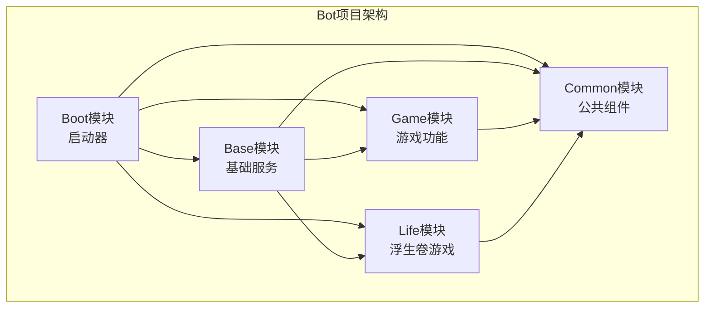
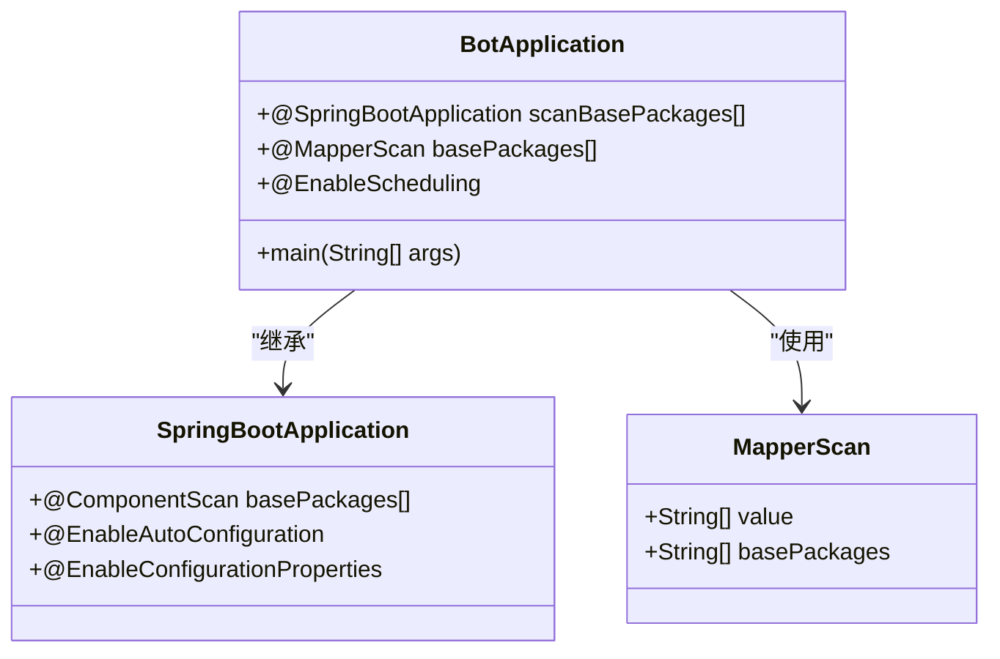
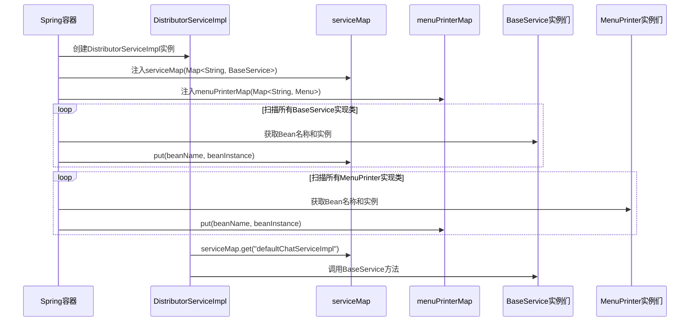
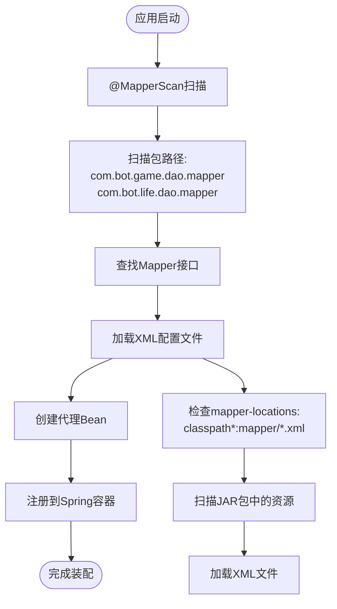
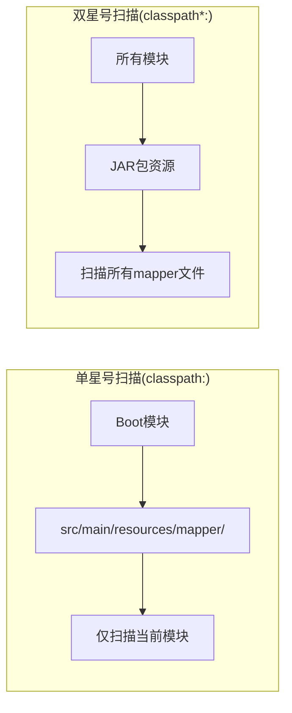
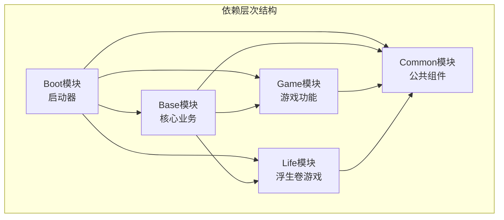
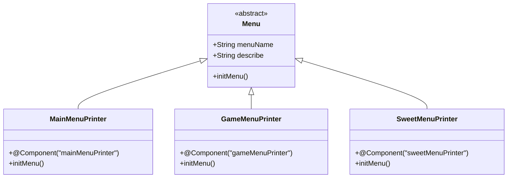

# Bot项目依赖注入机制深度解析

<cite>
**本文档引用的文件**
- [BotApplication.java](file://Boot/src/main/java/com/bot/boot/BotApplication.java)
- [DistributorServiceImpl.java](file://Base/src/main/java/com/bot/base/service/impl/DistributorServiceImpl.java)
- [application.properties](file://Boot/src/main/resources/application.properties)
- [Life_MyBatis_Configuration_Fix.md](file://Life_MyBatis_Configuration_Fix.md)
- [BaseService.java](file://Base/src/main/java/com/bot/base/service/BaseService.java)
- [MenuPrinter.java](file://Base/src/main/java/com/bot/base/chain/MenuPrinter.java)
- [GameMenuPrinter.java](file://Base/src/main/java/com/bot/base/chain/menu/GameMenuPrinter.java)
- [SweetMenuPrinter.java](file://Base/src/main/java/com/bot/base/chain/menu/SweetMenuPrinter.java)
- [MainMenuPrinter.java](file://Base/src/main/java/com/bot/base/chain/menu/MainMenuPrinter.java)
- [MapServiceImpl.java](file://Life/src/main/java/com/bot/life/service/impl/MapServiceImpl.java)
- [pom.xml](file://pom.xml)
- [Base/pom.xml](file://Base/pom.xml)
</cite>

## 目录
1. [项目架构概述](#项目架构概述)
2. [Spring IoC容器核心配置](#spring-ioC容器核心配置)
3. [DistributorServiceImpl依赖注入分析](#distributorserviceimpl依赖注入分析)
4. [MyBatis Mapper自动装配机制](#mybatis-mapper自动装配机制)
5. [多模块Bean管理策略](#多模块bean管理策略)
6. [最佳实践与设计原则](#最佳实践与设计原则)
7. [故障排除指南](#故障排除指南)
8. [总结](#总结)

## 项目架构概述

Bot项目采用典型的多模块Maven架构，通过Spring Boot构建微服务化的QQ机器人系统。整个项目分为五个主要模块：



**图表来源**
- [pom.xml](file://pom.xml#L1-L148)
- [Base/pom.xml](file://Base/pom.xml#L1-L46)

每个模块承担特定职责：
- **Boot模块**：Spring Boot启动器，负责应用初始化和全局配置
- **Base模块**：核心业务逻辑，包含服务接口和基础实现
- **Common模块**：共享工具类、常量定义和通用组件
- **Game模块**：传统游戏功能模块
- **Life模块**：浮生卷游戏系统

**章节来源**
- [pom.xml](file://pom.xml#L1-L148)
- [Base/pom.xml](file://Base/pom.xml#L1-L46)

## Spring IoC容器核心配置

### BotApplication启动类配置

BotApplication作为Spring Boot应用的入口点，通过注解配置实现了完整的IoC容器初始化：



**图表来源**
- [BotApplication.java](file://Boot/src/main/java/com/bot/boot/BotApplication.java#L12-L14)

关键配置特性：
1. **模块扫描范围**：`scanBasePackages`包含所有业务模块包路径
2. **MyBatis Mapper扫描**：`@MapperScan`指定数据访问层包路径
3. **定时任务支持**：`@EnableScheduling`启用异步任务调度

### 应用程序属性配置

Spring Boot通过application.properties文件提供全面的IoC容器配置：

| 配置项 | 值 | 作用 |
|--------|-----|------|
| `spring.profiles.active` | @profileActive@ | 环境激活标识 |
| `server.port` | 9091 | HTTP服务器端口 |
| `server.servlet.context-path` | /bot | 应用上下文路径 |
| `mybatis.mapper-locations` | classpath*:mapper/*.xml | Mapper XML文件位置 |
| `mybatis.type-aliases-package` | com.bot.game.mapper,com.bot.life.mapper | 实体类包路径 |

**章节来源**
- [BotApplication.java](file://Boot/src/main/java/com/bot/boot/BotApplication.java#L1-L22)
- [application.properties](file://Boot/src/main/resources/application.properties#L1-L70)

## DistributorServiceImpl依赖注入分析

### Map集合注入机制

DistributorServiceImpl展示了Spring IoC容器在集合类型注入方面的强大能力。通过`@Autowired`注解，Spring能够自动将所有符合条件的Bean注入到Map中：



**图表来源**
- [DistributorServiceImpl.java](file://Base/src/main/java/com/bot/base/service/impl/DistributorServiceImpl.java#L43-L47)

### 注入实现原理

Spring通过以下机制实现Map集合的自动装配：

1. **Bean名称提取**：使用`@Component`或`@Service`注解的`value`属性作为键名
2. **类型匹配**：根据泛型参数确定注入的目标类型
3. **自动装配**：在容器初始化阶段完成所有匹配Bean的收集和注入

### 具体注入分析

#### serviceMap注入
- **目标类型**：`Map<String, BaseService>`
- **注入时机**：容器启动时
- **键值对应**：Bean名称 → BaseService实例
- **典型键名**：`"defaultChatServiceImpl"`、`"gameHandler"`等

#### menuPrinterMap注入
- **目标类型**：`Map<String, Menu>`
- **注入时机**：容器启动时
- **键值对应**：Bean名称 → Menu实例
- **典型键名**：`"mainMenuPrinter"`、`"gameMenuPrinter"`等

**章节来源**
- [DistributorServiceImpl.java](file://Base/src/main/java/com/bot/base/service/impl/DistributorServiceImpl.java#L43-L47)

## MyBatis Mapper自动装配机制

### @MapperScan配置原理

Bot项目通过`@MapperScan`注解实现了跨模块的MyBatis Mapper自动装配：



**图表来源**
- [BotApplication.java](file://Boot/src/main/java/com/bot/boot/BotApplication.java#L13-L13)
- [application.properties](file://Boot/src/main/resources/application.properties#L68-L68)

### 多模块Mapper XML文件加载

Life_MyBatis_Configuration_Fix.md详细说明了多模块环境下Mapper XML文件的加载机制：

#### 关键配置对比

| 配置项 | 修复前 | 修复后 | 效果 |
|--------|--------|--------|------|
| `mybatis.mapper-locations` | `classpath:mapper/*.xml` | `classpath*:mapper/*.xml` | 支持JAR包内资源 |
| `mybatis.type-aliases-package` | `com.bot.game.mapper` | `com.bot.game.mapper,com.bot.life.mapper` | 扩展实体类扫描 |

#### 扫描机制差异



**图表来源**
- [Life_MyBatis_Configuration_Fix.md](file://Life_MyBatis_Configuration_Fix.md#L40-L52)

### Mapper代理Bean生成

Spring Boot MyBatis Starter通过以下流程生成Mapper代理Bean：

1. **接口扫描**：扫描`@MapperScan`指定包下的所有接口
2. **XML解析**：加载对应的XML映射文件
3. **代理创建**：使用JDK动态代理或CGLIB创建实现类
4. **Bean注册**：将代理对象注册到Spring容器

**章节来源**
- [application.properties](file://Boot/src/main/resources/application.properties#L67-L68)
- [Life_MyBatis_Configuration_Fix.md](file://Life_MyBatis_Configuration_Fix.md#L1-L120)

## 多模块Bean管理策略

### 模块间依赖关系

Bot项目通过Maven模块化构建实现了清晰的依赖层次：



**图表来源**
- [pom.xml](file://pom.xml#L6-L11)
- [Base/pom.xml](file://Base/pom.xml#L19-L34)

### Bean命名规范

项目遵循严格的Bean命名规范，确保依赖注入的准确性和可维护性：

#### 接口命名规范
- **BaseService**：基础服务接口，所有具体服务实现的基础
- **MenuPrinter**：菜单打印器接口，用于构建用户界面
- **各种Service接口**：如`MapService`、`PlayerService`等

#### 实现类命名规范
- **ServiceImpl后缀**：如`MapServiceImpl`、`PlayerServiceImpl`
- **注解使用**：统一使用`@Service`或`@Component`注解
- **Bean名称**：默认使用类名首字母小写作为Bean名称

#### Menu实现类特殊处理


**图表来源**
- [MainMenuPrinter.java](file://Base/src/main/java/com/bot/base/chain/menu/MainMenuPrinter.java#L12-L37)
- [GameMenuPrinter.java](file://Base/src/main/java/com/bot/base/chain/menu/GameMenuPrinter.java#L7-L19)
- [SweetMenuPrinter.java](file://Base/src/main/java/com/bot/base/chain/menu/SweetMenuPrinter.java#L12-L24)

### 循环依赖避免策略

项目通过以下策略避免循环依赖问题：

1. **接口抽象**：通过BaseService等接口解耦具体实现
2. **延迟注入**：使用`@Lazy`注解延迟非关键依赖的注入
3. **事件驱动**：通过Spring事件机制解耦模块间直接调用
4. **工厂模式**：使用工厂类管理复杂对象的创建和依赖

**章节来源**
- [BaseService.java](file://Base/src/main/java/com/bot/base/service/BaseService.java#L1-L18)
- [MapServiceImpl.java](file://Life/src/main/java/com/bot/life/service/impl/MapServiceImpl.java#L17-L18)

## 最佳实践与设计原则

### 自定义Service注入最佳实践

#### 接口设计原则
1. **单一职责**：每个Service接口只负责一个业务领域
2. **依赖倒置**：高层模块不依赖低层模块，都依赖于抽象
3. **开闭原则**：对扩展开放，对修改关闭

#### 实现类注解使用
```java
@Service("customService")  // 显式指定Bean名称
public class CustomServiceImpl implements CustomService {
    // 实现细节
}
```

#### 避免循环依赖策略
1. **重构设计**：将共同依赖提取到新的接口中
2. **使用事件**：通过Spring ApplicationEvent解耦
3. **延迟加载**：使用`@Lazy`注解

### 配置管理最佳实践

#### 属性文件组织
- **环境隔离**：dev/prod环境配置分离
- **外部化配置**：敏感信息外部化存储
- **配置验证**：使用`@ConfigurationProperties`进行配置校验

#### 条件装配
```java
@Configuration
@ConditionalOnProperty(name = "feature.enabled", havingValue = "true")
public class FeatureConfiguration {
    // 条件装配逻辑
}
```

### 性能优化建议

#### Bean生命周期优化
1. **懒加载**：对于非关键Bean使用`@Lazy`注解
2. **原型Bean**：对于无状态服务使用`@Scope("prototype")`
3. **缓存策略**：合理使用`@Cacheable`注解

#### 内存管理
1. **及时释放**：避免长时间持有大量对象引用
2. **弱引用**：对于可选缓存使用WeakReference
3. **监控指标**：使用Micrometer监控Bean使用情况

## 故障排除指南

### 常见注入失败问题

#### 1. Bean未被扫描到
**症状**：`NoSuchBeanDefinitionException`
**解决方案**：
- 检查`@ComponentScan`或`@MapperScan`配置
- 确认包路径正确且包含目标类
- 验证注解使用正确

#### 2. Map注入为空
**症状**：注入的Map集合大小为0
**解决方案**：
- 检查实现类是否标注了正确注解
- 确认Bean名称符合预期
- 验证类型匹配正确

#### 3. MyBatis Mapper未找到
**症状**：`BindingException: Invalid bound statement`
**解决方案**：
- 检查`mybatis.mapper-locations`配置
- 确认XML文件路径正确
- 验证Mapper接口与XML文件匹配

### 调试技巧

#### 启用调试日志
```properties
logging.level.org.springframework=DEBUG
logging.level.com.bot=DEBUG
```

#### Bean信息查看
```bash
curl http://localhost:9091/actuator/beans
```

#### 依赖关系分析
```bash
mvn dependency:tree
```

## 总结

Bot项目的依赖注入机制展现了Spring框架在复杂多模块项目中的强大能力。通过合理的架构设计和配置管理，实现了：

1. **模块化管理**：清晰的模块边界和依赖关系
2. **自动装配**：智能的Bean发现和注入机制
3. **扩展性**：易于添加新功能和服务
4. **可维护性**：良好的代码组织和命名规范

### 核心优势

- **零配置注入**：通过约定优于配置的原则简化开发
- **类型安全**：编译时类型检查确保注入正确性
- **运行时优化**：Spring容器的性能优化机制
- **测试友好**：易于进行单元测试和集成测试

### 未来发展方向

1. **云原生改造**：向Kubernetes和微服务架构演进
2. **可观测性增强**：集成更完善的监控和追踪系统
3. **性能优化**：进一步优化启动时间和内存使用
4. **安全性提升**：加强依赖注入的安全性控制

通过深入理解这些依赖注入机制，开发者可以更好地利用Spring框架的强大功能，构建高质量的企业级应用系统。