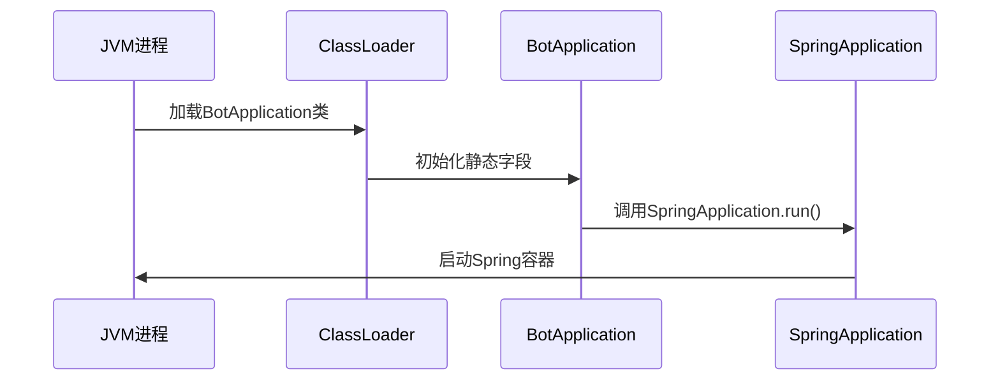
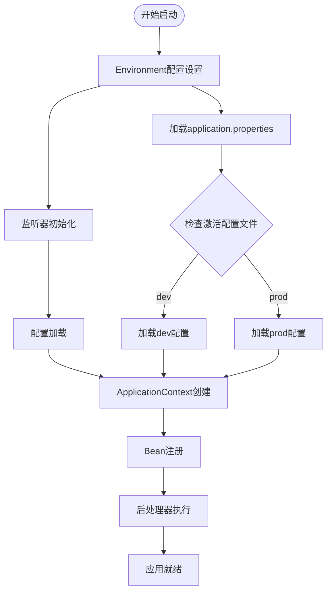
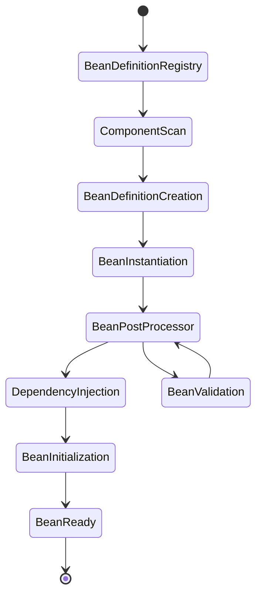
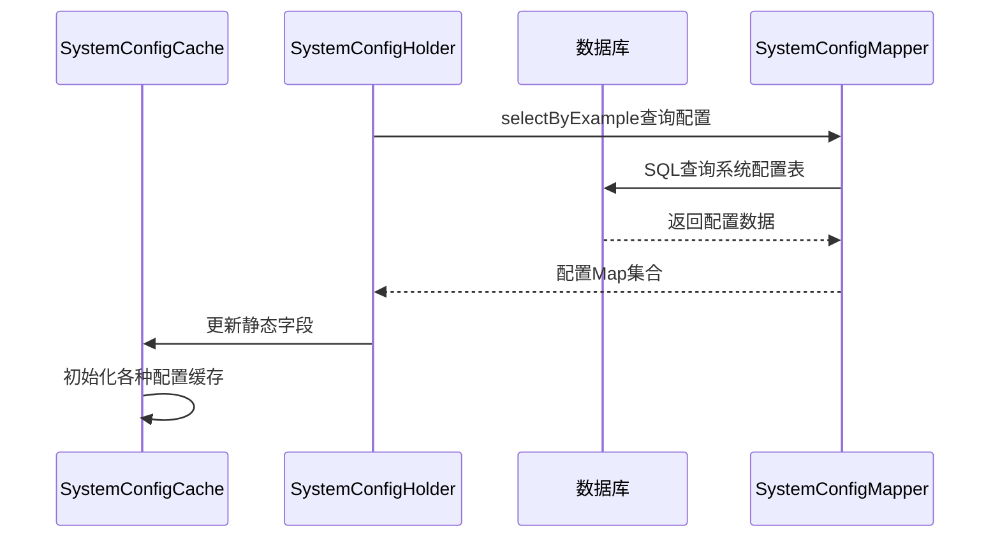
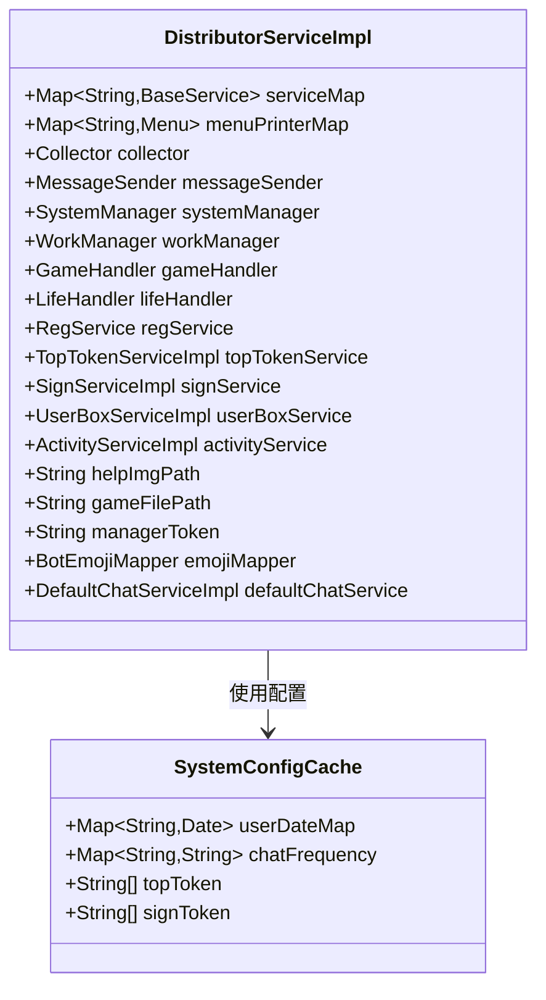

# Bot项目启动流程文档

<cite>
**本文档引用的文件**
- [BotApplication.java](file://Boot/src/main/java/com/bot/boot/BotApplication.java)
- [DistributorServiceImpl.java](file://Base/src/main/java/com/bot/base/service/impl/DistributorServiceImpl.java)
- [SystemConfigCache.java](file://Common/src/main/java/com/bot/common/config/SystemConfigCache.java)
- [SystemConfigHolder.java](file://Game/src/main/java/com/bot/game/service/SystemConfigHolder.java)
- [application.properties](file://Boot/src/main/resources/application.properties)
- [application-dev.properties](file://Boot/src/main/resources/application-dev.properties)
- [logback-spring.xml](file://Boot/src/main/resources/logback-spring.xml)
- [pom.xml](file://pom.xml)
</cite>

## 目录
1. [项目概述](#项目概述)
2. [启动流程架构](#启动流程架构)
3. [JVM进程启动阶段](#jvm进程启动阶段)
4. [SpringApplication.run()核心流程](#springapplicationrun核心流程)
5. [配置加载与解析](#配置加载与解析)
6. [ApplicationContext创建与Bean扫描](#applicationcontext创建与bean扫描)
7. [SystemConfigCache静态字段初始化](#systemconfigcache静态字段初始化)
8. [DistributorServiceImpl依赖注入分析](#distributorserviceimpl依赖注入分析)
9. [启动日志关键节点解读](#启动日志关键节点解读)
10. [常见启动问题排查](#常见启动问题排查)
11. [总结](#总结)

## 项目概述

Bot项目是一个基于Spring Boot框架的QQ机器人应用，采用多模块架构设计，包含Boot、Base、Common、Game、Life五个主要模块。项目通过BotApplication作为启动入口，实现了从JVM进程启动到服务就绪的完整初始化流程。

### 项目架构特点
- **多模块Maven项目**：采用父子POM结构，模块间依赖清晰
- **Spring Boot 2.3.4**：基于Spring Framework的企业级应用框架
- **MyBatis集成**：提供ORM数据访问层支持
- **多环境配置**：支持dev和prod两种运行环境
- **分布式部署**：具备良好的扩展性和维护性

## 启动流程架构

```mermaid
graph TD
A[JVM进程启动] --> B[ClassLoader加载BotApplication]
B --> C[执行main方法]
C --> D[SpringApplication.run启动]
D --> E[Environment配置加载]
E --> F[ApplicationContext创建]
F --> G[Bean扫描与注册]
G --> H[SystemConfigCache初始化]
H --> I[DistributorServiceImpl依赖注入]
I --> J[服务就绪]
subgraph "配置加载阶段"
E1[application.properties]
E2[application-dev.properties]
E3[环境变量]
E --> E1
E --> E2
E --> E3
end
subgraph "Bean初始化阶段"
G1[@ComponentScan扫描]
G2[Mapper接口代理]
G3[Service组件注册]
G --> G1
G --> G2
G --> G3
end
```

**图表来源**
- [BotApplication.java](file://Boot/src/main/java/com/bot/boot/BotApplication.java#L17-L18)
- [SystemConfigHolder.java](file://Game/src/main/java/com/bot/game/service/SystemConfigHolder.java#L34-L48)

## JVM进程启动阶段

### 类加载器初始化

当JVM启动时，首先通过Bootstrap ClassLoader加载Java核心类库，然后通过Extension ClassLoader加载扩展类，最后通过Application ClassLoader加载应用程序类路径下的类。



**图表来源**
- [BotApplication.java](file://Boot/src/main/java/com/bot/boot/BotApplication.java#L17-L18)

### BotApplication类初始化

BotApplication类作为Spring Boot应用的启动入口，其静态字段在类加载时即被初始化：

- **@SpringBootApplication注解**：启用Spring Boot自动配置、组件扫描和属性绑定
- **@MapperScan注解**：指定MyBatis Mapper接口扫描路径
- **@EnableScheduling注解**：启用定时任务支持

**章节来源**
- [BotApplication.java](file://Boot/src/main/java/com/bot/boot/BotApplication.java#L12-L14)

## SpringApplication.run()核心流程

### 启动参数传递

SpringApplication.run(BotApplication.class, args)方法接收两个参数：
- **primarySource**：启动类类型，用于确定应用上下文配置
- **args**：命令行参数数组，可用于覆盖配置属性

### 核心执行流程



**图表来源**
- [application.properties](file://Boot/src/main/resources/application.properties#L2)
- [application-dev.properties](file://Boot/src/main/resources/application-dev.properties#L12)

**章节来源**
- [BotApplication.java](file://Boot/src/main/java/com/bot/boot/BotApplication.java#L17-L18)

## 配置加载与解析

### 配置文件层次结构

Spring Boot采用多层次的配置文件加载机制：

| 配置层级 | 文件位置 | 优先级 | 用途 |
|---------|---------|--------|------|
| 基础配置 | application.properties | 最低 | 默认配置项 |
| 环境配置 | application-{profile}.properties | 中等 | 环境特定配置 |
| 外部配置 | 命令行参数、环境变量 | 最高 | 动态配置覆盖 |

### 关键配置项解析

#### 数据库连接配置
- **spring.datasource.url**：MySQL数据库连接地址
- **spring.datasource.username/password**：数据库认证凭据
- **spring.datasource.driver-class-name**：JDBC驱动类

#### 日志配置
- **logback.rootPath**：日志文件根目录
- **logback.level**：日志级别设置
- **logback.pattern**：日志格式模板

#### 服务端口配置
- **server.port**：HTTP服务监听端口（9091）
- **server.servlet.context-path**：应用上下文路径（/bot）

**章节来源**
- [application.properties](file://Boot/src/main/resources/application.properties#L47-L69)
- [application-dev.properties](file://Boot/src/main/resources/application-dev.properties#L33-L58)

## ApplicationContext创建与Bean扫描

### 组件扫描配置

BotApplication通过@SprngBootApplication注解的scanBasePackages参数指定扫描范围：

```java
scanBasePackages = {
    "com.bot.boot",          // Boot模块启动类
    "com.bot.base",          // Base业务模块
    "com.bot.game",          // Game游戏模块  
    "com.bot.life",          // Life生活模块
    "com.bot.common.loader"  // 公共加载器
}
```

### MyBatis Mapper扫描

```java
@MapperScan({
    "com.bot.game.dao.mapper",      // Game模块Mapper
    "com.bot.life.dao.mapper"       // Life模块Mapper
})
```

### Bean生命周期管理



**图表来源**
- [BotApplication.java](file://Boot/src/main/java/com/bot/boot/BotApplication.java#L12-L13)

**章节来源**
- [BotApplication.java](file://Boot/src/main/java/com/bot/boot/BotApplication.java#L12-L14)

## SystemConfigCache静态字段初始化

### 初始化时机分析

SystemConfigCache的静态字段在以下情况下被初始化：

1. **类加载时**：静态字段被声明但未赋值
2. **SystemConfigHolder初始化时**：通过@PostConstruct注解的方法执行
3. **DistributorServiceImpl使用时**：静态字段被访问

### SystemConfigHolder组件作用

SystemConfigHolder负责从数据库加载配置数据并填充到SystemConfigCache静态字段中：



**图表来源**
- [SystemConfigHolder.java](file://Game/src/main/java/com/bot/game/service/SystemConfigHolder.java#L34-L48)

### 配置数据类型分类

| 配置类型 | 字段名称 | 数据来源 | 用途说明 |
|---------|---------|---------|---------|
| 基础配置 | baseUrl, token, wId | system_config表 | 系统基础参数 |
| 权限配置 | topToken, signToken | 分割字符串存储 | 用户权限控制 |
| 用户配置 | userDateMap, userChatEngine | bot_user_config表 | 用户个性化设置 |
| 功能开关 | chatFrequency, emojiUser | 用户偏好设置 | 功能启用控制 |

**章节来源**
- [SystemConfigCache.java](file://Common/src/main/java/com/bot/common/config/SystemConfigCache.java#L10-L114)
- [SystemConfigHolder.java](file://Game/src/main/java/com/bot/game/service/SystemConfigHolder.java#L34-L82)

## DistributorServiceImpl依赖注入分析

### 注入字段概览

DistributorServiceImpl作为核心业务处理器，通过@Autowired和@Resource注解注入多个依赖：



**图表来源**
- [DistributorServiceImpl.java](file://Base/src/main/java/com/bot/base/service/impl/DistributorServiceImpl.java#L42-L102)

### 注入顺序与依赖关系

根据Spring容器的依赖解析机制，DistributorServiceImpl的注入遵循以下顺序：

1. **基础服务注入**：MessageSender、Collector等通用组件
2. **业务服务注入**：GameHandler、LifeHandler等模块服务
3. **工具类注入**：Mapper接口、配置属性等
4. **特殊注入**：@Resource注解的字段按名称匹配

### SystemConfigCache在DistributorServiceImpl中的使用

DistributorServiceImpl在多个方法中直接使用SystemConfigCache的静态字段：

- **用户状态检查**：`SystemConfigCache.userDateMap`获取用户到期时间
- **聊天频率控制**：`SystemConfigCache.chatFrequency`控制群聊回复频率
- **权限验证**：`SystemConfigCache.topToken`、`SystemConfigCache.signToken`进行权限校验

**章节来源**
- [DistributorServiceImpl.java](file://Base/src/main/java/com/bot/base/service/impl/DistributorServiceImpl.java#L174-L175)
- [DistributorServiceImpl.java](file://Base/src/main/java/com/bot/base/service/impl/DistributorServiceImpl.java#L218-L219)

## 启动日志关键节点解读

### 日志配置与输出

项目采用Logback作为日志框架，通过logback-spring.xml配置日志行为：

```xml
<springProperty scope="context" name="logback.rootPath" source="logback.rootPath"/>
<springProperty scope="context" name="logback.level" source="logback.level"/>
```

### 关键启动日志节点

| 日志级别 | 关键节点 | 含义 | 排查重点 |
|---------|---------|------|---------|
| INFO | StartupLogger | 应用启动完成 | 确认所有模块加载成功 |
| WARN | ComponentScan | 组件扫描警告 | 检查是否有遗漏的Bean |
| ERROR | BeanCreation | Bean创建失败 | 分析依赖注入异常 |
| DEBUG | DataSource | 数据源连接 | 验证数据库连接状态 |

### 启动流程日志跟踪

```mermaid
flowchart LR
A[应用启动] --> B[配置加载完成]
B --> C[Bean扫描开始]
C --> D[Bean注册完成]
D --> E[依赖注入完成]
E --> F[服务初始化完成]
F --> G[应用就绪]
A -.-> A1[日志配置初始化]
B -.-> B1[application.properties加载]
C -.-> C1[@ComponentScan执行]
D -.-> D1[Bean定义注册]
E -.-> E1[依赖解析验证]
F -.-> F1[业务服务启动]
G -.-> G1[HTTP服务启动]
```

**图表来源**
- [logback-spring.xml](file://Boot/src/main/resources/logback-spring.xml#L4-L8)

**章节来源**
- [logback-spring.xml](file://Boot/src/main/resources/logback-spring.xml#L1-L59)

## 常见启动问题排查

### 模块加载失败

**问题现象**：ClassNotFoundException或NoSuchBeanDefinitionException

**排查步骤**：
1. 检查pom.xml依赖配置是否完整
2. 验证@ComponentScan包路径是否正确
3. 确认模块间的依赖关系是否建立

**解决方案**：
```java
// 确保BotApplication包含所有模块包
@SpringBootApplicaton(scanBasePackages = {
    "com.bot.boot",
    "com.bot.base", 
    "com.bot.game",
    "com.bot.life",
    "com.bot.common.loader"
})
```

### Mapper扫描异常

**问题现象**：MyBatis Mapper接口无法注入

**排查重点**：
- @MapperScan注解是否包含所有模块的mapper包
- Mapper XML文件是否正确打包
- 数据库连接配置是否正确

### 配置加载失败

**问题现象**：@Value注入的配置为空

**排查方法**：
1. 检查application.properties文件语法
2. 验证配置文件是否正确加载
3. 确认环境变量覆盖是否生效

**章节来源**
- [BotApplication.java](file://Boot/src/main/java/com/bot/boot/BotApplication.java#L12-L13)

## 总结

Bot项目的启动流程体现了现代Spring Boot应用的最佳实践：

### 启动流程特点

1. **模块化设计**：清晰的模块边界和依赖关系
2. **配置驱动**：灵活的外部化配置机制
3. **自动化配置**：减少手动配置的工作量
4. **依赖注入**：强大的IoC容器支持

### 关键技术要点

- **SystemConfigCache静态字段**：在Spring容器完全初始化前加载配置数据
- **DistributorServiceImpl依赖注入**：展示了复杂依赖关系的处理方式
- **多模块Bean扫描**：确保所有模块的组件都被正确识别和注册

### 运维建议

1. **监控启动日志**：重点关注配置加载和Bean注册阶段
2. **验证数据库连接**：确保MyBatis配置和数据库连接正常
3. **测试模块功能**：验证各业务模块的独立性和集成性

通过深入理解Bot项目的启动流程，运维人员可以更好地定位和解决启动过程中遇到的各种问题，确保系统的稳定运行。