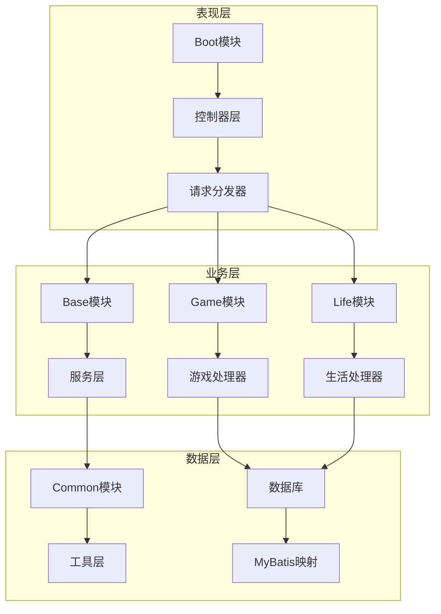
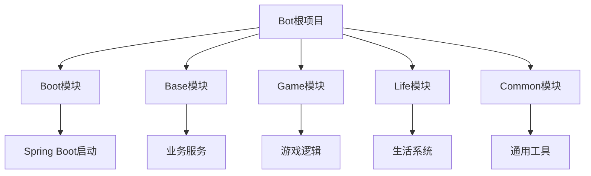
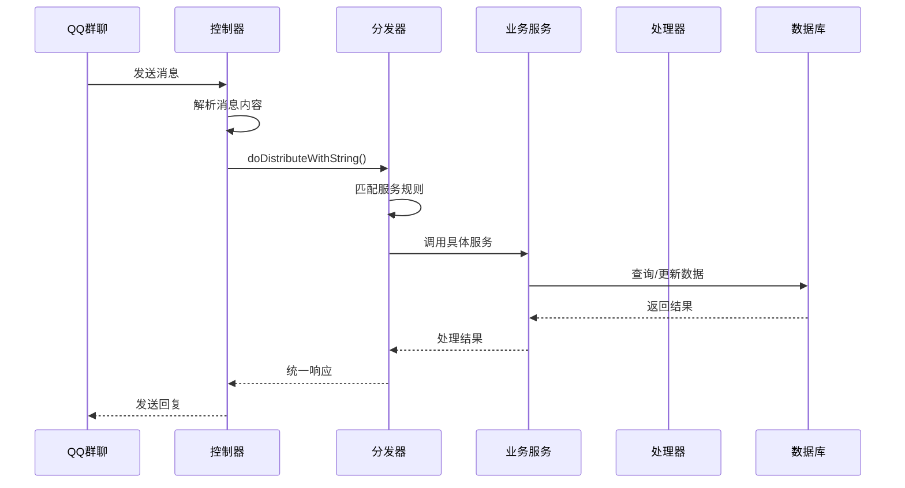
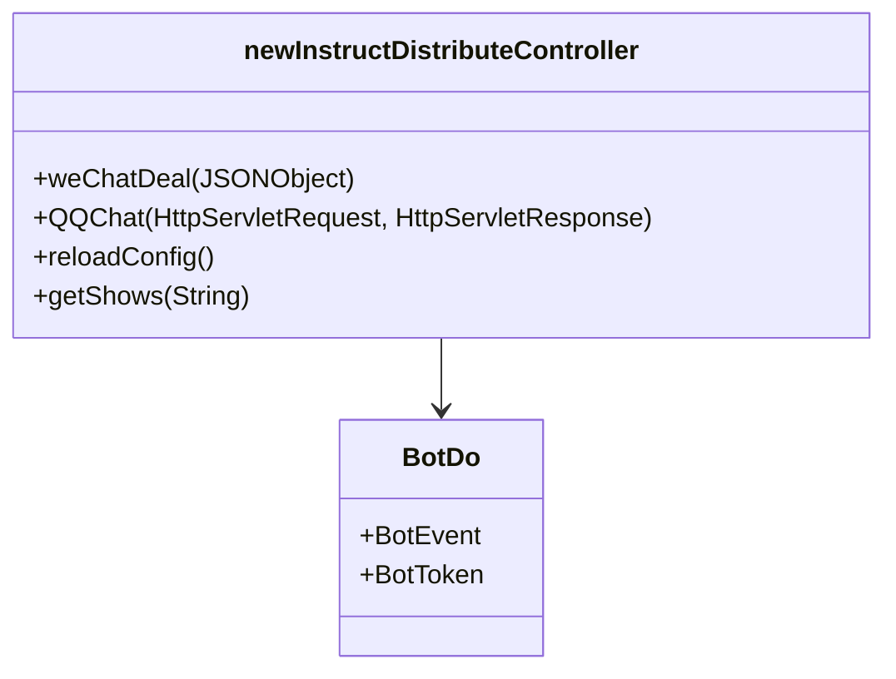
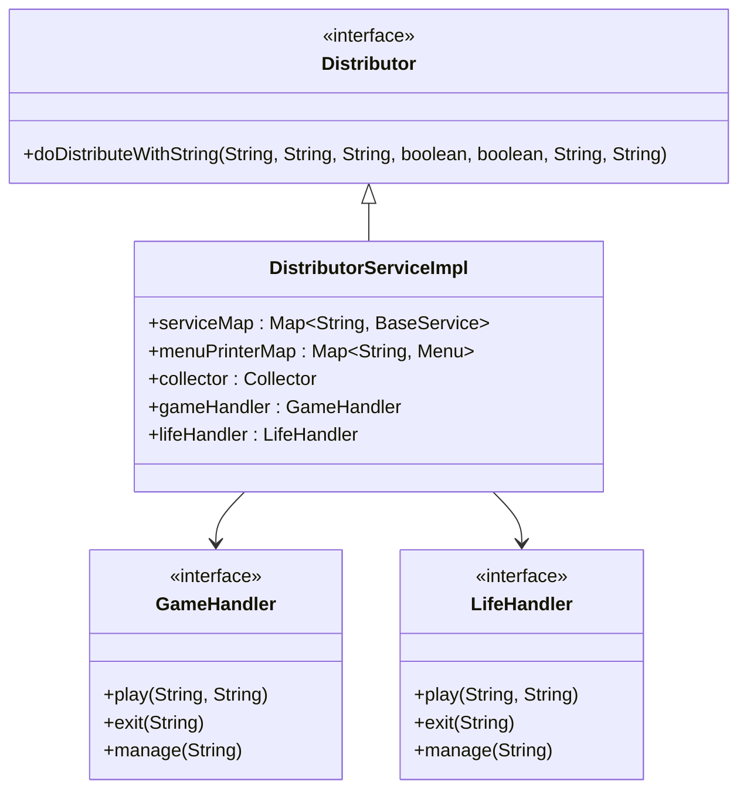
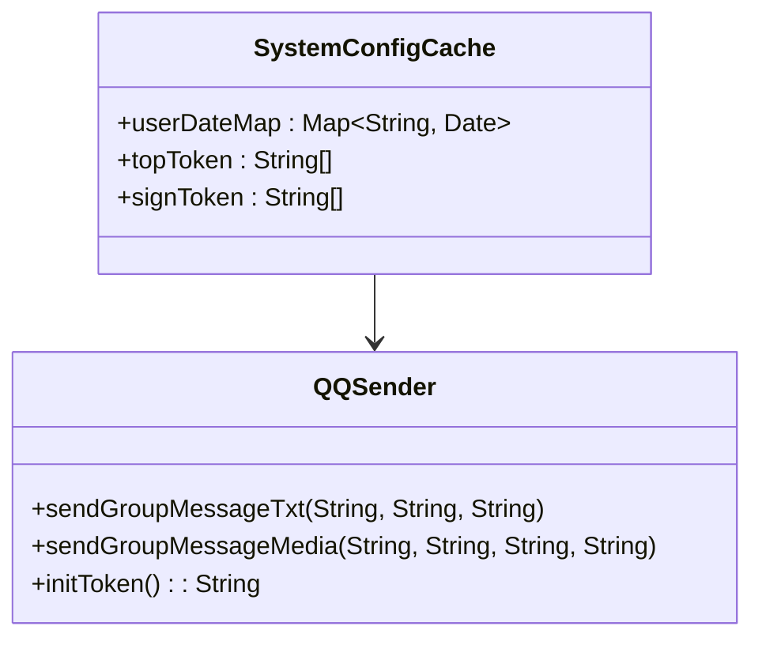
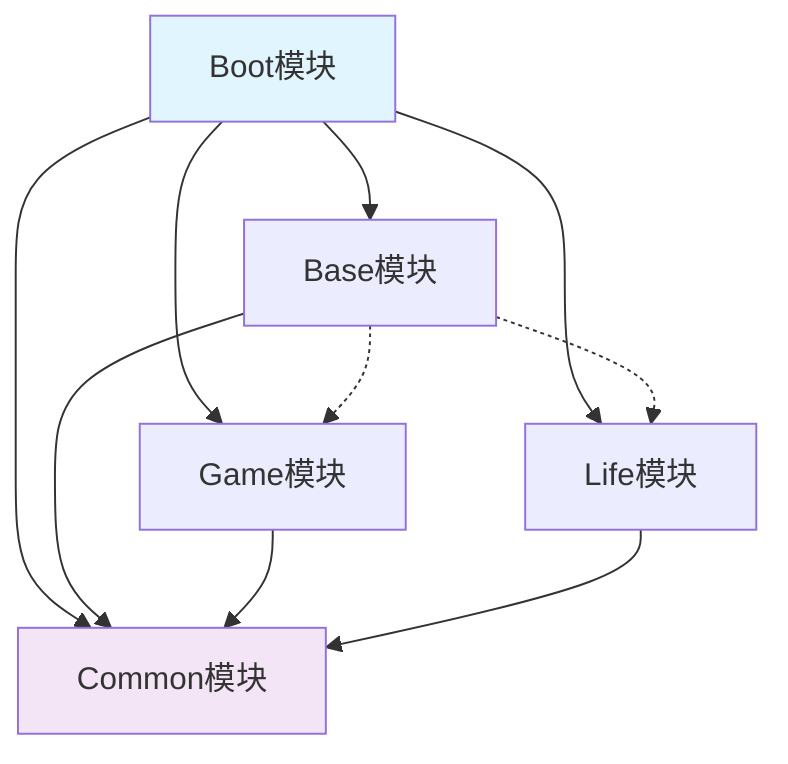
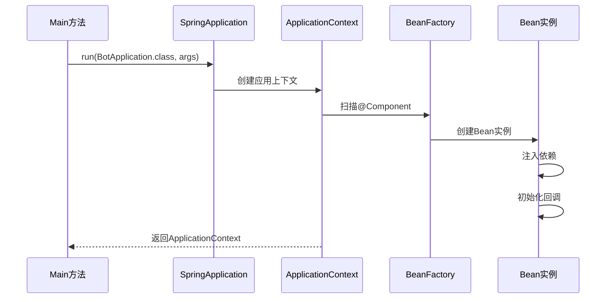
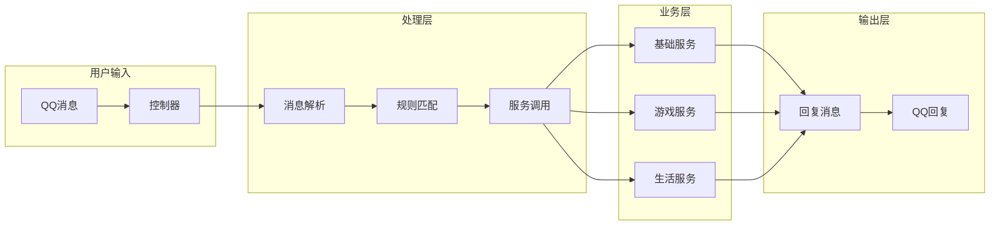

# 核心架构

<cite>
**本文档引用的文件**
- [BotApplication.java](file://Boot/src/main/java/com/bot/boot/BotApplication.java)
- [newInstructDistributeController.java](file://Boot/src/main/java/com/bot/boot/controller/newInstructDistributeController.java)
- [DistributorServiceImpl.java](file://Base/src/main/java/com/bot/base/service/impl/DistributorServiceImpl.java)
- [QQSender.java](file://Common/src/main/java/com/bot/common/util/QQSender.java)
- [QQGroupMessage.java](file://Common/src/main/java/com/bot/common/dto/qqsender/QQGroupMessage.java)
- [GameHandler.java](file://Game/src/main/java/com/bot/game/service/GameHandler.java)
- [LifeHandlerImpl.java](file://Life/src/main/java/com/bot/life/service/impl/LifeHandlerImpl.java)
- [pom.xml](file://pom.xml)
- [application.properties](file://Boot/src/main/resources/application.properties)
- [BaseConsts.java](file://Common/src/main/java/com/bot/common/constant/BaseConsts.java)
</cite>

## 目录
1. [项目概述](#项目概述)
2. [整体架构设计](#整体架构设计)
3. [Boot模块详解](#boot模块详解)
4. [模块扫描与依赖管理](#模块扫描与依赖管理)
5. [服务调用链路分析](#服务调用链路分析)
6. [Spring Boot MVC分层架构](#spring-boot-mvc分层架构)
7. [模块间依赖关系](#模块间依赖关系)
8. [Bean扫描机制](#bean扫描机制)
9. [Spring上下文初始化流程](#spring上下文初始化流程)
10. [架构优势与最佳实践](#架构优势与最佳实践)

## 项目概述

Bot项目是一个基于Spring Boot的QQ机器人系统，采用多模块MVC分层架构设计。项目通过Boot模块作为系统入口点，整合Base、Game、Life、Common等多个业务模块，实现了完整的聊天机器人功能体系。

### 核心特性
- **模块化设计**：清晰的模块边界，便于维护和扩展
- **MVC分层**：严格的分层架构，职责明确
- **多业务支持**：涵盖游戏、生活、娱乐等多种功能
- **Spring Boot集成**：充分利用Spring生态系统的便利性

## 整体架构设计



**架构图源文件**
- [BotApplication.java](file://Boot/src/main/java/com/bot/boot/BotApplication.java#L12-L14)
- [newInstructDistributeController.java](file://Boot/src/main/java/com/bot/boot/controller/newInstructDistributeController.java#L43-L46)

## Boot模块详解

Boot模块作为整个系统的启动入口，承担着以下核心职责：

### 启动类配置
BotApplication类通过以下注解实现系统初始化：
- `@SpringBootApplication`：标准Spring Boot应用注解
- `@MapperScan`：扫描MyBatis Mapper接口
- `@EnableScheduling`：启用定时任务支持

### 扫描范围配置
```java
@SpringBootApplication(scanBasePackages = {
    "com.bot.boot",
    "com.bot.base", 
    "com.bot.game", 
    "com.bot.life", 
    "com.bot.common.loader"
})
@MapperScan({
    "com.bot.game.dao.mapper", 
    "com.bot.life.dao.mapper"
})
```

**节源文件**
- [BotApplication.java](file://Boot/src/main/java/com/bot/boot/BotApplication.java#L12-L14)

## 模块扫描与依赖管理

### Maven多模块结构



**架构图源文件**
- [pom.xml](file://pom.xml#L6-L11)

### 依赖关系分析

| 模块 | 主要依赖 | 提供功能 |
|------|----------|----------|
| Boot | Spring Boot Starter Web | HTTP请求处理、应用启动 |
| Base | Spring Boot Starter | 业务服务、消息分发 |
| Game | MyBatis、Game模块实体 | 游戏逻辑处理 |
| Life | MyBatis、Life模块实体 | 生活系统处理 |
| Common | 工具类、枚举定义 | 通用配置、工具方法 |

**节源文件**
- [pom.xml](file://pom.xml#L37-L123)

## 服务调用链路分析

### 请求处理流程



**序列图源文件**
- [newInstructDistributeController.java](file://Boot/src/main/java/com/bot/boot/controller/newInstructDistributeController.java#L222-L251)
- [DistributorServiceImpl.java](file://Base/src/main/java/com/bot/base/service/impl/DistributorServiceImpl.java#L125-L198)

### 核心调用链路详解

#### 1. 控制器层处理
控制器接收QQ消息后，通过QQDealDistributor进行初步解析和转换。

#### 2. 分发器处理
DistributorServiceImpl负责：
- 用户状态验证
- 服务匹配
- 游戏模式切换
- 默认聊天处理

#### 3. 业务服务处理
根据消息内容匹配相应的业务服务，如：
- 答案之书服务
- 运势占卜服务  
- 情话生成服务
- 音乐播放服务

**节源文件**
- [DistributorServiceImpl.java](file://Base/src/main/java/com/bot/base/service/impl/DistributorServiceImpl.java#L216-L361)

## Spring Boot MVC分层架构

### 表现层（Presentation Layer）



**类图源文件**
- [newInstructDistributeController.java](file://Boot/src/main/java/com/bot/boot/controller/newInstructDistributeController.java#L43-L255)

### 业务层（Business Layer）



**类图源文件**
- [Distributor.java](file://Base/src/main/java/com/bot/base/service/Distributor.java#L12-L37)
- [DistributorServiceImpl.java](file://Base/src/main/java/com/bot/base/service/impl/DistributorServiceImpl.java#L41-L95)
- [GameHandler.java](file://Game/src/main/java/com/bot/game/service/GameHandler.java#L7-L30)

### 数据访问层（Data Access Layer）



**类图源文件**
- [QQSender.java](file://Common/src/main/java/com/bot/common/util/QQSender.java#L16-L104)

## 模块间依赖关系

### 依赖关系图



**依赖图源文件**
- [pom.xml](file://pom.xml#L6-L11)

### 模块职责划分

| 模块 | 核心职责 | 主要组件 |
|------|----------|----------|
| Boot | 应用启动、HTTP请求处理 | BotApplication、控制器 |
| Base | 业务服务、消息分发 | Distributor、各种ServiceImpl |
| Game | 游戏逻辑处理 | GameHandler、游戏服务 |
| Life | 生活系统处理 | LifeHandler、生活服务 |
| Common | 通用工具、配置 | 工具类、枚举、常量 |

## Bean扫描机制

### 自动装配原理

```mermaid
flowchart TD
A[Spring Boot启动] --> B[扫描@Component注解]
B --> C[创建Bean实例]
C --> D[注入依赖]
D --> E[初始化Bean]
E --> F[注册到容器]
G[Map注入] --> H[按类型匹配]
H --> I[存储到Map中]
J[@Autowired] --> K[按类型查找]
K --> L[按名称匹配]
L --> M[注入到字段]
```

**流程图源文件**
- [DistributorServiceImpl.java](file://Base/src/main/java/com/bot/base/service/impl/DistributorServiceImpl.java#L43-L68)

### 关键注入点

#### 1. 服务映射注入
```java
@Autowired
private Map<String, BaseService> serviceMap;
```

#### 2. 菜单映射注入
```java
@Autowired
private Map<String, Menu> menuPrinterMap;
```

#### 3. 处理器注入
```java
@Autowired
private GameHandler gameHandler;

@Autowired
private LifeHandler lifeHandler;
```

**节源文件**
- [DistributorServiceImpl.java](file://Base/src/main/java/com/bot/base/service/impl/DistributorServiceImpl.java#L43-L68)

## Spring上下文初始化流程

### 初始化时序图



**时序图源文件**
- [BotApplication.java](file://Boot/src/main/java/com/bot/boot/BotApplication.java#L17-L19)

### 关键初始化步骤

1. **应用启动**：SpringApplication.run()启动应用
2. **上下文创建**：创建ApplicationContext实例
3. **Bean扫描**：扫描指定包路径下的组件
4. **依赖注入**：自动装配各个Bean的依赖关系
5. **初始化完成**：应用启动完成，开始监听请求

**节源文件**
- [BotApplication.java](file://Boot/src/main/java/com/bot/boot/BotApplication.java#L17-L19)

## 架构优势与最佳实践

### 架构优势

#### 1. 模块化设计
- **高内聚低耦合**：每个模块职责单一，模块间依赖清晰
- **易于维护**：模块独立开发、测试、部署
- **可扩展性强**：新增功能只需添加新模块

#### 2. 分层架构
- **职责分离**：表现层、业务层、数据层职责明确
- **可测试性**：每层都可以独立进行单元测试
- **可替换性**：某层实现可以独立替换而不影响其他层

#### 3. Spring Boot集成
- **快速开发**：约定优于配置，减少样板代码
- **自动配置**：智能的Bean自动装配
- **生产就绪**：内置监控、健康检查等功能

### 最佳实践建议

#### 1. 模块设计原则
- **单一职责**：每个模块只负责一个业务领域
- **最小依赖**：模块间依赖关系尽量简单
- **接口隔离**：通过接口定义模块间契约

#### 2. 代码组织规范
- **包结构清晰**：按功能域组织包结构
- **命名规范**：遵循Java命名规范
- **注释完整**：关键类和方法提供完整注释

#### 3. 性能优化策略
- **懒加载**：非核心功能采用懒加载
- **缓存机制**：合理使用缓存提升性能
- **异步处理**：耗时操作采用异步处理

### 初学者架构图解



**架构图源文件**
- [newInstructDistributeController.java](file://Boot/src/main/java/com/bot/boot/controller/newInstructDistributeController.java#L222-L251)
- [DistributorServiceImpl.java](file://Base/src/main/java/com/bot/base/service/impl/DistributorServiceImpl.java#L216-L361)

### 高级开发者分析要点

#### 1. 依赖注入深度分析
- **Map注入机制**：如何实现动态服务发现
- **循环依赖处理**：Spring如何解决循环依赖问题
- **作用域管理**：Singleton、Prototype等作用域的应用

#### 2. AOP切面编程
- **全局异常处理**：GlobalExceptionHandler的作用
- **事务管理**：数据库事务的自动管理
- **性能监控**：方法执行时间的监控

#### 3. 配置管理
- **多环境配置**：dev、prod环境的配置管理
- **动态配置**：运行时配置的更新机制
- **安全配置**：敏感信息的安全管理

#### 4. 并发处理
- **线程池管理**：ThreadPoolManager的使用
- **并发控制**：高并发场景下的处理策略
- **资源竞争**：数据库连接、文件访问的竞争处理

通过深入理解这些架构设计和实现细节，开发者可以更好地维护和扩展Bot项目，同时也能为类似项目的架构设计提供参考。