# Bot项目模块架构文档

<cite>
**本文档引用的文件**
- [BotApplication.java](file://Boot/src/main/java/com/bot/boot/BotApplication.java)
- [SystemConfigCache.java](file://Common/src/main/java/com/bot/common/config/SystemConfigCache.java)
- [DistributorServiceImpl.java](file://Base/src/main/java/com/bot/base/service/impl/DistributorServiceImpl.java)
- [GameHandler.java](file://Game/src/main/java/com/bot/game/service/GameHandler.java)
- [GameHandlerServiceImpl.java](file://Game/src/main/java/com/bot/game/service/impl/GameHandlerServiceImpl.java)
- [LifeHandler.java](file://Life/src/main/java/com/bot/life/service/LifeHandler.java)
- [LifeHandlerImpl.java](file://Life/src/main/java/com/bot/life/service/impl/LifeHandlerImpl.java)
- [Life_Spring_Integration_Fix.md](file://Life_Spring_Integration_Fix.md)
- [pom.xml](file://pom.xml)
- [Boot/pom.xml](file://Boot/pom.xml)
- [Base/pom.xml](file://Base/pom.xml)
</cite>

## 目录
1. [项目概述](#项目概述)
2. [模块架构总览](#模块架构总览)
3. [Boot模块：启动入口](#boot模块启动入口)
4. [Common模块：全局配置与缓存](#common模块全局配置与缓存)
5. [Base模块：核心分发器](#base模块核心分发器)
6. [Game模块：游戏业务逻辑](#game模块游戏业务逻辑)
7. [Life模块：浮生卷游戏](#life模块浮生卷游戏)
8. [模块依赖关系分析](#模块依赖关系分析)
9. [Spring集成机制](#spring集成机制)
10. [跨模块Bean注入原理](#跨模块bean注入原理)
11. [MyBatis Mapper扫描机制](#mybatis-mapper扫描机制)
12. [故障排除指南](#故障排除指南)
13. [总结](#总结)

## 项目概述

Bot项目是一个基于Spring Boot的多模块QQ机器人应用，采用Maven多模块架构设计。项目通过清晰的模块划分实现了高内聚、低耦合的架构设计，每个模块承担特定的职责，通过Spring框架的依赖注入机制实现模块间的协作。

### 核心特性
- **模块化设计**：五个独立模块，各司其职
- **Spring Boot集成**：统一的启动和配置管理
- **MyBatis数据访问**：完整的DAO层支持
- **动态分发机制**：智能的消息路由和处理
- **扩展性强**：易于添加新功能模块

## 模块架构总览

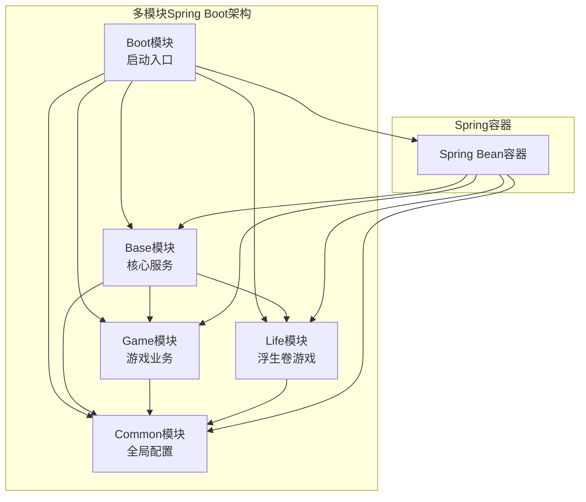

**图表来源**
- [BotApplication.java](file://Boot/src/main/java/com/bot/boot/BotApplication.java#L12)
- [pom.xml](file://pom.xml#L6-L11)

**章节来源**
- [pom.xml](file://pom.xml#L1-L148)
- [Boot/pom.xml](file://Boot/pom.xml#L1-L55)

## Boot模块：启动入口

Boot模块作为整个应用的启动入口，负责初始化Spring Boot容器并配置全局扫描范围。

### 核心配置

Boot模块的核心配置体现在BotApplication类中，通过以下关键注解实现模块扫描和集成：

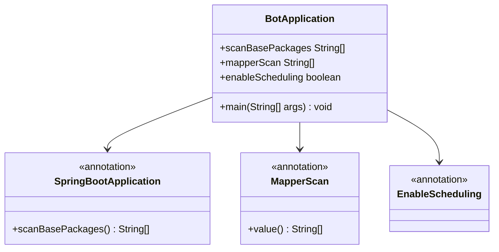

**图表来源**
- [BotApplication.java](file://Boot/src/main/java/com/bot/boot/BotApplication.java#L12-L14)

### 包扫描机制

Boot模块通过`@SpringBootApplication(scanBasePackages)`注解扫描以下模块：
- `com.bot.boot`：启动类所在包
- `com.bot.base`：基础服务模块
- `com.bot.game`：游戏业务模块  
- `com.bot.life`：浮生卷游戏模块
- `com.bot.common.loader`：通用加载器模块

这种扫描策略确保所有模块的Spring组件都能被正确识别和注册。

### MyBatis Mapper扫描

通过`@MapperScan`注解配置了两个Mapper扫描路径：
- `com.bot.game.dao.mapper`：游戏模块数据访问层
- `com.bot.life.dao.mapper`：Life模块数据访问层

这使得两个模块的Mapper接口能够被Spring自动代理和注册。

**章节来源**
- [BotApplication.java](file://Boot/src/main/java/com/bot/boot/BotApplication.java#L1-L22)

## Common模块：全局配置与缓存

Common模块提供全局共享的配置信息和缓存机制，是整个系统的基础支撑模块。

### SystemConfigCache全局配置缓存

SystemConfigCache类提供了系统级别的配置缓存，包含以下核心功能：

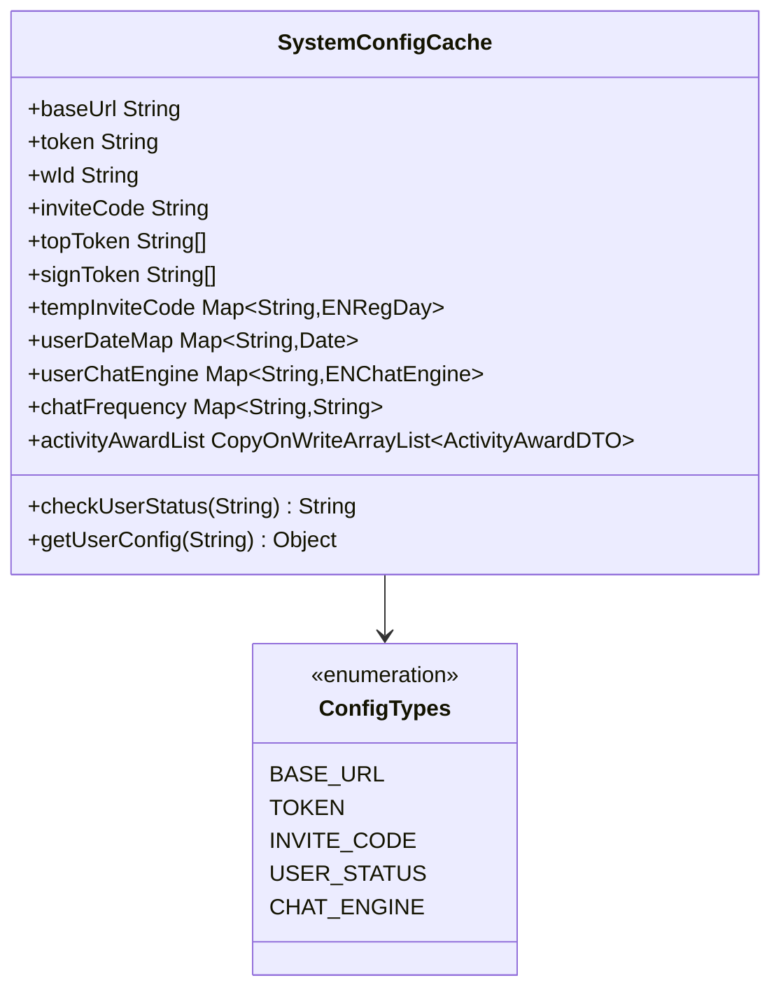

**图表来源**
- [SystemConfigCache.java](file://Common/src/main/java/com/bot/common/config/SystemConfigCache.java#L11-L115)

### 缓存类型分类

SystemConfigCache按功能分为以下几类：

| 缓存类型 | 存储内容 | 用途说明 |
|---------|---------|---------|
| 基础配置 | baseUrl, token, wId | 系统运行基础参数 |
| 权限控制 | topToken, signToken | 用户权限验证 |
| 用户状态 | userDateMap, userChatEngine | 用户活跃度跟踪 |
| 聊天设置 | chatFrequency, welcomeMap | 聊天行为配置 |
| 活动奖励 | activityAwardList | 动态活动管理 |

### 共享机制

所有模块都可以通过静态访问方式使用SystemConfigCache中的配置信息，实现配置的全局共享和统一管理。

**章节来源**
- [SystemConfigCache.java](file://Common/src/main/java/com/bot/common/config/SystemConfigCache.java#L1-L116)

## Base模块：核心分发器

Base模块是整个系统的核心调度中心，通过DistributorServiceImpl实现智能的消息分发和业务路由。

### DistributorServiceImpl核心架构

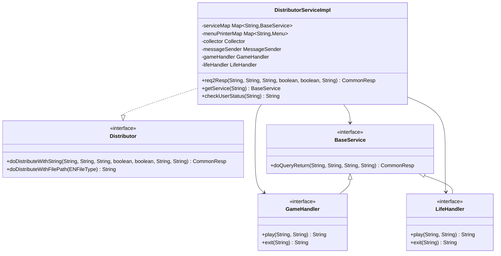

**图表来源**
- [DistributorServiceImpl.java](file://Base/src/main/java/com/bot/base/service/impl/DistributorServiceImpl.java#L41-L65)
- [GameHandler.java](file://Game/src/main/java/com/bot/game/service/GameHandler.java#L7-L29)
- [LifeHandler.java](file://Life/src/main/java/com/bot/life/service/LifeHandler.java#L7-L30)

### 分发流程机制

DistributorServiceImpl通过复杂的条件判断实现智能分发：

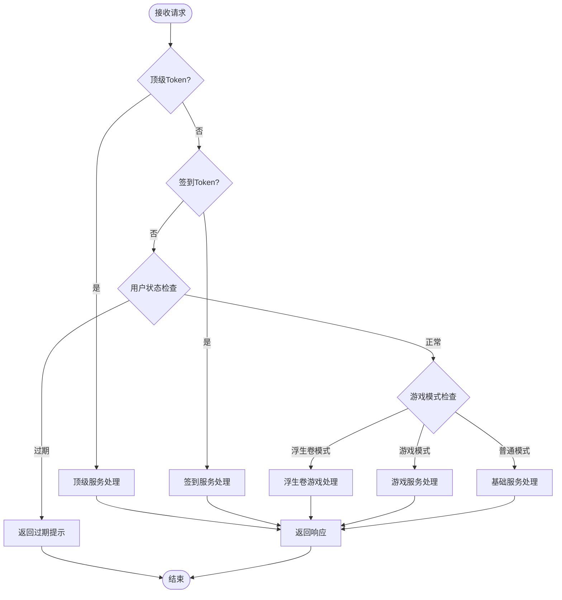

**图表来源**
- [DistributorServiceImpl.java](file://Base/src/main/java/com/bot/base/service/impl/DistributorServiceImpl.java#L216-L360)

### 业务模块协调

DistributorServiceImpl通过@Autowired注入GameHandler和LifeHandler，实现对各业务模块的统一协调：

- **GameHandler**：处理传统游戏功能
- **LifeHandler**：处理浮生卷修仙游戏
- **BaseService集合**：处理各种基础服务

**章节来源**
- [DistributorServiceImpl.java](file://Base/src/main/java/com/bot/base/service/impl/DistributorServiceImpl.java#L1-L414)

## Game模块：游戏业务逻辑

Game模块实现传统的QQ机器人游戏功能，包括角色系统、物品管理、战斗系统等完整的游戏业务逻辑。

### GameHandler接口设计

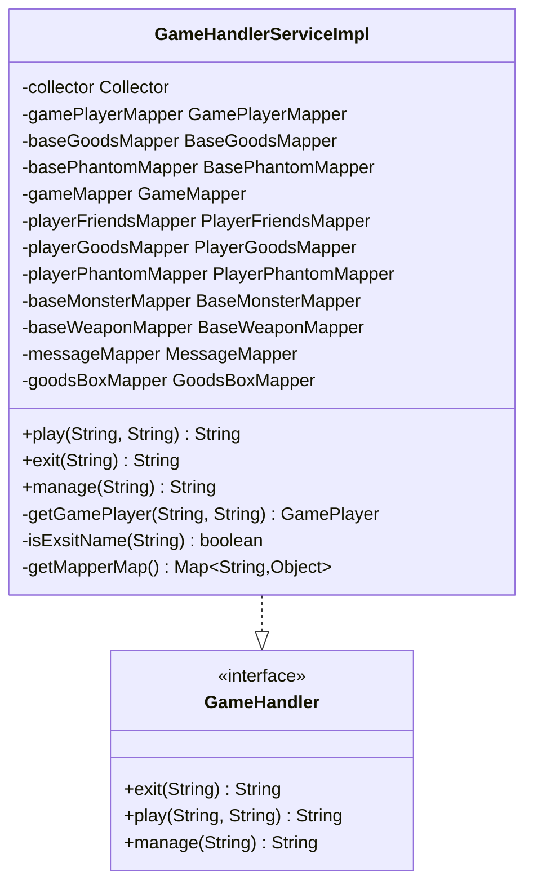

**图表来源**
- [GameHandler.java](file://Game/src/main/java/com/bot/game/service/GameHandler.java#L7-L29)
- [GameHandlerServiceImpl.java](file://Game/src/main/java/com/bot/game/service/impl/GameHandlerServiceImpl.java#L28-L67)

### 数据访问层集成

Game模块通过大量Mapper接口实现数据持久化：

| Mapper类型 | 功能描述 | 主要实体 |
|-----------|---------|---------|
| 基础数据 | 游戏基础配置 | BaseGoods, BasePhantom, BaseSkill |
| 玩家数据 | 玩家角色信息 | GamePlayer, PlayerGoods, PlayerPhantom |
| 战斗数据 | 战斗相关数据 | BaseMonster, PlayerWeapon |
| 系统数据 | 游戏状态管理 | Game, SystemConfig |
| 消息数据 | 游戏内消息 | Message, BotBottleMessage |

### 游戏状态管理

GameHandlerServiceImpl维护游戏状态的关键数据结构：
- `WAIT_REG`：等待注册的用户列表
- `WAIT_LOGIN`：等待登录的用户列表
- `GAME_TOKENS`：游戏模式激活的用户
- `LIFE_GAME_TOKENS`：浮生卷游戏模式用户

**章节来源**
- [GameHandlerServiceImpl.java](file://Game/src/main/java/com/bot/game/service/impl/GameHandlerServiceImpl.java#L1-L191)

## Life模块：浮生卷游戏

Life模块实现"浮生卷"修仙文字游戏，提供完整的修仙RPG体验，包括角色创建、境界突破、世界BOSS挑战等功能。

### LifeHandler接口设计

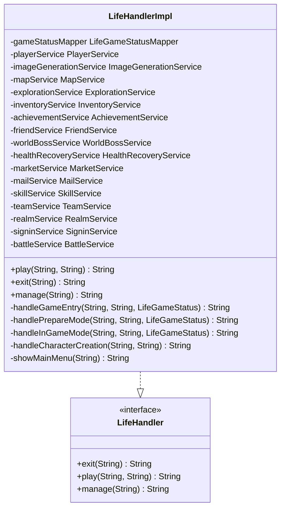

**图表来源**
- [LifeHandler.java](file://Life/src/main/java/com/bot/life/service/LifeHandler.java#L7-L30)
- [LifeHandlerImpl.java](file://Life/src/main/java/com/bot/life/service/impl/LifeHandlerImpl.java#L53-L107)

### 游戏模式系统

LifeHandlerImpl实现了复杂的游戏状态管理系统：

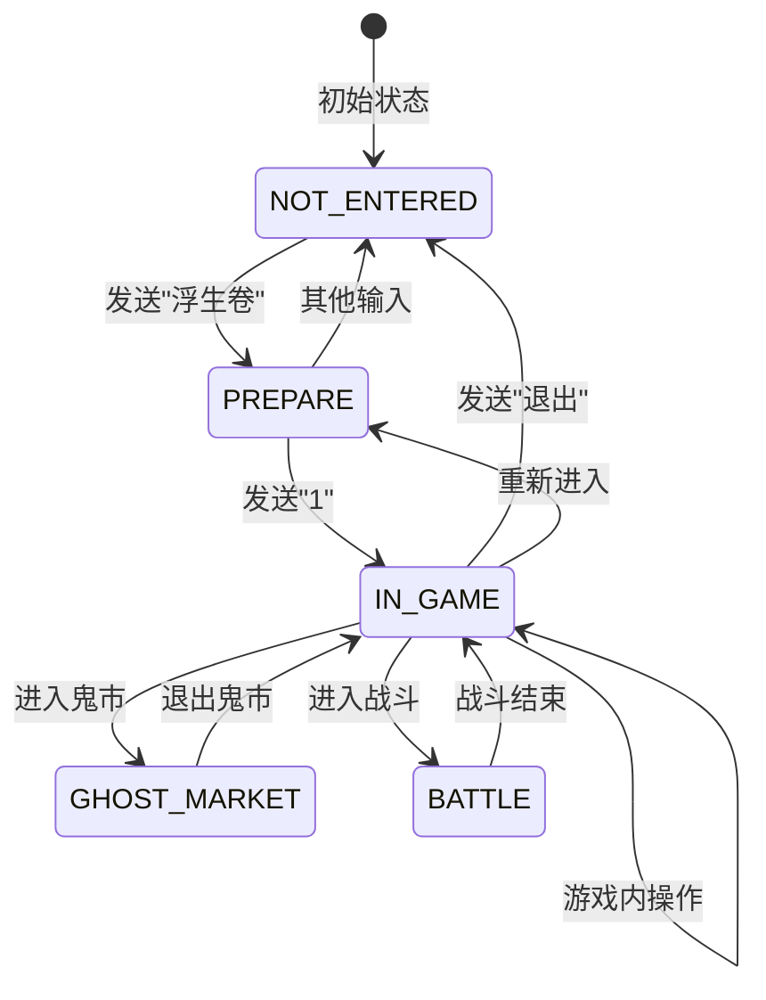

**图表来源**
- [LifeHandlerImpl.java](file://Life/src/main/java/com/bot/life/service/impl/LifeHandlerImpl.java#L149-L165)

### 服务组件集成

Life模块集成了30多个专门的服务组件：

| 服务类别 | 主要服务 | 功能描述 |
|---------|---------|---------|
| 核心服务 | PlayerService, ImageGenerationService | 角色管理和图片生成 |
| 地图系统 | MapService, ExplorationService | 地图探索和传送 |
| 战斗系统 | BattleService, WorldBossService | 战斗逻辑和BOSS挑战 |
| 社交系统 | FriendService, TeamService | 好友和组队功能 |
| 商业系统 | MarketService, InventoryService | 鬼市交易和背包管理 |
| 修炼系统 | SkillService, RealmService | 技能学习和境界突破 |
| 任务系统 | AchievementService, MailService | 成就系统和邮件功能 |

**章节来源**
- [LifeHandlerImpl.java](file://Life/src/main/java/com/bot/life/service/impl/LifeHandlerImpl.java#L1-L800)

## 模块依赖关系分析

### 依赖层次结构

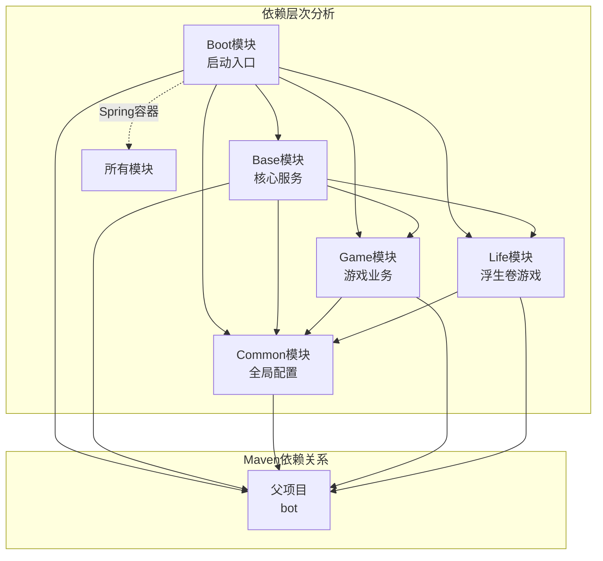

**图表来源**
- [pom.xml](file://pom.xml#L6-L11)
- [Boot/pom.xml](file://Boot/pom.xml#L15-L33)

### 模块职责划分

| 模块 | 核心职责 | 主要组件 | 依赖关系 |
|------|---------|---------|---------|
| Boot | 应用启动和配置 | BotApplication | 依赖所有模块 |
| Base | 核心业务逻辑 | DistributorServiceImpl | 依赖Common、Game、Life |
| Common | 全局配置和工具 | SystemConfigCache | 被所有模块依赖 |
| Game | 传统游戏功能 | GameHandler | 依赖Common |
| Life | 浮生卷修仙游戏 | LifeHandler | 依赖Common |

### 循环依赖检测

通过模块化设计避免了循环依赖：
- Boot模块不依赖任何业务模块
- Base模块依赖Common，同时被Game和Life依赖
- Common模块是最底层，不依赖其他业务模块
- Game和Life模块相互独立，通过Base模块协调

**章节来源**
- [pom.xml](file://pom.xml#L1-L148)
- [Boot/pom.xml](file://Boot/pom.xml#L1-L55)
- [Base/pom.xml](file://Base/pom.xml#L1-L46)

## Spring集成机制

### 包扫描配置原理

Spring Boot通过`@SpringBootApplication`注解的`scanBasePackages`属性实现模块扫描：

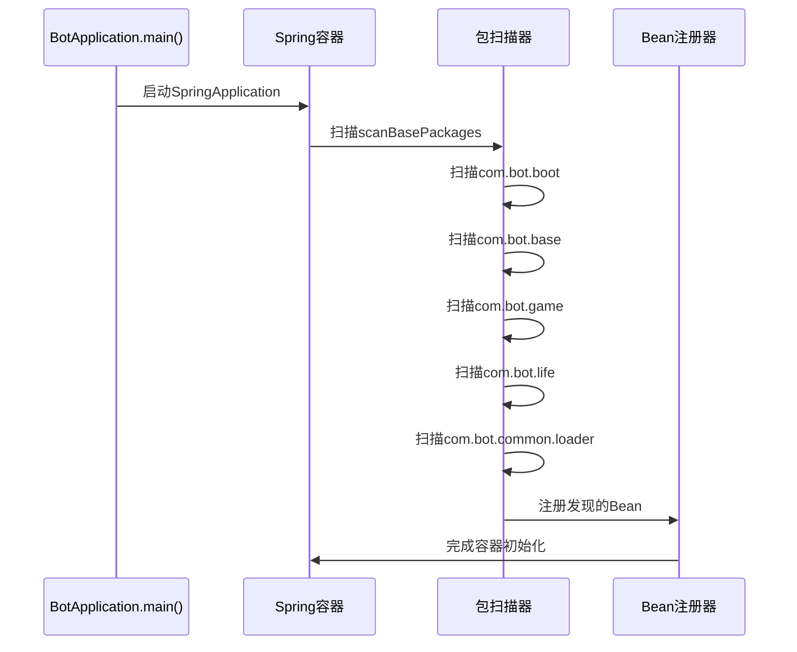

**图表来源**
- [BotApplication.java](file://Boot/src/main/java/com/bot/boot/BotApplication.java#L12)

### 组件发现机制

Spring通过以下注解实现组件自动发现：
- `@Service`：服务层组件
- `@Repository`：数据访问层组件  
- `@Component`：通用组件
- `@Configuration`：配置类

每个模块中的组件都会被自动扫描并注册到Spring容器中。

**章节来源**
- [BotApplication.java](file://Boot/src/main/java/com/bot/boot/BotApplication.java#L1-L22)

## 跨模块Bean注入原理

### 自动装配机制

Spring Boot通过`@Autowired`注解实现跨模块的Bean注入：

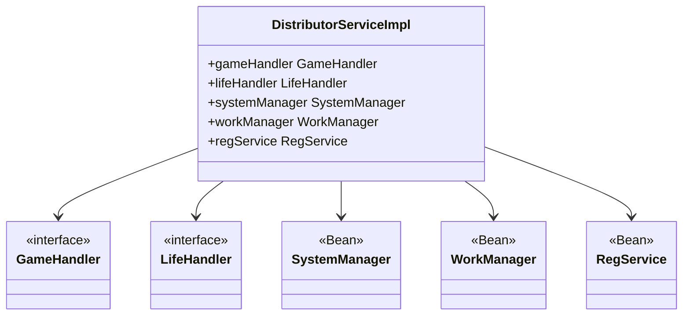

**图表来源**
- [DistributorServiceImpl.java](file://Base/src/main/java/com/bot/base/service/impl/DistributorServiceImpl.java#L61-L78)

### Bean生命周期管理

跨模块Bean注入遵循Spring的生命周期管理原则：
1. **实例化阶段**：Spring容器创建Bean实例
2. **属性注入阶段**：自动注入依赖的Bean
3. **初始化阶段**：执行初始化方法
4. **使用阶段**：Bean可供其他组件使用
5. **销毁阶段**：容器关闭时销毁Bean

### 依赖解析过程

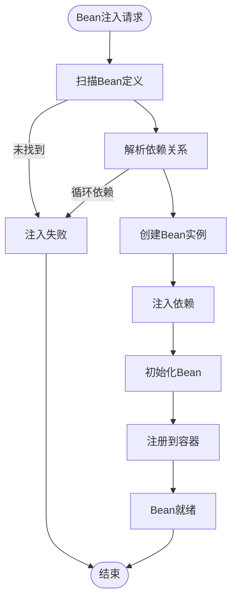

**章节来源**
- [DistributorServiceImpl.java](file://Base/src/main/java/com/bot/base/service/impl/DistributorServiceImpl.java#L61-L78)

## MyBatis Mapper扫描机制

### MapperScan配置原理

通过`@MapperScan`注解配置MyBatis Mapper接口的自动扫描：

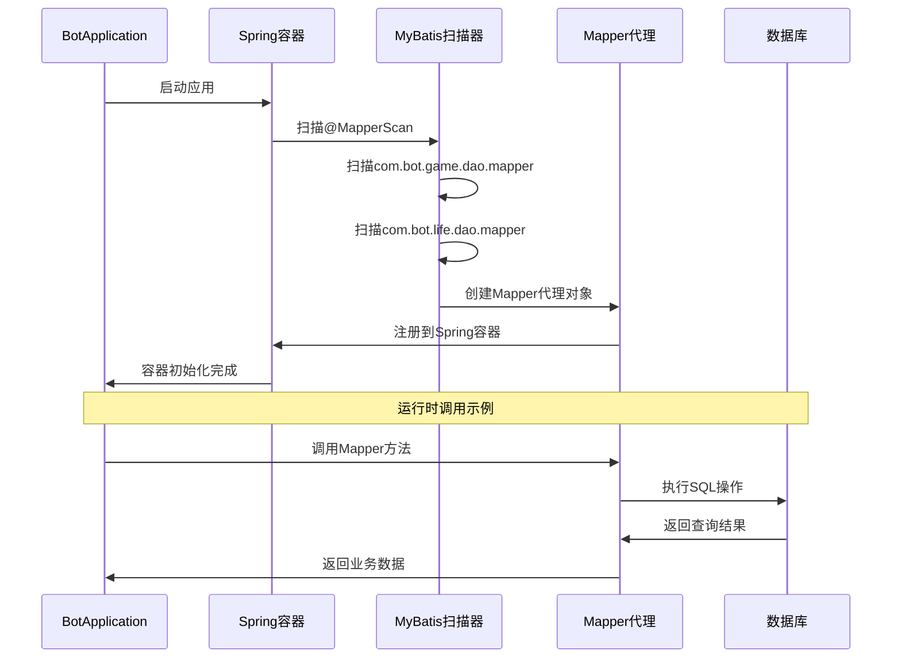

**图表来源**
- [BotApplication.java](file://Boot/src/main/java/com/bot/boot/BotApplication.java#L13)

### Mapper接口类型

两个模块分别提供不同类型的Mapper接口：

#### Game模块Mapper
- `BaseGoodsMapper`：基础物品数据
- `BotUserMapper`：用户数据管理
- `GameMapper`：游戏状态管理
- `PlayerGoodsMapper`：玩家物品管理

#### Life模块Mapper
- `LifePlayerMapper`：玩家角色数据
- `LifeGameStatusMapper`：游戏状态
- `LifeMapMapper`：地图数据
- `LifeMonsterMapper`：怪物数据

### 动态代理机制

MyBatis通过动态代理技术为Mapper接口创建实现：
1. **接口验证**：检查Mapper接口的合法性
2. **SQL映射**：解析XML或注解中的SQL语句
3. **代理创建**：生成接口的动态代理实现
4. **方法拦截**：拦截接口方法调用
5. **SQL执行**：执行对应的数据库操作

**章节来源**
- [BotApplication.java](file://Boot/src/main/java/com/bot/boot/BotApplication.java#L13)
- [Life_Spring_Integration_Fix.md](file://Life_Spring_Integration_Fix.md#L1-L116)

## 故障排除指南

### 常见集成问题

根据Life_Spring_Integration_Fix.md的修复案例，常见的Spring集成问题包括：

#### 问题1：Bean未被扫描到
**症状**：`Field lifeHandler in com.bot.base.service.impl.DistributorServiceImpl required a bean of type 'com.bot.life.service.LifeHandler' that could not be found.`

**原因**：Spring Boot启动类的包扫描配置中缺少`com.bot.life`包

**解决方案**：修改BotApplication.java的包扫描配置

#### 问题2：MyBatis Mapper未被代理
**症状**：Mapper接口调用时出现`NullPointerException`

**原因**：缺少`@MapperScan`注解或扫描路径配置错误

**解决方案**：在BotApplication中添加正确的Mapper扫描路径

### 修复验证清单

| 修复项 | 检查方法 | 预期结果 |
|-------|---------|---------|
| 包扫描配置 | 检查scanBasePackages | 包含com.bot.life |
| Mapper扫描配置 | 检查@MapperScan | 包含com.bot.life.dao.mapper |
| Bean注入测试 | 启动应用观察日志 | LifeHandler Bean成功注入 |
| 数据访问测试 | 调用Life模块Mapper | 数据库操作正常 |

### 调试技巧

1. **启用调试日志**：设置`logging.level.com.bot=DEBUG`
2. **检查Bean定义**：访问`/actuator/beans`端点
3. **验证依赖关系**：使用`/actuator/dependencies`端点
4. **监控启动过程**：观察Spring容器初始化日志

**章节来源**
- [Life_Spring_Integration_Fix.md](file://Life_Spring_Integration_Fix.md#L1-L116)

## 总结

Bot项目通过精心设计的多模块架构实现了高度的模块化和可扩展性：

### 架构优势

1. **清晰的职责分离**：每个模块承担明确的业务职责
2. **松耦合设计**：模块间通过接口和Spring容器解耦
3. **高内聚实现**：同一模块内的组件紧密协作
4. **易于维护**：模块化设计便于代码维护和功能扩展
5. **可测试性**：模块独立性支持单元测试和集成测试

### 设计亮点

- **智能分发机制**：DistributorServiceImpl实现复杂的消息路由逻辑
- **全局配置管理**：SystemConfigCache提供统一的配置管理
- **灵活的扩展性**：新的业务模块可以轻松集成到现有架构中
- **完善的集成机制**：Spring Boot的自动配置和依赖注入简化了模块集成

### 最佳实践

1. **模块化设计**：保持模块边界清晰，避免过度耦合
2. **配置集中管理**：使用Common模块统一管理全局配置
3. **接口抽象**：通过接口定义模块间的契约
4. **自动化测试**：为每个模块编写相应的测试用例
5. **文档维护**：及时更新模块间的依赖关系文档

这种架构设计不仅满足了当前的功能需求，还为未来的功能扩展和系统演进奠定了坚实的基础。