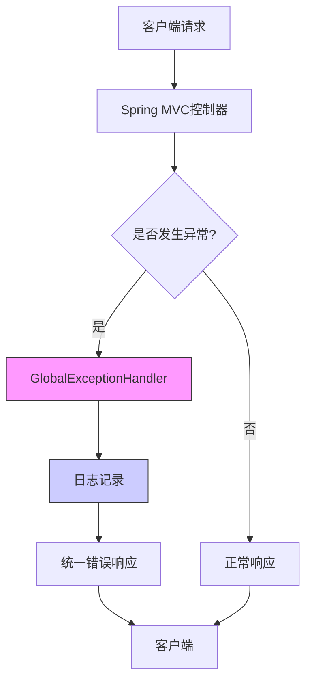
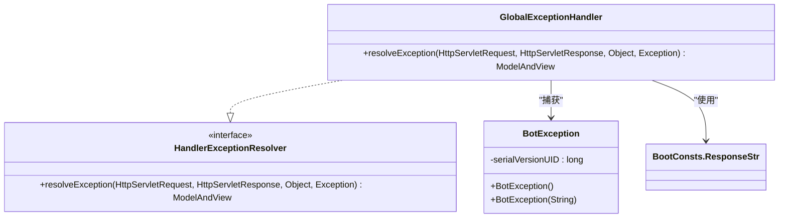
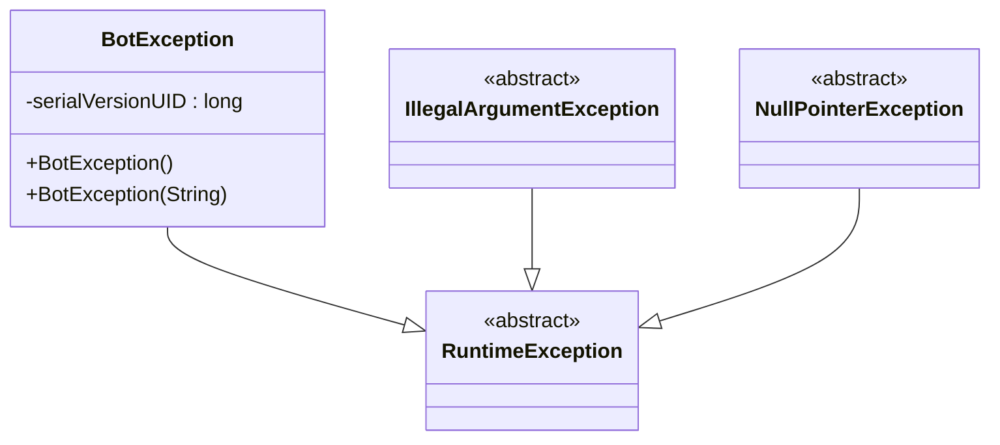
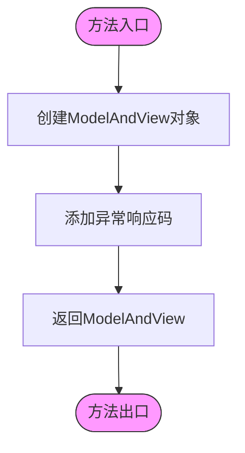
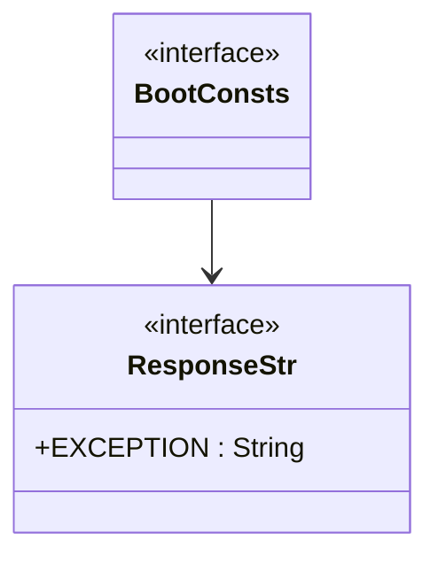
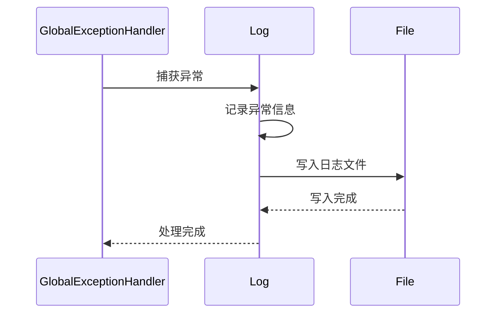
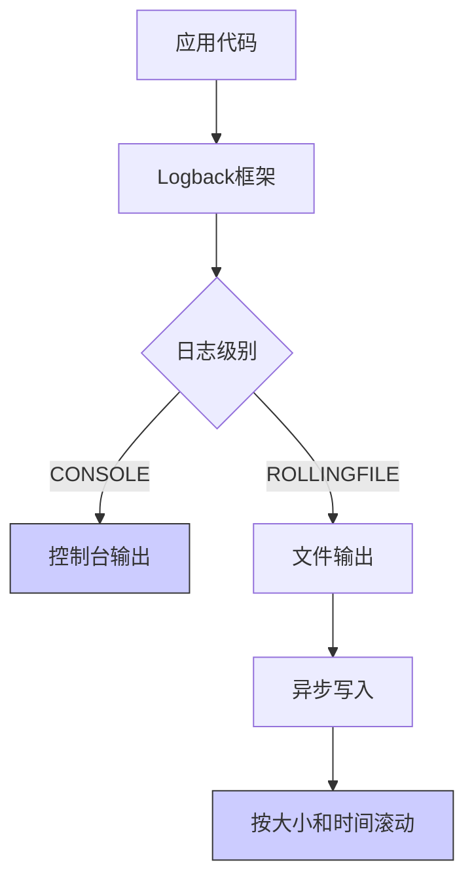
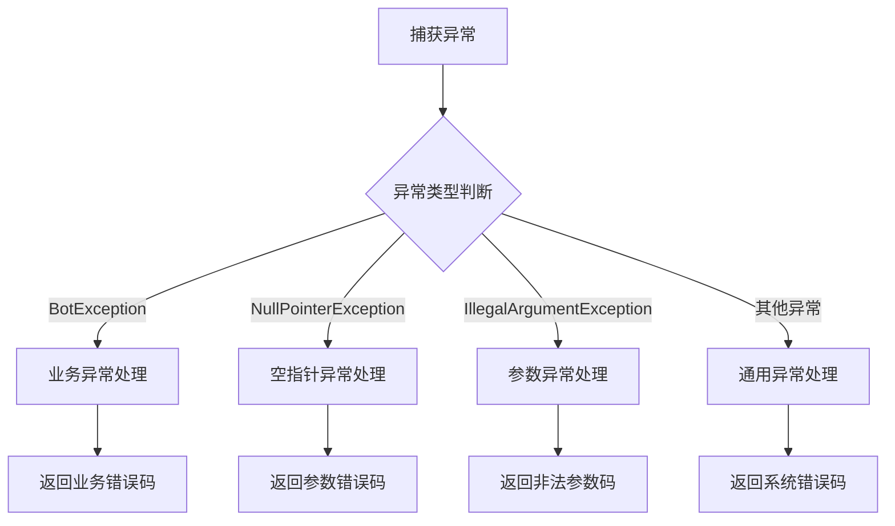
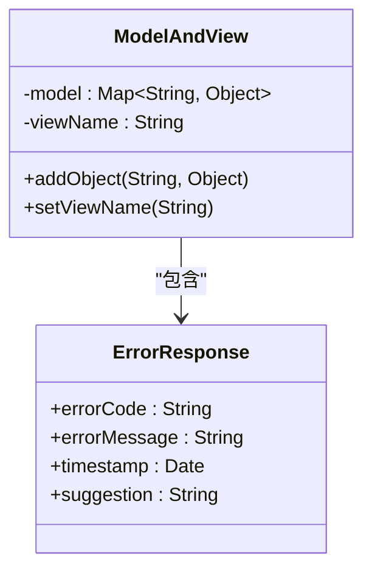
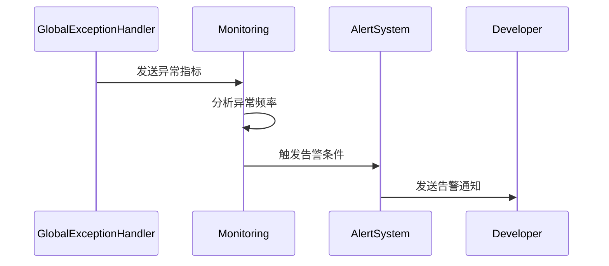

# 全局异常处理

<cite>
**本文档引用的文件**
- [GlobalExceptionHandler.java](file://Boot/src/main/java/com/bot/boot/aspect/GlobalExceptionHandler.java)
- [BootConsts.java](file://Common/src/main/java/com/bot/common/constant/BootConsts.java)
- [BotException.java](file://Common/src/main/java/com/bot/common/exception/BotException.java)
- [DistributorServiceImpl.java](file://Base/src/main/java/com/bot/base/service/impl/DistributorServiceImpl.java)
- [logback-spring.xml](file://Boot/src/main/resources/logback-spring.xml)
- [application.properties](file://Boot/src/main/resources/application.properties)
</cite>

## 目录
1. [引言](#引言)
2. [全局异常处理架构](#全局异常处理架构)
3. [核心组件分析](#核心组件分析)
4. [异常处理流程详解](#异常处理流程详解)
5. [日志记录机制](#日志记录机制)
6. [自定义异常处理扩展](#自定义异常处理扩展)
7. [配置与部署](#配置与部署)
8. [结论](#结论)

## 引言
本文档详细分析了系统中的全局异常处理机制，重点阐述了`GlobalExceptionHandler`如何通过实现`HandlerExceptionResolver`接口实现AOP式的异常拦截。文档将深入解析异常处理的实现原理、流程和最佳实践。

## 全局异常处理架构



**Diagram sources**
- [GlobalExceptionHandler.java](file://Boot/src/main/java/com/bot/boot/aspect/GlobalExceptionHandler.java)
- [DistributorServiceImpl.java](file://Base/src/main/java/com/bot/base/service/impl/DistributorServiceImpl.java)

## 核心组件分析

### GlobalExceptionHandler类
`GlobalExceptionHandler`是系统全局异常处理的核心组件，通过实现Spring MVC的`HandlerExceptionResolver`接口，实现了对所有控制器异常的统一拦截和处理。



**Diagram sources**
- [GlobalExceptionHandler.java](file://Boot/src/main/java/com/bot/boot/aspect/GlobalExceptionHandler.java)
- [BotException.java](file://Common/src/main/java/com/bot/common/exception/BotException.java)
- [BootConsts.java](file://Common/src/main/java/com/bot/common/constant/BootConsts.java)

**Section sources**
- [GlobalExceptionHandler.java](file://Boot/src/main/java/com/bot/boot/aspect/GlobalExceptionHandler.java#L1-L26)

### 异常类型体系
系统定义了`BotException`作为基础业务异常类，所有业务逻辑中的自定义异常都继承自此类，确保异常处理的一致性。



**Diagram sources**
- [BotException.java](file://Common/src/main/java/com/bot/common/exception/BotException.java)

**Section sources**
- [BotException.java](file://Common/src/main/java/com/bot/common/exception/BotException.java#L1-L20)

## 异常处理流程详解

### resolveException方法执行流程
`resolveException`方法是全局异常处理的核心，它捕获系统运行时异常并返回统一的错误响应模型，避免异常信息直接暴露给客户端。



**Section sources**
- [GlobalExceptionHandler.java](file://Boot/src/main/java/com/bot/boot/aspect/GlobalExceptionHandler.java#L20-L25)

### 异常处理参数说明
`resolveException`方法接收四个关键参数，用于获取异常处理所需的上下文信息：

**参数说明**
- `HttpServletRequest request`: HTTP请求对象，包含客户端请求的所有信息
- `HttpServletResponse response`: HTTP响应对象，可用于直接写入响应内容
- `Object handler`: 发生异常的处理器对象
- `Exception ex`: 捕获到的异常对象

**Section sources**
- [GlobalExceptionHandler.java](file://Boot/src/main/java/com/bot/boot/aspect/GlobalExceptionHandler.java#L20-L25)

### 统一响应模型
系统通过`BootConsts.ResponseStr.EXCEPTION`常量定义了统一的异常响应码，确保所有异常返回一致的错误标识。



**Diagram sources**
- [BootConsts.java](file://Common/src/main/java/com/bot/common/constant/BootConsts.java)

**Section sources**
- [BootConsts.java](file://Common/src/main/java/com/bot/common/constant/BootConsts.java#L7-L12)

## 日志记录机制

### @Slf4j注解的作用
`@Slf4j`注解由Lombok提供，自动为类生成日志记录器字段，简化了日志记录代码。



**Section sources**
- [GlobalExceptionHandler.java](file://Boot/src/main/java/com/bot/boot/aspect/GlobalExceptionHandler.java#L16)

### 日志配置分析
系统使用Logback作为日志框架，通过`logback-spring.xml`配置文件定义了日志输出格式和策略。



**Diagram sources**
- [logback-spring.xml](file://Boot/src/main/resources/logback-spring.xml)

**Section sources**
- [logback-spring.xml](file://Boot/src/main/resources/logback-spring.xml#L1-L58)

## 自定义异常处理扩展

### 异常类型判断
可以通过对`Exception`参数进行类型判断，实现不同异常类型的差异化处理。



### 差异化响应策略
可以扩展`GlobalExceptionHandler`以提供更详细的错误响应，包括错误消息、错误码和建议操作。



### 监控告警集成
可以在异常处理中集成监控告警系统，当发生严重异常时及时通知开发团队。



## 配置与部署

### Spring配置
`GlobalExceptionHandler`通过`@Component`注解注册为Spring Bean，确保被Spring容器管理。

```mermaid
graph TD
A[Spring容器] --> B[组件扫描]
B --> C{发现@Component}
C --> |是| D[注册为Bean]
D --> E[注入依赖]
E --> F[准备就绪]
style D fill:#f9f,stroke:#333
```

**Section sources**
- [GlobalExceptionHandler.java](file://Boot/src/main/java/com/bot/boot/aspect/GlobalExceptionHandler.java#L17)

### 应用配置
系统通过`application.properties`文件配置了基本的应用参数，包括服务器端口、数据库连接等。

**Section sources**
- [application.properties](file://Boot/src/main/resources/application.properties#L1-L70)

## 结论
本文档详细分析了系统的全局异常处理机制。`GlobalExceptionHandler`通过实现`HandlerExceptionResolver`接口，实现了AOP式的异常拦截，确保了系统异常处理的一致性和安全性。通过统一的错误响应模型和完善的日志记录机制，系统能够有效防止敏感信息泄露，同时为开发和运维提供了必要的诊断信息。该机制具有良好的扩展性，可以方便地添加异常类型判断、差异化响应和监控告警集成等高级功能。