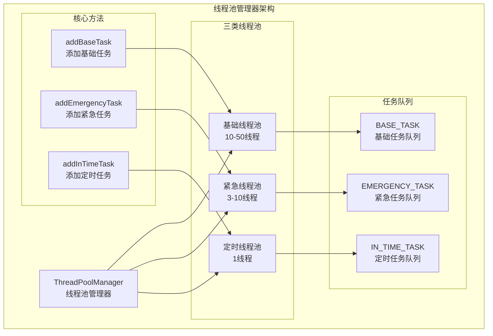
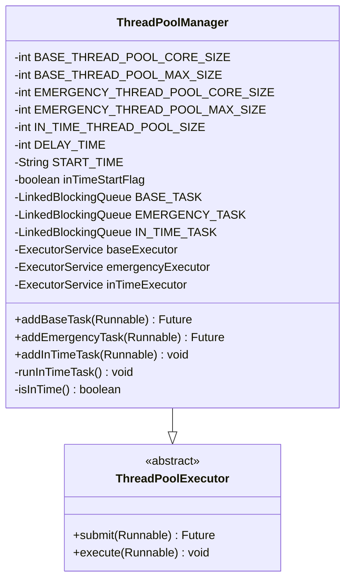
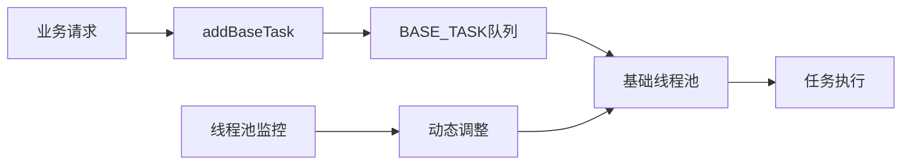
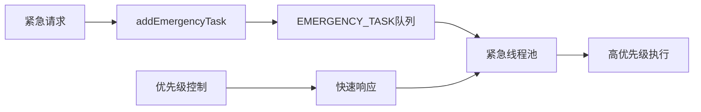
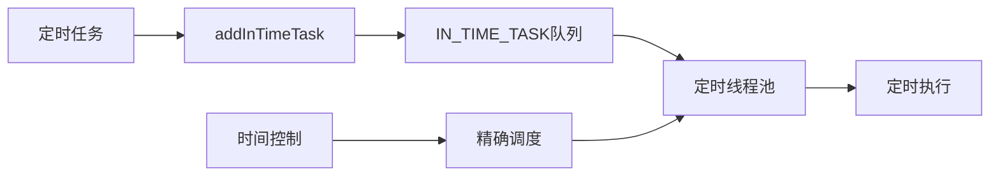
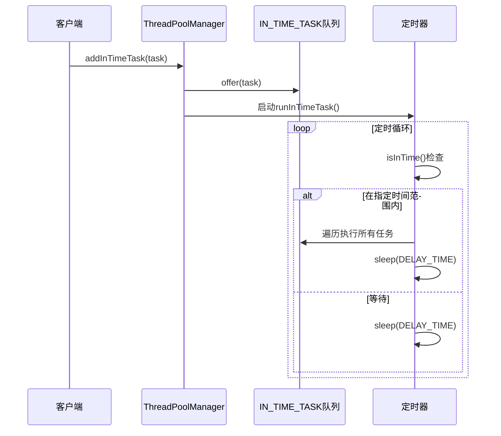

# 线程池管理机制详细文档

<cite>
**本文档中引用的文件**
- [ThreadPoolManager.java](file://Common/src/main/java/com/bot/common/util/ThreadPoolManager.java)
- [StatusMonitor.java](file://Base/src/main/java/com/bot/base/service/StatusMonitor.java)
- [AutoTask.java](file://Base/src/main/java/com/bot/base/task/AutoTask.java)
- [NoticeTask.java](file://Base/src/main/java/com/bot/base/task/NoticeTask.java)
- [OpenServerTask.java](file://Base/src/main/java/com/bot/base/task/OpenServerTask.java)
- [GameCommonHolder.java](file://Game/src/main/java/com\bot\game\service\GameCommonHolder.java)
</cite>

## 目录
1. [概述](#概述)
2. [系统架构](#系统架构)
3. [核心组件分析](#核心组件分析)
4. [三类线程池详解](#三类线程池详解)
5. [任务队列设计](#任务队列设计)
6. [核心方法实现](#核心方法实现)
7. [定时任务机制](#定时任务机制)
8. [使用场景分析](#使用场景分析)
9. [性能调优指南](#性能调优指南)
10. [常见问题排查](#常见问题排查)
11. [最佳实践建议](#最佳实践建议)

## 概述

ThreadPoolManager是一个基于单例模式的线程池管理器，采用Java的ThreadPoolExecutor扩展实现，专门用于统一管理机器人系统的三种不同类型的任务线程池：基础线程池、紧急线程池和定时线程池。该管理器通过精心设计的参数配置和任务分发机制，确保系统能够高效处理各种并发任务需求。

## 系统架构

**图表来源**
- [ThreadPoolManager.java](file://Common/src/main/java/com/bot/common/util/ThreadPoolManager.java#L13-L123)

## 核心组件分析

### 单例模式实现

ThreadPoolManager继承自ThreadPoolExecutor，采用静态工厂模式实现单例管理：

**图表来源**
- [ThreadPoolManager.java](file://Common/src/main/java/com/bot/common/util/ThreadPoolManager.java#L13-L66)

**章节来源**
- [ThreadPoolManager.java](file://Common/src/main/java/com/bot/common/util/ThreadPoolManager.java#L13-L123)

## 三类线程池详解

### 基础线程池（BASE_TASK）

**设计目的：** 处理日常业务逻辑和常规任务，如消息处理、数据同步等。

**参数配置：**
- 核心线程数：10个（BASE_THREAD_POOL_CORE_SIZE）
- 最大线程数：50个（BASE_THREAD_POOL_MAX_SIZE）
- 线程存活时间：60秒（THREAD_ALIVE_TIME_SECONDS）

**适用场景：**
- 用户消息处理
- 数据库操作
- 文件读写
- 网络请求处理

### 紧急线程池（EMERGENCY_TASK）

**设计目的：** 处理高优先级和关键性任务，确保重要功能的及时响应。

**参数配置：**
- 核心线程数：3个（EMERGENCY_THREAD_POOL_CORE_SIZE）
- 最大线程数：10个（EMERGENCY_THREAD_POOL_MAX_SIZE）
- 线程存活时间：60秒（THREAD_ALIVE_TIME_SECONDS）

**适用场景：**
- 系统监控
- 关键状态检查
- 紧急通知发送
- 重要数据备份

### 定时线程池（IN_TIME_TASK）

**设计目的：** 执行定时任务和周期性维护工作，具有严格的执行时间控制。

**参数配置：**
- 线程数：1个（IN_TIME_THREAD_POOL_SIZE）
- 触发间隔：3000毫秒（DELAY_TIME）
- 首次执行时间：10:24:00（START_TIME）

**适用场景：**
- 每日定时任务
- 周期性数据清理
- 系统状态检查
- 维护任务执行

**章节来源**
- [ThreadPoolManager.java](file://Common/src/main/java/com/bot/common/util/ThreadPoolManager.java#L15-L56)

## 任务队列设计

### BASE_TASK（基础任务队列）

**特点：**
- 使用LinkedBlockingQueue实现无界队列
- 支持大量并发任务排队
- 自动扩展到最大线程数
- 空闲线程自动回收

### EMERGENCY_TASK（紧急任务队列）

**特点：**
- 较小的核心线程数确保资源节约
- 快速响应高优先级任务
- 限制最大线程数防止资源耗尽

### IN_TIME_TASK（定时任务队列）

**特点：**
- 单线程执行确保顺序性
- 支持任务去重机制
- 延迟触发机制控制执行频率

**章节来源**
- [ThreadPoolManager.java](file://Common/src/main/java/com/bot/common/util/ThreadPoolManager.java#L52-L56)

## 核心方法实现

### addBaseTask方法

**功能描述：** 添加基础任务到基础线程池执行。

**实现逻辑：**
1. 接收Runnable任务对象
2. 提交任务到baseExecutor
3. 返回Future对象用于结果获取或取消

**使用示例路径：**
- [StatusMonitor.java](file://Base/src/main/java/com/bot/base/service/StatusMonitor.java#L68-L91)
- [GameCommonHolder.java](file://Game/src/main/java/com\bot\game\service\GameCommonHolder.java#L50-L66)

### addEmergencyTask方法

**功能描述：** 添加紧急任务到紧急线程池执行。

**实现逻辑：**
1. 接收Runnable任务对象
2. 提交任务到emergencyExecutor
3. 返回Future对象用于结果获取或取消

**使用示例路径：**
- [NoticeTask.java](file://Base/src/main/java/com/bot/base/task/NoticeTask.java#L34-L61)
- [OpenServerTask.java](file://Base/src/main/java/com/bot/base/task/OpenServerTask.java#L36-L84)

### addInTimeTask方法

**功能描述：** 添加定时任务到定时线程池执行。

**实现逻辑：**
1. 检查任务是否已存在（防止重复添加）
2. 将任务加入IN_TIME_TASK队列
3. 启动定时线程池执行任务
4. 支持多个任务同时排队执行

**使用示例路径：**
- [AutoTask.java](file://Base/src/main/java/com/bot/base/task/AutoTask.java#L19-L41)

**章节来源**
- [ThreadPoolManager.java](file://Common/src/main/java/com/bot/common/util/ThreadPoolManager.java#L73-L100)

## 定时任务机制

### 延迟触发机制

**图表来源**
- [ThreadPoolManager.java](file://Common/src/main/java/com/bot/common/util/ThreadPoolManager.java#L102-L121)

### 时间控制算法

**START_TIME配置：** 10:24:00（每日固定时间）

**DELAY_TIME配置：** 3000毫秒（3秒）

**时间检查机制：**
1. 使用Hutool工具类进行日期解析
2. 比较当前时间与预设时间
3. 支持时间范围内的任务执行

**实现细节：**
- 使用volatile变量确保线程安全
- 支持任务重复添加检测
- 异常处理确保定时器持续运行

**章节来源**
- [ThreadPoolManager.java](file://Common/src/main/java/com/bot/common/util/ThreadPoolManager.java#L42-L121)

## 使用场景分析

### 基础线程池使用场景

**StatusMonitor监控服务：**
- 用户会话超时检查
- 打工日历发送
- 喝水记录提醒
- 英语学习推送

**GameCommonHolder游戏服务：**
- 世界BOSS信息初始化
- 玩家行动点数恢复
- 游戏状态定期更新

### 紧急线程池使用场景

**NoticeTask通知服务：**
- 用户到期提醒
- 系统状态监控
- 关键事件通知

**OpenServerTask服务器监控：**
- 游戏服务器状态检查
- 实时状态更新
- 异常情况处理

### 定时线程池使用场景

**AutoTask自动任务：**
- 每日数据重置
- 缓存清理
- 状态初始化

**章节来源**
- [StatusMonitor.java](file://Base/src/main/java/com/bot/base/service/StatusMonitor.java#L68-L259)
- [GameCommonHolder.java](file://Game/src/main/java/com\bot\game\service\GameCommonHolder.java#L45-L111)
- [AutoTask.java](file://Base/src/main/java/com/bot/base/task/AutoTask.java#L19-L41)

## 性能调优指南

### 线程池参数优化

**基础线程池调优：**
- 根据CPU核心数调整核心线程数
- 监控队列长度避免内存溢出
- 设置合理的拒绝策略

**紧急线程池调优：**
- 控制最大线程数防止资源竞争
- 优化任务优先级分配
- 监控线程池利用率

**定时线程池调优：**
- 调整DELAY_TIME适应任务复杂度
- 优化START_TIME避开系统高峰期
- 监控任务执行时间分布

### 内存管理优化

**任务对象优化：**
- 减少任务对象大小
- 使用对象池复用任务
- 及时清理不再需要的任务

**队列管理优化：**
- 设置合适的队列容量
- 监控队列积压情况
- 实现队列溢出保护

### 并发控制优化

**线程安全保证：**
- 使用volatile关键字确保可见性
- 合理使用同步机制
- 避免死锁和竞态条件

**资源竞争避免：**
- 分离CPU密集型和IO密集型任务
- 使用异步处理提高吞吐量
- 实现任务优先级调度

## 常见问题排查

### 线程池满载问题

**症状表现：**
- 任务提交被拒绝
- 系统响应变慢
- 内存使用率过高

**排查步骤：**
1. 检查线程池配置参数
2. 监控任务执行时间
3. 分析任务队列积压情况
4. 检查是否存在死任务

**解决方案：**
- 调整线程池大小
- 优化任务执行效率
- 实现任务超时机制
- 添加任务拒绝策略

### 定时任务延迟问题

**症状表现：**
- 定时任务执行时间不准确
- 任务堆积导致后续任务延迟
- 系统负载不均衡

**排查步骤：**
1. 检查DELTA_TIME配置
2. 分析任务执行时间
3. 监控系统资源使用
4. 检查任务依赖关系

**解决方案：**
- 优化任务执行效率
- 调整定时器精度
- 实现任务补偿机制
- 添加任务监控告警

### 内存泄漏问题

**症状表现：**
- 系统内存持续增长
- 垃圾回收频繁
- 系统性能下降

**排查步骤：**
1. 检查任务对象生命周期
2. 分析任务队列状态
3. 监控线程池状态
4. 检查外部资源释放

**解决方案：**
- 及时清理任务引用
- 实现弱引用机制
- 添加资源监控
- 优化对象创建策略

## 最佳实践建议

### 任务设计原则

**单一职责原则：**
- 每个任务只负责一个明确的功能
- 避免任务过于复杂
- 保持任务粒度适中

**异常处理原则：**
- 为每个任务添加异常捕获
- 实现任务重试机制
- 记录任务执行日志

**资源管理原则：**
- 及时释放任务占用的资源
- 避免长时间持有锁
- 合理使用缓存机制

### 监控和运维

**性能监控：**
- 监控线程池各项指标
- 设置关键阈值告警
- 定期生成性能报告

**日志记录：**
- 记录任务执行详情
- 包含错误堆栈信息
- 支持日志级别动态调整

**故障恢复：**
- 实现自动重启机制
- 添加健康检查接口
- 支持手动干预操作

### 扩展性考虑

**水平扩展：**
- 支持多实例部署
- 实现任务分片处理
- 添加负载均衡机制

**垂直扩展：**
- 动态调整线程池参数
- 支持任务优先级调整
- 实现智能调度算法

通过合理使用ThreadPoolManager提供的三类线程池，可以有效提升系统的并发处理能力和稳定性，为机器人系统提供可靠的任务执行保障。