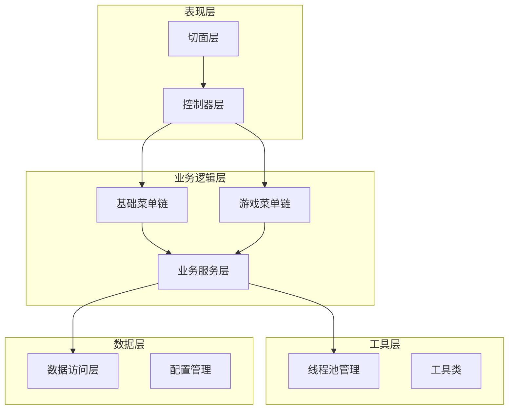
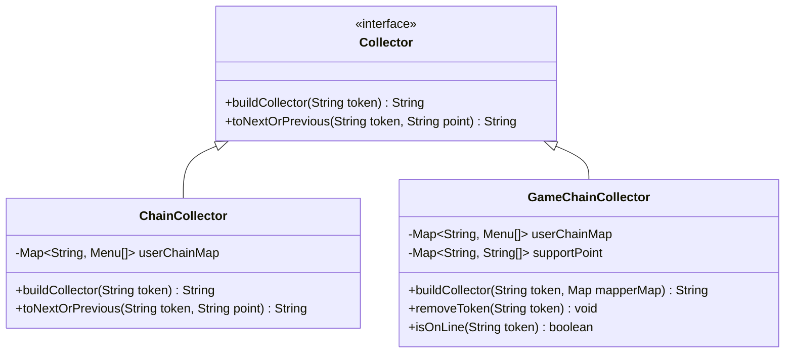
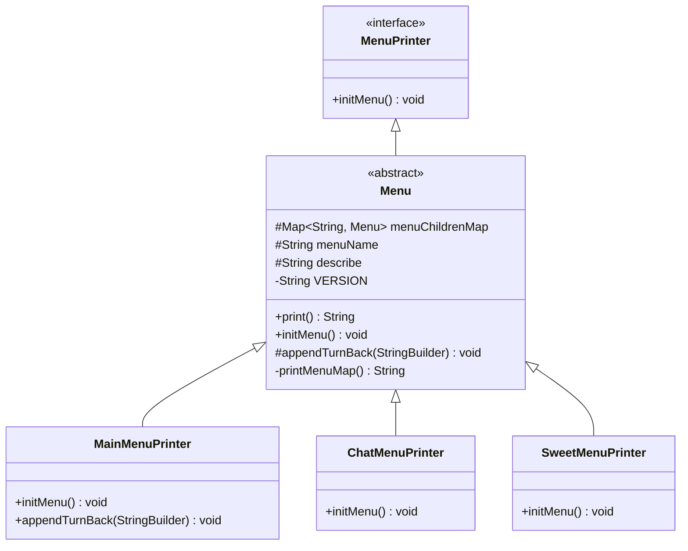
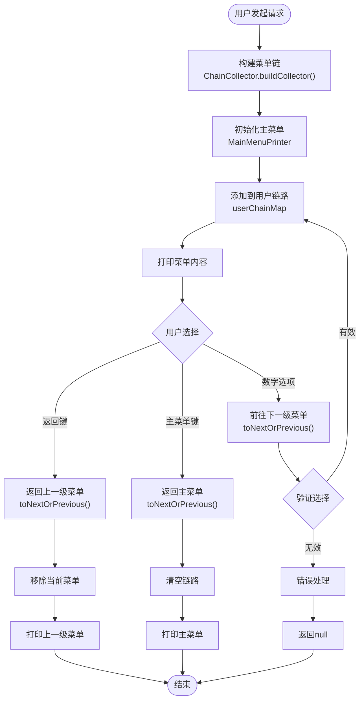
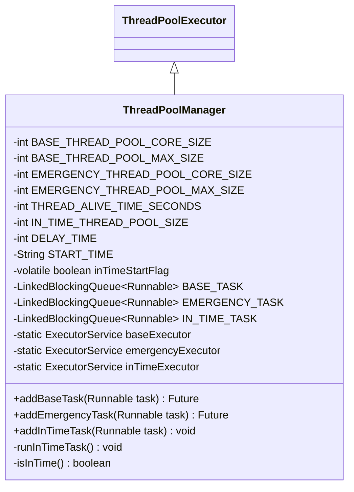
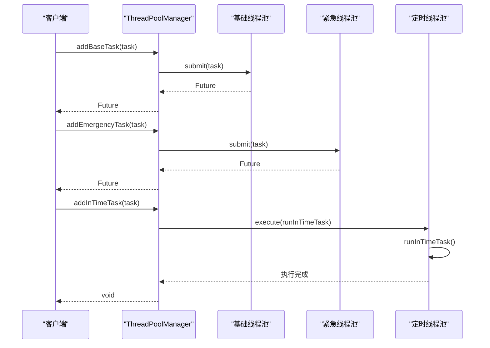
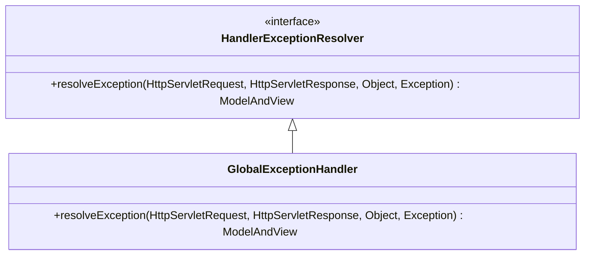
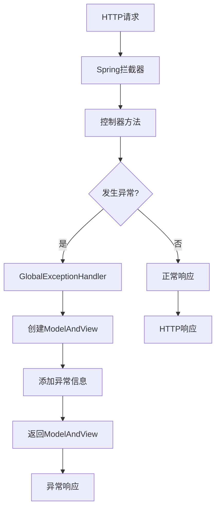
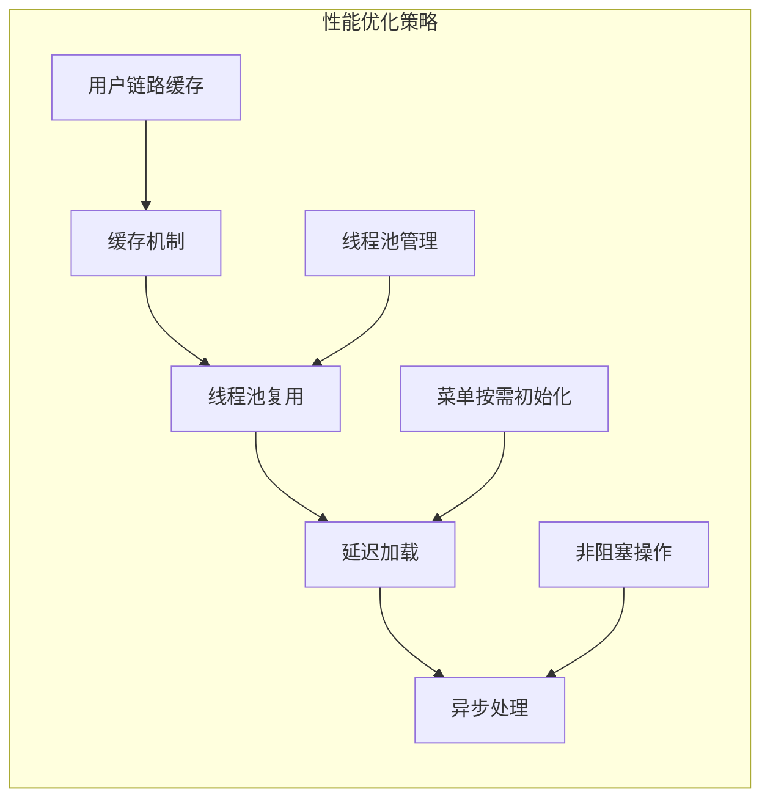

# Bot项目设计模式应用文档

<cite>
**本文档引用的文件**
- [ChainCollector.java](file://Base/src/main/java/com/bot/base/chain/ChainCollector.java)
- [Menu.java](file://Base/src/main/java/com/bot/base/chain/Menu.java)
- [Collector.java](file://Base/src/main/java/com/bot/base/chain/Collector.java)
- [MenuPrinter.java](file://Base/src/main/java/com/bot/base/chain/MenuPrinter.java)
- [MainMenuPrinter.java](file://Base/src/main/java/com/bot/base/chain/menu/MainMenuPrinter.java)
- [ChatMenuPrinter.java](file://Base/src/main/java/com/bot/base/chain/menu/ChatMenuPrinter.java)
- [SweetMenuPrinter.java](file://Base/src/main/java/com/bot/base/chain/menu/SweetMenuPrinter.java)
- [GameChainCollector.java](file://Game/src/main/java/com/bot/game/chain/GameChainCollector.java)
- [GameMainMenuPrinter.java](file://Game/src/main/java/com/bot/game/chain/menu/GameMainMenuPrinter.java)
- [GlobalExceptionHandler.java](file://Boot/src/main/java/com/bot/boot/aspect/GlobalExceptionHandler.java)
- [ThreadPoolManager.java](file://Common/src/main/java/com/bot/common/util/ThreadPoolManager.java)
- [BaseConsts.java](file://Common/src/main/java/com/bot/common/constant/BaseConsts.java)
</cite>

## 目录
1. [引言](#引言)
2. [项目架构概述](#项目架构概述)
3. [责任链模式在菜单导航系统中的应用](#责任链模式在菜单导航系统中的应用)
4. [单例模式在ThreadPoolManager中的应用](#单例模式在threadpoolmanager中的应用)
5. [AOP模式在GlobalExceptionHandler中的应用](#aop模式在globalexceptionhandler中的应用)
6. [设计模式对比分析](#设计模式对比分析)
7. [系统可维护性与扩展性分析](#系统可维护性与扩展性分析)
8. [总结](#总结)

## 引言

Bot项目是一个基于Java Spring框架构建的多功能聊天机器人系统，采用了多种经典设计模式来提升系统的可维护性、可扩展性和代码质量。本文档重点分析三个核心设计模式的应用：责任链模式在菜单导航系统中的实现、单例模式在ThreadPoolManager中的应用以及AOP模式在GlobalExceptionHandler中的实现。

通过深入分析这些设计模式的具体实现，我们可以更好地理解它们如何协同工作，为整个系统提供强大的架构支撑。

## 项目架构概述

Bot项目采用分层架构设计，主要分为以下几个模块：

**图表来源**
- [ChainCollector.java](file://Base/src/main/java/com/bot/base/chain/ChainCollector.java#L1-L58)
- [GameChainCollector.java](file://Game/src/main/java/com/bot/game/chain/GameChainCollector.java#L1-L119)
- [ThreadPoolManager.java](file://Common/src/main/java/com/bot/common/util/ThreadPoolManager.java#L1-L124)

**章节来源**
- [ChainCollector.java](file://Base/src/main/java/com/bot/base/chain/ChainCollector.java#L1-L58)
- [GameChainCollector.java](file://Game/src/main/java/com/bot/game/chain/GameChainCollector.java#L1-L119)

## 责任链模式在菜单导航系统中的应用

### 责任链模式概述

责任链模式是一种行为型设计模式，允许多个对象有机会处理请求，从而避免请求的发送者与接收者之间的耦合。请求沿着链传递，直到有一个对象处理它为止。

### ChainCollector的核心实现

ChainCollector是责任链模式在Bot项目菜单导航系统中的核心实现，负责维护用户操作链路和处理菜单跳转逻辑。

**图表来源**
- [Collector.java](file://Base/src/main/java/com/bot/base/chain/Collector.java#L1-L23)
- [ChainCollector.java](file://Base/src/main/java/com/bot/base/chain/ChainCollector.java#L1-L58)
- [GameChainCollector.java](file://Game/src/main/java/com/bot/game/chain/GameChainCollector.java#L1-L119)

### Menu类的层次结构

Menu类是责任链模式的基础组件，提供了菜单的基本功能和扩展机制。

**图表来源**
- [MenuPrinter.java](file://Base/src/main/java/com/bot/base/chain/MenuPrinter.java#L1-L15)
- [Menu.java](file://Base/src/main/java/com/bot/base/chain/Menu.java#L1-L56)
- [MainMenuPrinter.java](file://Base/src/main/java/com/bot/base/chain/menu/MainMenuPrinter.java#L1-L38)

### 菜单树结构的构建

ChainCollector通过Menu及其子类构建了一个可扩展的菜单树结构，支持动态的前后跳转逻辑。

**图表来源**
- [ChainCollector.java](file://Base/src/main/java/com/bot/base/chain/ChainCollector.java#L24-L56)
- [GameChainCollector.java](file://Game/src/main/java/com/bot/game/chain/GameChainCollector.java#L48-L107)

### 责任链模式的优势

1. **解耦合**：请求的发送者和接收者之间没有直接依赖关系
2. **可扩展性**：可以轻松添加新的菜单类型而不需要修改现有代码
3. **灵活性**：支持动态的菜单结构和跳转逻辑
4. **可维护性**：每个菜单类职责单一，便于维护和测试

**章节来源**
- [ChainCollector.java](file://Base/src/main/java/com/bot/base/chain/ChainCollector.java#L1-L58)
- [Menu.java](file://Base/src/main/java/com/bot/base/chain/Menu.java#L1-L56)
- [MainMenuPrinter.java](file://Base/src/main/java/com/bot/base/chain/menu/MainMenuPrinter.java#L1-L38)

## 单例模式在ThreadPoolManager中的应用

### 单例模式概述

单例模式确保一个类只有一个实例，并提供全局访问点。在ThreadPoolManager中，单例模式用于统一管理不同类型的线程池。

### ThreadPoolManager的实现分析

ThreadPoolManager继承自ThreadPoolExecutor，实现了单例模式来管理基础、紧急和定时任务线程池。

**图表来源**
- [ThreadPoolManager.java](file://Common/src/main/java/com/bot/common/util/ThreadPoolManager.java#L13-L123)

### 线程池分类与配置

ThreadPoolManager为不同的任务类型配置了专门的线程池：

| 线程池类型 | 核心线程数 | 最大线程数 | 存活时间 | 适用场景 |
|------------|------------|------------|----------|----------|
| 基础线程池 | 10 | 50 | 60秒 | 日常业务处理 |
| 紧急线程池 | 3 | 10 | 60秒 | 高优先级任务 |
| 定时线程池 | 1 | 1 | 60秒 | 定时任务调度 |

### 单例模式的实现细节

**图表来源**
- [ThreadPoolManager.java](file://Common/src/main/java/com/bot/common/util/ThreadPoolManager.java#L73-L96)

### 单例模式的优势

1. **资源控制**：统一管理线程池资源，避免资源浪费
2. **性能优化**：预创建线程池，减少任务启动开销
3. **配置集中化**：统一的线程池配置便于维护
4. **生命周期管理**：确保线程池的正确创建和销毁

**章节来源**
- [ThreadPoolManager.java](file://Common/src/main/java/com/bot/common/util/ThreadPoolManager.java#L1-L124)

## AOP模式在GlobalExceptionHandler中的应用

### AOP模式概述

面向切面编程（AOP）是一种编程范式，旨在通过分离横切关注点来增强模块化。在Spring框架中，AOP通常用于实现事务管理、安全控制、异常处理等功能。

### GlobalExceptionHandler的实现

GlobalExceptionHandler实现了HandlerExceptionResolver接口，提供全局异常拦截与处理功能。

**图表来源**
- [GlobalExceptionHandler.java](file://Boot/src/main/java/com/bot/boot/aspect/GlobalExceptionHandler.java#L17-L26)

### 异常处理流程

**图表来源**
- [GlobalExceptionHandler.java](file://Boot/src/main/java/com/bot/boot/aspect/GlobalExceptionHandler.java#L21-L24)

### AOP模式的优势

1. **横切关注点分离**：将异常处理逻辑从业务逻辑中分离出来
2. **统一处理**：提供全局的异常处理策略
3. **可配置性**：支持灵活的异常处理规则
4. **可扩展性**：易于添加新的异常处理逻辑

**章节来源**
- [GlobalExceptionHandler.java](file://Boot/src/main/java/com/bot/boot/aspect/GlobalExceptionHandler.java#L1-L27)

## 设计模式对比分析

### 责任链模式 vs 观察者模式

| 特征 | 责任链模式 | 观察者模式 |
|------|------------|------------|
| 请求传递 | 单向传递，直到被处理 | 多向广播，所有观察者都收到通知 |
| 处理方式 | 只有一个处理器处理请求 | 所有观察者都处理通知 |
| 使用场景 | 动态路由、过滤器链 | 事件驱动、状态变化通知 |
| 实现复杂度 | 中等 | 较低 |

### 单例模式 vs 工厂模式

| 特征 | 单例模式 | 工厂模式 |
|------|----------|----------|
| 实例数量 | 全局唯一 | 可以有多个实例 |
| 创建时机 | 延迟创建 | 按需创建 |
| 使用场景 | 全局配置、资源管理 | 对象创建、依赖注入 |
| 扩展性 | 较难扩展 | 易于扩展 |

### AOP模式 vs 中介者模式

| 特征 | AOP模式 | 中介者模式 |
|------|---------|------------|
| 关注点 | 横切关注点 | 对象间的通信协调 |
| 应用范围 | 整个应用程序 | 对象间的关系 |
| 实现方式 | 编译时/运行时织入 | 提供统一的通信接口 |
| 性能影响 | 可能有轻微开销 | 需要额外的通信开销 |

## 系统可维护性与扩展性分析

### 可维护性的提升

1. **清晰的职责分离**：每个设计模式都有明确的职责边界
2. **降低耦合度**：各组件之间通过接口交互，减少了直接依赖
3. **易于测试**：每个组件都可以独立进行单元测试
4. **文档化程度高**：代码注释和结构清晰，便于理解

### 可扩展性的保证

1. **插件化架构**：Menu类体系支持新菜单类型的快速添加
2. **配置驱动**：ThreadPoolManager的参数可通过配置文件调整
3. **AOP支持**：GlobalExceptionHandler可以轻松扩展新的异常处理逻辑
4. **接口抽象**：Collector接口允许实现不同的链路管理策略

### 性能考虑

**章节来源**
- [ChainCollector.java](file://Base/src/main/java/com/bot/base/chain/ChainCollector.java#L21-L22)
- [ThreadPoolManager.java](file://Common/src/main/java/com/bot/common/util/ThreadPoolManager.java#L58-L62)

## 总结

Bot项目通过巧妙地运用三种经典设计模式，构建了一个高度可维护、可扩展的聊天机器人系统：

1. **责任链模式**在菜单导航系统中的应用，实现了灵活的用户交互流程控制，支持动态的菜单结构和跳转逻辑
2. **单例模式**在ThreadPoolManager中的应用，提供了统一的线程池管理机制，确保了系统资源的有效利用
3. **AOP模式**在GlobalExceptionHandler中的应用，实现了全局的异常处理策略，提升了系统的健壮性

这些设计模式的协同作用，不仅解决了系统开发过程中的实际问题，还为未来的功能扩展奠定了坚实的基础。通过这种架构设计，Bot项目展现出了良好的软件工程实践，为类似项目的开发提供了宝贵的参考价值。

在实际应用中，这些设计模式的选择和实现都充分考虑了系统的具体需求，既避免了过度设计，又确保了架构的合理性和可维护性。这种平衡的艺术，正是优秀软件架构设计的精髓所在。