# Bot项目责任链模式详细文档

<cite>
**本文档引用的文件**
- [ChainCollector.java](file://Base/src/main/java/com/bot/base/chain/ChainCollector.java)
- [Menu.java](file://Base/src/main/java/com/bot/base/chain/Menu.java)
- [MenuPrinter.java](file://Base/src/main/java/com/bot/base/chain/MenuPrinter.java)
- [Collector.java](file://Base/src/main/java/com/bot/base/chain/Collector.java)
- [MainMenuPrinter.java](file://Base/src/main/java/com/bot/base/chain/menu/MainMenuPrinter.java)
- [GameMenuPrinter.java](file://Base/src/main/java/com/bot/base/chain/menu/GameMenuPrinter.java)
- [LuckMenuPrinter.java](file://Base/src/main/java/com/bot/base/chain/menu/LuckMenuPrinter.java)
- [ChatMenuPrinter.java](file://Base/src/main/java/com/bot/base/chain/menu/ChatMenuPrinter.java)
- [AnswerMenuPrinter.java](file://Base/src/main/java/com/bot/base/chain/menu/AnswerMenuPrinter.java)
- [BaseConsts.java](file://Common/src/main/java/com/bot/common/constant/BaseConsts.java)
- [GameChainCollector.java](file://Game/src/main/java/com/bot/game/chain/GameChainCollector.java)
- [GameMainMenuPrinter.java](file://Game/src/main/java/com/bot/game/chain/menu/GameMainMenuPrinter.java)
- [Menu.java](file://Game/src/main/java/com/bot/game/chain/Menu.java)
</cite>

## 目录
1. [引言](#引言)
2. [系统架构概览](#系统架构概览)
3. [核心组件分析](#核心组件分析)
4. [ChainCollector详解](#chaincollector详解)
5. [Menu类设计分析](#menu类设计分析)
6. [菜单树结构构建](#菜单树结构构建)
7. [导航链路实现机制](#导航链路实现机制)
8. [MenuPrinter接口作用](#menuprinter接口作用)
9. [BaseConsts常量体系](#baseconsts常量体系)
10. [实际使用场景分析](#实际使用场景分析)
11. [异常处理与优化](#异常处理与优化)
12. [与其他导航模式对比](#与其他导航模式对比)
13. [总结](#总结)

## 引言

Bot项目采用责任链模式实现了一个灵活且可扩展的菜单导航系统。该系统通过ChainCollector维护用户的菜单导航链路，利用Menu类作为责任链节点构建可扩展的菜单树结构，支持动态跳转与返回逻辑。本文档将深入分析这一设计模式的实现细节、工作机制和最佳实践。

## 系统架构概览

Bot项目的责任链模式架构采用了分层设计，主要包含以下层次：

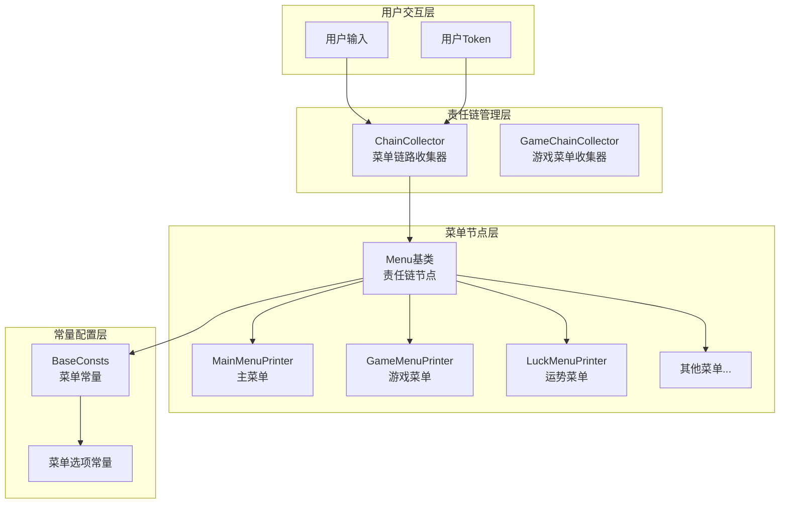

**图表来源**
- [ChainCollector.java](file://Base/src/main/java/com/bot/base/chain/ChainCollector.java#L18-L57)
- [Menu.java](file://Base/src/main/java/com/bot/base/chain/Menu.java#L15-L55)
- [BaseConsts.java](file://Common/src/main/java/com/bot/common/constant/BaseConsts.java#L18-L46)

## 核心组件分析

### 组件关系图

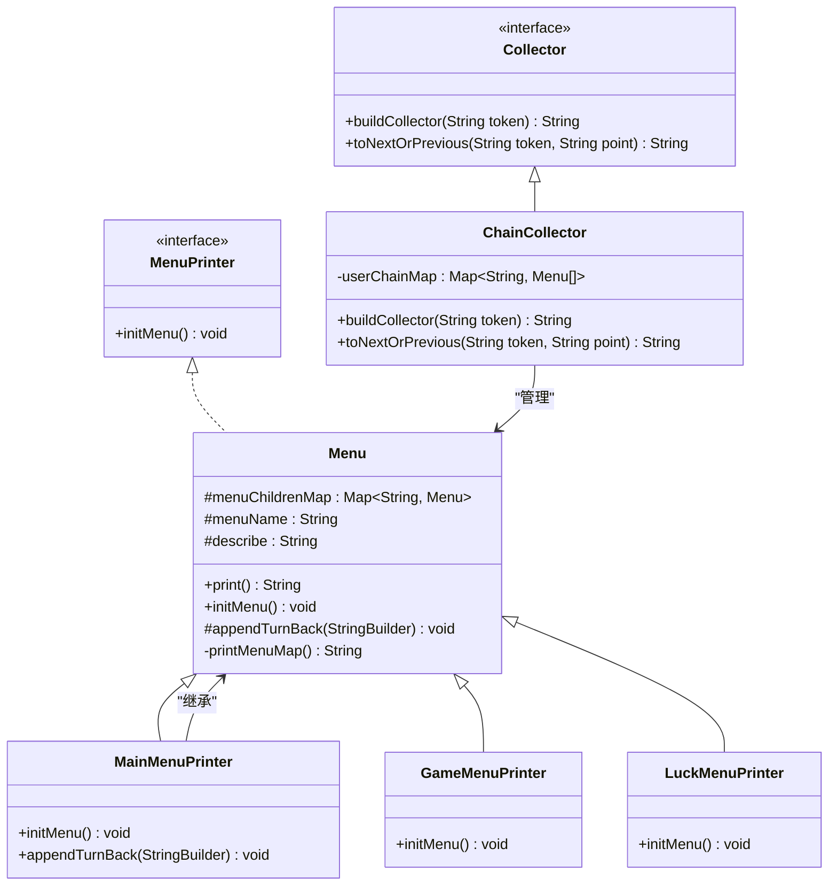

**图表来源**
- [Collector.java](file://Base/src/main/java/com/bot/base/chain/Collector.java#L7-L22)
- [ChainCollector.java](file://Base/src/main/java/com/bot/base/chain/ChainCollector.java#L18-L57)
- [Menu.java](file://Base/src/main/java/com/bot/base/chain/Menu.java#L15-L55)
- [MenuPrinter.java](file://Base/src/main/java/com/bot/base/chain/MenuPrinter.java#L7-L14)

**章节来源**
- [ChainCollector.java](file://Base/src/main/java/com/bot/base/chain/ChainCollector.java#L1-L58)
- [Menu.java](file://Base/src/main/java/com/bot/base/chain/Menu.java#L1-L56)
- [Collector.java](file://Base/src/main/java/com/bot/base/chain/Collector.java#L1-L23)

## ChainCollector详解

ChainCollector是责任链模式的核心控制器，负责维护用户的菜单导航链路。它通过静态的userChainMap存储每个用户的菜单链路状态。

### 核心功能

1. **链路初始化**：为新用户创建初始菜单链路
2. **导航控制**：处理用户在菜单间的跳转和返回
3. **状态管理**：维护用户的菜单浏览历史

### 链路初始化机制

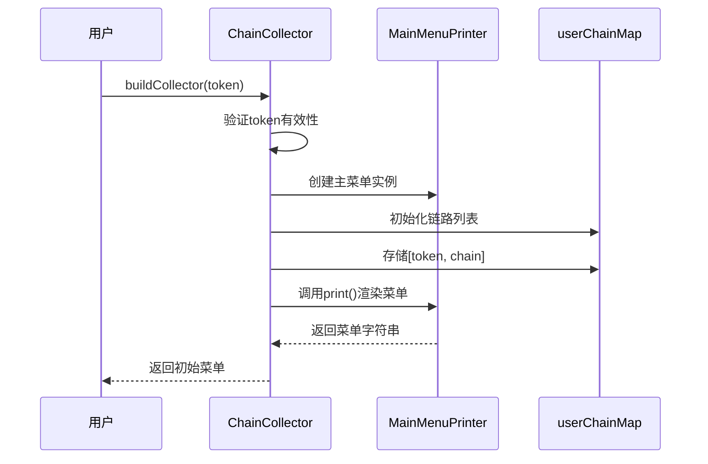

**图表来源**
- [ChainCollector.java](file://Base/src/main/java/com/bot/base/chain/ChainCollector.java#L24-L33)

### 导航控制逻辑

ChainCollector实现了两种主要的导航控制：

1. **前进导航**：根据用户输入的选项跳转到对应的子菜单
2. **返回导航**：支持单步返回和多级返回

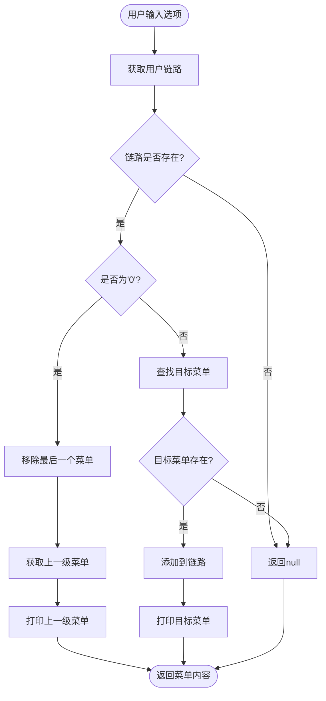

**图表来源**
- [ChainCollector.java](file://Base/src/main/java/com/bot/base/chain/ChainCollector.java#L36-L55)

**章节来源**
- [ChainCollector.java](file://Base/src/main/java/com/bot/base/chain/ChainCollector.java#L18-L57)

## Menu类设计分析

Menu类作为责任链模式的节点，提供了菜单的基本功能和扩展点。它继承自MenuPrinter接口，实现了菜单的通用行为。

### 核心属性

- **menuChildrenMap**：存储子菜单映射关系，支持动态扩展
- **menuName**：菜单名称，用于显示和标识
- **describe**：菜单描述，提供功能说明

### 菜单渲染机制

Menu类的print方法实现了菜单的标准化渲染：

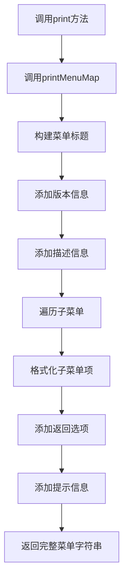

**图表来源**
- [Menu.java](file://Base/src/main/java/com/bot/base/chain/Menu.java#L25-L44)

### 动态菜单扩展

Menu类通过menuChildrenMap支持动态菜单扩展：

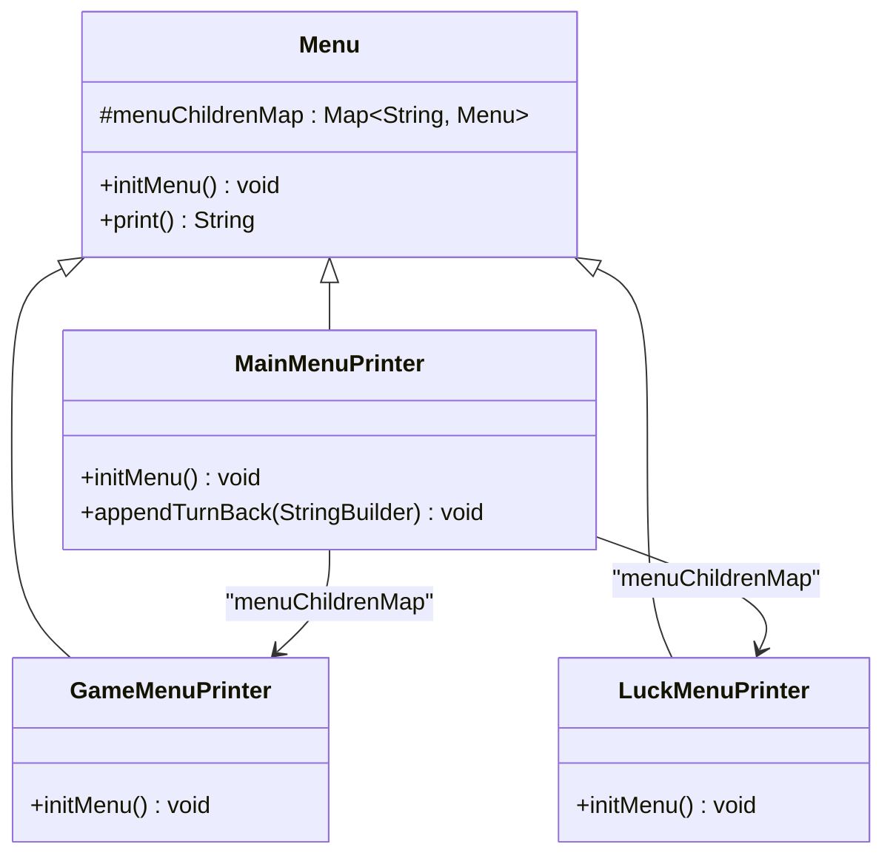

**图表来源**
- [MainMenuPrinter.java](file://Base/src/main/java/com/bot/base/chain/menu/MainMenuPrinter.java#L19-L30)
- [GameMenuPrinter.java](file://Base/src/main/java/com/bot/base/chain/menu/GameMenuPrinter.java#L14-L18)
- [LuckMenuPrinter.java](file://Base/src/main/java/com/bot/base/chain/menu/LuckMenuPrinter.java#L19-L23)

**章节来源**
- [Menu.java](file://Base/src/main/java/com/bot/base/chain/Menu.java#L15-L55)
- [MainMenuPrinter.java](file://Base/src/main/java/com/bot/base/chain/menu/MainMenuPrinter.java#L12-L37)

## 菜单树结构构建

### 主菜单树结构

Bot项目的核心菜单树以主菜单为根节点，形成了清晰的层次结构：

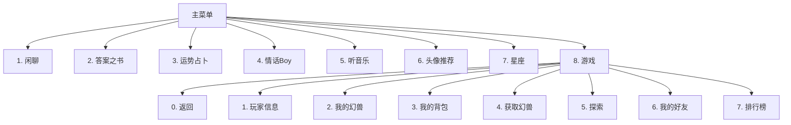

**图表来源**
- [MainMenuPrinter.java](file://Base/src/main/java/com/bot/base/chain/menu/MainMenuPrinter.java#L21-L29)
- [GameMainMenuPrinter.java](file://Game/src/main/java/com/bot/game/chain/menu/GameMainMenuPrinter.java#L27-L36)

### 菜单初始化流程

每个菜单类都通过initMenu方法完成自己的初始化：

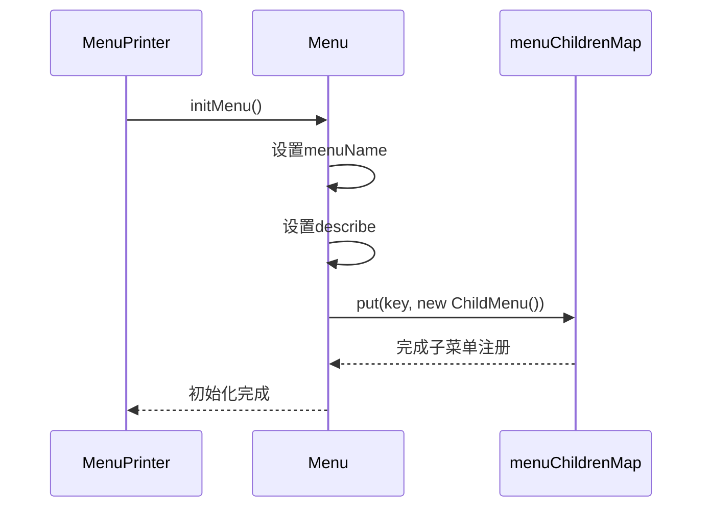

**图表来源**
- [MainMenuPrinter.java](file://Base/src/main/java/com/bot/base/chain/menu/MainMenuPrinter.java#L19-L30)
- [GameMenuPrinter.java](file://Base/src/main/java/com/bot/base/chain/menu/GameMenuPrinter.java#L14-L18)

**章节来源**
- [MainMenuPrinter.java](file://Base/src/main/java/com/bot/base/chain/menu/MainMenuPrinter.java#L12-L37)
- [GameMainMenuPrinter.java](file://Game/src/main/java/com/bot/game/chain/menu/GameMainMenuPrinter.java#L16-L36)

## 导航链路实现机制

### 用户从主菜单进入子菜单的链路构建过程

当用户选择"游戏"菜单时，系统会执行以下步骤：

1. **用户输入验证**：检查用户输入的选项是否有效
2. **链路状态更新**：将当前菜单添加到用户链路
3. **目标菜单加载**：根据选项加载对应的子菜单
4. **链路推进**：将新菜单添加到链路末尾

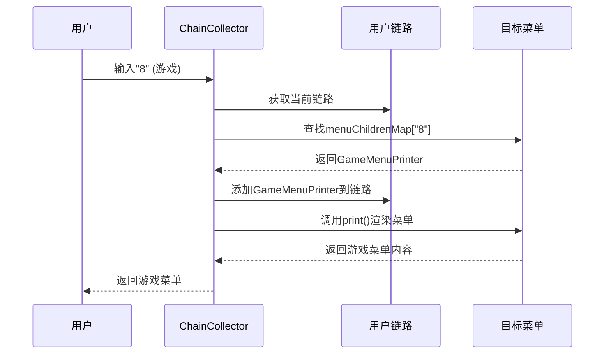

**图表来源**
- [ChainCollector.java](file://Base/src/main/java/com/bot/base/chain/ChainCollector.java#L48-L55)

### 通过输入'0'返回上一级菜单的实现机制

返回机制通过移除链路末尾元素实现：

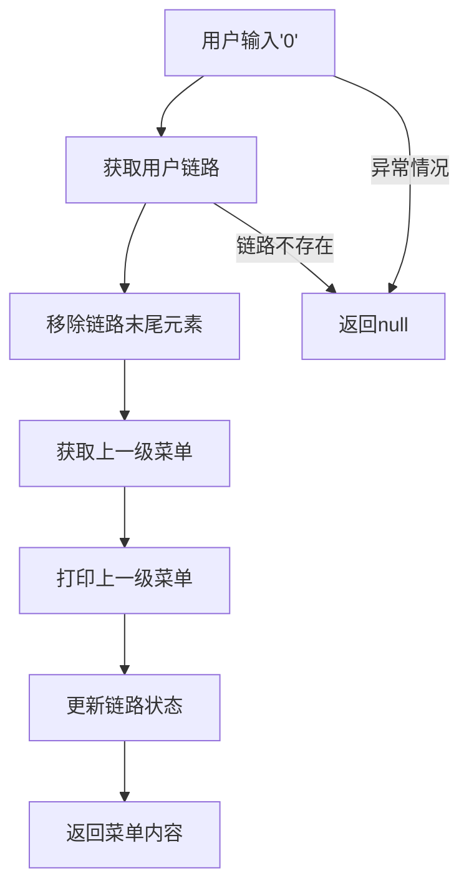

**图表来源**
- [ChainCollector.java](file://Base/src/main/java/com/bot/base/chain/ChainCollector.java#L42-L47)

**章节来源**
- [ChainCollector.java](file://Base/src/main/java/com/bot/base/chain/ChainCollector.java#L36-L55)

## MenuPrinter接口作用

MenuPrinter接口定义了菜单的基本契约，确保所有菜单实现具有一致的行为：

### 接口设计原则

1. **单一职责**：专注于菜单初始化逻辑
2. **扩展性**：允许子类实现特定功能
3. **一致性**：为所有菜单提供统一的接口

### 实现策略

不同类型的菜单通过不同的实现策略满足特定需求：

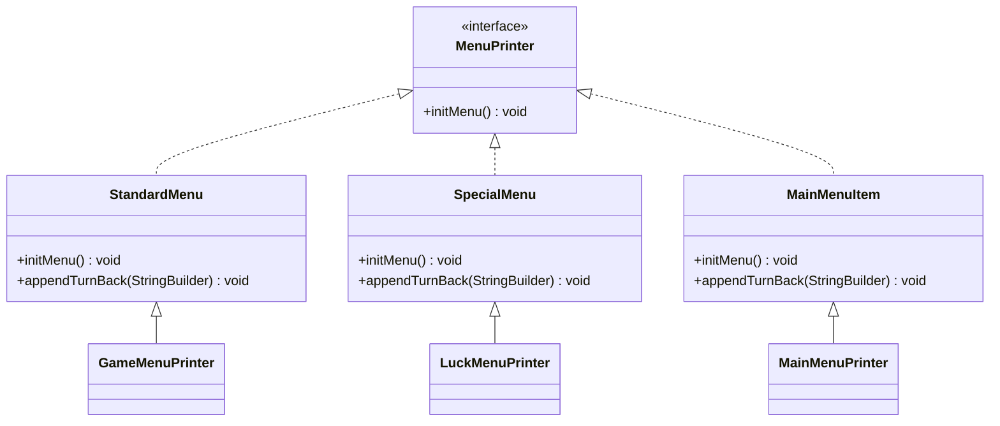

**图表来源**
- [MenuPrinter.java](file://Base/src/main/java/com/bot/base/chain/MenuPrinter.java#L7-L14)
- [MainMenuPrinter.java](file://Base/src/main/java/com/bot/base/chain/menu/MainMenuPrinter.java#L34-L36)

**章节来源**
- [MenuPrinter.java](file://Base/src/main/java/com/bot/base/chain/MenuPrinter.java#L7-L14)

## BaseConsts常量体系

BaseConsts定义了菜单交互行为的统一控制常量，确保系统的规范性和一致性。

### 核心常量定义

| 常量名称 | 值 | 用途 |
|---------|-----|------|
| ONE | "1" | 第一选项标识 |
| TWO | "2" | 第二选项标识 |
| ZERO | "0" | 返回选项标识 |
| DOUBLE_ZERO | "00" | 返回主菜单标识 |
| MAIN_MENU_NAME | "菜单" | 主菜单名称 |
| TURN_BACK | "返回" | 返回选项文本 |
| MENU_TIP | "回复选项前的数字，即可查看更多" | 菜单提示信息 |

### 常量使用模式

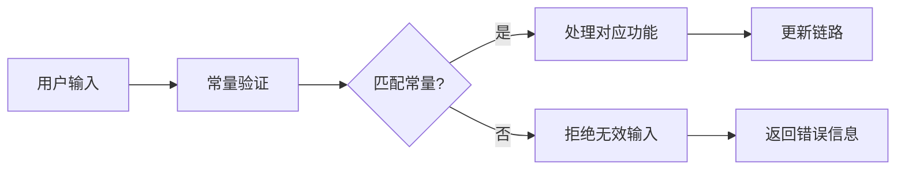

**图表来源**
- [BaseConsts.java](file://Common/src/main/java/com/bot/common/constant/BaseConsts.java#L18-L46)
- [ChainCollector.java](file://Base/src/main/java/com/bot/base/chain/ChainCollector.java#L42-L47)

**章节来源**
- [BaseConsts.java](file://Common/src/main/java/com/bot/common/constant/BaseConsts.java#L18-L46)

## 实际使用场景分析

### 场景一：用户从主菜单进入游戏菜单

**交互流程**：
1. 用户收到主菜单显示
2. 用户输入"8"选择游戏菜单
3. ChainCollector处理输入，构建游戏菜单链路
4. 游戏菜单显示，用户可进一步选择具体功能

### 场景二：用户在游戏菜单中返回主菜单

**交互流程**：
1. 用户在游戏菜单中输入"00"（双零）
2. ChainCollector检测到DOUBLE_ZERO常量
3. 清空当前链路，重建为主菜单链路
4. 返回主菜单给用户

### 场景三：异常链路处理

当用户输入无效选项时，系统会：
1. 检查menuChildrenMap中是否存在对应键
2. 如果不存在，返回null表示无效输入
3. 不修改现有链路状态
4. 可能尝试其他处理逻辑（如服务调用）

**章节来源**
- [ChainCollector.java](file://Base/src/main/java/com/bot/base/chain/ChainCollector.java#L48-L55)
- [GameChainCollector.java](file://Game/src/main/java/com/bot/game/chain/GameChainCollector.java#L60-L106)

## 异常处理与优化

### 异常处理机制

系统实现了多层次的异常处理：

1. **Token验证**：检查用户身份标识的有效性
2. **链路验证**：确保用户有有效的导航链路
3. **选项验证**：验证用户输入的选项是否有效
4. **降级处理**：提供备用处理逻辑

### 性能优化策略

1. **静态缓存**：使用静态Map存储用户链路，避免重复创建
2. **延迟初始化**：菜单对象按需创建，减少内存占用
3. **快速查找**：通过HashMap实现O(1)的菜单查找
4. **链路复用**：相同菜单实例在不同路径中复用

### 扩展性考虑

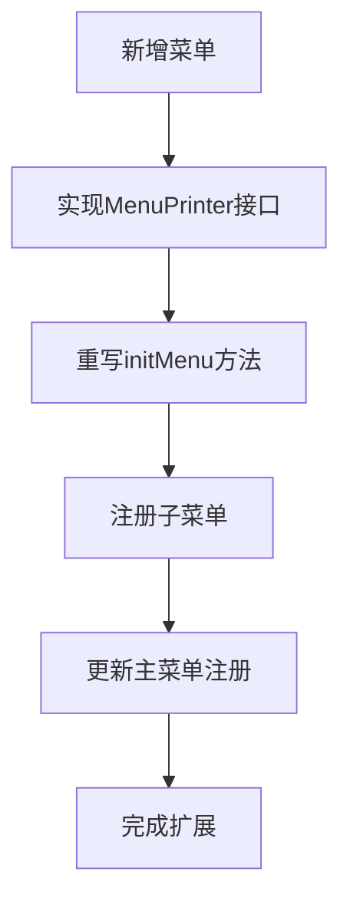

**章节来源**
- [ChainCollector.java](file://Base/src/main/java/com/bot/base/chain/ChainCollector.java#L26-L33)
- [GameChainCollector.java](file://Game/src/main/java/com/bot/game/chain/GameChainCollector.java#L36-L44)

## 与其他导航模式对比

### 责任链模式 vs 其他模式

| 特性 | 责任链模式 | 状态机模式 | 策略模式 |
|------|-----------|-----------|----------|
| 灵活性 | 高 - 支持动态链路 | 中 - 固定状态转换 | 中 - 固定策略选择 |
| 扩展性 | 优秀 - 易于添加新菜单 | 良好 - 需要重构状态机 | 良好 - 需要新增策略类 |
| 维护性 | 良好 - 结构清晰 | 较差 - 状态转换复杂 | 良好 - 策略独立 |
| 性能 | 中等 - 链路遍历 | 优秀 - 状态表查找 | 优秀 - 直接策略调用 |
| 内存占用 | 中等 - 链路存储 | 良好 - 状态表固定 | 良好 - 策略实例共享 |

### 优势分析

1. **动态性**：支持运行时动态构建菜单链路
2. **解耦性**：菜单节点间松耦合，易于维护
3. **可扩展性**：新菜单类型只需实现标准接口
4. **灵活性**：支持复杂的导航逻辑和条件分支

### 适用场景

- **多层级菜单系统**：如Bot项目的8个一级菜单
- **动态功能组合**：需要根据用户权限动态调整的功能
- **复杂业务流程**：需要多步骤交互的业务场景
- **插件化系统**：支持第三方功能模块的集成

## 总结

Bot项目的责任链模式实现展现了优秀的软件设计思想：

### 设计亮点

1. **清晰的职责分离**：ChainCollector负责链路管理，Menu类负责菜单渲染
2. **良好的扩展性**：通过接口和抽象类支持新菜单类型的轻松添加
3. **强大的容错能力**：完善的异常处理和降级机制
4. **高效的性能表现**：基于HashMap的快速查找和静态缓存

### 最佳实践

1. **使用接口约束**：MenuPrinter接口确保了实现的一致性
2. **合理利用常量**：BaseConsts统一管理菜单选项，提高可维护性
3. **注重用户体验**：清晰的导航提示和便捷的返回机制
4. **关注性能优化**：静态缓存和延迟初始化策略

### 应用价值

该责任链模式不仅解决了Bot项目中的菜单导航问题，更为类似的多层级交互系统提供了可借鉴的设计方案。其灵活的架构和良好的扩展性使其能够适应不断变化的业务需求，是现代聊天机器人系统设计的优秀范例。