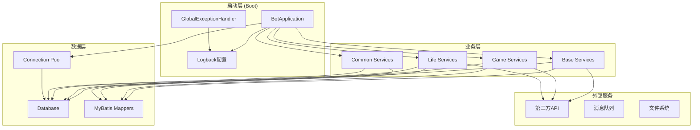
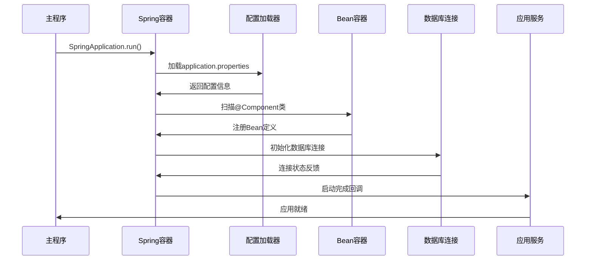
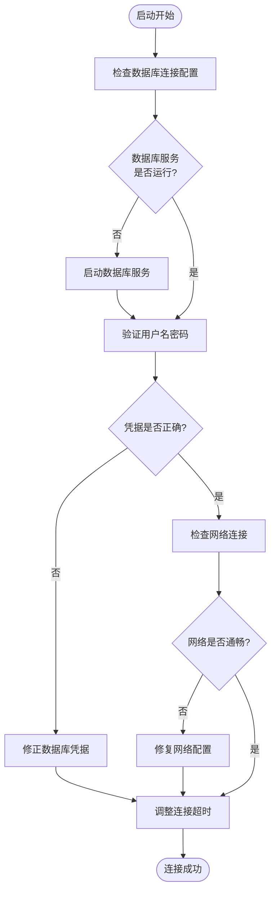
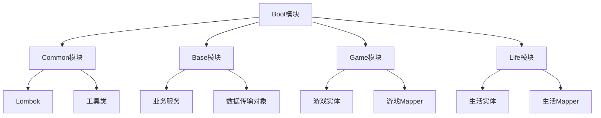

# 启动问题排查

<cite>
**本文档引用的文件**
- [BotApplication.java](file://Boot/src/main/java/com/bot/boot/BotApplication.java)
- [application.properties](file://Boot/src/main/resources/application.properties)
- [application-dev.properties](file://Boot/src/main/resources/application-dev.properties)
- [application-prod.properties](file://Boot/src/main/resources/application-prod.properties)
- [logback-spring.xml](file://Boot/src/main/resources/logback-spring.xml)
- [GlobalExceptionHandler.java](file://Boot/src/main/java/com/bot/boot/aspect/GlobalExceptionHandler.java)
- [Life_Deployment_Guide.md](file://Life_Deployment_Guide.md)
- [pom.xml](file://Boot/pom.xml)
</cite>

## 目录
1. [概述](#概述)
2. [项目架构分析](#项目架构分析)
3. [Spring Boot启动流程](#spring-boot启动流程)
4. [常见启动问题及解决方案](#常见启动问题及解决方案)
5. [配置文件分析与验证](#配置文件分析与验证)
6. [数据库连接问题排查](#数据库连接问题排查)
7. [端口冲突问题诊断](#端口冲突问题诊断)
8. [依赖缺失问题分析](#依赖缺失问题分析)
9. [日志分析与故障定位](#日志分析与故障定位)
10. [性能优化建议](#性能优化建议)
11. [故障排除工具箱](#故障排除工具箱)

## 概述

Bot项目是一个基于Spring Boot框架的多模块Java应用程序，采用微服务架构设计，包含基础服务模块(Base)、游戏模块(Game)、生活模块(Life)、通用模块(Common)和启动模块(Boot)。项目启动过程中可能遇到多种问题，包括配置错误、数据库连接失败、端口占用、依赖缺失等。

本文档基于Life_Deployment_Guide.md中的部署指导，结合application.properties配置文件，提供全面的启动问题诊断和解决方案。

## 项目架构分析

Bot项目采用分层架构设计，主要包含以下核心组件：



**图表来源**
- [BotApplication.java](file://Boot/src/main/java/com/bot/boot/BotApplication.java#L12-L21)
- [application.properties](file://Boot/src/main/resources/application.properties#L12-L70)

**章节来源**
- [BotApplication.java](file://Boot/src/main/java/com/bot/boot/BotApplication.java#L1-L22)
- [pom.xml](file://Boot/pom.xml#L14-L34)

## Spring Boot启动流程

BotApplication作为Spring Boot应用的启动入口，遵循标准的Spring Boot启动流程：



**图表来源**
- [BotApplication.java](file://Boot/src/main/java/com/bot/boot/BotApplication.java#L17-L18)

### 关键初始化步骤

1. **配置文件加载**：根据spring.profiles.active参数加载对应环境配置
2. **包扫描**：扫描指定包路径下的Spring组件
3. **Bean初始化**：创建和初始化所有标注了@Component的类
4. **数据库连接**：建立与MySQL数据库的连接
5. **MyBatis配置**：扫描Mapper接口和XML文件
6. **定时任务启动**：启用@EnableScheduling注解的功能

**章节来源**
- [BotApplication.java](file://Boot/src/main/java/com/bot/boot/BotApplication.java#L12-L14)

## 常见启动问题及解决方案

### 1. 配置文件加载失败

**问题表现**：
- 应用启动时显示"Could not resolve placeholder"错误
- 配置项无法正确读取

**诊断步骤**：
1. 检查spring.profiles.active配置是否正确
2. 验证对应环境的配置文件是否存在
3. 确认配置项格式是否正确

**解决方案**：
```properties
# 确保正确的环境激活
spring.profiles.active=dev

# 或者在命令行指定
java -Dspring.profiles.active=prod -jar bot.jar
```

### 2. 数据库连接超时

**问题表现**：
- 启动时出现"Connection refused"或"Timeout"错误
- MyBatis相关Bean初始化失败

**诊断流程**：



**图表来源**
- [application.properties](file://Boot/src/main/resources/application.properties#L47-L51)

### 3. 包扫描路径错误

**问题表现**：
- 某些模块的Service类无法被Spring扫描到
- 出现"Bean not found"异常

**解决方案**：
确认BotApplication中的scanBasePackages配置包含所有模块包路径：
```java
@SpringBootApplication(scanBasePackages = {
    "com.bot.boot",
    "com.bot.base", 
    "com.bot.game", 
    "com.bot.life", 
    "com.bot.common.loader"
})
```

**章节来源**
- [BotApplication.java](file://Boot/src/main/java/com/bot/boot/BotApplication.java#L12-L13)

## 配置文件分析与验证

### 核心配置项验证

| 配置项 | 默认值 | 说明 | 常见问题 |
|--------|--------|------|----------|
| server.port | 9091 | HTTP服务端口 | 端口被占用、防火墙阻拦 |
| spring.datasource.url | jdbc:mysql://47.92.127.30:3306/bot | 数据库连接URL | IP地址错误、端口错误 |
| spring.datasource.username | root | 数据库用户名 | 用户名拼写错误 |
| spring.datasource.password | gouzaizi@123 | 数据库密码 | 密码错误、特殊字符转义 |
| mybatis.mapper-locations | classpath*:mapper/*.xml | Mapper文件位置 | 文件路径错误 |

### 环境配置对比

不同环境的配置差异：

**开发环境(dev)**：
- 数据库连接：`jdbc:mysql://47.92.127.30:3306/bot`
- 日志路径：`D:\\home\\gardpay\\reconciliation\\logs\\`
- 外部服务URL：指向本地测试环境

**生产环境(prod)**：
- 数据库连接：`jdbc:mysql://47.92.127.30:3306/bot`
- 日志路径：`/data/project/bot/logs`
- 外部服务URL：指向生产环境API

**章节来源**
- [application.properties](file://Boot/src/main/resources/application.properties#L1-L70)
- [application-dev.properties](file://Boot/src/main/resources/application-dev.properties#L1-L59)
- [application-prod.properties](file://Boot/src/main/resources/application-prod.properties#L1-L92)

## 数据库连接问题排查

### 连接池配置分析

Bot项目使用Druid连接池，配置参数如下：

```properties
# Druid连接池配置
spring.datasource.type=com.alibaba.druid.pool.DruidDataSource
spring.datasource.tomcat.initial-size=1
spring.datasource.tomcat.max-wait=20
spring.datasource.tomcat.min-idle=3
spring.datasource.tomcat.max-active=60000
spring.datasource.tomcat.time-between-eviction-runs-millis=60000
spring.datasource.tomcat.min-evictable-idle-time-millis=300000
```

### 常见数据库问题

1. **连接超时**：调整max-wait参数或检查网络延迟
2. **连接泄漏**：监控连接池使用情况，确保正确关闭连接
3. **死锁检测**：启用Druid的SQL监控功能
4. **性能瓶颈**：根据并发量调整max-active参数

### 数据库健康检查

```sql
-- 检查连接池状态
SHOW PROCESSLIST;

-- 检查表结构
SHOW TABLE STATUS LIKE 'bot_%';

-- 检查索引使用
EXPLAIN SELECT * FROM bot_user LIMIT 1;
```

**章节来源**
- [application.properties](file://Boot/src/main/resources/application.properties#L52-L62)

## 端口冲突问题诊断

### 端口占用检查

**Windows系统**：
```cmd
netstat -ano | findstr :9091
tasklist | findstr <PID>
```

**Linux系统**：
```bash
netstat -tlnp | grep 9091
ps -ef | grep <PID>
```

### 端口配置修改

如果9091端口被占用，可以在application.properties中修改：
```properties
server.port=9092
```

或者通过命令行参数指定：
```bash
java -Dserver.port=9092 -jar bot.jar
```

### 上下文路径配置

当前配置的上下文路径为`/bot`，可以通过以下方式修改：
```properties
server.servlet.context-path=/custom-path
```

**章节来源**
- [application.properties](file://Boot/src/main/resources/application.properties#L3-L4)

## 依赖缺失问题分析

### Maven依赖结构

Bot项目采用多模块Maven结构，主模块Boot依赖其他四个子模块：



**图表来源**
- [pom.xml](file://Boot/pom.xml#L14-L34)

### 常见依赖问题

1. **版本冲突**：检查pom.xml中的dependencyManagement
2. **缺少模块**：确认所有子模块都已正确编译
3. **循环依赖**：避免模块间的循环引用
4. **运行时依赖**：确保runtime依赖正确配置

### 依赖检查命令

```bash
# 检查依赖树
mvn dependency:tree

# 清理并重新构建
mvn clean install

# 跳过测试构建
mvn clean package -DskipTests
```

**章节来源**
- [pom.xml](file://Boot/pom.xml#L14-L34)

## 日志分析与故障定位

### 日志配置结构

Bot项目使用Logback进行日志管理，配置特点：

```xml
<!-- 控制台日志级别 -->
<root level="${logback.level}">
    <appender-ref ref="CONSOLE"/>
    <appender-ref ref="ASYNC_ROLLING_FILE"/>
</root>

<!-- SQL语句日志 -->
<logger name="com.bot.game.dao.mapper" level="${sql.level}"/>
<logger name="com.bot.life.dao.mapper" level="${sql.level}"/>
```

### 关键日志分析

**启动阶段日志**：
```
INFO  o.s.b.w.embedded.tomcat.TomcatWebServer - Tomcat started on port(s): 9091 (http) with context path '/bot'
INFO  c.b.boot.BotApplication - Started BotApplication in 12.345 seconds
```

**数据库连接日志**：
```
INFO  com.alibaba.druid.pool.DruidDataSource - {dataSource-1} inited
DEBUG c.a.druid.pool.DruidPooledConnection - pool connect success
```

**异常日志示例**：
```
ERROR c.b.boot.aspect.GlobalExceptionHandler - Exception occurred: java.sql.SQLNonTransientConnectionException
```

### 日志级别调整

根据问题严重程度调整日志级别：

```properties
# 开发环境：详细日志
logback.level=DEBUG

# 生产环境：关键日志
logback.level=INFO

# 数据库SQL调试
logback.sql-level=DEBUG
```

**章节来源**
- [logback-spring.xml](file://Boot/src/main/resources/logback-spring.xml#L1-L59)

## 性能优化建议

### 数据库连接池优化

基于现有配置，建议的优化参数：

```properties
# 连接池优化
spring.datasource.tomcat.initial-size=5
spring.datasource.tomcat.min-idle=10
spring.datasource.tomcat.max-active=100
spring.datasource.tomcat.max-wait=5000
spring.datasource.tomcat.time-between-eviction-runs-millis=30000
spring.datasource.tomcat.min-evictable-idle-time-millis=60000
```

### JVM参数调优

推荐的JVM启动参数：

```bash
java -Xms512m -Xmx2g \
     -XX:+UseG1GC \
     -XX:MaxGCPauseMillis=200 \
     -XX:+HeapDumpOnOutOfMemoryError \
     -jar bot.jar
```

### MyBatis性能优化

```properties
# MyBatis配置优化
mybatis.configuration.default-fetch-size=100
mybatis.configuration.default-statement-timeout=3000
mybatis.configuration.cache-enabled=true
```

## 故障排除工具箱

### 诊断命令集

**网络连通性检查**：
```bash
# 检查端口连通性
telnet localhost 9091

# 检查数据库连接
mysql -h 47.92.127.30 -P 3306 -u root -p

# 检查服务状态
curl http://localhost:9091/bot/health
```

**系统资源监控**：
```bash
# CPU和内存使用情况
top -p $(pgrep -f bot.jar)

# 磁盘空间检查
df -h

# 文件描述符限制
ulimit -n
```

**应用健康检查**：
```bash
# 检查进程状态
ps aux | grep bot.jar

# 检查JVM进程
jps -l

# 检查堆内存使用
jstat -gc <pid>
```

### 快速恢复流程

当遇到启动问题时，按以下顺序进行排查：

1. **检查日志**：查看详细的错误信息
2. **验证配置**：确认配置文件无语法错误
3. **网络测试**：确保所有外部服务可达
4. **资源检查**：确认系统资源充足
5. **依赖验证**：检查所有依赖模块正常
6. **重启应用**：清理缓存后重新启动

### 故障预防措施

1. **定期备份**：备份重要配置文件和数据库
2. **监控告警**：设置关键指标监控
3. **版本控制**：对配置文件进行版本管理
4. **测试环境**：在生产前充分测试
5. **文档维护**：保持故障排除文档更新

通过以上全面的排查指南和解决方案，可以有效诊断和解决Bot项目启动过程中的各种问题，确保系统的稳定运行。