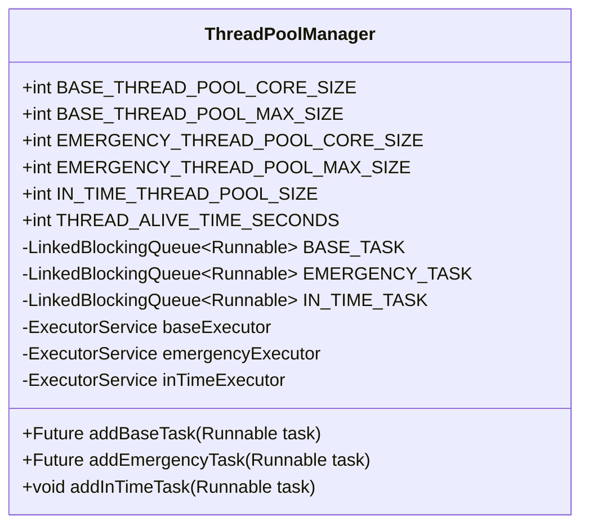
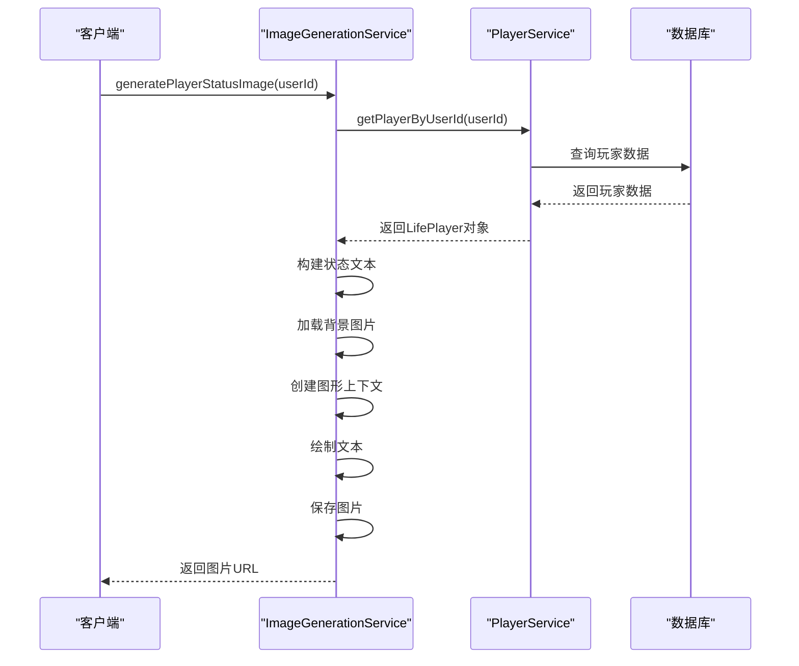
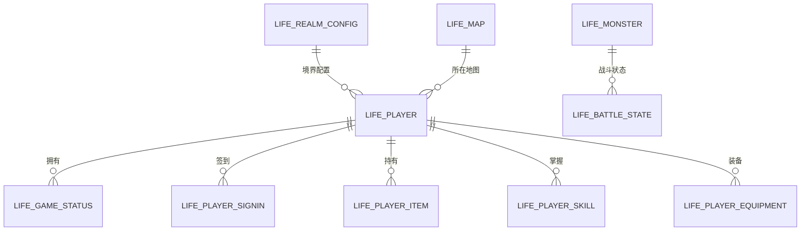
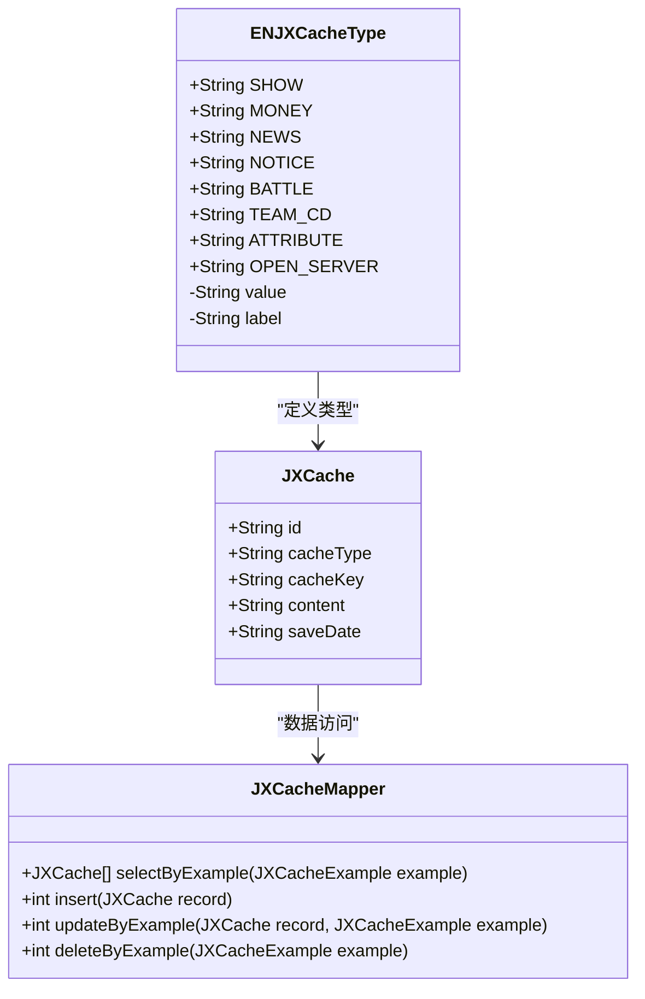
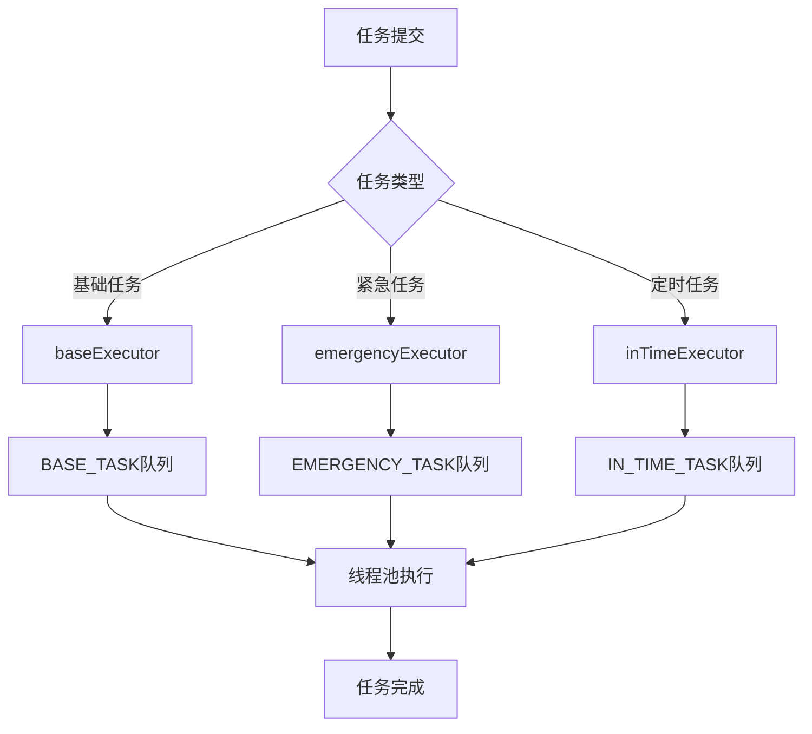
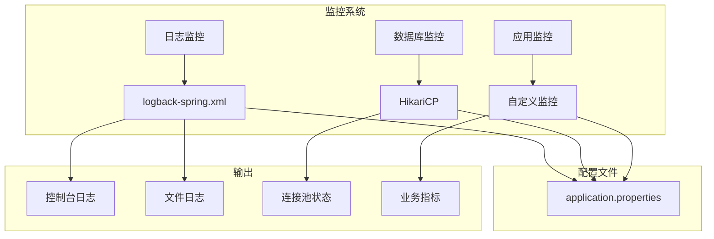

# 性能问题优化

<cite>
**本文档引用的文件**  
- [Life_Deployment_Guide.md](file://Life_Deployment_Guide.md)
- [ThreadPoolManager.java](file://Common/src/main/java/com/bot/common/util/ThreadPoolManager.java)
- [ImageGenerationServiceImpl.java](file://Life/src/main/java/com/bot/life/service/impl/ImageGenerationServiceImpl.java)
- [application.properties](file://Boot/src/main/resources/application.properties)
- [logback-spring.xml](file://Boot/src/main/resources/logback-spring.xml)
- [JXCacheMapper.xml](file://Game/src/main/resources/mapper/JXCacheMapper.xml)
- [LifePlayerMapper.xml](file://Life/src/main/resources/mapper/LifePlayerMapper.xml)
</cite>

## 目录
1. [引言](#引言)
2. [线程池配置与系统性能](#线程池配置与系统性能)
3. [图片生成服务性能分析](#图片生成服务性能分析)
4. [数据库查询优化](#数据库查询优化)
5. [内存管理与缓存策略](#内存管理与缓存策略)
6. [并发处理与任务调度](#并发处理与任务调度)
7. [性能监控与调优方法](#性能监控与调优方法)
8. [总结](#总结)

## 引言

本性能问题优化文档旨在深入分析Bot项目中可能遇到的性能瓶颈，并提供相应的解决方案。通过参考《Life_Deployment_Guide.md》中的性能优化建议，结合`ThreadPoolManager.java`说明线程池配置对系统性能的影响。以`ImageGenerationServiceImpl.java`为例，分析图片生成服务的性能特征和优化策略。涵盖数据库查询优化、内存管理、并发处理等方面的最佳实践，提供性能监控和调优的具体方法。

**本文档引用的文件**  
- [Life_Deployment_Guide.md](file://Life_Deployment_Guide.md)

## 线程池配置与系统性能

`ThreadPoolManager`类实现了自定义的线程池管理机制，为系统提供了三种不同类型的线程池：基础线程池、紧急线程池和定时任务线程池。这种分层设计有助于合理分配系统资源，避免单一任务类型占用过多线程资源导致其他任务阻塞。

**图示来源**  
- [ThreadPoolManager.java](file://Common/src/main/java/com/bot/common/util/ThreadPoolManager.java#L1-L124)

**本节来源**  
- [ThreadPoolManager.java](file://Common/src/main/java/com/bot/common/util/ThreadPoolManager.java#L1-L124)

## 图片生成服务性能分析

`ImageGenerationServiceImpl`是浮生卷模块的核心服务之一，负责生成带有角色状态的游戏图像。该服务的性能直接影响用户体验和系统响应速度。

**图示来源**  
- [ImageGenerationServiceImpl.java](file://Life/src/main/java/com/bot/life/service/impl/ImageGenerationServiceImpl.java#L1-L305)

**本节来源**  
- [ImageGenerationServiceImpl.java](file://Life/src/main/java/com/bot/life/service/impl/ImageGenerationServiceImpl.java#L1-L305)

## 数据库查询优化

通过对项目配置文件的分析，我们发现系统使用了MyBatis作为持久层框架，并在`application.properties`中进行了相关配置。这些配置对数据库查询性能有重要影响。

**图示来源**  
- [LifePlayerMapper.xml](file://Life/src/main/resources/mapper/LifePlayerMapper.xml#L19-L71)
- [LifeGameStatusMapper.xml](file://Life/src/main/resources/mapper/LifeGameStatusMapper.xml#L1-L32)

**本节来源**  
- [application.properties](file://Boot/src/main/resources/application.properties#L64-L69)
- [LifePlayerMapper.xml](file://Life/src/main/resources/mapper/LifePlayerMapper.xml#L19-L71)

## 内存管理与缓存策略

系统通过`JXCache`表实现了一种通用的缓存机制，用于存储各种类型的缓存数据。这种设计可以有效减少对后端服务的重复请求，提高系统响应速度。

**图示来源**  
- [ENJXCacheType.java](file://Common/src/main/java/com/bot/common/enums/ENJXCacheType.java#L1-L23)
- [JXCache.java](file://Game/src/main/java/com/bot/game/dao/entity/JXCache.java#L48-L238)
- [JXCacheMapper.xml](file://Game/src/main/resources/mapper/JXCacheMapper.xml#L1-L95)

**本节来源**  
- [ENJXCacheType.java](file://Common/src/main/java/com/bot/common/enums/ENJXCacheType.java#L1-L23)
- [JXCache.java](file://Game/src/main/java/com/bot/game/dao/entity/JXCache.java#L48-L238)

## 并发处理与任务调度

系统的并发处理能力主要依赖于`ThreadPoolManager`提供的线程池服务。通过将不同类型的任务分配到不同的线程池中，系统能够更有效地利用CPU资源，提高整体吞吐量。

**图示来源**  
- [ThreadPoolManager.java](file://Common/src/main/java/com/bot/common/util/ThreadPoolManager.java#L52-L62)

**本节来源**  
- [ThreadPoolManager.java](file://Common/src/main/java/com/bot/common/util/ThreadPoolManager.java#L52-L62)

## 性能监控与调优方法

系统提供了完善的性能监控和调优机制，包括日志记录、数据库连接池监控和应用指标监控等。

**图示来源**  
- [logback-spring.xml](file://Boot/src/main/resources/logback-spring.xml#L1-L59)
- [application.properties](file://Boot/src/main/resources/application.properties#L48-L63)

**本节来源**  
- [logback-spring.xml](file://Boot/src/main/resources/logback-spring.xml#L1-L59)
- [application.properties](file://Boot/src/main/resources/application.properties#L48-L63)

## 总结

通过对Bot项目的深入分析，我们识别了多个潜在的性能瓶颈，并提出了相应的优化建议。关键优化点包括：

1. **线程池配置**：合理设置线程池大小，避免资源浪费和线程竞争。
2. **图片生成优化**：实现图片缓存机制，减少重复生成开销。
3. **数据库查询优化**：使用适当的索引，优化SQL语句，减少查询时间。
4. **内存管理**：合理使用缓存，避免内存泄漏。
5. **并发处理**：充分利用多核CPU，提高系统吞吐量。
6. **性能监控**：建立全面的监控体系，及时发现和解决性能问题。

这些优化措施将显著提升系统的性能和稳定性，为用户提供更好的体验。