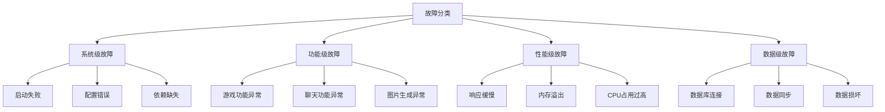
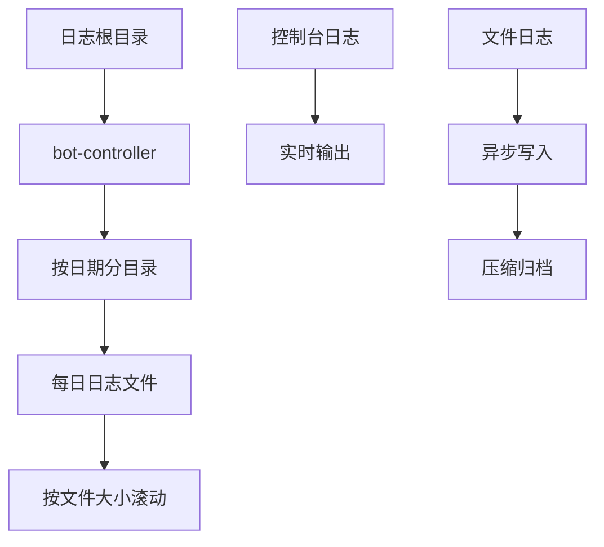
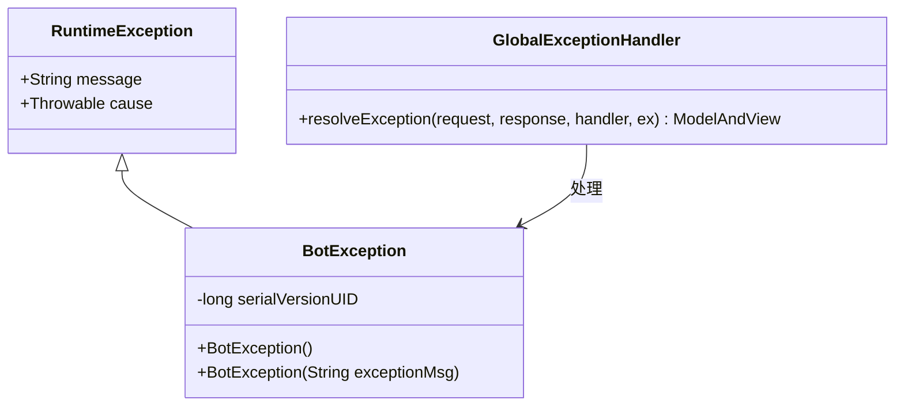
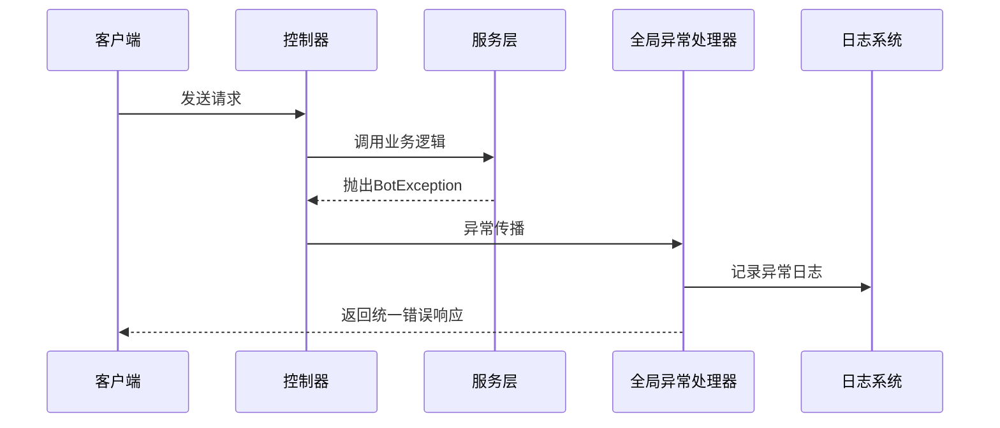
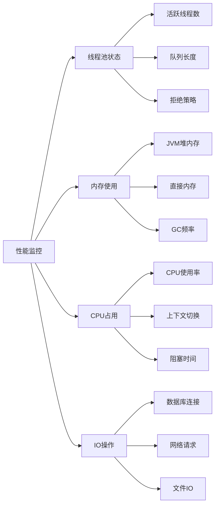
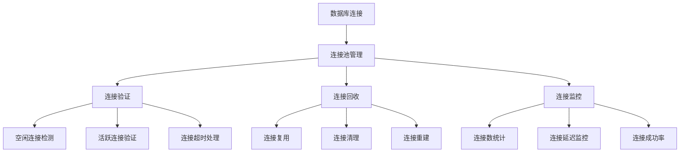
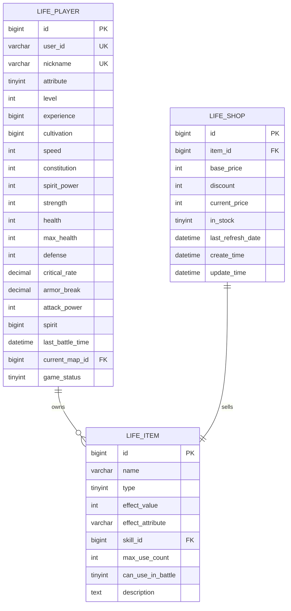
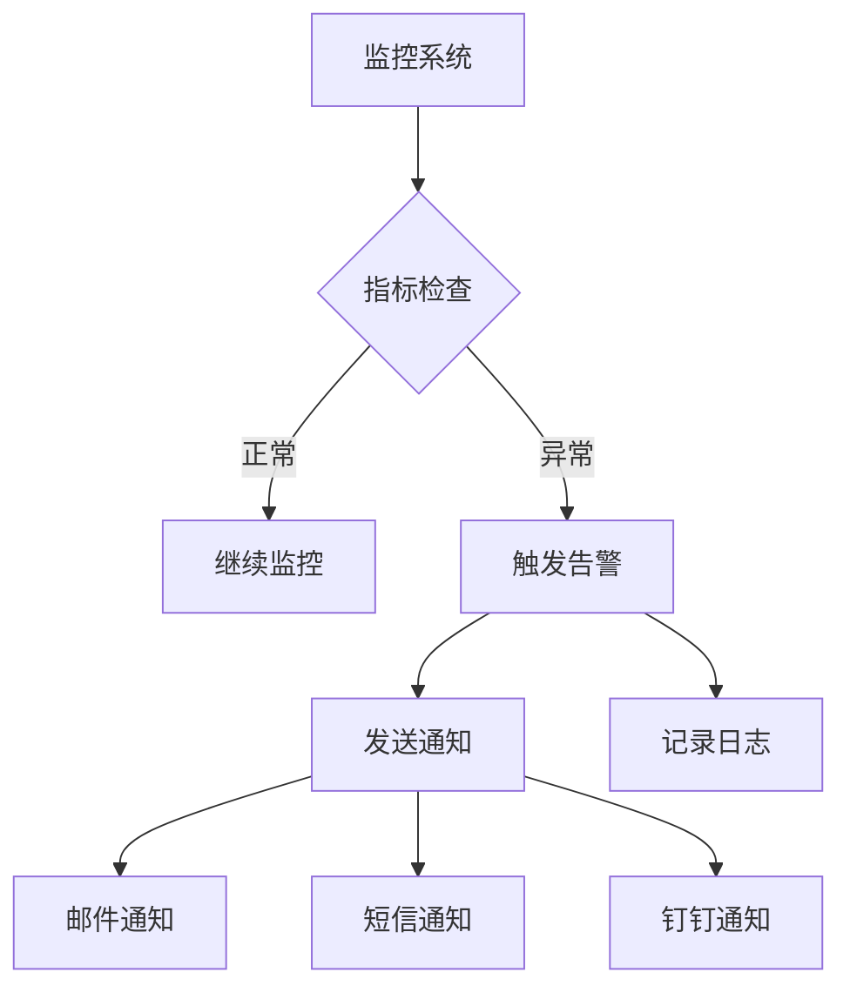
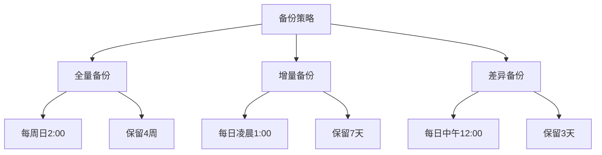

# 故障排除

<cite>
**本文档引用的文件**
- [logback-spring.xml](file://Boot/src/main/resources/logback-spring.xml)
- [BotException.java](file://Common/src/main/java/com/bot/common/exception/BotException.java)
- [GlobalExceptionHandler.java](file://Boot/src/main/java/com/bot/boot/aspect/GlobalExceptionHandler.java)
- [Life_Deployment_Guide.md](file://Life_Deployment_Guide.md)
- [application.properties](file://Boot/src/main/resources/application.properties)
- [BaseConsts.java](file://Common/src/main/java/com/bot/common/constant/BaseConsts.java)
- [BootConsts.java](file://Common/src/main/java/com/bot/common/constant/BootConsts.java)
- [ThreadPoolManager.java](file://Common/src/main/java/com/bot/common/util/ThreadPoolManager.java)
- [Life_Database_Init.sql](file://Life_Database_Init.sql)
- [浮生卷开发说明.md](file://浮生卷开发说明.md)
</cite>

## 目录
1. [概述](#概述)
2. [日志系统配置与分析](#日志系统配置与分析)
3. [异常处理机制](#异常处理机制)
4. [常见问题分类](#常见问题分类)
5. [性能问题诊断](#性能问题诊断)
6. [连接问题排查](#连接问题排查)
7. [数据一致性问题](#数据一致性问题)
8. [故障排除工具](#故障排除工具)
9. [预防措施](#预防措施)
10. [技术支持](#技术支持)

## 概述

Bot项目是一个基于Spring Boot的多功能聊天机器人系统，包含游戏模块、生活助手、工作管理等多个功能模块。本文档提供了系统性的故障排除方法，帮助运维和开发人员快速定位和解决各种技术问题。

### 故障分类体系



## 日志系统配置与分析

### Logback配置详解

Bot项目采用Logback作为日志框架，配置文件位于`Boot/src/main/resources/logback-spring.xml`。

#### 核心配置参数

| 参数名称 | 默认值 | 说明 |
|---------|--------|------|
| logback.level | INFO | 日志级别 |
| logback.rootPath | C:\logs\bot | 日志根目录 |
| logback.pattern | %d{HH:mm:ss.SSS} [%thread] %-5level %logger-%line -- %msg --%n | 日志格式 |
| logback.charset | UTF-8 | 字符编码 |
| sql.level | DEBUG | SQL语句日志级别 |

#### 日志文件结构



**图表来源**
- [logback-spring.xml](file://Boot/src/main/resources/logback-spring.xml#L11-L58)

#### 日志分析方法

1. **错误级别日志分析**
   - 查找ERROR级别日志定位严重问题
   - 关注异常堆栈信息
   - 记录发生时间和上下文

2. **SQL语句分析**
   - 开启SQL日志查看数据库操作
   - 分析慢查询和错误查询
   - 监控数据库连接状态

3. **性能分析**
   - 查看方法执行时间
   - 分析线程池使用情况
   - 监控内存和CPU使用

**章节来源**
- [logback-spring.xml](file://Boot/src/main/resources/logback-spring.xml#L1-L59)

## 异常处理机制

### BotException异常体系

项目定义了专门的异常类用于统一异常处理。

#### 异常类结构



**图表来源**
- [BotException.java](file://Common/src/main/java/com/bot/common/exception/BotException.java#L7-L19)
- [GlobalExceptionHandler.java](file://Boot/src/main/java/com/bot/boot/aspect/GlobalExceptionHandler.java#L18-L26)

#### 异常处理流程



**图表来源**
- [GlobalExceptionHandler.java](file://Boot/src/main/java/com/bot/boot/aspect/GlobalExceptionHandler.java#L21-L25)

### 异常诊断步骤

1. **捕获异常信息**
   - 查看异常类型和消息
   - 分析异常发生的上下文
   - 检查异常堆栈跟踪

2. **分类异常类型**
   - BotException：业务逻辑异常
   - RuntimeException：运行时异常
   - SQLException：数据库异常
   - NullPointerException：空指针异常

3. **制定解决方案**
   - 根据异常类型确定处理策略
   - 实施相应的修复措施
   - 验证修复效果

**章节来源**
- [BotException.java](file://Common/src/main/java/com/bot/common/exception/BotException.java#L1-L20)
- [GlobalExceptionHandler.java](file://Boot/src/main/java/com/bot/boot/aspect/GlobalExceptionHandler.java#L1-L27)

## 常见问题分类

### 启动问题

#### 数据库连接失败

**症状表现：**
- 应用启动时数据库连接异常
- Spring容器初始化失败
- Bean加载异常

**诊断方法：**
1. 检查数据库服务状态
2. 验证连接配置参数
3. 测试网络连通性

**解决方案：**
```properties
# application.properties 配置验证
spring.datasource.url=jdbc:mysql://localhost:3306/bot?useSSL=false&serverTimezone=UTC&characterEncoding=utf8
spring.datasource.username=root
spring.datasource.password=your_password
```

#### 依赖注入失败

**症状表现：**
- Bean创建异常
- @Autowired 注入失败
- 循环依赖问题

**诊断步骤：**
1. 检查包扫描路径配置
2. 验证@Component注解使用
3. 分析Bean生命周期

### 功能问题

#### 游戏功能异常

根据浮生卷开发说明中的问题记录，常见的游戏功能问题包括：

**战斗系统问题：**
- 攻击选择报错（NullPointerException）
- 逃跑功能异常
- 技能使用失败

**数据库映射问题：**
- 字段不匹配导致的SQL语法错误
- 表结构不完整
- 数据类型转换异常

#### 图片生成功能

**问题类型：**
- 背景图片缺失
- 输出目录权限不足
- 字体文件不可用

**解决方案：**
1. 确保背景图片文件存在
2. 设置正确的输出目录权限
3. 验证字体文件可用性

**章节来源**
- [Life_Deployment_Guide.md](file://Life_Deployment_Guide.md#L129-L142)
- [浮生卷开发说明.md](file://浮生卷开发说明.md#L243-L297)

## 性能问题诊断

### 线程池监控

项目实现了自定义的线程池管理器，用于处理不同优先级的任务。

#### 线程池配置

| 线程池类型 | 核心线程数 | 最大线程数 | 存活时间 | 用途 |
|-----------|-----------|-----------|----------|------|
| 基础线程池 | 10 | 50 | 60秒 | 普通业务处理 |
| 紧急线程池 | 3 | 10 | 60秒 | 高优先级任务 |
| 定时线程池 | 1 | 1 | 60秒 | 定时任务调度 |

#### 性能监控指标



**图表来源**
- [ThreadPoolManager.java](file://Common/src/main/java/com/bot/common/util/ThreadPoolManager.java#L15-L34)

### 性能优化建议

1. **数据库连接池优化**
   ```properties
   spring.datasource.hikari.maximum-pool-size=20
   spring.datasource.hikari.minimum-idle=5
   ```

2. **缓存策略**
   - 实现图片缓存机制
   - 缓存频繁访问的数据
   - 定期清理过期缓存

3. **异步处理**
   - 使用线程池处理耗时操作
   - 实现异步消息处理
   - 优化数据库批量操作

**章节来源**
- [ThreadPoolManager.java](file://Common/src/main/java/com/bot/common/util/ThreadPoolManager.java#L1-L124)

## 连接问题排查

### 数据库连接问题

#### 连接池配置



#### 连接问题诊断

1. **连接超时**
   - 检查网络延迟
   - 验证数据库负载
   - 调整连接超时参数

2. **连接泄漏**
   - 监控连接持有时间
   - 检查资源释放逻辑
   - 实现连接池监控

3. **连接池耗尽**
   - 增加连接池大小
   - 优化事务处理
   - 实现连接池监控告警

### 网络连接问题

#### HTTP请求异常

**常见问题：**
- 请求超时
- 网络不稳定
- 代理配置错误

**诊断方法：**
1. 检查网络连通性
2. 验证代理设置
3. 分析请求响应时间

## 数据一致性问题

### 数据库设计规范

根据数据库初始化脚本，项目采用了严格的数据模型设计。

#### 核心表结构



**图表来源**
- [Life_Database_Init.sql](file://Life_Database_Init.sql#L6-L48)

### 数据一致性保证

#### 事务管理

1. **数据库事务**
   - 使用Spring声明式事务
   - 实现分布式事务处理
   - 监控事务执行状态

2. **数据校验**
   - 实体类字段验证
   - 数据库约束检查
   - 业务规则验证

3. **数据备份**
   - 定期数据备份
   - 增量备份策略
   - 快照恢复机制

### 数据同步问题

#### 缓存同步

**问题场景：**
- 缓存与数据库数据不一致
- 缓存更新延迟
- 缓存穿透问题

**解决方案：**
1. 实现缓存更新策略
2. 设置合理的缓存过期时间
3. 使用缓存预热机制

**章节来源**
- [Life_Database_Init.sql](file://Life_Database_Init.sql#L1-L200)

## 故障排除工具

### 日志分析工具

#### 日志查询命令

```bash
# 查看最近错误日志
tail -f C:/logs/bot/bot-controller/$(date +%Y-%m-%d)/bot.$(date +%Y-%m-%d).0.log | grep ERROR

# 查看特定时间段日志
grep "2024-01-15 10:00:00" C:/logs/bot/bot-controller/2024-01-15/bot.2024-01-15.0.log

# 统计错误类型
grep "ERROR" C:/logs/bot/bot-controller/$(date +%Y-%m-%d)/bot.$(date +%Y-%m-%d).0.log | awk '{print $4}' | sort | uniq -c
```

#### 性能分析工具

1. **JVM监控**
   ```bash
   # 查看JVM内存使用
   jstat -gc <pid> 1s
   
   # 查看线程状态
   jstack <pid> > thread_dump.txt
   ```

2. **数据库监控**
   ```sql
   -- 查看慢查询
   SHOW VARIABLES LIKE 'slow_query_log';
   
   -- 查看当前连接
   SHOW PROCESSLIST;
   
   -- 查看表锁状态
   SHOW OPEN TABLES WHERE In_use > 0;
   ```

### 自动化诊断脚本

#### 健康检查脚本

```bash
#!/bin/bash
# Bot系统健康检查脚本

echo "=== Bot系统健康检查 ==="
echo "时间: $(date)"
echo

# 检查进程状态
echo "1. 进程检查:"
ps aux | grep Boot-1.5.0.0.jar | grep -v grep
if [ $? -eq 0 ]; then
    echo "   ✓ 应用进程运行正常"
else
    echo "   ✗ 应用进程未运行"
fi
echo

# 检查端口监听
echo "2. 端口检查:"
netstat -an | grep :9091
if [ $? -eq 0 ]; then
    echo "   ✓ 端口9091监听正常"
else
    echo "   ✗ 端口9091未监听"
fi
echo

# 检查数据库连接
echo "3. 数据库检查:"
mysql -h localhost -u root -p -e "SELECT 1;" bot
if [ $? -eq 0 ]; then
    echo "   ✓ 数据库连接正常"
else
    echo "   ✗ 数据库连接失败"
fi
echo

# 检查磁盘空间
echo "4. 磁盘空间检查:"
df -h | grep logs
echo
```

## 预防措施

### 监控告警机制

#### 关键指标监控

| 监控指标 | 告警阈值 | 监控频率 | 处理建议 |
|---------|---------|---------|---------|
| CPU使用率 | >80% | 1分钟 | 检查高CPU任务 |
| 内存使用率 | >85% | 1分钟 | 检查内存泄漏 |
| 数据库连接数 | >80% | 1分钟 | 增加连接池大小 |
| 响应时间 | >5秒 | 实时 | 优化慢查询 |
| 错误率 | >5% | 1分钟 | 分析错误日志 |

#### 告警通知机制



### 容量规划

#### 资源评估

1. **CPU需求**
   - 并发用户数 × 平均响应时间
   - 业务复杂度系数
   - 预留扩展空间

2. **内存需求**
   - JVM堆内存配置
   - 缓存内存占用
   - 系统预留内存

3. **存储需求**
   - 日志文件大小
   - 数据库增长趋势
   - 备份存储空间

### 备份策略

#### 数据备份计划



## 技术支持

### 故障报告模板

当遇到系统故障时，请按照以下模板提供详细信息：

#### 基本信息
- 故障发生时间：
- 故障现象描述：
- 影响范围：
- 已采取的措施：

#### 技术信息
- 系统版本：
- 操作系统：
- JDK版本：
- 数据库版本：

#### 日志信息
- 相关错误日志：
- 性能监控数据：
- 网络连接状态：

### 常见问题FAQ

#### Q1: 应用启动失败怎么办？
**A:** 检查以下方面：
1. Java环境是否正确安装
2. 数据库服务是否启动
3. 配置文件是否有语法错误
4. 端口是否被占用

#### Q2: 游戏功能异常如何处理？
**A:** 按照以下步骤排查：
1. 查看游戏模块日志
2. 检查数据库表结构
3. 验证配置参数
4. 重启相关服务

#### Q3: 性能下降如何优化？
**A:** 实施以下优化措施：
1. 调整线程池配置
2. 优化数据库查询
3. 实现缓存机制
4. 监控系统资源

### 联系方式

- 技术支持邮箱：support@bot.com
- 问题反馈平台：https://github.com/bot/issues
- 文档更新日志：https://github.com/bot/wiki

**章节来源**
- [Life_Deployment_Guide.md](file://Life_Deployment_Guide.md#L225-L230)