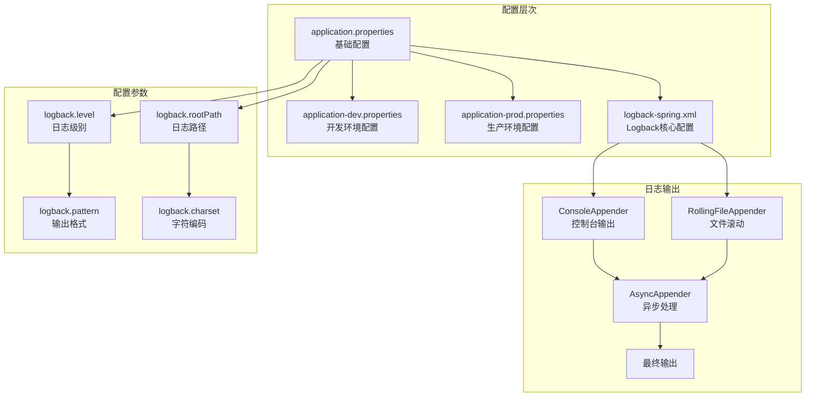
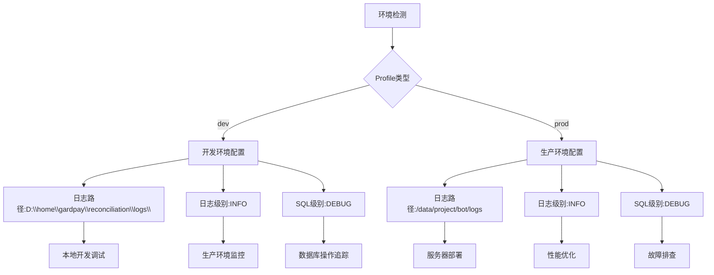
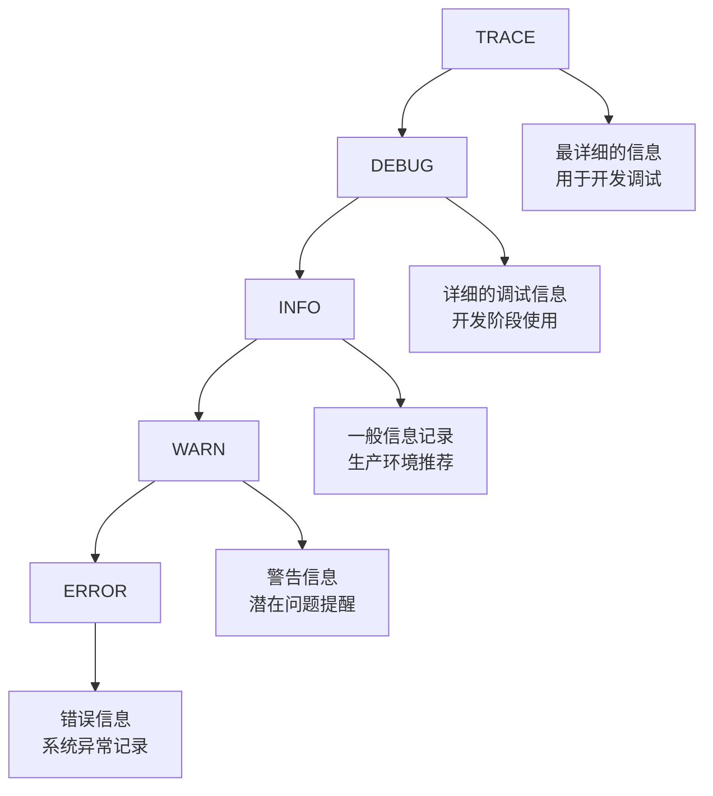
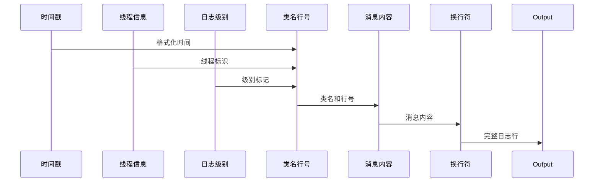
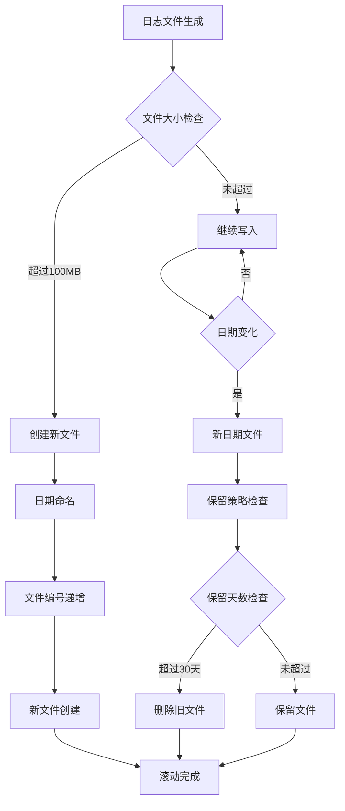
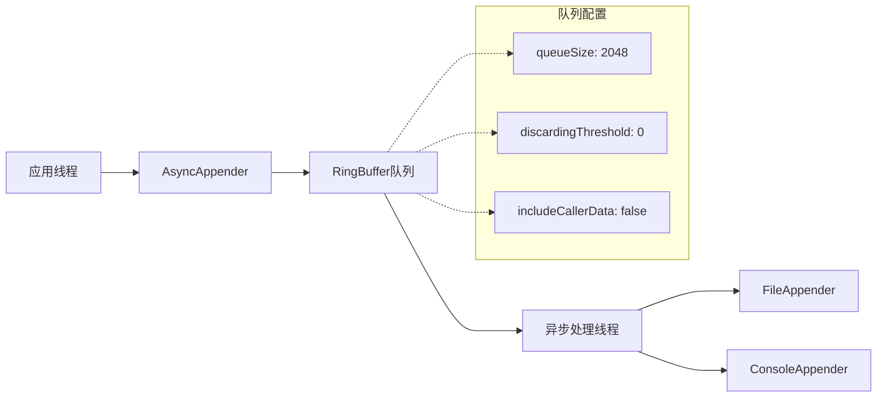
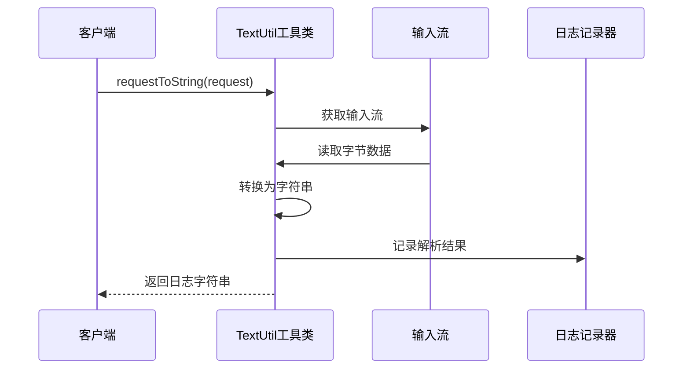
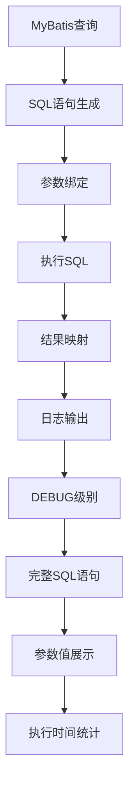
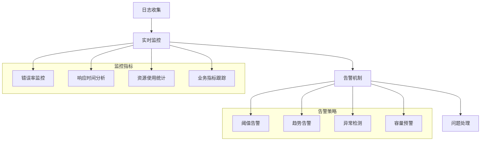
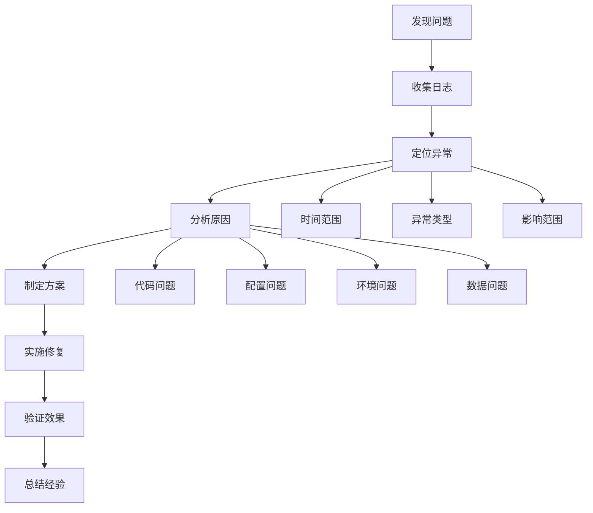

# Bot项目日志分析指南

<cite>
**本文档引用的文件**
- [logback-spring.xml](file://Boot/src/main/resources/logback-spring.xml)
- [application.properties](file://Boot/src/main/resources/application.properties)
- [application-dev.properties](file://Boot/src/main/resources/application-dev.properties)
- [application-prod.properties](file://Boot/src/main/resources/application-prod.properties)
- [Life_Deployment_Guide.md](file://Life_Deployment_Guide.md)
- [TextUtil.java](file://Common/src/main/java/com/bot/common/util/TextUtil.java)
- [GlobalExceptionHandler.java](file://Boot/src/main/java/com/bot/boot/aspect/GlobalExceptionHandler.java)
- [浮生卷开发说明.md](file://浮生卷开发说明.md)
</cite>

## 目录
1. [概述](#概述)
2. [日志配置架构](#日志配置架构)
3. [核心配置详解](#核心配置详解)
4. [日志级别管理](#日志级别管理)
5. [输出格式配置](#输出格式配置)
6. [滚动策略配置](#滚动策略配置)
7. [异步日志处理](#异步日志处理)
8. [日志分析方法](#日志分析方法)
9. [常见问题诊断](#常见问题诊断)
10. [最佳实践建议](#最佳实践建议)

## 概述

Bot项目采用Logback作为日志框架，通过logback-spring.xml进行集中配置，实现了灵活的日志级别控制、多格式输出和智能滚动策略。本指南将系统性地介绍项目的日志配置体系、分析方法和问题诊断技巧。

### 日志系统特点

- **多层次配置**：支持开发、测试、生产环境的差异化配置
- **异步处理**：采用异步日志输出，提升系统性能
- **智能滚动**：基于时间和文件大小的双重滚动策略
- **结构化输出**：标准化的日志格式便于分析和监控

## 日志配置架构

Bot项目的日志配置采用分层架构设计，通过Spring Profile实现环境隔离：



**图表来源**
- [logback-spring.xml](file://Boot/src/main/resources/logback-spring.xml#L1-L58)
- [application.properties](file://Boot/src/main/resources/application.properties#L11-L16)

**章节来源**
- [logback-spring.xml](file://Boot/src/main/resources/logback-spring.xml#L1-L58)
- [application.properties](file://Boot/src/main/resources/application.properties#L1-L70)

## 核心配置详解

### Spring属性绑定

项目通过Spring Property机制实现配置参数的动态绑定：

| 配置项 | 类型 | 默认值 | 说明 |
|--------|------|--------|------|
| logback.level | String | INFO | 全局日志级别 |
| logback.rootPath | String | C:\\logs\\bot | 日志根目录 |
| logback.pattern | String | 时间戳格式 | 日志输出格式模式 |
| logback.charset | String | UTF-8 | 字符编码格式 |
| logback.sql-level | String | DEBUG | SQL语句日志级别 |

### 环境差异化配置

不同环境下的配置差异：



**图表来源**
- [application-dev.properties](file://Boot/src/main/resources/application-dev.properties#L2-L6)
- [application-prod.properties](file://Boot/src/main/resources/application-prod.properties#L2-L6)

**章节来源**
- [application-dev.properties](file://Boot/src/main/resources/application-dev.properties#L1-L59)
- [application-prod.properties](file://Boot/src/main/resources/application-prod.properties#L1-L92)

## 日志级别管理

### 级别层次结构

Logback支持以下日志级别，按严重程度递增：



### 动态级别控制

项目支持通过配置文件动态调整日志级别：

| 场景 | 推荐级别 | 配置方式 | 说明 |
|------|----------|----------|------|
| 开发调试 | DEBUG/TRACE | 修改logback.level | 获取详细执行信息 |
| 生产监控 | INFO | 保持默认配置 | 平衡信息量和性能 |
| 问题排查 | DEBUG | 临时调整 | 获取详细错误堆栈 |
| 性能分析 | WARN | 提升级别 | 减少日志输出量 |

**章节来源**
- [logback-spring.xml](file://Boot/src/main/resources/logback-spring.xml#L14-L21)
- [application.properties](file://Boot/src/main/resources/application.properties#L12-L16)

## 输出格式配置

### 标准输出格式

项目采用统一的输出格式模板，确保日志的一致性和可读性：

```
%d{HH:mm:ss.SSS} [%thread] %-5level %logger-%line -- %msg --%n
```

格式解析：
- `%d{HH:mm:ss.SSS}`：精确到毫秒的时间戳
- `[%thread]`：当前线程名称
- `%-5level`：左对齐的5字符宽度日志级别
- `%logger-%line`：类名和代码行号
- `%msg`：实际日志消息内容
- `--%n`：换行符

### 日志字段详解



**图表来源**
- [logback-spring.xml](file://Boot/src/main/resources/logback-spring.xml#L35-L36)

**章节来源**
- [logback-spring.xml](file://Boot/src/main/resources/logback-spring.xml#L14-L36)

## 滚动策略配置

### 文件滚动机制

项目采用基于时间和文件大小的双重滚动策略：



### 滚动参数配置

| 参数 | 值 | 说明 |
|------|-----|------|
| fileNamePattern | ${logback.path}/%d{yyyy-MM-dd}/${project.name}.%d{yyyy-MM-dd}.%i.log | 文件命名规则 |
| maxFileSize | 100MB | 单个文件最大大小 |
| maxHistory | 30 | 保留文件天数 |
| totalSizeCap | 无限制 | 总日志大小限制 |

### 存储结构示例

```
C:\logs\bot\bot-controller\
├── 2024-01-15\
│   ├── bot.2024-01-15.0.log
│   ├── bot.2024-01-15.1.log
│   └── bot.2024-01-15.2.log
├── 2024-01-16\
│   └── bot.2024-01-16.0.log
└── ...
```

**章节来源**
- [logback-spring.xml](file://Boot/src/main/resources/logback-spring.xml#L27-L33)

## 异步日志处理

### 异步架构设计

项目采用异步日志处理机制，避免I/O操作阻塞主线程：



### 性能优化配置

| 参数 | 默认值 | 优化建议 | 说明 |
|------|--------|----------|------|
| queueSize | 256 | 2048 | 队列深度，影响性能 |
| discardingThreshold | 0 | 0 | 队列满时的丢弃策略 |
| includeCallerData | true | false | 是否包含调用者信息 |
| appender-ref | 1 | 1 | 引用的Appender数量 |

### 异步优势

- **性能提升**：减少I/O阻塞，提高系统吞吐量
- **稳定性增强**：即使日志系统异常，不影响业务逻辑
- **资源优化**：合理利用系统资源，避免过度消耗

**章节来源**
- [logback-spring.xml](file://Boot/src/main/resources/logback-spring.xml#L39-L48)

## 日志分析方法

### 文本工具类分析

项目提供了专门的日志分析工具类，用于处理HTTP请求日志：



**图表来源**
- [TextUtil.java](file://Common/src/main/java/com/bot/common/util/TextUtil.java#L15-L30)

### 日志模式识别

通过标准日志格式，可以快速识别系统状态和问题类型：

| 日志模式 | 特征 | 含义 | 处理建议 |
|----------|------|------|----------|
| `[INFO]` | 时间戳+INFO级别 | 正常业务信息 | 无需处理 |
| `[ERROR]` | 时间戳+ERROR级别 | 系统错误异常 | 立即排查 |
| `[WARN]` | 时间戳+WARN级别 | 潜在问题警告 | 关注监控 |
| `NullPointerException` | 异常堆栈 | 空指针异常 | 代码修复 |

### SQL日志分析

项目特别配置了SQL语句的详细日志输出：



**章节来源**
- [TextUtil.java](file://Common/src/main/java/com/bot/common/util/TextUtil.java#L1-L32)
- [application.properties](file://Boot/src/main/resources/application.properties#L16-L16)

## 常见问题诊断

### 异常日志分析案例

基于项目历史日志，总结常见问题的诊断方法：

#### 1. NullPointerException异常

**日志特征**：
```
09:46:19.849 [http-nio-9091-exec-4] ERROR com.bot.base.service.impl.DistributorServiceImpl-120 -- 目标[wxid_gt9s4k14zz7l22],响应异常 --
java.lang.NullPointerException: null
    at com.bot.life.service.impl.LifeHandlerImpl.performMonsterActionWithCooldown(LifeHandlerImpl.java:1284)
    at com.bot.life.service.impl.LifeHandlerImpl.handleAttack(LifeHandlerImpl.java:1028)
```

**诊断流程**：
1. **定位异常位置**：LifeHandlerImpl.java第1284行
2. **分析调用链**：handleAttack → performMonsterActionWithCooldown
3. **检查上下文**：战斗状态、怪物对象是否为空
4. **解决方案**：添加空值检查和异常处理

#### 2. 数据库SQL语法错误

**日志特征**：
```
org.springframework.jdbc.BadSqlGrammarException:
### Error querying database.  Cause: java.sql.SQLSyntaxErrorException: Unknown column 's.in_stock' in 'field list'
### SQL: select ... from life_shop s left join life_item i on s.item_id = i.id where s.in_stock = 1
```

**诊断流程**：
1. **SQL语法检查**：确认字段名拼写
2. **数据库结构验证**：检查表结构定义
3. **版本兼容性**：确认数据库版本支持
4. **解决方案**：更新SQL语句或数据库结构

#### 3. MyBatis映射异常

**日志特征**：
```
org.apache.ibatis.binding.BindingException: Invalid bound statement (not found): com.bot.life.dao.mapper.LifeShopMapper.selectAll
```

**诊断流程**：
1. **Mapper文件检查**：确认XML文件存在
2. **接口方法匹配**：验证方法签名一致
3. **包扫描配置**：检查MyBatis配置
4. **解决方案**：修复映射关系或重新编译

### 日志分析工具推荐

| 工具类型 | 推荐工具 | 适用场景 | 特点 |
|----------|----------|----------|------|
| 日志查看 | Tail、Less | 实时查看 | 快速浏览 |
| 日志分析 | Splunk、ELK | 大规模分析 | 强大分析能力 |
| 日志聚合 | Graylog | 分布式系统 | 集中管理 |
| 性能监控 | Grafana | 性能分析 | 可视化展示 |

**章节来源**
- [浮生卷开发说明.md](file://浮生卷开发说明.md#L240-L297)

## 最佳实践建议

### 日志配置最佳实践

1. **环境隔离**：不同环境使用独立配置文件
2. **级别控制**：生产环境使用INFO级别，开发环境使用DEBUG级别
3. **格式统一**：保持日志格式一致性，便于自动化处理
4. **敏感信息**：避免在日志中记录密码等敏感信息

### 日志监控建议



### 性能优化建议

1. **异步处理**：启用异步日志输出，减少I/O阻塞
2. **缓冲策略**：合理配置队列大小和刷新频率
3. **压缩存储**：对历史日志进行压缩存储
4. **清理策略**：定期清理过期日志文件

### 故障排查流程



### 维护建议

1. **定期检查**：每日检查日志文件大小和增长趋势
2. **备份策略**：重要日志定期备份，防止数据丢失
3. **容量规划**：根据业务量预估日志存储需求
4. **安全防护**：保护日志文件免受恶意访问

通过本指南的系统性介绍，开发者可以深入理解Bot项目的日志配置体系，掌握有效的日志分析方法，并能够快速定位和解决系统问题。合理的日志管理不仅有助于系统的稳定运行，也是系统运维的重要支撑。