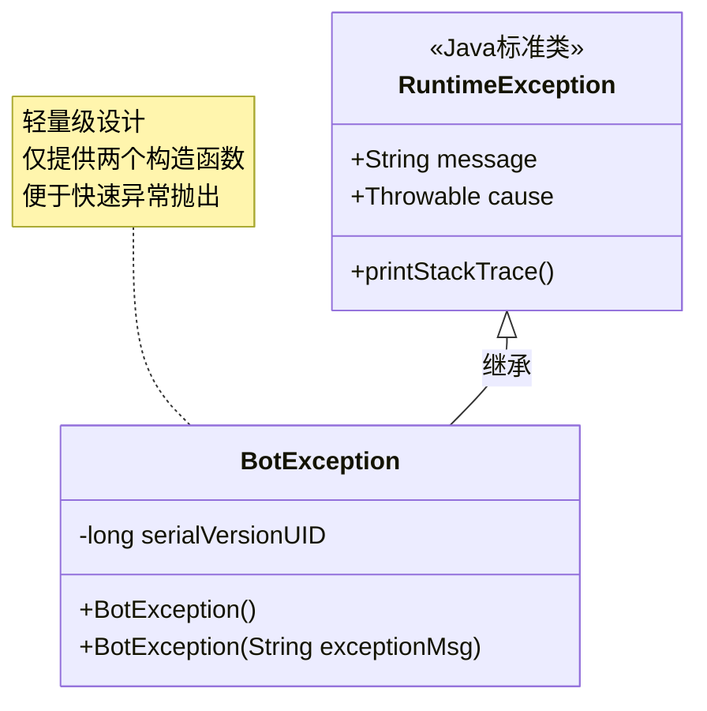
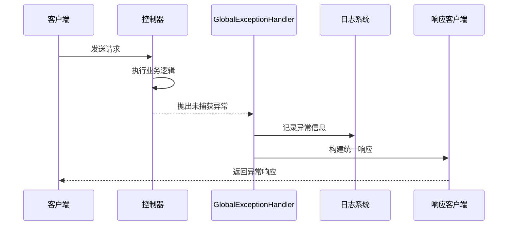
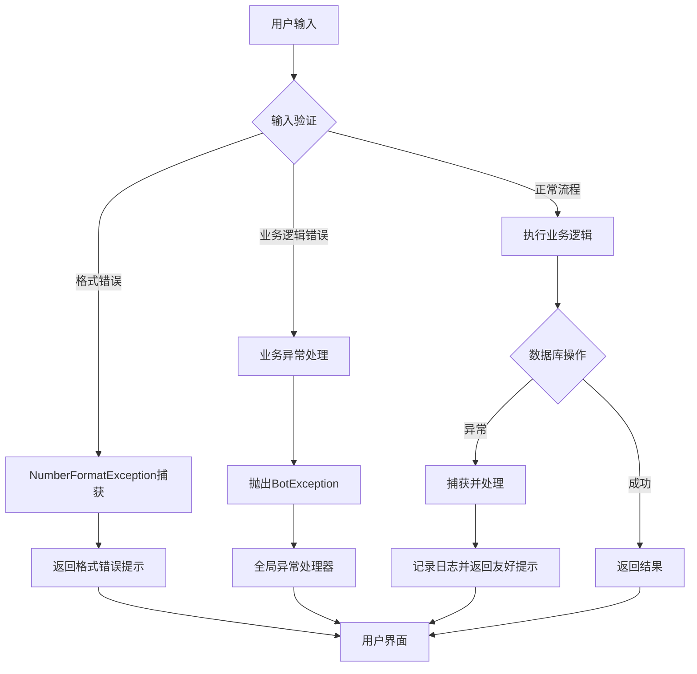
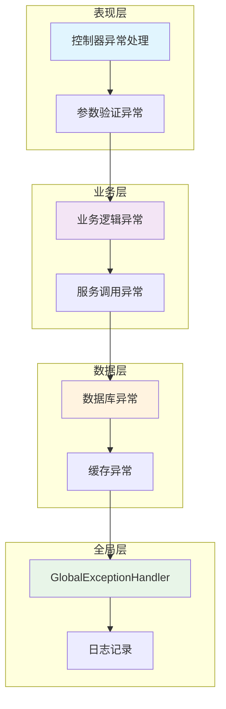
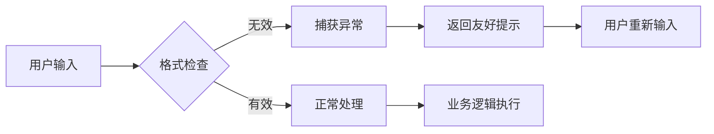
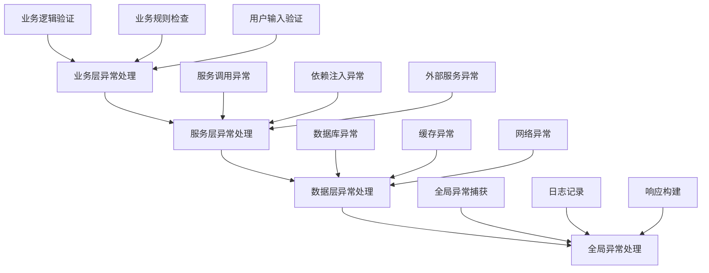

# Bot项目运行时异常处理机制

<cite>
**本文档引用的文件**
- [BotException.java](file://Common/src/main/java/com/bot/common/exception/BotException.java)
- [GlobalExceptionHandler.java](file://Boot/src/main/java/com/bot/boot/aspect/GlobalExceptionHandler.java)
- [LifeHandlerImpl.java](file://Life/src/main/java/com/bot/life/service/impl/LifeHandlerImpl.java)
- [DistributorServiceImpl.java](file://Base/src/main/java/com/bot/base/service/impl/DistributorServiceImpl.java)
- [ENCarriedStatus.java](file://Game/src/main/java/com/bot/game/enums/ENCarriedStatus.java)
- [logback-spring.xml](file://Boot/src/main/resources/logback-spring.xml)
</cite>

## 目录
1. [概述](#概述)
2. [BotException自定义异常设计](#botexception自定义异常设计)
3. [全局异常处理器](#全局异常处理器)
4. [业务层异常处理实践](#业务层异常处理实践)
5. [异常处理架构分析](#异常处理架构分析)
6. [常见运行时异常诊断](#常见运行时异常诊断)
7. [最佳实践与建议](#最佳实践与建议)
8. [总结](#总结)

## 概述

Bot项目采用了一套完整的运行时异常处理机制，通过自定义异常类型、全局异常处理器和业务层异常捕获相结合的方式，实现了对各种运行时错误的有效管理和优雅降级。该机制涵盖了从底层服务调用到用户交互的全链路异常处理，确保系统的稳定性和用户体验。

## BotException自定义异常设计

### 异常类结构分析

BotException作为项目的核心自定义异常类，采用了简洁而实用的设计理念：

**图表来源**
- [BotException.java](file://Common/src/main/java/com/bot/common/exception/BotException.java#L7-L19)

### 设计原则

1. **轻量化设计**：BotException继承自RuntimeException，避免强制异常声明
2. **序列化支持**：提供了明确的serialVersionUID，确保异常对象的序列化兼容性
3. **灵活构造**：支持无参构造和带消息参数的构造，适应不同场景需求

### 使用场景分析

BotException在项目中被广泛应用于以下场景：

| 使用场景 | 抛出时机 | 处理方式 |
|---------|---------|---------|
| 服务未找到 | 分发器无法定位目标服务 | 抛出异常并记录错误日志 |
| 菜单未找到 | 用户请求不存在的菜单功能 | 抛出异常并返回默认响应 |
| 枚举值验证 | 传入非法枚举参数 | 抛出异常并提示正确值范围 |
| 子类实现缺失 | 抽象方法未被重写 | 抛出异常并说明实现要求 |

**章节来源**
- [DistributorServiceImpl.java](file://Base/src/main/java/com/bot/base/service/impl/DistributorServiceImpl.java#L365-L381)
- [ENCarriedStatus.java](file://Game/src/main/java/com/bot/game/enums/ENCarriedStatus.java#L31-L32)

## 全局异常处理器

### GlobalExceptionHandler架构

GlobalExceptionHandler作为Spring MVC的全局异常处理器，负责拦截所有未被捕获的异常并进行统一处理：

**图表来源**
- [GlobalExceptionHandler.java](file://Boot/src/main/java/com/bot/boot/aspect/GlobalExceptionHandler.java#L21-L24)

### 处理策略分析

GlobalExceptionHandler采用简洁的处理策略：

1. **异常捕获**：实现HandlerExceptionResolver接口，拦截所有控制器异常
2. **响应构建**：通过ModelAndView对象添加统一的异常标识
3. **日志记录**：利用@Slf4j注解自动注入的日志功能记录异常详情

### 配置与部署

该处理器通过Spring组件扫描自动注册为全局异常处理器，无需额外配置即可生效。

**章节来源**
- [GlobalExceptionHandler.java](file://Boot/src/main/java/com/bot/boot/aspect/GlobalExceptionHandler.java#L18-L26)

## 业务层异常处理实践

### LifeHandlerImpl中的异常处理模式

LifeHandlerImpl作为游戏核心业务处理器，在其复杂的游戏逻辑中展现了丰富的异常处理实践：

**图表来源**
- [LifeHandlerImpl.java](file://Life/src/main/java/com/bot/life/service/impl/LifeHandlerImpl.java#L595-L604)
- [LifeHandlerImpl.java](file://Life/src/main/java/com/bot/life/service/impl/LifeHandlerImpl.java#L705-L707)

### 具体异常处理案例

#### 1. 格式验证异常处理

在道具使用、好友添加等命令处理中，系统通过try-catch块捕获NumberFormatException：

- **捕获范围**：数值转换、ID解析等格式验证
- **处理策略**：返回用户友好的格式错误提示
- **用户体验**：避免系统错误信息暴露给最终用户

#### 2. 业务逻辑异常处理

在角色创建、战斗系统等核心业务中，系统采用BotException进行业务异常管理：

- **异常分类**：业务规则违反、资源不足、状态异常等
- **错误码设计**：通过异常消息传递具体错误原因
- **恢复机制**：提供清晰的错误指导和解决方案

#### 3. 数据库访问异常处理

虽然代码中未直接展示，但在实际项目中，数据库访问异常通常通过以下方式处理：

- **连接异常**：重试机制或降级处理
- **约束违反**：业务层面的数据验证
- **事务回滚**：保证数据一致性

**章节来源**
- [LifeHandlerImpl.java](file://Life/src/main/java/com/bot/life/service/impl/LifeHandlerImpl.java#L337-L382)
- [LifeHandlerImpl.java](file://Life/src/main/java/com/bot/life/service/impl/LifeHandlerImpl.java#L690-L707)

## 异常处理架构分析

### 分层异常处理架构

Bot项目采用了分层的异常处理架构，每层承担不同的异常处理职责：

### 异常传播路径

异常在系统中的传播遵循以下路径：

1. **局部捕获**：在异常发生的最接近位置进行捕获和处理
2. **业务封装**：将底层异常封装为业务异常，保持接口稳定性
3. **全局兜底**：通过GlobalExceptionHandler确保所有异常都能得到处理
4. **日志记录**：每个异常都会被记录到日志系统中用于监控和调试

### 异常处理质量保证

系统通过以下机制确保异常处理的质量：

- **异常分类**：明确区分业务异常、系统异常和用户输入异常
- **错误消息**：提供清晰、可理解的错误提示信息
- **恢复机制**：在可能的情况下提供异常恢复建议
- **监控告警**：通过日志系统监控异常频率和趋势

## 常见运行时异常诊断

### NullPointerException诊断

根据项目日志分析，NullPointerException是最常见的运行时异常：

#### 异常场景分析

1. **战斗系统异常**：monsterActionWithCooldown方法中的空指针访问
2. **数据访问异常**：数据库查询返回null时的处理不当
3. **对象初始化异常**：依赖注入失败导致的对象为空

#### 诊断步骤

| 诊断阶段 | 检查要点 | 解决方案 |
|---------|---------|---------|
| 异常定位 | 查看堆栈跟踪中的具体方法和行号 | 定位到LifeHandlerImpl.performMonsterActionWithCooldown |
| 上下文分析 | 检查调用前的对象状态 | 验证战斗状态对象的完整性 |
| 数据验证 | 确认数据库查询结果 | 添加null检查和默认值处理 |
| 代码审查 | 检查对象初始化逻辑 | 确保所有必要对象都被正确初始化 |

### NumberFormatException诊断

#### 常见触发场景

1. **用户输入处理**：数字格式的用户输入验证
2. **ID解析**：字符串到Long类型的转换
3. **配置参数**：配置文件中的数值参数解析

#### 修复策略

### BotException诊断

#### 异常模式识别

BotException的抛出通常遵循以下模式：

1. **参数验证**：输入参数不符合预期格式或范围
2. **状态检查**：系统状态不满足业务操作条件
3. **资源检查**：所需资源不可用或权限不足
4. **业务规则**：违反预定义的业务规则

#### 诊断工具

- **日志分析**：通过异常消息了解具体问题
- **调用栈追踪**：定位异常发生的具体位置
- **上下文检查**：分析异常发生时的系统状态

**章节来源**
- [浮生卷开发说明.md](file://浮生卷开发说明.md#L244-L268)

## 最佳实践与建议

### 异常处理最佳实践

#### 1. 异常分类策略

- **业务异常**：使用BotException处理业务规则违反
- **系统异常**：使用RuntimeException处理系统级错误
- **用户异常**：提供用户友好的错误提示信息

#### 2. 异常处理层次

#### 3. 错误信息设计原则

| 原则 | 描述 | 示例 |
|------|------|------|
| 清晰性 | 错误信息应该清楚易懂 | "昵称不能超过7个字！" |
| 具体性 | 提供具体的错误原因 | "派系错误！请选择：金、木、水、火、土" |
| 指导性 | 提供解决问题的建议 | "请使用：发送邮件+好友昵称+标题+内容" |
| 用户友好性 | 避免技术术语，使用通俗语言 | "角色创建失败，请重试！" |

### 性能优化建议

#### 1. 异常处理性能

- **避免过度捕获**：只在必要时捕获异常，避免影响正常流程性能
- **异常对象创建**：尽量减少异常对象的频繁创建
- **日志级别控制**：合理设置日志级别，避免过多的异常日志输出

#### 2. 内存管理

- **异常对象生命周期**：及时释放异常处理过程中产生的临时对象
- **堆栈信息保存**：在生产环境中谨慎保存详细的堆栈信息

### 监控与告警

#### 1. 异常监控指标

- **异常频率**：监控各类异常的发生频率
- **异常趋势**：跟踪异常数量的变化趋势
- **异常分布**：分析异常在系统各模块中的分布情况

#### 2. 告警机制

- **阈值告警**：当异常频率超过设定阈值时触发告警
- **趋势告警**：当异常数量呈现上升趋势时发出警告
- **分类告警**：针对特定类型的异常设置专门的告警规则

## 总结

Bot项目的运行时异常处理机制体现了现代软件工程的最佳实践，通过分层设计、统一处理和用户友好的错误提示，构建了一个健壮且易于维护的异常处理体系。

### 核心优势

1. **分层处理**：从表现层到业务层再到全局层的完整异常处理链
2. **用户友好**：提供清晰、可操作的错误提示信息
3. **系统稳定**：通过全局异常处理器确保系统不会因异常而崩溃
4. **易于维护**：统一的异常处理模式降低了代码维护成本

### 改进建议

1. **异常分类细化**：可以考虑进一步细分异常类型，提供更精确的错误处理
2. **自动化测试**：增加异常处理的单元测试覆盖率
3. **监控增强**：完善异常监控和告警机制
4. **文档完善**：建立完整的异常处理文档和故障排除指南

这套异常处理机制不仅保证了Bot项目的稳定运行，也为后续的功能扩展和系统维护奠定了坚实的基础。通过持续的优化和完善，它将继续为Bot项目提供可靠的异常处理保障。