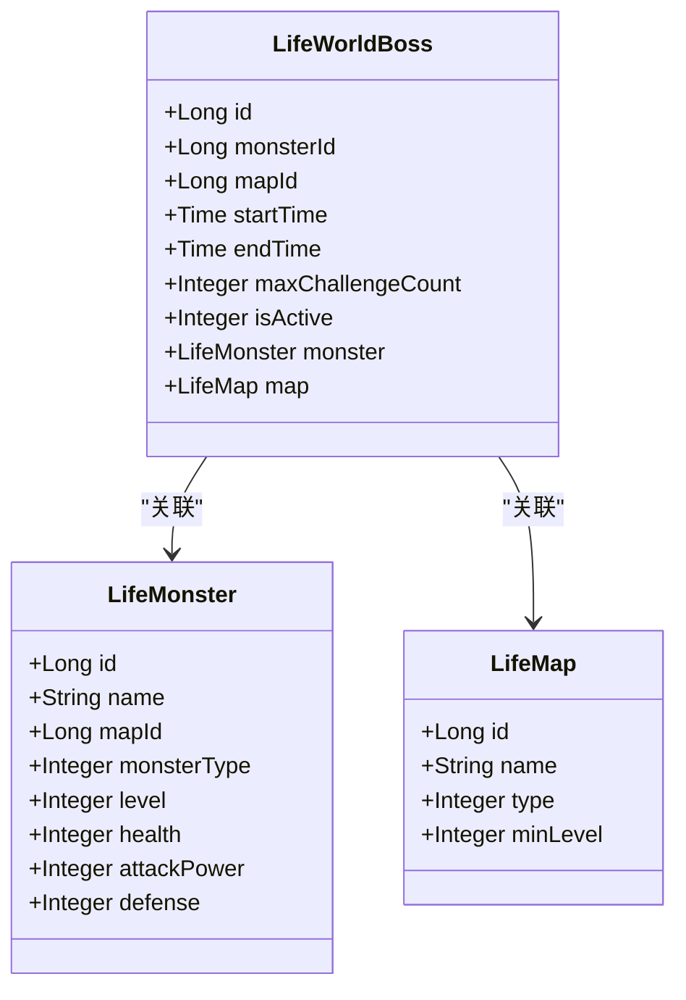
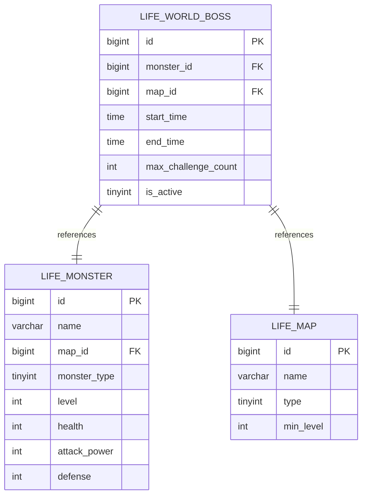
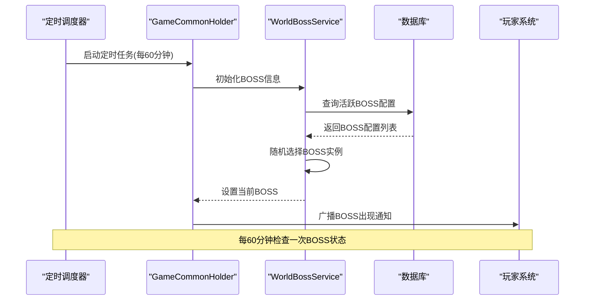
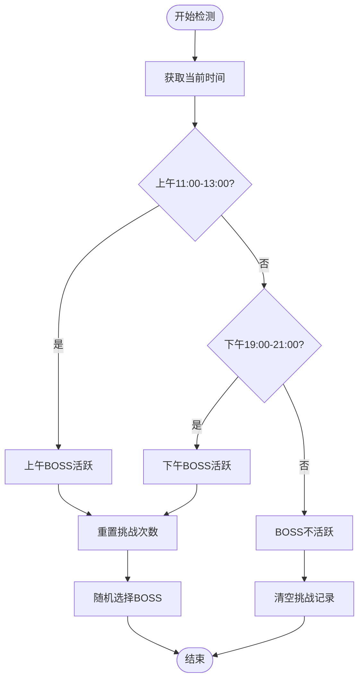
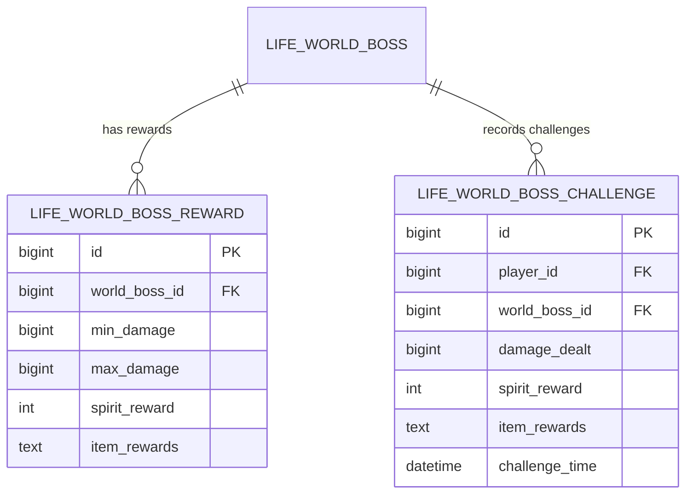
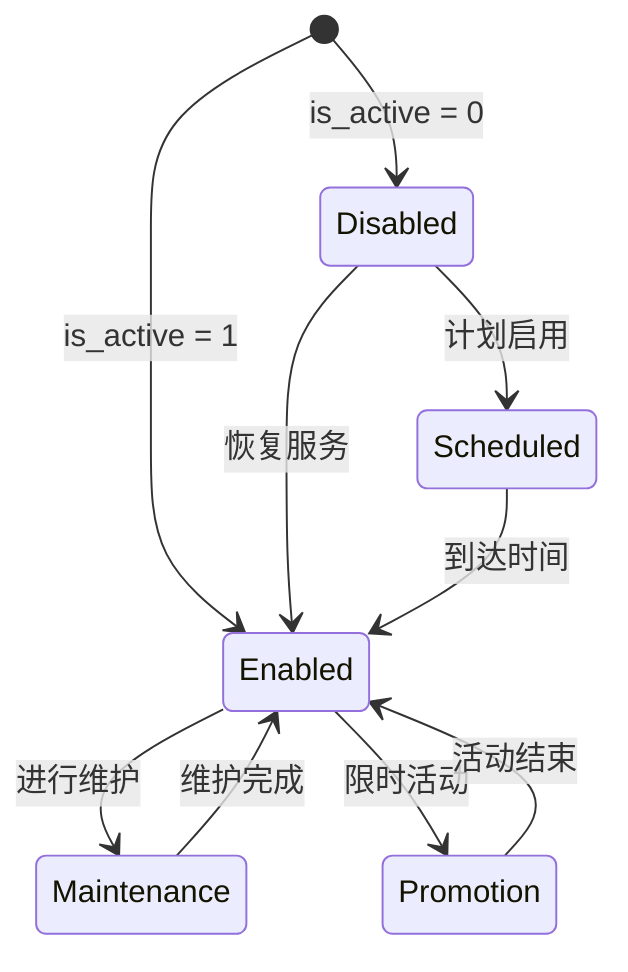
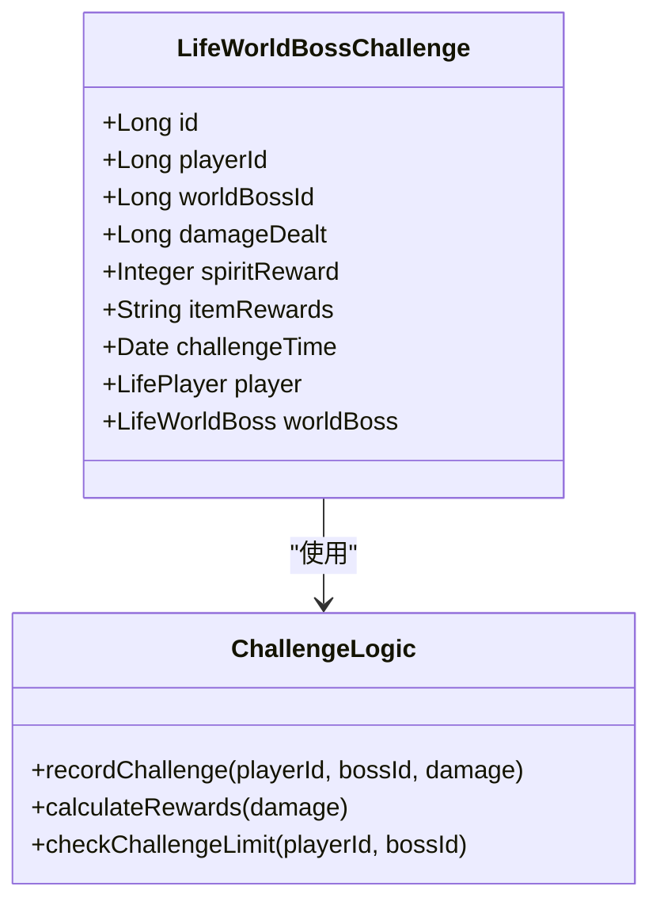
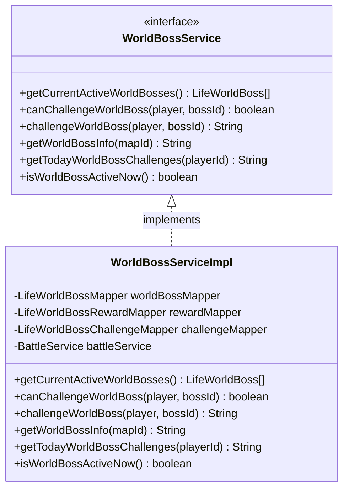
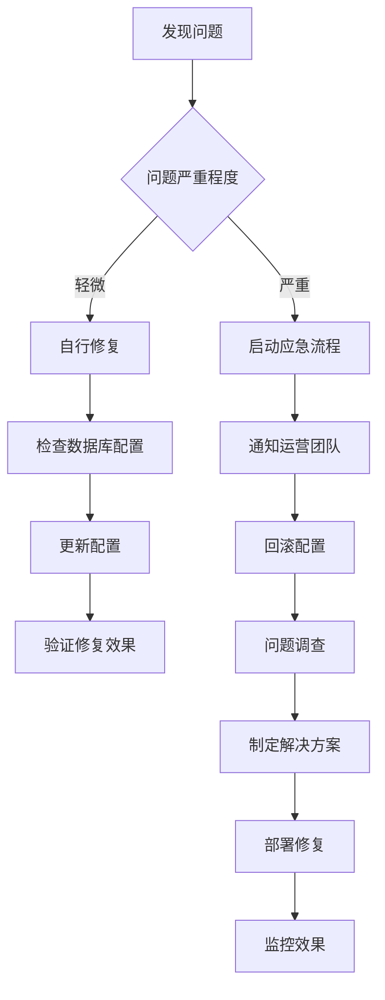

# BOSS配置模型

<cite>
**本文档引用的文件**
- [LifeWorldBoss.java](file://Life/src/main/java/com/bot/life/dao/entity/LifeWorldBoss.java)
- [LifeWorldBossMapper.java](file://Life/src/main/java/com/bot/life/dao/mapper/LifeWorldBossMapper.java)
- [LifeWorldBossMapper.xml](file://Life/src/main/resources/mapper/LifeWorldBossMapper.xml)
- [LifeWorldBossServiceImpl.java](file://Life/src/main/java/com/bot/life/service/impl/WorldBossServiceImpl.java)
- [WorldBossService.java](file://Life/src/main/java/com/bot/life/service/WorldBossService.java)
- [LifeWorldBossChallenge.java](file://Life/src/main/java/com/bot/life/dao/entity/LifeWorldBossChallenge.java)
- [LifeWorldBossReward.java](file://Life/src/main/java/com/bot/life/dao/entity/LifeWorldBossReward.java)
- [Life_Database_Init.sql](file://Life_Database_Init.sql)
- [WorldBossServiceImpl.java](file://Game/src/main/java/com/bot/game/service/impl/WorldBossServiceImpl.java)
- [GameCommonHolder.java](file://Game/src/main/java/com/bot/game/service/GameCommonHolder.java)
</cite>

## 目录
1. [简介](#简介)
2. [LifeWorldBoss实体设计](#lifeworldboss实体设计)
3. [数据库表结构](#数据库表结构)
4. [字段详解](#字段详解)
5. [定时任务机制](#定时任务机制)
6. [世界BOSS配置管理](#世界boss配置管理)
7. [运营控制机制](#运营控制机制)
8. [挑战系统设计](#挑战系统设计)
9. [管理接口设计](#管理接口设计)
10. [运营操作指南](#运营操作指南)
11. [总结](#总结)

## 简介

世界BOSS系统是《浮生卷》游戏中的核心玩法之一，通过精心设计的配置模型实现定时触发、动态管理和运营控制。该系统基于LifeWorldBoss实体构建，支持每日循环的BOSS出现机制，为玩家提供丰富的战斗体验和奖励获取机会。

## LifeWorldBoss实体设计

LifeWorldBoss实体是世界BOSS配置的核心数据结构，采用Java实体类设计，包含以下关键字段：

**图表来源**
- [LifeWorldBoss.java](file://Life/src/main/java/com/bot/life/dao/entity/LifeWorldBoss.java#L12-L24)
- [LifeMonster.java](file://Life/src/main/java/com/bot/life/dao/entity/LifeMonster.java#L13-L32)
- [LifeMap.java](file://Life/src/main/java/com/bot/life/dao/entity/LifeMap.java#L13-L20)

**章节来源**
- [LifeWorldBoss.java](file://Life/src/main/java/com/bot/life/dao/entity/LifeWorldBoss.java#L1-L24)

## 数据库表结构

世界BOSS系统基于MySQL数据库设计，主要包含三个核心表：

**图表来源**
- [Life_Database_Init.sql](file://Life_Database_Init.sql#L279-L289)
- [Life_Database_Init.sql](file://Life_Database_Init.sql#L140-L161)
- [Life_Database_Init.sql](file://Life_Database_Init.sql#L117-L126)

### 表结构详情

| 字段名 | 类型 | 约束 | 描述 |
|--------|------|------|------|
| id | bigint | PRIMARY KEY, AUTO_INCREMENT | 主键ID |
| monster_id | bigint | NOT NULL | 怪物ID，关联life_monster表 |
| map_id | bigint | NOT NULL | 地图ID，关联life_map表 |
| start_time | time | NOT NULL | BOSS出现开始时间 |
| end_time | time | NOT NULL | BOSS消失结束时间 |
| max_challenge_count | int | DEFAULT 1 | 每人最大挑战次数 |
| is_active | tinyint | DEFAULT 1 | 是否激活：0否1是 |

**章节来源**
- [Life_Database_Init.sql](file://Life_Database_Init.sql#L279-L289)

## 字段详解

### monsterId字段
- **类型**: Long
- **约束**: NOT NULL
- **作用**: 关联到life_monster表，指定世界BOSS的怪物模板
- **配置示例**: 5号怪物ID对应特定的BOSS怪物配置
- **扩展性**: 支持多种不同类型的BOSS怪物

### mapId字段
- **类型**: Long
- **约束**: NOT NULL
- **作用**: 指定BOSS出现的地图位置
- **关联**: 关联到life_map表，确定BOSS的出现场景
- **应用场景**: 不同地图可以设置不同的BOSS配置

### startTime和endTime字段
这两个字段共同构成世界BOSS的时间段配置机制：

| 字段 | 类型 | 约束 | 示例值 | 说明 |
|------|------|------|--------|------|
| start_time | time | NOT NULL | '11:00:00' | BOSS出现开始时间 |
| end_time | time | NOT NULL | '12:00:00' | BOSS消失结束时间 |

**时间配置示例**:
- 午间时段: '11:00:00' - '12:00:00'
- 下午时段: '19:00:00' - '20:00:00'

### maxChallengeCount字段
- **类型**: Integer
- **默认值**: 1
- **作用**: 限制每个玩家的最大挑战次数
- **业务价值**: 控制BOSS的参与度和奖励分配
- **配置策略**: 根据BOSS难度调整挑战次数

### isActive字段
- **类型**: Integer
- **默认值**: 1
- **取值范围**: 0(禁用) / 1(启用)
- **运营用途**: 实现灵活的BOSS开关控制
- **动态管理**: 支持临时关闭或开启特定BOSS

**章节来源**
- [LifeWorldBoss.java](file://Life/src/main/java/com/bot/life/dao/entity/LifeWorldBoss.java#L13-L19)
- [Life_Database_Init.sql](file://Life_Database_Init.sql#L508-L512)

## 定时任务机制

世界BOSS系统采用多层定时任务架构，确保BOSS的准确定时出现：

**图表来源**
- [GameCommonHolder.java](file://Game/src/main/java/com/bot/game/service/GameCommonHolder.java#L44-L65)
- [WorldBossServiceImpl.java](file://Game/src/main/java/com/bot/game/service/impl/WorldBossServiceImpl.java#L57-L67)

### 时间段检测逻辑

系统通过精确的时间判断实现每日循环的BOSS出现：

**图表来源**
- [WorldBossServiceImpl.java](file://Game/src/main/java/com/bot/game/service/impl/WorldBossServiceImpl.java#L57-L67)

**章节来源**
- [GameCommonHolder.java](file://Game/src/main/java/com/bot/game/service/GameCommonHolder.java#L44-L65)
- [WorldBossServiceImpl.java](file://Game/src/main/java/com/bot/game/service/impl/WorldBossServiceImpl.java#L57-L67)

## 世界BOSS配置管理

### 基础配置表结构

除了核心的life_world_boss表，系统还包含两个重要的辅助表：

**图表来源**
- [Life_Database_Init.sql](file://Life_Database_Init.sql#L291-L301)
- [Life_Database_Init.sql](file://Life_Database_Init.sql#L558-L569)

### 奖励配置机制

世界BOSS奖励系统根据玩家造成的伤害量提供差异化奖励：

| 伤害区间 | 灵粹奖励 | 道具奖励 |
|----------|----------|----------|
| 0-1000 | 50 | 小修为丹x1 |
| 1001-3000 | 100 | 小修为丹x2, 回春丹x1 |
| 3001及以上 | 200 | 小修为丹x3, 回春丹x2, 大力丸x1 |

**章节来源**
- [Life_Database_Init.sql](file://Life_Database_Init.sql#L508-L520)

## 运营控制机制

### isActive字段的运营价值

isActive字段提供了灵活的运营控制能力：

### 动态配置调整

运营人员可以通过以下方式调整BOSS配置：

1. **临时禁用**: 设置is_active=0快速下线BOSS
2. **时间调整**: 修改start_time和end_time改变出现时间
3. **难度调整**: 修改max_challenge_count控制参与度
4. **奖励优化**: 调整奖励配置提升吸引力

**章节来源**
- [LifeWorldBossServiceImpl.java](file://Life/src/main/java/com/bot/life/service/impl/WorldBossServiceImpl.java#L46-L51)

## 挑战系统设计

### 挑战记录机制

**图表来源**
- [LifeWorldBossChallenge.java](file://Life/src/main/java/com/bot/life/dao/entity/LifeWorldBossChallenge.java#L12-L24)

### 挑战限制机制

系统实现了多层次的挑战限制：

1. **每日挑战次数**: 基于maxChallengeCount字段控制
2. **时间窗口限制**: 基于时间段判断BOSS是否可挑战
3. **个人挑战记录**: 记录玩家的挑战历史

**章节来源**
- [LifeWorldBossChallenge.java](file://Life/src/main/java/com/bot/life/dao/entity/LifeWorldBossChallenge.java#L1-L24)

## 管理接口设计

### 核心服务接口

WorldBossService定义了世界BOSS管理的核心接口：

**图表来源**
- [WorldBossService.java](file://Life/src/main/java/com/bot/life/service/WorldBossService.java#L12-L55)
- [LifeWorldBossServiceImpl.java](file://Life/src/main/java/com/bot/life/service/impl/WorldBossServiceImpl.java#L22-L286)

### 接口功能说明

| 方法名 | 功能描述 | 返回类型 |
|--------|----------|----------|
| getCurrentActiveWorldBosses | 获取当前活跃的世界BOSS | List<LifeWorldBoss> |
| canChallengeWorldBoss | 检查玩家是否可以挑战BOSS | boolean |
| challengeWorldBoss | 执行BOSS挑战操作 | String |
| getWorldBossInfo | 获取BOSS信息展示 | String |
| getTodayWorldBossChallenges | 获取玩家今日挑战记录 | String |
| isWorldBossActiveNow | 检查当前是否有BOSS活动 | boolean |

**章节来源**
- [WorldBossService.java](file://Life/src/main/java/com/bot/life/service/WorldBossService.java#L1-L55)
- [LifeWorldBossServiceImpl.java](file://Life/src/main/java/com/bot/life/service/impl/WorldBossServiceImpl.java#L1-L286)

## 运营操作指南

### 日常运营管理

#### BOSS配置检查清单

1. **时间配置验证**
   - 确认start_time和end_time设置正确
   - 检查时间段之间无冲突
   - 验证每日循环配置

2. **怪物配置审核**
   - 确认monster_id对应的怪物存在
   - 检查怪物属性与地图匹配
   - 验证怪物难度适中

3. **奖励配置优化**
   - 根据玩家反馈调整奖励比例
   - 监控奖励发放统计
   - 优化道具奖励组合

#### 应急处理流程

### 数据统计与分析

#### 关键指标监控

| 指标名称 | 计算公式 | 监控目的 |
|----------|----------|----------|
| BOSS参与率 | 参与玩家数 / 总玩家数 | 评估BOSS吸引力 |
| 平均挑战次数 | 总挑战次数 / 参与玩家数 | 优化挑战限制 |
| 奖励发放效率 | 发放奖励总额 / 参与人数 | 成本控制 |
| BOSS存活时间 | 平均存活时间 | 难度平衡 |

#### 运营数据分析

1. **玩家行为分析**
   - 挑战时间分布
   - 奖励偏好统计
   - 参与频率分析

2. **经济系统影响**
   - 灵粹流通统计
   - 道具需求分析
   - 市场价格波动

3. **系统性能监控**
   - BOSS加载时间
   - 挑战响应延迟
   - 数据库查询性能

### 活动策划建议

#### 季节性活动

1. **节日主题BOSS**
   - 春节: 福禄财神BOSS
   - 中秋: 月宫仙子BOSS
   - 双十一: 商贾巨富BOSS

2. **限时挑战活动**
   - 每周限定BOSS
   - VIP专属挑战
   - 团队协作挑战

#### 社交互动设计

1. **组队挑战模式**
   - 多人协作BOSS
   - 团队排名系统
   - 公会BOSS战

2. **社交分享机制**
   - 挑战成就分享
   - 奖励展示功能
   - 排行榜竞争

**章节来源**
- [LifeWorldBossServiceImpl.java](file://Life/src/main/java/com/bot/life/service/impl/WorldBossServiceImpl.java#L46-L286)

## 总结

世界BOSS配置模型通过LifeWorldBoss实体和相关数据库表，构建了一个完整、灵活且可扩展的BOSS管理系统。该系统具有以下核心优势：

### 技术优势

1. **数据驱动**: 基于数据库配置实现灵活的BOSS管理
2. **时间精确**: 支持精确到秒的时间段控制
3. **扩展性强**: 易于添加新的BOSS类型和配置选项
4. **性能优化**: 通过索引和缓存提升查询效率

### 运营价值

1. **灵活控制**: 支持实时调整BOSS配置
2. **成本可控**: 可调节挑战次数和奖励配置
3. **用户体验**: 提供丰富多样的挑战体验
4. **数据驱动**: 支持精细化运营分析

### 发展方向

1. **智能推荐**: 基于玩家数据推荐合适的BOSS挑战
2. **动态难度**: 根据玩家水平动态调整BOSS难度
3. **社交增强**: 加强BOSS挑战的社交互动性
4. **跨平台整合**: 实现多平台间的BOSS数据同步

该配置模型为《浮生卷》游戏的世界BOSS玩法提供了坚实的技术基础，支持运营团队实现精细化管理和创新玩法设计。