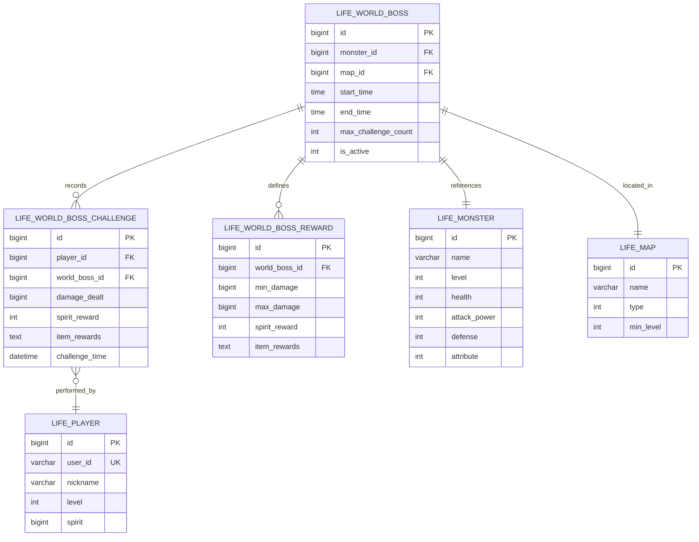
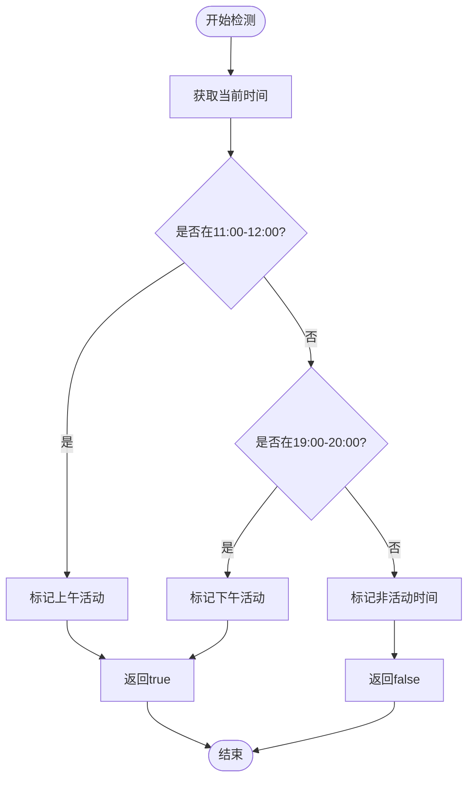
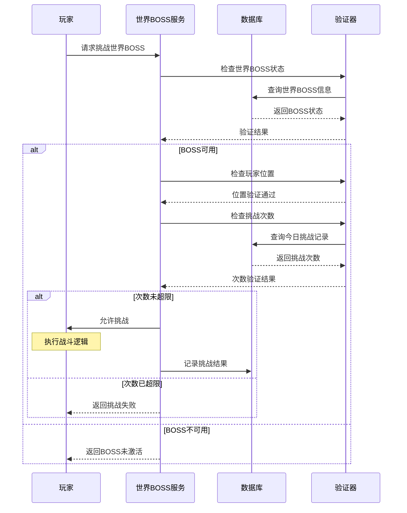
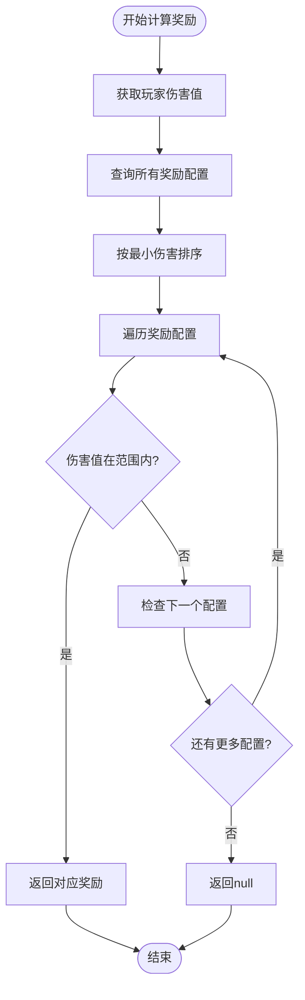
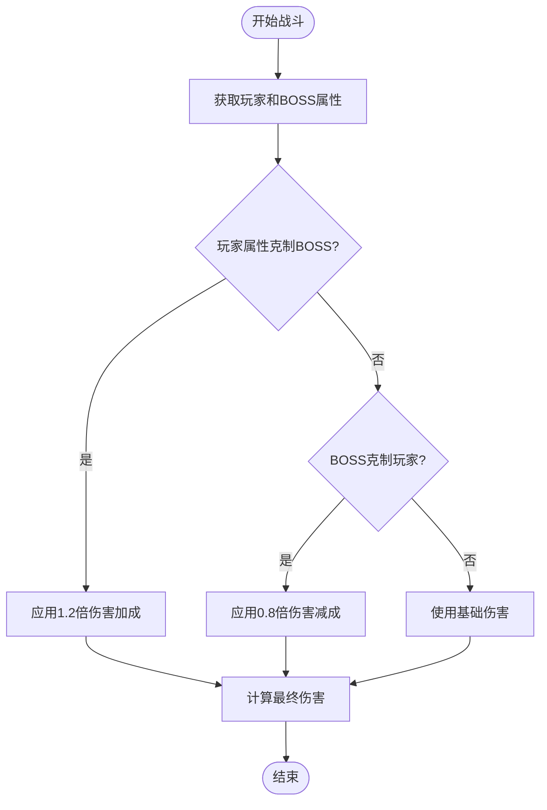
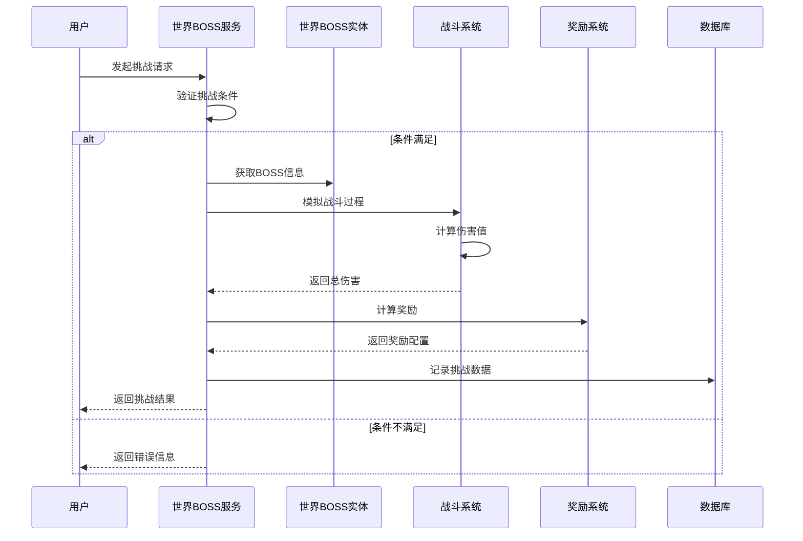

# 世界BOSS系统数据模型

<cite>
**本文档引用的文件**
- [Life_Database_Init.sql](file://Life_Database_Init.sql)
- [LifeWorldBoss.java](file://Life/src/main/java/com/bot/life/dao/entity/LifeWorldBoss.java)
- [LifeWorldBossChallenge.java](file://Life/src/main/java/com/bot/life/dao/entity/LifeWorldBossChallenge.java)
- [LifeWorldBossReward.java](file://Life/src/main/java/com/bot/life/dao/entity/LifeWorldBossReward.java)
- [WorldBossService.java](file://Life/src/main/java/com/bot/life/service/WorldBossService.java)
- [WorldBossServiceImpl.java](file://Life/src/main/java/com/bot/life/service/impl/WorldBossServiceImpl.java)
- [LifeWorldBossMapper.xml](file://Life/src/main/resources/mapper/LifeWorldBossMapper.xml)
- [LifeWorldBossChallengeMapper.xml](file://Life/src/main/resources/mapper/LifeWorldBossChallengeMapper.xml)
- [LifeWorldBossRewardMapper.xml](file://Life/src/main/resources/mapper/LifeWorldBossRewardMapper.xml)
</cite>

## 目录
1. [系统概述](#系统概述)
2. [核心数据模型](#核心数据模型)
3. [数据库表结构](#数据库表结构)
4. [定时出现机制](#定时出现机制)
5. [挑战次数限制](#挑战次数限制)
6. [伤害记录与奖励分配](#伤害记录与奖励分配)
7. [世界BOSS挑战流程](#世界BOSS挑战流程)
8. [性能优化策略](#性能优化策略)
9. [故障排除指南](#故障排除指南)
10. [总结](#总结)

## 系统概述

世界BOSS系统是《浮生卷》游戏中的核心玩法之一，为玩家提供了高难度的挑战机会和丰厚的奖励回报。该系统采用定时激活机制，通过伤害值阶梯式奖励分配，确保了游戏的公平性和激励性。

### 系统特点

- **定时激活机制**：每天11:00-12:00和19:00-20:00两个时间段开放
- **伤害阶梯奖励**：基于玩家造成的伤害值分配不同等级的奖励
- **挑战次数限制**：每个玩家每天最多可挑战指定次数
- **属性克制系统**：战斗中考虑属性相克因素
- **实时状态监控**：动态检测世界BOSS的活跃状态

## 核心数据模型

世界BOSS系统围绕三个核心实体构建，形成了完整的游戏机制框架。

### 实体关系图



**图表来源**
- [LifeWorldBoss.java](file://Life/src/main/java/com/bot/life/dao/entity/LifeWorldBoss.java#L11-L24)
- [LifeWorldBossChallenge.java](file://Life/src/main/java/com/bot/life/dao/entity/LifeWorldBossChallenge.java#L11-L24)
- [LifeWorldBossReward.java](file://Life/src/main/java/com/bot/life/dao/entity/LifeWorldBossReward.java#L9-L17)

### LifeWorldBoss实体详解

LifeWorldBoss实体定义了世界BOSS的基本属性和行为特征：

| 字段名 | 类型 | 描述 | 约束 |
|--------|------|------|------|
| id | BIGINT | 主键标识符 | 自增，主键 |
| monsterId | BIGINT | 怪物ID | 外键，关联生命怪物表 |
| mapId | BIGINT | 地图ID | 外键，关联地图表 |
| startTime | TIME | 开始时间 | 必填，HH:mm:ss格式 |
| endTime | TIME | 结束时间 | 必填，HH:mm:ss格式 |
| maxChallengeCount | INTEGER | 最大挑战次数 | 默认1次 |
| isActive | INTEGER | 是否激活 | 0-否，1-是，默认1 |

**节来源**
- [LifeWorldBoss.java](file://Life/src/main/java/com/bot/life/dao/entity/LifeWorldBoss.java#L13-L19)

### LifeWorldBossChallenge实体详解

LifeWorldBossChallenge实体记录了玩家的挑战过程和结果：

| 字段名 | 类型 | 描述 | 约束 |
|--------|------|------|------|
| id | BIGINT | 主键标识符 | 自增，主键 |
| playerId | BIGINT | 玩家ID | 外键，关联玩家表 |
| worldBossId | BIGINT | 世界BOSS ID | 外键，关联世界BOSS表 |
| damageDealt | BIGINT | 造成的伤害 | 非负整数 |
| spiritReward | INTEGER | 灵粹奖励 | 默认0 |
| itemRewards | TEXT | 道具奖励（JSON格式） | 可为空 |
| challengeTime | DATETIME | 挑战时间 | 默认当前时间 |

**节来源**
- [LifeWorldBossChallenge.java](file://Life/src/main/java/com/bot/life/dao/entity/LifeWorldBossChallenge.java#L13-L19)

### LifeWorldBossReward实体详解

LifeWorldBossReward实体定义了基于伤害值的奖励阶梯：

| 字段名 | 类型 | 描述 | 约束 |
|--------|------|------|------|
| id | BIGINT | 主键标识符 | 自增，主键 |
| worldBossId | BIGINT | 世界BOSS ID | 外键，关联世界BOSS表 |
| minDamage | BIGINT | 最小伤害阈值 | 非负整数 |
| maxDamage | BIGINT | 最大伤害阈值 | 非负整数 |
| spiritReward | INTEGER | 灵粹奖励 | 默认0 |
| itemRewards | TEXT | 道具奖励（JSON格式） | 可为空 |

**节来源**
- [LifeWorldBossReward.java](file://Life/src/main/java/com/bot/life/dao/entity/LifeWorldBossReward.java#L11-L16)

## 数据库表结构

基于DDL语句分析，世界BOSS系统的数据库表结构如下：

### life_world_boss表

```sql
CREATE TABLE IF NOT EXISTS `life_world_boss` (
  `id` bigint NOT NULL AUTO_INCREMENT,
  `monster_id` bigint NOT NULL COMMENT '怪物ID',
  `map_id` bigint NOT NULL COMMENT '出现地图ID',
  `start_time` time NOT NULL COMMENT '开始时间',
  `end_time` time NOT NULL COMMENT '结束时间',
  `max_challenge_count` int DEFAULT 1 COMMENT '每人最大挑战次数',
  `is_active` tinyint DEFAULT 1 COMMENT '是否激活：0否1是',
  PRIMARY KEY (`id`)
) ENGINE=InnoDB DEFAULT CHARSET=utf8mb4 COMMENT='世界BOSS表';
```

**节来源**
- [Life_Database_Init.sql](file://Life_Database_Init.sql#L279-L289)

### life_world_boss_challenge表

```sql
CREATE TABLE IF NOT EXISTS `life_world_boss_challenge` (
  `id` bigint NOT NULL AUTO_INCREMENT,
  `player_id` bigint NOT NULL COMMENT '玩家ID',
  `world_boss_id` bigint NOT NULL COMMENT '世界BOSS ID',
  `damage_dealt` bigint NOT NULL COMMENT '造成的伤害',
  `spirit_reward` int DEFAULT 0 COMMENT '获得的灵粹奖励',
  `item_rewards` text COMMENT '获得的道具奖励（JSON格式）',
  `challenge_time` datetime DEFAULT CURRENT_TIMESTAMP COMMENT '挑战时间',
  PRIMARY KEY (`id`),
  KEY `idx_player_boss_time` (`player_id`, `world_boss_id`, `challenge_time`)
) ENGINE=InnoDB DEFAULT CHARSET=utf8mb4 COMMENT='世界BOSS挑战记录表';
```

**节来源**
- [Life_Database_Init.sql](file://Life_Database_Init.sql#L558-L569)

### life_world_boss_reward表

```sql
CREATE TABLE IF NOT EXISTS `life_world_boss_reward` (
  `id` bigint NOT NULL AUTO_INCREMENT,
  `world_boss_id` bigint NOT NULL COMMENT '世界BOSS ID',
  `min_damage` bigint NOT NULL COMMENT '最小伤害',
  `max_damage` bigint NOT NULL COMMENT '最大伤害',
  `spirit_reward` int DEFAULT 0 COMMENT '灵粹奖励',
  `item_rewards` text COMMENT 'JSON格式的道具奖励',
  PRIMARY KEY (`id`),
  KEY `idx_world_boss_id` (`world_boss_id`)
) ENGINE=InnoDB DEFAULT CHARSET=utf8mb4 COMMENT='世界BOSS奖励表';
```

**节来源**
- [Life_Database_Init.sql](file://Life_Database_Init.sql#L289-L301)

## 定时出现机制

世界BOSS系统采用严格的时间控制机制，确保游戏平衡性和玩家体验。

### 时间段配置

系统预设了两个固定的活动时间段：

| 时间段 | 活动时长 | 特点 |
|--------|----------|------|
| 11:00-12:00 | 1小时 | 上午第一波活动 |
| 19:00-20:00 | 1小时 | 下午第二波活动 |

### 激活检测算法



**图表来源**
- [WorldBossServiceImpl.java](file://Life/src/main/java/com/bot/life/service/impl/WorldBossServiceImpl.java#L181-L192)

### 服务端定时任务

系统通过Spring的@Scheduled注解实现定时任务管理：

```java
@Scheduled(fixedRate = 60000) // 每分钟检查一次
public void checkWorldBossActivation() {
    boolean isActive = worldBossService.isWorldBossActiveNow();
    // 更新世界BOSS状态
}
```

**节来源**
- [WorldBossServiceImpl.java](file://Life/src/main/java/com/bot/life/service/impl/WorldBossServiceImpl.java#L181-L192)

## 挑战次数限制

系统实现了严格的挑战次数控制机制，防止资源滥用和游戏失衡。

### 限制机制设计



**图表来源**
- [WorldBossServiceImpl.java](file://Life/src/main/java/com/bot/life/service/impl/WorldBossServiceImpl.java#L54-L74)

### 查询优化策略

系统采用复合索引优化挑战次数查询：

```sql
-- 索引设计
CREATE INDEX idx_player_boss_time ON life_world_boss_challenge(
    player_id, 
    world_boss_id, 
    challenge_time
);

-- 查询优化
SELECT COUNT(*) 
FROM life_world_boss_challenge
WHERE player_id = ? 
  AND world_boss_id = ?
  AND DATE(challenge_time) = CURDATE();
```

**节来源**
- [LifeWorldBossChallengeMapper.xml](file://Life/src/main/resources/mapper/LifeWorldBossChallengeMapper.xml#L26-L32)

## 伤害记录与奖励分配

世界BOSS系统的核心在于基于伤害值的公平奖励分配机制。

### 奖励分配算法



**图表来源**
- [WorldBossServiceImpl.java](file://Life/src/main/java/com/bot/life/service/impl/WorldBossServiceImpl.java#L241-L251)

### 奖励配置示例

根据数据库初始化脚本，世界BOSS的奖励配置如下：

| 伤害范围 | 灵粹奖励 | 道具奖励 |
|----------|----------|----------|
| 0-1000 | 50 | 小修为丹x1 |
| 1001-3000 | 100 | 小修为丹x2, 回春丹x1 |
| 3001及以上 | 200 | 小修为丹x3, 回春丹x2, 大力丸x1 |

**节来源**
- [Life_Database_Init.sql](file://Life_Database_Init.sql#L514-L520)

### 属性克制系统

战斗中引入了属性相克机制，影响最终伤害计算：



**图表来源**
- [WorldBossServiceImpl.java](file://Life/src/main/java/com/bot/life/service/impl/WorldBossServiceImpl.java#L227-L239)

### 伤害计算公式

系统采用简化的战斗模拟算法：

```java
// 基础伤害计算
double baseDamage = playerAttackPower * attributeBonus;

// 会心伤害计算
if (random.nextDouble() * 100 < criticalRate) {
    baseDamage *= criticalDamageFactor;
}

// 随机波动调整
baseDamage *= (0.8 + random.nextDouble() * 0.4);

// 累计总伤害
totalDamage += Math.max(1, baseDamage);
```

**节来源**
- [WorldBossServiceImpl.java](file://Life/src/main/java/com/bot/life/service/impl/WorldBossServiceImpl.java#L194-L224)

## 世界BOSS挑战流程

完整的挑战流程涵盖了从准备到结果展示的全过程。

### 挑战流程图



**图表来源**
- [WorldBossServiceImpl.java](file://Life/src/main/java/com/bot/life/service/impl/WorldBossServiceImpl.java#L77-L119)

### 关键验证步骤

系统在挑战过程中执行多层验证：

1. **时间验证**：检查当前是否在活动时间段内
2. **状态验证**：确认世界BOSS是否处于激活状态
3. **位置验证**：确保玩家位于正确的地图区域
4. **次数验证**：检查玩家今日挑战次数是否超限
5. **权限验证**：验证玩家是否具备挑战资格

**节来源**
- [WorldBossServiceImpl.java](file://Life/src/main/java/com/bot/life/service/impl/WorldBossServiceImpl.java#L54-L74)

### 战斗模拟过程

战斗采用回合制模拟，每回合包含以下步骤：

1. **基础攻击计算**：基于玩家攻击力和属性加成
2. **会心判定**：随机概率触发会心效果
3. **随机波动**：±20%的伤害波动
4. **累计统计**：累加10回合的总伤害

**节来源**
- [WorldBossServiceImpl.java](file://Life/src/main/java/com/bot/life/service/impl/WorldBossServiceImpl.java#L194-L224)

## 性能优化策略

为了确保系统的高效运行，采用了多种性能优化技术。

### 数据库优化

#### 索引策略
- **复合索引**：为挑战记录表创建复合索引 `(player_id, world_boss_id, challenge_time)`
- **单列索引**：为奖励表的 `world_boss_id` 字段建立索引
- **时间函数优化**：使用 `DATE()` 函数优化日期查询

#### 查询优化
```sql
-- 优化后的今日挑战次数查询
SELECT COUNT(*) 
FROM life_world_boss_challenge
WHERE player_id = ? 
  AND world_boss_id = ?
  AND DATE(challenge_time) = CURDATE()
-- 使用复合索引，避免全表扫描
```

**节来源**
- [LifeWorldBossChallengeMapper.xml](file://Life/src/main/resources/mapper/LifeWorldBossChallengeMapper.xml#L26-L32)

### 缓存策略

#### 内存缓存
- **世界BOSS状态缓存**：缓存当前活跃的世界BOSS列表
- **奖励配置缓存**：缓存世界BOSS的奖励配置信息
- **挑战次数缓存**：缓存玩家的今日挑战次数

#### 缓存失效策略
- **定时刷新**：每分钟检查世界BOSS状态变更
- **事件驱动**：世界BOSS活动开始时主动刷新缓存
- **LRU淘汰**：使用LRU算法管理缓存容量

### 异步处理

#### 挑战记录异步写入
```java
@Transactional
public void recordChallengeAsync(Long playerId, Long worldBossId, long damage, LifeWorldBossReward reward) {
    CompletableFuture.runAsync(() -> {
        // 异步记录挑战数据
        LifeWorldBossChallenge challenge = new LifeWorldBossChallenge();
        // 设置挑战数据
        worldBossChallengeMapper.insert(challenge);
    });
}
```

#### 奖励发放异步处理
- **异步奖励计算**：在后台线程中计算奖励
- **异步通知发送**：向玩家发送奖励通知
- **异步数据同步**：更新玩家统计数据

### 连接池优化

#### 数据库连接池配置
- **最大连接数**：根据并发需求设置合理连接数
- **连接超时**：设置适当的连接超时时间
- **空闲连接清理**：定期清理空闲连接

#### 事务管理优化
- **只读事务**：对于查询操作使用只读事务
- **批量提交**：对于大量数据操作使用批量提交
- **事务隔离级别**：根据业务需求选择合适的隔离级别

## 故障排除指南

### 常见问题及解决方案

#### 世界BOSS无法激活

**症状**：世界BOSS显示未激活，但时间已到

**排查步骤**：
1. 检查系统时间是否正确
2. 验证世界BOSS配置数据
3. 查看数据库中 `is_active` 字段值
4. 检查定时任务是否正常运行

**解决方案**：
```sql
-- 手动激活世界BOSS
UPDATE life_world_boss 
SET is_active = 1 
WHERE id = ? 
AND start_time <= CURRENT_TIME 
AND end_time >= CURRENT_TIME;
```

#### 挑战次数异常

**症状**：玩家显示可挑战次数超过限制

**排查步骤**：
1. 检查挑战记录表数据完整性
2. 验证日期计算逻辑
3. 查看是否有重复记录

**解决方案**：
```sql
-- 清理异常挑战记录
DELETE FROM life_world_boss_challenge
WHERE player_id = ? 
AND world_boss_id = ?
AND DATE(challenge_time) != CURDATE();
```

#### 奖励分配错误

**症状**：玩家获得的奖励不符合预期

**排查步骤**：
1. 检查伤害值计算逻辑
2. 验证奖励配置范围
3. 查看奖励计算算法

**解决方案**：
```java
// 添加调试日志
log.debug("Calculating reward for damage: {}, worldBossId: {}", damage, worldBossId);
```

### 监控指标

#### 关键性能指标
- **世界BOSS激活率**：实际激活次数与计划次数的比例
- **挑战成功率**：成功挑战次数与总请求次数的比例
- **平均响应时间**：挑战请求的平均处理时间
- **错误率**：各类错误的发生频率

#### 监控告警
- **系统负载监控**：CPU、内存、磁盘使用率
- **数据库性能监控**：查询响应时间、连接数
- **业务指标监控**：活跃玩家数、挑战次数等

### 日志分析

#### 关键日志记录
```java
// 挑战开始日志
log.info("Player {} challenging world boss {}, damage dealt: {}", 
    playerId, worldBossId, damage);

// 奖励分配日志  
log.debug("Reward calculated: spirit={}, items={}", 
    reward.getSpiritReward(), reward.getItemRewards());

// 错误日志
log.error("Failed to process world boss challenge", e);
```

## 总结

世界BOSS系统作为《浮生卷》的核心玩法，通过精心设计的数据模型和算法，实现了公平、有趣且具有挑战性的游戏体验。

### 系统优势

1. **时间控制精确**：严格的定时激活机制确保游戏平衡
2. **奖励机制公平**：基于伤害值的阶梯奖励保证玩家投入回报
3. **性能优化到位**：多层次的优化策略确保系统稳定运行
4. **扩展性强**：模块化设计便于功能扩展和维护

### 技术亮点

- **属性克制系统**：增加了战斗策略深度
- **异步处理机制**：提升了系统响应性能
- **缓存优化策略**：减少了数据库访问压力
- **完善的错误处理**：确保系统稳定性

### 未来发展方向

1. **动态难度调整**：根据玩家水平调整BOSS强度
2. **团队挑战模式**：支持多人协作挑战
3. **跨服竞技场**：实现全服玩家竞争
4. **智能推荐系统**：根据玩家偏好推荐挑战

通过持续优化和功能扩展，世界BOSS系统将继续为玩家提供优质的修仙体验，成为游戏中的重要亮点。