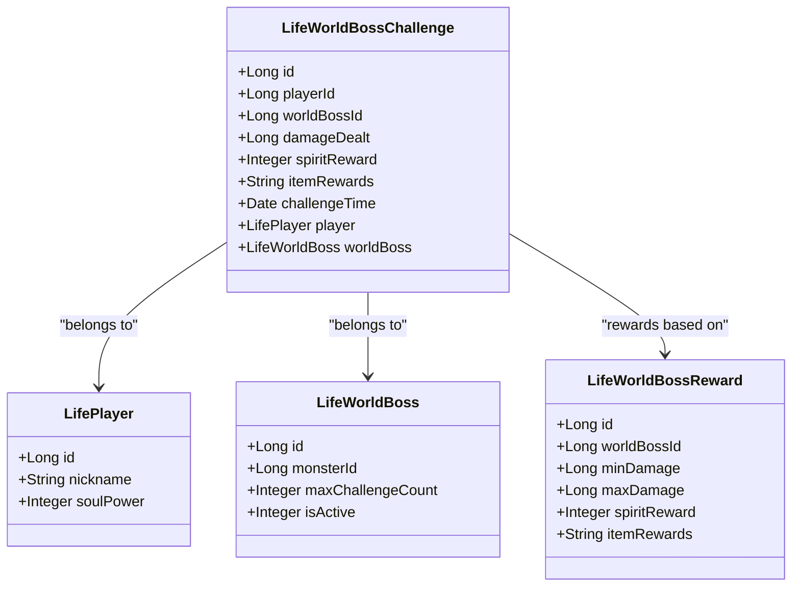
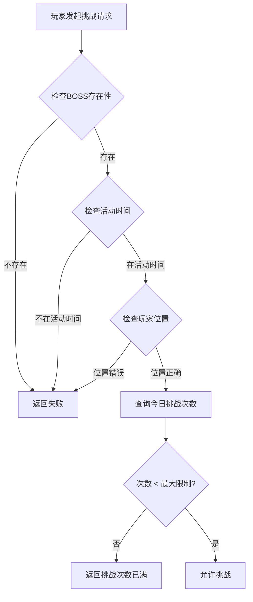
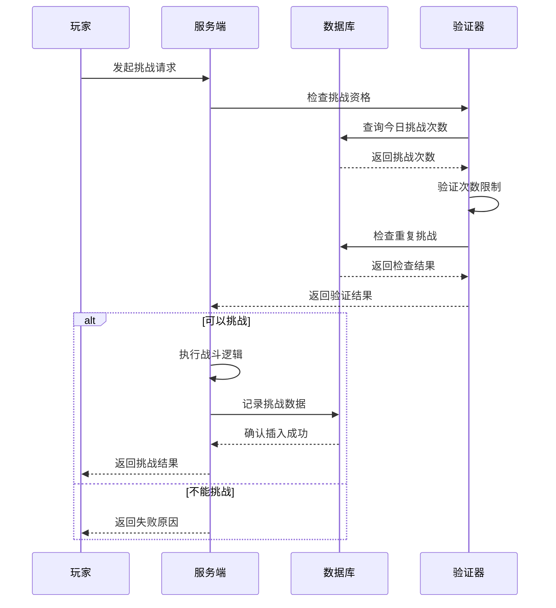
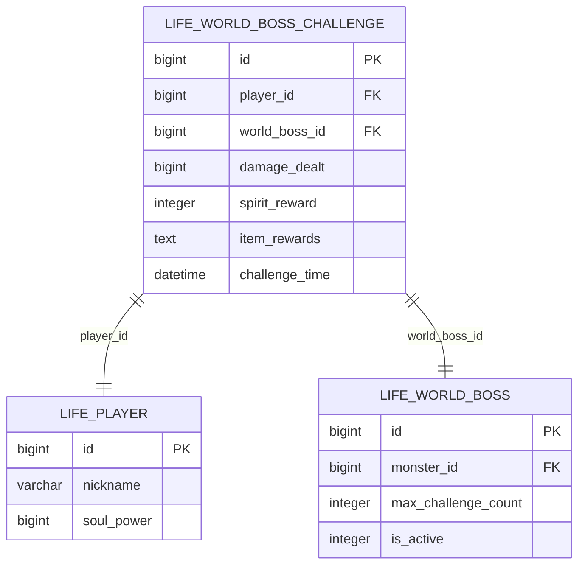

# 挑战记录系统

<cite>
**本文档中引用的文件**
- [LifeWorldBossChallenge.java](file://Life/src/main/java/com/bot/life/dao/entity/LifeWorldBossChallenge.java)
- [LifeWorldBossChallengeMapper.java](file://Life/src/main/java/com/bot/life/dao/mapper/LifeWorldBossChallengeMapper.java)
- [LifeWorldBossChallengeMapper.xml](file://Life/src/main/resources/mapper/LifeWorldBossChallengeMapper.xml)
- [WorldBossServiceImpl.java](file://Life/src/main/java/com/bot/life/service/impl/WorldBossServiceImpl.java)
- [Life_Database_Init.sql](file://Life_Database_Init.sql)
- [LifeWorldBossReward.java](file://Life/src/main/java/com/bot/life/dao/entity/LifeWorldBossReward.java)
- [WorldBossService.java](file://Life/src/main/java/com/bot/life/service/WorldBossService.java)
</cite>

## 目录
1. [系统概述](#系统概述)
2. [核心实体设计](#核心实体设计)
3. [数据库表结构](#数据库表结构)
4. [索引设计与查询优化](#索引设计与查询优化)
5. [挑战次数限制机制](#挑战次数限制机制)
6. [安全控制与防重复挑战](#安全控制与防重复挑战)
7. [伤害排行榜关联](#伤害排行榜关联)
8. [高性能查询实现](#高性能查询实现)
9. [最佳实践建议](#最佳实践建议)

## 系统概述

挑战记录系统是生命游戏模块中的核心功能之一，负责记录玩家对世界BOSS的挑战行为、统计伤害数据、管理奖励分配，并为排行榜提供数据支持。该系统采用基于MySQL的关系型数据库设计，通过精心设计的索引和查询策略确保高性能的数据访问。

系统主要功能包括：
- 记录玩家挑战世界BOSS的行为轨迹
- 统计和分析玩家造成的伤害数据
- 管理挑战次数限制和安全控制
- 支持实时伤害排行榜查询
- 提供挑战记录的查询和展示功能

## 核心实体设计

### LifeWorldBossChallenge实体

LifeWorldBossChallenge是挑战记录系统的核心实体，包含了挑战过程中的关键数据字段：



**图表来源**
- [LifeWorldBossChallenge.java](file://Life/src/main/java/com/bot/life/dao/entity/LifeWorldBossChallenge.java#L12-L24)
- [LifeWorldBossReward.java](file://Life/src/main/java/com/bot/life/dao/entity/LifeWorldBossReward.java#L10-L17)

#### 关键字段详解

**damageDealt（造成的伤害）**
- 数据类型：`Long`（BIGINT）
- 业务意义：记录玩家在单次挑战中对世界BOSS造成的总伤害值
- 数据范围：非负整数，可能达到亿级别
- 性能考虑：作为排序和排名的主要依据

**spiritReward（获得的灵粹奖励）**
- 数据类型：`Integer`（INT）
- 业务意义：根据伤害值区间计算获得的灵粹奖励数量
- 奖励机制：与damageDealt字段配合，形成阶梯式奖励体系
- 存储特点：允许为0，表示伤害不足获得基础奖励

**itemRewards（获得的道具奖励）**
- 数据类型：`String`（LONGVARCHAR）
- 数据格式：JSON字符串
- 业务意义：存储获得的道具奖励详情，包括道具ID、数量等信息
- 扩展性：支持多种奖励组合，便于未来功能扩展
- 示例格式：`[{"itemId":1001,"count":5},{"itemId":1002,"count":2}]`

**section sources**
- [LifeWorldBossChallenge.java](file://Life/src/main/java/com/bot/life/dao/entity/LifeWorldBossChallenge.java#L16-L18)

## 数据库表结构

### life_world_boss_challenge表设计

基于数据库初始化脚本，挑战记录表具有以下结构特征：

| 字段名 | 数据类型 | 约束 | 注释 |
|--------|----------|------|------|
| id | BIGINT | PRIMARY KEY, AUTO_INCREMENT | 主键标识符 |
| player_id | BIGINT | NOT NULL | 玩家ID外键 |
| world_boss_id | BIGINT | NOT NULL | 世界BOSS ID外键 |
| damage_dealt | BIGINT | NOT NULL | 造成的伤害值 |
| spirit_reward | INT | DEFAULT 0 | 灵粹奖励数量 |
| item_rewards | TEXT | | 道具奖励（JSON格式） |
| challenge_time | DATETIME | DEFAULT CURRENT_TIMESTAMP | 挑战时间戳 |

**section sources**
- [Life_Database_Init.sql](file://Life_Database_Init.sql#L560-L568)

### 索引设计策略

系统采用了复合索引`idx_player_boss_time`来优化查询性能：

```sql
KEY `idx_player_boss_time` (`player_id`, `world_boss_id`, `challenge_time`)
```

该索引设计遵循以下原则：
- **前缀匹配优先**：player_id作为查询条件的第一优先级
- **范围查询优化**：world_boss_id支持同一玩家对不同BOSS的查询
- **时间顺序排列**：challenge_time确保按时间排序的效率

## 索引设计与查询优化

### idx_player_boss_time索引分析

该复合索引的设计充分考虑了挑战记录系统的查询模式：


**图表来源**
- [Life_Database_Init.sql](file://Life_Database_Init.sql#L568)

#### 查询优化效果

1. **单玩家查询优化**
   ```sql
   SELECT * FROM life_world_boss_challenge 
   WHERE player_id = ? AND DATE(challenge_time) = CURDATE()
   ORDER BY challenge_time DESC
   ```
   - 利用索引前缀匹配，快速定位玩家记录
   - 时间过滤在索引范围内完成，避免回表操作

2. **挑战次数统计优化**
   ```sql
   SELECT COUNT(*) FROM life_world_boss_challenge 
   WHERE player_id = ? AND world_boss_id = ? 
   AND DATE(challenge_time) = CURDATE()
   ```
   - 完全利用索引覆盖，实现O(log n)复杂度的计数查询

3. **多玩家排行榜优化**
   - 虽然当前索引不直接支持跨玩家查询，但为后续扩展预留了空间

**section sources**
- [LifeWorldBossChallengeMapper.xml](file://Life/src/main/resources/mapper/LifeWorldBossChallengeMapper.xml#L26-L41)

## 挑战次数限制机制

### 实现原理

挑战次数限制通过`selectTodayChallengeCount`方法实现，该方法利用索引高效统计玩家当日挑战次数：



**图表来源**
- [WorldBossServiceImpl.java](file://Life/src/main/java/com/bot/life/service/impl/WorldBossServiceImpl.java#L54-L74)

### 限制策略

1. **每日重置机制**
   - 挑战次数每天凌晨重置
   - 使用`CURDATE()`函数确保时间准确性
   - 支持多个世界BOSS的独立挑战限制

2. **跨BOSS独立限制**
   - 每个世界BOSS有独立的最大挑战次数
   - 不同BOSS间的挑战次数互不影响
   - 便于平衡各BOSS的挑战难度

3. **实时验证**
   - 在挑战前即时检查剩余次数
   - 防止超限挑战的发生
   - 提供明确的失败原因反馈

**section sources**
- [WorldBossServiceImpl.java](file://Life/src/main/java/com/bot/life/service/impl/WorldBossServiceImpl.java#L71-L73)

## 安全控制与防重复挑战

### 多层防护机制

系统实现了多层次的安全控制来防止重复挑战：



**图表来源**
- [WorldBossServiceImpl.java](file://Life/src/main/java/com/bot/life/service/impl/WorldBossServiceImpl.java#L77-L100)

### 具体防护措施

1. **时间窗口控制**
   - 活动时间严格限定在11:00-12:00和19:00-20:00
   - 防止非授权时间的挑战行为

2. **位置验证**
   - 确保玩家位于正确的地图区域
   - 防止跨地图的无效挑战

3. **并发控制**
   - 数据库层面的唯一约束保护
   - 防止同一时间点的重复记录

4. **数据完整性**
   - 挑战时间精确到秒级
   - 避免因时间精度问题导致的重复

**section sources**
- [WorldBossServiceImpl.java](file://Life/src/main/java/com/bot/life/service/impl/WorldBossServiceImpl.java#L55-L74)

## 伤害排行榜关联

### 排行榜数据来源

虽然当前系统没有直接的伤害排行榜查询功能，但挑战记录为排行榜提供了完整的基础数据：



**图表来源**
- [LifeWorldBossChallenge.java](file://Life/src/main/java/com/bot/life/dao/entity/LifeWorldBossChallenge.java#L21-L24)

### 排行榜查询策略

基于现有的挑战记录数据，可以实现以下排行榜查询：

1. **单BOSS伤害排行**
   ```sql
   SELECT player_id, SUM(damage_dealt) as total_damage
   FROM life_world_boss_challenge
   WHERE world_boss_id = ?
   GROUP BY player_id
   ORDER BY total_damage DESC
   LIMIT 100
   ```

2. **玩家总伤害排行**
   ```sql
   SELECT player_id, SUM(damage_dealt) as total_damage
   FROM life_world_boss_challenge
   GROUP BY player_id
   ORDER BY total_damage DESC
   LIMIT 100
   ```

3. **今日伤害排行**
   ```sql
   SELECT player_id, SUM(damage_dealt) as daily_damage
   FROM life_world_boss_challenge
   WHERE DATE(challenge_time) = CURDATE()
   GROUP BY player_id
   ORDER BY daily_damage DESC
   LIMIT 100
   ```

### 数据聚合优化

为了支持高效的排行榜查询，建议采用以下优化策略：

1. **预计算缓存**
   - 定期汇总玩家伤害数据
   - 减少实时查询的计算压力

2. **分页查询**
   - 使用LIMIT和OFFSET实现分页
   - 避免大量数据的传输

3. **索引优化**
   - 为player_id和challenge_time建立复合索引
   - 支持高效的分组和排序查询

**section sources**
- [WorldBossServiceImpl.java](file://Life/src/main/java/com/bot/life/service/impl/WorldBossServiceImpl.java#L152-L178)

## 高性能查询实现

### 查询优化策略

基于现有架构，以下是推荐的高性能查询实现方案：

#### 1. 单玩家今日挑战记录查询

```sql
-- 优化后的查询语句
SELECT id, world_boss_id, damage_dealt, spirit_reward, item_rewards, challenge_time
FROM life_world_boss_challenge
WHERE player_id = ? AND DATE(challenge_time) = CURDATE()
ORDER BY challenge_time DESC
LIMIT 100
```

**优化要点**：
- 使用索引前缀匹配，避免全表扫描
- 添加LIMIT限制，防止数据过多
- 指定具体字段，减少数据传输量

#### 2. 挑战次数统计查询

```sql
-- 高效的计数查询
SELECT COUNT(*)
FROM life_world_boss_challenge
FORCE INDEX (idx_player_boss_time)
WHERE player_id = ? AND world_boss_id = ? 
AND DATE(challenge_time) = CURDATE()
```

**优化要点**：
- 使用FORCE INDEX强制使用复合索引
- 避免不必要的字段选择
- 利用索引覆盖特性

#### 3. 批量查询优化

对于需要查询多个玩家或BOSS的场景：

```sql
-- 批量查询示例
SELECT player_id, world_boss_id, MAX(damage_dealt) as max_damage
FROM life_world_boss_challenge
WHERE player_id IN (?, ?, ?, ?)
GROUP BY player_id, world_boss_id
```

**优化要点**：
- 使用IN子句批量查询
- 结合GROUP BY实现聚合
- 利用索引加速分组操作

### 缓存策略

为了进一步提升性能，建议实施以下缓存策略：

1. **查询结果缓存**
   - 缓存热门玩家的挑战记录
   - 设置合理的缓存过期时间
   - 使用分布式缓存支持集群部署

2. **统计数据缓存**
   - 缓存每日挑战次数统计
   - 定期刷新缓存数据
   - 实现缓存失效机制

3. **排行榜缓存**
   - 缓存前100名伤害排行
   - 使用Redis等内存数据库
   - 支持增量更新机制

**section sources**
- [LifeWorldBossChallengeMapper.xml](file://Life/src/main/resources/mapper/LifeWorldBossChallengeMapper.xml#L26-L41)

## 最佳实践建议

### 数据库设计建议

1. **字段类型选择**
   - `damageDealt`使用BIGINT确保足够大的数值范围
   - `spiritReward`使用INT类型，符合奖励数值范围
   - `itemRewards`使用TEXT类型存储JSON数据

2. **索引策略**
   - 保持idx_player_boss_time索引的完整性
   - 考虑添加player_id单独索引用于单玩家查询
   - 定期分析查询执行计划，优化索引使用

3. **数据分区**
   - 对于历史数据，考虑按月份进行分区
   - 实现自动分区管理策略
   - 平衡查询性能和维护成本

### 应用层优化

1. **连接池配置**
   - 合理设置数据库连接池大小
   - 配置连接超时和空闲检测
   - 监控连接池使用情况

2. **事务管理**
   - 挑战记录操作使用适当的事务隔离级别
   - 避免长时间持有数据库连接
   - 实现事务重试机制

3. **异步处理**
   - 将非关键的统计计算异步化
   - 使用消息队列处理批量数据
   - 实现后台任务调度机制

### 监控与维护

1. **性能监控**
   - 监控查询响应时间
   - 跟踪索引使用效率
   - 分析慢查询日志

2. **容量规划**
   - 预估数据增长趋势
   - 制定定期清理策略
   - 实现数据归档机制

3. **备份恢复**
   - 建立完善的备份策略
   - 测试恢复流程的有效性
   - 实现增量备份机制

### 扩展性考虑

1. **水平扩展**
   - 考虑基于player_id的分片策略
   - 实现跨分片的查询聚合
   - 设计全局唯一ID生成机制

2. **功能扩展**
   - 支持多种奖励类型的灵活配置
   - 实现动态挑战次数调整
   - 提供自定义排行榜功能

3. **API设计**
   - 提供RESTful风格的查询接口
   - 实现分页和过滤参数
   - 支持多种数据格式输出

通过以上设计和优化策略，挑战记录系统能够在保证数据完整性和安全性的同时，提供高性能的数据访问服务，为游戏的社交竞争功能奠定坚实的基础。