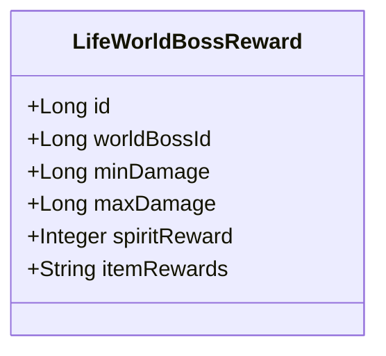
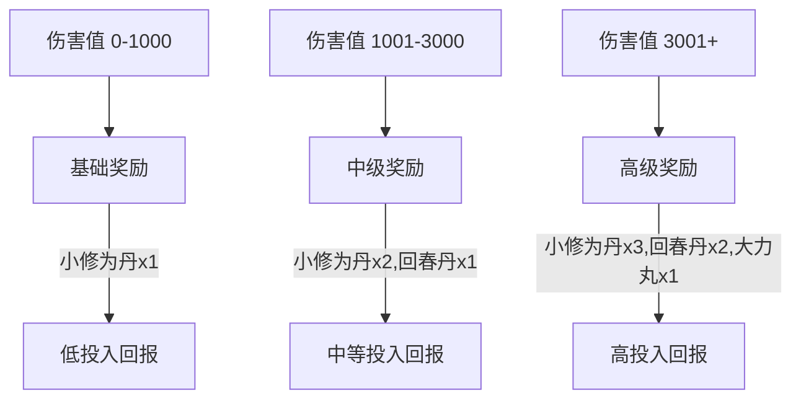
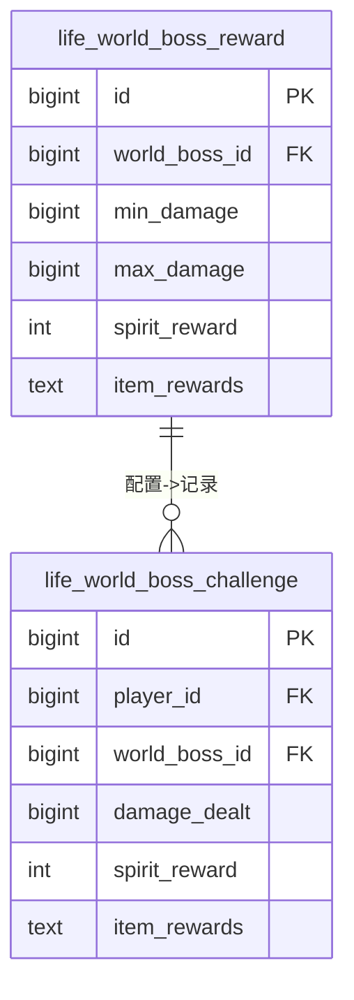
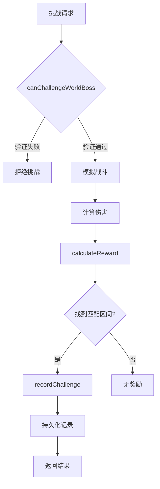

# 阶梯奖励机制

<cite>
**本文档引用文件**  
- [LifeWorldBossReward.java](file://Life\src\main\java\com\bot\life\dao\entity\LifeWorldBossReward.java)
- [LifeWorldBossRewardMapper.java](file://Life\src\main\java\com\bot\life\dao\mapper\LifeWorldBossRewardMapper.java)
- [LifeWorldBossRewardMapper.xml](file://Life\src\main\resources\mapper\LifeWorldBossRewardMapper.xml)
- [WorldBossServiceImpl.java](file://Life\src\main\java\com\bot\life\service\impl\WorldBossServiceImpl.java)
- [LifeWorldBossChallenge.java](file://Life\src\main\java\com\bot\life\dao\entity\LifeWorldBossChallenge.java)
- [Life_Database_Init.sql](file://Life_Database_Init.sql)
</cite>

## 目录
1. [引言](#引言)
2. [核心实体设计](#核心实体设计)
3. [奖励梯度设计策略](#奖励梯度设计策略)
4. [JSON格式道具奖励实现](#json格式道具奖励实现)
5. [奖励分配算法流程](#奖励分配算法流程)
6. [数据表结构与初始化](#数据表结构与初始化)
7. [安全与准确性保障](#安全与准确性保障)
8. [总结](#总结)

## 引言
阶梯奖励机制是游戏世界BOSS系统中的核心激励设计，通过基于玩家造成伤害值的分层奖励分配，有效提升玩家参与度和战斗策略性。该机制以`LifeWorldBossReward`实体为核心，结合数据库配置和业务逻辑实现精准的奖励发放。本文档将全面解析该机制的设计原理、实现方式和运营考量。

## 核心实体设计
`LifeWorldBossReward`实体是阶梯奖励机制的数据载体，定义了奖励区间和对应奖励内容。



**图示来源**  
- [LifeWorldBossReward.java](file://Life\src\main\java\com\bot\life\dao\entity\LifeWorldBossReward.java#L10-L17)

**本节来源**  
- [LifeWorldBossReward.java](file://Life\src\main\java\com\bot\life\dao\entity\LifeWorldBossReward.java#L1-L18)

### 字段解析
- **minDamage**: 奖励区间的最小伤害值，定义了该奖励层级的下限
- **maxDamage**: 奖励区间的最大伤害值，定义了该奖励层级的上限
- **spiritReward**: 该区间对应的灵粹奖励数量，为整型数值
- **itemRewards**: 该区间对应的道具奖励，以JSON格式字符串存储

## 奖励梯度设计策略
奖励梯度设计通过分层递增的方式，激励玩家追求更高的伤害输出。



**图示来源**  
- [Life_Database_Init.sql](file://Life_Database_Init.sql#L515-L520)

**本节来源**  
- [Life_Database_Init.sql](file://Life_Database_Init.sql#L513-L520)

### 运营考量
1. **渐进式激励**: 奖励随伤害值呈阶梯式增长，鼓励玩家提升战斗力
2. **边际效益递减**: 高区间奖励增幅相对平缓，避免过度资源倾斜
3. **道具组合策略**: 低区间仅提供基础消耗品，高区间加入稀有道具，提升追求价值
4. **心理锚定效应**: 以"小修为丹"作为基础奖励单位，建立玩家价值认知

## JSON格式道具奖励实现
道具奖励采用JSON格式字符串存储，提供了灵活的奖励配置能力。



**图示来源**  
- [LifeWorldBossRewardMapper.xml](file://Life\src\main\resources\mapper\LifeWorldBossRewardMapper.xml#L5-L11)
- [LifeWorldBossChallengeMapper.xml](file://Life\src\main\resources\mapper\LifeWorldBossChallengeMapper.xml#L5-L12)

**本节来源**  
- [LifeWorldBossReward.java](file://Life\src\main\java\com\bot\life\dao\entity\LifeWorldBossReward.java#L16)
- [LifeWorldBossChallenge.java](file://Life\src\main\java\com\bot\life\dao\entity\LifeWorldBossChallenge.java#L18)

### 实现优势
1. **结构灵活性**: 可存储任意数量和类型的道具组合
2. **扩展性**: 无需修改表结构即可调整奖励内容
3. **可读性**: 文本格式便于运营人员直接查看和配置
4. **存储效率**: 相比关联表，减少了数据库连接复杂度

## 奖励分配算法流程
奖励分配算法通过精确匹配伤害值与奖励区间，确保奖励发放的准确性。

```mermaid
sequenceDiagram
participant 玩家 as 玩家
participant 服务 as WorldBossServiceImpl
participant 数据库 as life_world_boss_reward
玩家->>服务 : 挑战世界BOSS
服务->>服务 : simulateWorldBossBattle()
服务->>服务 : 计算总伤害
服务->>数据库 : selectByWorldBossId()
数据库-->>服务 : 返回奖励配置列表
服务->>服务 : 遍历奖励区间
loop 检查每个奖励区间
服务->>服务 : 检查伤害值是否在[minDamage,maxDamage]范围内
alt 匹配成功
服务->>服务 : 返回对应奖励
break
end
end
服务->>服务 : recordChallenge()
服务->>玩家 : 返回挑战结果和奖励
```

**图示来源**  
- [WorldBossServiceImpl.java](file://Life\src\main\java\com\bot\life\service\impl\WorldBossServiceImpl.java#L241-L251)
- [LifeWorldBossRewardMapper.java](file://Life\src\main\java\com\bot\life\dao\mapper\LifeWorldBossRewardMapper.java#L31)

**本节来源**  
- [WorldBossServiceImpl.java](file://Life\src\main\java\com\bot\life\service\impl\WorldBossServiceImpl.java#L240-L265)

### 算法执行步骤
1. **获取配置**: 根据世界BOSS ID从数据库获取所有奖励配置
2. **顺序匹配**: 按`min_damage`排序的奖励区间进行顺序遍历
3. **区间判断**: 检查玩家伤害值是否在当前区间的`minDamage`和`maxDamage`之间
4. **返回结果**: 找到匹配区间后立即返回对应奖励，未匹配则返回null

## 数据表结构与初始化
数据库表结构设计支持高效的奖励查询和记录存储。

```sql
-- life_world_boss_reward 表结构
CREATE TABLE `life_world_boss_reward` (
  `id` bigint NOT NULL AUTO_INCREMENT,
  `world_boss_id` bigint NOT NULL COMMENT '世界BOSS ID',
  `min_damage` bigint NOT NULL COMMENT '最小伤害值',
  `max_damage` bigint NOT NULL COMMENT '最大伤害值',
  `spirit_reward` int DEFAULT '0' COMMENT '灵粹奖励',
  `item_rewards` text COMMENT '道具奖励（JSON格式）',
  PRIMARY KEY (`id`),
  KEY `idx_world_boss` (`world_boss_id`, `min_damage`)
) ENGINE=InnoDB DEFAULT CHARSET=utf8mb4 COMMENT='世界BOSS奖励配置表';
```

**本节来源**  
- [Life_Database_Init.sql](file://Life_Database_Init.sql#L513-L520)

### 初始化数据
根据数据库初始化脚本，世界BOSS奖励配置如下：

| ID | world_boss_id | min_damage | max_damage | spirit_reward | item_rewards |
|----|---------------|------------|------------|---------------|--------------|
| 1 | 1 | 0 | 1000 | 50 | 小修为丹x1 |
| 2 | 1 | 1001 | 3000 | 100 | 小修为丹x2,回春丹x1 |
| 3 | 1 | 3001 | 999999 | 200 | 小修为丹x3,回春丹x2,大力丸x1 |
| 4 | 2 | 0 | 1000 | 50 | 小修为丹x1 |
| 5 | 2 | 1001 | 3000 | 100 | 小修为丹x2,回春丹x1 |
| 6 | 2 | 3001 | 999999 | 200 | 小修为丹x3,回春丹x2,大力丸x1 |

## 安全与准确性保障
系统通过多重机制确保奖励分配的安全性和准确性。



**图示来源**  
- [WorldBossServiceImpl.java](file://Life\src\main\java\com\bot\life\service\impl\WorldBossServiceImpl.java#L54-L73)
- [WorldBossServiceImpl.java](file://Life\src\main\java\com\bot\life\service\impl\WorldBossServiceImpl.java#L96-L99)

**本节来源**  
- [WorldBossServiceImpl.java](file://Life\src\main\java\com\bot\life\service\impl\WorldBossServiceImpl.java#L48-L265)

### 保障措施
1. **前置验证**: 挑战前验证BOSS状态、时间、地点和挑战次数
2. **事务安全**: 奖励记录通过数据库事务保证数据一致性
3. **边界处理**: `maxDamage`设置极大值(999999)确保所有伤害都有匹配区间
4. **空值防护**: 奖励为null时提供默认值，避免空指针异常

## 总结
阶梯奖励机制通过`LifeWorldBossReward`实体实现了基于伤害值的精细化奖励分配。该设计采用`minDamage`和`maxDamage`字段定义奖励区间，`spiritReward`字段存储数值奖励，`itemRewards`字段以JSON格式存储道具奖励，兼顾了灵活性和可维护性。奖励分配算法通过顺序匹配确保准确性，数据库索引优化了查询性能。整体设计体现了游戏运营的激励策略，通过渐进式奖励梯度引导玩家提升战斗力，同时JSON格式的道具存储为后续内容扩展提供了便利。