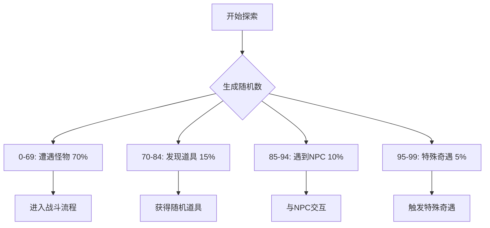
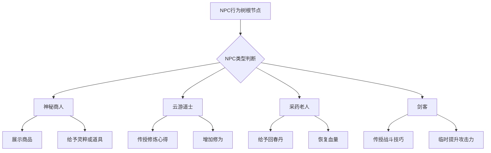
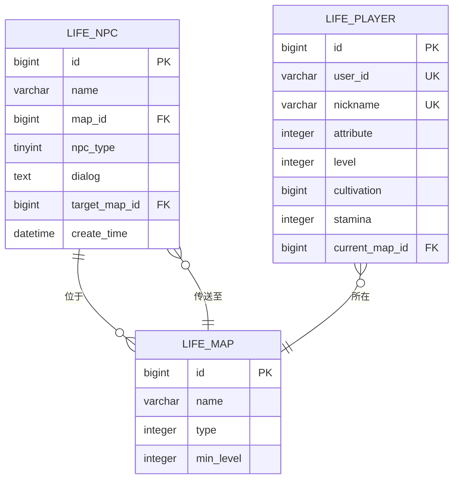
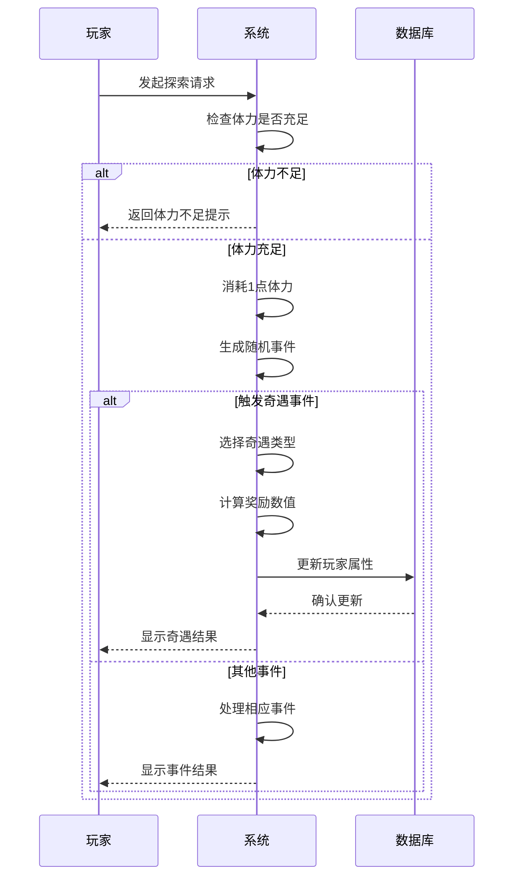

# NPC与奇遇系统

<cite>
**本文档引用文件**   
- [ExplorationServiceImpl.java](file://Life\src\main\java\com\bot\life\service\impl\ExplorationServiceImpl.java)
- [LifeHandlerImpl.java](file://Life\src\main\java\com\bot\life\service\impl\LifeHandlerImpl.java)
- [LifePlayer.java](file://Life\src\main\java\com\bot\life\dao\entity\LifePlayer.java)
- [LifeMap.java](file://Life\src\main\java\com\bot\life\dao\entity\LifeMap.java)
- [LifePlayerMapper.java](file://Life\src\main\java\com\bot\life\dao\mapper\LifePlayerMapper.java)
- [LifeMapMapper.java](file://Life\src\main\java\com\bot\life\dao\mapper\LifeMapMapper.java)
- [Life_Database_Init.sql](file://Life_Database_Init.sql)
</cite>

## 目录
1. [引言](#引言)
2. [NPC触发机制设计](#npc触发机制设计)
3. [奇遇事件触发条件与概率算法](#奇遇事件触发条件与概率算法)
4. [NPC行为树设计模式](#npc行为树设计模式)
5. [数据库设计与NPC属性配置](#数据库设计与npc属性配置)
6. [奇遇事件流程图](#奇遇事件流程图)
7. [典型奇遇场景配置示例](#典型奇遇场景配置示例)
8. [结论](#结论)

## 引言
本系统文档旨在深入解析浮生卷游戏中的NPC与奇遇系统。该系统是游戏核心玩法的重要组成部分，通过随机事件、NPC交互和奇遇机制为玩家提供丰富的修仙体验。文档将详细说明NPC对话、传送和随机奇遇事件的触发条件与概率算法，解析NPC行为树的设计模式，并结合数据库设计描述NPC属性配置表的结构及其与地图的关联关系。

## NPC触发机制设计

NPC触发机制是游戏世界互动性的核心。在浮生卷系统中，NPC主要通过游历探索过程中的随机事件触发。当玩家执行探索操作时，系统会根据预设的概率分布随机生成不同类型的事件。

NPC的触发与玩家当前所处的地图环境密切相关。系统通过`LifeMap`实体类管理地图信息，包括地图名称、类型、最低境界要求等属性。NPC可以被配置在特定地图上，也可以设置为在所有地图随机出现。

触发流程如下：
1. 玩家发起探索请求
2. 系统检查玩家体力是否充足
3. 生成随机数决定事件类型
4. 根据概率分布确定是否触发NPC事件
5. 随机选择符合条件的NPC进行交互

NPC的交互内容和奖励根据NPC类型而异，包括对话领取道具、传送功能和触发特殊奇遇等。系统通过`LifeHandlerImpl`类中的游戏状态机管理NPC交互流程，确保交互过程的连贯性和状态一致性。

**本节来源**
- [ExplorationServiceImpl.java](file://Life\src\main\java\com\bot\life\service\impl\ExplorationServiceImpl.java#L34-L58)
- [LifeHandlerImpl.java](file://Life\src\main\java\com\bot\life\service\impl\LifeHandlerImpl.java#L147-L200)
- [LifeMap.java](file://Life\src\main\java\com\bot\life\dao\entity\LifeMap.java#L1-L20)

## 奇遇事件触发条件与概率算法

奇遇事件的触发采用分层概率算法，确保游戏体验的多样性和平衡性。系统在每次探索时生成一个0-99的随机数，并根据该数值落在不同区间来决定触发的事件类型。



**图示来源**
- [ExplorationServiceImpl.java](file://Life\src\main\java\com\bot\life\service\impl\ExplorationServiceImpl.java#L44-L58)

特殊奇遇事件包含多种预设场景，每种场景都有独特的奖励机制：
- **隐秘修炼之地**：提供大量修为奖励，促进玩家快速升级
- **顿悟境界**：永久提升玩家基础属性，增强角色实力
- **灵泉发现**：完全恢复玩家体力，支持连续探索

概率算法的设计考虑了游戏平衡性，高价值的特殊奇遇设置较低的触发概率（5%），而常见的遭遇事件则有较高的触发概率（70%遭遇怪物）。这种设计确保了游戏既有稳定的日常玩法，又保留了令人惊喜的稀有体验。

系统还实现了体力消耗机制，每次探索都会消耗1点体力，防止玩家无限刷取事件。体力恢复采用时间驱动模式，每5分钟恢复1点，鼓励玩家进行间歇性游戏。

**本节来源**
- [ExplorationServiceImpl.java](file://Life\src\main\java\com\bot\life\service\impl\ExplorationServiceImpl.java#L34-L58)
- [LifePlayer.java](file://Life\src\main\java\com\bot\life\dao\entity\LifePlayer.java#L81-L96)

## NPC行为树设计模式

NPC行为树采用基于状态机的设计模式，通过条件判断和动作执行的组合实现复杂的交互逻辑。系统为不同类型的NPC定义了特定的行为分支，确保每个NPC都有独特的个性和交互方式。



**图示来源**
- [ExplorationServiceImpl.java](file://Life\src\main\java\com\bot\life\service\impl\ExplorationServiceImpl.java#L116-L166)

行为树的执行流程如下：
1. 系统随机选择NPC类型
2. 根据NPC类型进入相应的行为分支
3. 执行该NPC特有的交互动作
4. 根据随机因素决定具体奖励内容
5. 更新玩家状态并保存

每个NPC的行为都包含对话内容和实际效果两个层面。对话内容通过字符串模板实现，提供沉浸式的文字交互体验；实际效果则通过修改玩家属性实现，如增加修为、恢复血量等。

行为树设计采用了可扩展的架构，新的NPC类型可以很容易地添加到系统中，只需在`meetNpcEvent`方法中添加新的case分支即可。这种设计模式提高了代码的可维护性和可扩展性。

**本节来源**
- [ExplorationServiceImpl.java](file://Life\src\main\java\com\bot\life\service\impl\ExplorationServiceImpl.java#L116-L177)

## 数据库设计与NPC属性配置

系统数据库设计围绕NPC与奇遇机制构建了完整的数据模型。核心表结构包括NPC表、玩家表、地图表及其关联关系。



**图示来源**
- [Life_Database_Init.sql](file://Life_Database_Init.sql#L128-L138)
- [LifePlayer.java](file://Life\src\main\java\com\bot\life\dao\entity\LifePlayer.java#L1-L130)
- [LifeMap.java](file://Life\src\main\java\com\bot\life\dao\entity\LifeMap.java#L1-L20)

NPC表（life_npc）包含以下关键字段：
- **id**：NPC唯一标识
- **name**：NPC名称
- **map_id**：所在地图ID（null表示随机地图）
- **npc_type**：NPC类型（1=对话领取道具，2=传送，3=触发奇遇）
- **dialog**：对话内容
- **target_map_id**：传送目标地图ID

玩家表（life_player）存储了玩家的核心属性和状态，包括当前所在地图、体力值、修为等，这些属性直接影响NPC和奇遇事件的触发条件。地图表（life_map）则定义了游戏世界的结构，包括地图名称、类型和最低境界要求。

表之间的关联关系确保了系统的完整性和一致性。NPC与地图的关联实现了基于位置的事件触发，而玩家与地图的关联则跟踪了玩家的实时位置状态。

**本节来源**
- [Life_Database_Init.sql](file://Life_Database_Init.sql#L128-L138)
- [LifePlayer.java](file://Life\src\main\java\com\bot\life\dao\entity\LifePlayer.java#L1-L130)
- [LifeMap.java](file://Life\src\main\java\com\bot\life\dao\entity\LifeMap.java#L1-L20)

## 奇遇事件流程图

奇遇事件的执行过程遵循严格的流程控制，确保游戏状态的一致性和用户体验的流畅性。



**图示来源**
- [ExplorationServiceImpl.java](file://Life\src\main\java\com\bot\life\service\impl\ExplorationServiceImpl.java#L34-L58)
- [LifePlayer.java](file://Life\src\main\java\com\bot\life\dao\entity\LifePlayer.java#L101-L128)

流程说明：
1. **请求接收**：系统接收玩家的探索请求
2. **条件检查**：验证玩家是否有足够的体力执行探索
3. **资源消耗**：扣除相应的体力值
4. **事件生成**：通过随机算法确定触发的事件类型
5. **奖励计算**：根据事件类型和随机因素计算具体奖励
6. **状态更新**：修改玩家属性并持久化到数据库
7. **结果反馈**：向玩家展示详细的事件结果

该流程确保了奇遇事件的公平性和可预测性，同时通过数据库事务保证了数据的一致性。每个步骤都有相应的错误处理机制，如体力不足时的友好提示，确保了系统的健壮性。

## 典型奇遇场景配置示例

以下是几个典型的奇遇场景配置示例，展示了系统如何通过数据配置实现丰富的游戏体验。

### 隐秘修炼之地
```json
{
  "eventType": "special",
  "probability": 0.01,
  "conditions": {
    "minLevel": 1,
    "requiredItems": []
  },
  "rewards": {
    "cultivation": 1000,
    "staminaCost": 1
  },
  "dialog": "『奇遇！』\n\n你发现了一处隐秘的修炼之地，在此修炼了一番。\n\n修为+1000\n体力-1"
}
```

### 顿悟境界
```json
{
  "eventType": "special",
  "probability": 0.02,
  "conditions": {
    "minLevel": 5,
    "requiredItems": ["悟道茶"]
  },
  "rewards": {
    "attributes": {
      "speed": 1,
      "constitution": 1,
      "spiritPower": 1,
      "strength": 1
    },
    "staminaCost": 1
  },
  "dialog": "『顿悟！』\n\n你在游历中突然有所感悟，境界有所提升！\n\n所有属性+1\n体力-1"
}
```

### 灵泉发现
```json
{
  "eventType": "special",
  "probability": 0.02,
  "conditions": {
    "minLevel": 3,
    "maxHealthBelow": 0.5
  },
  "rewards": {
    "stamina": "max",
    "staminaCost": 1
  },
  "dialog": "『灵泉！』\n\n你发现了一眼灵泉，饮用后精神大振！\n\n体力完全恢复\n体力-1（已抵消）"
}
```

这些配置示例展示了系统通过JSON格式定义奇遇事件的灵活性。每个配置包含事件类型、触发概率、前置条件、奖励内容和对话文本等要素。系统在运行时解析这些配置，动态生成相应的游戏事件。

配置中的条件系统允许设计复杂的触发逻辑，如等级要求、物品持有要求等，增加了游戏的策略深度。奖励系统则支持多种类型的奖励组合，包括属性提升、资源增加等，为玩家提供多样化的成长路径。

**本节来源**
- [ExplorationServiceImpl.java](file://Life\src\main\java\com\bot\life\service\impl\ExplorationServiceImpl.java#L179-L203)
- [LifePlayer.java](file://Life\src\main\java\com\bot\life\dao\entity\LifePlayer.java#L190-L198)

## 结论
NPC与奇遇系统通过精心设计的触发机制、概率算法和行为树模式，为浮生卷游戏创造了丰富多样的修仙体验。系统采用分层概率算法平衡了日常玩法与稀有体验，通过状态机驱动的NPC行为树实现了个性化的交互，结合完善的数据库设计确保了数据的一致性和可扩展性。

该系统不仅提供了基础的NPC对话和传送功能，还通过特殊奇遇事件为玩家创造了惊喜时刻，增强了游戏的可玩性和沉浸感。模块化的设计使得新NPC和奇遇事件的添加变得简单高效，为游戏的持续更新和内容扩展提供了坚实的基础。

未来可进一步优化的方向包括：引入更多动态因素影响事件概率、增加NPC之间的互动关系、实现更复杂的奇遇事件链等，以不断提升玩家的游戏体验。