# 副本挑战机制

<cite>
**本文档引用的文件**
- [LifeDungeon.java](file://Life/src/main/java/com/bot/life/dao/entity/LifeDungeon.java)
- [LifeDungeonMapper.xml](file://Life/src/main/resources/mapper/LifeDungeonMapper.xml)
- [LifeDungeonMapper.java](file://Life/src/main/java/com/bot/life/dao/mapper/LifeDungeonMapper.java)
- [TeamServiceImpl.java](file://Life/src/main/java/com/bot/life/service/impl/TeamServiceImpl.java)
- [TeamService.java](file://Life/src/main/java/com/bot/life/service/TeamService.java)
- [BattleServiceImpl.java](file://Life/src/main/java/com/bot/life/service/impl/BattleServiceImpl.java)
- [DungeonCommonHolder.java](file://Game/src/main/java/com/bot/game/service/DungeonCommonHolder.java)
- [WorldBossServiceImpl.java](file://Life/src/main/java/com/bot/life/service/impl/WorldBossServiceImpl.java)
- [CreateGroupPrinter.java](file://Game/src/main/java/com/bot/game/chain/menu/dungeon/CreateGroupPrinter.java)
- [DungeonGroupDTO.java](file://Game/src/main/java/com/bot/game/dto/DungeonGroupDTO.java)
</cite>

## 目录
1. [引言](#引言)
2. [项目结构概述](#项目结构概述)
3. [LifeDungeon实体设计](#lifedungeon实体设计)
4. [副本挑战流程架构](#副本挑战流程架构)
5. [难度分级系统](#难度分级系统)
6. [组队要求与挑战条件](#组队要求与挑战条件)
7. [奖励系统设计](#奖励系统设计)
8. [数据持久化方案](#数据持久化方案)
9. [副本挑战序列图](#副本挑战序列图)
10. [技术实现细节](#技术实现细节)
11. [总结](#总结)

## 引言

副本挑战机制是游戏系统中的核心功能之一，它为玩家提供了结构化的挑战体验。本文档深入分析了基于LifeDungeon实体的副本挑战系统，包括难度分级、组队要求、奖励配置和持久化机制等关键组件。

## 项目结构概述

副本挑战机制涉及多个模块的协同工作：

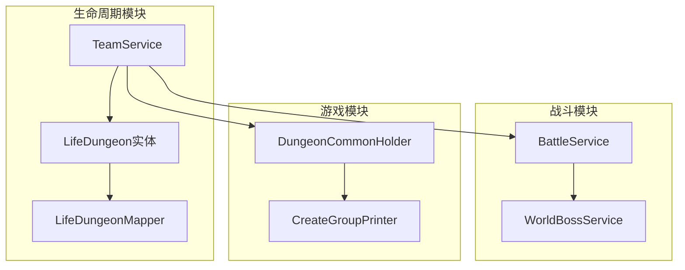

**图表来源**
- [LifeDungeon.java](file://Life/src/main/java/com/bot/life/dao/entity/LifeDungeon.java#L1-L21)
- [TeamServiceImpl.java](file://Life/src/main/java/com/bot/life/service/impl/TeamServiceImpl.java#L1-L378)

## LifeDungeon实体设计

LifeDungeon实体是副本挑战机制的核心数据模型，定义了副本的基本属性和行为特征。

### 实体结构分析

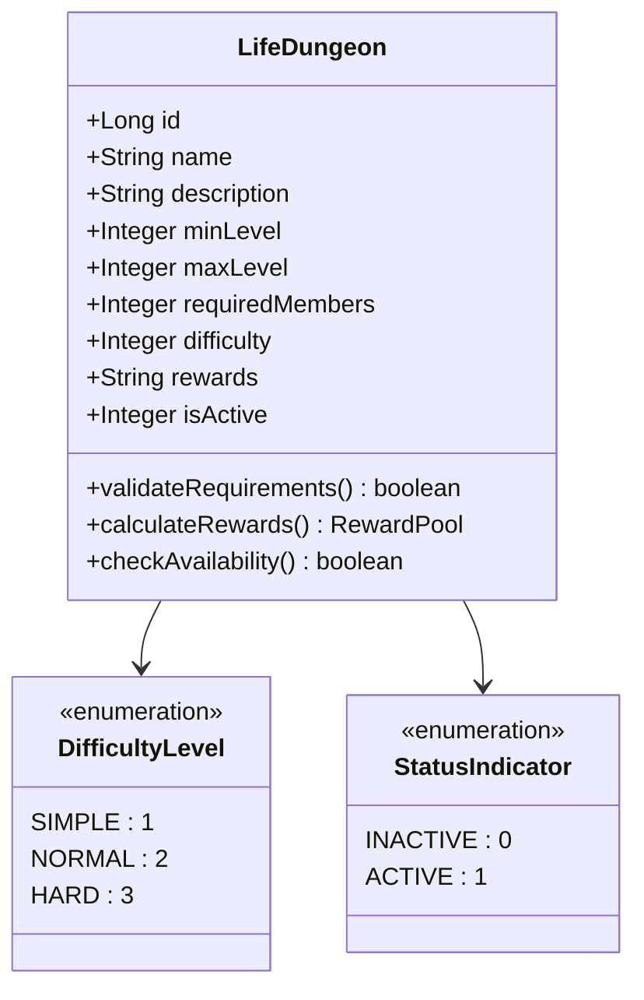

**图表来源**
- [LifeDungeon.java](file://Life/src/main/java/com/bot/life/dao/entity/LifeDungeon.java#L11-L20)

### 字段详解

| 字段名 | 类型 | 说明 | 取值范围 |
|--------|------|------|----------|
| id | Long | 副本唯一标识符 | 自增主键 |
| name | String | 副本名称 | UTF-8编码，最大255字符 |
| description | String | 副本描述信息 | 长文本，支持富文本格式 |
| minLevel | Integer | 最低参与等级 | 1-100 |
| maxLevel | Integer | 最高参与等级 | 1-100，必须≥minLevel |
| requiredMembers | Integer | 必需成员数量 | 1-10，通常为2 |
| difficulty | Integer | 难度级别 | 1-3（简单-困难） |
| rewards | String | 奖励配置（JSON格式） | JSON字符串 |
| isActive | Integer | 副本激活状态 | 0-1 |

**章节来源**
- [LifeDungeon.java](file://Life/src/main/java/com/bot/life/dao/entity/LifeDungeon.java#L11-L20)

## 副本挑战流程架构

副本挑战遵循严格的流程控制，确保游戏平衡性和用户体验。

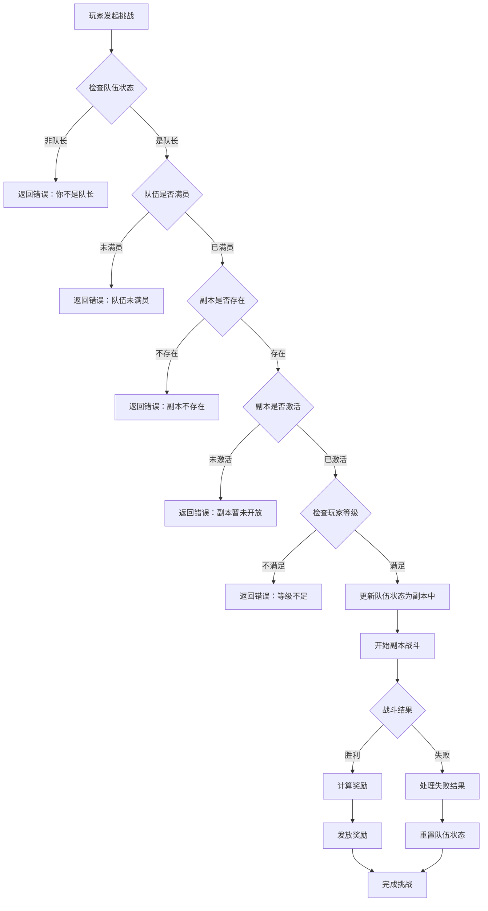

**图表来源**
- [TeamServiceImpl.java](file://Life/src/main/java/com/bot/life/service/impl/TeamServiceImpl.java#L319-L349)

## 难度分级系统

难度分级是副本挑战机制的重要组成部分，影响副本的挑战难度和奖励价值。

### 难度级别定义

| 难度级别 | 数值 | 特征描述 | 适用玩家等级 |
|----------|------|----------|--------------|
| 简单 | 1 | 基础怪物，低伤害输出 | 1-30级 |
| 普通 | 2 | 中等强度怪物，需要策略配合 | 30-60级 |
| 困难 | 3 | 高强度怪物，复杂战斗机制 | 60-100级 |

### 难度影响因素

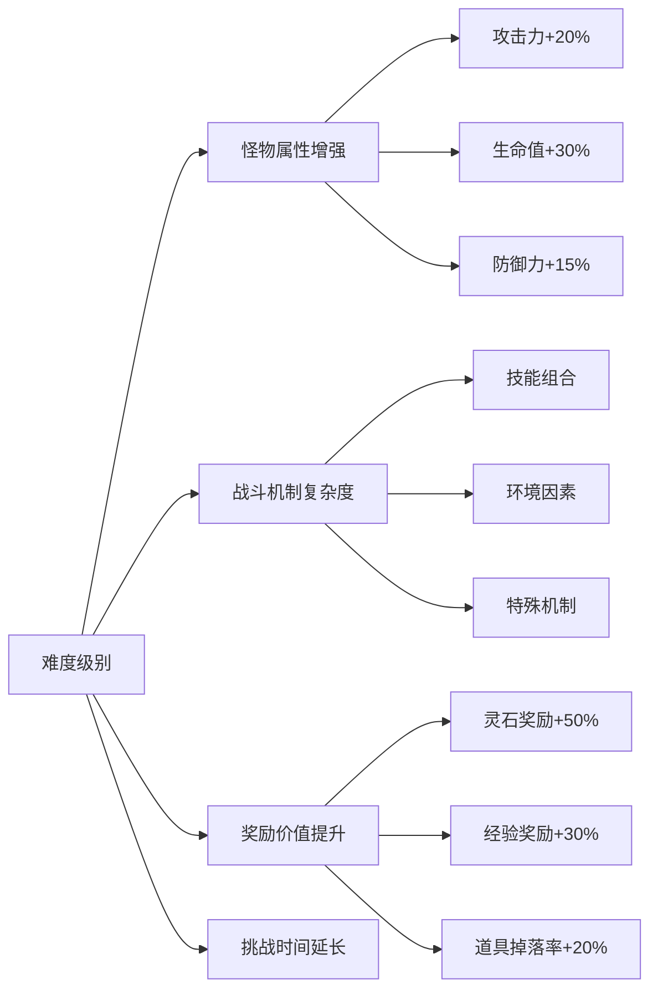

**章节来源**
- [LifeDungeon.java](file://Life/src/main/java/com/bot/life/dao/entity/LifeDungeon.java#L17)

## 组队要求与挑战条件

副本挑战采用组队模式，确保玩家之间的协作和社交互动。

### 组队系统架构

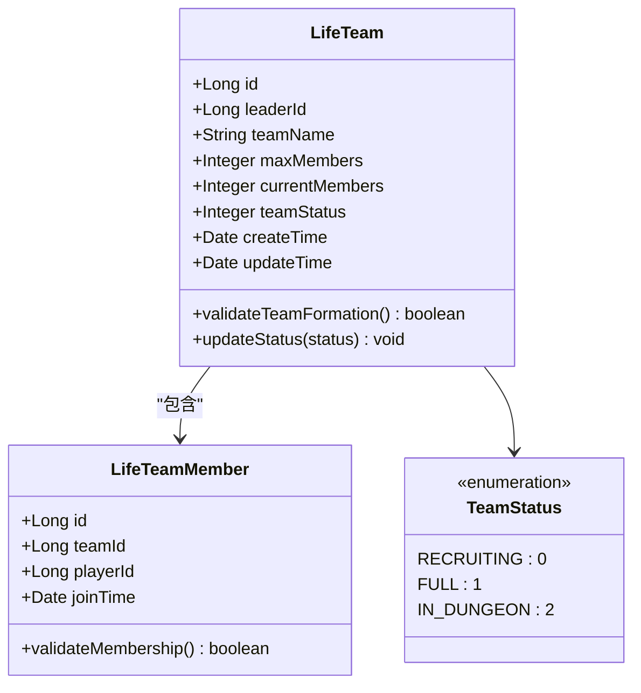

### 组队状态管理

| 状态值 | 状态名称 | 含义 | 允许操作 |
|--------|----------|------|----------|
| 0 | 招募中 | 队伍正在寻找成员 | 加入队伍、退出队伍 |
| 1 | 已满员 | 队伍成员已达到上限 | 开始挑战、退出队伍 |
| 2 | 副本中 | 队伍正在副本中挑战 | 挑战进度查看 |

**章节来源**
- [TeamServiceImpl.java](file://Life/src/main/java/com/bot/life/service/impl/TeamServiceImpl.java#L376-L377)

### 挑战前置条件检查

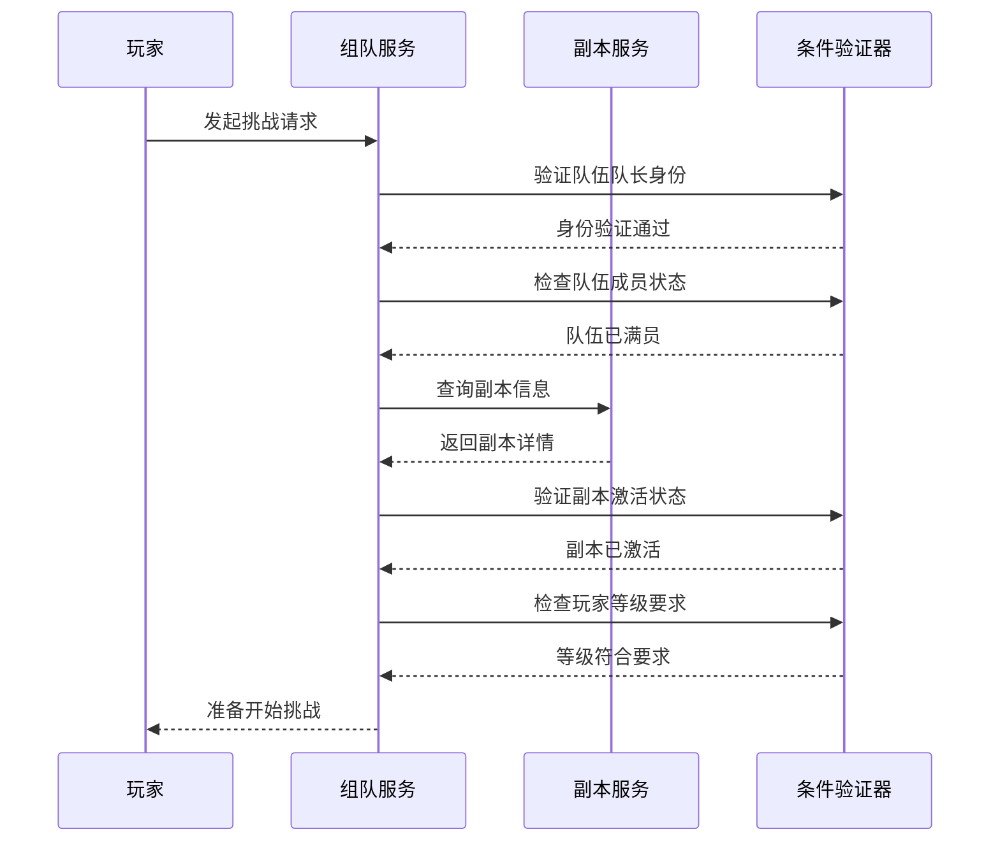

**图表来源**
- [TeamServiceImpl.java](file://Life/src/main/java/com/bot/life/service/impl/TeamServiceImpl.java#L320-L338)

## 奖励系统设计

奖励系统采用JSON结构配置奖励池，支持多种奖励类型的灵活组合。

### 奖励配置结构

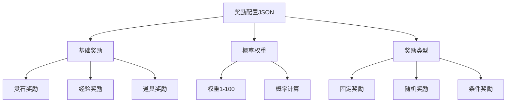

### 奖励池配置示例

典型的奖励配置可能包含以下结构：

```json
{
  "spiritReward": 100,
  "cultivationReward": 500,
  "itemRewards": [
    {
      "itemId": "weapon_001",
      "weight": 30,
      "quantity": 1
    },
    {
      "itemId": "material_002",
      "weight": 70,
      "quantity": 2
    }
  ],
  "experienceReward": {
    "baseExp": 1000,
    "levelBonus": 0.1
  }
}
```

### 随机算法实现

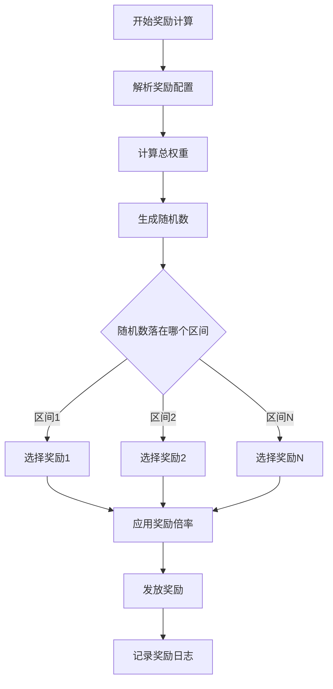

**章节来源**
- [BattleServiceImpl.java](file://Life/src/main/java/com/bot/life/service/impl/BattleServiceImpl.java#L188-L191)

## 数据持久化方案

副本状态管理和挑战记录通过LifeDungeonMapper实现持久化存储。

### CRUD操作映射

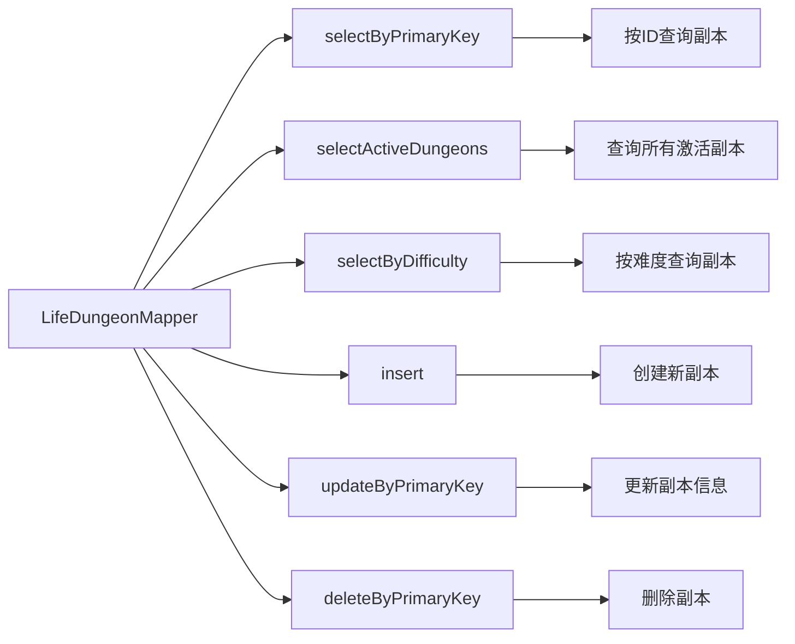

**图表来源**
- [LifeDungeonMapper.xml](file://Life/src/main/resources/mapper/LifeDungeonMapper.xml#L21-L69)

### 状态管理机制

| SQL操作 | 功能描述 | 使用场景 |
|---------|----------|----------|
| selectActiveDungeons | 查询所有激活的副本 | 副本列表显示 |
| selectByDifficulty | 按难度筛选副本 | 难度选择界面 |
| updateByPrimaryKey | 更新副本状态 | 激活/禁用副本 |
| insert | 创建新副本 | 管理员添加副本 |

**章节来源**
- [LifeDungeonMapper.xml](file://Life/src/main/resources/mapper/LifeDungeonMapper.xml#L28-L42)

## 副本挑战序列图

以下是完整的副本挑战流程序列图：

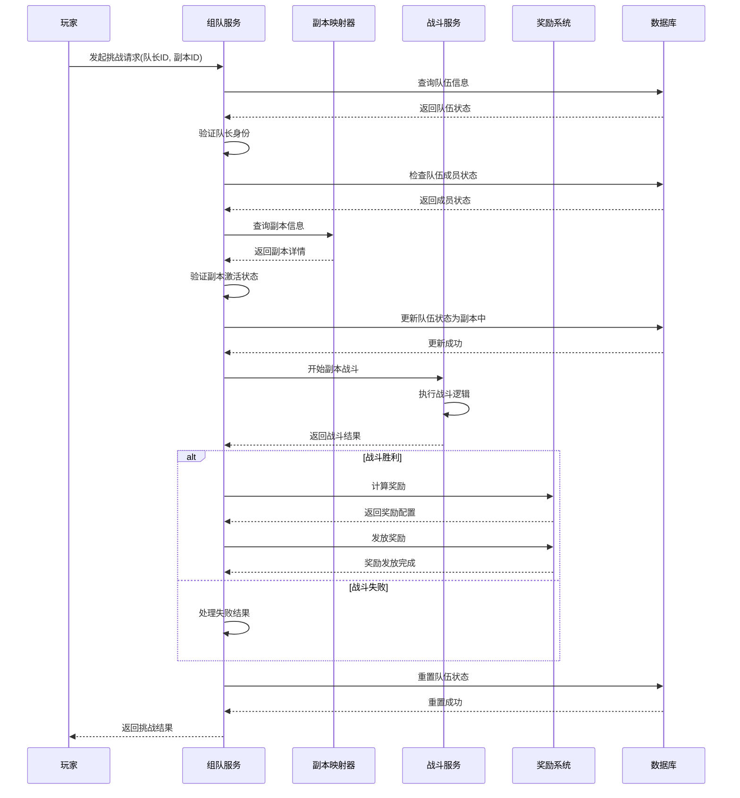

**图表来源**
- [TeamServiceImpl.java](file://Life/src/main/java/com/bot/life/service/impl/TeamServiceImpl.java#L319-L349)
- [BattleServiceImpl.java](file://Life/src/main/java/com/bot/life/service/impl/BattleServiceImpl.java#L184-L193)

## 技术实现细节

### 等级区间验证

副本系统实现了严格的等级区间验证机制：

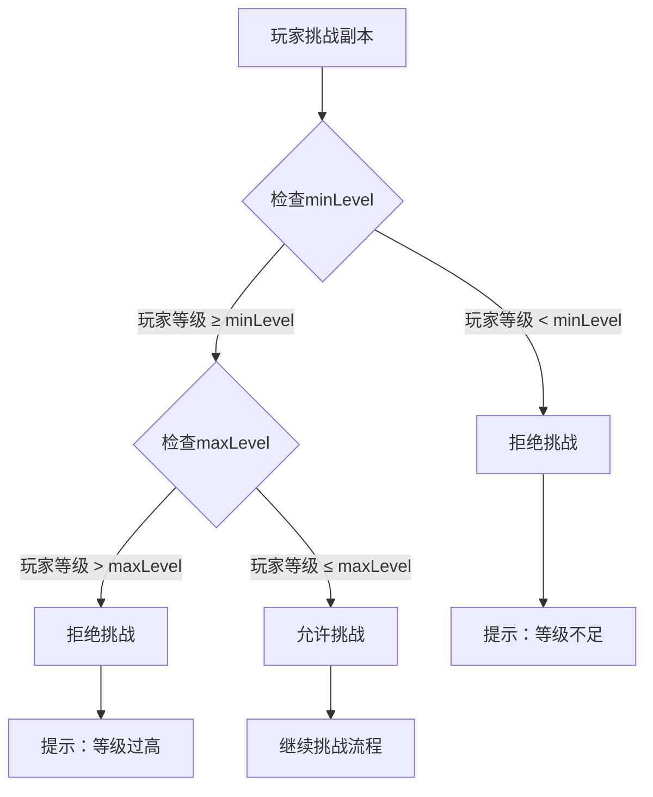

### 组队形成机制

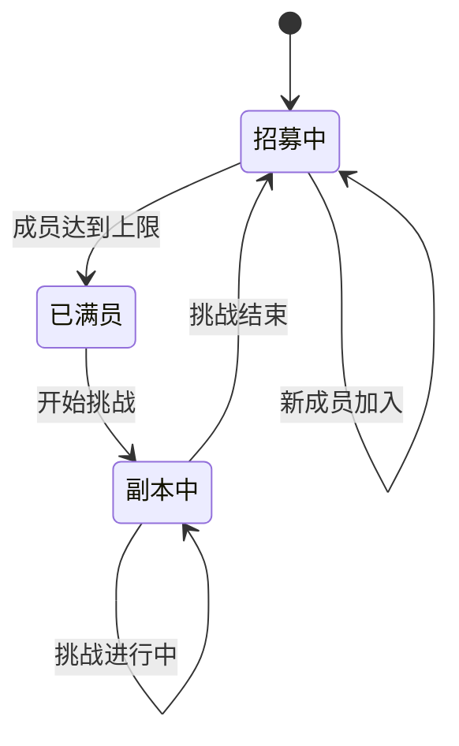

**章节来源**
- [CreateGroupPrinter.java](file://Game/src/main/java/com/bot/game/chain/menu/dungeon/CreateGroupPrinter.java#L46-L48)
- [DungeonGroupDTO.java](file://Game/src/main/java/com/bot/game/dto/DungeonGroupDTO.java#L16-L25)

### 战斗结果处理

战斗系统根据战斗结果执行不同的后续处理：

| 战斗结果 | 处理方式 | 奖励计算 | 状态更新 |
|----------|----------|----------|----------|
| 胜利 | 计算奖励，发放物品 | 基于难度和表现 | 队伍状态重置 |
| 失败 | 清理战斗记录 | 无奖励 | 队伍状态重置 |
| 逃跑 | 强制结束战斗 | 部分奖励 | 队伍状态重置 |

**章节来源**
- [DungeonCommonHolder.java](file://Game/src/main/java/com/bot/game/service/DungeonCommonHolder.java#L198-L206)

## 总结

副本挑战机制是一个复杂而精密的游戏系统，它通过以下关键组件实现了完整的挑战体验：

1. **LifeDungeon实体**：提供了副本的基础属性和行为定义
2. **难度分级系统**：确保不同水平的玩家都能找到合适的挑战
3. **组队要求机制**：促进玩家间的社交互动和协作
4. **奖励配置系统**：支持灵活的奖励组合和随机算法
5. **持久化方案**：保证数据的一致性和可靠性
6. **状态管理系统**：维护复杂的业务状态流转

这套机制不仅为玩家提供了丰富的游戏体验，也为游戏运营提供了灵活的配置能力。通过合理的抽象和模块化设计，系统具备良好的扩展性和维护性，能够适应未来功能的扩展需求。