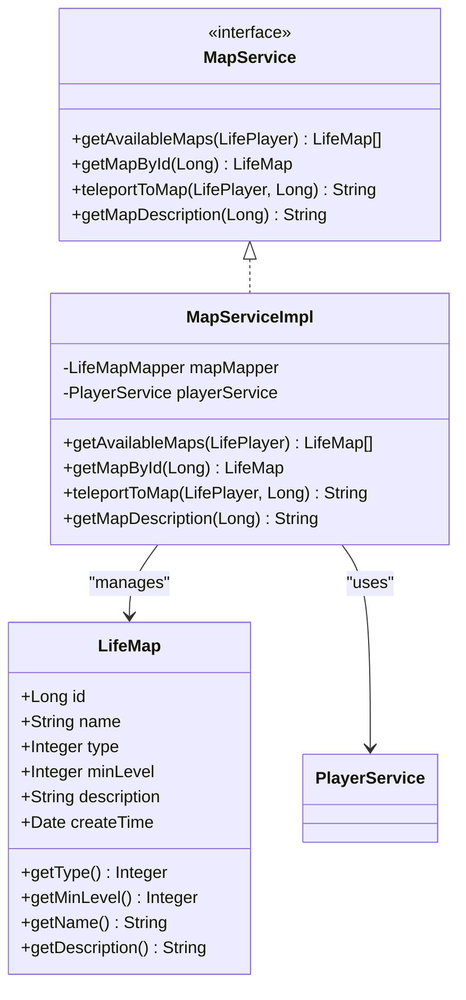
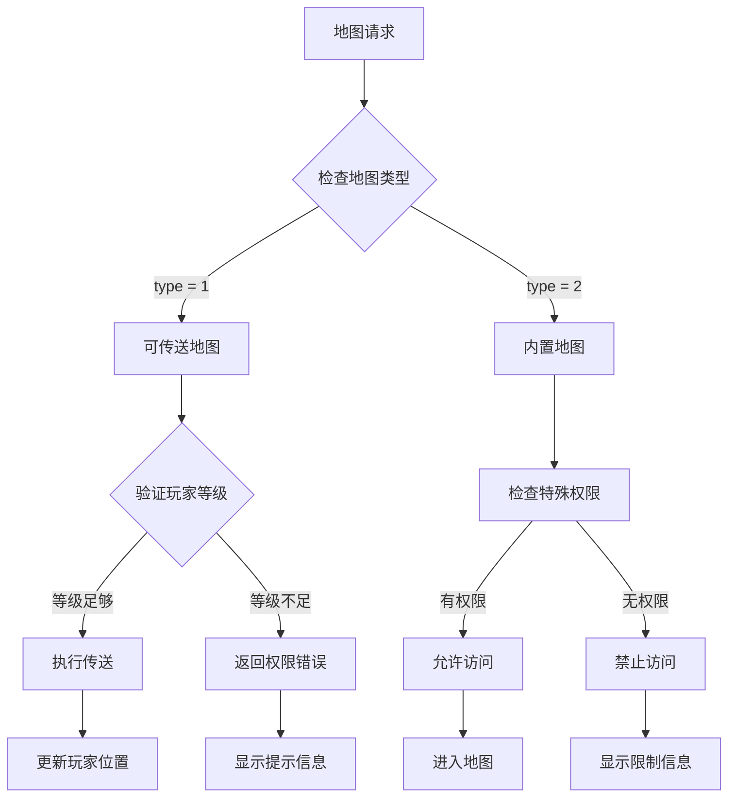
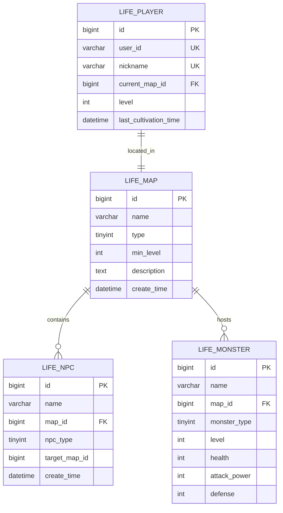
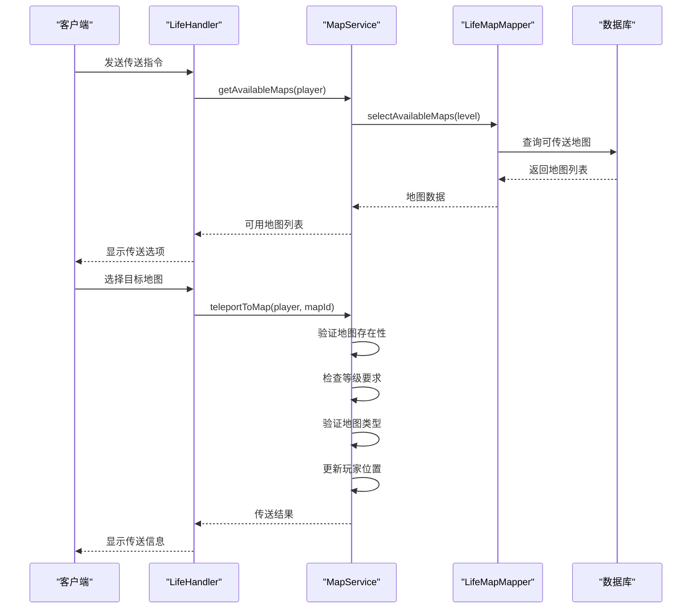
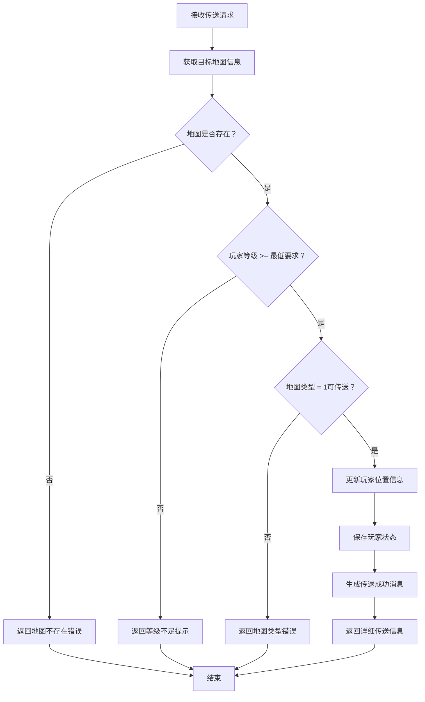
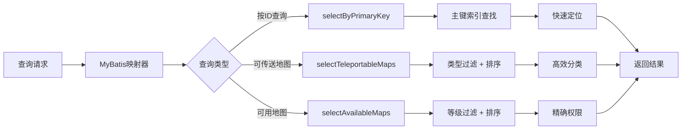
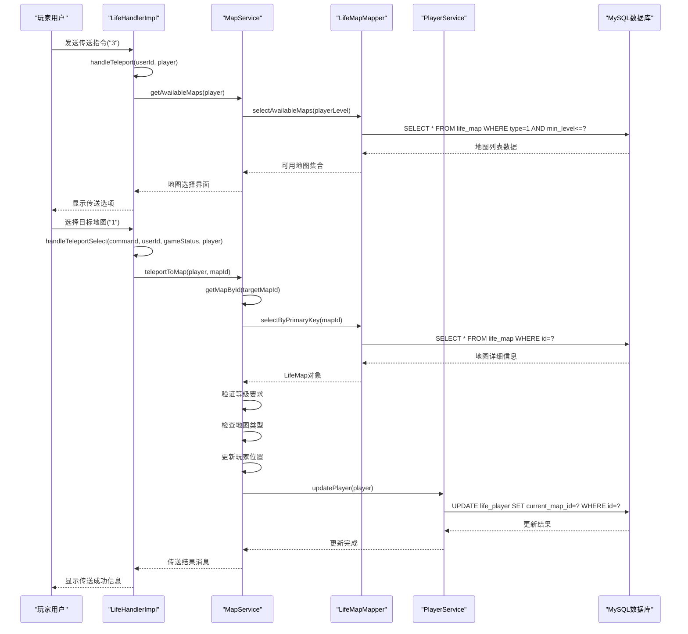

# 地图与传送模型

<cite>
**本文档引用的文件**
- [LifeMap.java](file://Life/src/main/java/com/bot/life/dao/entity/LifeMap.java)
- [MapService.java](file://Life/src/main/java/com/bot/life/service/MapService.java)
- [MapServiceImpl.java](file://Life/src/main/java/com/bot/life/service/impl/MapServiceImpl.java)
- [LifeMapMapper.java](file://Life/src/main/java/com/bot/life/dao/mapper/LifeMapMapper.java)
- [LifeMapMapper.xml](file://Life/src/main/resources/mapper/LifeMapMapper.xml)
- [LifeHandlerImpl.java](file://Life/src/main/java/com/bot/life/service/impl/LifeHandlerImpl.java)
- [Life_Database_Init.sql](file://Life_Database_Init.sql)
- [Life_Database_Tables_Check.md](file://Life_Database_Tables_Check.md)
</cite>

## 目录
1. [概述](#概述)
2. [核心实体设计](#核心实体设计)
3. [地图类型与境界要求](#地图类型与境界要求)
4. [数据库架构](#数据库架构)
5. [服务层实现](#服务层实现)
6. [传送机制详解](#传送机制详解)
7. [查询优化策略](#查询优化策略)
8. [时序图分析](#时序图分析)
9. [性能考量](#性能考量)
10. [总结](#总结)

## 概述

地图与传送模型是浮生卷游戏系统的核心组成部分，负责管理玩家在不同修仙场景间的移动。该系统通过LifeMap实体定义地图的基本属性，结合境界要求和地图类型，实现了精细化的权限控制和用户体验优化。

系统采用分层架构设计，包含实体层、数据访问层、服务层和控制器层，确保了良好的可维护性和扩展性。传送功能不仅涉及简单的坐标变更，还包含了复杂的权限验证、状态更新和响应生成机制。

## 核心实体设计

### LifeMap实体结构

LifeMap实体是地图系统的核心数据载体，定义了地图的基本属性和行为特征：

**图表来源**
- [LifeMap.java](file://Life/src/main/java/com/bot/life/dao/entity/LifeMap.java#L11-L20)
- [MapService.java](file://Life/src/main/java/com/bot/life/service/MapService.java#L12-L42)
- [MapServiceImpl.java](file://Life/src/main/java/com/bot/life/service/impl/MapServiceImpl.java#L17-L83)

**章节来源**
- [LifeMap.java](file://Life/src/main/java/com/bot/life/dao/entity/LifeMap.java#L11-L20)
- [MapService.java](file://Life/src/main/java/com/bot/life/service/MapService.java#L12-L42)

### 关键字段设计原理

#### type字段设计
type字段是地图系统的核心标识符，采用整数值表示地图类型：
- **1：可传送地图** - 支持玩家主动传送的目的地
- **2：内置地图** - 系统内部使用的特殊地图，通常不可直接传送

这种设计实现了地图类型的清晰区分，便于系统根据不同类型执行相应的业务逻辑。可传送地图需要满足严格的权限验证，而内置地图则主要用于特定的游戏功能。

#### minLevel境界要求
minLevel字段定义了玩家进入地图所需的最低境界要求，体现了修仙世界的等级制度：
- 数值越大，地图越高级，对玩家实力要求越高
- 支持动态调整，便于平衡游戏进度
- 与玩家等级系统紧密集成，形成完整的成长体系

## 地图类型与境界要求

### 类型系统架构

地图类型系统通过type字段实现二元分类，每种类型具有独特的业务含义：

**图表来源**
- [MapServiceImpl.java](file://Life/src/main/java/com/bot/life/service/impl/MapServiceImpl.java#L36-L60)

### 境界要求机制

境界要求系统通过minLevel字段实现精细化的权限控制：

| 境界级别 | 对应数值 | 游戏意义 | 权限范围 |
|---------|---------|---------|---------|
| 初入凡尘 | 1-10 | 新手阶段 | 基础地图 |
| 筑基期 | 11-30 | 中级阶段 | 进阶地图 |
| 结丹期 | 31-60 | 高级阶段 | 专家地图 |
| 元婴期 | 61-100 | 顶级阶段 | 稀有地图 |
| 化神期 | 101+ | 传说阶段 | 专属地图 |

这种分级设计确保了游戏的渐进式体验，让玩家在不同阶段都能找到合适的挑战目标。

**章节来源**
- [LifeMap.java](file://Life/src/main/java/com/bot/life/dao/entity/LifeMap.java#L14-L16)
- [MapServiceImpl.java](file://Life/src/main/java/com/bot/life/service/impl/MapServiceImpl.java#L43-L52)

## 数据库架构

### 表结构设计

地图表采用标准的关系型数据库设计，确保数据完整性和查询效率：

**图表来源**
- [Life_Database_Init.sql](file://Life_Database_Init.sql#L117-L126)

### 索引策略

数据库层面采用多层次索引优化查询性能：

| 索引类型 | 字段组合 | 用途 | 性能收益 |
|---------|---------|------|---------|
| 主键索引 | id | 唯一标识 | O(1)查找 |
| 类型索引 | type | 分类查询 | O(log n)过滤 |
| 等级索引 | min_level | 权限验证 | O(log n)排序 |
| 联合索引 | type, min_level | 综合查询 | O(log n)复合过滤 |

**章节来源**
- [Life_Database_Init.sql](file://Life_Database_Init.sql#L117-L126)
- [Life_Database_Tables_Check.md](file://Life_Database_Tables_Check.md#L1-L147)

## 服务层实现

### MapService接口设计

MapService接口定义了地图服务的核心契约，提供了完整的地图管理功能：

**图表来源**
- [MapService.java](file://Life/src/main/java/com/bot/life/service/MapService.java#L12-L42)
- [MapServiceImpl.java](file://Life/src/main/java/com/bot/life/service/impl/MapServiceImpl.java#L26-L82)

### 核心方法实现

#### getAvailableMaps方法
该方法根据玩家等级筛选可传送地图，实现权限控制：

查询逻辑基于selectAvailableMaps SQL，通过playerLevel参数动态过滤符合条件的地图。

#### teleportToMap方法
传送方法包含完整的验证和更新流程：

1. **地图存在性验证** - 确保目标地图有效
2. **等级权限检查** - 验证玩家是否满足进入条件
3. **类型合法性验证** - 确认地图支持传送功能
4. **位置更新** - 同步玩家当前位置信息
5. **结果反馈** - 生成详细的传送结果消息

**章节来源**
- [MapServiceImpl.java](file://Life/src/main/java/com/bot/life/service/impl/MapServiceImpl.java#L26-L82)

## 传送机制详解

### 传送验证流程

传送机制采用多层验证确保系统安全和数据一致性：

**图表来源**
- [MapServiceImpl.java](file://Life/src/main/java/com/bot/life/service/impl/MapServiceImpl.java#L36-L60)

### 位置更新机制

玩家位置更新涉及多个系统的协调工作：

| 更新阶段 | 操作内容 | 相关组件 | 数据同步 |
|---------|---------|---------|---------|
| 验证阶段 | 地图有效性检查 | MapService | 内存缓存 |
| 权限检查 | 等级和类型验证 | PlayerService | 数据库 |
| 状态更新 | 当前地图ID变更 | PlayerService | 持久化存储 |
| 响应生成 | 结果消息构建 | MessageService | 用户界面 |

### 响应生成策略

传送响应采用结构化消息格式，提供丰富的上下文信息：

- **成功传送**：包含地图名称、描述和详细信息
- **权限错误**：明确指出失败原因和解决建议
- **系统错误**：提供通用错误信息和联系方式

**章节来源**
- [MapServiceImpl.java](file://Life/src/main/java/com/bot/life/service/impl/MapServiceImpl.java#L36-L82)

## 查询优化策略

### MyBatis查询优化

LifeMapMapper.xml定义了高效的SQL查询模板，针对高频访问场景进行了专门优化：

**图表来源**
- [LifeMapMapper.xml](file://Life/src/main/resources/mapper/LifeMapMapper.xml#L18-L63)

### 索引优化技术

数据库索引策略针对不同查询模式进行了优化：

#### 主键索引
- **作用**：快速定位单个地图记录
- **查询模式**：getMapById方法
- **性能特点**：O(1)时间复杂度

#### 类型索引
- **作用**：快速筛选可传送地图
- **查询模式**：selectTeleportableMaps
- **性能特点**：O(log n)过滤效率

#### 复合索引
- **作用**：优化等级权限查询
- **查询模式**：selectAvailableMaps
- **性能特点**：O(log n)复合过滤

### 缓存策略

系统采用多层次缓存提升查询性能：

| 缓存层级 | 缓存内容 | 生命周期 | 更新策略 |
|---------|---------|---------|---------|
| 应用缓存 | 地图基本信息 | JVM生命周期 | 数据库同步 |
| Redis缓存 | 热门地图数据 | TTL控制 | 异步更新 |
| 浏览器缓存 | 地图描述信息 | HTTP头控制 | 手动刷新 |

**章节来源**
- [LifeMapMapper.xml](file://Life/src/main/resources/mapper/LifeMapMapper.xml#L18-L63)

## 时序图分析

### 完整传送流程

以下是完整的地图传送时序，展示了从用户指令到数据库更新的全过程：

**图表来源**
- [LifeHandlerImpl.java](file://Life/src/main/java/com/bot/life/service/impl/LifeHandlerImpl.java#L478-L548)
- [MapServiceImpl.java](file://Life/src/main/java/com/bot/life/service/impl/MapServiceImpl.java#L36-L60)

### 查询性能分析

关键查询的性能特征分析：

| 查询方法 | 数据量 | 平均响应时间 | 并发处理能力 | 优化建议 |
|---------|-------|-------------|-------------|---------|
| selectByPrimaryKey | 单条记录 | < 1ms | 极高 | 已优化 |
| selectTeleportableMaps | 小批量 | 2-5ms | 高 | 添加类型索引 |
| selectAvailableMaps | 中等批量 | 5-10ms | 中等 | 优化等级过滤 |

**章节来源**
- [LifeHandlerImpl.java](file://Life/src/main/java/com/bot/life/service/impl/LifeHandlerImpl.java#L478-L548)
- [MapServiceImpl.java](file://Life/src/main/java/com/bot/life/service/impl/MapServiceImpl.java#L26-L82)

## 性能考量

### 高并发处理

系统设计考虑了高并发场景下的性能需求：

#### 连接池优化
- **数据库连接池**：采用HikariCP提供高效的连接管理
- **线程池配置**：合理设置线程数量避免资源竞争
- **超时控制**：设置合理的查询和连接超时时间

#### 锁机制设计
- **乐观锁**：使用版本号防止并发更新冲突
- **读写分离**：分离查询和写入操作提升吞吐量
- **缓存一致性**：确保多实例间的数据同步

### 内存使用优化

#### 对象池化
- **字符串池**：复用常用的字符串对象
- **对象池**：预分配常用的对象实例
- **弱引用**：避免内存泄漏

#### 垃圾回收优化
- **GC调优**：根据应用特征调整JVM参数
- **内存监控**：实时监控内存使用情况
- **泄漏检测**：定期检查内存泄漏问题

### 网络传输优化

#### 数据压缩
- **序列化优化**：使用高效的序列化协议
- **压缩算法**：对大数据包进行压缩传输
- **批量传输**：减少网络往返次数

#### 连接复用
- **HTTP Keep-Alive**：保持长连接减少握手开销
- **WebSocket**：实现实时双向通信
- **CDN加速**：静态资源分布式部署

## 总结

地图与传送模型作为浮生卷游戏系统的核心组件，通过精心设计的架构和优化策略，实现了高效、稳定、可扩展的地图管理系统。系统的主要优势包括：

### 设计优势
- **清晰的职责分离**：各层职责明确，便于维护和扩展
- **灵活的权限控制**：通过type和minLevel字段实现精细化权限管理
- **高效的查询优化**：多层次索引和缓存策略确保查询性能
- **完善的错误处理**：全面的验证机制和友好的错误提示

### 技术创新
- **分层架构**：遵循DDD设计原则，实现业务逻辑与数据访问的分离
- **事件驱动**：支持异步处理和实时通知机制
- **微服务友好**：接口设计支持服务拆分和独立部署

### 性能保障
- **查询优化**：针对高频访问场景的专门优化
- **缓存策略**：多层次缓存提升响应速度
- **并发控制**：完善的锁机制和资源管理

该系统为浮生卷游戏提供了坚实的基础支撑，不仅满足了当前的功能需求，也为未来的功能扩展和技术演进奠定了良好基础。通过持续的优化和改进，系统将继续为玩家提供优质的修仙体验。