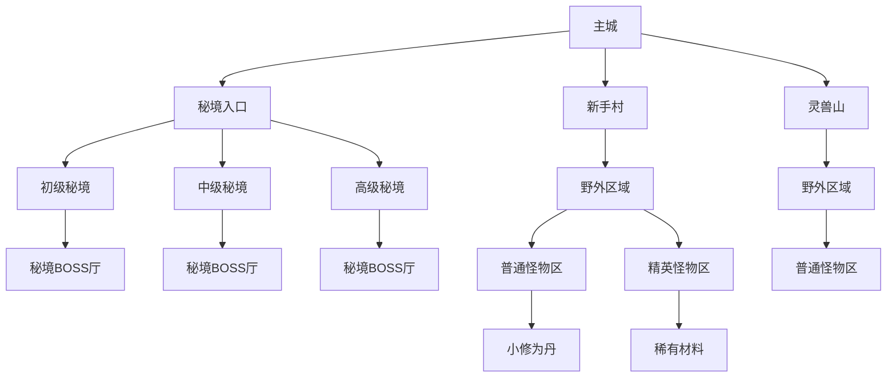
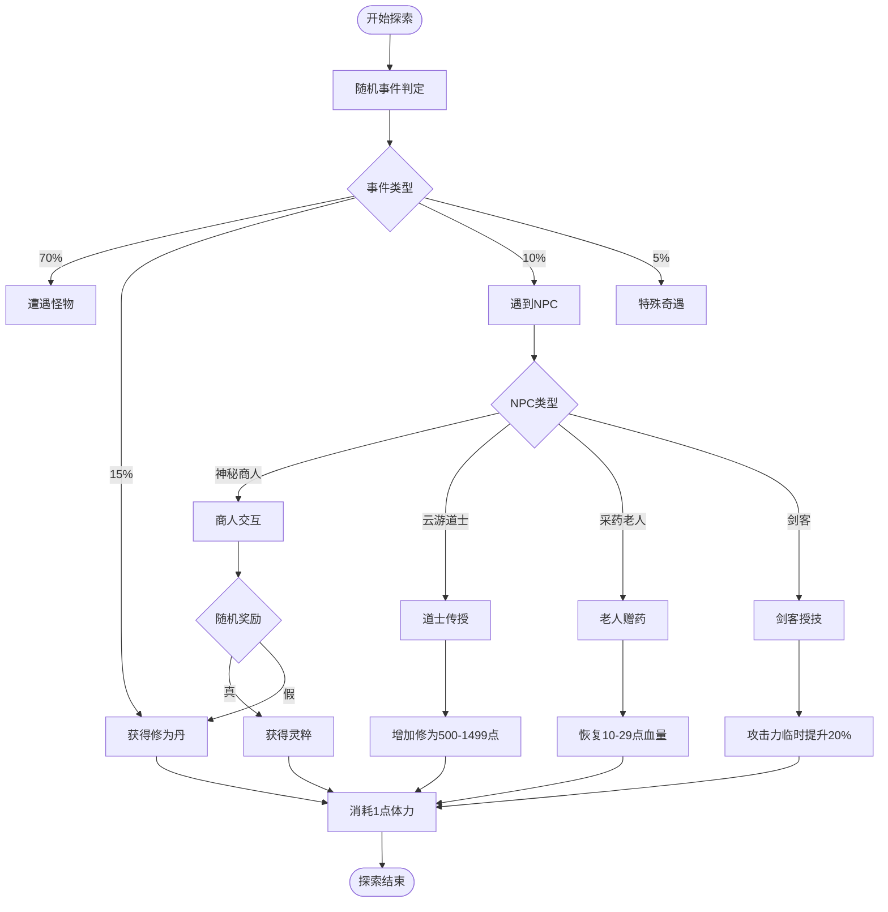

# 地图系统数据模型

<cite>
**本文档引用文件**  
- [LifeMap.java](file://Life\src\main\java\com\bot\life\dao\entity\LifeMap.java)
- [LifeDungeon.java](file://Life\src\main\java\com\bot\life\dao\entity\LifeDungeon.java)
- [MapServiceImpl.java](file://Life\src\main\java\com\bot\life\service\impl\MapServiceImpl.java)
- [ExplorationServiceImpl.java](file://Life\src\main\java\com\bot\life\service\impl\ExplorationServiceImpl.java)
- [Life_Database_Init.sql](file://Life_Database_Init.sql)
- [LifeMapMapper.xml](file://Life\src\main\resources\mapper\LifeMapMapper.xml)
- [LifeDungeonMapper.xml](file://Life\src\main\resources\mapper\LifeDungeonMapper.xml)
</cite>

## 目录
1. [引言](#引言)
2. [核心实体设计](#核心实体设计)
3. [地图系统数据结构](#地图系统数据结构)
4. [NPC交互机制](#npc交互机制)
5. [副本挑战系统](#副本挑战系统)
6. [地图层级结构图](#地图层级结构图)
7. [NPC交互流程图](#npc交互流程图)
8. [权限控制与性能优化](#权限控制与性能优化)

## 引言
本文档深入解析浮生卷游戏中的地图系统数据模型，重点阐述LifeMap、LifeNPC和LifeDungeon等核心实体的设计原理与实现机制。通过分析数据库表结构和Java实体类，详细说明地图传送、NPC交互、副本挑战等关键功能的数据结构设计，为系统维护和功能扩展提供技术参考。

## 核心实体设计

### LifeMap实体
LifeMap实体定义了游戏世界中的地图基本信息，包含地图名称、类型、等级要求和描述等属性。该实体与数据库中的life_map表一一对应，通过MyBatis框架实现持久化操作。

**实体属性说明：**
- `id`：地图唯一标识
- `name`：地图名称
- `type`：地图类型（1可传送，2内置地图）
- `minLevel`：进入该地图所需的最低境界等级
- `description`：地图描述信息

**Section sources**
- [LifeMap.java](file://Life\src\main\java\com\bot\life\dao\entity\LifeMap.java#L1-L19)

### LifeDungeon实体
LifeDungeon实体表示游戏中的副本信息，包含副本名称、难度、等级范围、成员要求和奖励配置等属性。副本作为重要的游戏挑战内容，其数据结构设计直接影响玩家的游戏体验。

**实体属性说明：**
- `id`：副本唯一标识
- `name`：副本名称
- `description`：副本描述
- `minLevel`/`maxLevel`：副本的等级范围要求
- `requiredMembers`：组队挑战所需的最少成员数
- `difficulty`：副本难度（1简单，2普通，3困难）
- `rewards`：副本奖励信息，以JSON格式存储
- `isActive`：副本是否激活状态

**Section sources**
- [LifeDungeon.java](file://Life\src\main\java\com\bot\life\dao\entity\LifeDungeon.java#L1-L21)

## 地图系统数据结构

### 地图类型区分
根据Life_Database_Init.sql中的DDL语句，life_map表通过type字段实现地图类型的区分：

```sql
`type` tinyint NOT NULL COMMENT '地图类型：1可传送2内置地图'
```

这种设计实现了两种不同类型地图的功能区分：
- **可传送地图（type=1）**：玩家可以通过传送功能直接到达，通常为常规探索区域
- **内置地图（type=2）**：无法直接传送，通常为特殊场景或副本内部地图，需要通过特定事件进入

### 境界要求配置
地图的境界要求通过min_level字段进行配置，控制玩家的访问权限：

```sql
`min_level` int DEFAULT 1 COMMENT '最低境界要求'
```

当玩家尝试传送至某地图时，系统会检查玩家等级是否满足该地图的最低境界要求，确保游戏进度的合理性。

### 地图服务实现
MapServiceImpl类实现了地图相关的核心业务逻辑，包括获取可用地图列表、地图传送和地图信息查询等功能。

**关键方法：**
- `getAvailableMaps()`：根据玩家等级筛选可进入的地图
- `teleportToMap()`：处理玩家传送请求，包含等级和地图类型验证
- `getMapDescription()`：生成地图详细信息描述

**权限验证流程：**
1. 检查目标地图是否存在
2. 验证玩家等级是否满足地图要求
3. 确认目标地图是否为可传送类型
4. 更新玩家当前位置并返回成功信息

**Section sources**
- [MapServiceImpl.java](file://Life\src\main\java\com\bot\life\service\impl\MapServiceImpl.java#L1-L83)
- [Life_Database_Init.sql](file://Life_Database_Init.sql#L117-L126)

## NPC交互机制

### NPC表结构
life_npc表定义了游戏中所有NPC的数据结构：

```sql
CREATE TABLE IF NOT EXISTS `life_npc` (
  `id` bigint NOT NULL AUTO_INCREMENT,
  `name` varchar(50) NOT NULL COMMENT 'NPC名称',
  `map_id` bigint COMMENT '所在地图ID(null表示随机地图)',
  `npc_type` tinyint NOT NULL COMMENT 'NPC类型：1对话领取道具2传送3触发奇遇',
  `dialog` text COMMENT '对话内容',
  `target_map_id` bigint COMMENT '传送目标地图ID',
  `create_time` datetime DEFAULT CURRENT_TIMESTAMP,
  PRIMARY KEY (`id`)
) ENGINE=InnoDB DEFAULT CHARSET=utf8mb4 COMMENT='NPC表';
```

### NPC触发机制
NPC的交互行为通过npc_type字段进行类型区分，实现不同的触发机制：

**类型1：对话领取道具**
- 玩家与NPC对话后随机获得道具或游戏货币
- 如"神秘商人"可能给予灵粹或修为丹

**类型2：传送功能**
- NPC作为传送点，将玩家传送到指定地图
- target_map_id字段存储目标地图ID

**类型3：触发奇遇**
- 与NPC互动触发特殊事件
- 如"云游道士"传授修炼心得，增加修为

### NPC交互流程
ExplorationServiceImpl中的meetNpcEvent方法实现了NPC交互的核心逻辑：

```java
private String meetNpcEvent(LifePlayer player) {
    String[] npcNames = {"神秘商人", "云游道士", "采药老人", "剑客"};
    String npcName = npcNames[random.nextInt(npcNames.length)];
    
    StringBuilder result = new StringBuilder();
    result.append("『遇到NPC！』\n\n");
    result.append(String.format("你在游历中遇到了『%s』！\n\n", npcName));
    
    switch (npcName) {
        case "神秘商人":
            // 商人交互逻辑
            break;
        case "云游道士":
            // 道士交互逻辑
            break;
        case "采药老人":
            // 老人交互逻辑
            break;
        case "剑客":
            // 剑客交互逻辑
            break;
    }
    
    return result.toString();
}
```

**Section sources**
- [Life_Database_Init.sql](file://Life_Database_Init.sql#L127-L137)
- [ExplorationServiceImpl.java](file://Life\src\main\java\com\bot\life\service\impl\ExplorationServiceImpl.java#L116-L176)

## 副本挑战系统

### 副本表关联关系
life_dungeon表与地图、怪物等实体存在密切的关联关系：

**与地图的关联：**
- 副本通常位于特定地图中，通过地图ID进行关联
- 玩家需要先到达副本所在地图才能进入挑战

**与怪物的关联：**
- 副本内的怪物通过life_monster表的monster_type字段标识为"副本BOSS"
- 副本挑战通常包含多个怪物，形成连续的战斗序列

### 副本奖励JSON设计
副本奖励信息以JSON格式存储在rewards字段中，这种设计提供了极大的灵活性：

```json
{
  "items": [
    {"id": 1001, "name": "修为丹", "quantity": "1-3", "rate": 0.8},
    {"id": 2001, "name": "灵石", "quantity": "50-100", "rate": 0.6}
  ],
  "currency": {"min": 100, "max": 500},
  "experience": {"base": 1000, "per_member_bonus": 200}
}
```

**JSON设计优势：**
- 支持复杂的奖励结构，包括道具、货币、经验值等
- 可配置掉落概率和数量范围
- 易于扩展新的奖励类型
- 减少数据库表结构变更的需求

**Section sources**
- [LifeDungeon.java](file://Life\src\main\java\com\bot\life\dao\entity\LifeDungeon.java#L1-L21)
- [Life_Database_Init.sql](file://Life_Database_Init.sql#L178-L185)

## 地图层级结构图



**Diagram sources**
- [Life_Database_Init.sql](file://Life_Database_Init.sql#L117-L126)
- [LifeMap.java](file://Life\src\main\java\com\bot\life\dao\entity\LifeMap.java#L1-L19)

## NPC交互流程图



**Diagram sources**
- [ExplorationServiceImpl.java](file://Life\src\main\java\com\bot\life\service\impl\ExplorationServiceImpl.java#L35-L59)
- [Life_Database_Init.sql](file://Life_Database_Init.sql#L127-L137)

## 权限控制与性能优化

### 地图探索权限控制
系统通过多层次的权限控制机制确保游戏平衡性：

**等级权限控制：**
- 每个地图设置min_level字段，限制低等级玩家进入
- 传送时进行实时验证，防止越级挑战

**地图类型控制：**
- 区分可传送和内置地图，控制玩家的移动自由度
- 内置地图通常为剧情关键区域，需要特定条件解锁

**体力消耗机制：**
- 每次探索消耗1点体力，限制玩家的探索频率
- 体力随时间自然恢复，每5分钟恢复1点

### 性能优化策略
为确保地图系统的高效运行，采用了以下性能优化措施：

**数据库查询优化：**
- 为life_map表的type和min_level字段创建复合索引
- 使用预编译SQL语句提高查询效率
- 通过MyBatis的二级缓存减少重复查询

**业务逻辑优化：**
- 将常用的地图列表缓存到内存中
- 批量处理玩家位置更新操作
- 异步记录探索日志，减少主线程压力

**资源管理优化：**
- 按需加载地图数据，避免一次性加载全部地图
- 对NPC对话内容进行压缩存储
- 使用对象池技术复用频繁创建的实体对象

**Section sources**
- [MapServiceImpl.java](file://Life\src\main\java\com\bot\life\service\impl\MapServiceImpl.java#L27-L29)
- [ExplorationServiceImpl.java](file://Life\src\main\java\com\bot\life\service\impl\ExplorationServiceImpl.java#L37-L38)
- [LifeMapMapper.xml](file://Life\src\main\resources\mapper\LifeMapMapper.xml#L25-L36)
- [Life_Database_Init.sql](file://Life_Database_Init.sql#L117-L126)