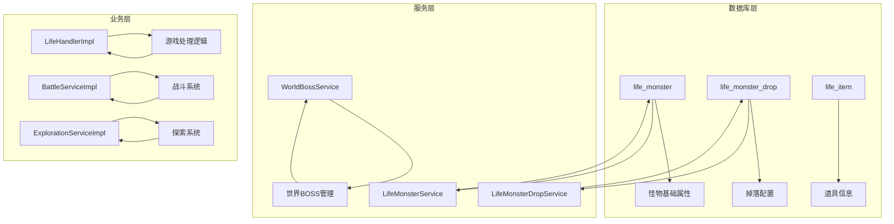
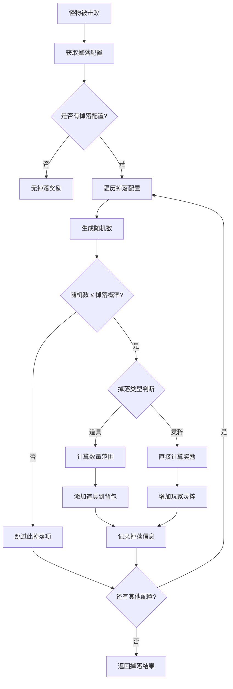
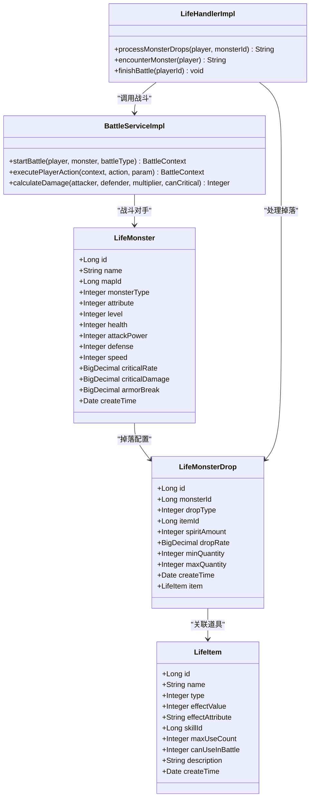
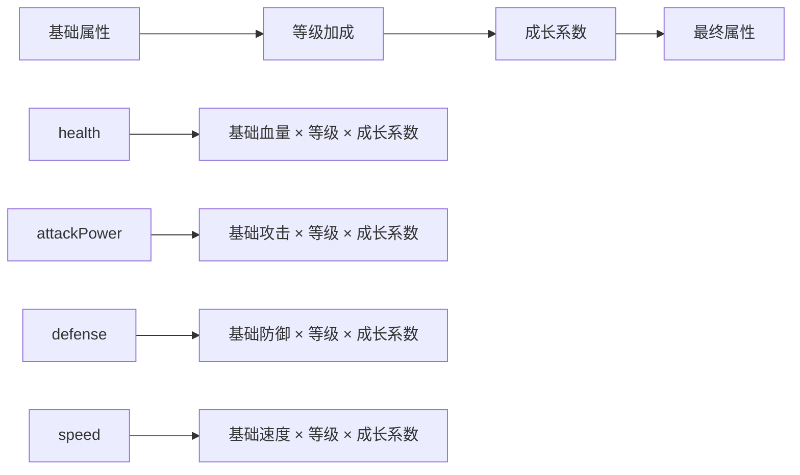
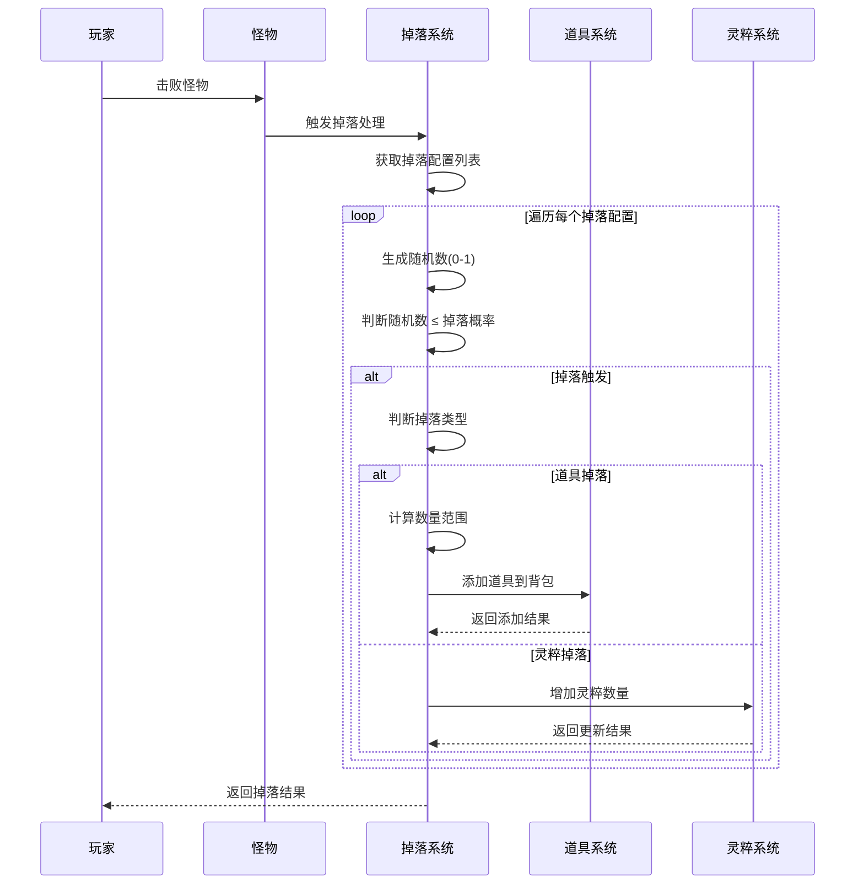
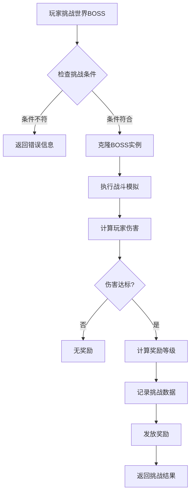
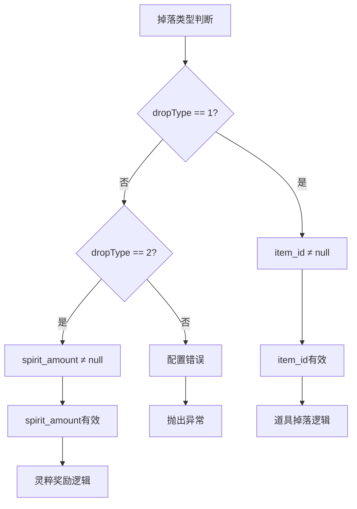
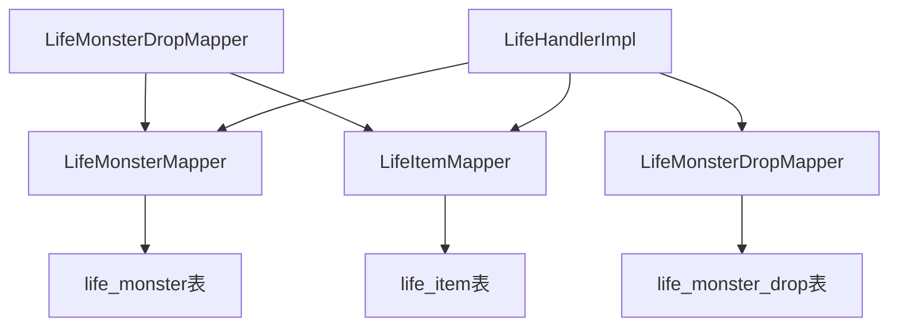

# 怪物与掉落模型

<cite>
**本文档引用的文件**
- [LifeMonster.java](file://Life/src/main/java/com/bot/life/dao/entity/LifeMonster.java)
- [LifeMonsterDrop.java](file://Life/src/main/java/com/bot/life/dao/entity/LifeMonsterDrop.java)
- [LifeMonsterMapper.xml](file://Life/src/main/resources/mapper/LifeMonsterMapper.xml)
- [LifeMonsterDropMapper.xml](file://Life/src/main/resources/mapper/LifeMonsterDropMapper.xml)
- [Life_Database_Init.sql](file://Life_Database_Init.sql)
- [LifeHandlerImpl.java](file://Life/src/main/java/com/bot/life/service/impl/LifeHandlerImpl.java)
- [WorldBossServiceImpl.java](file://Life/src/main/java/com/bot/life/service/impl/WorldBossServiceImpl.java)
- [BattleServiceImpl.java](file://Life/src/main/java/com/bot/life/service/impl/BattleServiceImpl.java)
- [ExplorationServiceImpl.java](file://Life/src/main/java/com/bot/life/service/impl/ExplorationServiceImpl.java)
</cite>

## 目录
1. [概述](#概述)
2. [项目结构](#项目结构)
3. [核心组件](#核心组件)
4. [架构概览](#架构概览)
5. [详细组件分析](#详细组件分析)
6. [依赖关系分析](#依赖关系分析)
7. [性能考虑](#性能考虑)
8. [故障排除指南](#故障排除指南)
9. [结论](#结论)

## 概述

浮生卷游戏采用了一套完整的怪物与掉落系统，通过两个核心实体类`LifeMonster`和`LifeMonsterDrop`构建了丰富的战斗和奖励机制。该系统支持三种类型的怪物（普通怪物、副本BOSS、世界BOSS），并实现了基于概率的复杂掉落机制，包括道具掉落和灵粹奖励。

## 项目结构

**图表来源**
- [LifeMonster.java](file://Life/src/main/java/com/bot/life/dao/entity/LifeMonster.java#L1-L32)
- [LifeMonsterDrop.java](file://Life/src/main/java/com/bot/life/dao/entity/LifeMonsterDrop.java#L1-L28)

## 核心组件

### LifeMonster 怪物实体

`LifeMonster`类定义了怪物的基本属性和战斗能力，是整个战斗系统的核心数据结构。

#### 主要属性设计

| 属性名 | 类型 | 描述 | 设计原则 |
|--------|------|------|----------|
| id | Long | 怪物唯一标识 | 数据库自增主键 |
| name | String | 怪物名称 | 用户可见标识符 |
| mapId | Long | 所在地图ID | 地图关联索引 |
| monsterType | Integer | 怪物类型 | 1普通2副本BOSS3世界BOSS |
| attribute | Integer | 怪物属性 | 0无属性1金2木3水4火5土 |
| level | Integer | 怪物等级 | 影响基础属性计算 |
| health | Integer | 血量 | 基础战斗属性 |
| attackPower | Integer | 攻击力 | 基础战斗属性 |
| defense | Integer | 防御力 | 基础战斗属性 |
| speed | Integer | 速度 | 决定战斗出手顺序 |
| criticalRate | BigDecimal | 会心率 | 暴击概率 |
| criticalDamage | BigDecimal | 会心效果 | 暴击伤害倍率 |
| armorBreak | BigDecimal | 破防 | 破防能力 |

#### 怪物类型设计原理

`monsterType`字段的设计体现了游戏的分层战斗体系：

- **普通怪物（1）**：基础战斗单位，用于日常探索和训练
- **副本BOSS（2）**：特定场景的强力敌人，提供高价值奖励
- **世界BOSS（3）**：全服竞争的顶级挑战，具有特殊的活动机制

**章节来源**
- [LifeMonster.java](file://Life/src/main/java/com/bot/life/dao/entity/LifeMonster.java#L14-L31)

### LifeMonsterDrop 掉落配置实体

`LifeMonsterDrop`类负责管理怪物的掉落物品配置，实现了灵活的概率化奖励系统。

#### 掉落配置属性

| 属性名 | 类型 | 描述 | 互斥关系 |
|--------|------|------|----------|
| id | Long | 掉落配置唯一标识 | 主键 |
| monsterId | Long | 关联的怪物ID | 外键约束 |
| dropType | Integer | 掉落类型 | 1道具2灵粹 |
| itemId | Long | 道具ID | dropType=1时有效 |
| spiritAmount | Integer | 灵粹数量 | dropType=2时有效 |
| dropRate | BigDecimal | 掉落概率 | 0-1范围 |
| minQuantity | Integer | 最小掉落数量 | 数量随机化 |
| maxQuantity | Integer | 最大掉落数量 | 数量随机化 |

#### 掉落机制设计

**图表来源**
- [LifeHandlerImpl.java](file://Life/src/main/java/com/bot/life/service/impl/LifeHandlerImpl.java#L1692-L1733)

**章节来源**
- [LifeMonsterDrop.java](file://Life/src/main/java/com/bot/life/dao/entity/LifeMonsterDrop.java#L14-L27)

## 架构概览

**图表来源**
- [LifeMonster.java](file://Life/src/main/java/com/bot/life/dao/entity/LifeMonster.java#L12-L31)
- [LifeMonsterDrop.java](file://Life/src/main/java/com/bot/life/dao/entity/LifeMonsterDrop.java#L12-L27)
- [LifeHandlerImpl.java](file://Life/src/main/java/com/bot/life/service/impl/LifeHandlerImpl.java#L1692-L1733)

## 详细组件分析

### 怪物战斗属性系统

#### 属性计算机制

怪物的基础战斗属性通过以下公式计算：

#### 属性相克系统

游戏实现了五行相生相克的战斗平衡机制：

| 攻击属性 | 克制属性 | 被克制属性 | 效果倍率 |
|----------|----------|------------|----------|
| 金 | 木 | 水 | 1.2倍伤害 |
| 木 | 水 | 火 | 1.2倍伤害 |
| 水 | 火 | 土 | 1.2倍伤害 |
| 火 | 土 | 金 | 1.2倍伤害 |
| 土 | 金 | 木 | 1.2倍伤害 |

**章节来源**
- [BattleServiceImpl.java](file://Life/src/main/java/com/bot/life/service/impl/BattleServiceImpl.java#L118-L136)

### 掉落系统深度分析

#### 概率计算算法

掉落系统采用独立事件概率计算，每个掉落项独立判断是否触发：

**图表来源**
- [LifeHandlerImpl.java](file://Life/src/main/java/com/bot/life/service/impl/LifeHandlerImpl.java#L1692-L1733)

#### 复合掉落机制

一个怪物可以配置多个掉落项，实现复杂的奖励组合：

| 怪物 | 掉落配置示例 | 掉落概率 | 奖励内容 |
|------|-------------|----------|----------|
| 野狼 | 回春丹 | 15% | 1个回春丹 |
| | 大还丹 | 20% | 1-2个大还丹 |
| | 灵粹 | 50% | 10灵粹 |
| 山贼 | 中修为丹 | 10% | 1个中修为丹 |
| | 金元斩秘籍 | 5% | 1个金元斩秘籍 |
| | 灵粹 | 60% | 30灵粹 |

**章节来源**
- [Life_Database_Init.sql](file://Life_Database_Init.sql#L409-L434)

### 世界BOSS特殊处理

#### BOSS挑战流程

#### 世界BOSS奖励机制

世界BOSS根据玩家造成的伤害量分配不同等级的奖励：

| 伤害区间 | 奖励等级 | 灵粹奖励 | 道具奖励 |
|----------|----------|----------|----------|
| 0-1000 | 初级 | 50 | 小修为丹×1 |
| 1001-3000 | 中级 | 100 | 小修为丹×2+回春丹×1 |
| ≥3001 | 高级 | 200 | 小修为丹×3+回春丹×2+大力丸×1 |

**章节来源**
- [WorldBossServiceImpl.java](file://Life/src/main/java/com/bot/life/service/impl/WorldBossServiceImpl.java#L77-L118)

### 掉落互斥关系处理

#### item_id 和 spirit_amount 的互斥设计

在`LifeMonsterDrop`实体中，`item_id`和`spirit_amount`字段采用互斥关系设计：

这种设计确保了：
- 每个掉落配置只能是道具或灵粹中的一种
- 数据库约束保证了配置的正确性
- 业务逻辑清晰，避免混淆

**章节来源**
- [LifeMonsterDrop.java](file://Life/src/main/java/com/bot/life/dao/entity/LifeMonsterDrop.java#L16-L19)

## 依赖关系分析

### 数据层依赖

**图表来源**
- [LifeMonsterMapper.xml](file://Life/src/main/resources/mapper/LifeMonsterMapper.xml#L5-L20)
- [LifeMonsterDropMapper.xml](file://Life/src/main/resources/mapper/LifeMonsterDropMapper.xml#L5-L15)

### 服务层依赖

| 服务类 | 依赖的服务 | 用途 |
|--------|------------|------|
| LifeHandlerImpl | LifeMonsterDropMapper | 处理怪物掉落 |
| LifeHandlerImpl | BattleService | 管理战斗流程 |
| WorldBossServiceImpl | LifeMonsterMapper | 获取BOSS信息 |
| WorldBossServiceImpl | LifeWorldBossMapper | 管理世界BOSS配置 |

**章节来源**
- [LifeHandlerImpl.java](file://Life/src/main/java/com/bot/life/service/impl/LifeHandlerImpl.java#L52-L126)

## 性能考虑

### 掉落概率优化

1. **随机数生成优化**：使用Java原生Random类，避免频繁的随机数生成开销
2. **掉落配置缓存**：建议将常用的掉落配置缓存在内存中，减少数据库查询
3. **批量处理**：对于大量掉落项，采用批量插入的方式提高效率

### 怪物属性计算优化

1. **预计算机制**：怪物的基础属性可以在创建时预计算，避免运行时重复计算
2. **属性缓存**：将计算后的属性值缓存，减少重复计算
3. **批量查询**：在批量处理怪物时，采用批量查询减少数据库交互

## 故障排除指南

### 常见问题及解决方案

#### 掉落系统问题

| 问题描述 | 可能原因 | 解决方案 |
|----------|----------|----------|
| 怪物不掉落任何物品 | 掉落配置缺失或概率为0 | 检查life_monster_drop表配置 |
| 掉落概率异常 | dropRate设置错误 | 验证概率值在0-1范围内 |
| 道具掉落数量异常 | min_quantity > max_quantity | 调整数量范围配置 |
| 灵粹奖励不正确 | spirit_amount配置错误 | 检查灵粹奖励配置 |

#### 怪物战斗问题

| 问题描述 | 可能原因 | 解决方案 |
|----------|----------|----------|
| 怪物属性计算错误 | 基础属性或成长系数配置错误 | 检查怪物基础属性配置 |
| 属性相克效果异常 | 属性克制关系配置错误 | 验证五行相克关系 |
| 战斗速度判定错误 | 速度属性计算异常 | 检查速度属性值 |

**章节来源**
- [BattleServiceImpl.java](file://Life/src/main/java/com/bot/life/service/impl/BattleServiceImpl.java#L148-L161)

### 调试建议

1. **日志记录**：在关键节点添加详细的日志记录
2. **单元测试**：为掉落概率计算和战斗属性计算编写单元测试
3. **数据验证**：定期验证数据库配置的正确性

## 结论

浮生卷的怪物与掉落模型展现了精心设计的游戏系统架构。通过`LifeMonster`和`LifeMonsterDrop`两个核心实体，系统实现了从基础战斗到复杂奖励的完整闭环。

### 设计亮点

1. **模块化设计**：清晰的职责分离，便于维护和扩展
2. **灵活的概率系统**：支持复杂的掉落组合和奖励机制
3. **性能优化**：合理的数据结构和算法设计
4. **扩展性强**：易于添加新的怪物类型和掉落物品

### 未来改进方向

1. **掉落权重系统**：引入掉落权重概念，实现更精细的概率控制
2. **动态掉落调整**：根据玩家行为动态调整掉落概率
3. **掉落追踪系统**：记录玩家的掉落历史，提供个性化奖励
4. **掉落概率可视化**：为管理员提供掉落配置的可视化界面

这套怪物与掉落系统为游戏提供了丰富的玩法基础，是构建完整游戏生态的重要组成部分。