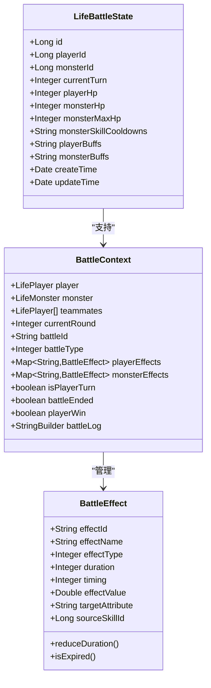
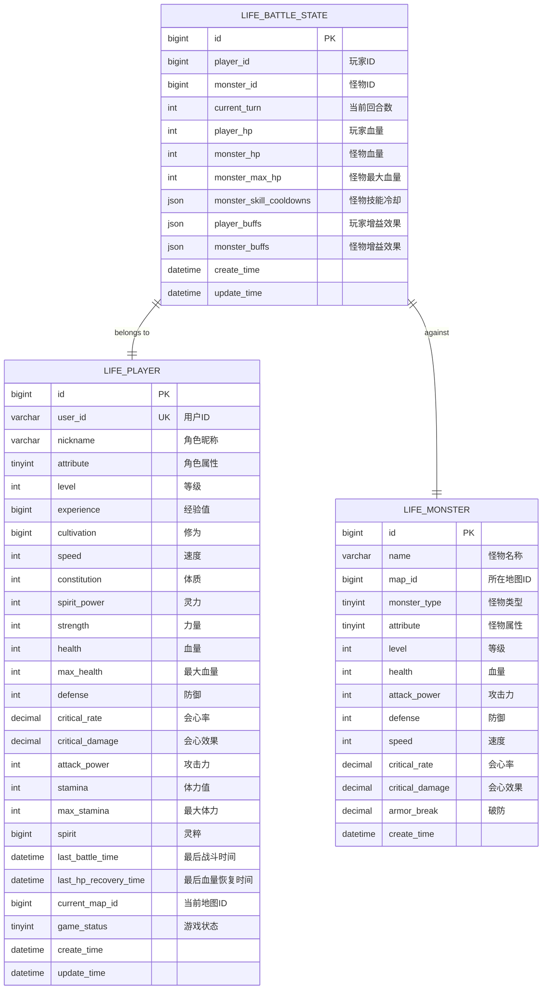
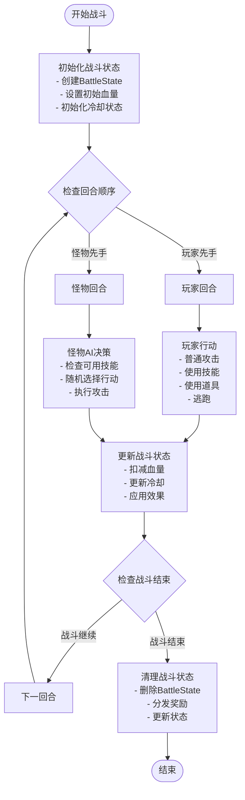
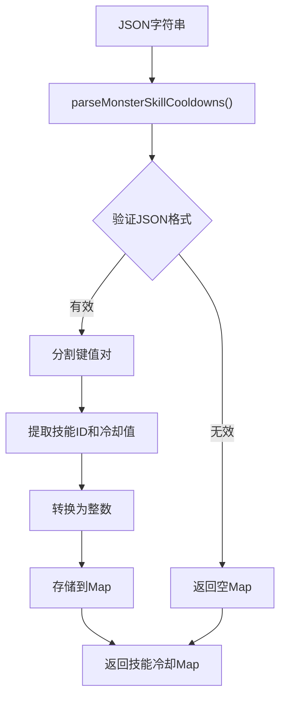
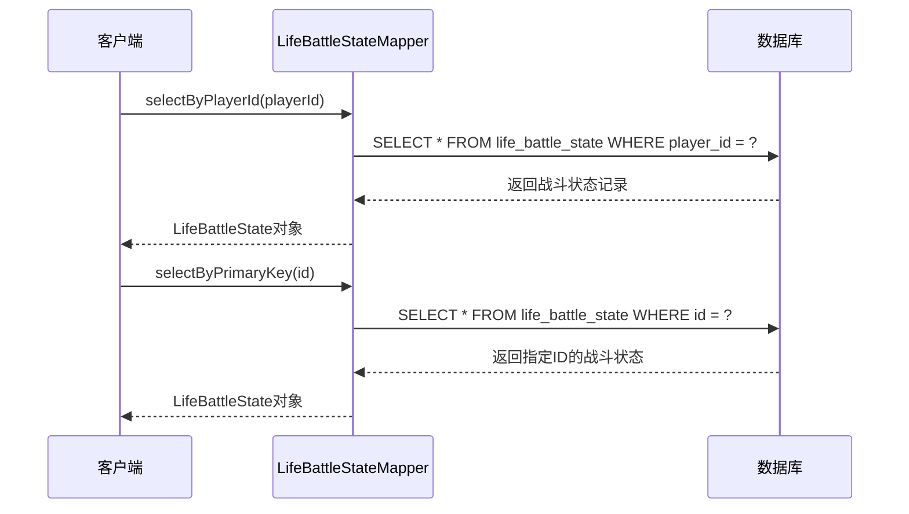
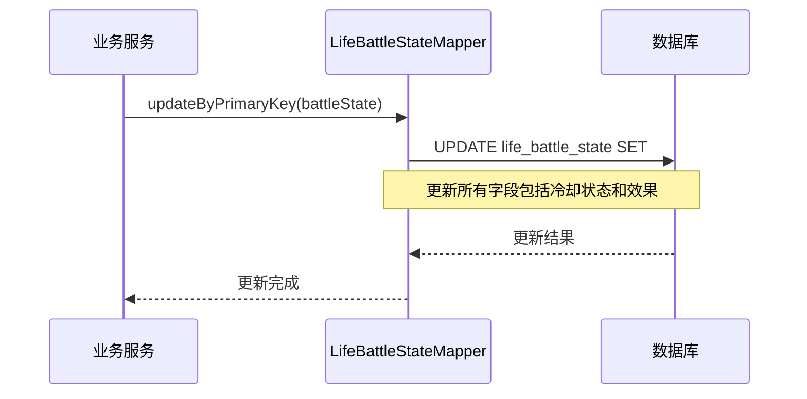
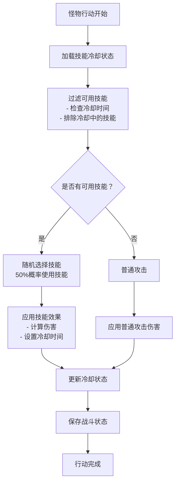

# 战斗状态模型

<cite>
**本文档引用的文件**
- [LifeBattleState.java](file://Life/src/main/java/com/bot/life/dao/entity/LifeBattleState.java)
- [LifeBattleStateMapper.xml](file://Life/src/main/resources/mapper/LifeBattleStateMapper.xml)
- [Life_Database_Init.sql](file://Life_Database_Init.sql)
- [LifeHandlerImpl.java](file://Life/src/main/java/com/bot/life/service/impl/LifeHandlerImpl.java)
- [BattleContext.java](file://Life/src/main/java/com/bot/life/dto/BattleContext.java)
- [BattleEffect.java](file://Life/src/main/java/com/bot/life/dto/BattleEffect.java)
- [BattleServiceImpl.java](file://Life/src/main/java/com/bot/life/service/impl/BattleServiceImpl.java)
</cite>

## 目录
1. [简介](#简介)
2. [核心实体设计](#核心实体设计)
3. [数据库架构分析](#数据库架构分析)
4. [战斗状态管理机制](#战斗状态管理机制)
5. [JSON字段设计原理](#json字段设计原理)
6. [MyBatis映射分析](#mybatis映射分析)
7. [业务逻辑实现](#业务逻辑实现)
8. [性能优化建议](#性能优化建议)
9. [总结](#总结)

## 简介

战斗状态模型是浮生卷游戏系统中的核心组件，负责管理玩家与怪物之间的战斗过程。该模型通过LifeBattleState实体类和相关数据库表结构，实现了复杂的战斗状态跟踪、技能冷却管理和增益/减益效果的持久化存储。

## 核心实体设计

### LifeBattleState实体结构

LifeBattleState是战斗状态的核心数据载体，包含以下关键字段：



**图表来源**
- [LifeBattleState.java](file://Life/src/main/java/com/bot/life/dao/entity/LifeBattleState.java#L10-L24)
- [BattleContext.java](file://Life/src/main/java/com/bot/life/dto/BattleContext.java#L14-L54)
- [BattleEffect.java](file://Life/src/main/java/com/bot/life/dto/BattleEffect.java#L10-L35)

### 关键字段详解

| 字段名 | 类型 | 描述 | 业务意义 |
|--------|------|------|----------|
| playerId | Long | 玩家唯一标识 | 建立玩家与战斗状态的一对一关系 |
| monsterId | Long | 怪物唯一标识 | 确定当前战斗的对手 |
| currentTurn | Integer | 当前回合数 | 记录战斗进程，影响技能冷却和效果持续 |
| playerHp | Integer | 玩家当前血量 | 实时反映玩家战斗状态 |
| monsterHp | Integer | 怪物当前血量 | 实时反映怪物战斗状态 |
| monsterMaxHp | Integer | 怪物最大血量 | 用于计算血量百分比和显示 |
| monsterSkillCooldowns | String | 怪物技能冷却状态（JSON格式） | 存储怪物技能的冷却信息 |
| playerBuffs | String | 玩家buff状态（JSON格式） | 存储玩家获得的各种增益效果 |
| monsterBuffs | String | 怪物buff状态（JSON格式） | 存储怪物获得的各种增益效果 |

**节来源**
- [LifeBattleState.java](file://Life/src/main/java/com/bot/life/dao/entity/LifeBattleState.java#L12-L21)

## 数据库架构分析

### 表结构设计

根据数据库初始化脚本，战斗状态表的完整定义如下：



**图表来源**
- [Life_Database_Init.sql](file://Life_Database_Init.sql#L599-L616)

### 约束设计

数据库层面的关键约束包括：

1. **UNIQUE KEY uk_player_battle**：确保每个玩家最多存在一个战斗记录
2. **PRIMARY KEY**：自增主键保证记录唯一性
3. **索引优化**：
   - `idx_player_id`：加速按玩家查询战斗状态
   - `uk_player_battle`：防止重复战斗记录

**节来源**
- [Life_Database_Init.sql](file://Life_Database_Init.sql#L613-L615)

## 战斗状态管理机制

### 战斗流程控制

战斗状态管理遵循严格的流程控制机制：



**图表来源**
- [LifeHandlerImpl.java](file://Life/src/main/java/com/bot/life/service/impl/LifeHandlerImpl.java#L1574-L1631)
- [BattleServiceImpl.java](file://Life/src/main/java/com/bot/life/service/impl/BattleServiceImpl.java#L41-L104)

### 回合管理系统

战斗状态中的回合管理机制：

1. **当前回合数(currentTurn)**：从1开始递增，记录战斗进程
2. **冷却机制**：基于回合数管理技能冷却和效果持续时间
3. **状态同步**：每回合结束后同步所有战斗状态到数据库

**节来源**
- [LifeHandlerImpl.java](file://Life/src/main/java/com/bot/life/service/impl/LifeHandlerImpl.java#L1831-L1834)

## JSON字段设计原理

### monster_skill_cooldowns字段

该字段采用JSON格式存储怪物技能的冷却状态，具有以下特点：

#### 设计优势

1. **灵活性**：支持动态添加和删除技能冷却
2. **扩展性**：易于添加新的冷却机制
3. **查询效率**：单字段存储，减少查询复杂度

#### 存储格式示例

```json
{
  "1": 3,      // 技能ID 1，剩余冷却3回合
  "2": 0,      // 技能ID 2，可使用
  "5": 2       // 技能ID 5，剩余冷却2回合
}
```

#### 解析机制

系统提供了专门的解析方法：



**图表来源**
- [LifeHandlerImpl.java](file://Life/src/main/java/com/bot/life/service/impl/LifeHandlerImpl.java#L1637-L1656)

### playerBuffs和monsterBuffs字段

这两个字段同样采用JSON格式存储战斗效果，支持：

1. **增益效果**：提升攻击力、防御力、速度等属性
2. **减益效果**：降低敌方属性或施加负面状态
3. **持续效果**：指定持续回合数的效果

#### 效果类型分类

| 效果类型 | 数值范围 | 描述 |
|----------|----------|------|
| 1 | 攻击力变化 | 直接修改攻击力数值 |
| 2 | 属性变化 | 修改特定属性百分比 |
| 3 | 持续效果 | 多回合生效的被动效果 |

**节来源**
- [BattleEffect.java](file://Life/src/main/java/com/bot/life/dto/BattleEffect.java#L11-L18)

## MyBatis映射分析

### 核心SQL操作

MyBatis映射文件提供了完整的CRUD操作支持：

#### 查询操作



**图表来源**
- [LifeBattleStateMapper.xml](file://Life/src/main/resources/mapper/LifeBattleStateMapper.xml#L32-L37)
- [LifeBattleStateMapper.xml](file://Life/src/main/resources/mapper/LifeBattleStateMapper.xml#L25-L30)

#### 更新操作



**图表来源**
- [LifeBattleStateMapper.xml](file://Life/src/main/resources/mapper/LifeBattleStateMapper.xml#L59-L73)

### SQL语句执行流程

关键SQL语句的执行流程分析：

1. **selectByPlayerId**：按玩家ID查询战斗状态，用于判断玩家是否处于战斗中
2. **updateByPrimaryKey**：更新完整的战斗状态，包括血量、冷却状态和效果
3. **insert**：创建新的战斗状态记录
4. **deleteByPlayerId**：清理战斗状态，通常在战斗结束后调用

**节来源**
- [LifeBattleStateMapper.xml](file://Life/src/main/resources/mapper/LifeBattleStateMapper.xml#L32-L47)

## 业务逻辑实现

### 怪物技能冷却管理

怪物的智能行为依赖于技能冷却系统的精确管理：



**图表来源**
- [LifeHandlerImpl.java](file://Life/src/main/java/com/bot/life/service/impl/LifeHandlerImpl.java#L1583-L1631)

### 状态更新机制

战斗状态的实时更新遵循以下原则：

1. **原子性**：每次更新都是原子操作，确保数据一致性
2. **及时性**：战斗状态变更立即写入数据库
3. **完整性**：更新时包含所有相关状态信息

**节来源**
- [LifeHandlerImpl.java](file://Life/src/main/java/com/bot/life/service/impl/LifeHandlerImpl.java#L1831-L1834)

## 性能优化建议

### 数据库层面优化

1. **索引优化**
   - 确保`player_id`字段有适当索引
   - 考虑为`update_time`字段添加索引以支持批量清理

2. **连接池配置**
   - 合理配置数据库连接池大小
   - 设置合适的超时时间和重试策略

3. **事务管理**
   - 战斗状态更新应使用适当的事务隔离级别
   - 避免长时间持有数据库连接

### 应用层面优化

1. **缓存策略**
   - 对频繁访问的战斗状态进行缓存
   - 使用Redis等内存数据库存储活跃战斗状态

2. **异步处理**
   - 将非关键的状态更新操作异步化
   - 使用消息队列处理战斗结果统计

3. **JSON处理优化**
   - 考虑使用专业的JSON库替代简单的字符串解析
   - 对JSON数据进行压缩存储

### 监控和维护

1. **性能监控**
   - 监控数据库查询响应时间
   - 跟踪战斗状态表的增长趋势

2. **定期清理**
   - 实施定期清理机制，删除过期的战斗状态记录
   - 设置合理的保留期限

## 总结

战斗状态模型通过LifeBattleState实体和相关组件，构建了一个完整而灵活的战斗管理系统。其主要特点包括：

1. **简洁高效**：通过单一实体管理复杂的战斗状态
2. **灵活扩展**：JSON字段设计支持各种战斗效果的动态存储
3. **业务清晰**：明确的职责分工和清晰的流程控制
4. **性能可靠**：合理的数据库设计和MyBatis映射保证了系统性能

该模型为浮生卷游戏的战斗系统提供了坚实的基础，支持复杂的战斗逻辑和丰富的游戏体验。通过持续的优化和改进，能够满足日益增长的游戏需求。