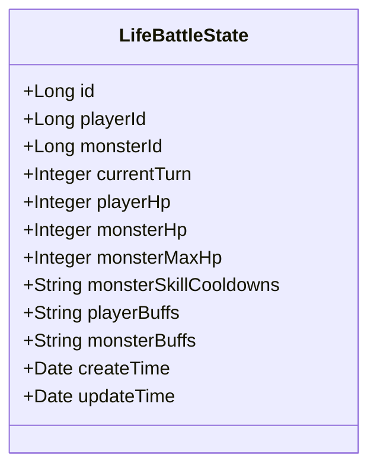
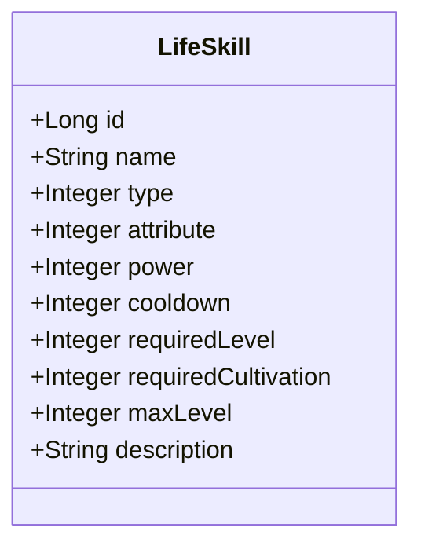
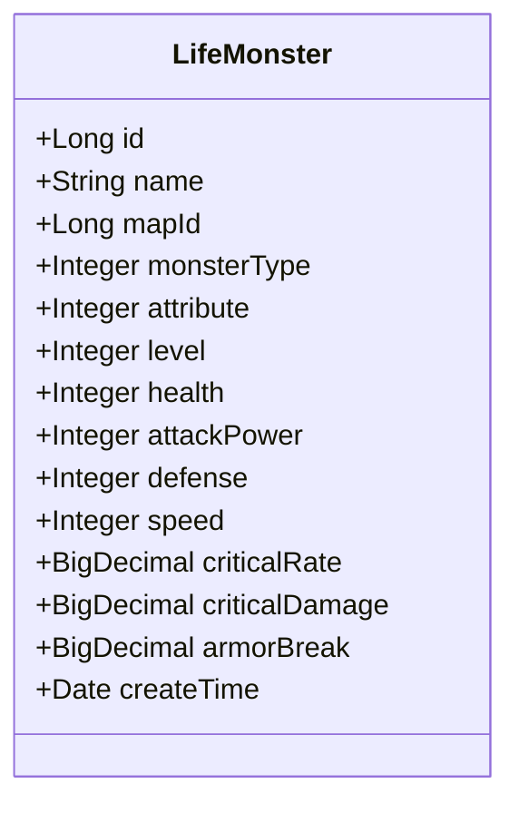
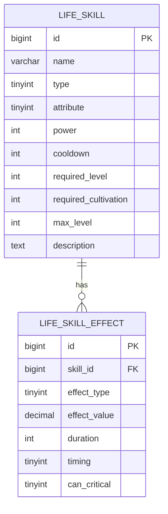
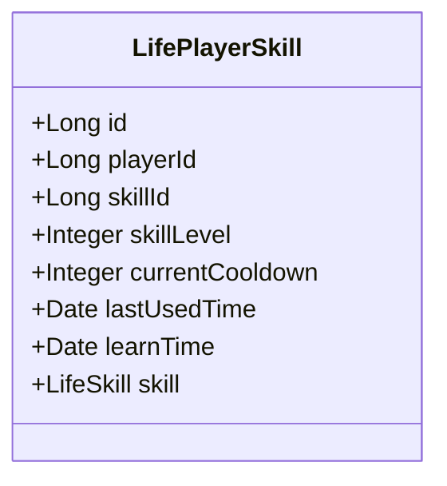
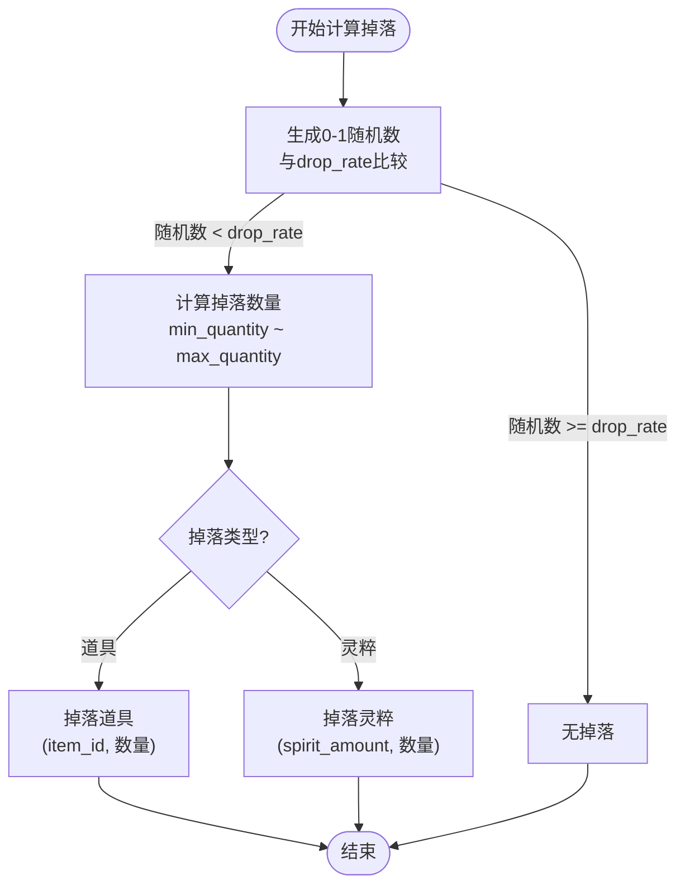
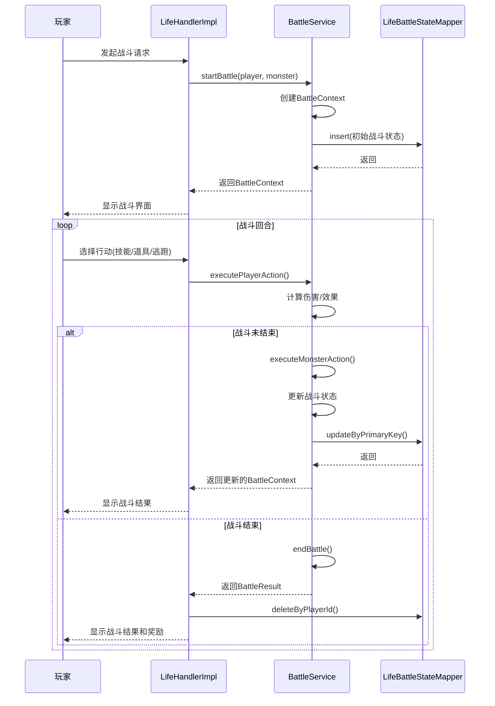

# 战斗系统数据模型

<cite>
**本文档引用文件**  
- [Life_Database_Init.sql](file://Life_Database_Init.sql)
- [LifeBattleState.java](file://Life/src/main/java/com/bot/life/dao/entity/LifeBattleState.java)
- [LifeSkill.java](file://Life/src/main/java/com/bot/life/dao/entity/LifeSkill.java)
- [LifeMonster.java](file://Life/src/main/java/com/bot/life/dao/entity/LifeMonster.java)
- [LifeMonsterDrop.java](file://Life/src/main/java/com/bot/life/dao/entity/LifeMonsterDrop.java)
- [LifePlayerSkill.java](file://Life/src/main/java/com/bot/life/dao/entity/LifePlayerSkill.java)
- [BattleService.java](file://Life/src/main/java/com/bot/life/service/BattleService.java)
- [BattleContext.java](file://Life/src/main/java/com/bot/life/dto/BattleContext.java)
- [ENSkillType.java](file://Life/src/main/java/com/bot/life/enums/ENSkillType.java)
- [LifeBattleStateMapper.java](file://Life/src/main/java/com/bot/life/dao/mapper/LifeBattleStateMapper.java)
</cite>

## 目录
1. [引言](#引言)
2. [核心实体设计](#核心实体设计)
3. [战斗状态管理](#战斗状态管理)
4. [技能系统](#技能系统)
5. [怪物配置](#怪物配置)
6. [战斗流程时序图](#战斗流程时序图)
7. [状态转换图](#状态转换图)

## 引言
本文档全面解析《浮生卷》游戏战斗系统的核心数据模型，重点阐述LifeBattleState、LifeSkill和LifeMonster等核心实体的设计原理。通过分析数据库表结构、实体类定义和相关服务接口，深入探讨战斗状态管理、技能系统和怪物配置的数据结构设计。文档结合DDL语句解释JSON字段的设计原理，并提供战斗流程的时序图和状态转换图，为系统维护和功能扩展提供完整的技术参考。

## 核心实体设计

### LifeBattleState 实体
`LifeBattleState` 实体用于持久化存储战斗过程中的关键状态信息，确保战斗过程的可恢复性和一致性。该实体通过数据库表 `life_battle_state` 进行存储，其核心字段包括战斗双方的当前血量、当前回合数以及技能冷却和增益状态。



**图源**  
- [LifeBattleState.java](file://Life/src/main/java/com/bot/life/dao/entity/LifeBattleState.java)

### LifeSkill 实体
`LifeSkill` 实体定义了游戏中所有技能的基础属性，是技能系统的核心数据结构。它与 `life_skill` 表相对应，存储技能的名称、类型、威力、冷却时间等基本信息。



**图源**  
- [LifeSkill.java](file://Life/src/main/java/com/bot/life/dao/entity/LifeSkill.java)

### LifeMonster 实体
`LifeMonster` 实体表示游戏中的怪物角色，包含其基础属性和战斗属性。该实体与 `life_monster` 表相对应，是战斗系统中敌方单位的数据基础。



**图源**  
- [LifeMonster.java](file://Life/src/main/java/com/bot/life/dao/entity/LifeMonster.java)

**本节源码**  
- [LifeBattleState.java](file://Life/src/main/java/com/bot/life/dao/entity/LifeBattleState.java#L1-L25)
- [LifeSkill.java](file://Life/src/main/java/com/bot/life/dao/entity/LifeSkill.java#L1-L24)
- [LifeMonster.java](file://Life/src/main/java/com/bot/life/dao/entity/LifeMonster.java#L1-L32)

## 战斗状态管理

### 战斗状态表设计
`life_battle_state` 表是战斗系统的核心，用于存储正在进行的战斗状态。其设计充分利用了JSON字段来存储复杂的状态信息，避免了频繁的数据库读写操作。

```sql
CREATE TABLE IF NOT EXISTS `life_battle_state` (
  `id` bigint NOT NULL AUTO_INCREMENT,
  `player_id` bigint NOT NULL COMMENT '玩家ID',
  `monster_id` bigint NOT NULL COMMENT '怪物ID',
  `current_turn` int DEFAULT 1 COMMENT '当前回合数',
  `player_hp` int NOT NULL COMMENT '玩家当前血量',
  `monster_hp` int NOT NULL COMMENT '怪物当前血量',
  `monster_max_hp` int NOT NULL COMMENT '怪物最大血量',
  `monster_skill_cooldowns` json COMMENT '怪物技能冷却状态',
  `player_buffs` json COMMENT '玩家buff状态',
  `monster_buffs` json COMMENT '怪物buff状态',
  PRIMARY KEY (`id`),
  UNIQUE KEY `uk_player_battle` (`player_id`)
) ENGINE=InnoDB DEFAULT CHARSET=utf8mb4 COMMENT='战斗状态表';
```

### JSON字段设计原理
- **monster_skill_cooldowns**: 存储怪物技能的冷却状态，格式为 `{skillId: remainingCooldown}`。使用JSON格式可以灵活地支持不同数量的技能，避免了为每个技能创建单独字段的冗余。
- **player_buffs / monster_buffs**: 存储增益/减益效果，格式为 `{effectKey: {type: effectType, value: effectValue, duration: remainingRounds}}`。这种设计支持动态添加和移除效果，便于实现复杂的战斗机制。

### 查询优化策略
- **唯一索引 `uk_player_battle`**: 确保每个玩家在同一时间只能参与一场战斗，同时通过玩家ID快速定位战斗状态。
- **主键索引 `id`**: 用于精确查询特定战斗记录。
- **JSON字段索引**: 虽然未在DDL中显式创建，但MySQL 5.7+支持对JSON字段创建虚拟列索引，可用于优化基于技能ID或效果类型的查询。

**本节源码**  
- [Life_Database_Init.sql](file://Life_Database_Init.sql#L599-L616)
- [LifeBattleState.java](file://Life/src/main/java/com/bot/life/dao/entity/LifeBattleState.java#L1-L25)

## 技能系统

### 技能基础表与效果表关联
技能系统采用基础表与效果表分离的设计模式，实现了技能属性与效果逻辑的解耦。



**图源**  
- [Life_Database_Init.sql](file://Life_Database_Init.sql#L89-L115)

### 技能类型枚举
技能类型通过 `ENSkillType` 枚举进行定义，确保类型值的统一和可维护性。

```java
public enum ENSkillType {
    DIRECT_DAMAGE(1, "直接伤害类"),
    BUFF(2, "增益类"),
    DEBUFF(3, "减益类");
    // ...
}
```

### 玩家技能管理
`LifePlayerSkill` 实体记录了玩家已学习的技能及其状态，包括当前等级和冷却时间。



**图源**  
- [LifePlayerSkill.java](file://Life/src/main/java/com/bot/life/dao/entity/LifePlayerSkill.java)

**本节源码**  
- [Life_Database_Init.sql](file://Life_Database_Init.sql#L89-L115)
- [LifeSkill.java](file://Life/src/main/java/com/bot/life/dao/entity/LifeSkill.java#L1-L24)
- [ENSkillType.java](file://Life/src/main/java/com/bot/life/enums/ENSkillType.java#L1-L37)
- [LifePlayerSkill.java](file://Life/src/main/java/com/bot/life/dao/entity/LifePlayerSkill.java#L1-L24)

## 怪物配置

### 怪物掉落概率机制
`life_monster_drop` 表定义了怪物的掉落规则，其概率计算机制如下：



**图源**  
- [LifeMonsterDrop.java](file://Life/src/main/java/com/bot/life/dao/entity/LifeMonsterDrop.java)

### 怪物技能配置
怪物技能通过 `life_monster_skill` 关联表进行配置，实现了怪物与技能的多对多关系。

```sql
CREATE TABLE IF NOT EXISTS `life_monster_skill` (
  `id` bigint NOT NULL AUTO_INCREMENT,
  `monster_id` bigint NOT NULL COMMENT '怪物ID',
  `skill_id` bigint NOT NULL COMMENT '技能ID',
  PRIMARY KEY (`id`),
  KEY `idx_monster_id` (`monster_id`)
) ENGINE=InnoDB DEFAULT CHARSET=utf8mb4 COMMENT='怪物技能表';
```

**本节源码**  
- [Life_Database_Init.sql](file://Life_Database_Init.sql#L164-L185)
- [LifeMonsterDrop.java](file://Life/src/main/java/com/bot/life/dao/entity/LifeMonsterDrop.java#L1-L28)

## 战斗流程时序图



**图源**  
- [BattleService.java](file://Life/src/main/java/com/bot/life/service/BattleService.java#L1-L80)
- [BattleContext.java](file://Life/src/main/java/com/bot/life/dto/BattleContext.java#L1-L55)
- [LifeBattleStateMapper.java](file://Life/src/main/java/com/bot/life/dao/mapper/LifeBattleStateMapper.java#L1-L26)

## 状态转换图

```mermaid
stateDiagram-v2
[*] --> Idle
Idle --> BattlePreparation : 玩家发起战斗
BattlePreparation --> PlayerTurn : 战斗开始
PlayerTurn --> MonsterTurn : 玩家行动完成
MonsterTurn --> PlayerTurn : 怪物行动完成
PlayerTurn --> BattleEnd : 玩家获胜或逃跑成功
MonsterTurn --> BattleEnd : 玩家失败
BattleEnd --> Idle : 战斗结束清理
state BattlePreparation {
[*] --> CreateBattleContext
CreateBattleContext --> SaveBattleState
SaveBattleState --> NotifyPlayer
NotifyPlayer --> PlayerTurn
}
state PlayerTurn {
[*] --> WaitForInput
WaitForInput --> ExecuteAction : 玩家选择行动
ExecuteAction --> CheckBattleEnd : 检查战斗是否结束
CheckBattleEnd --> MonsterTurn : 否
CheckBattleEnd --> BattleEnd : 是
}
state MonsterTurn {
[*] --> SelectAction
SelectAction --> ExecuteAction
ExecuteAction --> UpdateState
UpdateState --> CheckBattleEnd
CheckBattleEnd --> PlayerTurn : 否
CheckBattleEnd --> BattleEnd : 是
}
state BattleEnd {
[*] --> CalculateRewards
CalculateRewards --> DistributeRewards
DistributeRewards --> Cleanup
Cleanup --> Idle
}
```

**图源**  
- [BattleService.java](file://Life/src/main/java/com/bot/life/service/BattleService.java#L1-L80)
- [LifeHandlerImpl.java](file://Life/src/main/java/com/bot/life/service/impl/LifeHandlerImpl.java)