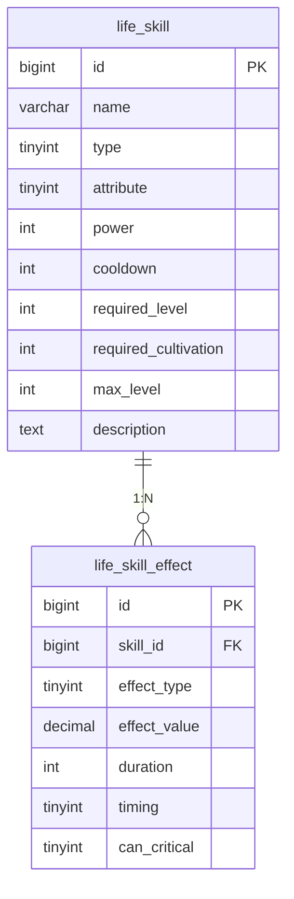
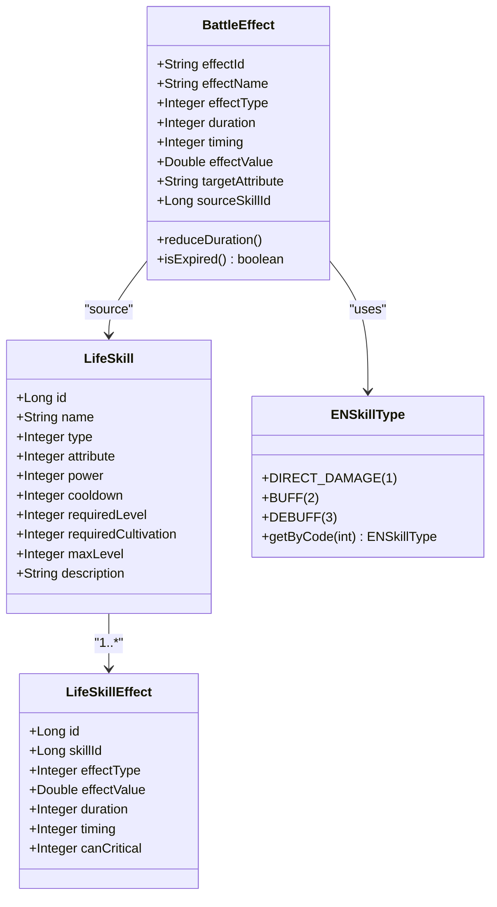

# 技能系统模型

<cite>
**本文档引用文件**  
- [LifeSkill.java](file://Life\src\main\java\com\bot\life\dao\entity\LifeSkill.java)
- [LifeSkillMapper.xml](file://Life\src\main\resources\mapper\LifeSkillMapper.xml)
- [Life_Database_Init.sql](file://Life_Database_Init.sql)
- [BattleEffect.java](file://Life\src\main\java\com\bot\life\dto\BattleEffect.java)
- [ENSkillType.java](file://Life\src\main\java\com\bot\life\enums\ENSkillType.java)
</cite>

## 目录
1. [技能系统概述](#技能系统概述)
2. [核心数据表设计](#核心数据表设计)
3. [LifeSkill实体字段解析](#lifeskill实体字段解析)
4. [技能效果表结构分析](#技能效果表结构分析)
5. [技能与效果的1:N关系设计](#技能与效果的1n关系设计)
6. [技能学习与升级机制](#技能学习与升级机制)
7. [技能系统类图](#技能系统类图)
8. [技能配置示例分析](#技能配置示例分析)

## 技能系统概述

浮生卷游戏的技能系统采用基础表与效果表分离的设计模式，通过`life_skill`基础表定义技能的基本属性，通过`life_skill_effect`效果表实现复杂的技能效果配置。这种设计实现了技能数据与技能逻辑的解耦，支持多段伤害、状态增益和持续效果等复杂技能机制的灵活配置。

## 核心数据表设计

技能系统主要由两个核心数据表构成：`life_skill`（技能基础表）和`life_skill_effect`（技能效果表）。这两张表通过外键关联，形成1:N的关系结构，支持一个技能配置多个效果。



**图表来源**  
- [Life_Database_Init.sql](file://Life_Database_Init.sql#L89-L115)

## LifeSkill实体字段解析

`LifeSkill`实体类定义了技能的核心属性，这些属性在数据库中对应`life_skill`表的字段。

### 技能类型（type）

技能类型字段定义了技能的基本行为模式，使用枚举值区分不同类型的技能：

| 类型值 | 类型名称 | 业务含义 |
|--------|--------|---------|
| 1 | 直接伤害 | 对目标造成直接伤害的攻击技能 |
| 2 | 增益 | 为自身或队友提供属性增益的状态技能 |
| 3 | 减益 | 降低敌人属性或造成负面状态的控制技能 |

```java
// ENSkillType.java 枚举定义
public enum ENSkillType {
    DIRECT_DAMAGE(1, "直接伤害类"),
    BUFF(2, "增益类"),
    DEBUFF(3, "减益类");
}
```

### 技能属性（attribute）

技能属性字段定义了技能的五行属性，支持属性相克机制：

| 属性值 | 属性名称 | 业务含义 |
|--------|--------|---------|
| 0 | 无属性 | 不参与属性相克计算 |
| 1 | 金 | 克木，被火克 |
| 2 | 木 | 克土，被金克 |
| 3 | 水 | 克火，被土克 |
| 4 | 火 | 克金，被水克 |
| 5 | 土 | 克水，被木克 |

### 威力（power）与冷却时间（cooldown）

- **威力（power）**：表示技能的基础伤害倍率或效果强度。对于直接伤害技能，威力直接影响最终伤害计算；对于增益/减益技能，威力可能影响属性增益的数值。
- **冷却时间（cooldown）**：表示技能使用后需要等待的回合数才能再次使用，单位为"回合"而非秒，符合回合制战斗系统的特性。

**本节来源**  
- [LifeSkill.java](file://Life\src\main\java\com\bot\life\dao\entity\LifeSkill.java#L15-L18)
- [ENSkillType.java](file://Life\src\main\java\com\bot\life\enums\ENSkillType.java#L7-L10)

## 技能效果表结构分析

`life_skill_effect`表是技能系统的核心，通过灵活的效果配置实现复杂的技能行为。

### 效果类型（effect_type）

效果类型字段定义了技能效果的具体类别：

| 类型值 | 效果类型 | 业务含义 |
|--------|--------|---------|
| 1 | 伤害倍率 | 影响技能的基础伤害计算 |
| 2 | 属性变化 | 临时或永久改变角色的某项属性 |
| 3 | 持续效果 | 在多个回合内持续生效的效果，如持续伤害或恢复 |

### 效果数值（effect_value）

效果数值字段存储效果的具体数值，其含义根据`effect_type`的不同而变化：
- 当`effect_type=1`时，表示伤害倍率的百分比值
- 当`effect_type=2`时，表示属性变化的具体数值
- 当`effect_type=3`时，表示每回合的伤害或恢复量

### 持续时间（duration）与生效时机（timing）

- **持续时间（duration）**：表示效果持续的回合数。值为0表示立即生效的一次性效果，大于0表示持续性效果。
- **生效时机（timing）**：定义效果在回合中的触发时机：
  - 1：回合开始前
  - 2：回合开始后
  - 3：回合结束时

这种设计支持复杂的战斗时序控制，如先手增益、回合结束时的持续伤害等。

**本节来源**  
- [Life_Database_Init.sql](file://Life_Database_Init.sql#L108-L111)
- [BattleEffect.java](file://Life\src\main\java\com\bot\life\dto\BattleEffect.java#L13-L15)

## 技能与效果的1:N关系设计

技能系统采用1:N的关系设计，即一个技能可以配置多个效果，这种设计具有显著优势：

### 设计优势

1. **灵活性**：单个技能可以组合多种效果，如一个攻击技能同时造成伤害和附加减益状态
2. **可扩展性**：新增效果类型无需修改基础表结构，只需扩展效果表
3. **复用性**：相同的效果配置可以应用于多个技能
4. **复杂技能支持**：支持多段伤害、连锁效果等高级技能机制

### 数据关联实现

在MyBatis映射文件中，通过关联查询实现技能与效果的数据整合：

```xml
<!-- LifeSkillMapper.xml -->
<resultMap id="BaseResultMap" type="LifeSkill">
    <id column="id" property="id" />
    <result column="name" property="name" />
    <result column="type" property="type" />
    <!-- 其他字段映射 -->
</resultMap>
```

这种设计使得技能数据的查询和管理更加高效，同时保持了数据结构的清晰性。

**本节来源**  
- [Life_Database_Init.sql](file://Life_Database_Init.sql#L89-L115)
- [LifeSkillMapper.xml](file://Life\src\main\resources\mapper\LifeSkillMapper.xml#L5-L15)

## 技能学习与升级机制

技能系统通过学习条件和升级机制控制技能的获取与成长。

### 学习条件控制

- **required_level（需要等级）**：定义学习该技能所需的玩家等级。玩家必须达到指定等级才能学习该技能，用于控制技能的解锁进度。
- **required_cultivation（需要修为）**：定义学习该技能所需的修为值。修为作为游戏内的成长资源，用于平衡技能获取的成本。

### 技能升级扩展性

- **max_level（最大等级）**：定义技能可以升级到的最高等级。技能升级通常会提升威力、降低冷却时间或增强效果，支持技能的成长性设计。
- 升级机制与`life_player_skill`表配合，记录玩家已学习技能的当前等级和冷却状态，实现个性化的技能成长路径。

这种设计既保证了技能获取的渐进性，又为玩家提供了长期的成长目标。

**本节来源**  
- [LifeSkill.java](file://Life\src\main\java\com\bot\life\dao\entity\LifeSkill.java#L19-L21)
- [Life_Database_Init.sql](file://Life_Database_Init.sql#L97-L99)

## 技能系统类图



**图表来源**  
- [LifeSkill.java](file://Life\src\main\java\com\bot\life\dao\entity\LifeSkill.java)
- [BattleEffect.java](file://Life\src\main\java\com\bot\life\dto\BattleEffect.java)
- [ENSkillType.java](file://Life\src\main\java\com\bot\life\enums\ENSkillType.java)

## 技能配置示例分析

通过`Life_Database_Init.sql`中的初始数据，我们可以分析具体技能的配置方式。

### 金元斩技能配置

```sql
INSERT INTO `life_skill` (`id`, `name`, `type`, `attribute`, `power`, `cooldown`, `required_level`, `required_cultivation`, `max_level`, `description`) 
VALUES (1, '金元斩', 1, 1, 120, 3, 1, 0, 10, '金属性基础攻击技能，挥洒金元之力对敌人造成伤害。');
```

- **技能类型**：1（直接伤害）
- **属性**：1（金）
- **威力**：120（基础伤害倍率）
- **冷却时间**：3回合
- **学习条件**：等级1，无需修为
- **最大等级**：10级

### 金刚护体技能配置

```sql
INSERT INTO `life_skill` (`id`, `name`, `type`, `attribute`, `power`, `cooldown`, `required_level`, `required_cultivation`, `max_level`, `description`) 
VALUES (6, '金刚护体', 2, 1, 0, 10, 5, 100, 5, '金属性防御技能，提升自身防御力和抗性。');
```

- **技能类型**：2（增益）
- **属性**：1（金）
- **威力**：0（增益技能不直接造成伤害）
- **冷却时间**：10回合
- **学习条件**：等级5，修为100
- **最大等级**：5级

这些示例展示了不同类型技能的配置差异，体现了技能系统设计的灵活性和可配置性。

**本节来源**  
- [Life_Database_Init.sql](file://Life_Database_Init.sql#L531-L541)