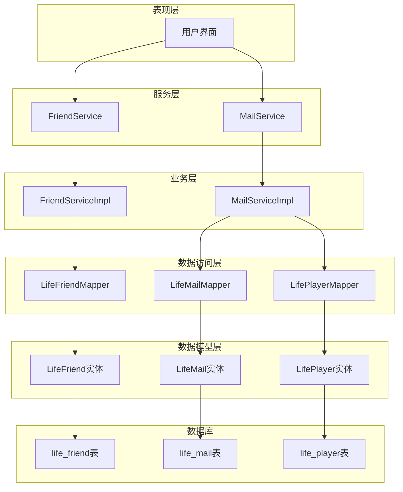
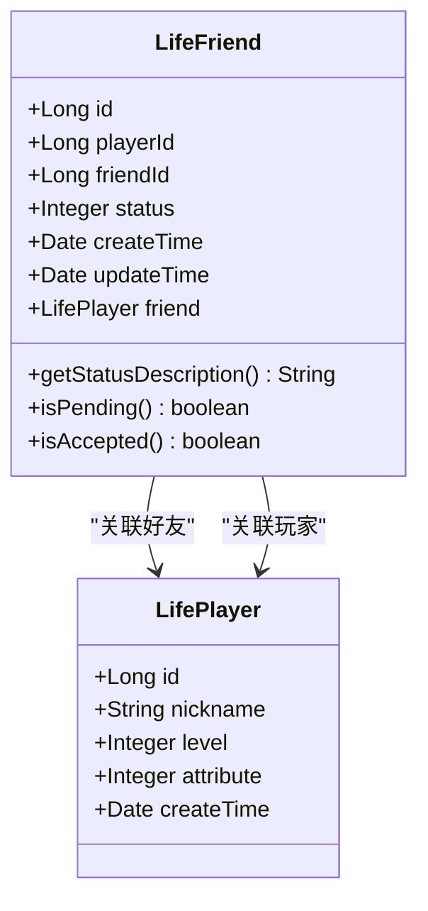
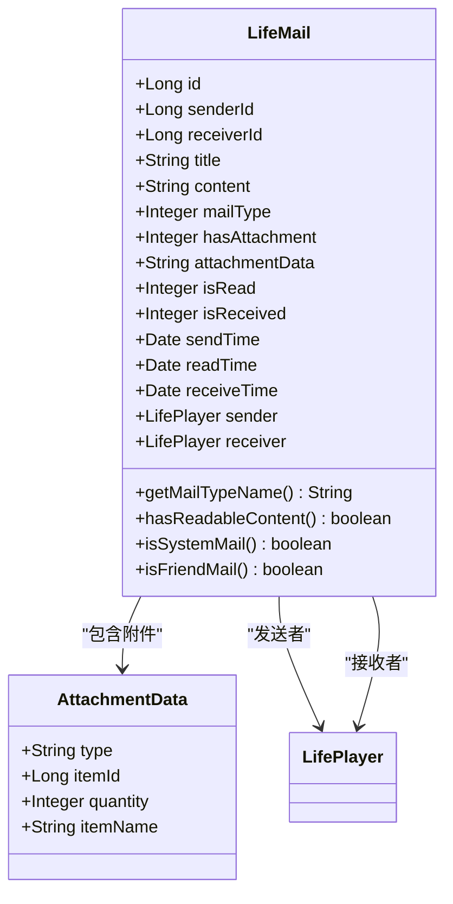
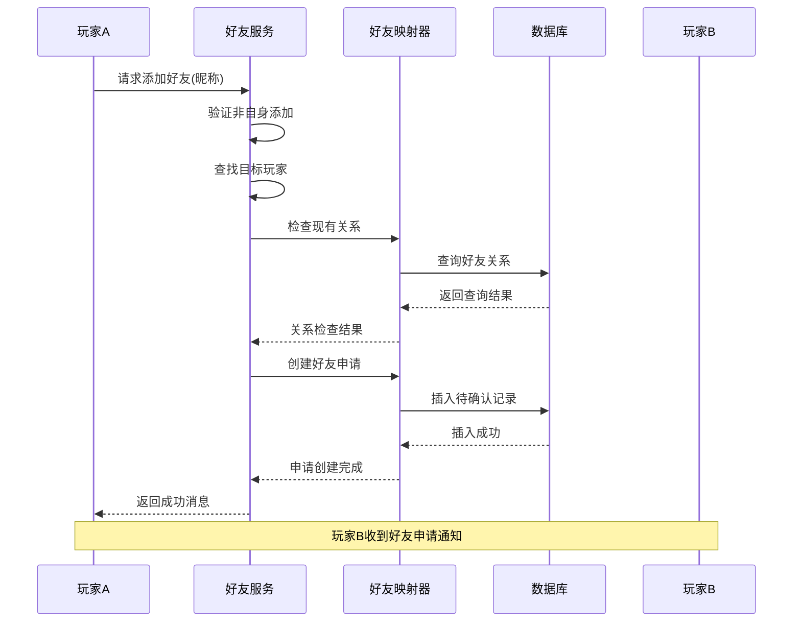
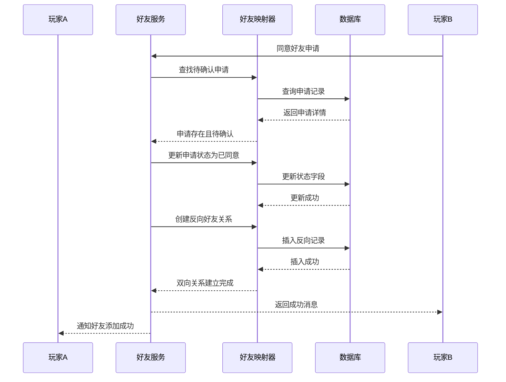
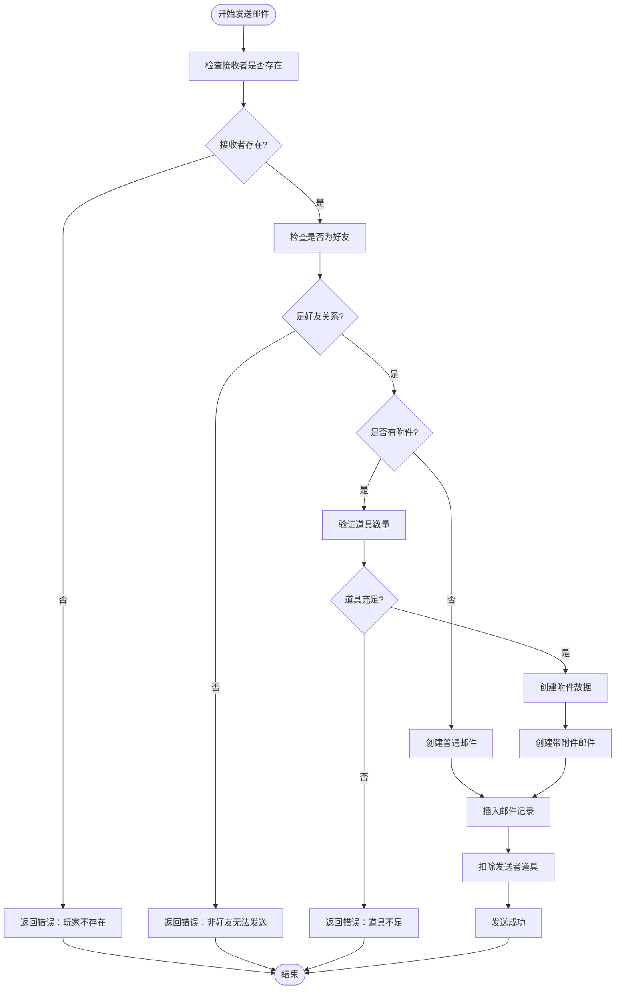
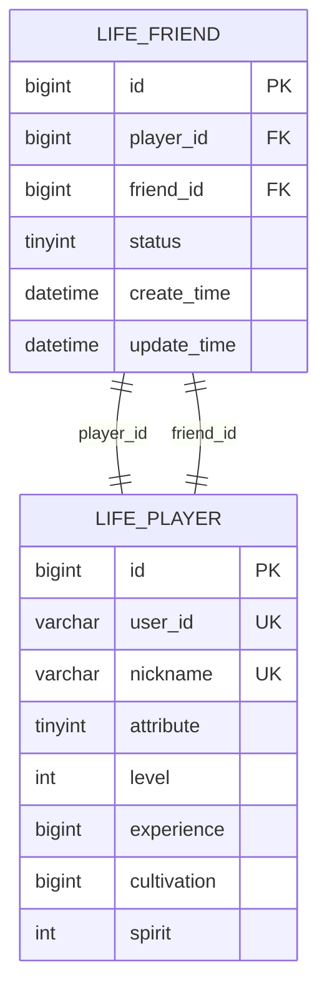
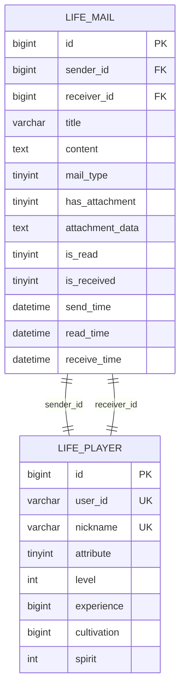
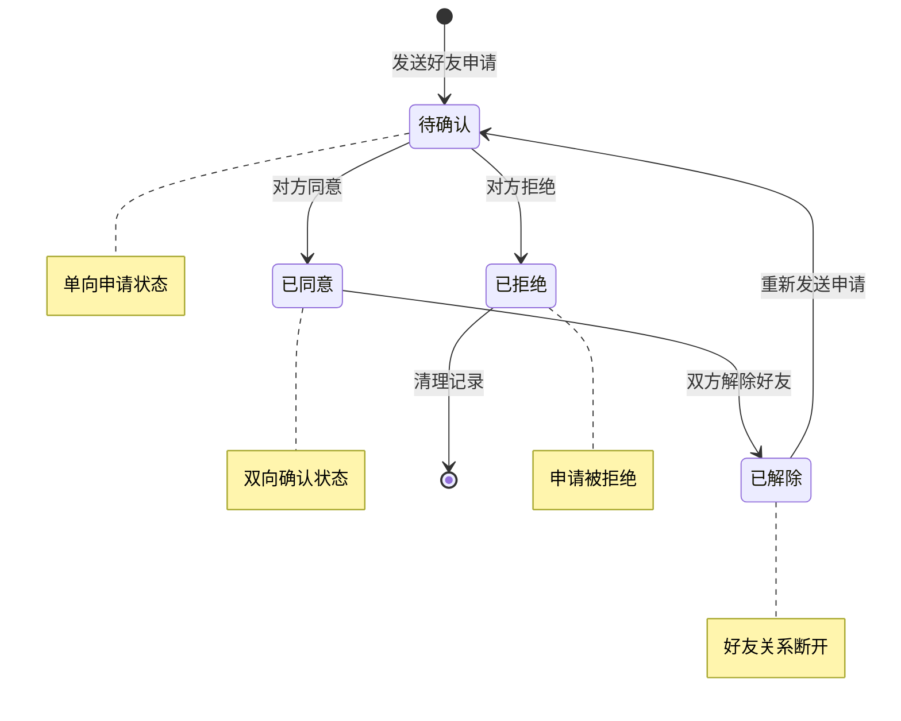
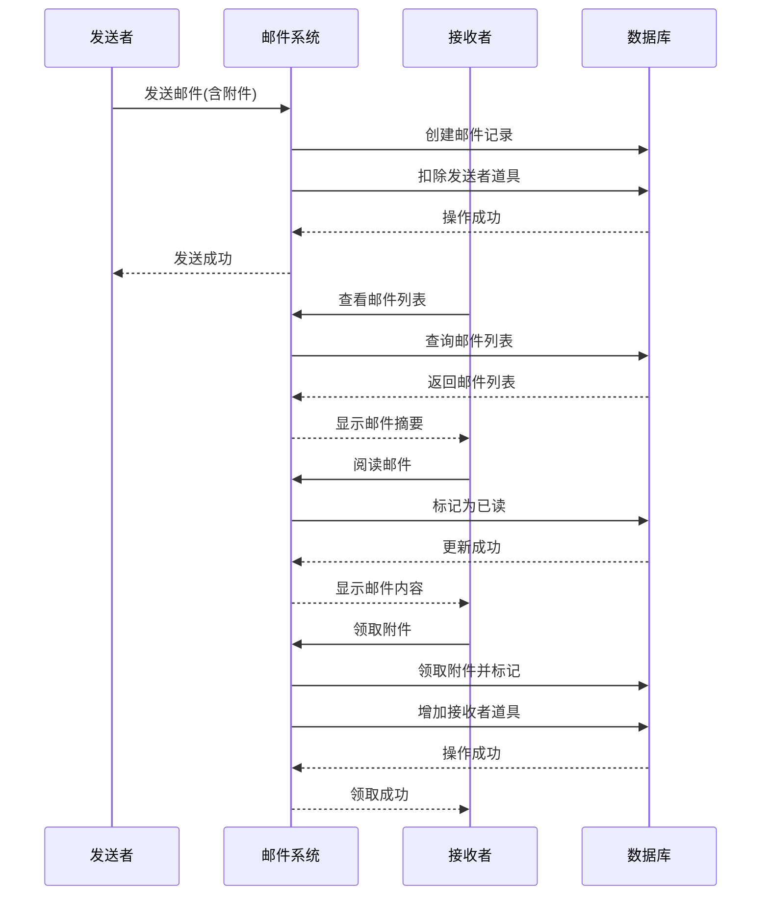

# 好友与邮件系统数据模型文档

<cite>
**本文档引用的文件**
- [Life_Database_Init.sql](file://Life_Database_Init.sql)
- [LifeFriend.java](file://Life/src/main/java/com/bot/life/dao/entity/LifeFriend.java)
- [LifeMail.java](file://Life/src/main/java/com/bot/life/dao/entity/LifeMail.java)
- [FriendService.java](file://Life/src/main/java/com/bot/life/service/FriendService.java)
- [MailService.java](file://Life/src/main/java/com/bot/life/service/MailService.java)
- [FriendServiceImpl.java](file://Life/src/main/java/com/bot/life/service/impl/FriendServiceImpl.java)
- [MailServiceImpl.java](file://Life/src/main/java/com/bot/life/service/impl/MailServiceImpl.java)
- [LifeFriendMapper.xml](file://Life/src/main/resources/mapper/LifeFriendMapper.xml)
- [LifeMailMapper.xml](file://Life/src/main/resources/mapper/LifeMailMapper.xml)
- [LifePlayer.java](file://Life/src/main/java/com/bot/life/dao/entity/LifePlayer.java)
</cite>

## 目录
1. [简介](#简介)
2. [系统架构概览](#系统架构概览)
3. [好友系统数据模型](#好友系统数据模型)
4. [邮件系统数据模型](#邮件系统数据模型)
5. [核心业务流程](#核心业务流程)
6. [数据库设计分析](#数据库设计分析)
7. [状态转换机制](#状态转换机制)
8. [性能优化考虑](#性能优化考虑)
9. [故障排除指南](#故障排除指南)
10. [总结](#总结)

## 简介

浮生卷游戏的好友与邮件系统是社交互动的核心模块，为玩家提供了完善的好友管理和通信功能。该系统采用基于MySQL的关系型数据库设计，通过LifeFriend和LifeMail两个核心实体实现了双向好友关系和多样化的邮件通信机制。

系统支持好友添加、验证确认、状态管理等完整的好友生命周期管理，以及系统邮件和好友邮件两种类型的邮件发送，并具备附件机制和领取状态跟踪功能。

## 系统架构概览

好友与邮件系统采用分层架构设计，包含数据访问层、业务逻辑层和服务接口层：



**图表来源**
- [FriendService.java](file://Life/src/main/java/com/bot/life/service/FriendService.java#L1-L57)
- [MailService.java](file://Life/src/main/java/com/bot/life/service/MailService.java#L1-L75)
- [LifeFriend.java](file://Life/src/main/java/com/bot/life/dao/entity/LifeFriend.java#L1-L23)
- [LifeMail.java](file://Life/src/main/java/com/bot/life/dao/entity/LifeMail.java#L1-L31)

## 好友系统数据模型

### LifeFriend实体设计

LifeFriend实体是好友系统的核心数据模型，负责维护玩家之间的双向好友关系：



**图表来源**
- [LifeFriend.java](file://Life/src/main/java/com/bot/life/dao/entity/LifeFriend.java#L12-L22)
- [LifePlayer.java](file://Life/src/main/java/com/bot/life/dao/entity/LifePlayer.java#L12-L49)

### 好友关系状态字段

好友关系的状态字段（status）采用简单的整数值表示：

| 状态值 | 状态名称 | 业务含义 |
|--------|----------|----------|
| 0 | 待确认 | 好友申请已发送，等待对方确认 |
| 1 | 已同意 | 双方互为好友，关系建立完成 |

### 双向关系实现机制

好友系统通过以下机制实现双向关系：

1. **单向申请机制**：当玩家A添加玩家B为好友时，系统创建一条从B到A的待确认记录
2. **自动反向关系**：当一方同意好友申请时，系统自动创建另一方向的确认关系
3. **唯一键约束**：通过`uk_player_friend`唯一键约束防止重复好友关系

**节来源**
- [LifeFriend.java](file://Life/src/main/java/com/bot/life/dao/entity/LifeFriend.java#L13-L18)
- [Life_Database_Init.sql](file://Life_Database_Init.sql#L250-L260)

## 邮件系统数据模型

### LifeMail实体设计

LifeMail实体是邮件系统的数据核心，支持多种邮件类型和附件机制：



**图表来源**
- [LifeMail.java](file://Life/src/main/java/com/bot/life/dao/entity/LifeMail.java#L12-L30)

### 邮件类型系统

邮件系统支持两种主要类型：

| 邮件类型 | 数值 | 业务含义 | 使用场景 |
|----------|------|----------|----------|
| 系统邮件 | 1 | 来自系统管理员的官方通知 | 游戏公告、活动通知、系统维护 |
| 好友邮件 | 2 | 来自其他玩家的私人通信 | 礼物赠送、聊天交流、任务委托 |

### 附件机制设计

邮件附件采用JSON格式的`attachmentData`字段存储，支持以下结构：

```json
{
  "type": "item",
  "itemId": 123,
  "quantity": 5,
  "itemName": "大修为丹"
}
```

### 领取状态管理

邮件系统通过两个字段跟踪附件领取状态：

| 字段名 | 类型 | 默认值 | 业务含义 |
|--------|------|--------|----------|
| isRead | Integer | 0 | 是否已读：0未读1已读 |
| isReceived | Integer | 0 | 附件是否已领取：0未领取1已领取 |

**节来源**
- [LifeMail.java](file://Life/src/main/java/com/bot/life/dao/entity/LifeMail.java#L13-L25)
- [Life_Database_Init.sql](file://Life_Database_Init.sql#L262-L277)

## 核心业务流程

### 好友添加流程



**图表来源**
- [FriendServiceImpl.java](file://Life/src/main/java/com/bot/life/service/impl/FriendServiceImpl.java#L28-L66)

### 好友确认流程



**图表来源**
- [FriendServiceImpl.java](file://Life/src/main/java/com/bot/life/service/impl/FriendServiceImpl.java#L69-L98)

### 邮件发送流程



**图表来源**
- [MailServiceImpl.java](file://Life/src/main/java/com/bot/life/service/impl/MailServiceImpl.java#L86-L183)

**节来源**
- [FriendServiceImpl.java](file://Life/src/main/java/com/bot/life/service/impl/FriendServiceImpl.java#L28-L98)
- [MailServiceImpl.java](file://Life/src/main/java/com/bot/life/service/impl/MailServiceImpl.java#L86-L183)

## 数据库设计分析

### 好友表设计考量

life_friend表的设计体现了以下关键设计原则：



**图表来源**
- [Life_Database_Init.sql](file://Life_Database_Init.sql#L250-L260)
- [LifePlayer.java](file://Life/src/main/java/com/bot/life/dao/entity/LifePlayer.java#L14-L16)

#### 唯一键约束分析

`uk_player_friend`唯一键约束的设计优势：
- **防止重复关系**：确保玩家之间只能有一条好友关系记录
- **简化查询**：通过复合索引提高查询效率
- **数据完整性**：避免好友关系数据冗余

#### 时间戳字段设计

- `create_time`：记录好友关系建立的时间
- `update_time`：记录关系状态变更的时间，支持自动更新

### 邮件表设计考量

life_mail表采用了灵活的邮件系统设计：



**图表来源**
- [Life_Database_Init.sql](file://Life_Database_Init.sql#L262-L277)

#### 索引设计分析

- `idx_to_player`索引：优化按接收者查询邮件的性能
- 复合索引：支持按发送者、接收者和时间组合查询

#### JSON附件数据设计

`attachment_data`字段采用JSON格式存储，具有以下优势：
- **灵活性**：支持多种附件类型和复杂数据结构
- **扩展性**：未来可轻松添加新的附件类型
- **简洁性**：避免创建额外的附件关联表

**节来源**
- [Life_Database_Init.sql](file://Life_Database_Init.sql#L250-L277)

## 状态转换机制

### 好友关系状态转换图



### 邮件生命周期时序图



**图表来源**
- [FriendServiceImpl.java](file://Life/src/main/java/com/bot/life/service/impl/FriendServiceImpl.java#L69-L98)
- [MailServiceImpl.java](file://Life/src/main/java/com/bot/life/service/impl/MailServiceImpl.java#L187-L200)

## 性能优化考虑

### 查询优化策略

1. **索引优化**
   - 在`player_id`和`friend_id`字段上建立复合索引
   - 在`receiver_id`字段上建立单独索引
   - 使用覆盖索引减少回表查询

2. **缓存策略**
   - 缓存好友列表和邮件列表
   - 缓存玩家基本信息
   - 实现LRU缓存机制

3. **批量操作**
   - 批量查询好友关系
   - 批量更新邮件状态
   - 批量删除过期邮件

### 存储优化

1. **数据压缩**
   - 对长文本内容进行压缩存储
   - 使用二进制格式存储JSON数据
   - 实现增量备份策略

2. **分区策略**
   - 按时间范围分区邮件表
   - 按玩家ID范围分区好友表
   - 实现自动分区管理

## 故障排除指南

### 常见问题及解决方案

#### 好友系统问题

| 问题描述 | 可能原因 | 解决方案 |
|----------|----------|----------|
| 无法添加好友 | 玩家不存在或昵称错误 | 检查玩家昵称拼写，确认玩家存在 |
| 好友申请重复发送 | 未正确检查现有关系 | 检查`uk_player_friend`约束 |
| 好友关系不一致 | 数据库事务未正确提交 | 检查事务边界，确保原子性 |
| 好友列表为空 | 查询条件错误 | 检查`status=1`过滤条件 |

#### 邮件系统问题

| 问题描述 | 可能原因 | 解决方案 |
|----------|----------|----------|
| 邮件发送失败 | 接收者不是好友 | 检查好友关系状态 |
| 附件丢失 | JSON序列化错误 | 检查附件数据格式 |
| 邮件重复 | 重复发送相同内容 | 实现幂等性检查 |
| 性能问题 | 查询未使用索引 | 检查查询计划，添加索引 |

### 监控指标

1. **好友系统监控**
   - 好友添加成功率
   - 好友确认延迟时间
   - 好友关系数据一致性

2. **邮件系统监控**
   - 邮件发送成功率
   - 邮件阅读率
   - 附件领取率
   - 邮件处理延迟

**节来源**
- [FriendServiceImpl.java](file://Life/src/main/java/com/bot/life/service/impl/FriendServiceImpl.java#L28-L66)
- [MailServiceImpl.java](file://Life/src/main/java/com/bot/life/service/impl/MailServiceImpl.java#L86-L183)

## 总结

浮生卷的好友与邮件系统通过精心设计的数据模型和业务流程，实现了高效、可靠的社会化功能。系统的主要特点包括：

1. **简洁高效的数据模型**：LifeFriend和LifeMail实体设计合理，字段定义清晰，满足业务需求

2. **完善的双向关系机制**：通过唯一键约束和自动反向关系创建，确保好友关系的一致性和完整性

3. **灵活的附件系统**：JSON格式的附件数据支持多种附件类型，具备良好的扩展性

4. **完整的状态管理**：清晰的状态转换和生命周期管理，确保数据一致性

5. **优化的数据库设计**：合理的索引策略和约束设计，保证查询性能和数据完整性

6. **健壮的业务逻辑**：完善的错误处理和异常情况处理机制

该系统为浮生卷游戏的社交功能奠定了坚实的基础，支持玩家之间的互动交流，提升了游戏的趣味性和粘性。随着游戏的发展，系统还可以进一步优化和扩展，以支持更多复杂的社交功能。