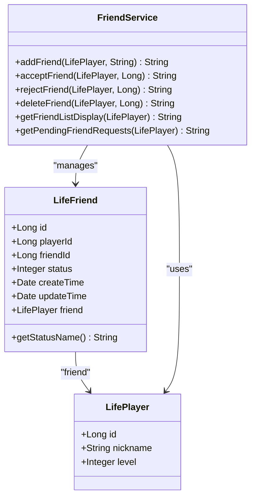
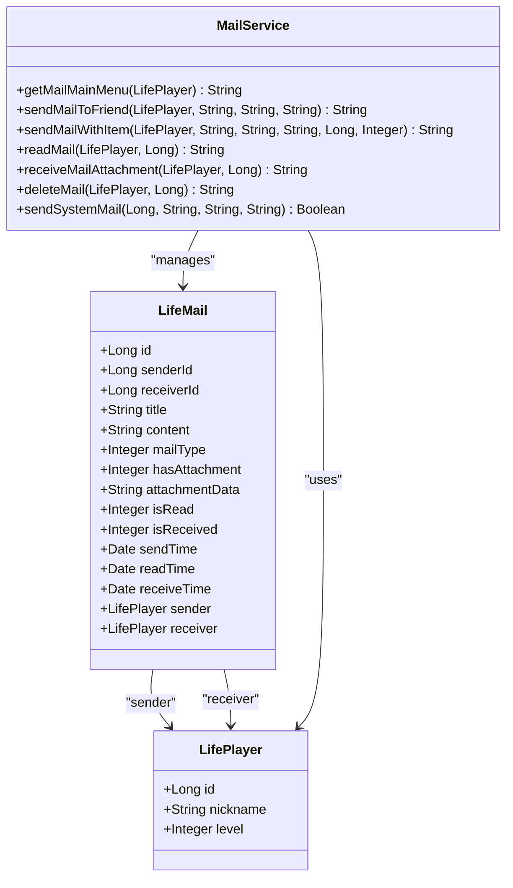
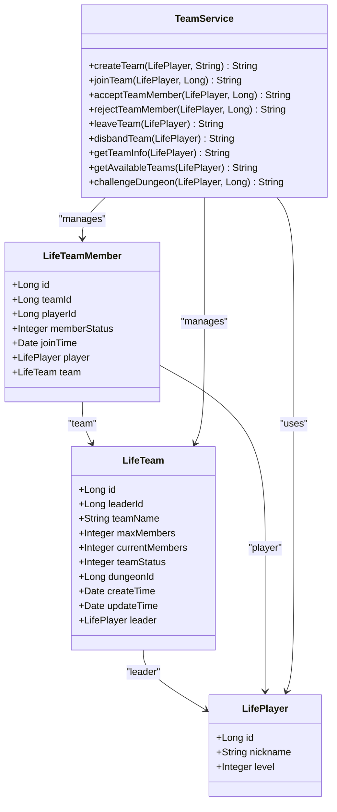
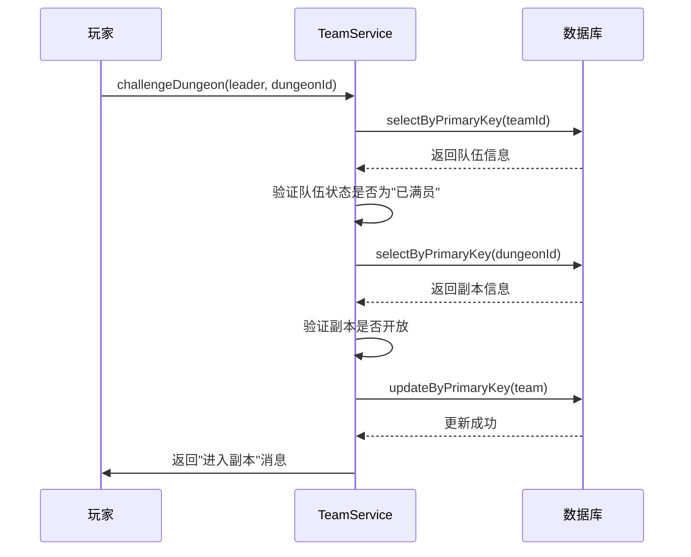
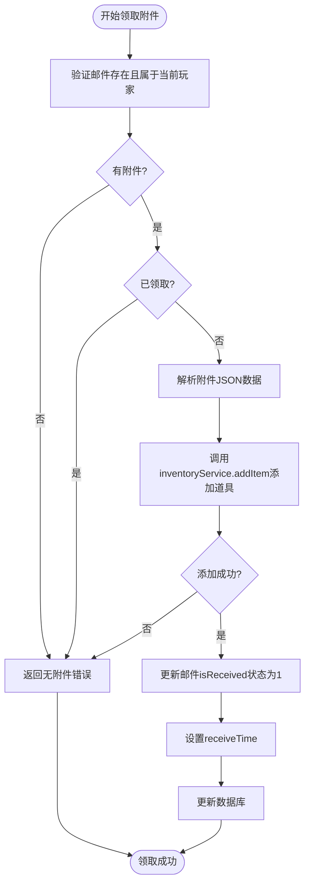
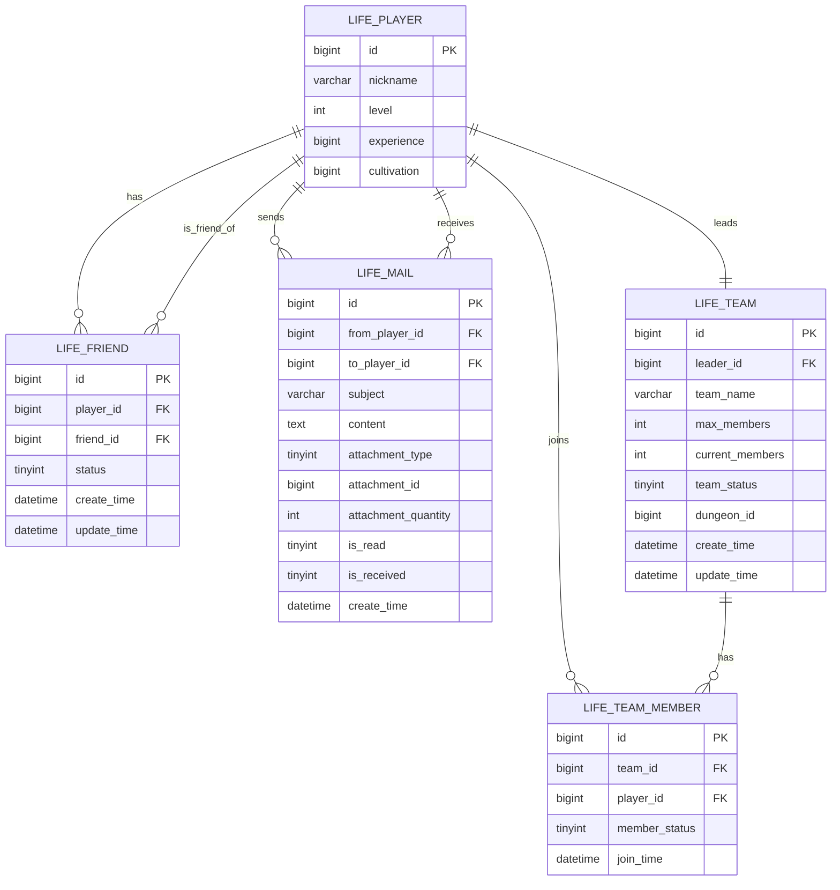
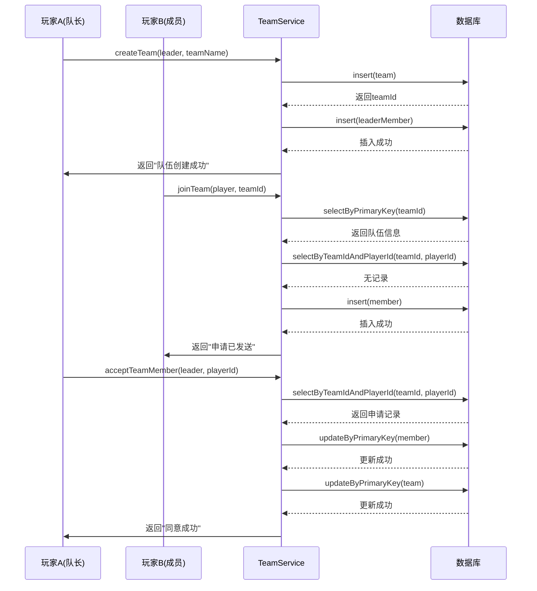

# 社交系统数据模型

<cite>
**本文档引用的文件**   
- [LifeFriend.java](file://Life\src\main\java\com\bot\life\dao\entity\LifeFriend.java)
- [LifeMail.java](file://Life\src\main\java\com\bot\life\dao\entity\LifeMail.java)
- [LifeTeam.java](file://Life\src\main\java\com\bot\life\dao\entity\LifeTeam.java)
- [LifeTeamMember.java](file://Life\src\main\java\com\bot\life\dao\entity\LifeTeamMember.java)
- [Life_Database_Init.sql](file://Life_Database_Init.sql)
- [FriendServiceImpl.java](file://Life\src\main\java\com\bot\life\service\impl\FriendServiceImpl.java)
- [MailServiceImpl.java](file://Life\src\main\java\com\bot\life\service\impl\MailServiceImpl.java)
- [TeamServiceImpl.java](file://Life\src\main\java\com\bot\life\service\impl\TeamServiceImpl.java)
</cite>

## 目录
1. [引言](#引言)
2. [核心实体设计](#核心实体设计)
3. [好友系统数据结构](#好友系统数据结构)
4. [邮件系统数据结构](#邮件系统数据结构)
5. [组队系统数据结构](#组队系统数据结构)
6. [组队挑战世界BOSS流程](#组队挑战世界BOSS流程)
7. [邮件附件领取事务处理](#邮件附件领取事务处理)
8. [社交关系ER图](#社交关系ER图)
9. [组队流程时序图](#组队流程时序图)

## 引言
本文档深入解析浮生卷游戏中的社交系统数据模型，重点分析LifeFriend、LifeMail、LifeTeam和LifeTeamMember等核心实体的设计。文档详细说明了好友系统（添加、验证、状态管理）、邮件系统（发送、接收、附件）和组队系统（创建、加入、挑战）的数据结构。结合数据库初始化脚本中的DDL语句，解释了life_friend表的双向关系实现、life_mail表的附件机制（道具/装备）、life_team_member表的成员状态管理。同时分析了组队挑战世界BOSS的流程以及邮件附件领取的事务处理机制。

## 核心实体设计
社交系统的核心实体包括LifeFriend、LifeMail、LifeTeam和LifeTeamMember，这些实体构成了游戏社交功能的基础。每个实体都有明确的职责和属性，通过合理的数据库设计和业务逻辑实现，支持了复杂的游戏社交互动。

**本文档引用的文件**   
- [LifeFriend.java](file://Life\src\main\java\com\bot\life\dao\entity\LifeFriend.java)
- [LifeMail.java](file://Life\src\main\java\com\bot\life\dao\entity\LifeMail.java)
- [LifeTeam.java](file://Life\src\main\java\com\bot\life\dao\entity\LifeTeam.java)
- [LifeTeamMember.java](file://Life\src\main\java\com\bot\life\dao\entity\LifeTeamMember.java)

## 好友系统数据结构
好友系统通过LifeFriend实体和life_friend表实现，支持好友添加、验证和状态管理功能。

### 数据库表结构
根据Life_Database_Init.sql中的DDL语句，life_friend表定义如下：
- `id`: 主键，自增
- `player_id`: 玩家ID，与life_player表关联
- `friend_id`: 好友ID，与life_player表关联
- `status`: 状态，0表示待确认，1表示已同意
- `create_time`: 创建时间
- `update_time`: 更新时间

该表通过唯一键`uk_player_friend`(`player_id`, `friend_id`)确保玩家与好友关系的唯一性。

### 双向关系实现
好友关系的双向性通过在FriendServiceImpl服务中实现。当玩家A向玩家B发送好友申请时，系统创建一条记录，其中`player_id`为B，`friend_id`为A，`status`为0（待确认）。当B同意申请时，系统执行两个操作：
1. 更新原始申请记录，将`status`设置为1（已同意）
2. 创建反向好友关系记录，其中`player_id`为A，`friend_id`为B，`status`为1

这种设计确保了好友关系的对称性，使得双方都能在好友列表中看到对方。

### 状态管理
好友状态通过`status`字段管理：
- 0: 待确认 - 好友申请已发送，等待对方处理
- 1: 已同意 - 双方已成为好友

系统提供了完整的状态转换流程，包括添加好友、接受好友、拒绝好友和删除好友操作。

**图表来源**
- [LifeFriend.java](file://Life\src\main\java\com\bot\life\dao\entity\LifeFriend.java#L1-L23)
- [FriendServiceImpl.java](file://Life\src\main\java\com\bot\life\service\impl\FriendServiceImpl.java#L1-L178)

**本节来源**
- [LifeFriend.java](file://Life\src\main\java\com\bot\life\dao\entity\LifeFriend.java#L1-L23)
- [Life_Database_Init.sql](file://Life_Database_Init.sql#L250-L260)
- [FriendServiceImpl.java](file://Life\src\main\java\com\bot\life\service\impl\FriendServiceImpl.java#L1-L178)

## 邮件系统数据结构
邮件系统通过LifeMail实体和life_mail表实现，支持邮件发送、接收和附件功能。

### 数据库表结构
根据Life_Database_Init.sql中的DDL语句，life_mail表定义如下：
- `id`: 主键，自增
- `from_player_id`: 发送者ID
- `to_player_id`: 接收者ID
- `subject`: 邮件主题
- `content`: 邮件内容
- `attachment_type`: 附件类型，1表示道具，2表示装备
- `attachment_id`: 附件ID
- `attachment_quantity`: 附件数量
- `is_read`: 是否已读，0表示未读，1表示已读
- `is_received`: 附件是否已领取，0表示未领取，1表示已领取
- `create_time`: 创建时间

### 附件机制
邮件附件机制通过attachment_type、attachment_id和attachment_quantity字段实现，支持道具和装备的赠送。在MailServiceImpl中，系统使用JSON格式存储附件数据，包含附件类型、ID、数量和名称等信息。

当发送带有附件的邮件时，系统执行以下步骤：
1. 验证发送者是否有足够的道具
2. 扣除发送者的道具数量
3. 创建邮件记录，设置hasAttachment为1
4. 将附件信息序列化为JSON存储在attachmentData字段中

### 状态管理
邮件系统通过多个状态字段管理邮件生命周期：
- `is_read`: 邮件阅读状态
- `is_received`: 附件领取状态

这种分离的状态管理确保了即使邮件已读，附件仍可被领取，提高了系统的灵活性和用户体验。

**图表来源**
- [LifeMail.java](file://Life\src\main\java\com\bot\life\dao\entity\LifeMail.java#L1-L31)
- [MailServiceImpl.java](file://Life\src\main\java\com\bot\life\service\impl\MailServiceImpl.java#L1-L355)

**本节来源**
- [LifeMail.java](file://Life\src\main\java\com\bot\life\dao\entity\LifeMail.java#L1-L31)
- [Life_Database_Init.sql](file://Life_Database_Init.sql#L263-L277)
- [MailServiceImpl.java](file://Life\src\main\java\com\bot\life\service\impl\MailServiceImpl.java#L1-L355)

## 组队系统数据结构
组队系统通过LifeTeam和LifeTeamMember实体实现，支持队伍创建、加入和成员管理功能。

### 队伍实体设计
LifeTeam实体包含以下属性：
- `id`: 队伍ID
- `leaderId`: 队长ID
- `teamName`: 队伍名称
- `maxMembers`: 最大成员数
- `currentMembers`: 当前成员数
- `teamStatus`: 队伍状态
- `dungeonId`: 当前副本ID
- `createTime`: 创建时间
- `updateTime`: 更新时间

### 队伍成员实体设计
LifeTeamMember实体包含以下属性：
- `id`: 主键
- `teamId`: 队伍ID
- `playerId`: 玩家ID
- `memberStatus`: 成员状态
- `joinTime`: 加入时间

### 成员状态管理
成员状态通过`memberStatus`字段管理：
- 0: 申请中 - 玩家已申请加入队伍，等待队长处理
- 1: 已同意 - 玩家已成为队伍成员

队伍状态通过`teamStatus`字段管理：
- 0: 招募中 - 队伍正在招募成员
- 1: 已满员 - 队伍已达到最大成员数
- 2: 副本中 - 队伍正在挑战副本

这种状态管理机制确保了组队流程的有序进行，防止了状态冲突和数据不一致。

**图表来源**
- [LifeTeam.java](file://Life\src\main\java\com\bot\life\dao\entity\LifeTeam.java#L1-L26)
- [LifeTeamMember.java](file://Life\src\main\java\com\bot\life\dao\entity\LifeTeamMember.java#L1-L23)
- [TeamServiceImpl.java](file://Life\src\main\java\com\bot\life\service\impl\TeamServiceImpl.java#L1-L378)

**本节来源**
- [LifeTeam.java](file://Life\src\main\java\com\bot\life\dao\entity\LifeTeam.java#L1-L26)
- [LifeTeamMember.java](file://Life\src\main\java\com\bot\life\dao\entity\LifeTeamMember.java#L1-L23)
- [Life_Database_Init.sql](file://Life_Database_Init.sql#L304-L324)
- [TeamServiceImpl.java](file://Life\src\main\java\com\bot\life\service\impl\TeamServiceImpl.java#L1-L378)

## 组队挑战世界BOSS流程
组队挑战世界BOSS的流程涉及多个实体和状态转换，确保了挑战的公平性和数据一致性。

### 流程概述
1. 队长创建队伍并招募成员
2. 队伍达到满员状态
3. 队长发起世界BOSS挑战
4. 系统验证挑战资格
5. 进入战斗流程
6. 记录挑战结果和奖励

### 状态转换
在TeamServiceImpl中，挑战流程的状态转换如下：
1. 队伍状态从"招募中"(0)变为"已满员"(1)
2. 队长发起挑战时，验证队伍状态为"已满员"
3. 挑战开始后，队伍状态变为"副本中"(2)
4. 挑战结束后，根据结果更新队伍状态

### 数据一致性
系统通过事务管理确保数据一致性。在challengeDungeon方法中，系统首先验证队伍状态和成员资格，然后更新队伍状态为"副本中"，最后启动战斗流程。如果任何步骤失败，系统会回滚状态变更，保持数据完整性。

**图表来源**
- [TeamServiceImpl.java](file://Life\src\main\java\com\bot\life\service\impl\TeamServiceImpl.java#L319-L355)

**本节来源**
- [TeamServiceImpl.java](file://Life\src\main\java\com\bot\life\service\impl\TeamServiceImpl.java#L319-L355)

## 邮件附件领取事务处理
邮件附件领取是一个关键的事务操作，需要确保数据的一致性和完整性。

### 事务处理流程
在MailServiceImpl的receiveMailAttachment方法中，附件领取流程如下：
1. 验证邮件存在且属于当前玩家
2. 验证邮件有附件且未领取
3. 解析附件JSON数据
4. 调用inventoryService.addItem将道具添加到接收者背包
5. 如果添加成功，更新邮件的isReceived状态为1
6. 记录领取时间

### 异常处理
系统实现了完善的异常处理机制：
- 如果道具添加失败，整个操作回滚，附件保持未领取状态
- 如果数据库更新失败，系统记录错误日志并返回失败信息
- 使用try-catch块捕获所有异常，防止系统崩溃

### 数据一致性
通过在同一个事务中执行道具添加和邮件状态更新，系统确保了数据一致性。只有当两个操作都成功时，事务才提交；任何一个操作失败都会导致事务回滚，避免了道具丢失或重复领取的问题。

**图表来源**
- [MailServiceImpl.java](file://Life\src\main\java\com\bot\life\service\impl\MailServiceImpl.java#L247-L295)

**本节来源**
- [MailServiceImpl.java](file://Life\src\main\java\com\bot\life\service\impl\MailServiceImpl.java#L247-L295)

## 社交关系ER图
以下ER图展示了社交系统核心实体之间的关系。

**图表来源**
- [Life_Database_Init.sql](file://Life_Database_Init.sql#L250-L324)

## 组队流程时序图
以下时序图展示了玩家创建队伍并邀请好友加入的完整流程。

**图表来源**
- [TeamServiceImpl.java](file://Life\src\main\java\com\bot\life\service\impl\TeamServiceImpl.java#L29-L154)