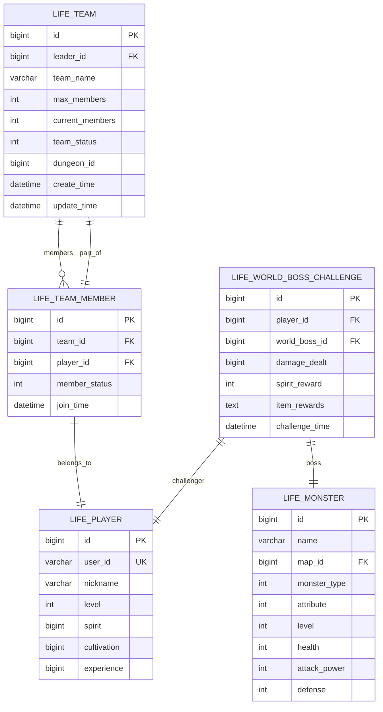
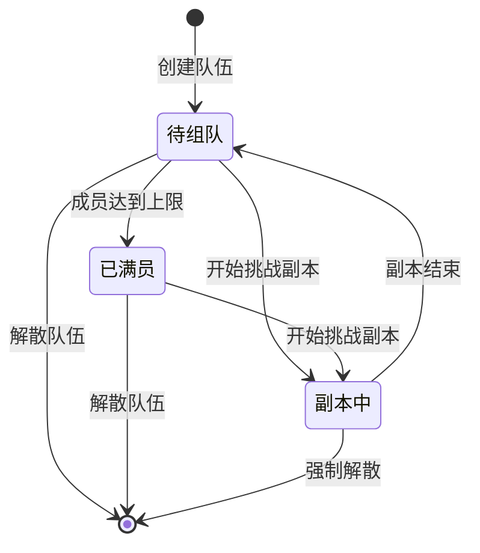
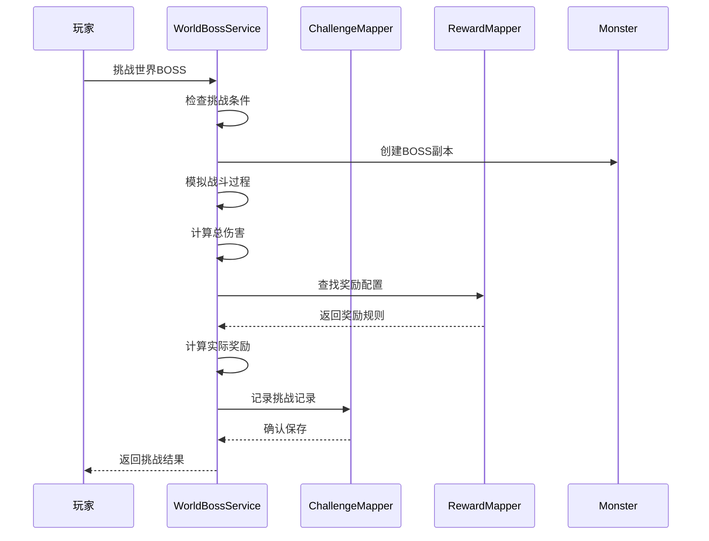
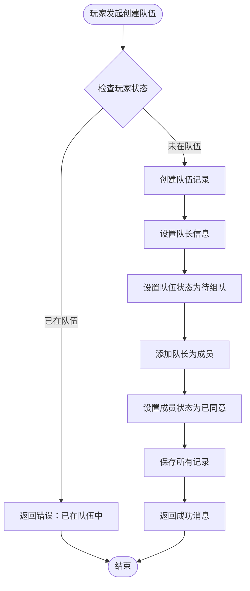
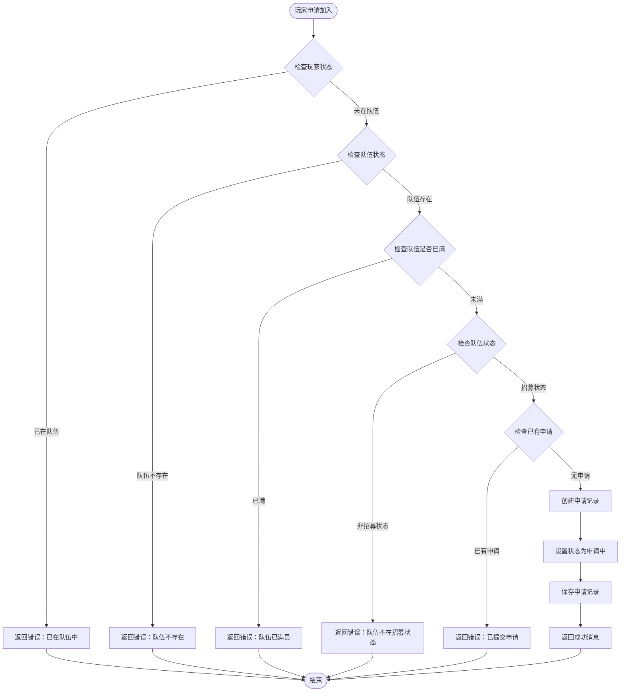
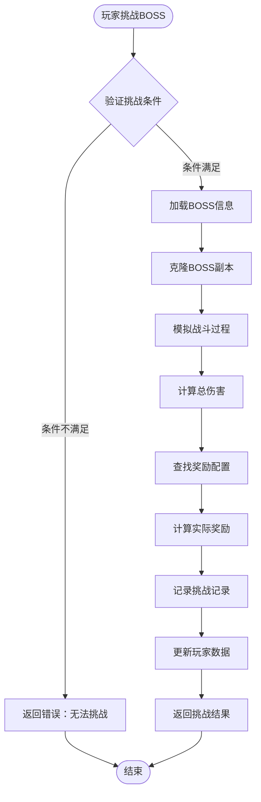
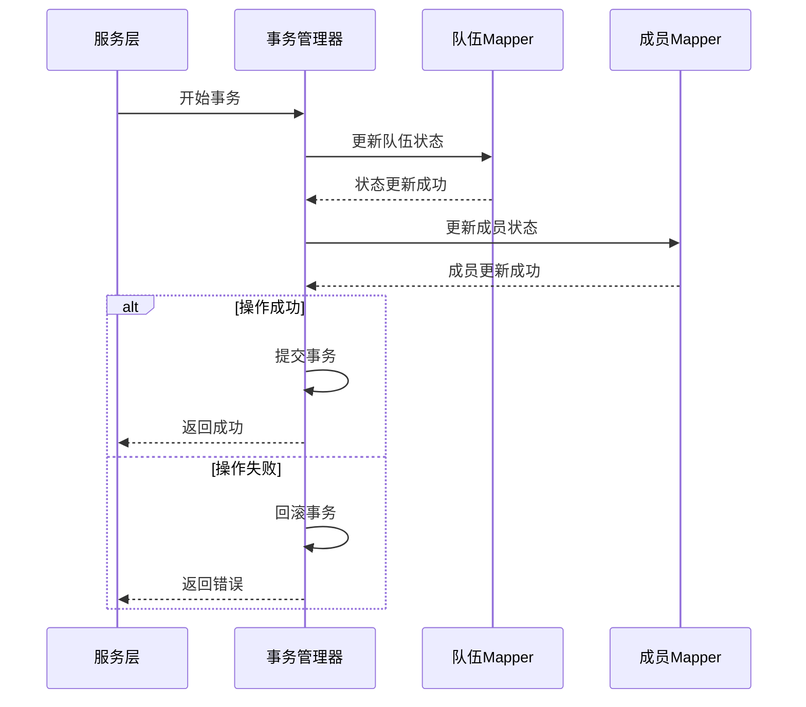
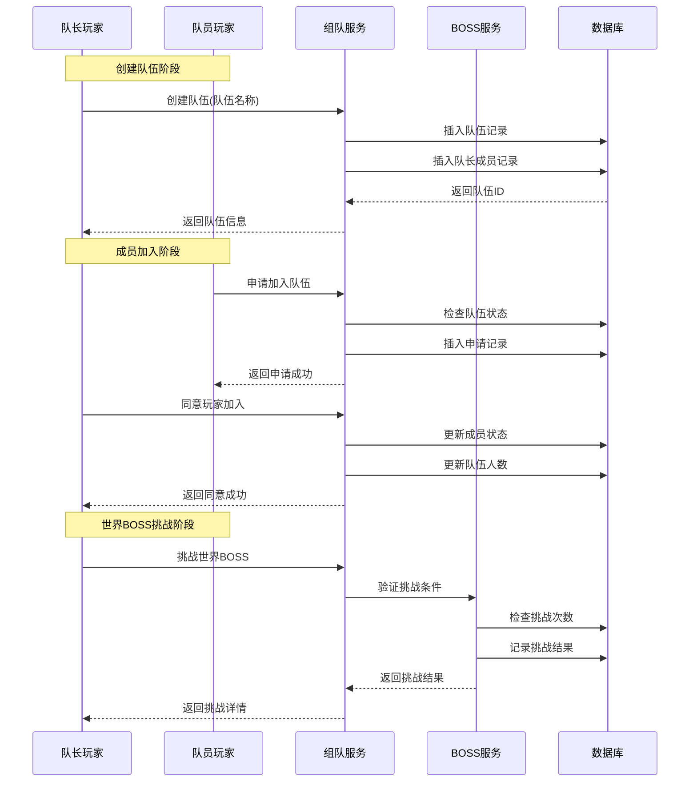

# 组队与团队挑战系统数据模型文档

<cite>
**本文档引用的文件**
- [Life_Database_Init.sql](file://Life_Database_Init.sql)
- [LifeTeam.java](file://Life/Life_Database_Tables_Check.md)
- [LifeTeamMember.java](file://Life/Life_Database_Tables_Check.md)
- [TeamServiceImpl.java](file://Life/src/main/java/com/bot/life/service/impl/TeamServiceImpl.java)
- [WorldBossServiceImpl.java](file://Life/src/main/java/com/bot/life/service/impl/WorldBossServiceImpl.java)
- [LifeTeamMapper.xml](file://Life/src/main/resources/mapper/LifeTeamMapper.xml)
- [LifeTeamMemberMapper.xml](file://Life/src/main/resources/mapper/LifeTeamMemberMapper.xml)
- [LifeWorldBossChallengeMapper.xml](file://Life/src/main/resources/mapper/LifeWorldBossChallengeMapper.xml)
- [浮生卷开发说明.md](file://浮生卷开发说明.md)
</cite>

## 目录
1. [系统概述](#系统概述)
2. [核心数据模型](#核心数据模型)
3. [组队系统架构](#组队系统架构)
4. [世界BOSS挑战机制](#世界boos挑战机制)
5. [数据结构详解](#数据结构详解)
6. [业务流程分析](#业务流程分析)
7. [索引设计与性能优化](#索引设计与性能优化)
8. [事务处理与状态管理](#事务处理与状态管理)
9. [系统时序图](#系统时序图)
10. [最佳实践建议](#最佳实践建议)

## 系统概述

浮生卷的组队与团队挑战系统是一个基于文字冒险游戏的多人协作机制，主要包含两个核心功能模块：

1. **组队系统**：支持玩家创建队伍、申请加入、成员管理等功能
2. **世界BOSS挑战**：允许玩家组队挑战全球性的强大BOSS，根据伤害贡献获得奖励

系统采用MySQL数据库存储，通过MyBatis框架进行数据访问，实现了完整的队伍生命周期管理和世界BOSS挑战记录功能。

## 核心数据模型

系统的核心数据模型围绕两个主要实体构建：

**图表来源**
- [Life_Database_Init.sql](file://Life_Database_Init.sql#L303-L324)
- [Life_Database_Init.sql](file://Life_Database_Init.sql#L559-L568)

**节来源**
- [Life_Database_Init.sql](file://Life_Database_Init.sql#L303-L568)

## 组队系统架构

### 队伍状态机

组队系统实现了完整的状态管理机制，支持以下状态转换：

### 成员状态管理

队伍成员状态采用双层状态设计：
- **申请状态**：0-申请中，1-已同意
- **成员状态**：0-离队，1-在队

这种设计支持复杂的队伍管理场景，如待处理申请、成员离队等情况。

**节来源**
- [TeamServiceImpl.java](file://Life/src/main/java/com/bot/life/service/impl/TeamServiceImpl.java#L37-L42)
- [LifeTeamMember.java](file://Life/Life_Database_Tables_Check.md#L16)

## 世界BOSS挑战机制

### 挑战流程

世界BOSS挑战系统实现了基于伤害贡献的奖励分配机制：

**图表来源**
- [WorldBossServiceImpl.java](file://Life/src/main/java/com/bot/life/service/impl/WorldBossServiceImpl.java#L77-L118)

### 奖励计算机制

系统根据玩家造成的伤害范围自动匹配奖励配置：

| 伤害范围 | 灵粹奖励 | 道具奖励 |
|---------|---------|---------|
| 0-1000 | 50 | 小修为丹×1 |
| 1001-3000 | 100 | 小修为丹×2, 回春丹×1 |
| 3001及以上 | 200 | 小修为丹×3, 回春丹×2, 大力丸×1 |

**节来源**
- [WorldBossServiceImpl.java](file://Life/src/main/java/com/bot/life/service/impl/WorldBossServiceImpl.java#L241-L251)

## 数据结构详解

### LIFE_TEAM 表结构

| 字段名 | 类型 | 约束 | 描述 |
|-------|------|------|------|
| id | bigint | PRIMARY KEY, AUTO_INCREMENT | 队伍唯一标识 |
| leader_id | bigint | NOT NULL, FOREIGN KEY | 队长玩家ID |
| team_name | varchar(50) | NOT NULL | 队伍名称 |
| max_members | int | DEFAULT 2 | 最大成员数 |
| current_members | int | DEFAULT 1 | 当前成员数 |
| team_status | int | DEFAULT 0 | 队伍状态(0待组队1已满员2副本中) |
| dungeon_id | bigint | NULL | 当前副本ID |
| create_time | datetime | DEFAULT CURRENT_TIMESTAMP | 创建时间 |
| update_time | datetime | DEFAULT CURRENT_TIMESTAMP ON UPDATE CURRENT_TIMESTAMP | 更新时间 |

### LIFE_TEAM_MEMBER 表结构

| 字段名 | 类型 | 约束 | 描述 |
|-------|------|------|------|
| id | bigint | PRIMARY KEY, AUTO_INCREMENT | 成员记录唯一标识 |
| team_id | bigint | NOT NULL, FOREIGN KEY | 所属队伍ID |
| player_id | bigint | NOT NULL, FOREIGN KEY | 玩家ID |
| member_status | int | DEFAULT 1 | 成员状态(0申请中1已同意) |
| join_time | datetime | DEFAULT CURRENT_TIMESTAMP | 加入时间 |

### LIFE_WORLD_BOSS_CHALLENGE 表结构

| 字段名 | 类型 | 约束 | 描述 |
|-------|------|------|------|
| id | bigint | PRIMARY KEY, AUTO_INCREMENT | 挑战记录唯一标识 |
| player_id | bigint | NOT NULL, FOREIGN KEY | 玩家ID |
| world_boss_id | bigint | NOT NULL, FOREIGN KEY | 世界BOSS ID |
| damage_dealt | bigint | NOT NULL | 造成的伤害 |
| spirit_reward | int | DEFAULT 0 | 获得的灵粹奖励 |
| item_rewards | text | NULL | 获得的道具奖励(JSON格式) |
| challenge_time | datetime | DEFAULT CURRENT_TIMESTAMP | 挑战时间 |

**节来源**
- [Life_Database_Init.sql](file://Life_Database_Init.sql#L303-L324)
- [Life_Database_Init.sql](file://Life_Database_Init.sql#L559-L568)

## 业务流程分析

### 组队创建流程

**图表来源**
- [TeamServiceImpl.java](file://Life/src/main/java/com/bot/life/service/impl/TeamServiceImpl.java#L29-L58)

### 成员加入流程

**图表来源**
- [TeamServiceImpl.java](file://Life/src/main/java/com/bot/life/service/impl/TeamServiceImpl.java#L67-L108)

### 世界BOSS挑战流程

**图表来源**
- [WorldBossServiceImpl.java](file://Life/src/main/java/com/bot/life/service/impl/WorldBossServiceImpl.java#L77-L118)

**节来源**
- [TeamServiceImpl.java](file://Life/src/main/java/com/bot/life/service/impl/TeamServiceImpl.java#L29-L113)
- [WorldBossServiceImpl.java](file://Life/src/main/java/com/bot/life/service/impl/WorldBossServiceImpl.java#L77-L118)

## 索引设计与性能优化

### LIFE_TEAM_MEMBER 表复合索引

系统在 `life_team_member` 表上设计了两个关键索引：

1. **idx_team_id**：针对 `team_id` 字段的索引
   - 支持快速查询特定队伍的所有成员
   - 优化队伍成员管理操作

2. **idx_player_id**：针对 `player_id` 字段的索引  
   - 支持快速查询玩家所属的队伍
   - 优化玩家状态检查和队伍查询

### 索引使用场景分析

| 查询场景 | 使用的索引 | 性能特点 |
|---------|-----------|---------|
| 根据队伍ID查询成员 | idx_team_id | O(log n) 时间复杂度 |
| 根据玩家ID查询队伍 | idx_player_id | O(log n) 时间复杂度 |
| 查询待处理申请 | idx_team_id + member_status | 覆盖索引，高效查询 |
| 检查玩家是否在队伍 | idx_player_id + member_status | 快速状态验证 |

**节来源**
- [Life_Database_Init.sql](file://Life_Database_Init.sql#L322-L323)
- [LifeTeamMemberMapper.xml](file://Life/src/main/resources/mapper/LifeTeamMemberMapper.xml#L32-L64)

## 事务处理与状态管理

### 组队操作事务保证

系统在关键业务操作中实现了严格的事务控制：

**图表来源**
- [TeamServiceImpl.java](file://Life/src/main/java/com/bot/life/service/impl/TeamServiceImpl.java#L132-L143)

### 状态一致性保障

系统通过以下机制确保数据一致性：

1. **原子性操作**：队伍状态和成员状态的更新在同一事务中完成
2. **约束检查**：数据库层面的外键约束和业务逻辑约束
3. **并发控制**：通过索引和锁机制防止并发冲突

**节来源**
- [TeamServiceImpl.java](file://Life/src/main/java/com/bot/life/service/impl/TeamServiceImpl.java#L132-L143)

## 系统时序图

### 完整的组队挑战流程

**图表来源**
- [TeamServiceImpl.java](file://Life/src/main/java/com/bot/life/service/impl/TeamServiceImpl.java#L29-L113)
- [WorldBossServiceImpl.java](file://Life/src/main/java/com/bot/life/service/impl/WorldBossServiceImpl.java#L77-L118)

## 最佳实践建议

### 数据库设计优化

1. **索引策略**
   - 在高频查询字段上建立适当索引
   - 考虑复合索引的使用场景
   - 定期分析查询计划，优化索引效果

2. **数据完整性**
   - 使用外键约束维护关系完整性
   - 实施适当的业务规则验证
   - 定期清理无效数据

3. **性能监控**
   - 监控查询执行时间
   - 分析慢查询日志
   - 根据实际使用情况调整索引策略

### 业务逻辑优化

1. **状态管理**
   - 实现完整的状态机验证
   - 提供清晰的状态转换文档
   - 添加状态变更的日志记录

2. **用户体验**
   - 提供详细的错误提示信息
   - 实现异步操作反馈
   - 优化响应时间

3. **扩展性考虑**
   - 设计可扩展的奖励系统
   - 支持动态配置BOSS属性
   - 考虑多地图支持的可能性

### 安全性建议

1. **权限控制**
   - 实现严格的权限验证
   - 防止越权操作
   - 记录敏感操作日志

2. **数据保护**
   - 实施数据备份策略
   - 保护玩家隐私信息
   - 防范SQL注入攻击

通过以上设计和优化，浮生卷的组队与团队挑战系统能够提供稳定、高效的多人协作体验，同时为未来的功能扩展奠定了良好的基础。