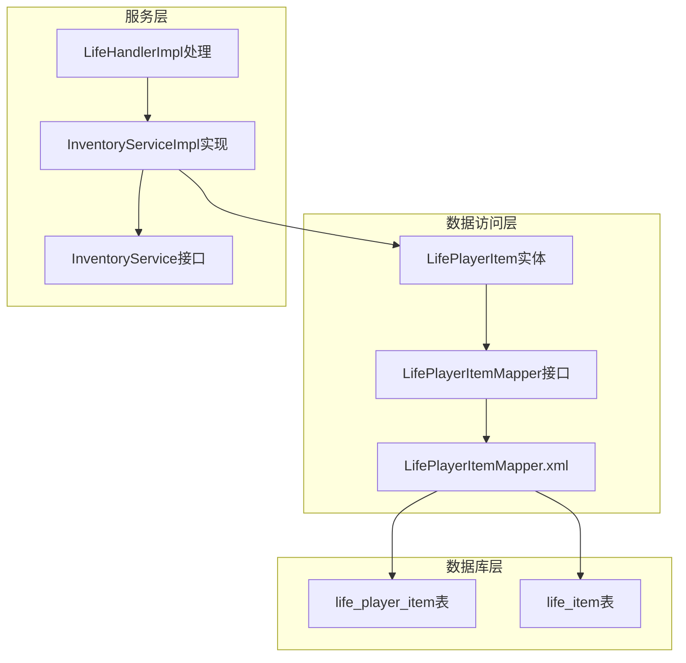
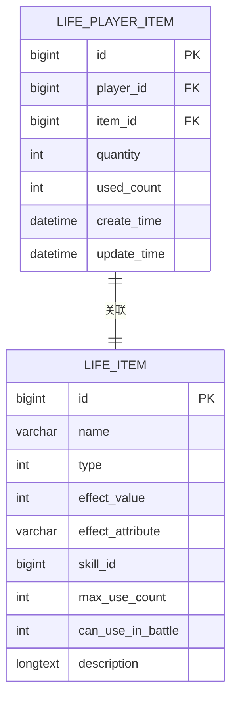
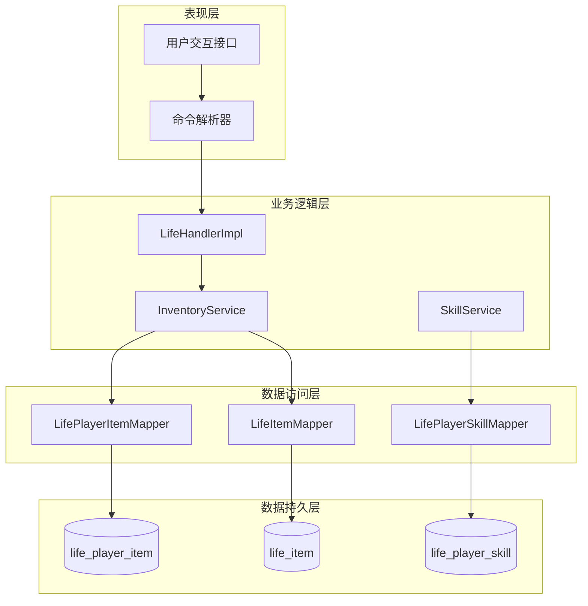
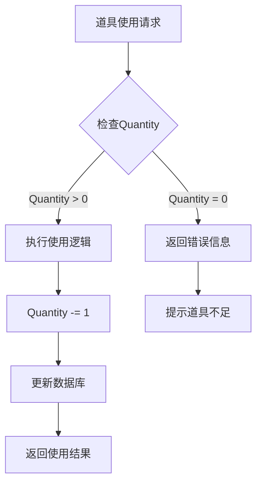
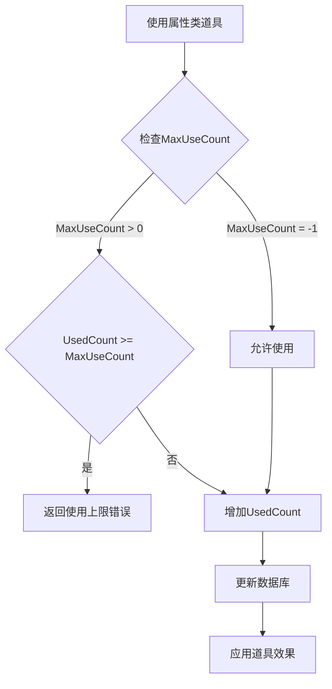
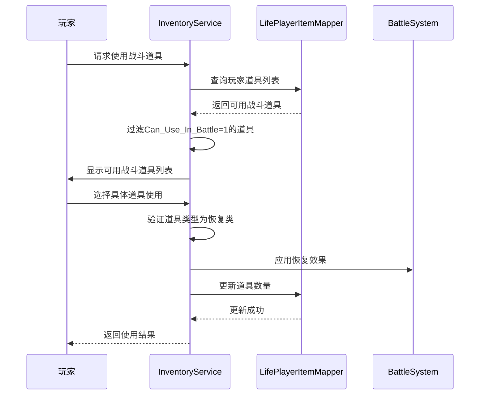
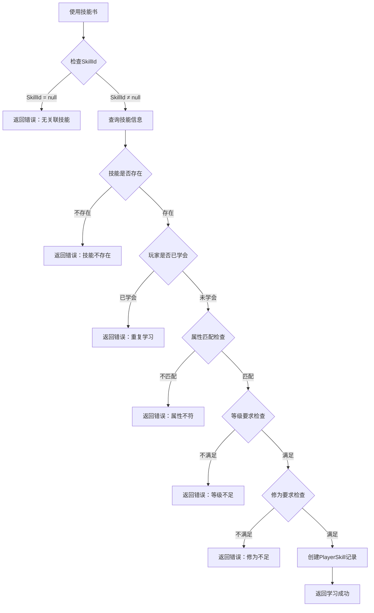
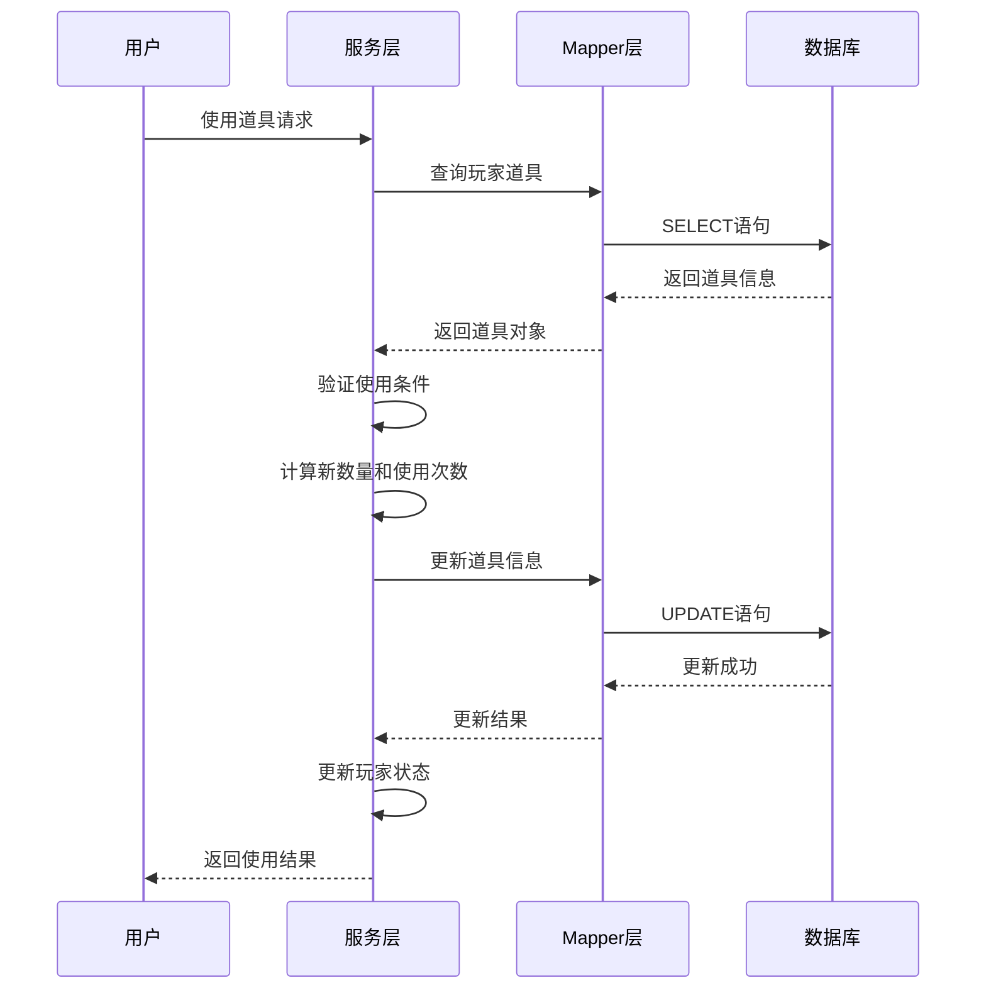
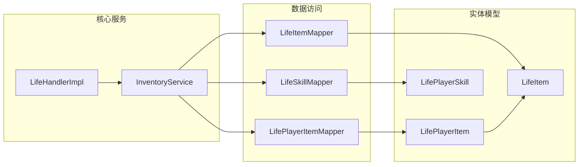

# 背包与使用机制

<cite>
**本文档引用的文件**
- [LifePlayerItem.java](file://Life/src/main/java/com/bot/life/dao/entity/LifePlayerItem.java)
- [LifePlayerItemMapper.xml](file://Life/src/main/resources/mapper/LifePlayerItemMapper.xml)
- [Life_Database_Init.sql](file://Life_Database_Init.sql)
- [InventoryServiceImpl.java](file://Life/src/main/java/com/bot/life/service/impl/InventoryServiceImpl.java)
- [LifeHandlerImpl.java](file://Life/src/main/java/com/bot/life/service/impl/LifeHandlerImpl.java)
- [LifeItem.java](file://Life/src/main/java/com/bot/life/dao/entity/LifeItem.java)
- [LifePlayerItemMapper.java](file://Life/src/main/java/com/bot/life/dao/mapper/LifePlayerItemMapper.java)
- [InventoryService.java](file://Life/src/main/java/com/bot/life/service/InventoryService.java)
</cite>

## 目录
1. [简介](#简介)
2. [项目结构](#项目结构)
3. [核心组件](#核心组件)
4. [架构概览](#架构概览)
5. [详细组件分析](#详细组件分析)
6. [依赖关系分析](#依赖关系分析)
7. [性能考虑](#性能考虑)
8. [故障排除指南](#故障排除指南)
9. [结论](#结论)

## 简介

本文档深入解析《浮生卷》游戏中背包与道具使用机制的设计与实现。该系统基于Spring Boot框架，采用MyBatis作为ORM工具，实现了完整的玩家道具管理系统，包括道具数量管理、使用次数控制、战斗中道具使用以及技能书学习等核心功能。

系统的核心设计理念是通过LifePlayerItem实体类和LifePlayerItemMapper.xml映射文件，实现玩家持有道具与基础道具信息的关联查询，同时通过严格的业务逻辑控制确保道具使用的合理性和游戏平衡性。

## 项目结构

**图表来源**
- [LifePlayerItem.java](file://Life/src/main/java/com/bot/life/dao/entity/LifePlayerItem.java#L1-L24)
- [LifePlayerItemMapper.java](file://Life/src/main/java/com/bot/life/dao/mapper/LifePlayerItemMapper.java#L1-L42)
- [InventoryServiceImpl.java](file://Life/src/main/java/com/bot/life/service/impl/InventoryServiceImpl.java#L1-L78)

**章节来源**
- [LifePlayerItem.java](file://Life/src/main/java/com/bot/life/dao/entity/LifePlayerItem.java#L1-L24)
- [LifePlayerItemMapper.xml](file://Life/src/main/resources/mapper/LifePlayerItemMapper.xml#L1-L81)

## 核心组件

### LifePlayerItem实体类

LifePlayerItem是背包系统的核心实体类，负责管理玩家持有的各种道具信息。该类包含以下关键字段：

- **id**: 主键标识符
- **playerId**: 玩家ID，建立与玩家的关联关系
- **itemId**: 道具ID，关联基础道具表
- **quantity**: 道具数量，控制道具的持有数量
- **usedCount**: 已使用次数，限制属性类道具的使用频率
- **createTime/updateTime**: 时间戳，记录道具的创建和更新时间
- **item**: 关联对象，包含道具的基础信息

### MyBatis映射文件设计

LifePlayerItemMapper.xml采用了高级的关联查询设计，通过WithItemResultMap实现了玩家道具信息与基础道具信息的联合查询：

**图表来源**
- [LifePlayerItemMapper.xml](file://Life/src/main/resources/mapper/LifePlayerItemMapper.xml#L15-L25)
- [Life_Database_Init.sql](file://Life_Database_Init.sql#L187-L201)

**章节来源**
- [LifePlayerItem.java](file://Life/src/main/java/com/bot/life/dao/entity/LifePlayerItem.java#L1-L24)
- [LifePlayerItemMapper.xml](file://Life/src/main/resources/mapper/LifePlayerItemMapper.xml#L1-L81)

## 架构概览

背包与道具使用机制采用分层架构设计，确保了系统的可维护性和扩展性：

**图表来源**
- [InventoryService.java](file://Life/src/main/java/com/bot/life/service/InventoryService.java#L1-L52)
- [InventoryServiceImpl.java](file://Life/src/main/java/com/bot/life/service/impl/InventoryServiceImpl.java#L1-L78)
- [LifeHandlerImpl.java](file://Life/src/main/java/com/bot/life/service/impl/LifeHandlerImpl.java#L1328-L1413)

## 详细组件分析

### 道具数量管理机制

#### Quantity字段管理

Quantity字段是道具数量管理的核心，系统通过以下机制确保数量的准确性：

**图表来源**
- [InventoryServiceImpl.java](file://Life/src/main/java/com/bot/life/service/impl/InventoryServiceImpl.java#L78-L111)

#### Used_Count已使用次数控制

Used_Count字段专门用于限制属性类道具的使用频率，防止玩家无限使用同一道具：

**图表来源**
- [InventoryServiceImpl.java](file://Life/src/main/java/com/bot/life/service/impl/InventoryServiceImpl.java#L89-L95)

### 战斗中道具使用机制

#### Can_Use_In_Battle特殊处理

战斗中道具使用是系统的重要特性，通过Can_Use_In_Battle字段控制道具是否能在战斗中使用：

**图表来源**
- [LifeHandlerImpl.java](file://Life/src/main/java/com/bot/life/service/impl/LifeHandlerImpl.java#L1328-L1413)
- [InventoryServiceImpl.java](file://Life/src/main/java/com/bot/life/service/impl/InventoryServiceImpl.java#L78-L111)

### 技能书学习业务逻辑

#### 技能书道具使用流程

技能书类道具使用后会触发技能学习机制，这是系统的核心特色功能：

**图表来源**
- [InventoryServiceImpl.java](file://Life/src/main/java/com/bot/life/service/impl/InventoryServiceImpl.java#L267-L324)

**章节来源**
- [InventoryServiceImpl.java](file://Life/src/main/java/com/bot/life/service/impl/InventoryServiceImpl.java#L78-L339)
- [LifeHandlerImpl.java](file://Life/src/main/java/com/bot/life/service/impl/LifeHandlerImpl.java#L1328-L1413)

### 事务处理与数据一致性

#### 使用后数量与次数更新

系统通过原子操作确保道具使用过程中的数据一致性：

**图表来源**
- [InventoryServiceImpl.java](file://Life/src/main/java/com/bot/life/service/impl/InventoryServiceImpl.java#L100-L107)

**章节来源**
- [InventoryServiceImpl.java](file://Life/src/main/java/com/bot/life/service/impl/InventoryServiceImpl.java#L78-L111)

## 依赖关系分析

### 组件耦合关系

**图表来源**
- [InventoryService.java](file://Life/src/main/java/com/bot/life/service/InventoryService.java#L1-L52)
- [InventoryServiceImpl.java](file://Life/src/main/java/com/bot/life/service/impl/InventoryServiceImpl.java#L1-L78)

### 外部依赖管理

系统对外部依赖的管理遵循松耦合原则，主要依赖包括：

- **Spring Framework**: 提供依赖注入和事务管理
- **MyBatis**: 负责数据库映射和查询优化
- **Lombok**: 自动生成getter/setter方法
- **数据库连接池**: 管理数据库连接资源

**章节来源**
- [InventoryServiceImpl.java](file://Life/src/main/java/com/bot/life/service/impl/InventoryServiceImpl.java#L1-L78)

## 性能考虑

### 查询优化策略

系统采用多种查询优化策略提升性能：

1. **关联查询优化**: 通过WithItemResultMap实现一次查询获取关联数据
2. **索引优化**: 在player_id和item_id字段建立索引
3. **缓存策略**: 对频繁访问的道具信息实施缓存
4. **批量操作**: 支持批量添加和更新道具

### 内存管理

- **对象复用**: 重用LifePlayerItem对象减少内存分配
- **延迟加载**: 关联对象采用延迟加载策略
- **垃圾回收**: 及时释放不再使用的对象引用

## 故障排除指南

### 常见问题及解决方案

#### 道具使用失败

**问题症状**: 使用道具时返回"道具不存在"或"道具不足"

**排查步骤**:
1. 检查玩家ID和道具ID的有效性
2. 验证道具数量是否大于0
3. 确认道具使用次数未达到上限

**解决方案**:
- 确保数据库中存在对应的玩家和道具记录
- 检查事务提交状态
- 验证业务逻辑中的条件判断

#### 战斗中道具使用异常

**问题症状**: 战斗中无法使用道具或使用后效果异常

**排查步骤**:
1. 检查道具的can_use_in_battle字段值
2. 验证道具类型是否为恢复类
3. 确认战斗状态下的道具查询逻辑

**解决方案**:
- 更新道具配置中的can_use_in_battle标志
- 修复战斗状态下的道具过滤逻辑
- 确保战斗系统正确处理道具使用后的状态更新

**章节来源**
- [InventoryServiceImpl.java](file://Life/src/main/java/com/bot/life/service/impl/InventoryServiceImpl.java#L78-L111)
- [LifeHandlerImpl.java](file://Life/src/main/java/com/bot/life/service/impl/LifeHandlerImpl.java#L1387-L1413)

## 结论

《浮生卷》的背包与道具使用机制展现了现代游戏系统设计的最佳实践。通过LifePlayerItem实体类的精心设计和MyBatis映射文件的高效实现，系统成功实现了复杂的道具管理功能。

### 系统优势

1. **数据完整性**: 通过严格的验证机制确保道具使用的合理性
2. **用户体验**: 直观的道具分类和使用界面提升玩家体验
3. **扩展性**: 清晰的分层架构便于功能扩展和维护
4. **性能优化**: 关联查询和索引优化保证系统响应速度

### 技术创新

- **关联查询设计**: 通过WithItemResultMap实现高效的联合查询
- **业务逻辑封装**: 将复杂的道具使用逻辑封装在服务层
- **事务一致性**: 确保道具使用过程中的数据一致性
- **技能学习机制**: 创新的技能书使用体验

该系统为游戏开发者提供了宝贵的参考经验，特别是在道具管理、战斗系统集成和用户体验设计方面的实践经验，值得在类似项目中借鉴和应用。