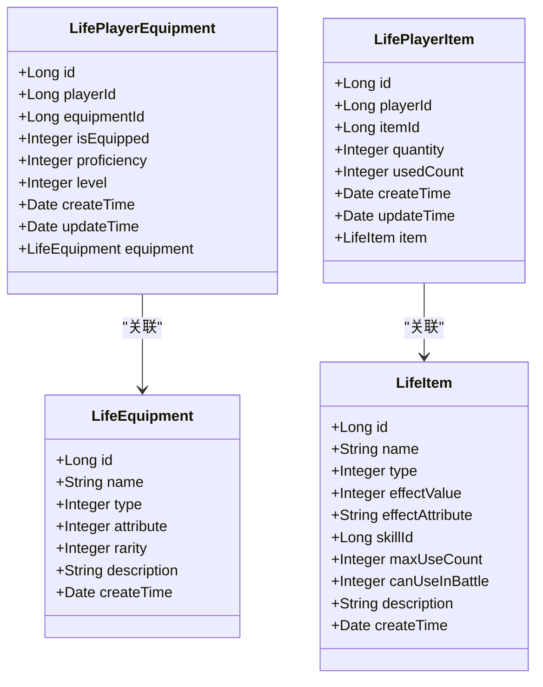
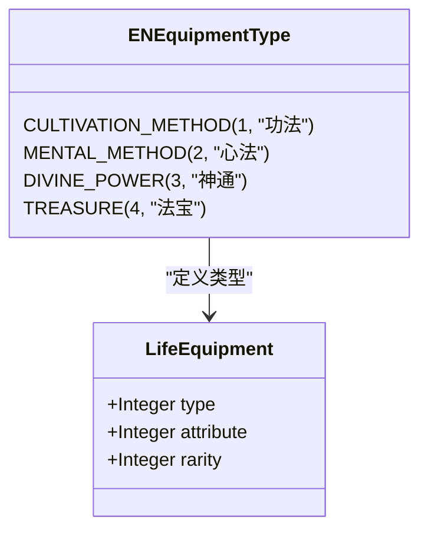
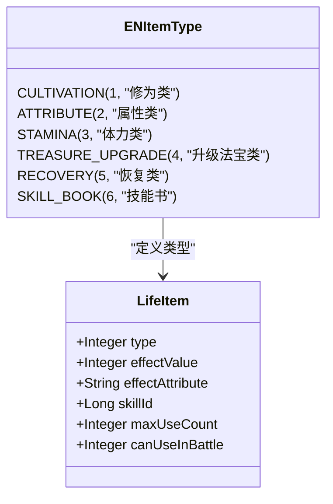
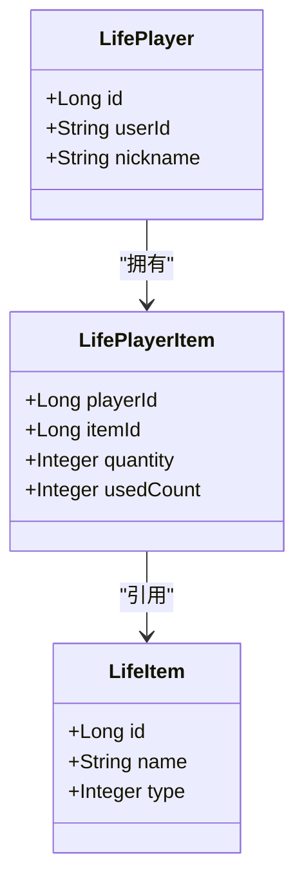
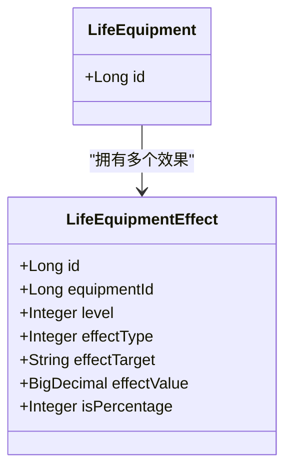
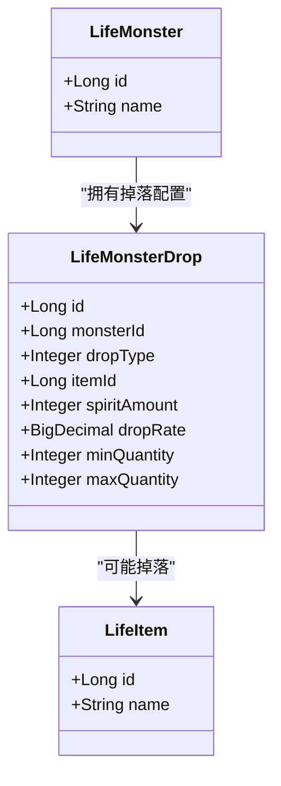
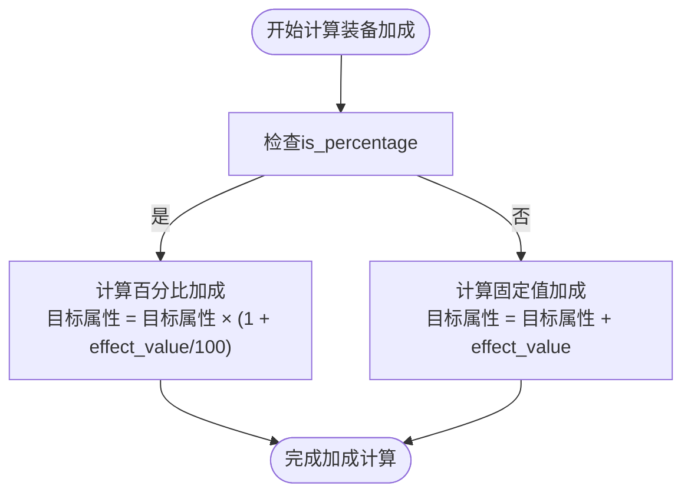
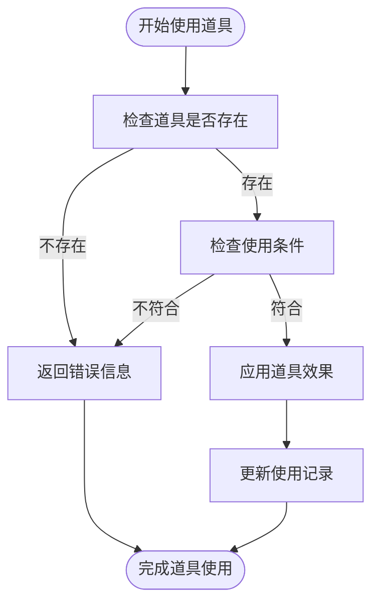

# 装备与道具系统数据模型

<cite>
**本文档引用的文件**   
- [LifeEquipment.java](file://Life\src\main\java\com\bot\life\dao\entity\LifeEquipment.java)
- [LifeItem.java](file://Life\src\main\java\com\bot\life\dao\entity\LifeItem.java)
- [LifePlayerEquipment.java](file://Life\src\main\java\com\bot\life\dao\entity\LifePlayerEquipment.java)
- [LifePlayerItem.java](file://Life\src\main\java\com\bot\life\dao\entity\LifePlayerItem.java)
- [LifeMonsterDrop.java](file://Life\src\main\java\com\bot\life\dao\entity\LifeMonsterDrop.java)
- [Life_Database_Init.sql](file://Life_Database_Init.sql)
- [ENEquipmentType.java](file://Life\src\main\java\com\bot\life\enums\ENEquipmentType.java)
- [ENItemType.java](file://Life\src\main\java\com\bot\life\enums\ENItemType.java)
</cite>

## 目录
1. [系统概述](#系统概述)
2. [核心实体设计](#核心实体设计)
3. [装备系统](#装备系统)
4. [道具系统](#道具系统)
5. [玩家背包管理](#玩家背包管理)
6. [装备效果机制](#装备效果机制)
7. [道具掉落机制](#道具掉落机制)
8. [装备熟练度与等级系统](#装备熟练度与等级系统)
9. [道具使用限制](#道具使用限制)
10. [装备属性加成计算](#装备属性加成计算)
11. [道具使用流程](#道具使用流程)

## 系统概述

装备与道具系统是浮生卷修仙游戏的核心组成部分，为玩家提供属性加成、战斗辅助和角色成长的重要途径。本系统包含两大核心模块：装备系统和道具系统。装备系统涵盖功法、心法、神通、法宝四类，通过装备效果表实现灵活的属性加成机制；道具系统包含修为类、属性类、恢复类、技能书等多种类型，支持战斗内外的多样化使用。系统通过玩家装备表和玩家道具表管理玩家持有的物品，结合数据库初始化脚本中的详细配置，实现了完整的物品管理和使用逻辑。

**本节来源**
- [Life_Database_Init.sql](file://Life_Database_Init.sql#L1-L646)

## 核心实体设计

本系统的核心实体包括LifeEquipment（装备基础实体）、LifeItem（道具实体）、LifePlayerEquipment（玩家装备实体）和LifePlayerItem（玩家道具实体）。这些实体构成了装备与道具系统的数据基础，通过合理的设计实现了装备与道具的分类管理、效果配置和玩家持有关系。



**图示来源**
- [LifeEquipment.java](file://Life\src\main\java\com\bot\life\dao\entity\LifeEquipment.java#L1-L21)
- [LifeItem.java](file://Life\src\main\java\com\bot\life\dao\entity\LifeItem.java#L1-L24)
- [LifePlayerEquipment.java](file://Life\src\main\java\com\bot\life\dao\entity\LifePlayerEquipment.java#L1-L25)
- [LifePlayerItem.java](file://Life\src\main\java\com\bot\life\dao\entity\LifePlayerItem.java#L1-L24)

**本节来源**
- [LifeEquipment.java](file://Life\src\main\java\com\bot\life\dao\entity\LifeEquipment.java#L1-L21)
- [LifeItem.java](file://Life\src\main\java\com\bot\life\dao\entity\LifeItem.java#L1-L24)
- [LifePlayerEquipment.java](file://Life\src\main\java\com\bot\life\dao\entity\LifePlayerEquipment.java#L1-L25)
- [LifePlayerItem.java](file://Life\src\main\java\com\bot\life\dao\entity\LifePlayerItem.java#L1-L24)

## 装备系统

装备系统包含功法、心法、神通、法宝四类装备，每类装备都有独特的属性加成效果。装备通过LifeEquipment实体定义基础信息，包括名称、类型、属性、稀有度等。装备类型通过ENEquipmentType枚举定义，确保类型值的统一和可维护性。



**图示来源**
- [ENEquipmentType.java](file://Life\src\main\java\com\bot\life\enums\ENEquipmentType.java#L1-L38)
- [LifeEquipment.java](file://Life\src\main\java\com\bot\life\dao\entity\LifeEquipment.java#L1-L21)

**本节来源**
- [ENEquipmentType.java](file://Life\src\main\java\com\bot\life\enums\ENEquipmentType.java#L1-L38)
- [LifeEquipment.java](file://Life\src\main\java\com\bot\life\dao\entity\LifeEquipment.java#L1-L21)

## 道具系统

道具系统包含修为类、属性类、体力类、升级法宝类、恢复类、技能书六类道具，满足玩家在修仙过程中的各种需求。道具通过LifeItem实体定义基础信息，不同类型的道具具有不同的效果配置。道具类型通过ENItemType枚举定义，确保类型值的统一和可维护性。



**图示来源**
- [ENItemType.java](file://Life\src\main\java\com\bot\life\enums\ENItemType.java#L1-L40)
- [LifeItem.java](file://Life\src\main\java\com\bot\life\dao\entity\LifeItem.java#L1-L24)

**本节来源**
- [ENItemType.java](file://Life\src\main\java\com\bot\life\enums\ENItemType.java#L1-L40)
- [LifeItem.java](file://Life\src\main\java\com\bot\life\dao\entity\LifeItem.java#L1-L24)

## 玩家背包管理

玩家背包管理通过LifePlayerItem实体实现，记录玩家持有的道具及其数量。系统支持道具的添加、使用和数量更新，确保背包数据的准确性和一致性。玩家背包与玩家角色通过playerId关联，实现玩家与道具的归属关系。



**图示来源**
- [LifePlayerItem.java](file://Life\src\main\java\com\bot\life\dao\entity\LifePlayerItem.java#L1-L24)
- [Life_Database_Init.sql](file://Life_Database_Init.sql#L204-L214)

**本节来源**
- [LifePlayerItem.java](file://Life\src\main\java\com\bot\life\dao\entity\LifePlayerItem.java#L1-L24)
- [Life_Database_Init.sql](file://Life_Database_Init.sql#L204-L214)

## 装备效果机制

装备效果通过life_equipment_effect表实现，支持百分比和固定值两种加成方式。每条装备效果记录包含装备ID、等级、效果类型、目标字段、数值和是否百分比等信息。这种设计使得装备效果配置灵活，可以实现各种复杂的属性加成逻辑。



**图示来源**
- [Life_Database_Init.sql](file://Life_Database_Init.sql#L76-L87)

**本节来源**
- [Life_Database_Init.sql](file://Life_Database_Init.sql#L76-L87)

## 道具掉落机制

道具掉落通过life_monster_drop表实现，配置怪物的掉落概率和数量范围。每条掉落记录包含怪物ID、掉落类型、道具ID、灵粹数量、掉落概率、最小和最大掉落数量等信息。这种设计使得怪物掉落配置灵活，可以实现多样化的掉落策略。



**图示来源**
- [LifeMonsterDrop.java](file://Life\src\main\java\com\bot\life\dao\entity\LifeMonsterDrop.java#L1-L28)
- [Life_Database_Init.sql](file://Life_Database_Init.sql#L164-L176)

**本节来源**
- [LifeMonsterDrop.java](file://Life\src\main\java\com\bot\life\dao\entity\LifeMonsterDrop.java#L1-L28)
- [Life_Database_Init.sql](file://Life_Database_Init.sql#L164-L176)

## 装备熟练度与等级系统

法宝类装备支持熟练度和等级系统，通过LifePlayerEquipment实体中的proficiency和level字段实现。玩家在使用法宝过程中可以提升熟练度，当熟练度达到一定程度时可以提升法宝等级，从而增强法宝的效果。这种设计增加了法宝培养的深度和玩家的成长感。

```mermaid
classDiagram
class LifePlayerEquipment {
+Integer proficiency
+Integer level
+Integer isEquipped
}
class LifeEquipment {
+Integer type
}
LifePlayerEquipment --> LifeEquipment : "关联装备"
note right of LifePlayerEquipment
熟练度和等级仅对法宝类装备有效
装备后才能获得熟练度增长
end note
```

**图示来源**
- [LifePlayerEquipment.java](file://Life\src\main\java\com\bot\life\dao\entity\LifePlayerEquipment.java#L1-L25)

**本节来源**
- [LifePlayerEquipment.java](file://Life\src\main\java\com\bot\life\dao\entity\LifePlayerEquipment.java#L1-L25)

## 道具使用限制

道具使用限制通过LifeItem实体中的maxUseCount字段实现，支持无限制使用和有限次使用两种模式。对于属性类道具，如大力丸、迅捷散等，设置使用次数限制以平衡游戏性。系统通过usedCount字段跟踪玩家已使用次数，确保道具使用符合规则。

```mermaid
classDiagram
class LifeItem {
+Integer maxUseCount
+Integer canUseInBattle
}
class LifePlayerItem {
+Integer quantity
+Integer usedCount
}
LifeItem --> LifePlayerItem : "被玩家持有"
note right of LifeItem
maxUseCount = -1 表示无限制
maxUseCount > 0 表示最大使用次数
canUseInBattle = 1 表示可在战斗中使用
end note
```

**图示来源**
- [LifeItem.java](file://Life\src\main\java\com\bot\life\dao\entity\LifeItem.java#L1-L24)

**本节来源**
- [LifeItem.java](file://Life\src\main\java\com\bot\life\dao\entity\LifeItem.java#L1-L24)

## 装备属性加成计算

装备属性加成计算基于life_equipment_effect表中的配置，根据是否百分比标志应用不同的计算公式。对于固定值加成，直接将效果数值加到目标属性上；对于百分比加成，将目标属性乘以效果数值的百分比后加到目标属性上。这种设计使得装备效果既可以直接增加属性值，也可以按比例提升属性。



**图示来源**
- [Life_Database_Init.sql](file://Life_Database_Init.sql#L76-L87)

**本节来源**
- [Life_Database_Init.sql](file://Life_Database_Init.sql#L76-L87)

## 道具使用流程

道具使用流程包括检查道具是否存在、检查使用条件、应用道具效果和更新使用记录等步骤。系统首先验证玩家是否持有指定道具，然后检查道具的使用限制和战斗状态，接着应用道具效果到玩家属性，最后更新道具数量或使用次数。对于技能书类道具，还需要处理技能学习逻辑。



**图示来源**
- [LifeItem.java](file://Life\src\main\java\com\bot\life\dao\entity\LifeItem.java#L1-L24)
- [LifePlayerItem.java](file://Life\src\main\java\com\bot\life\dao\entity\LifePlayerItem.java#L1-L24)

**本节来源**
- [LifeItem.java](file://Life\src\main\java\com\bot\life\dao\entity\LifeItem.java#L1-L24)
- [LifePlayerItem.java](file://Life\src\main\java\com\bot\life\dao\entity\LifePlayerItem.java#L1-L24)