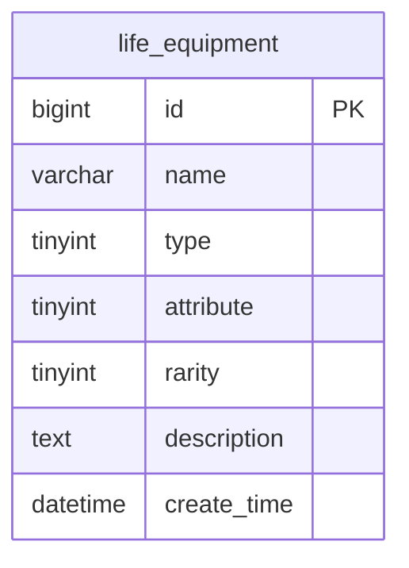
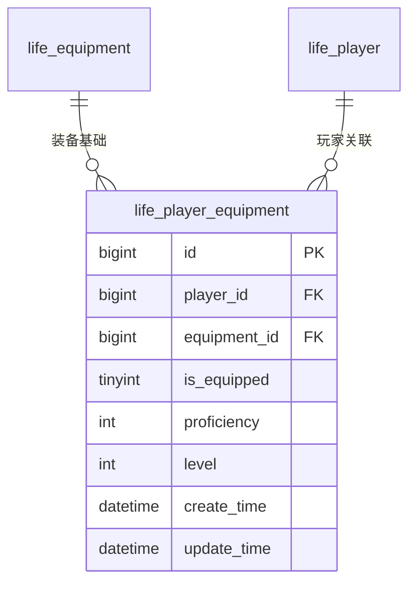
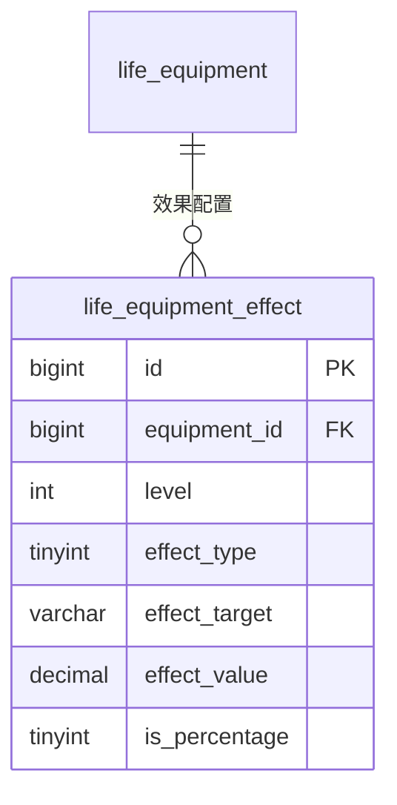
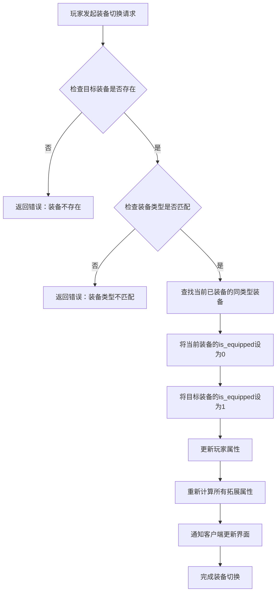

# 装备系统模型

<cite>
**本文档引用文件**   
- [LifeEquipment.java](file://Life\src\main\java\com\bot\life\dao\entity\LifeEquipment.java)
- [LifePlayerEquipment.java](file://Life\src\main\java\com\bot\life\dao\entity\LifePlayerEquipment.java)
- [Life_Database_Init.sql](file://Life_Database_Init.sql)
- [ENEquipmentType.java](file://Life\src\main\java\com\bot\life\enums\ENEquipmentType.java)
</cite>

## 目录
1. [引言](#引言)
2. [装备基础表设计](#装备基础表设计)
3. [玩家装备表设计](#玩家装备表设计)
4. [装备效果表设计](#装备效果表设计)
5. [装备属性加成计算公式](#装备属性加成计算公式)
6. [装备切换流程](#装备切换流程)
7. [结论](#结论)

## 引言
本文档详细解析Life游戏系统中的装备数据模型，重点分析LifeEquipment和LifePlayerEquipment实体的设计。通过结合数据库初始化脚本中的DDL语句，深入说明装备基础表、玩家装备表和装备效果表的结构设计与实现机制。文档将详细阐述装备类型、属性、稀有度等级等核心概念，以及装备状态管理和法宝特有机制。

## 装备基础表设计

装备基础表（life_equipment）定义了游戏中所有装备的基础属性和信息。该表存储了装备的静态数据，为游戏中的装备系统提供基础支持。



**图表来源**
- [Life_Database_Init.sql](file://Life_Database_Init.sql#L50-L60)
- [LifeEquipment.java](file://Life\src\main\java\com\bot\life\dao\entity\LifeEquipment.java#L10-L20)

### 装备类型
装备类型字段（type）采用整数编码方式，定义了四种主要装备类别：
- **1：功法** - 提供基础修炼能力的装备
- **2：心法** - 影响心性修炼的装备
- **3：神通** - 赋予特殊能力的装备
- **4：法宝** - 具有强大威力的特殊装备

这些类型通过ENEquipmentType枚举类进行管理，确保类型值的一致性和可维护性。

### 装备属性
装备属性字段（attribute）采用五行属性系统，支持金、木、水、火、土五种属性：
- **0：无属性** - 不具备特定元素属性
- **1：金** - 金属性装备
- **2：木** - 木属性装备
- **3：水** - 水属性装备
- **4：火** - 火属性装备
- **5：土** - 土属性装备

这种五行相生相克的设计为游戏战斗系统提供了策略深度。

### 稀有度等级
稀有度字段（rarity）定义了装备的品质等级，共分为五个级别：
- **1：普通** - 基础品质装备
- **2：精良** - 较高品质装备
- **3：稀有** - 稀有品质装备
- **4：史诗** - 高级品质装备
- **5：传说** - 顶级品质装备

稀有度不仅影响装备的基础属性，还决定了装备的获取难度和市场价值。

**本节来源**
- [Life_Database_Init.sql](file://Life_Database_Init.sql#L50-L60)
- [LifeEquipment.java](file://Life\src\main\java\com\bot\life\dao\entity\LifeEquipment.java#L10-L20)
- [ENEquipmentType.java](file://Life\src\main\java\com\bot\life\enums\ENEquipmentType.java#L7-L11)

## 玩家装备表设计

玩家装备表（life_player_equipment）记录了玩家与装备之间的关联关系，是装备系统的核心数据表之一。该表不仅存储了玩家持有的装备信息，还管理着装备的状态和动态属性。



**图表来源**
- [Life_Database_Init.sql](file://Life_Database_Init.sql#L62-L74)
- [LifePlayerEquipment.java](file://Life\src\main\java\com\bot\life\dao\entity\LifePlayerEquipment.java#L10-L24)

### 装备状态管理
is_equipped字段是装备状态管理的核心，采用二进制标志位设计：
- **0：未装备** - 装备存放在玩家背包中，不产生效果
- **1：已装备** - 装备已被激活，其属性加成生效

这种简单的状态设计便于快速查询和更新，支持高效的装备切换操作。当玩家切换装备时，系统只需更新相关记录的is_equipped字段值即可完成状态变更。

### 法宝特有机制
法宝作为特殊类型的装备，具有独特的熟练度和等级机制：

#### 熟练度（proficiency）
- 存储在proficiency字段中，类型为整数
- 仅对类型为法宝（type=4）的装备有效
- 反映玩家对法宝的掌握程度
- 可能影响法宝技能的触发概率或效果强度

#### 等级（level）
- 存储在level字段中，默认值为1
- 仅对法宝类装备有意义
- 代表法宝的成长阶段
- 等级提升可能解锁新的技能或增强现有能力

这种设计使得法宝不仅仅是静态的属性加成工具，而是可以随着玩家使用而成长的动态系统，增加了游戏的深度和可玩性。

**本节来源**
- [Life_Database_Init.sql](file://Life_Database_Init.sql#L62-L74)
- [LifePlayerEquipment.java](file://Life\src\main\java\com\bot\life\dao\entity\LifePlayerEquipment.java#L10-L24)

## 装备效果表设计

装备效果表（life_equipment_effect）实现了装备属性加成的多级设计，为装备系统提供了灵活的效果配置能力。该表支持不同等级、不同类型的效果配置，使得装备的成长曲线更加平滑和可预测。



**图表来源**
- [Life_Database_Init.sql](file://Life_Database_Init.sql#L76-L87)
- [LifeEquipment.java](file://Life\src\main\java\com\bot\life\dao\entity\LifeEquipment.java#L10-L20)

### 多级属性加成设计
装备效果表通过多个字段的组合，实现了复杂的属性加成系统：

#### 效果类型（effect_type）
定义了三种主要效果类别：
- **1：基础属性** - 直接影响角色的基础能力值
- **2：拓展属性** - 影响由基础属性衍生的次级属性
- **3：修炼速度** - 影响角色的修为增长效率

#### 效果目标（effect_target）
指定效果作用的具体属性字段，如：
- 攻击力（attackPower）
- 防御力（defense）
- 速度（speed）
- 血量（maxHealth）
- 会心率（criticalRate）

#### 效果数值实现方式
通过is_percentage字段区分两种数值表示方法：
- **0：固定值** - effect_value为直接加成数值
- **1：百分比** - effect_value为百分比值，需与基础值相乘计算

这种设计既支持直接的数值加成，也支持按比例的增强效果，为游戏平衡性调整提供了更大的灵活性。

**本节来源**
- [Life_Database_Init.sql](file://Life_Database_Init.sql#L76-L87)

## 装备属性加成计算公式

基于装备效果表的设计，装备属性加成的计算遵循以下公式：

### 基础属性加成
对于固定值加成：
```
最终属性值 = 基础属性值 + Σ(装备效果值)
```

对于百分比加成：
```
最终属性值 = 基础属性值 × (1 + Σ(装备效果值)/100)
```

### 拓展属性计算
拓展属性由基础属性计算得出，遵循以下规则：
- 每增加1点速度，破防增加0.005%
- 每增加1点体质，血量增加10点，防御增加1点
- 每增加1点灵力，会心率增加0.01%，会心效果增加0.005%
- 每增加1点力量，攻击力增加6点，破防增加0.01%

### 修炼速度加成
修炼速度的加成同时考虑固定值和百分比：
```
最终修炼速度 = (基础修炼速度 + 固定值加成) × (1 + 百分比加成/100)
```

这些计算公式确保了装备效果的可预测性和平衡性，为玩家提供了清晰的成长路径。

**本节来源**
- [Life_Database_Init.sql](file://Life_Database_Init.sql#L76-L87)
- [LifePlayer.java](file://Life\src\main\java\com\bot\life\dao\entity\LifePlayer.java#L56-L76)

## 装备切换流程

装备切换是玩家管理装备的核心操作，其流程如下：



**图表来源**
- [LifePlayerEquipment.java](file://Life\src\main\java\com\bot\life\dao\entity\LifePlayerEquipment.java#L16-L18)
- [LifePlayer.java](file://Life\src\main\java\com\bot\life\dao\entity\LifePlayer.java#L56-L76)

该流程确保了装备切换的原子性和一致性，避免了装备状态的混乱。通过先卸下旧装备再装备新装备的顺序，保证了同一时间同类型装备只有一个处于激活状态。

## 结论
本文档详细解析了Life游戏系统的装备数据模型，涵盖了装备基础表、玩家装备表和装备效果表的设计与实现。装备系统通过合理的数据库设计和业务逻辑，实现了丰富的装备类型、属性系统和成长机制。特别是法宝的熟练度和等级机制，为特殊装备提供了深度的成长体验。装备效果表的多级设计和灵活的数值表示方式，为游戏平衡性调整提供了强大的支持。整体设计既保证了系统的可扩展性，又为玩家提供了清晰的成长路径和策略选择。