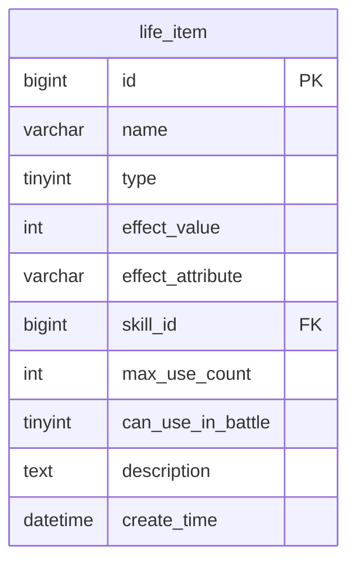
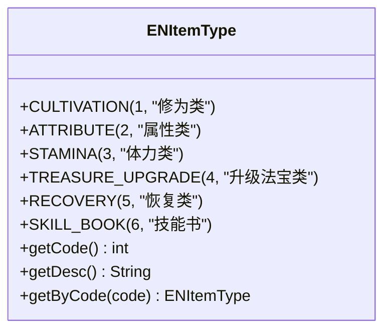
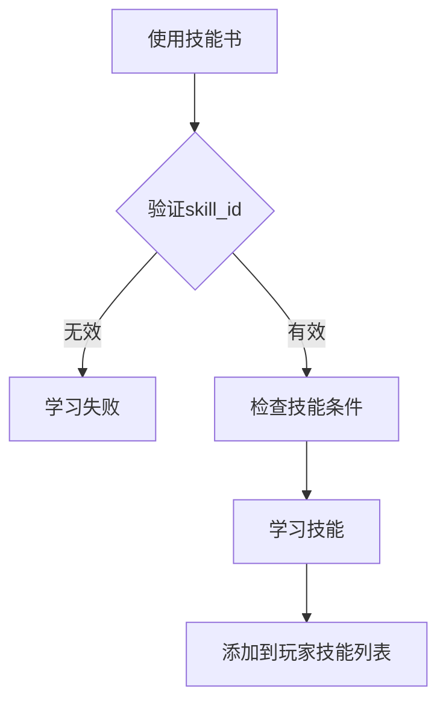
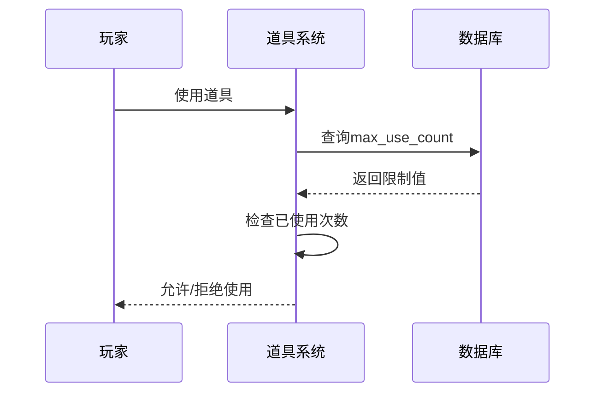
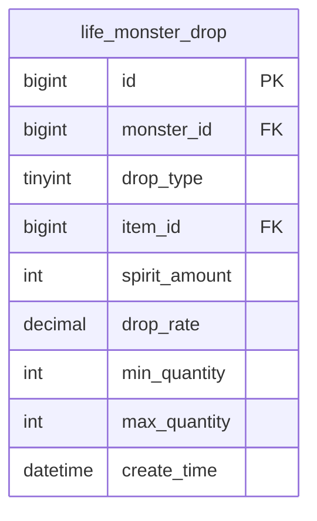
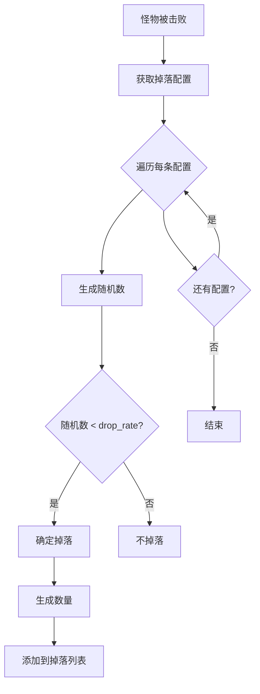

# 道具系统模型

<cite>
**本文档引用文件**  
- [LifeItem.java](file://Life/src/main/java/com/bot/life/dao/entity/LifeItem.java)
- [LifeMonsterDrop.java](file://Life/src/main/java/com/bot/life/dao/entity/LifeMonsterDrop.java)
- [Life_Database_Init.sql](file://Life_Database_Init.sql)
- [InventoryServiceImpl.java](file://Life/src/main/java/com/bot/life/service/impl/InventoryServiceImpl.java)
- [ENItemType.java](file://Life/src/main/java/com/bot/life/enums/ENItemType.java)
</cite>

## 目录
1. [道具基础表字段定义](#道具基础表字段定义)
2. [六种道具类型分类机制](#六种道具类型分类机制)
3. [核心字段作用分析](#核心字段作用分析)
4. [最大使用次数设计](#最大使用次数设计)
5. [道具掉落配置表概率机制](#道具掉落配置表概率机制)
6. [道具使用效果计算公式](#道具使用效果计算公式)
7. [道具掉落概率算法说明](#道具掉落概率算法说明)

## 道具基础表字段定义

道具基础表 `life_item` 是整个道具系统的核心数据表，定义了所有道具的通用属性和行为特征。该表通过结构化字段设计实现了对不同类型道具的统一管理和差异化处理。



**图表来源**  
- [Life_Database_Init.sql](file://Life_Database_Init.sql#L188-L201)
- [LifeItem.java](file://Life/src/main/java/com/bot/life/dao/entity/LifeItem.java#L13-L23)

**本节来源**  
- [Life_Database_Init.sql](file://Life_Database_Init.sql#L188-L201)
- [LifeItem.java](file://Life/src/main/java/com/bot/life/dao/entity/LifeItem.java#L13-L23)

## 六种道具类型分类机制

道具系统采用数字编码方式对道具进行分类管理，共定义了六种主要道具类型。这种分类机制通过 `type` 字段实现，确保了系统能够根据类型值准确识别和处理不同类别的道具。

| 类型编码 | 类型名称 | 枚举常量 | 用途说明 |
|---------|--------|---------|--------|
| 1 | 修为类 | CULTIVATION | 提供修为值，用于角色升级 |
| 2 | 属性类 | ATTRIBUTE | 永久提升角色基础属性 |
| 3 | 体力类 | STAMINA | 恢复角色体力值 |
| 4 | 升级法宝类 | TREASURE_UPGRADE | 用于法宝熟练度提升 |
| 5 | 恢复类 | RECOVERY | 战斗中恢复血量 |
| 6 | 技能书 | SKILL_BOOK | 学习新技能 |



**图表来源**  
- [ENItemType.java](file://Life/src/main/java/com/bot/life/enums/ENItemType.java#L7-L40)
- [Life_Database_Init.sql](file://Life_Database_Init.sql#L191)

**本节来源**  
- [ENItemType.java](file://Life/src/main/java/com/bot/life/enums/ENItemType.java#L7-L40)
- [Life_Database_Init.sql](file://Life_Database_Init.sql#L191)

## 核心字段作用分析

### effect_value效果值

`effect_value` 字段存储道具的主要效果数值，其具体含义根据道具类型而变化：
- 修为类道具：表示增加的修为数量
- 体力类道具：表示恢复的体力点数
- 恢复类道具：表示恢复的血量数值
- 属性类道具：表示永久增加的属性点数

### effect_attribute影响属性

`effect_attribute` 字段专用于属性类道具，指定该道具影响的具体属性。系统支持四种可提升的基础属性：
- `speed`：速度
- `constitution`：体质
- `spirit_power`：灵力
- `strength`：力量

该字段通过字符串匹配机制与角色属性关联，确保属性加成的准确性。

### skill_id关联技能

`skill_id` 字段用于技能书类道具，存储其所对应技能的ID。当玩家使用技能书时，系统通过该字段查找并验证目标技能，实现技能学习功能。技能书道具的 `effect_value` 固定为0，因为其效果由关联技能决定而非数值。



**图表来源**  
- [LifeItem.java](file://Life/src/main/java/com/bot/life/dao/entity/LifeItem.java#L18)
- [InventoryServiceImpl.java](file://Life/src/main/java/com/bot/life/service/impl/InventoryServiceImpl.java#L270-L319)

**本节来源**  
- [LifeItem.java](file://Life/src/main/java/com/bot/life/dao/entity/LifeItem.java#L16-L18)
- [InventoryServiceImpl.java](file://Life/src/main/java/com/bot/life/service/impl/InventoryServiceImpl.java#L180-L319)

## 最大使用次数设计

`max_use_count` 字段控制道具的使用限制，采用整数类型存储最大可使用次数。该设计包含一个特殊约定：**-1表示无使用次数限制**。

对于属性类道具，此字段具有特殊意义。系统规定属性类道具（如大力丸、迅捷散等）每人限用10颗，这通过将 `max_use_count` 设置为10来实现。当玩家使用道具时，系统会检查已使用次数是否达到上限。



**图表来源**  
- [LifeItem.java](file://Life/src/main/java/com/bot/life/dao/entity/LifeItem.java#L19)
- [Life_Database_Init.sql](file://Life_Database_Init.sql#L195)

**本节来源**  
- [LifeItem.java](file://Life/src/main/java/com/bot/life/dao/entity/LifeItem.java#L19)
- [Life_Database_Init.sql](file://Life_Database_Init.sql#L195)

## 道具掉落配置表概率机制

`life_monster_drop` 表定义了怪物掉落系统的配置规则，包含概率和数量范围的设计。

### 概率机制

`drop_rate` 字段采用 `decimal(5,3)` 类型存储掉落概率，取值范围为0-1。例如：
- 0.15 表示15%掉落概率
- 0.50 表示50%掉落概率
- 0.90 表示90%掉落概率

### 数量范围设计

系统通过 `min_quantity` 和 `max_quantity` 两个字段定义掉落数量的随机范围：
- `min_quantity`：最小掉落数量
- `max_quantity`：最大掉落数量

例如，配置 `min_quantity=1, max_quantity=2, drop_rate=0.20` 表示有20%概率掉落1-2个道具。



**图表来源**  
- [Life_Database_Init.sql](file://Life_Database_Init.sql#L164-L176)
- [LifeMonsterDrop.java](file://Life/src/main/java/com/bot/life/dao/entity/LifeMonsterDrop.java#L13-L28)

**本节来源**  
- [Life_Database_Init.sql](file://Life_Database_Init.sql#L164-L176)
- [LifeMonsterDrop.java](file://Life/src/main/java/com/bot/life/dao/entity/LifeMonsterDrop.java#L13-L28)

## 道具使用效果计算公式

不同类型的道具具有不同的效果计算方式：

### 修为类道具
```
新修为 = 原修为 + effect_value
```

### 属性类道具
```
新属性值 = 原属性值 + effect_value
```
属性类型由 `effect_attribute` 字段决定。

### 体力类道具
```
新体力 = min(最大体力, 当前体力 + effect_value)
```

### 恢复类道具
```
新血量 = min(最大血量, 当前血量 + effect_value)
```

### 技能书道具
```
学习成功条件：
1. skill_id 有效
2. 未学习过该技能
3. 属性匹配（相同属性或无属性）
4. 等级 ≥ required_level
5. 修为 ≥ required_cultivation
```

```mermaid
flowchart TD
A[选择道具] --> B{道具类型}
B --> |修为类| C[修为 += effect_value]
B --> |属性类| D[属性 += effect_value]
B --> |体力类| E[体力 = min(上限, 当前+恢复值)]
B --> |恢复类| F[血量 = min(上限, 当前+恢复值)]
B --> |技能书| G[验证学习条件]
G --> H[学习技能]
```

**图表来源**  
- [InventoryServiceImpl.java](file://Life/src/main/java/com/bot/life/service/impl/InventoryServiceImpl.java#L180-L220)
- [Life_Database_Init.sql](file://Life_Database_Init.sql#L445-L466)

**本节来源**  
- [InventoryServiceImpl.java](file://Life/src/main/java/com/bot/life/service/impl/InventoryServiceImpl.java#L180-L220)

## 道具掉落概率算法说明

道具掉落概率算法基于随机数比较实现：

```
生成0-1之间的随机数rand
如果 rand < drop_rate 则掉落
否则不掉落
```

实际掉落数量在 `min_quantity` 和 `max_quantity` 之间随机生成：
```
实际数量 = min_quantity + random() % (max_quantity - min_quantity + 1)
```

系统在怪物被击败时执行掉落逻辑，遍历该怪物的所有掉落配置，对每条配置独立进行概率判断。这意味着一个怪物可能同时掉落多个不同类型的物品。



**图表来源**  
- [Life_Database_Init.sql](file://Life_Database_Init.sql#L410-L434)
- [LifeMonsterDrop.java](file://Life/src/main/java/com/bot/life/dao/entity/LifeMonsterDrop.java#L19-L21)

**本节来源**  
- [Life_Database_Init.sql](file://Life_Database_Init.sql#L410-L434)
- [LifeMonsterDrop.java](file://Life/src/main/java/com/bot/life/dao/entity/LifeMonsterDrop.java#L19-L21)