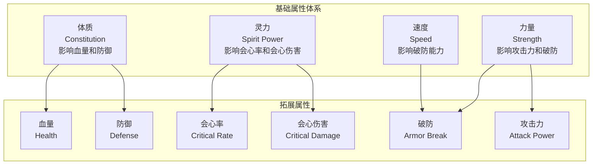
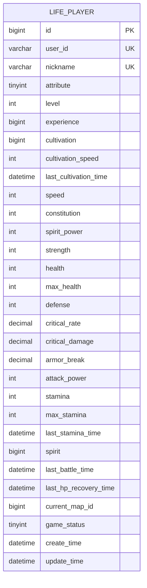
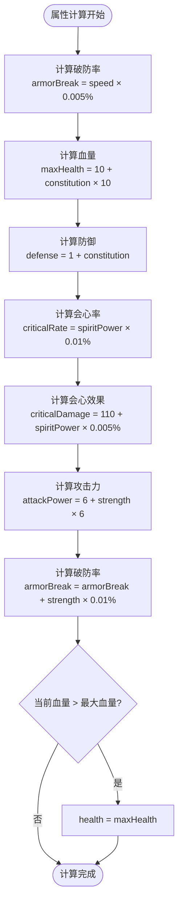
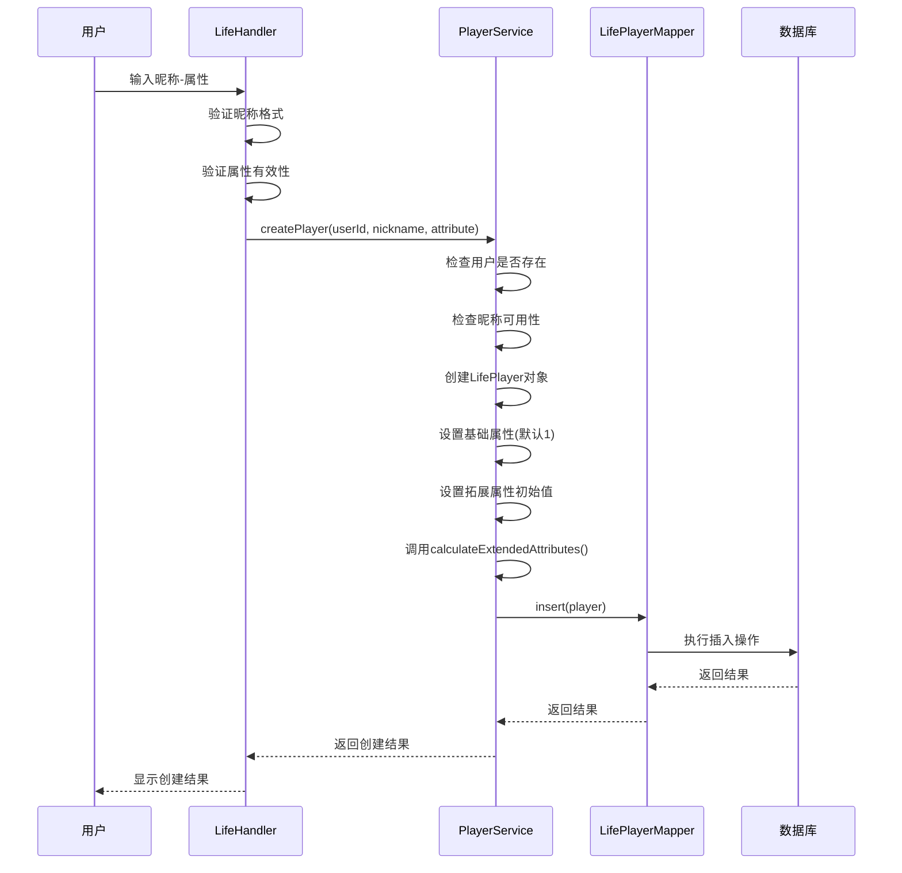
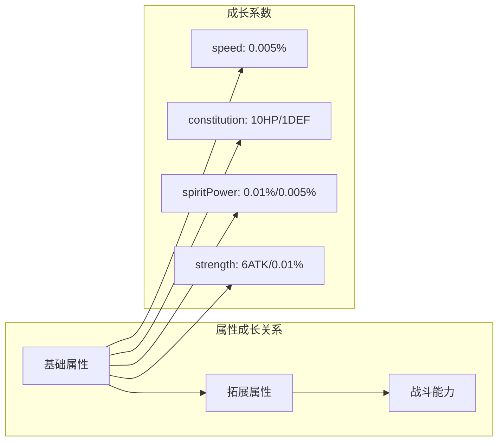
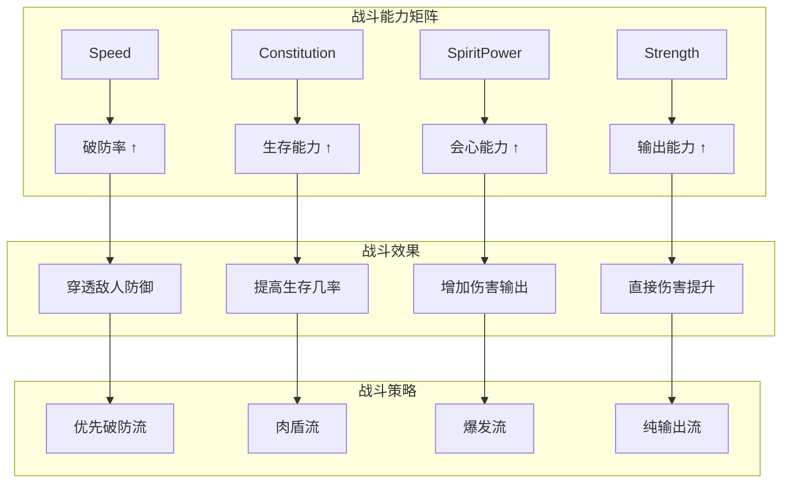
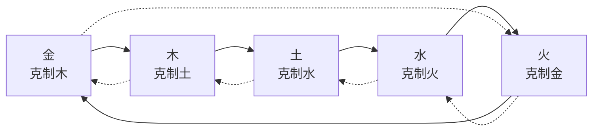

# 基础属性模型

<cite>
**本文档引用的文件**
- [LifePlayer.java](file://Life/src/main/java/com/robot/life/dao/entity/LifePlayer.java)
- [Life_Database_Init.sql](file://Life_Database_Init.sql)
- [PlayerServiceImpl.java](file://Life/src/main/java/com/robot/life/service/impl/PlayerServiceImpl.java)
- [ENAttribute.java](file://Life/src/main/java/com/robot/life/enums/ENAttribute.java)
- [ENPhantomAttribute.java](file://Game/src/main/java/com/robot/game/enums/ENPhantomAttribute.java)
- [LifePlayerMapper.xml](file://Life/src/main/resources/mapper/LifePlayerMapper.xml)
- [Life_Database_Tables_Check.md](file://Life_Database_Tables_Check.md)
</cite>

## 目录
1. [概述](#概述)
2. [基础属性设计](#基础属性设计)
3. [数据库架构](#数据库架构)
4. [属性计算机制](#属性计算机制)
5. [角色创建流程](#角色创建流程)
6. [属性成长曲线](#属性成长曲线)
7. [战斗能力影响](#战斗能力影响)
8. [属性关系分析](#属性关系分析)
9. [性能优化考虑](#性能优化考虑)
10. [总结](#总结)

## 概述

浮生卷的基础属性模型是一个精心设计的角色系统，通过四个核心属性（速度、体质、灵力、力量）构建了完整的战斗能力体系。该模型不仅体现了修仙世界的特色，还建立了科学合理的属性成长机制，为玩家提供了丰富的角色培养体验。

## 基础属性设计

### 四大核心属性

**图表来源**
- [LifePlayer.java](file://Life/src/main/java/com/robot/life/dao/entity/LifePlayer.java#L24-L28)
- [LifePlayer.java](file://Life/src/main/java/com/robot/life/dao/entity/LifePlayer.java#L30-L37)

### 属性特性分析

| 属性 | 英文名 | 初始值 | 成长系数 | 影响范围 |
|------|--------|--------|----------|----------|
| 速度 | speed | 1 | 0.005% | 破防率 |
| 体质 | constitution | 1 | 10点/血量, 1点/防御 | 血量上限, 防御力 |
| 灵力 | spiritPower | 1 | 0.01%/会心率, 0.005%/会心效果 | 会心率, 会心伤害 |
| 力量 | strength | 1 | 6点/攻击力, 0.01%/破防 | 攻击力, 破防率 |

**节来源**
- [LifePlayer.java](file://Life/src/main/java/com/robot/life/dao/entity/LifePlayer.java#L55-L75)
- [Life_Database_Init.sql](file://Life_Database_Init.sql#L17-L21)

## 数据库架构

### life_player表结构

**图表来源**
- [Life_Database_Init.sql](file://Life_Database_Init.sql#L6-L48)

### 约束条件和索引策略

| 字段 | 数据类型 | 约束 | 索引 | 说明 |
|------|----------|------|------|------|
| id | bigint | PRIMARY KEY, AUTO_INCREMENT | 主键索引 | 自增主键 |
| user_id | varchar(50) | NOT NULL, UNIQUE | 唯一索引 | 用户唯一标识 |
| nickname | varchar(21) | NOT NULL, UNIQUE | 唯一索引 | 角色昵称 |
| attribute | tinyint | NOT NULL | 无 | 角色属性(1-5) |
| speed | int | DEFAULT 1 | 无 | 基础属性 |
| constitution | int | DEFAULT 1 | 无 | 基础属性 |
| spirit_power | int | DEFAULT 1 | 无 | 基础属性 |
| strength | int | DEFAULT 1 | 无 | 基础属性 |
| critical_rate | decimal(5,3) | DEFAULT 0.000 | 无 | 拓展属性 |
| armor_break | decimal(5,3) | DEFAULT 0.000 | 无 | 拓展属性 |

**节来源**
- [Life_Database_Init.sql](file://Life_Database_Init.sql#L6-L48)
- [LifePlayerMapper.xml](file://Life/src/main/resources/mapper/LifePlayerMapper.xml#L77-L92)

## 属性计算机制

### 核心计算公式

**图表来源**
- [LifePlayer.java](file://Life/src/main/java/com/robot/life/dao/entity/LifePlayer.java#L55-L75)

### 具体计算实现

属性计算的核心逻辑体现在`calculateExtendedAttributes()`方法中，该方法建立了基础属性与拓展属性之间的数学关系：

1. **速度对破防的影响**：每点速度增加0.005%的破防率
2. **体质对生存能力的提升**：每点体质增加10点血量上限和1点防御
3. **灵力对输出能力的增强**：每点灵力增加0.01%会心率和0.005%会心效果
4. **力量对攻击力的直接提升**：每点力量增加6点攻击力和0.01%破防率

**节来源**
- [LifePlayer.java](file://Life/src/main/java/com/robot/life/dao/entity/LifePlayer.java#L55-L75)

## 角色创建流程

### 创建过程详解

**图表来源**
- [PlayerServiceImpl.java](file://Life/src/main/java/com/robot/life/service/impl/PlayerServiceImpl.java#L42-L106)
- [LifeHandlerImpl.java](file://Life/src/main/java/com/robot/life/service/impl/LifeHandlerImpl.java#L338-L382)

### 初始化参数设置

角色创建时的初始化逻辑确保了每个玩家都从相同的基础开始：

| 参数类别 | 字段名 | 初始值 | 说明 |
|----------|--------|--------|------|
| 基础属性 | speed | 1 | 初始速度 |
| 基础属性 | constitution | 1 | 初始体质 |
| 基础属性 | spiritPower | 1 | 初始灵力 |
| 基础属性 | strength | 1 | 初始力量 |
| 拓展属性 | health | 10 | 初始血量 |
| 拓展属性 | maxHealth | 10 | 初始最大血量 |
| 拓展属性 | defense | 1 | 初始防御 |
| 拓展属性 | criticalRate | 0.000 | 初始会心率 |
| 拓展属性 | criticalDamage | 110.000 | 初始会心效果 |
| 拓展属性 | armorBreak | 0.000 | 初始破防率 |
| 拓展属性 | attackPower | 6 | 初始攻击力 |
| 其他 | stamina | 100 | 初始体力 |
| 其他 | spirit | 1000 | 初始灵粹 |

**节来源**
- [PlayerServiceImpl.java](file://Life/src/main/java/com/robot/life/service/impl/PlayerServiceImpl.java#L54-L95)

## 属性成长曲线

### 基础属性成长规律

### 属性间的相互作用

1. **线性增长模式**：基础属性以固定比例影响拓展属性
2. **非线性战斗效果**：拓展属性的战斗效果呈现非线性增长
3. **平衡性设计**：不同属性之间保持相对平衡的增长速率

### 属性上限和限制

系统通过以下机制控制属性成长：
- **自然增长**：通过修炼和战斗获得属性点
- **装备加成**：通过装备提升属性值
- **境界突破**：在特定境界获得属性奖励
- **成就解锁**：达成特定条件获得属性加成

**节来源**
- [Life_Database_Init.sql](file://Life_Database_Init.sql#L482-L497)

## 战斗能力影响

### 属性对战斗系统的具体影响

### 各属性的战斗价值评估

| 属性 | 战斗价值 | 推荐玩法 | 适用场景 |
|------|----------|----------|----------|
| 速度 | 中等 | 平衡发展 | 大部分战斗场景 |
| 体质 | 高 | 坦克/肉盾 | PVE副本、团队战 |
| 灵力 | 高 | 输出/辅助 | PVP竞技、高难度副本 |
| 力量 | 中等 | 输出/战士 | 单挑、快速战斗 |

**节来源**
- [LifePlayer.java](file://Life/src/main/java/com/robot/life/dao/entity/LifePlayer.java#L55-L75)

## 属性关系分析

### 属性克制系统

系统实现了五行相生相克的属性关系：

**图表来源**
- [ENAttribute.java](file://Life/src/main/java/com/robot/life/enums/ENAttribute.java#L45-L63)

### 属性与技能的关联

不同属性的角色可以学习相应的技能，形成属性特色：
- **金属性**：擅长物理攻击，拥有强大的单体输出技能
- **木属性**：擅长治疗和辅助，拥有持续回复和增益技能
- **水属性**：擅长控制和防御，拥有减速和护盾技能
- **火属性**：擅长爆发和范围攻击，拥有高伤害AOE技能
- **土属性**：擅长防御和持久战，拥有减伤和耐久技能

**节来源**
- [ENAttribute.java](file://Life/src/main/java/com/robot/life/enums/ENAttribute.java#L8-L13)

## 性能优化考虑

### 数据访问优化

1. **批量计算**：在角色升级或属性变更时批量计算所有拓展属性
2. **缓存策略**：缓存计算结果，避免重复计算
3. **懒加载**：只在需要时才计算复杂的属性关系
4. **索引优化**：合理使用数据库索引加速查询

### 内存管理

1. **对象池化**：对于频繁创建的属性对象使用对象池
2. **弱引用**：对不常用的属性计算结果使用弱引用
3. **及时清理**：在适当时候清理不再需要的属性缓存

### 并发处理

1. **线程安全**：确保属性计算在多线程环境下的安全性
2. **锁机制**：对共享资源使用适当的锁机制
3. **原子操作**：使用原子操作减少锁的竞争

## 总结

浮生卷的基础属性模型通过精心设计的四维属性体系，构建了一个既符合修仙文化特色又具有科学合理性的游戏机制。该模型的主要特点包括：

1. **系统性设计**：四大基础属性与多种拓展属性形成了完整的属性体系
2. **平衡性考虑**：各属性之间保持合理的成长比例和战斗价值
3. **策略多样性**：不同的属性组合为玩家提供了多样化的培养策略
4. **扩展性强**：模块化的设计便于未来添加新的属性和功能
5. **性能优化**：合理的算法设计和数据结构保证了良好的运行效率

这种基础属性模型不仅为游戏提供了丰富的玩法深度，也为玩家创造了个性化的角色培养体验，是整个游戏系统的重要基石。