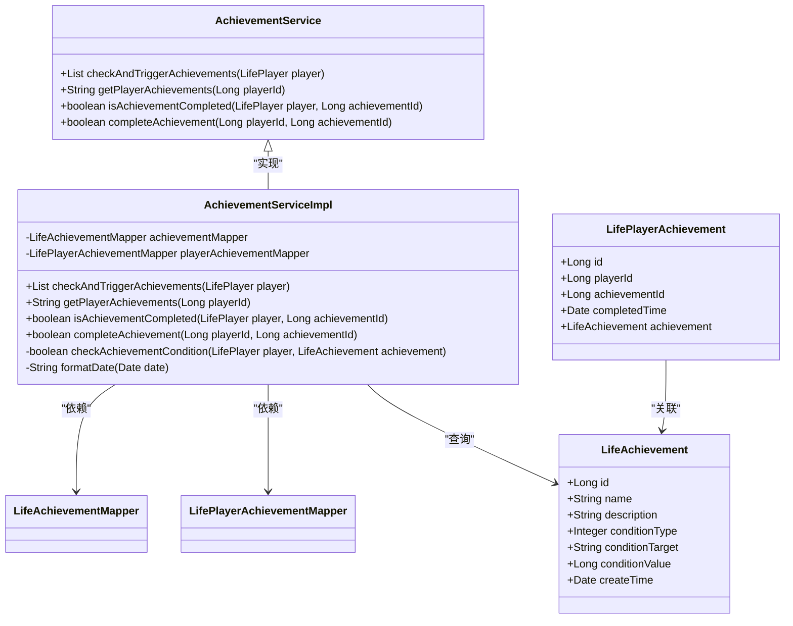
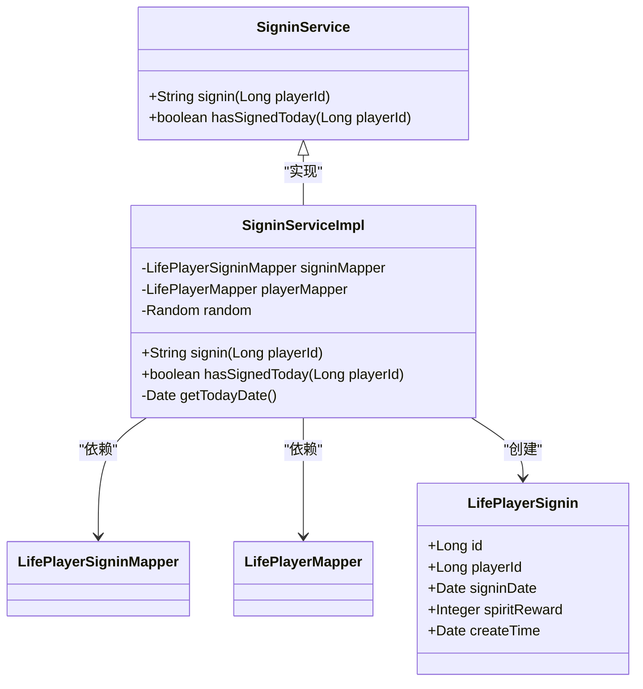
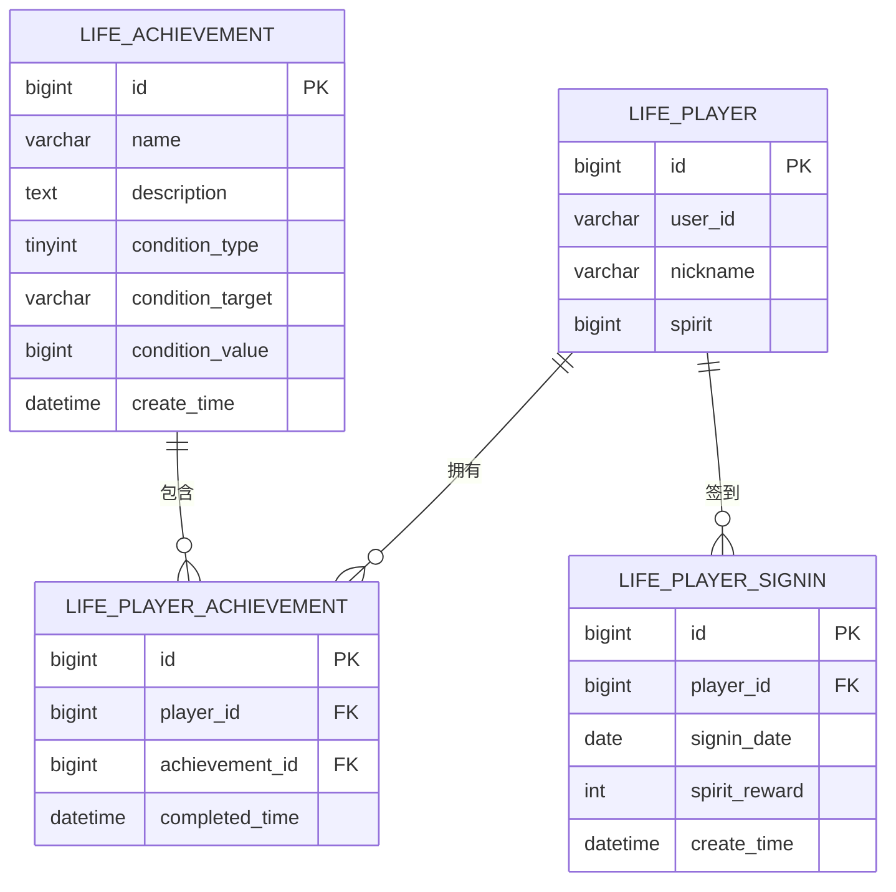
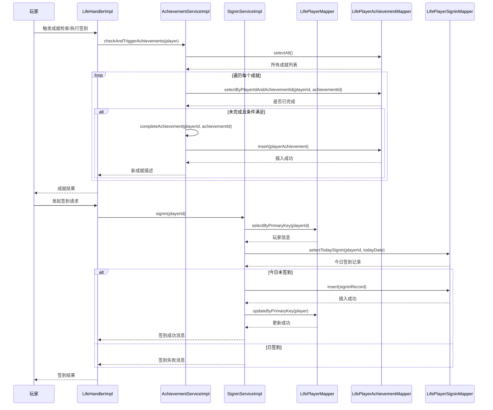

# 成就与签到系统

<cite>
**本文档引用文件**  
- [LifePlayerAchievement.java](file://Life/src/main/java/com/bot/life/dao/entity/LifePlayerAchievement.java)
- [LifePlayerSignin.java](file://Life/src/main/java/com/bot/life/dao/entity/LifePlayerSignin.java)
- [AchievementService.java](file://Life/src/main/java/com/bot/life/service/AchievementService.java)
- [AchievementServiceImpl.java](file://Life/src/main/java/com/bot/life/service/impl/AchievementServiceImpl.java)
- [SigninService.java](file://Life/src/main/java/com/bot/life/service/SigninService.java)
- [SigninServiceImpl.java](file://Life/src/main/java/com/bot/life/service/impl/SigninServiceImpl.java)
- [LifePlayerAchievementMapper.xml](file://Life/src/main/resources/mapper/LifePlayerAchievementMapper.xml)
- [LifePlayerSigninMapper.xml](file://Life/src/main/resources/mapper/LifePlayerSigninMapper.xml)
- [Life_Database_Init.sql](file://Life_Database_Init.sql)
</cite>

## 目录
1. [简介](#简介)
2. [数据模型设计](#数据模型设计)
3. [核心业务逻辑](#核心业务逻辑)
4. [数据库表结构与索引策略](#数据库表结构与索引策略)
5. [系统交互时序图](#系统交互时序图)
6. [查询模式分析](#查询模式分析)

## 简介
本文档全面解析浮生卷游戏中的成就与签到系统，涵盖数据模型设计、业务逻辑实现、数据库结构优化及系统间交互机制。系统包含两个核心子系统：成就系统用于记录玩家达成的各项成就，签到系统用于管理每日签到奖励。两个系统均采用Spring Boot + MyBatis架构，通过清晰的实体设计和高效的服务接口实现功能。

## 数据模型设计

### 成就系统数据模型
成就系统采用主从表结构设计，包含基础成就表（`LifeAchievement`）和玩家成就关联表（`LifePlayerAchievement`）。这种设计实现了成就定义与玩家完成状态的解耦，支持成就的统一管理和个性化记录。

**LifeAchievement实体设计**：
- `id`: 成就唯一标识
- `name`: 成就名称
- `description`: 成就描述
- `conditionType`: 触发条件类型（1属性达到，2等级达到）
- `conditionTarget`: 条件目标字段（如"level"、"experience"）
- `conditionValue`: 达标数值
- `createTime`: 创建时间

**LifePlayerAchievement实体设计**：
- `id`: 主键ID
- `playerId`: 玩家ID，关联玩家
- `achievementId`: 成就ID，关联基础成就
- `completedTime`: 完成时间，精确到秒
- `achievement`: 关联的成就对象（用于查询时的级联）

该设计通过`playerId`和`achievementId`的组合确保了玩家成就记录的唯一性，避免重复完成。

### 签到系统数据模型
签到系统设计简洁高效，专注于记录玩家每日签到行为和奖励发放。

**LifePlayerSignin实体设计**：
- `id`: 主键ID
- `playerId`: 玩家ID，建立与玩家的关联
- `signinDate`: 签到日期，仅保留年月日，用于判断当日是否已签到
- `spiritReward`: 获得的灵粹奖励数量
- `createTime`: 签到创建时间，精确到毫秒

通过将`signinDate`字段设计为DATE类型而非DATETIME，系统能够高效地进行日期匹配查询，这是签到系统的核心查询模式。

**Section sources**
- [LifePlayerAchievement.java](file://Life/src/main/java/com/bot/life/dao/entity/LifePlayerAchievement.java#L1-L21)
- [LifePlayerSignin.java](file://Life/src/main/java/com/bot/life/dao/entity/LifePlayerSignin.java#L1-L19)

## 核心业务逻辑

### 成就服务接口与实现
`AchievementService`接口定义了成就系统的核心功能，`AchievementServiceImpl`类提供了具体实现。

#### 核心方法分析
- `checkAndTriggerAchievements(LifePlayer player)`: 检查并触发成就，遍历所有成就，通过反射机制动态检查玩家属性是否满足条件
- `getPlayerAchievements(Long playerId)`: 获取玩家成就列表，返回格式化的成就展示文本
- `isAchievementCompleted(LifePlayer player, Long achievementId)`: 检查特定成就是否已完成
- `completeAchievement(Long playerId, Long achievementId)`: 完成成就，创建完成记录

#### 动态条件检查机制
系统采用反射机制实现动态条件检查，`checkAchievementCondition`方法通过`LifePlayer`类的字段名（`conditionTarget`）获取对应属性值，并与`conditionValue`比较。这种设计使得成就条件配置高度灵活，无需修改代码即可新增成就。



**Diagram sources**
- [AchievementService.java](file://Life/src/main/java/com/bot/life/service/AchievementService.java#L1-L43)
- [AchievementServiceImpl.java](file://Life/src/main/java/com/bot/life/service/impl/AchievementServiceImpl.java#L1-L137)
- [LifeAchievement.java](file://Life/src/main/java/com/bot/life/dao/entity/LifeAchievement.java#L1-L21)
- [LifePlayerAchievement.java](file://Life/src/main/java/com/bot/life/dao/entity/LifePlayerAchievement.java#L1-L21)

### 签到服务接口与实现
`SigninService`接口和`SigninServiceImpl`类构成了签到系统的核心。

#### 核心方法分析
- `signin(Long playerId)`: 处理玩家签到请求，包含完整性校验、重复签到检查、奖励发放等完整流程
- `hasSignedToday(Long playerId)`: 检查玩家今日是否已签到，是签到流程的关键前置校验

#### 签到流程逻辑
1. 验证玩家存在性
2. 调用`hasSignedToday`检查当日签到状态
3. 生成随机灵粹奖励（1-100）
4. 创建签到记录并保存
5. 更新玩家灵粹余额
6. 返回格式化的签到结果



**Diagram sources**
- [SigninService.java](file://Life/src/main/java/com/bot/life/service/SigninService.java#L1-L23)
- [SigninServiceImpl.java](file://Life/src/main/java/com/bot/life/service/impl/SigninServiceImpl.java#L1-L93)
- [LifePlayerSignin.java](file://Life/src/main/java/com/bot/life/dao/entity/LifePlayerSignin.java#L1-L19)

**Section sources**
- [AchievementService.java](file://Life/src/main/java/com/bot/life/service/AchievementService.java#L1-L43)
- [AchievementServiceImpl.java](file://Life/src/main/java/com/bot/life/service/impl/AchievementServiceImpl.java#L1-L137)
- [SigninService.java](file://Life/src/main/java/com/bot/life/service/SigninService.java#L1-L23)
- [SigninServiceImpl.java](file://Life/src/main/java/com/bot/life/service/impl/SigninServiceImpl.java#L1-L93)

## 数据库表结构与索引策略

### 成就系统表结构
根据`Life_Database_Init.sql`脚本，成就系统包含两张核心表：

**life_achievement (成就表)**
```sql
CREATE TABLE IF NOT EXISTS `life_achievement` (
  `id` bigint NOT NULL AUTO_INCREMENT,
  `name` varchar(50) NOT NULL COMMENT '成就名称',
  `description` text COMMENT '成就描述',
  `condition_type` tinyint NOT NULL COMMENT '条件类型：1属性达到2等级达到',
  `condition_target` varchar(20) NOT NULL COMMENT '条件目标字段',
  `condition_value` bigint NOT NULL COMMENT '条件数值',
  `create_time` datetime DEFAULT CURRENT_TIMESTAMP,
  PRIMARY KEY (`id`)
) ENGINE=InnoDB DEFAULT CHARSET=utf8mb4 COMMENT='成就表';
```

**life_player_achievement (玩家成就表)**
```sql
CREATE TABLE IF NOT EXISTS `life_player_achievement` (
  `id` bigint NOT NULL AUTO_INCREMENT,
  `player_id` bigint NOT NULL COMMENT '玩家ID',
  `achievement_id` bigint NOT NULL COMMENT '成就ID',
  `completed_time` datetime DEFAULT CURRENT_TIMESTAMP COMMENT '完成时间',
  PRIMARY KEY (`id`),
  UNIQUE KEY `uk_player_achievement` (`player_id`, `achievement_id`)
) ENGINE=InnoDB DEFAULT CHARSET=utf8mb4 COMMENT='玩家成就表';
```

**索引策略分析**：
- 主键索引：`id`字段的PRIMARY KEY索引，用于精确查询
- 唯一复合索引：`uk_player_achievement`(`player_id`, `achievement_id`)，确保玩家不能重复完成同一成就，同时加速基于玩家和成就的联合查询

### 签到系统表结构

**life_player_signin (玩家签到表)**
```sql
-- 虽然SQL脚本中未直接定义，但根据Mapper XML可推断结构
CREATE TABLE IF NOT EXISTS `life_player_signin` (
  `id` bigint NOT NULL AUTO_INCREMENT,
  `player_id` bigint NOT NULL COMMENT '玩家ID',
  `signin_date` date NOT NULL COMMENT '签到日期',
  `spirit_reward` int NOT NULL COMMENT '灵粹奖励',
  `create_time` datetime DEFAULT CURRENT_TIMESTAMP,
  PRIMARY KEY (`id`),
  KEY `idx_player_date` (`player_id`, `signin_date`)
) ENGINE=InnoDB DEFAULT CHARSET=utf8mb4 COMMENT='玩家签到表';
```

**索引策略分析**：
- 主键索引：`id`字段的PRIMARY KEY索引
- 复合索引：建议创建`idx_player_date`(`player_id`, `signin_date`)索引，以优化`selectTodaySignin`查询性能



**Diagram sources**
- [Life_Database_Init.sql](file://Life_Database_Init.sql#L217-L248)
- [LifePlayerAchievementMapper.xml](file://Life/src/main/resources/mapper/LifePlayerAchievementMapper.xml#L1-L56)
- [LifePlayerSigninMapper.xml](file://Life/src/main/resources/mapper/LifePlayerSigninMapper.xml#L1-L53)

**Section sources**
- [Life_Database_Init.sql](file://Life_Database_Init.sql#L217-L248)
- [LifePlayerAchievementMapper.xml](file://Life/src/main/resources/mapper/LifePlayerAchievementMapper.xml#L1-L56)
- [LifePlayerSigninMapper.xml](file://Life/src/main/resources/mapper/LifePlayerSigninMapper.xml#L1-L53)

## 系统交互时序图
以下时序图展示了玩家行为如何触发成就和签到系统的创建流程：



**Diagram sources**
- [AchievementServiceImpl.java](file://Life/src/main/java/com/bot/life/service/impl/AchievementServiceImpl.java#L31-L54)
- [SigninServiceImpl.java](file://Life/src/main/java/com/bot/life/service/impl/SigninServiceImpl.java#L32-L72)

## 查询模式分析

### 成就系统查询模式
成就系统主要有三种查询模式：
1. **玩家成就列表查询**：通过`selectByPlayerId`方法，按完成时间倒序排列，用于展示玩家所有成就
2. **成就完成状态检查**：通过`selectByPlayerIdAndAchievementId`方法，检查特定成就是否已完成，用于避免重复完成
3. **基础成就查询**：通过`selectAll`方法获取所有成就定义，用于条件检查

这些查询均通过MyBatis Mapper接口定义，并在XML中配置了相应的SQL语句，确保了数据访问的高效性和可维护性。

### 签到系统查询模式
签到系统的核心查询模式是**基于玩家ID和日期的复合查询**，通过`selectTodaySignin`方法实现：
```xml
<select id="selectTodaySignin" resultMap="BaseResultMap">
    select 
    <include refid="Base_Column_List" />
    from life_player_signin
    where player_id = #{playerId,jdbcType=BIGINT} 
    and signin_date = #{signinDate,jdbcType=DATE}
</select>
```
该查询模式通过`playerId`和`signinDate`的组合精确判断玩家当日签到状态。为优化此查询性能，建议在数据库中创建复合索引`idx_player_date`(`player_id`, `signin_date`)，可将查询复杂度从O(n)降低到O(log n)。

**Section sources**
- [LifePlayerAchievementMapper.xml](file://Life/src/main/resources/mapper/LifePlayerAchievementMapper.xml#L23-L36)
- [LifePlayerSigninMapper.xml](file://Life/src/main/resources/mapper/LifePlayerSigninMapper.xml#L24-L30)