# 状态管理系统

<cite>
**本文档引用的文件**
- [LifePlayer.java](file://Life/src/main/java/com/bot/life/dao/entity/LifePlayer.java)
- [LifePlayerMapper.java](file://Life/src/main/java/com/bot/life/dao/mapper/LifePlayerMapper.java)
- [LifePlayerMapper.xml](file://Life/src/main/resources/mapper/LifePlayerMapper.xml)
- [PlayerService.java](file://Life/src/main/java/com/bot/life/service/PlayerService.java)
- [PlayerServiceImpl.java](file://Life/src/main/java/com/bot/life/service/impl/PlayerServiceImpl.java)
- [LifeGameStatus.java](file://Life/src/main/java/com/bot/life/dao/entity/LifeGameStatus.java)
- [ENGameMode.java](file://Life/src/main/java/com/bot/life/enums/ENGameMode.java)
- [ENUserGameStatus.java](file://Common/src/main/java/com/bot/common/enums/ENUserGameStatus.java)
- [LifeHandlerImpl.java](file://Life/src/main/java/com/bot/life/service/impl/LifeHandlerImpl.java)
- [RealmServiceImpl.java](file://Life/src/main/java/com/bot/life/service/impl/RealmServiceImpl.java)
- [MapServiceImpl.java](file://Life/src/main/java/com/bot/life/service/impl/MapServiceImpl.java)
- [MapService.java](file://Life/src/main/java/com/bot/life/service/MapService.java)
- [LifeMap.java](file://Life/src/main/java/com/bot/life/dao/entity/LifeMap.java)
- [LifeMapMapper.java](file://Life/src/main/java/com/bot/life/dao/mapper/LifeMapMapper.java)
- [LifeMapMapper.xml](file://Life/src/main/resources/mapper/LifeMapMapper.xml)
- [JXCache.java](file://Game/src/main/java/com/bot/game/dao/entity/JXCache.java)
- [JXCacheMapper.java](file://Game/src/main/java/com/bot/game/dao/mapper/JXCacheMapper.java)
</cite>

## 目录
1. [系统概述](#系统概述)
2. [核心实体分析](#核心实体分析)
3. [状态管理架构](#状态管理架构)
4. [等级与经验值系统](#等级与经验值系统)
5. [修为系统](#修为系统)
6. [灵粹货币系统](#灵粹货币系统)
7. [地图状态管理](#地图状态管理)
8. [游戏状态枚举](#游戏状态枚举)
9. [数据持久化策略](#数据持久化策略)
10. [性能优化方案](#性能优化方案)
11. [故障排除指南](#故障排除指南)
12. [总结](#总结)

## 系统概述

状态管理系统是浮生卷游戏的核心组成部分，负责维护玩家的游戏状态、角色属性、修炼进度等关键数据。该系统采用分层架构设计，通过LifePlayer实体承载主要状态信息，并通过MyBatis框架实现高效的数据持久化。

系统的主要功能包括：
- 玩家状态的完整生命周期管理
- 等级与经验值的动态计算与升级机制
- 修为系统的修炼速度控制与上限管理
- 灵粹作为游戏货币的获取与消耗追踪
- 地图传送功能的状态同步
- 游戏状态的多维度枚举管理

## 核心实体分析

### LifePlayer实体结构

LifePlayer是状态管理系统的核心实体，包含了玩家的所有关键状态信息：

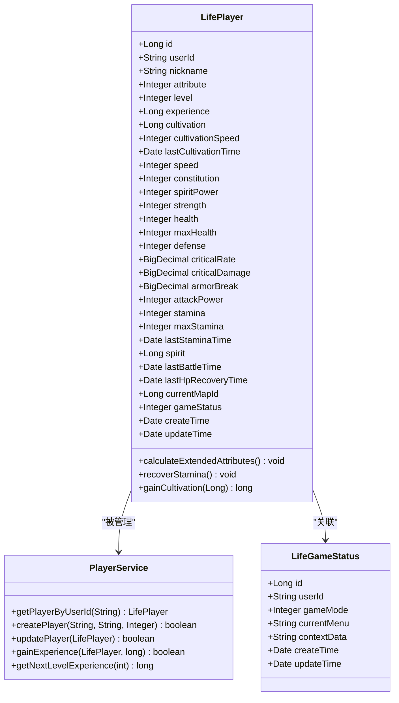

**图表来源**
- [LifePlayer.java](file://Life/src/main/java/com/bot/life/dao/entity/LifePlayer.java#L12-L128)
- [PlayerService.java](file://Life/src/main/java/com/bot/life/service/PlayerService.java#L9-L56)
- [LifeGameStatus.java](file://Life/src/main/java/com/bot/life/dao/entity/LifeGameStatus.java#L11-L20)

### 核心字段详解

#### 基础属性字段
- **level**: 玩家等级，决定角色的基本能力
- **experience**: 当前经验值，用于等级提升计算
- **attribute**: 角色属性（1金2木3水4火5土），影响战斗效果

#### 修炼相关字段
- **cultivation**: 修为值，代表修炼成果
- **cultivationSpeed**: 修炼速度，每分钟获得的修为量
- **lastCultivationTime**: 最后修炼时间，用于计算获得的修为

#### 战斗属性字段
- **health/maxHealth**: 血量相关属性
- **attackPower/defense**: 攻击防御属性
- **criticalRate/criticalDamage**: 暴击相关属性
- **armorBreak**: 破防属性

#### 生活系统字段
- **spirit**: 灵粹，游戏内货币
- **stamina/maxStamina**: 体力相关属性
- **currentMapId**: 当前所在地图ID

**章节来源**
- [LifePlayer.java](file://Life/src/main/java/com/bot/life/dao/entity/LifePlayer.java#L14-L48)

## 状态管理架构

### 分层架构设计

状态管理系统采用经典的三层架构：

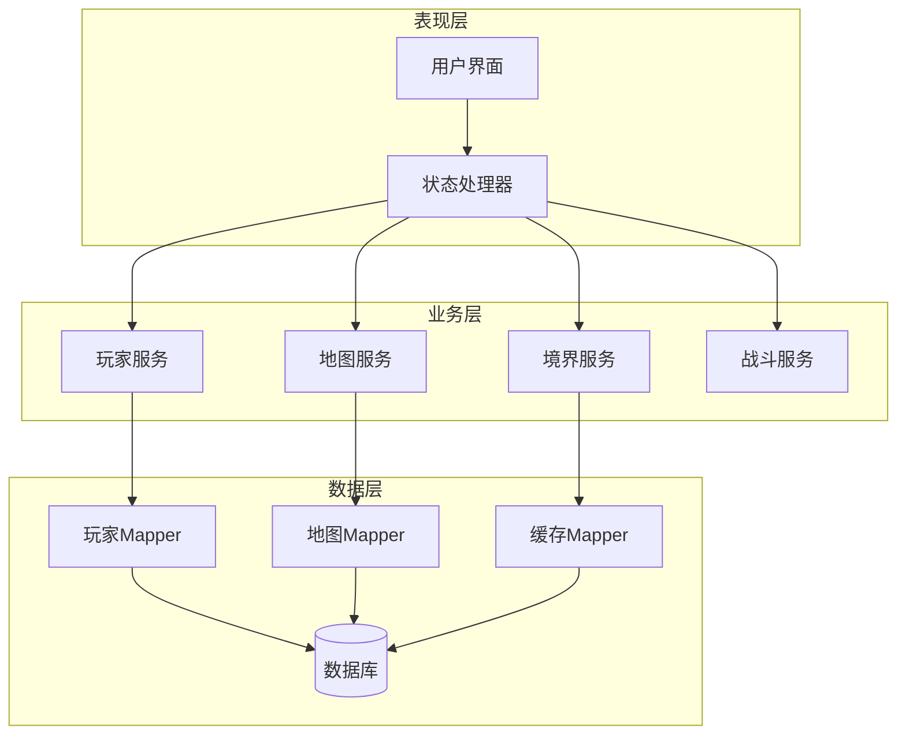

**图表来源**
- [LifeHandlerImpl.java](file://Life/src/main/java/com/bot/life/service/impl/LifeHandlerImpl.java#L1-L31)
- [PlayerService.java](file://Life/src/main/java/com/bot/life/service/PlayerService.java#L1-L56)
- [MapService.java](file://Life/src/main/java/com/bot/life/service/MapService.java#L1-L42)

### 状态流转机制

系统中的状态流转遵循严格的业务规则：

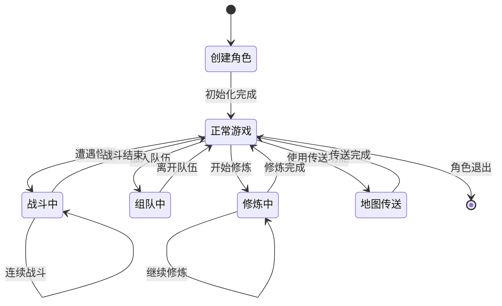

**章节来源**
- [LifeHandlerImpl.java](file://Life/src/main/java/com/bot/life/service/impl/LifeHandlerImpl.java#L830-L842)

## 等级与经验值系统

### 升级算法设计

等级与经验值系统采用递增式升级算法，确保玩家的成长曲线平滑且具有挑战性：

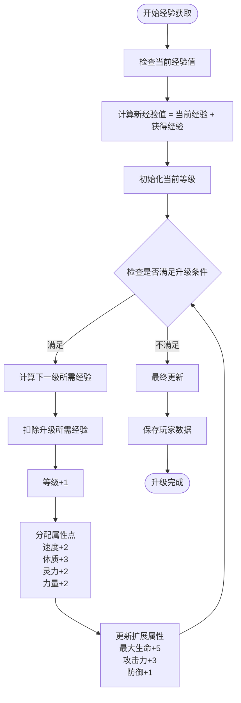

**图表来源**
- [PlayerServiceImpl.java](file://Life/src/main/java/com/bot/life/service/impl/PlayerServiceImpl.java#L186-L229)

### 经验值计算公式

系统使用以下公式计算下一等级所需经验值：

```
下一等级所需经验 = (当前等级 + 1) × 1000 + (当前等级 + 1)² × 500
```

这种设计确保：
- 初期升级相对容易，鼓励玩家快速成长
- 中后期升级难度逐渐增加，保持游戏挑战性
- 经验值需求呈二次函数增长，避免线性增长的单调性

**章节来源**
- [PlayerServiceImpl.java](file://Life/src/main/java/com/bot/life/service/impl/PlayerServiceImpl.java#L224-L229)

## 修为系统

### 修炼机制设计

修为系统是修仙类游戏的核心玩法，通过时间推移自动积累修为：

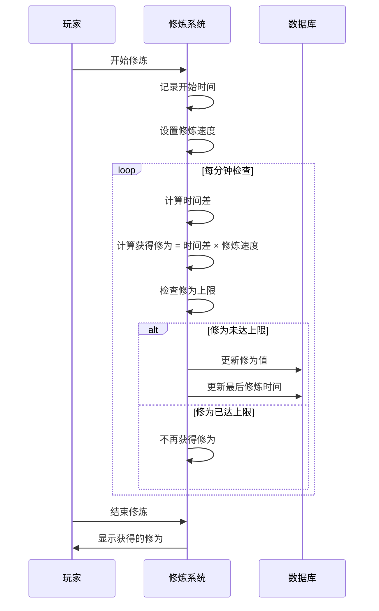

**图表来源**
- [LifePlayer.java](file://Life/src/main/java/com/bot/life/dao/entity/LifePlayer.java#L101-L128)

### 修炼速度计算逻辑

修炼系统的核心算法包含以下关键特性：

1. **时间基准计算**：以分钟为单位计算时间差
2. **速度乘积法**：获得修为 = 时间差 × 修炼速度
3. **上限保护机制**：防止修为无限增长
4. **渐进式上限**：随着境界提升逐步提高修为上限

### 修为获取限制

系统实现了完善的修为上限控制机制：

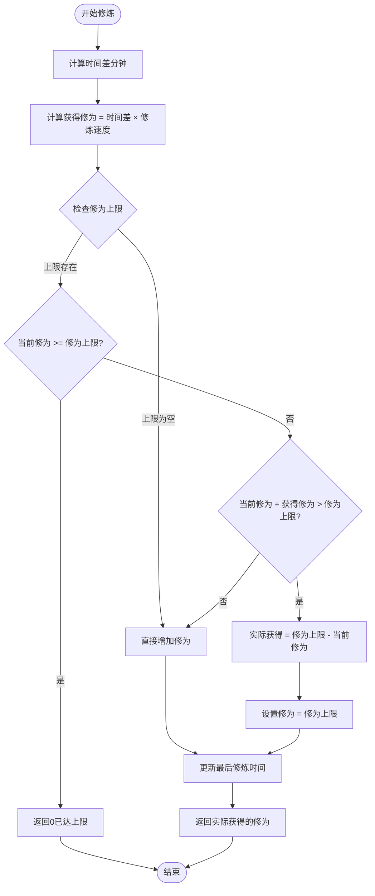

**图表来源**
- [LifePlayer.java](file://Life/src/main/java/com/bot/life/dao/entity/LifePlayer.java#L101-L128)

**章节来源**
- [LifePlayer.java](file://Life/src/main/java/com/bot/life/dao/entity/LifePlayer.java#L101-L128)
- [RealmServiceImpl.java](file://Life/src/main/java/com/bot/life/service/impl/RealmServiceImpl.java#L193-L236)

## 灵粹货币系统

### 灵粹作为游戏货币

灵粹是浮生卷游戏中的核心货币系统，具有以下特点：

1. **获取途径多样化**：
   - 完成任务和副本
   - 出售物品到市场
   - 参与活动获得奖励
   - 商店购买道具

2. **消耗用途广泛**：
   - 购买装备和道具
   - 修炼加速和突破
   - 装备强化和升级
   - 特殊服务费用

3. **价值稳定性**：通过市场供需平衡维持价值稳定

### 灵粹交易流程

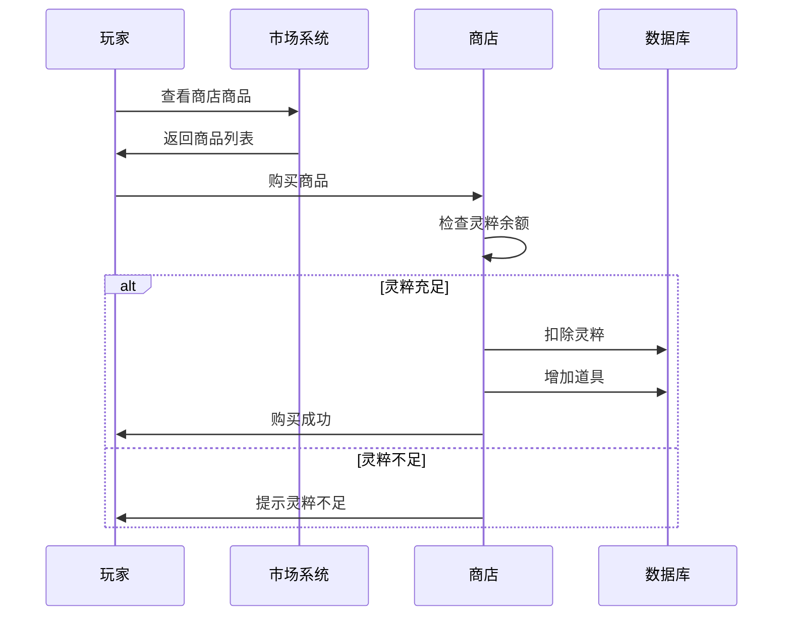

**图表来源**
- [LifeHandlerImpl.java](file://Life/src/main/java/com/bot/life/service/impl/LifeHandlerImpl.java#L910-L962)

**章节来源**
- [LifeHandlerImpl.java](file://Life/src/main/java/com/bot/life/service/impl/LifeHandlerImpl.java#L910-L962)

## 地图状态管理

### 地图系统架构

地图系统负责管理玩家的位置状态和传送功能：

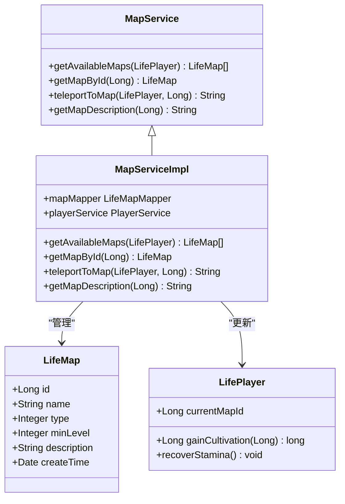

**图表来源**
- [LifeMap.java](file://Life/src/main/java/com/bot/life/dao/entity/LifeMap.java#L11-L19)
- [MapService.java](file://Life/src/main/java/com/bot/life/service/MapService.java#L12-L42)
- [MapServiceImpl.java](file://Life/src/main/java/com/bot/life/service/impl/MapServiceImpl.java#L17-L83)

### 地图传送机制

地图传送功能实现了完整的状态同步机制：

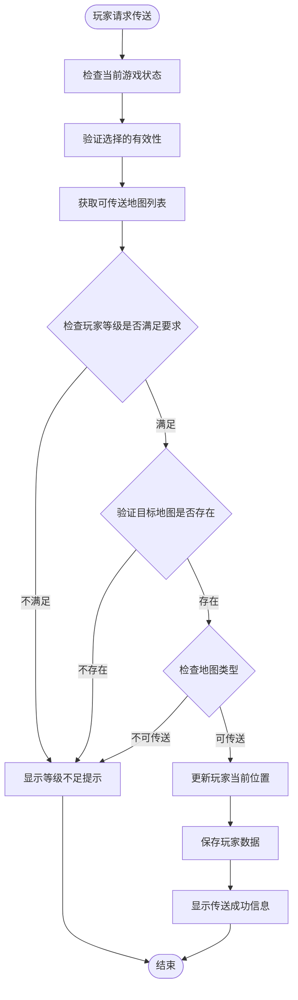

**图表来源**
- [MapServiceImpl.java](file://Life/src/main/java/com/bot/life/service/impl/MapServiceImpl.java#L36-L61)

### 地图类型分类

系统支持两种地图类型：

| 类型 | 编码 | 特性 | 传送权限 |
|------|------|------|----------|
| 可传送地图 | 1 | 普通场景地图，支持玩家传送 | 免费传送 |
| 内置地图 | 2 | 特殊场景，如副本、活动地图 | 需要特定条件 |

**章节来源**
- [MapServiceImpl.java](file://Life/src/main/java/com/bot/life/service/impl/MapServiceImpl.java#L36-L61)
- [LifeMap.java](file://Life/src/main/java/com/bot/life/dao/entity/LifeMap.java#L13-L19)

## 游戏状态枚举

### 状态枚举设计

系统采用多层次的状态枚举体系，确保状态管理的精确性和可扩展性：

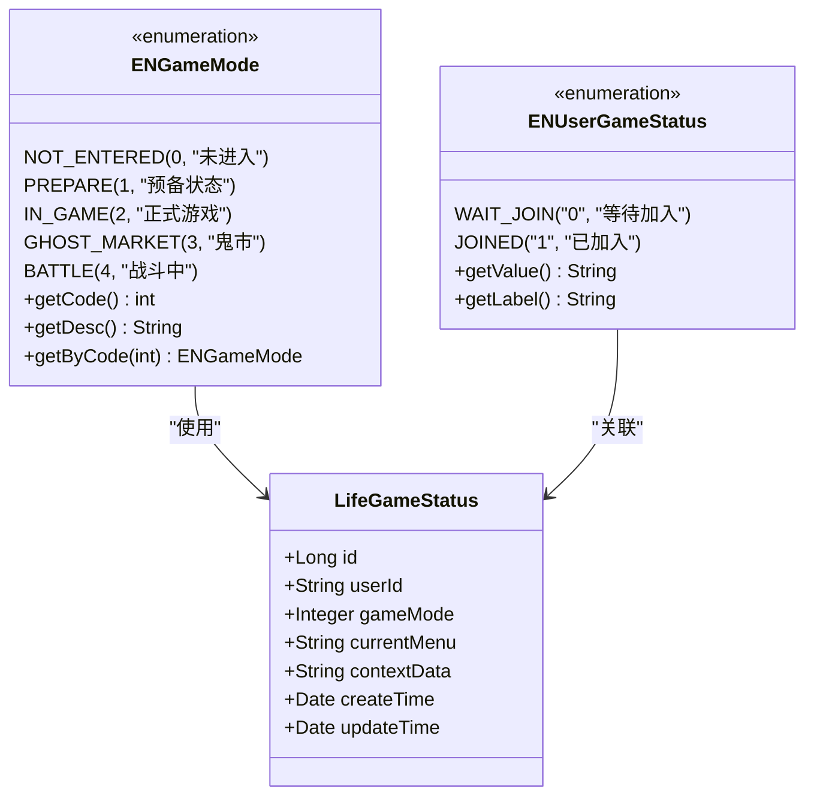

**图表来源**
- [ENGameMode.java](file://Life/src/main/java/com/bot/life/enums/ENGameMode.java#L7-L38)
- [ENUserGameStatus.java](file://Common/src/main/java/com/bot/common/enums/ENUserGameStatus.java#L10-L26)
- [LifeGameStatus.java](file://Life/src/main/java/com/bot/life/dao/entity/LifeGameStatus.java#L11-L20)

### 状态转换规则

不同状态之间的转换遵循严格的业务规则：

| 当前状态 | 可转换状态 | 触发条件 | 影响操作 |
|----------|------------|----------|----------|
| 未进入 | 预备状态 | 开始游戏 | 初始化角色 |
| 预备状态 | 正式游戏 | 角色创建完成 | 进入主世界 |
| 正式游戏 | 战斗中 | 遭遇怪物 | 战斗系统激活 |
| 正式游戏 | 鬼市 | 使用鬼市功能 | 商业系统激活 |
| 战斗中 | 正式游戏 | 战斗结束 | 状态恢复 |
| 正式游戏 | 正式游戏 | 地图传送 | 位置更新 |

**章节来源**
- [ENGameMode.java](file://Life/src/main/java/com/bot/life/enums/ENGameMode.java#L7-L38)
- [LifeHandlerImpl.java](file://Life/src/main/java/com/bot/life/service/impl/LifeHandlerImpl.java#L830-L842)

## 数据持久化策略

### MyBatis映射配置

系统采用MyBatis框架实现高效的数据持久化：

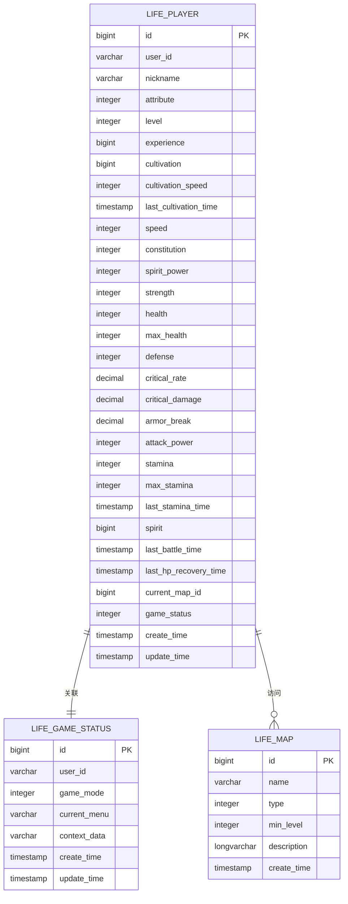

**图表来源**
- [LifePlayerMapper.xml](file://Life/src/main/resources/mapper/LifePlayerMapper.xml#L5-L36)
- [LifeMapMapper.xml](file://Life/src/main/resources/mapper/LifeMapMapper.xml#L5-L12)

### 关键SQL映射

系统的关键SQL映射包括：

1. **主键查询**：基于ID的快速定位
2. **用户ID查询**：基于用户标识的关联查询
3. **昵称查询**：支持玩家间的查找功能
4. **批量查询**：支持全量数据检索

**章节来源**
- [LifePlayerMapper.xml](file://Life/src/main/resources/mapper/LifePlayerMapper.xml#L45-L64)
- [LifeMapMapper.xml](file://Life/src/main/resources/mapper/LifeMapMapper.xml#L18-L36)

## 性能优化方案

### 缓存策略设计

系统实现了多层次的缓存策略以提升性能：

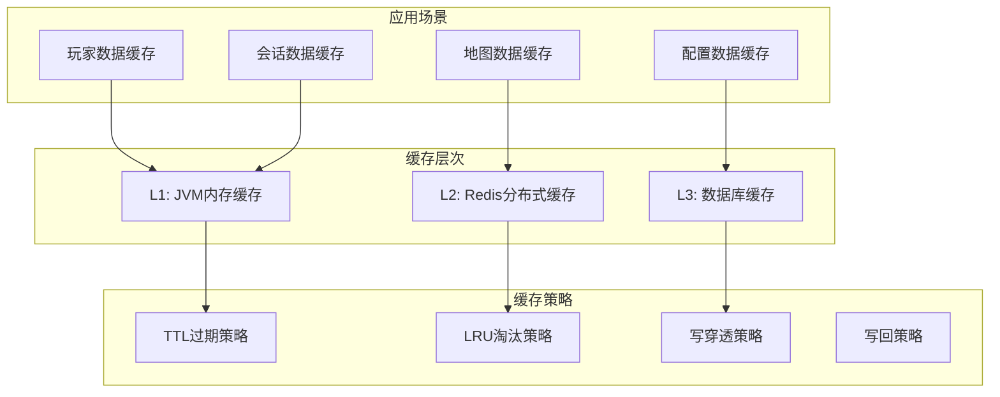

### 索引优化设计

针对高频查询场景，系统建立了以下索引：

| 表名 | 索引类型 | 索引字段 | 查询频率 | 优化效果 |
|------|----------|----------|----------|----------|
| life_player | 主键索引 | id | 极高 | O(log n)查询 |
| life_player | 用户索引 | user_id | 高 | 快速用户关联 |
| life_player | 昵称索引 | nickname | 中 | 玩家查找优化 |
| life_map | 类型索引 | type | 中 | 地图分类查询 |
| life_map | 等级索引 | min_level | 高 | 权限检查优化 |

### 查询优化策略

1. **延迟加载**：非关键字段采用延迟加载
2. **批量查询**：减少数据库连接开销
3. **读写分离**：区分读写操作，提升并发性能
4. **连接池管理**：合理配置数据库连接池参数

**章节来源**
- [JXCache.java](file://Game/src/main/java/com/bot/game/dao/entity/JXCache.java#L182-L238)
- [JXCacheMapper.java](file://Game/src/main/java/com/bot/game/dao/mapper/JXCacheMapper.java#L45-L65)

## 故障排除指南

### 常见问题诊断

#### 等级升级异常

**症状**：经验值达到上限但不升级
**原因**：经验值计算溢出或数据库更新失败
**解决方案**：
1. 检查经验值字段类型是否为BIGINT
2. 验证数据库更新语句执行情况
3. 确认while循环升级逻辑正确性

#### 修为获取停滞

**症状**：修炼一段时间后不再获得修为
**原因**：修为上限设置过小或时间计算错误
**解决方案**：
1. 检查maxCultivation参数设置
2. 验证时间戳计算精度
3. 确认修炼速度配置正确

#### 地图传送失败

**症状**：传送请求无响应或报错
**原因**：地图数据缺失或权限检查失败
**解决方案**：
1. 验证目标地图是否存在
2. 检查玩家等级是否满足要求
3. 确认地图类型配置正确

### 性能监控指标

| 监控指标 | 正常范围 | 告警阈值 | 优化建议 |
|----------|----------|----------|----------|
| 数据库查询响应时间 | < 100ms | > 500ms | 优化索引，减少复杂查询 |
| 缓存命中率 | > 90% | < 80% | 调整缓存策略，增加缓存容量 |
| 并发连接数 | < 80% | > 90% | 扩容数据库服务器 |
| 内存使用率 | < 70% | > 85% | 优化对象生命周期管理 |

**章节来源**
- [PlayerServiceImpl.java](file://Life/src/main/java/com/bot/life/service/impl/PlayerServiceImpl.java#L186-L229)
- [MapServiceImpl.java](file://Life/src/main/java/com/bot/life/service/impl/MapServiceImpl.java#L36-L61)

## 总结

状态管理系统作为浮生卷游戏的核心基础设施，通过精心设计的架构和算法，实现了复杂的游戏状态管理。系统的主要优势包括：

1. **完整性**：覆盖了玩家状态的各个方面，从基础属性到高级修炼
2. **扩展性**：模块化设计便于功能扩展和维护
3. **性能**：多层次缓存和索引优化确保系统高性能运行
4. **可靠性**：完善的错误处理和数据一致性保障

未来的发展方向包括：
- 引入更智能的状态预测算法
- 实现跨服状态同步机制
- 增强移动端适配能力
- 优化大数据量下的性能表现

通过持续的优化和改进，状态管理系统将继续为浮生卷游戏提供稳定可靠的服务支撑。