# 角色系统数据模型

<cite>
**本文档引用的文件**
- [Life_Database_Init.sql](file://Life_Database_Init.sql)
- [LifePlayer.java](file://Life/src/main/java/com/bot/life/dao/entity/LifePlayer.java)
- [LifePlayerMapper.java](file://Life/src/main/java/com/bot/life/dao/mapper/LifePlayerMapper.java)
- [LifePlayerMapper.xml](file://Life/src/main/resources/mapper/LifePlayerMapper.xml)
- [LifePlayerSignin.java](file://Life/src/main/java/com/bot/life/dao/entity/LifePlayerSignin.java)
- [LifePlayerAchievement.java](file://Life/src/main/java/com/bot/life/dao/entity/LifePlayerAchievement.java)
- [AchievementServiceImpl.java](file://Life/src/main/java/com/bot/life/service/impl/AchievementServiceImpl.java)
- [SigninServiceImpl.java](file://Life/src/main/java/com/bot/life/service/impl/SigninServiceImpl.java)
</cite>

## 目录
1. [简介](#简介)
2. [项目结构概览](#项目结构概览)
3. [核心实体分析](#核心实体分析)
4. [数据库表结构](#数据库表结构)
5. [实体关系图](#实体关系图)
6. [数据模型详细分析](#数据模型详细分析)
7. [性能优化策略](#性能优化策略)
8. [数据初始化与迁移](#数据初始化与迁移)
9. [最佳实践](#最佳实践)
10. [总结](#总结)

## 简介

浮生卷角色系统是一个基于Java Spring Boot框架构建的修仙类文字游戏的核心数据模型。该系统通过精心设计的数据库表结构和实体映射，实现了玩家角色的完整生命周期管理，包括基础属性、战斗属性、游戏状态、签到系统和成就系统等功能模块。

本文档将深入解析LifePlayer实体的设计理念，详细说明各个属性的作用机制，并结合数据库DDL语句展示完整的数据结构设计。

## 项目结构概览

角色系统采用分层架构设计，主要包含以下核心组件：

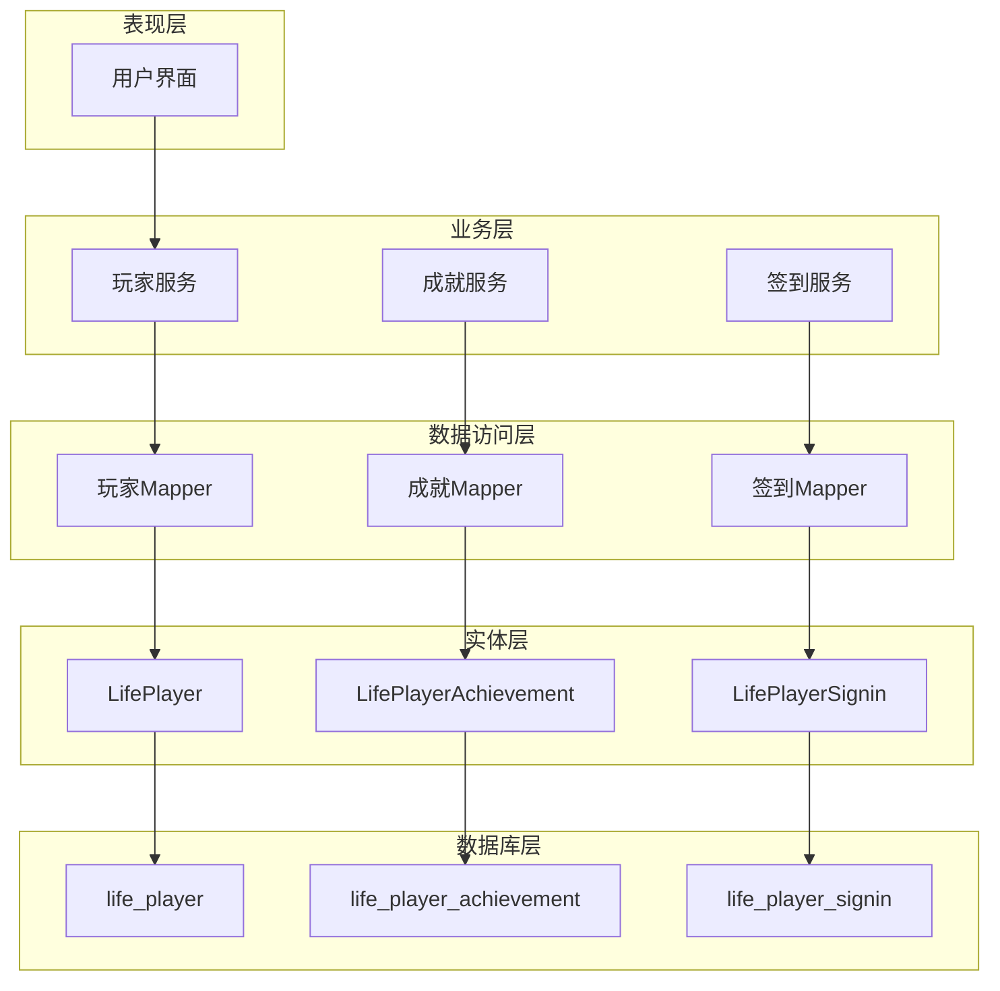

**图表来源**
- [LifePlayer.java](file://Life/src/main/java/com/bot/life/dao/entity/LifePlayer.java#L1-L130)
- [LifePlayerMapper.java](file://Life/src/main/java/com/bot/life/dao/mapper/LifePlayerMapper.java#L1-L48)

## 核心实体分析

### LifePlayer实体设计

LifePlayer是整个角色系统的核心实体，包含了玩家的所有基本信息和状态数据。

#### 基础属性设计

| 属性名 | 类型 | 默认值 | 说明 |
|--------|------|--------|------|
| speed | Integer | 1 | 速度属性，影响战斗行动顺序和破防率 |
| constitution | Integer | 1 | 体质属性，影响血量和防御 |
| spiritPower | Integer | 1 | 灵力属性，影响会心率和会心效果 |
| strength | Integer | 1 | 力量属性，影响攻击力和破防 |

#### 战斗属性计算机制

LifePlayer实体实现了智能的属性计算机制，根据基础属性动态计算战斗属性：

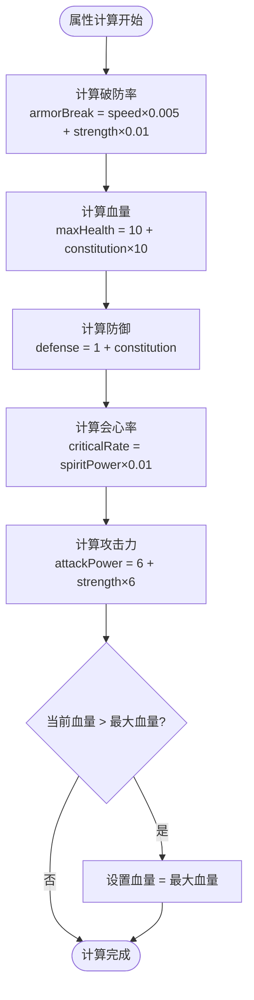

**图表来源**
- [LifePlayer.java](file://Life/src/main/java/com/bot/life/dao/entity/LifePlayer.java#L56-L76)

#### 游戏状态管理

| 状态值 | 状态名称 | 说明 |
|--------|----------|------|
| 0 | 正常 | 玩家处于正常游戏状态 |
| 1 | 战斗中 | 玩家正在参与战斗 |
| 2 | 组队中 | 玩家正在组队状态 |

**节来源**
- [LifePlayer.java](file://Life/src/main/java/com/bot/life/dao/entity/LifePlayer.java#L1-L130)

## 数据库表结构

### life_player 表结构

life_player表是角色系统的核心表，包含了玩家的所有基础信息和状态数据。

#### 字段定义与约束

| 字段名 | 类型 | 约束 | 默认值 | 说明 |
|--------|------|------|--------|------|
| id | bigint | PRIMARY KEY | 自增 | 主键标识符 |
| user_id | varchar(50) | UNIQUE | - | 用户唯一标识 |
| nickname | varchar(21) | UNIQUE | - | 角色昵称，中文不超过7字 |
| attribute | tinyint | NOT NULL | - | 角色属性：1金2木3水4火5土 |
| level | int | DEFAULT 1 | 1 | 等级 |
| experience | bigint | DEFAULT 0 | 0 | 经验值 |
| cultivation | bigint | DEFAULT 0 | 0 | 修为 |
| cultivation_speed | int | DEFAULT 10 | 10 | 修炼速度(修为/分钟) |
| last_cultivation_time | datetime | DEFAULT CURRENT_TIMESTAMP | 当前时间 | 最后修炼时间 |
| speed | int | DEFAULT 1 | 1 | 速度 |
| constitution | int | DEFAULT 1 | 1 | 体质 |
| spirit_power | int | DEFAULT 1 | 1 | 灵力 |
| strength | int | DEFAULT 1 | 1 | 力量 |
| health | int | DEFAULT 10 | 10 | 血量 |
| max_health | int | DEFAULT 10 | 10 | 最大血量 |
| defense | int | DEFAULT 1 | 1 | 防御 |
| critical_rate | decimal(5,3) | DEFAULT 0.000 | 0.000 | 会心率(%) |
| critical_damage | decimal(6,3) | DEFAULT 110.000 | 110.000 | 会心效果(%) |
| armor_break | decimal(5,3) | DEFAULT 0.000 | 0.000 | 破防(%) |
| attack_power | int | DEFAULT 6 | 6 | 攻击力 |
| stamina | int | DEFAULT 100 | 100 | 体力值 |
| max_stamina | int | DEFAULT 100 | 100 | 最大体力 |
| last_stamina_time | datetime | DEFAULT CURRENT_TIMESTAMP | 当前时间 | 最后体力恢复时间 |
| spirit | bigint | DEFAULT 1000 | 1000 | 灵粹（游戏货币） |
| last_battle_time | datetime | NULL | NULL | 最后战斗时间 |
| last_hp_recovery_time | datetime | DEFAULT CURRENT_TIMESTAMP | 当前时间 | 最后血量恢复时间 |
| current_map_id | bigint | DEFAULT 1 | 1 | 当前所在地图 |
| game_status | tinyint | DEFAULT 0 | 0 | 游戏状态：0正常1战斗中2组队中 |
| create_time | datetime | DEFAULT CURRENT_TIMESTAMP | 当前时间 | 创建时间 |
| update_time | datetime | DEFAULT CURRENT_TIMESTAMP ON UPDATE CURRENT_TIMESTAMP | 当前时间 | 更新时间 |

#### 索引设计

```mermaid
graph LR
subgraph "life_player表索引"
PK[PRIMARY KEY: id]
UK_USER[UNIQUE: user_id]
UK_NICK[UNIQUE: nickname]
IDX_MAP[INDEX: current_map_id]
end
PK --> "主键索引，确保记录唯一性"
UK_USER --> "用户ID唯一约束"
UK_NICK --> "昵称唯一约束"
IDX_MAP --> "按地图查询优化"
```

**图表来源**
- [Life_Database_Init.sql](file://Life_Database_Init.sql#L6-L48)

**节来源**
- [Life_Database_Init.sql](file://Life_Database_Init.sql#L6-L48)

### life_player_signin 签到记录表

签到系统为玩家提供每日登录奖励机制。

#### 表结构设计

| 字段名 | 类型 | 约束 | 默认值 | 说明 |
|--------|------|------|--------|------|
| id | bigint | PRIMARY KEY | 自增 | 主键标识符 |
| player_id | bigint | NOT NULL | - | 玩家ID |
| signin_date | date | NOT NULL | - | 签到日期 |
| spirit_reward | int | NOT NULL | - | 获得的灵粹奖励 |
| create_time | datetime | DEFAULT CURRENT_TIMESTAMP | 当前时间 | 签到时间 |

#### 索引设计

```mermaid
graph LR
subgraph "life_player_signin表索引"
PK_SIGN[PRIMARY KEY: id]
UK_PLAYER_DATE[UNIQUE: player_id, signin_date]
IDX_PLAYER[INDEX: player_id]
IDX_DATE[INDEX: signin_date]
end
PK_SIGN --> "主键索引"
UK_PLAYER_DATE --> "防止重复签到"
IDX_PLAYER --> "按玩家查询优化"
IDX_DATE --> "按日期统计优化"
```

**图表来源**
- [Life_Database_Init.sql](file://Life_Database_Init.sql#L587-L597)

**节来源**
- [Life_Database_Init.sql](file://Life_Database_Init.sql#L587-L597)
- [LifePlayerSignin.java](file://Life/src/main/java/com/bot/life/dao/entity/LifePlayerSignin.java#L1-L19)

### life_player_achievement 成就系统表

成就系统记录玩家完成的各种成就。

#### 表结构设计

| 字段名 | 类型 | 约束 | 默认值 | 说明 |
|--------|------|------|--------|------|
| id | bigint | PRIMARY KEY | 自增 | 主键标识符 |
| player_id | bigint | NOT NULL | - | 玩家ID |
| achievement_id | bigint | NOT NULL | - | 成就ID |
| completed_time | datetime | DEFAULT CURRENT_TIMESTAMP | 当前时间 | 完成时间 |

#### 索引设计

```mermaid
graph LR
subgraph "life_player_achievement表索引"
PK_ACH[PRIMARY KEY: id]
UK_PLAYER_ACH[UNIQUE: player_id, achievement_id]
IDX_PLAYER_ACH[INDEX: player_id]
end
PK_ACH --> "主键索引"
UK_PLAYER_ACH --> "防止重复完成同一成就"
IDX_PLAYER_ACH --> "按玩家查询成就列表"
```

**图表来源**
- [Life_Database_Init.sql](file://Life_Database_Init.sql#L241-L248)

**节来源**
- [Life_Database_Init.sql](file://Life_Database_Init.sql#L241-L248)
- [LifePlayerAchievement.java](file://Life/src/main/java/com/bot/life/dao/entity/LifePlayerAchievement.java#L1-L21)

## 实体关系图

### 角色系统整体关系

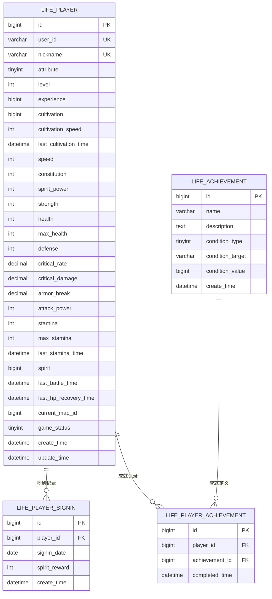

**图表来源**
- [LifePlayer.java](file://Life/src/main/java/com/bot/life/dao/entity/LifePlayer.java#L1-L130)
- [LifePlayerSignin.java](file://Life/src/main/java/com/bot/life/dao/entity/LifePlayerSignin.java#L1-L19)
- [LifePlayerAchievement.java](file://Life/src/main/java/com/bot/life/dao/entity/LifePlayerAchievement.java#L1-L21)

### 数据访问层关系

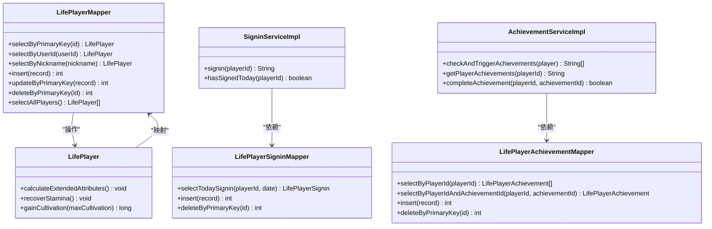

**图表来源**
- [LifePlayerMapper.java](file://Life/src/main/java/com/bot/life/dao/mapper/LifePlayerMapper.java#L1-L48)
- [SigninServiceImpl.java](file://Life/src/main/java/com/bot/life/service/impl/SigninServiceImpl.java#L1-L93)
- [AchievementServiceImpl.java](file://Life/src/main/java/com/bot/life/service/impl/AchievementServiceImpl.java#L1-L137)

## 数据模型详细分析

### 属性计算机制详解

#### 1. 破防率计算

破防率是战斗中的重要属性，影响攻击能否穿透敌人的防御：

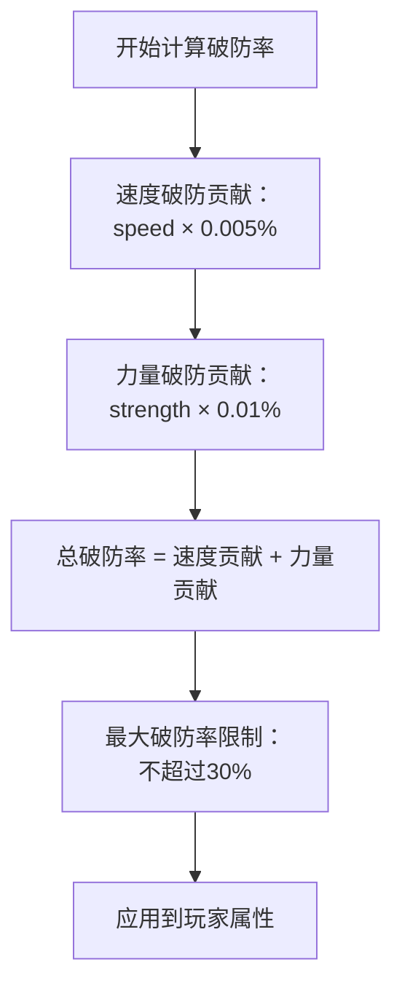

**图表来源**
- [LifePlayer.java](file://Life/src/main/java/com/bot/life/dao/entity/LifePlayer.java#L57-L70)

#### 2. 血量计算机制

血量计算体现了体质属性对生存能力的影响：

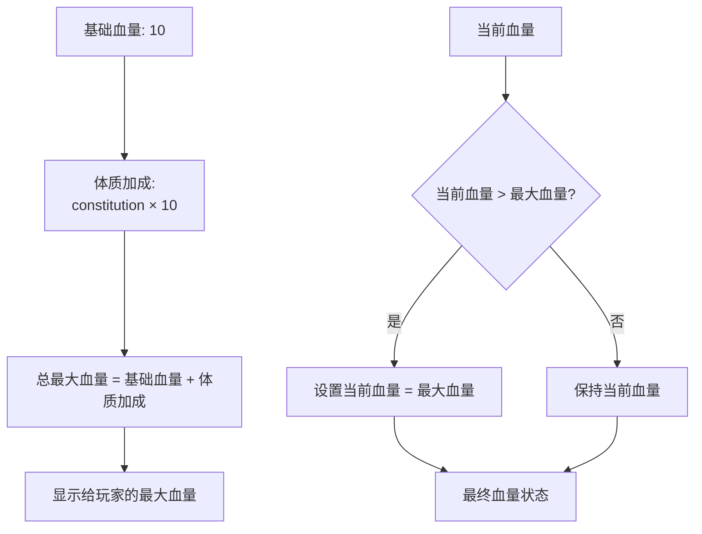

**图表来源**
- [LifePlayer.java](file://Life/src/main/java/com/bot/life/dao/entity/LifePlayer.java#L61-L75)

#### 3. 会心系统设计

会心系统包含会心率和会心效果两个重要参数：

| 参数 | 计算公式 | 说明 |
|------|----------|------|
| 会心率 | spiritPower × 0.01% | 每点灵力增加0.01%会心率 |
| 会心效果 | 110.000 + spiritPower × 0.005% | 基础110%，每点灵力增加0.005% |

#### 4. 攻击力计算

攻击力计算综合了基础攻击力和力量属性：

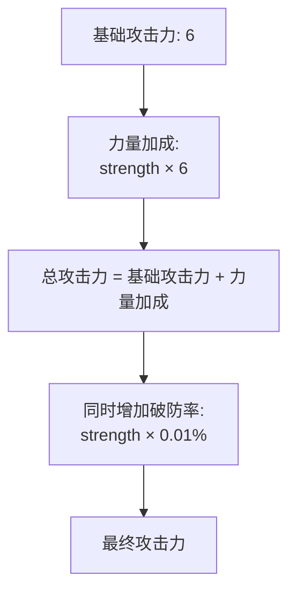

**图表来源**
- [LifePlayer.java](file://Life/src/main/java/com/bot/life/dao/entity/LifePlayer.java#L68-L70)

### 签到系统业务逻辑

#### 签到流程设计

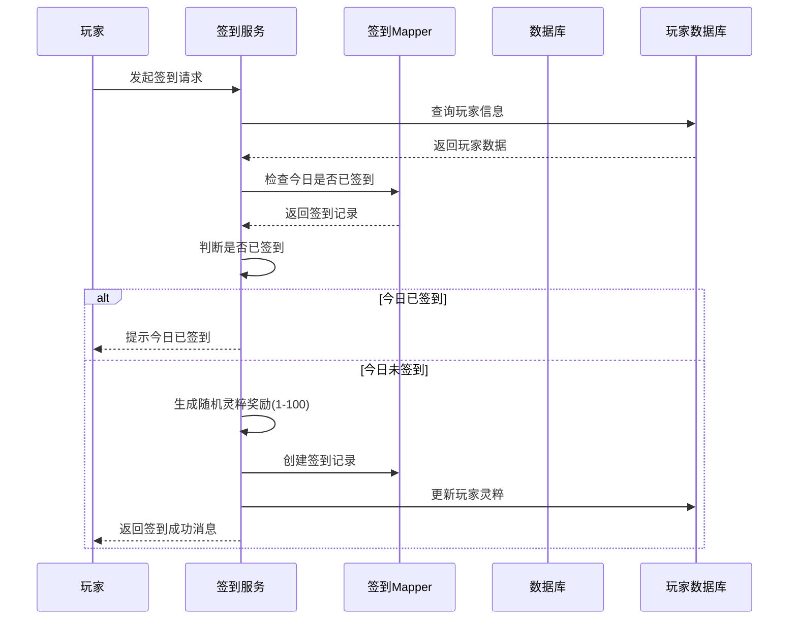

**图表来源**
- [SigninServiceImpl.java](file://Life/src/main/java/com/bot/life/service/impl/SigninServiceImpl.java#L32-L67)

#### 签到防刷机制

系统通过复合唯一索引防止重复签到：

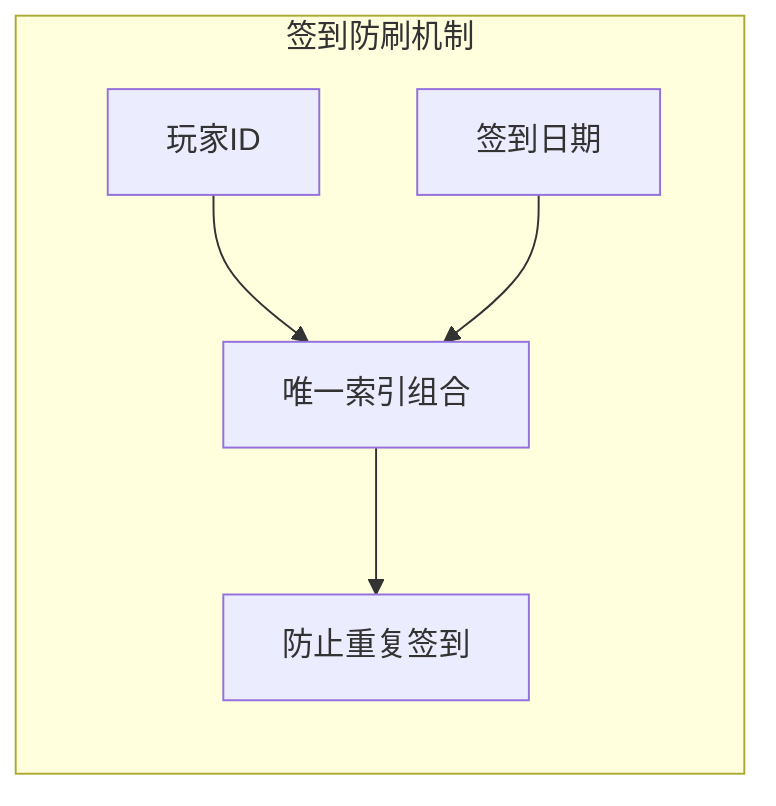

**图表来源**
- [Life_Database_Init.sql](file://Life_Database_Init.sql#L594-L594)

### 成就系统设计

#### 成就触发机制

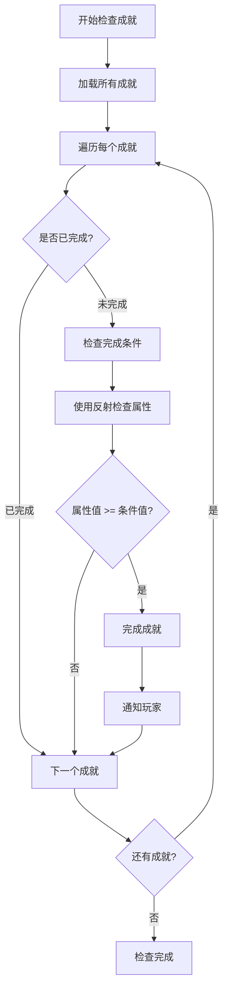

**图表来源**
- [AchievementServiceImpl.java](file://Life/src/main/java/com/bot/life/service/impl/AchievementServiceImpl.java#L31-L51)

#### 成就条件验证

成就系统使用反射机制动态验证成就条件：

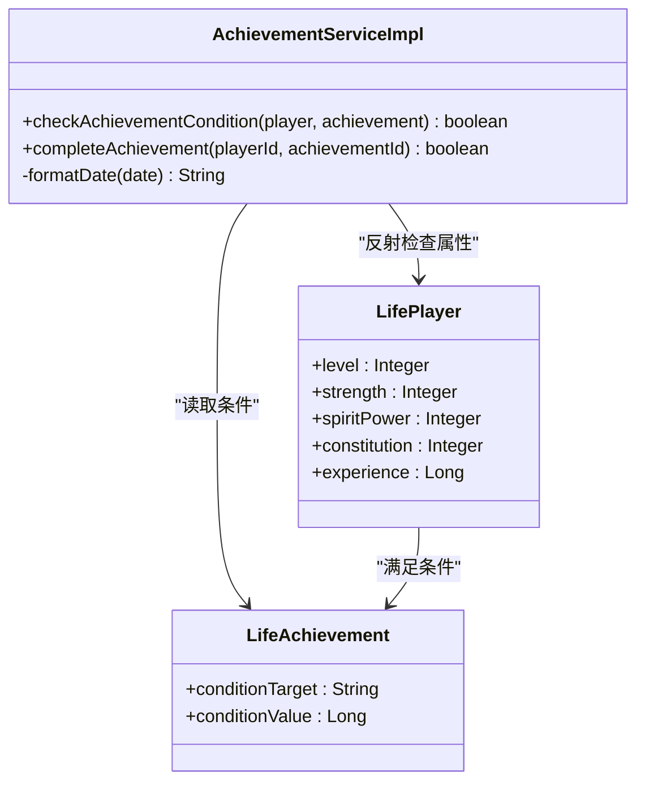

**图表来源**
- [AchievementServiceImpl.java](file://Life/src/main/java/com/bot/life/service/impl/AchievementServiceImpl.java#L105-L126)

**节来源**
- [AchievementServiceImpl.java](file://Life/src/main/java/com/bot/life/service/impl/AchievementServiceImpl.java#L1-L137)

## 性能优化策略

### 高频查询优化

#### 1. 玩家信息查询优化

针对玩家信息查询的高频场景，系统采用了多种优化策略：

| 优化策略 | 实现方式 | 性能提升 |
|----------|----------|----------|
| 复合索引 | `(user_id, nickname)` | 减少索引扫描 |
| 缓存机制 | MyBatis二级缓存 | 避免重复查询 |
| 分页查询 | `selectAllPlayers()` | 控制内存使用 |
| 字段选择 | 明确指定查询字段 | 减少网络传输 |

#### 2. 签到系统优化

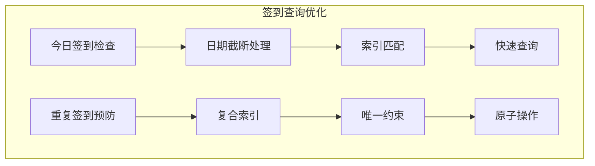

**图表来源**
- [SigninServiceImpl.java](file://Life/src/main/java/com/bot/life/service/impl/SigninServiceImpl.java#L75-L82)

#### 3. 成就系统优化

成就系统的优化重点在于动态条件检查的性能：

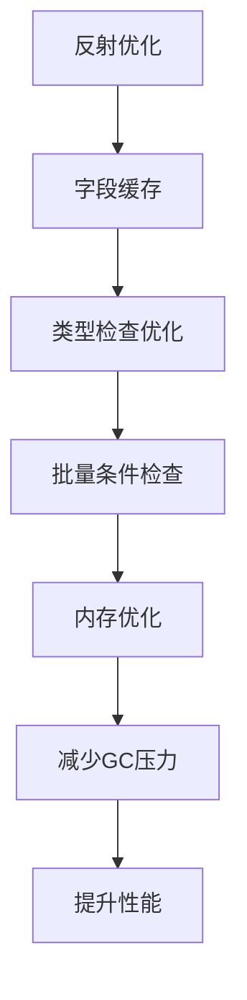

**图表来源**
- [AchievementServiceImpl.java](file://Life/src/main/java/com/bot/life/service/impl/AchievementServiceImpl.java#L105-L126)

### 数据库连接优化

#### 连接池配置建议

| 参数 | 推荐值 | 说明 |
|------|--------|------|
| initialSize | 5 | 初始连接数 |
| maxActive | 20 | 最大活跃连接数 |
| minIdle | 5 | 最小空闲连接数 |
| maxWait | 60000 | 最大等待时间(ms) |
| validationQuery | SELECT 1 | 连接有效性检测 |

#### 事务管理优化

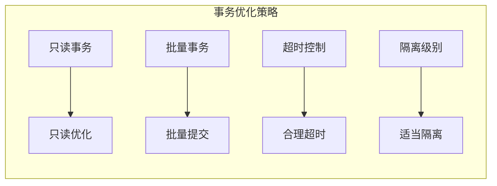

## 数据初始化与迁移

### 初始数据设计

#### 1. 地图初始化

系统提供了基础的地图数据，支持不同境界的修炼需求：

| 地图ID | 名称 | 类型 | 最低境界 | 描述 |
|--------|------|------|----------|------|
| 1 | 新手村 | 可传送 | 1 | 修仙者的起始之地 |
| 2 | 青云山 | 可传送 | 10 | 灵气充沛的修炼圣地 |
| 3 | 幽冥谷 | 可传送 | 20 | 阴气森森的危险之地 |
| 4 | 天机阁 | 内置地图 | 1 | 神秘的藏宝阁 |
| 5 | 鬼市 | 可传送 | 1 | 修士们交易的神秘市场 |

#### 2. 怪物掉落配置

怪物掉落系统采用概率配置，确保游戏平衡性：

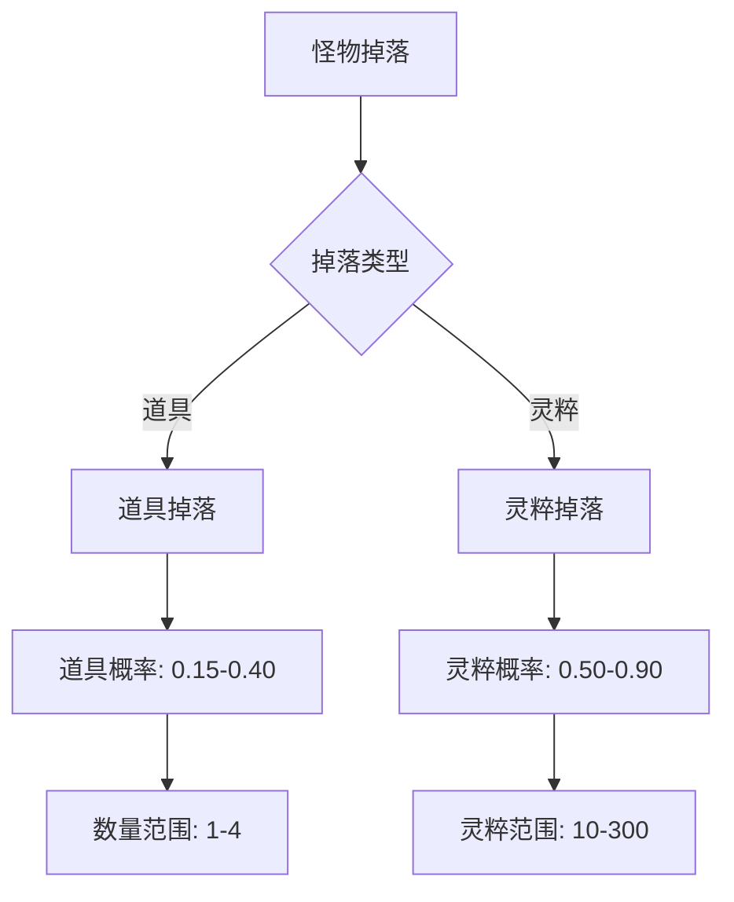

**图表来源**
- [Life_Database_Init.sql](file://Life_Database_Init.sql#L409-L434)

#### 3. 系统配置管理

系统配置采用键值对形式，便于运行时调整：

| 配置键 | 默认值 | 说明 |
|--------|--------|------|
| speed_armor_break_rate | 0.005 | 每点速度增加的破防率 |
| constitution_health_rate | 10 | 每点体质增加的血量 |
| spirit_critical_rate | 0.01 | 每点灵力增加的会心率 |
| strength_attack_rate | 6 | 每点力量增加的攻击力 |

### 数据迁移策略

#### 1. 版本兼容性

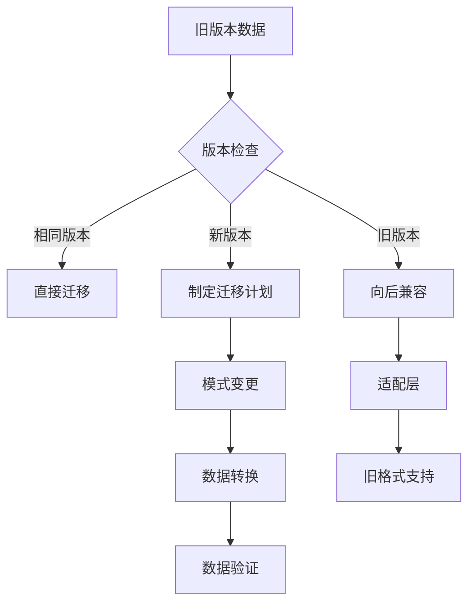

#### 2. 数据备份策略

| 备份类型 | 频率 | 保留期限 | 存储位置 |
|----------|------|----------|----------|
| 全量备份 | 每日 | 30天 | 本地+云端 |
| 增量备份 | 每小时 | 7天 | 本地 |
| 日志备份 | 实时 | 3天 | 本地 |

#### 3. 迁移工具设计

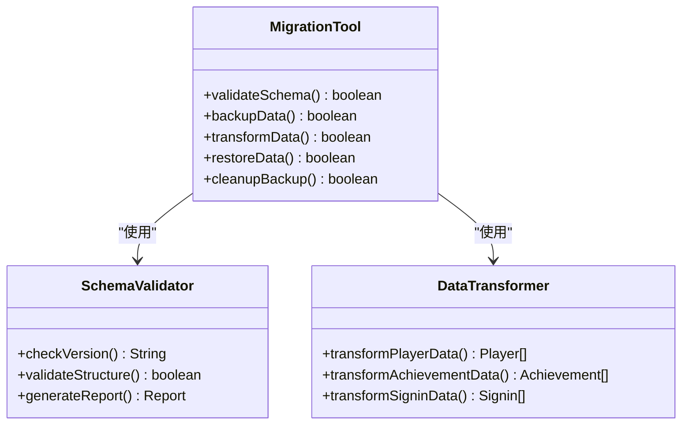

**节来源**
- [Life_Database_Init.sql](file://Life_Database_Init.sql#L391-L646)

## 最佳实践

### 1. 数据一致性保证

#### 事务边界设计

```mermaid
graph TD
TransactionBoundary[事务边界] --> PlayerUpdate[玩家数据更新]
TransactionBoundary --> AchievementCheck[成就检查]
TransactionBoundary --> SigninRecord[签到记录]
PlayerUpdate --> ACIDProperties[ACID特性]
AchievementCheck --> ACIDProperties
SigninRecord --> ACIDProperties
ACIDProperties --> Atomicity[原子性]
ACIDProperties --> Consistency[一致性]
ACIDProperties --> Isolation[隔离性]
ACIDProperties --> Durability[持久性]
```

#### 并发控制策略

| 场景 | 控制策略 | 实现方式 |
|------|----------|----------|
| 签到并发 | 乐观锁 | 时间戳版本控制 |
| 成就更新 | 悲观锁 | 数据库行锁 |
| 玩家状态 | 事务隔离 | REPEATABLE_READ |
| 批量操作 | 分批处理 | 限制单次操作数量 |

### 2. 错误处理机制

#### 异常分类处理

```mermaid
flowchart TD
Exception[异常发生] --> Classify{异常分类}
Classify --> |数据库异常| DBHandler[数据库异常处理器]
Classify --> |业务异常| BizHandler[业务异常处理器]
Classify --> |系统异常| SysHandler[系统异常处理器]
DBHandler --> RetryLogic[重试逻辑]
BizHandler --> UserFeedback[用户反馈]
SysHandler --> LogRecord[日志记录]
RetryLogic --> Success[操作成功]
UserFeedback --> Success
LogRecord --> Monitor[监控告警]
```

#### 降级策略

| 服务 | 降级策略 | 实现方式 |
|------|----------|----------|
| 成就系统 | 快速失败 | 返回空列表 |
| 签到系统 | 缓存优先 | 本地缓存兜底 |
| 玩家查询 | 只读缓存 | Redis缓存 |
| 数据写入 | 异步处理 | 消息队列 |

### 3. 监控与运维

#### 关键指标监控

```mermaid
graph LR
subgraph "性能指标"
QPS[QPS: 请求量]
Latency[Latency: 响应时间]
Throughput[Throughput: 吞吐量]
ErrorRate[Error Rate: 错误率]
end
subgraph "业务指标"
ActiveUsers[活跃用户数]
Retention[留存率]
Revenue[收入]
Engagement[用户参与度]
end
subgraph "系统指标"
CPU[CPU使用率]
Memory[内存使用率]
Disk[磁盘使用率]
Network[网络带宽]
end
```

#### 告警机制设计

| 告警级别 | 触发条件 | 处理时间 | 通知方式 |
|----------|----------|----------|----------|
| 严重 | 服务不可用 | 5分钟内 | 短信+电话 |
| 重要 | 响应时间>2秒 | 15分钟内 | 短信+邮件 |
| 警告 | 错误率>5% | 1小时内 | 邮件 |
| 信息 | 一般性能问题 | 24小时内 | 邮件 |

### 4. 安全防护

#### 数据安全

```mermaid
graph TD
DataSecurity[数据安全] --> Encryption[数据加密]
DataSecurity --> AccessControl[访问控制]
DataSecurity --> AuditLog[审计日志]
Encryption --> AtRest[静态加密]
Encryption --> InTransit[传输加密]
AccessControl --> RBAC[角色权限控制]
AccessControl --> IPWhitelist[IP白名单]
AuditLog --> OperationLog[操作日志]
AuditLog --> SecurityEvent[安全事件]
```

#### 防作弊机制

| 防作弊类型 | 检测方法 | 应对措施 |
|------------|----------|----------|
| 刷签到 | 时间间隔检查 | 限制签到频率 |
| 刷成就 | 属性值异常检测 | 数据校验 |
| 刷灵粹 | 收入异常分析 | 人工审核 |
| 刷经验 | 获得速度检测 | 速度限制 |

## 总结

浮生卷角色系统数据模型通过精心设计的实体结构和数据库表，实现了修仙类游戏的核心功能。系统的主要特点包括：

### 设计优势

1. **属性计算自动化**：通过智能算法自动计算战斗属性，减少了手动维护的工作量
2. **扩展性强**：模块化设计支持功能的灵活扩展和定制
3. **性能优化**：合理的索引设计和查询优化确保了系统的高效运行
4. **数据完整性**：完善的约束和验证机制保证了数据的准确性

### 技术亮点

1. **反射机制**：成就系统使用反射动态检查属性，提高了代码的灵活性
2. **事务管理**：完善的事务控制确保了数据的一致性和可靠性
3. **缓存策略**：多层次的缓存机制提升了系统的响应性能
4. **监控体系**：全面的监控和告警机制保障了系统的稳定运行

### 应用价值

该数据模型不仅适用于修仙类游戏，其设计理念和实现方式对于其他角色管理系统具有重要的参考价值。通过合理的抽象和封装，系统实现了业务逻辑与数据访问的分离，为后续的功能扩展和系统优化奠定了坚实的基础。