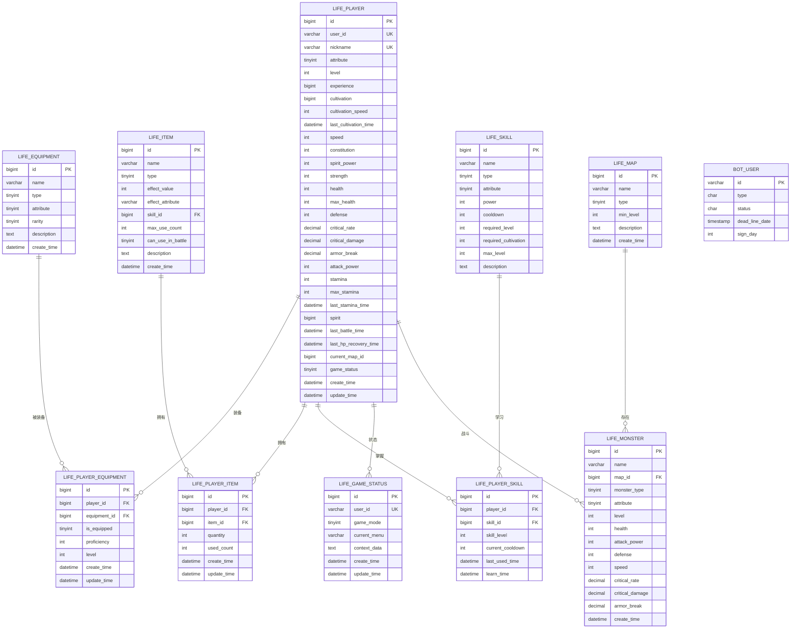

# Bot项目数据库设计文档

<cite>
**本文档引用的文件**
- [Life_Database_Init.sql](file://Life_Database_Init.sql)
- [LifePlayerMapper.xml](file://Life/src/main/resources/mapper/LifePlayerMapper.xml)
- [BotUserMapper.xml](file://Game/src/main/resources/mapper/BotUserMapper.xml)
- [LifePlayer.java](file://Life/src/main/java/com/bot/life/dao/entity/LifePlayer.java)
- [BotUser.java](file://Game/src/main/java/com/bot/game/dao/entity/BotUser.java)
- [application-dev.properties](file://Boot/src/main/resources/application-dev.properties)
- [generatorConfig.xml](file://Boot/src/main/resources/generatorConfig.xml)
</cite>

## 目录
1. [项目概述](#项目概述)
2. [数据库架构总览](#数据库架构总览)
3. [核心实体关系分析](#核心实体关系分析)
4. [Life模块数据库设计](#life模块数据库设计)
5. [Game模块数据库设计](#game模块数据库设计)
6. [MyBatis映射配置分析](#mybatis映射配置分析)
7. [索引策略与性能优化](#索引策略与性能优化)
8. [数据库连接配置](#数据库连接配置)
9. [最佳实践建议](#最佳实践建议)
10. [故障排除指南](#故障排除指南)

## 项目概述

Bot项目是一个基于Java Spring Boot框架的聊天机器人系统，采用模块化架构设计。数据库层主要分为两个核心模块：

- **Life模块**：负责修仙类游戏的核心业务逻辑，包括玩家角色、装备、道具、地图等实体
- **Game模块**：负责基础的游戏功能和用户管理

系统采用MySQL作为主数据库，使用MyBatis作为ORM框架，通过XML配置实现数据库操作。

## 数据库架构总览



**图表来源**
- [Life_Database_Init.sql](file://Life_Database_Init.sql#L6-L646)
- [LifePlayer.java](file://Life/src/main/java/com/bot/life/dao/entity/LifePlayer.java#L12-L130)
- [BotUser.java](file://Game/src/main/java/com/bot/game/dao/entity/BotUser.java#L6-L214)

## 核心实体关系分析

### 玩家角色实体（LifePlayer）

玩家角色是整个游戏系统的核心实体，包含了修仙者的所有基础属性和状态信息。


**图表来源**
- [LifePlayer.java](file://Life/src/main/java/com/bot/life/dao/entity/LifePlayer.java#L12-L130)

### 关键属性计算机制

LifePlayer实体实现了复杂的属性计算逻辑：

1. **基础属性到拓展属性的转换**：
   - 速度 → 破防率：每点速度增加0.005%
   - 体质 → 血量和防御：每点体质增加10点血量和1点防御
   - 灵力 → 会心率和会心效果：每点灵力增加相应百分比

2. **动态属性调整**：
   - 攻击力 = 6 + 力量 × 6
   - 破防率 = 速度 × 0.005% + 力量 × 0.01%

### 装备系统设计

装备系统采用多表关联设计，支持不同类型的装备和效果：


**图表来源**
- [Life_Database_Init.sql](file://Life_Database_Init.sql#L51-L87)

## Life模块数据库设计

### 表结构概览

Life模块包含22张核心表，涵盖游戏的各个方面：

| 表名 | 功能描述 | 主要字段 |
|------|----------|----------|
| life_player | 玩家角色信息 | user_id, nickname, level, attributes |
| life_equipment | 装备基础信息 | name, type, attribute, rarity |
| life_player_equipment | 玩家装备持有 | player_id, equipment_id, is_equipped |
| life_item | 道具信息 | name, type, effect_value, max_use_count |
| life_player_item | 玩家道具持有 | player_id, item_id, quantity |
| life_skill | 技能基础信息 | name, type, attribute, power |
| life_player_skill | 玩家技能掌握 | player_id, skill_id, skill_level |
| life_map | 地图信息 | name, type, min_level |
| life_monster | 怪物信息 | name, map_id, level, attributes |
| life_monster_drop | 怪物掉落配置 | monster_id, drop_type, drop_rate |
| life_monster_skill | 怪物技能关联 | monster_id, skill_id |
| life_achievement | 成就系统 | name, description, condition_type |
| life_player_achievement | 玩家成就完成 | player_id, achievement_id |
| life_friend | 好友关系 | player_id, friend_id, status |
| life_mail | 邮件系统 | from_player_id, to_player_id, subject |
| life_world_boss | 世界BOSS | monster_id, map_id, start_time |
| life_world_boss_reward | BOSS奖励 | world_boss_id, spirit_reward |
| life_shop | 商店系统 | item_type, item_id, base_price |
| life_player_stall | 玩家长摊 | player_id, stall_name, item_type |
| life_team | 队伍系统 | leader_id, map_id, status |
| life_team_member | 队伍成员 | team_id, player_id, member_status |
| life_dungeon | 副本系统 | name, map_id, boss_id |

### 核心业务流程


**图表来源**
- [Life_Database_Init.sql](file://Life_Database_Init.sql#L392-L646)

## Game模块数据库设计

### BotUser核心表

Game模块主要负责基础的用户管理和机器人功能，核心表结构相对简单：

```mermaid
erDiagram
BOT_USER {
varchar id PK
char type
char status
timestamp dead_line_date
int sign_day
}
BOT_USER_CONFIG {
varchar id PK
varchar user_id FK
varchar chat_engine
varchar chat_frequency
varchar emoji_switch
varchar bottle_auto_switch
varchar welcome_content
datetime create_time
datetime update_time
}
BOT_ACTIVITY {
bigint id PK
varchar name
varchar description
datetime start_time
datetime end_time
tinyint status
text conditions
datetime create_time
}
BOT_ACTIVITY_USER {
bigint id PK
bigint activity_id FK
varchar user_id FK
tinyint status
int progress
datetime create_time
}
BOT_AWARD {
bigint id PK
varchar award_type
varchar award_name
text description
int weight
datetime create_time
}
BOT_USER_AWARD {
bigint id PK
varchar user_id FK
bigint award_id FK
int quantity
datetime create_time
}
BOT_NOTICE {
bigint id PK
varchar title
text content
tinyint notice_type
datetime publish_time
datetime expire_time
datetime create_time
}
BOT_BOTTLE_MESSAGE {
bigint id PK
varchar sender_id FK
varchar receiver_id FK
text content
tinyint status
datetime send_time
datetime read_time
}
BOT_DRINK_RECORD {
bigint id PK
varchar user_id FK
int drink_count
datetime record_time
}
BOT_EMOJI {
bigint id PK
varchar emoji_name
varchar emoji_url
int usage_count
datetime create_time
}
BOT_GAME_ROOM {
bigint id PK
varchar room_name
varchar creator_id FK
int max_players
tinyint room_status
datetime create_time
}
BOT_GAME_ROOM_PLAYER {
bigint id PK
bigint room_id FK
varchar player_id FK
int seat_number
int score
datetime join_time
}
BOT_GAME_USER_SCORE {
bigint id PK
varchar user_id FK
varchar game_type
bigint total_score
int total_games
int win_games
int lose_games
int draw_games
datetime last_play_time
}
BOT_USER_BOX {
bigint id PK
varchar user_id FK
text box_content
datetime create_time
}
BOT_USER_SIGN {
bigint id PK
varchar user_id FK
date sign_date
int consecutive_days
datetime sign_time
}
BOT_SYSTEM_CONFIG {
bigint id PK
varchar config_key UK
text config_value
text description
datetime create_time
datetime update_time
}
```



**图表来源**
- [BotUser.java](file://Game/src/main/java/com/bot/game/dao/entity/BotUser.java#L6-L214)
- [Life_Database_Init.sql](file://Life_Database_Init.sql#L367-L646)

### 用户状态管理

BotUser表设计简洁但功能完整，支持多种用户状态和配置：

1. **用户类型**：区分不同类型用户
2. **状态管理**：在线、离线、禁用等状态
3. **有效期管理**：通过dead_line_date字段管理用户有效期
4. **签到功能**：通过sign_day字段支持连续签到统计

## MyBatis映射配置分析

### LifePlayerMapper配置详解

LifePlayerMapper.xml展示了完整的CRUD操作配置：


**图表来源**
- [LifePlayerMapper.xml](file://Life/src/main/resources/mapper/LifePlayerMapper.xml#L3-L135)

### 映射配置特点

1. **自动驼峰转换**：通过`map-underscore-to-camel-case=true`实现数据库字段到Java属性的自动映射
2. **批量操作支持**：提供了完整的CRUD操作方法
3. **参数类型明确**：每个操作都指定了明确的参数类型
4. **返回值处理**：支持自动生成主键和批量操作结果

### BotUserMapper配置对比

BotUserMapper.xml展示了更复杂的查询条件处理：


**图表来源**
- [BotUserMapper.xml](file://Game/src/main/resources/mapper/BotUserMapper.xml#L1-271)
- [BotUser.java](file://Game/src/main/java/com/bot/game/dao/entity/BotUser.java#L6-L214)

## 索引策略与性能优化

### 核心索引设计

基于数据库表结构分析，推荐以下索引策略：

| 表名 | 主键索引 | 外键索引 | 唯一索引 | 其他索引 |
|------|----------|----------|----------|----------|
| life_player | id | - | user_id, nickname | idx_current_map_id |
| life_player_equipment | id | player_id, equipment_id | - | idx_player_id |
| life_player_item | id | player_id, item_id | - | idx_player_id |
| life_player_skill | id | player_id, skill_id | uk_player_skill | idx_player_id, idx_skill_id |
| life_monster | id | map_id | - | idx_map_id |
| life_monster_drop | id | monster_id | - | idx_monster_id |
| life_monster_skill | id | monster_id, skill_id | - | idx_monster_id |
| life_team_member | id | team_id, player_id | - | idx_team_id, idx_player_id |
| life_world_boss | id | monster_id, map_id | - | - |
| life_shop | id | - | - | - |
| life_player_stall | id | player_id | - | idx_player_id |
| life_game_status | id | user_id | uk_user_id | - |
| bot_user | id | - | - | - |

### 查询优化策略

1. **分页查询优化**：
   ```sql
   -- 推荐：使用LIMIT和OFFSET进行分页
   SELECT * FROM life_player 
   ORDER BY level DESC 
   LIMIT 20 OFFSET 0;
   
   -- 避免：大数据量全表扫描
   SELECT * FROM life_player WHERE level > 100;
   ```

2. **关联查询优化**：
   ```sql
   -- 推荐：使用JOIN并确保外键有索引
   SELECT p.nickname, e.name 
   FROM life_player p
   JOIN life_player_equipment pe ON p.id = pe.player_id
   JOIN life_equipment e ON pe.equipment_id = e.id
   WHERE p.id = 1;
   ```

3. **批量操作优化**：
   ```sql
   -- 推荐：批量插入
   INSERT INTO life_player_item (player_id, item_id, quantity) VALUES
   (1, 101, 5),
   (1, 102, 3),
   (2, 101, 2);
   ```

### 性能监控指标

1. **慢查询监控**：设置慢查询阈值为1秒
2. **索引使用率**：定期检查索引使用情况
3. **连接池监控**：监控数据库连接池使用率
4. **锁等待监控**：监控事务锁等待时间

## 数据库连接配置

### 生产环境配置

基于application-dev.properties文件分析，生产环境采用Druid连接池：

```properties
# MySQL连接配置
spring.datasource.url=jdbc:mysql://47.92.127.30:3306/bot?useUnicode=true&characterEncoding=utf8&useSSL=false&serverTimezone=UTC
spring.datasource.username=root
spring.datasource.password=gouzaizi@123
spring.datasource.driver-class-name=com.mysql.cj.jdbc.Driver

# Druid连接池配置
spring.datasource.type=com.alibaba.druid.pool.DruidDataSource
spring.datasource.tomcat.initial-size=1
spring.datasource.tomcat.max-wait=20
spring.datasource.tomcat.min-idle=3
spring.datasource.tomcat.max-active=60000
spring.datasource.tomcat.time-between-eviction-runs-millis=60000
spring.datasource.tomcat.min-evictable-idle-time-millis=300000
spring.datasource.tomcat.validation-query=select 'x'
spring.datasource.tomcat.test-while-idle=true
spring.datasource.tomcat.test-on-borrow=false
spring.datasource.tomcat.test-on-return=false
```

### MyBatis配置优化

```properties
# MyBatis配置
mybatis.configuration.map-underscore-to-camel-case=true
mybatis.configuration.default-fetch-size=100
mybatis.configuration.default-statement-timeout=3000
mybatis.type-aliases-package=com.bot.game.mapper,com.bot.life.mapper
mybatis.mapper-locations=classpath*:mapper/*.xml
```

### 连接池调优建议

1. **初始连接数**：根据并发需求设置合适的初始连接数
2. **最大连接数**：根据服务器资源和并发量调整
3. **空闲连接检测**：定期检测和回收空闲连接
4. **连接验证**：启用连接有效性验证

## 最佳实践建议

### 数据库设计原则

1. **范式设计**：
   - 第一范式：确保字段原子性
   - 第二范式：消除部分依赖
   - 第三范式：消除传递依赖

2. **命名规范**：
   - 表名使用小写字母和下划线
   - 字段名保持一致的命名风格
   - 外键使用fk_前缀

3. **数据类型选择**：
   - 使用合适的数据类型避免浪费空间
   - 对于货币金额使用decimal精确类型
   - 时间戳使用datetime而非varchar

### 事务管理策略


### 数据备份策略

1. **定期备份**：每天凌晨进行全量备份
2. **增量备份**：每小时进行增量备份
3. **异地备份**：重要数据异地存储
4. **备份验证**：定期验证备份数据完整性

### 安全防护措施

1. **SQL注入防护**：使用PreparedStatement和参数化查询
2. **敏感数据加密**：对用户密码等敏感信息加密存储
3. **访问权限控制**：严格控制数据库访问权限
4. **审计日志**：记录所有数据库操作日志

## 故障排除指南

### 常见问题及解决方案

1. **连接超时问题**：
   ```properties
   # 增加连接超时时间
   spring.datasource.tomcat.max-wait=60000
   
   # 增加最大活跃连接数
   spring.datasource.tomcat.max-active=100
   ```

2. **慢查询诊断**：
   ```sql
   -- 启用慢查询日志
   SET GLOBAL slow_query_log = 'ON';
   SET GLOBAL long_query_time = 1;
   
   -- 分析慢查询
   EXPLAIN SELECT * FROM life_player WHERE nickname = '测试';
   ```

3. **内存溢出问题**：
   ```properties
   # 调整JVM堆内存
   -Xms512m -Xmx2048m
   
   # 调整连接池大小
   spring.datasource.tomcat.max-active=50
   ```

### 性能监控工具

1. **Druid监控面板**：实时监控数据库连接池状态
2. **MySQL慢查询日志**：分析慢查询性能问题
3. **系统监控工具**：监控服务器资源使用情况
4. **APM工具**：应用性能监控

### 数据恢复流程

1. **数据备份**：定期进行数据备份
2. **故障检测**：及时发现数据异常
3. **备份验证**：验证备份数据完整性
4. **数据恢复**：从备份恢复数据
5. **服务恢复**：重启相关服务
6. **功能验证**：验证系统功能正常

通过以上全面的数据库设计文档，开发者可以深入理解Bot项目的数据库架构，掌握核心实体关系，了解MyBatis映射配置，并能够进行有效的性能优化和故障排除。