# 核心数据模型

<cite>
**本文档引用的文件**
- [ChatIdDTO.java](file://Base/src/main/java/com/bot/base/dto/ChatIdDTO.java)
- [UserTempInfoDTO.java](file://Base/src/main/java/com/bot/base/dto/UserTempInfoDTO.java)
- [SpeechIdDTO.java](file://Base/src/main/java/com/bot/base/dto/SpeechIdDTO.java)
- [SendMsgDTO.java](file://Common/src/main/java/com/bot/common/dto/SendMsgDTO.java)
- [SendGroupDTO.java](file://Common/src/main/java/com/bot/common/dto/SendGroupDTO.java)
- [SendFriendDTO.java](file://Common/src/main/java/com/bot/common/dto/SendFriendDTO.java)
- [QQGroupMessage.java](file://Common/src/main/java/com/bot/common/dto/qqsender/QQGroupMessage.java)
- [QQAuthor.java](file://Common/src/main/java/com/bot/common/dto/qqsender/QQAuthor.java)
- [SendMsgUtil.java](file://Common/src/main/java/com/bot/common/util/SendMsgUtil.java)
- [StatusMonitor.java](file://Base/src/main/java/com/bot/base/service/StatusMonitor.java)
- [SystemManager.java](file://Base/src/main/java/com/bot/base/service/SystemManager.java)
</cite>

## 目录
1. [简介](#简介)
2. [项目结构概览](#项目结构概览)
3. [核心数据模型分类](#核心数据模型分类)
4. [消息传递数据模型](#消息传递数据模型)
5. [用户状态管理数据模型](#用户状态管理数据模型)
6. [DTO设计模式详解](#dto设计模式详解)
7. [数据流转过程分析](#数据流转过程分析)
8. [序列化性能优化建议](#序列化性能优化建议)
9. [最佳实践指南](#最佳实践指南)
10. [总结](#总结)

## 简介

Bot项目是一个基于Java的企业级聊天机器人系统，采用了分层架构设计，其中数据传输对象（DTO）作为跨模块通信的核心载体，在整个系统中发挥着至关重要的作用。本文档深入分析了项目中的核心数据模型，包括消息传递、用户状态管理等关键实体的设计理念和实现细节。

## 项目结构概览

Bot项目采用模块化架构，主要包含以下核心模块：

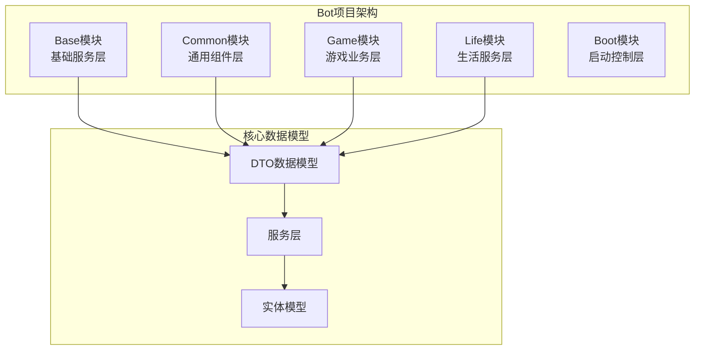

**图表来源**
- [ChatIdDTO.java](file://Base/src/main/java/com/bot/base/dto/ChatIdDTO.java#L1-L19)
- [SendMsgDTO.java](file://Common/src/main/java/com/bot/common/dto/SendMsgDTO.java#L1-L23)

## 核心数据模型分类

Bot项目中的数据模型按照功能可以分为以下几个主要类别：

### 1. 消息传递相关模型
- **SendMsgDTO**: 基础消息发送封装
- **SendGroupDTO**: 群组消息发送封装  
- **SendFriendDTO**: 好友消息发送封装
- **QQGroupMessage**: QQ群消息接收模型

### 2. 用户状态管理模型
- **ChatIdDTO**: 聊天会话标识
- **UserTempInfoDTO**: 用户临时信息
- **SpeechIdDTO**: 对话步骤标识

### 3. 数据传输与序列化模型
- **各种DTO类**: 统一的数据传输格式
- **序列化工具**: JSON序列化优化

**章节来源**
- [ChatIdDTO.java](file://Base/src/main/java/com/bot/base/dto/ChatIdDTO.java#L1-L19)
- [UserTempInfoDTO.java](file://Base/src/main/java/com/bot/base/dto/UserTempInfoDTO.java#L1-L36)
- [SendMsgDTO.java](file://Common/src/main/java/com/bot/common/dto/SendMsgDTO.java#L1-L23)

## 消息传递数据模型

### SendMsgDTO - 基础消息封装

SendMsgDTO是Bot项目中最基础的消息发送数据传输对象，为所有类型的消息发送提供了统一的接口规范。

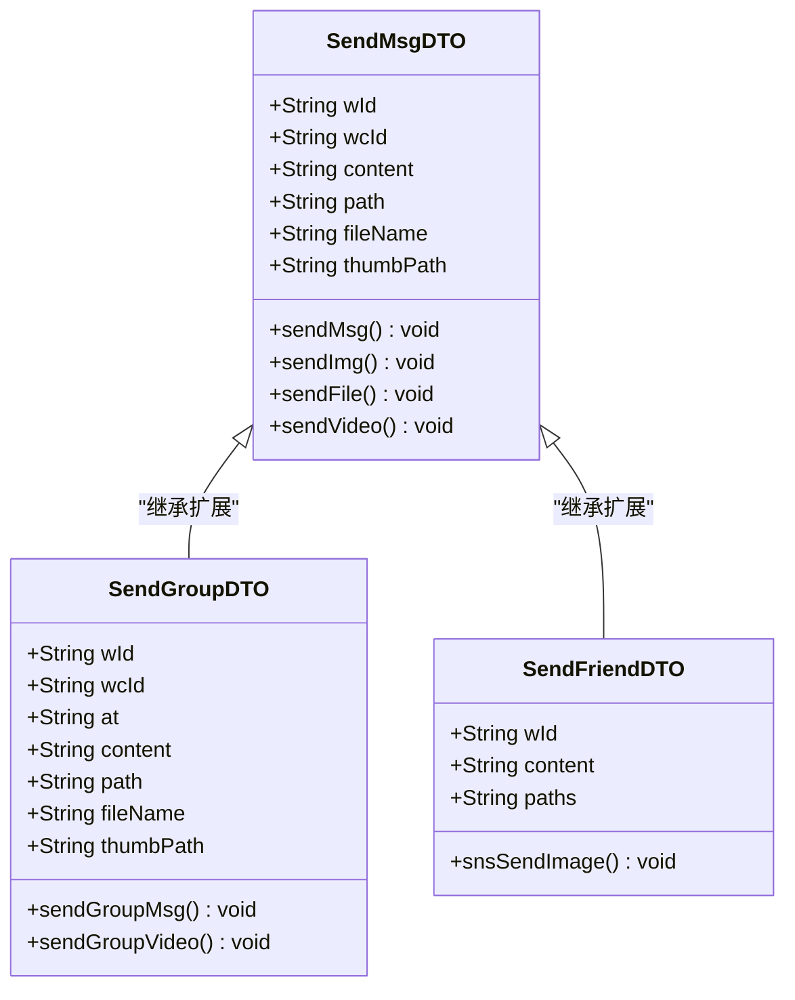

**图表来源**
- [SendMsgDTO.java](file://Common/src/main/java/com/bot/common/dto/SendMsgDTO.java#L8-L22)
- [SendGroupDTO.java](file://Common/src/main/java/com/bot/common/dto/SendGroupDTO.java#L8-L24)
- [SendFriendDTO.java](file://Common/src/main/java/com/bot/common/dto/SendFriendDTO.java#L8-L15)

#### 字段设计说明

| 字段名 | 类型 | 必填 | 描述 | 使用场景 |
|--------|------|------|------|----------|
| wId | String | 是 | 工作空间ID | 标识消息发送的工作环境 |
| wcId | String | 是 | 接收方ID | 私聊或群组的唯一标识 |
| content | String | 否 | 消息内容 | 文本消息的主要内容 |
| path | String | 否 | 文件路径 | 图片、视频等媒体文件的存储路径 |
| fileName | String | 否 | 文件名称 | 上传文件时的自定义名称 |
| thumbPath | String | 否 | 缩略图路径 | 视频或图片的缩略图地址 |

### SendGroupDTO - 群组消息封装

SendGroupDTO专门用于群组消息的发送，增加了@提及功能的支持。

#### 特殊字段说明
- **at字段**: 支持@特定用户的功能，提升群组交互体验

### SendFriendDTO - 好友消息封装

SendFriendDTO针对好友朋友圈功能进行了专门优化，简化了朋友圈消息的发送流程。

**章节来源**
- [SendMsgDTO.java](file://Common/src/main/java/com/bot/common/dto/SendMsgDTO.java#L1-L23)
- [SendGroupDTO.java](file://Common/src/main/java/com/bot/common/dto/SendGroupDTO.java#L1-L25)
- [SendFriendDTO.java](file://Common/src/main/java/com/bot/common/dto/SendFriendDTO.java#L1-L16)

## 用户状态管理数据模型

### ChatIdDTO - 聊天会话标识

ChatIdDTO用于跟踪用户的聊天会话状态，是系统维护用户对话连续性的重要组件。

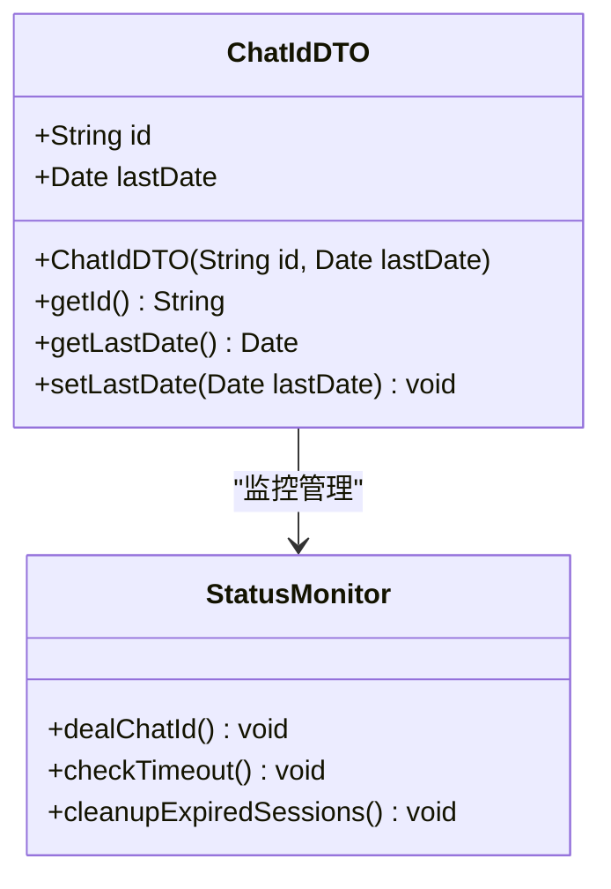

**图表来源**
- [ChatIdDTO.java](file://Base/src/main/java/com/bot/base/dto/ChatIdDTO.java#L12-L18)
- [StatusMonitor.java](file://Base/src/main/java/com/bot/base/service/StatusMonitor.java#L116-L130)

#### 设计特点
- **简洁性**: 仅包含必要的会话标识和时间戳
- **时效性**: 通过lastDate字段支持超时清理机制
- **线程安全**: 支持多线程环境下的并发访问

### UserTempInfoDTO - 用户临时信息

UserTempInfoDTO是系统管理模式的核心数据模型，负责管理临时用户权限和会话状态。

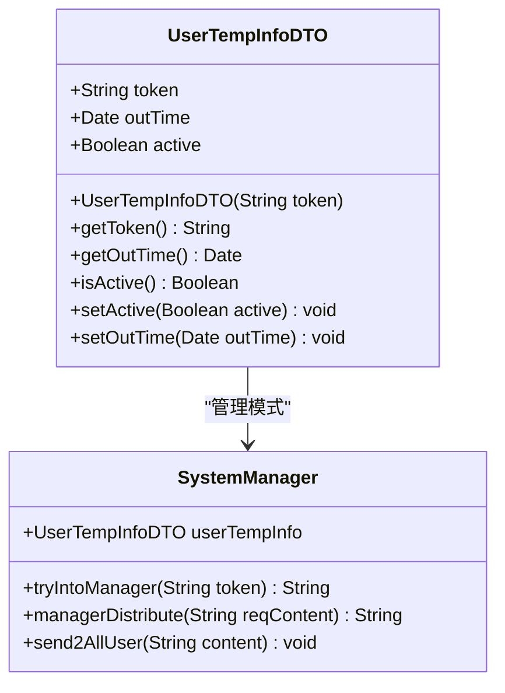

**图表来源**
- [UserTempInfoDTO.java](file://Base/src/main/java/com/bot/base/dto/UserTempInfoDTO.java#L20-L35)
- [SystemManager.java](file://Base/src/main/java/com/bot/base/service/SystemManager.java#L51-L97)

#### 关键特性
- **令牌验证**: 通过token字段实现用户身份验证
- **过期机制**: outTime字段支持自动过期清理
- **激活状态**: active字段控制用户是否处于管理模式

### SpeechIdDTO - 对话步骤标识

SpeechIdDTO用于跟踪对话流程中的具体步骤，支持复杂的对话状态管理。

#### 应用场景
- 多步骤命令处理
- 对话流程控制
- 状态机实现

**章节来源**
- [ChatIdDTO.java](file://Base/src/main/java/com/bot/base/dto/ChatIdDTO.java#L1-L19)
- [UserTempInfoDTO.java](file://Base/src/main/java/com/bot/base/dto/UserTempInfoDTO.java#L1-L36)
- [SpeechIdDTO.java](file://Base/src/main/java/com/bot/base/dto/SpeechIdDTO.java#L1-L17)

## DTO设计模式详解

### Lombok注解的应用

Bot项目大量使用Lombok简化DTO类的编写：

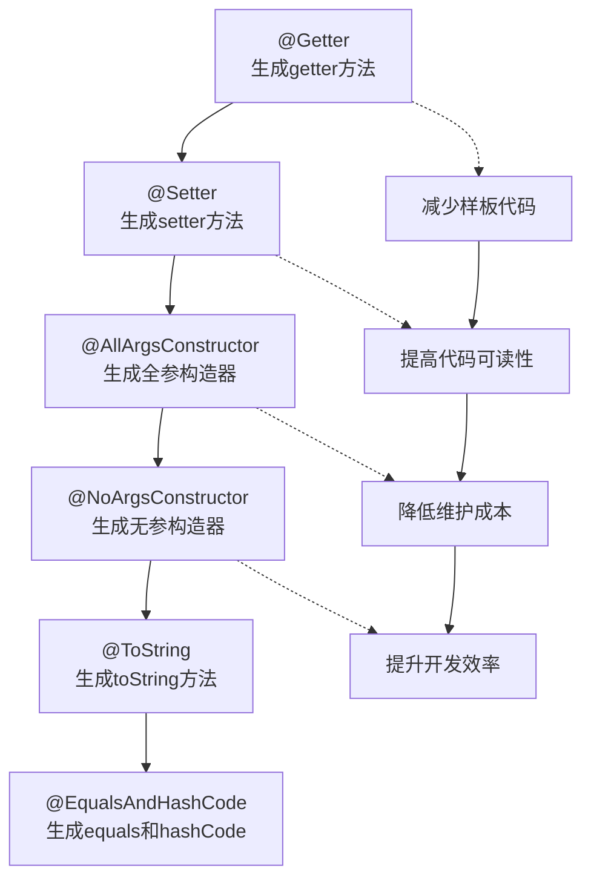

### DTO设计原则

1. **单一职责**: 每个DTO专注于特定的功能领域
2. **不可变性**: 优先使用final字段确保数据一致性
3. **序列化友好**: 所有字段都支持JSON序列化
4. **类型安全**: 强类型约束避免运行时错误

### 数据验证策略

虽然当前实现中未显式添加验证注解，但建议在生产环境中添加以下验证：

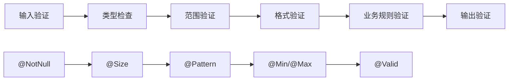

**章节来源**
- [SendMsgDTO.java](file://Common/src/main/java/com/bot/common/dto/SendMsgDTO.java#L6-L8)
- [UserTempInfoDTO.java](file://Base/src/main/java/com/bot/base/dto/UserTempInfoDTO.java#L16-L20)

## 数据流转过程分析

### 消息发送完整流程

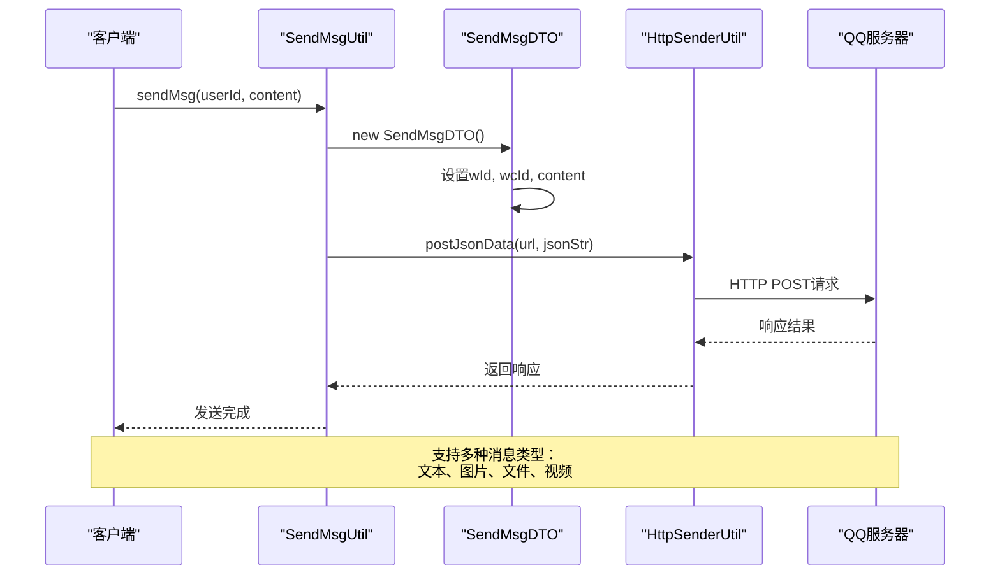

**图表来源**
- [SendMsgUtil.java](file://Common/src/main/java/com/bot/common/util/SendMsgUtil.java#L27-L36)
- [SendMsgDTO.java](file://Common/src/main/java/com/bot/common/dto/SendMsgDTO.java#L8-L22)

### 用户状态管理流程

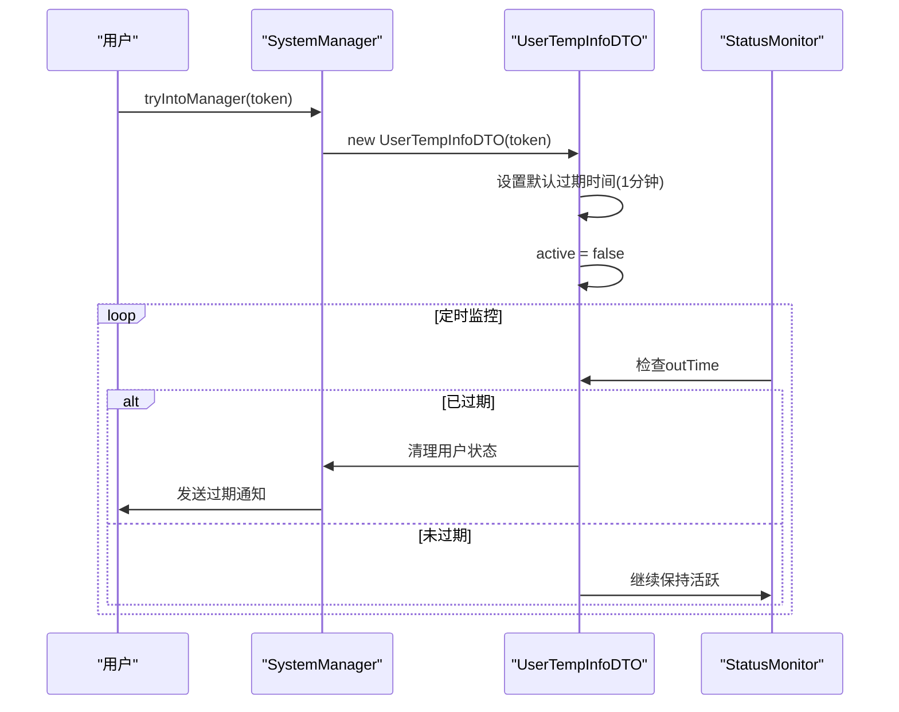

**图表来源**
- [SystemManager.java](file://Base/src/main/java/com/bot/base/service/SystemManager.java#L88-L97)
- [StatusMonitor.java](file://Base/src/main/java/com/bot/base/service/StatusMonitor.java#L68-L78)

### 消息接收处理流程

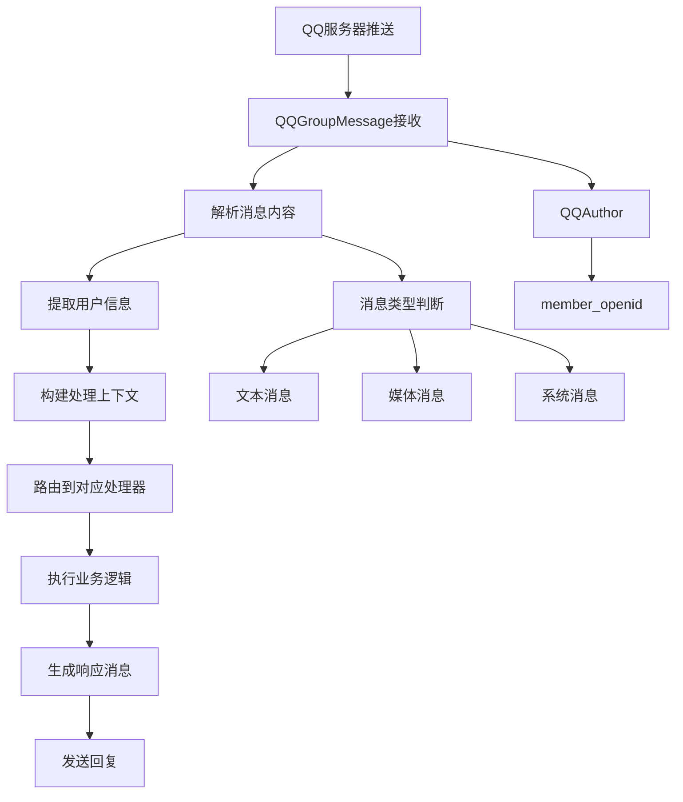

**图表来源**
- [QQGroupMessage.java](file://Common/src/main/java/com/bot/common/dto/qqsender/QQGroupMessage.java#L8-L20)
- [QQAuthor.java](file://Common/src/main/java/com/bot/common/dto/qqsender/QQAuthor.java#L8-L12)

**章节来源**
- [SendMsgUtil.java](file://Common/src/main/java/com/bot/common/util/SendMsgUtil.java#L1-L274)
- [SystemManager.java](file://Base/src/main/java/com/bot/base/service/SystemManager.java#L34-L152)
- [StatusMonitor.java](file://Base/src/main/java/com/bot/base/service/StatusMonitor.java#L67-L91)

## 序列化性能优化建议

### JSON序列化优化策略

基于项目中使用的Hutool JSON工具，以下是具体的优化建议：

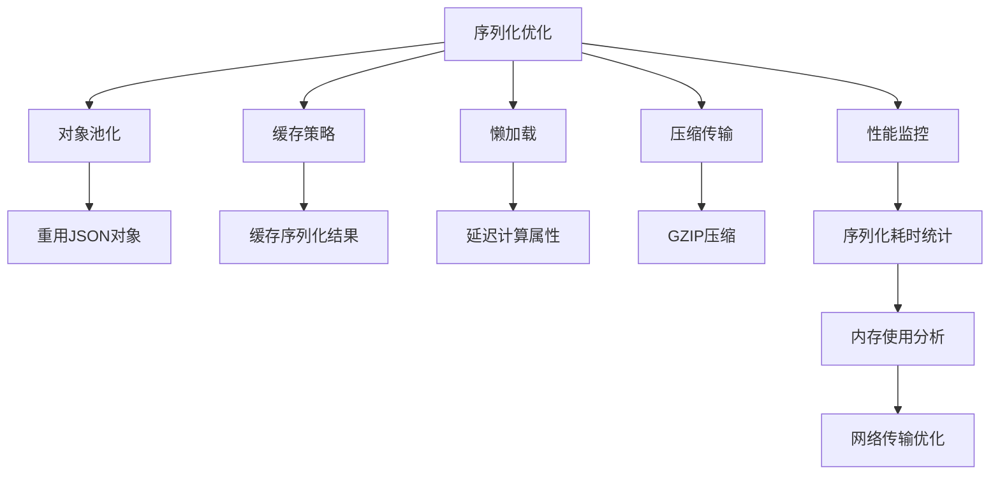

### 针对不同场景的优化方案

#### 1. 高频消息场景
- **批量处理**: 将多个小消息合并为批量消息
- **压缩传输**: 对大消息体启用压缩
- **缓存策略**: 缓存常用消息模板

#### 2. 实时性要求高的场景
- **流式处理**: 使用流式JSON解析
- **异步序列化**: 在后台线程进行序列化
- **预编译模式**: 预编译常用的序列化模式

#### 3. 内存敏感场景
- **对象复用**: 复用DTO对象实例
- **弱引用**: 对大型对象使用弱引用
- **及时释放**: 及时清理不再需要的对象

### 性能监控指标

| 指标类型 | 监控内容 | 优化目标 | 实现方式 |
|----------|----------|----------|----------|
| 序列化速度 | 每秒处理消息数 | >1000 msg/s | 并行处理、缓存 |
| 内存占用 | 序列化对象内存 | <1MB/对象 | 对象池、压缩 |
| 网络传输 | 消息包大小 | <10KB | 压缩、精简字段 |
| 延迟时间 | 序列化耗时 | <10ms | 异步处理 |

**章节来源**
- [SendMsgUtil.java](file://Common/src/main/java/com/bot/common/util/SendMsgUtil.java#L29-L33)

## 最佳实践指南

### DTO设计最佳实践

1. **字段命名规范**
   - 使用清晰的英文命名
   - 遵循驼峰命名法
   - 避免使用缩写，除非是广泛认可的缩写

2. **类型选择原则**
   - 优先使用String而非Integer，避免空指针异常
   - 使用包装类型而非基本类型
   - 考虑使用BigDecimal处理货币金额

3. **版本兼容性**
   - 新增字段时设置默认值
   - 避免删除现有字段
   - 使用注解标记字段的生命周期

### 错误处理策略

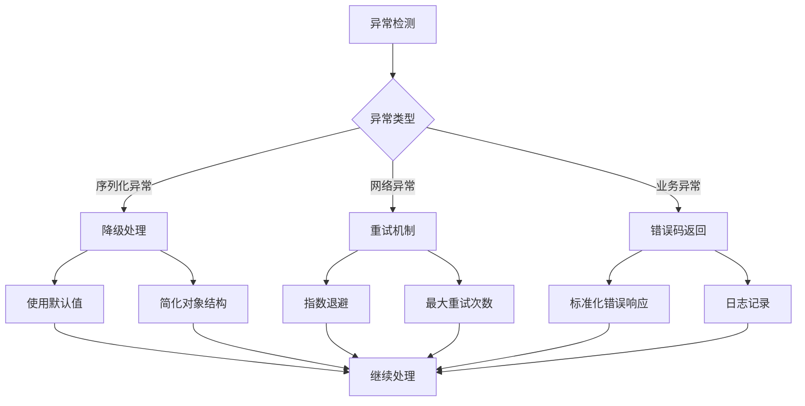

### 测试策略

1. **单元测试覆盖**
   - DTO类的基本getter/setter测试
   - 构造函数的完整性测试
   - 序列化/反序列化的正确性测试

2. **集成测试验证**
   - 跨模块数据传递测试
   - 异常场景处理测试
   - 性能基准测试

3. **监控和告警**
   - 序列化失败率监控
   - 响应时间趋势分析
   - 内存使用情况跟踪

### 安全考虑

1. **输入验证**
   - 长度限制检查
   - 字符集验证
   - 敏感信息过滤

2. **权限控制**
   - 字段级别的访问控制
   - 敏感数据脱敏
   - 操作审计记录

3. **传输安全**
   - HTTPS协议使用
   - 数据加密传输
   - 数字签名验证

## 总结

Bot项目的数据模型设计体现了现代Java应用的最佳实践，通过精心设计的DTO体系实现了：

### 核心优势

1. **模块化设计**: 清晰的职责分离，便于维护和扩展
2. **类型安全**: 强类型约束减少了运行时错误
3. **性能优化**: 合理的序列化策略保证了系统性能
4. **易于测试**: 简洁的DTO结构便于单元测试

### 技术亮点

- **Lombok简化开发**: 大幅减少样板代码
- **统一的数据传输格式**: 提升系统的一致性
- **灵活的状态管理**: 支持复杂的业务场景
- **完善的监控机制**: 确保系统的稳定性

### 发展方向

1. **微服务改造**: 将现有模块进一步拆分为独立的服务
2. **事件驱动架构**: 引入事件总线提升系统的响应性
3. **云原生优化**: 适配容器化部署需求
4. **AI能力集成**: 结合机器学习提升用户体验

通过深入理解这些核心数据模型的设计理念和实现细节，开发者可以更好地维护和扩展Bot系统，同时为类似项目的开发提供宝贵的参考经验。