# 奖励发放系统

<cite>
**本文档引用的文件**
- [BotAward.java](file://Game/src/main/java/com/bot/game/dao/entity/BotAward.java)
- [BotUserAward.java](file://Game/src/main/java/com/bot/game/dao/entity/BotUserAward.java)
- [BotActivityAward.java](file://Game/src/main/java/com/bot/game/dao/entity/BotActivityAward.java)
- [ActivityAwardDTO.java](file://Common/src/main/java/com/bot/common/dto/ActivityAwardDTO.java)
- [BotAwardMapper.xml](file://Game/src/main/resources/mapper/BotAwardMapper.xml)
- [BotUserAwardMapper.xml](file://Game/src/main/resources/mapper/BotUserAwardMapper.xml)
- [BotActivityAwardMapper.xml](file://Game/src/main/resources/mapper/BotActivityAwardMapper.xml)
- [ActivityServiceImpl.java](file://Base/src/main/java/com/bot/base/service/impl/ActivityServiceImpl.java)
- [SystemManager.java](file://Base/src/main/java/com/bot/base/service/SystemManager.java)
- [ENAwardType.java](file://Common/src/main/java/com/bot/common/enums/ENAwardType.java)
</cite>

## 目录
1. [系统概述](#系统概述)
2. [数据模型设计](#数据模型设计)
3. [核心组件分析](#核心组件分析)
4. [奖励类型与概率配置](#奖励类型与概率配置)
5. [用户奖励领取机制](#用户奖励领取机制)
6. [批量查询与统计优化](#批量查询与统计优化)
7. [ActivityAwardDTO数据转换](#activityawardsdto数据转换)
8. [大规模奖励发放优化方案](#大规模奖励发放优化方案)
9. [系统架构图](#系统架构图)
10. [总结](#总结)

## 系统概述

奖励发放系统是Bot项目中的核心功能模块，负责管理活动奖励的配置、分配和统计。该系统采用基于概率的随机抽奖机制，支持多种奖励类型，并提供完善的防重复领取和统计分析功能。

系统主要包含以下核心功能：
- 奖励配置管理（BotActivityAward）
- 用户奖励领取记录（BotUserAward）
- 活动奖励类型定义（ENAwardType）
- 基于概率的抽奖算法
- 奖励统计与排行榜计算
- 防重复领取机制

## 数据模型设计

### 核心数据表结构

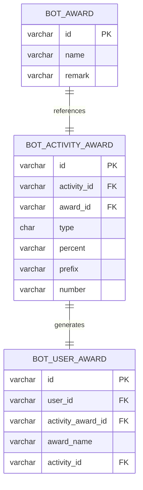

**图表来源**
- [BotAward.java](file://Game/src/main/java/com/bot/game/dao/entity/BotAward.java#L1-L168)
- [BotActivityAward.java](file://Game/src/main/java/com/bot/game/dao/entity/BotActivityAward.java#L1-L308)
- [BotUserAward.java](file://Game/src/main/java/com/bot/game/dao/entity/BotUserAward.java#L1-L238)

### 数据模型详细说明

#### BotAward - 奖励基础信息表
存储系统中所有可用奖励的基础信息，包括奖励名称和备注说明。

#### BotActivityAward - 活动奖励配置表  
存储活动相关的奖励配置信息，包含概率、前缀、数量等关键属性。

#### BotUserAward - 用户奖励领取记录表
记录用户的奖励领取情况，建立用户与奖励的关联关系。

**章节来源**
- [BotAward.java](file://Game/src/main/java/com/bot/game/dao/entity/BotAward.java#L1-L168)
- [BotActivityAward.java](file://Game/src/main/java/com/bot/game/dao/entity/BotActivityAward.java#L1-L308)
- [BotUserAward.java](file://Game/src/main/java/com/bot/game/dao/entity/BotUserAward.java#L1-L238)

## 核心组件分析

### BotActivityAward实体分析

BotActivityAward是奖励配置的核心实体，包含了奖励发放的所有关键属性：

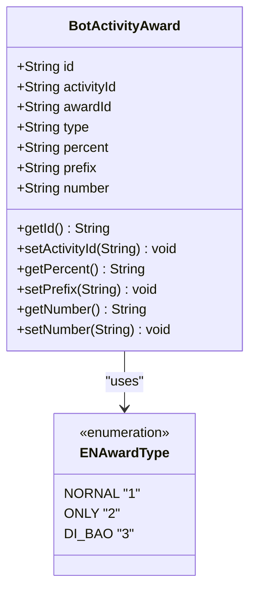

**图表来源**
- [BotActivityAward.java](file://Game/src/main/java/com/bot/game/dao/entity/BotActivityAward.java#L5-L308)
- [ENAwardType.java](file://Common/src/main/java/com/bot/common/enums/ENAwardType.java#L1-L18)

### ActivityAwardDTO数据传输对象

ActivityAwardDTO作为服务层与表现层之间的数据转换对象，封装了奖励配置的核心信息：

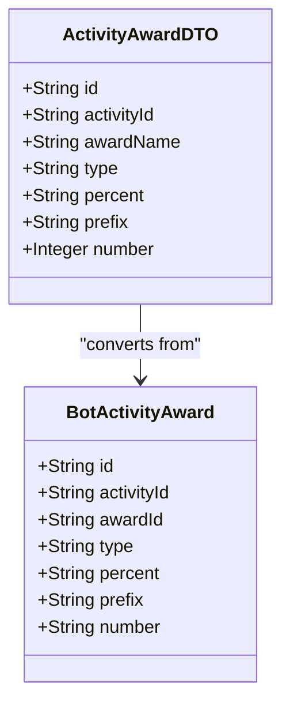

**图表来源**
- [ActivityAwardDTO.java](file://Common/src/main/java/com/bot/common/dto/ActivityAwardDTO.java#L1-L25)
- [BotActivityAward.java](file://Game/src/main/java/com/bot/game/dao/entity/BotActivityAward.java#L5-L308)

**章节来源**
- [ActivityAwardDTO.java](file://Common/src/main/java/com/bot/common/dto/ActivityAwardDTO.java#L1-L25)
- [BotActivityAward.java](file://Game/src/main/java/com/bot/game/dao/entity/BotActivityAward.java#L1-L308)

## 奖励类型与概率配置

### 奖励类型枚举

系统定义了三种奖励类型，通过ENAwardType枚举进行管理：

| 类型 | 值 | 描述 | 特性 |
|------|----|----- |------|
| 普通奖励 | 1 | 常规奖励，参与概率计算 | 可重复获得 |
| 唯一奖励 | 2 | 每个用户只能获得一次 | 排他性 |
| 低保奖励 | 3 | 必保奖励，确保至少获得一次 | 保底机制 |

### 概率配置机制

BotActivityAward中的percent字段定义了奖励的概率配置：

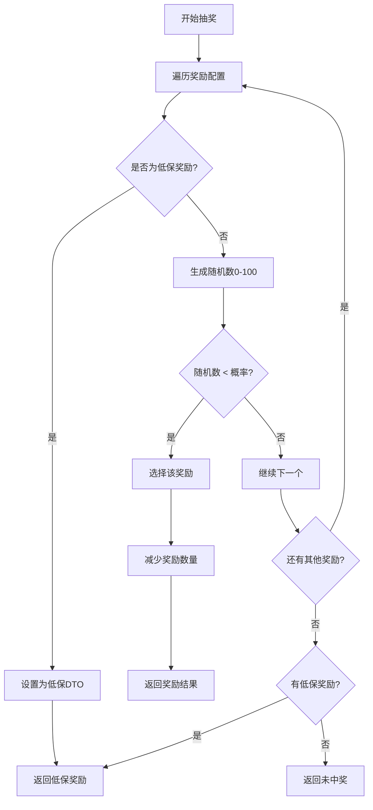

**图表来源**
- [ActivityServiceImpl.java](file://Base/src/main/java/com/bot/base/service/impl/ActivityServiceImpl.java#L683-L697)

### 前缀规则系统

prefix字段用于定义奖励的显示前缀，提供奖励的分类和标识功能：

- **稀有度前缀**：如"★"表示稀有奖励
- **活动专属前缀**：如"活动限定"标识特定活动奖励
- **组合前缀**：支持多层级前缀组合

**章节来源**
- [ENAwardType.java](file://Common/src/main/java/com/bot/common/enums/ENAwardType.java#L1-L18)
- [ActivityServiceImpl.java](file://Base/src/main/java/com/bot/base/service/impl/ActivityServiceImpl.java#L683-L697)

## 用户奖励领取机制

### 领取流程设计

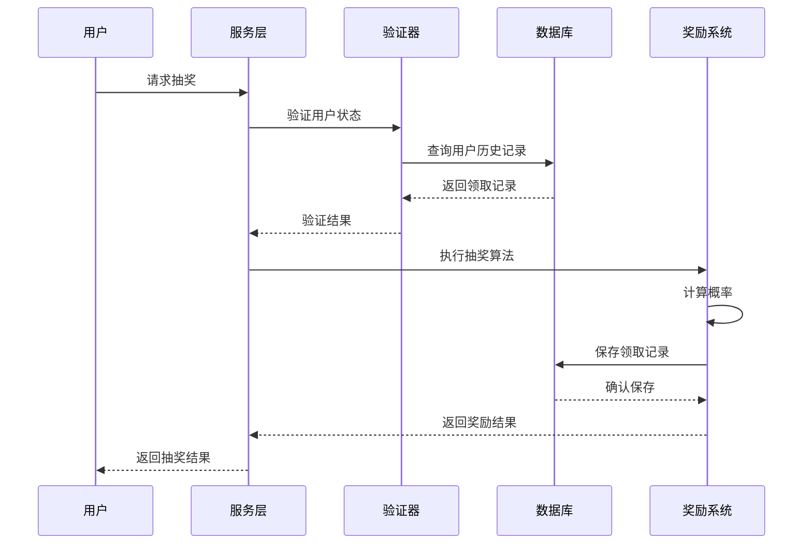

**图表来源**
- [ActivityServiceImpl.java](file://Base/src/main/java/com/bot/base/service/impl/ActivityServiceImpl.java#L680-L710)

### 防重复领取机制

系统通过BotUserAward表实现防重复领取机制：

1. **唯一标识**：每个BotUserAward记录都有唯一的ID
2. **用户关联**：通过userId字段建立用户与奖励的绑定
3. **活动隔离**：通过activityId区分不同活动的奖励
4. **奖励追踪**：通过activityAwardId追踪具体的奖励配置

### 领取记录生成流程

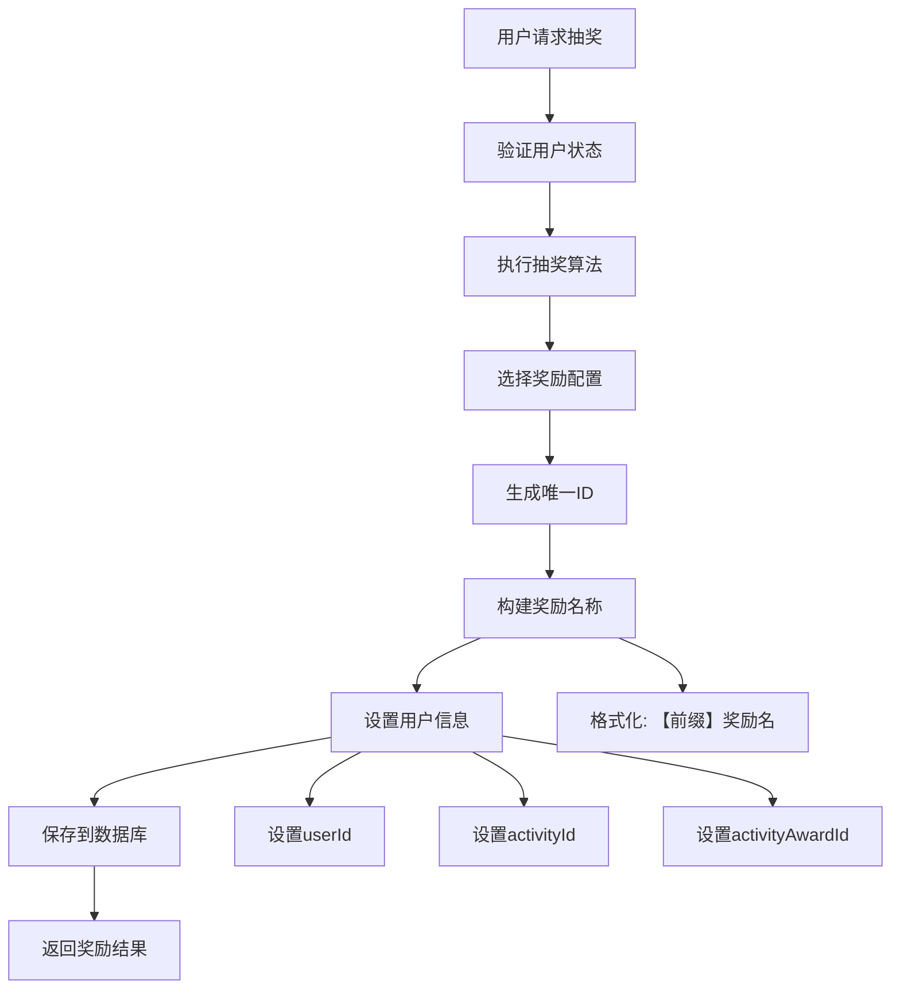

**图表来源**
- [ActivityServiceImpl.java](file://Base/src/main/java/com/bot/base/service/impl/ActivityServiceImpl.java#L702-L708)

**章节来源**
- [ActivityServiceImpl.java](file://Base/src/main/java/com/bot/base/service/impl/ActivityServiceImpl.java#L680-L710)

## 批量查询与统计优化

### 统计查询优化策略

系统提供了多种统计查询功能，针对大规模数据场景进行了优化：

#### 中奖汇总查询
通过BotUserAwardMapper实现高效的批量查询：

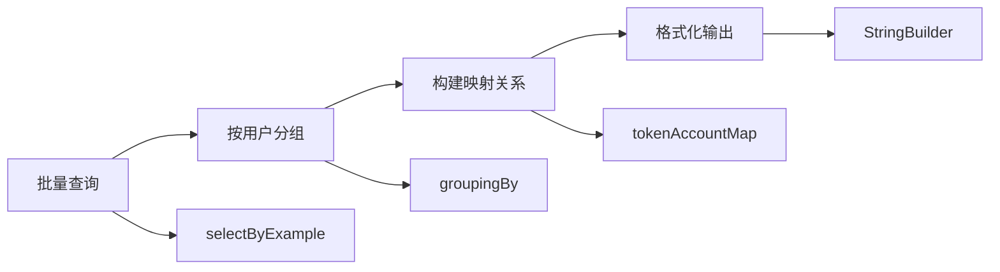

**图表来源**
- [ActivityServiceImpl.java](file://Base/src/main/java/com/bot/base/service/impl/ActivityServiceImpl.java#L728-L744)

#### 排行榜计算优化
系统支持基于用户奖励数量的排行榜计算：

1. **分组统计**：按用户ID分组统计奖励数量
2. **排序算法**：使用Java Stream API进行高效排序
3. **内存优化**：采用流式处理避免大量内存占用

### SQL优化技术

BotActivityAwardMapper.xml中包含了多种优化的SQL查询：

| 查询类型 | 优化策略 | 性能特点 |
|----------|----------|----------|
| 批量查询 | 使用索引覆盖 | 减少回表操作 |
| 条件过滤 | 动态WHERE子句 | 灵活查询条件 |
| 分页查询 | LIMIT/OFFSET | 大数据集分页 |
| 统计聚合 | GROUP BY优化 | 高效聚合计算 |

**章节来源**
- [ActivityServiceImpl.java](file://Base/src/main/java/com/bot/base/service/impl/ActivityServiceImpl.java#L728-L744)

## ActivityAwardDTO数据转换

### 转换机制设计

ActivityAwardDTO作为服务层与表现层之间的桥梁，实现了数据的标准化传输：

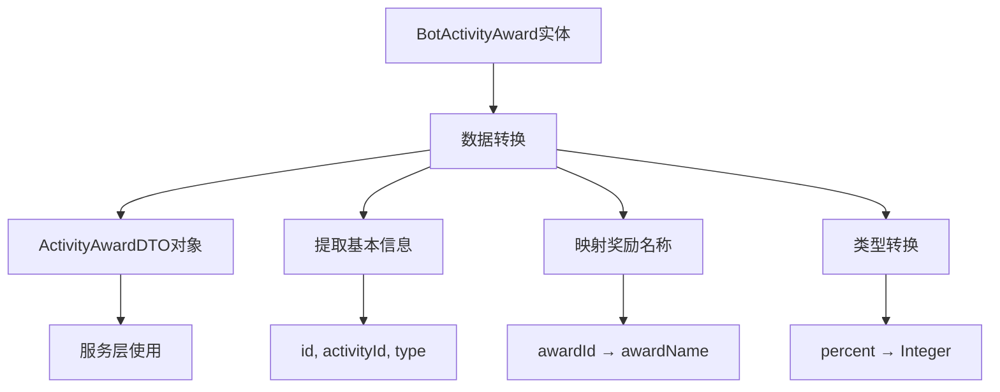

**图表来源**
- [SystemManager.java](file://Base/src/main/java/com/bot/base/service/SystemManager.java#L221-L230)

### 缓存机制

系统通过SystemConfigCache.activityAwardList维护奖励配置的内存缓存：

1. **启动加载**：系统启动时从数据库加载所有活动奖励配置
2. **实时更新**：活动开启或结束时刷新缓存内容
3. **内存优化**：使用ActivityAwardDTO减少数据库访问频率

**章节来源**
- [SystemManager.java](file://Base/src/main/java/com/bot/base/service/SystemManager.java#L221-L230)

## 大规模奖励发放优化方案

### 异步发放机制

针对大规模奖励发放场景，建议采用以下异步处理方案：

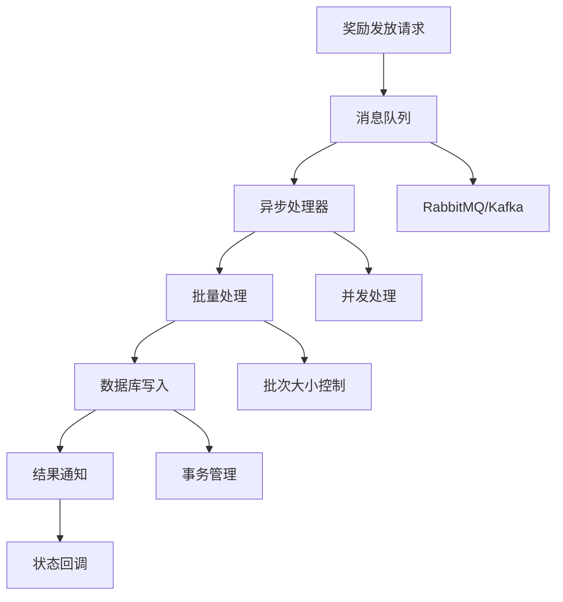

### 分批处理策略

1. **批次大小控制**：每批次处理1000-5000条记录
2. **内存管理**：控制单次处理的内存占用
3. **错误恢复**：支持部分失败的重试机制
4. **进度监控**：实时跟踪处理进度

### 消息队列集成

推荐使用Kafka或RabbitMQ实现奖励发放的异步处理：

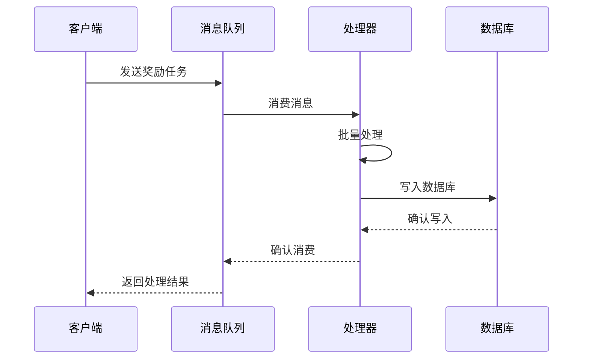

### 性能监控指标

| 指标类型 | 监控内容 | 优化目标 |
|----------|----------|----------|
| 吞吐量 | 每秒处理奖励数量 | >1000/秒 |
| 延迟 | 从请求到完成的时间 | <100ms |
| 错误率 | 处理失败的比例 | <0.1% |
| 内存使用 | 处理过程中的内存占用 | <2GB |

## 系统架构图

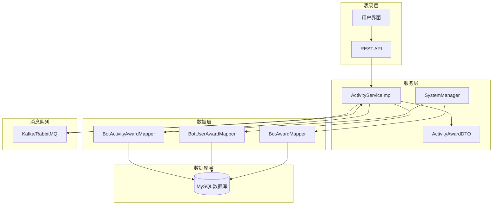

**图表来源**
- [ActivityServiceImpl.java](file://Base/src/main/java/com/bot/base/service/impl/ActivityServiceImpl.java#L1-L748)
- [SystemManager.java](file://Base/src/main/java/com/bot/base/service/SystemManager.java#L1-L299)

## 总结

奖励发放系统是一个设计精良的分布式奖励管理平台，具有以下核心优势：

### 技术特点
1. **灵活的概率配置**：支持多种奖励类型的精确概率控制
2. **完善的防重复机制**：通过唯一标识和关联关系确保奖励的唯一性
3. **高效的统计分析**：提供批量查询和分组统计功能
4. **可扩展的架构设计**：支持异步处理和消息队列集成

### 优化建议
1. **引入缓存机制**：对频繁访问的奖励配置进行缓存
2. **实施分片策略**：对大规模数据进行水平分片
3. **增强监控能力**：添加详细的性能监控和告警机制
4. **完善测试覆盖**：增加单元测试和压力测试

该系统为Bot项目提供了稳定可靠的奖励发放能力，能够满足各种复杂的业务场景需求，同时具备良好的扩展性和维护性。