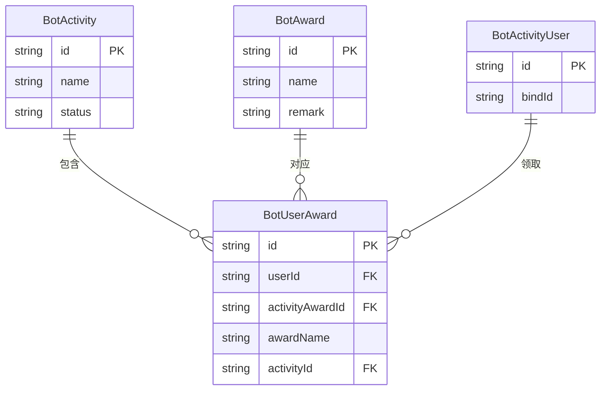
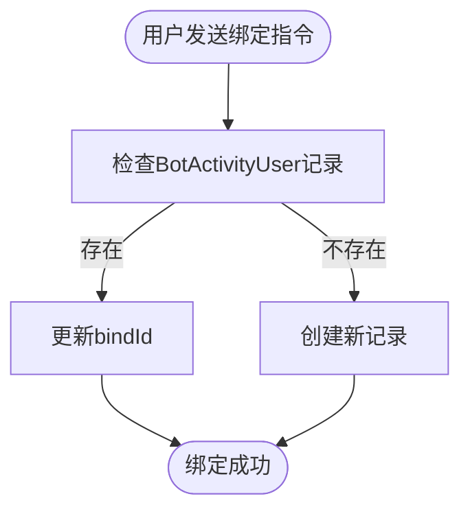
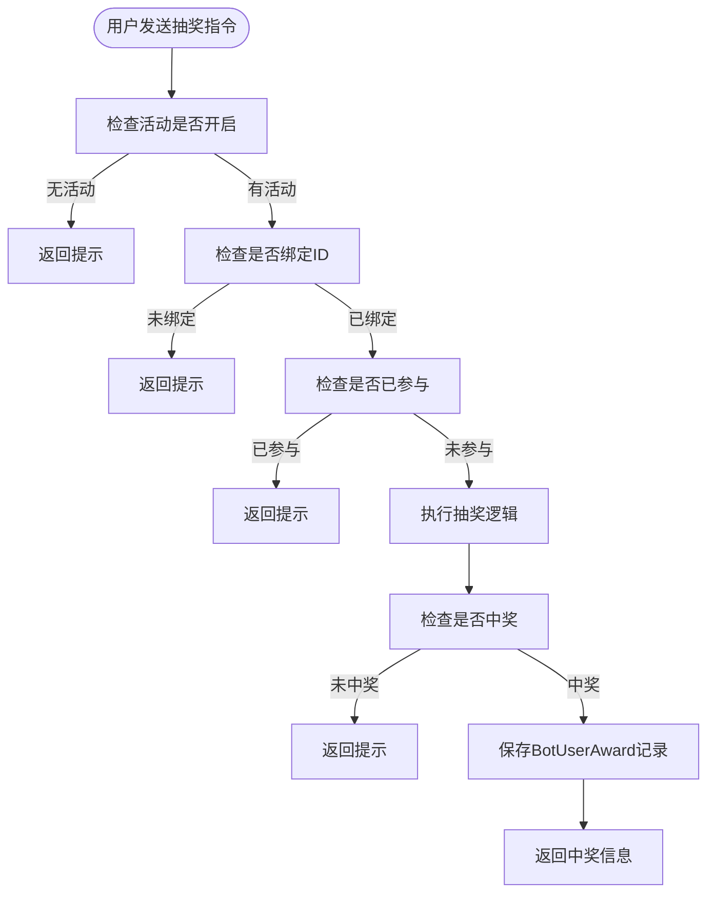
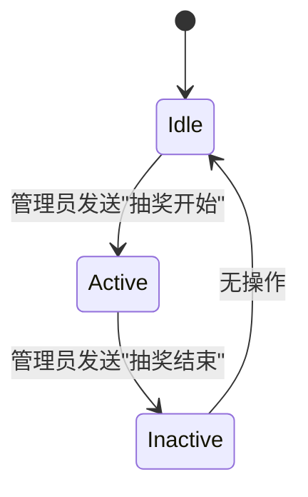
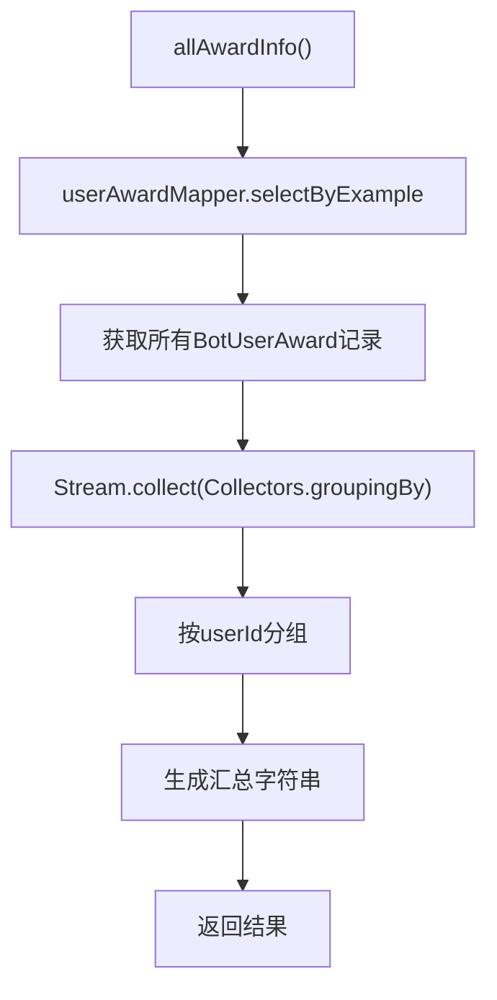
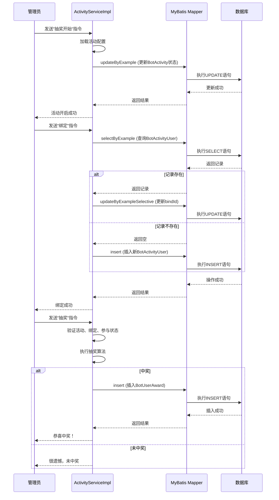

# 活动与奖励系统模型

<cite>
**本文档引用文件**   
- [BotActivity.java](file://Game\src\main\java\com\bot\game\dao\entity\BotActivity.java)
- [BotActivityUser.java](file://Game\src\main\java\com\bot\game\dao\entity\BotActivityUser.java)
- [BotAward.java](file://Game\src\main\java\com\bot\game\dao\entity\BotAward.java)
- [BotUserAward.java](file://Game\src\main\java\com\bot\game\dao\entity\BotUserAward.java)
- [BotActivityMapper.xml](file://Game\src\main\resources\mapper\BotActivityMapper.xml)
- [BotActivityUserMapper.xml](file://Game\src\main\resources\mapper\BotActivityUserMapper.xml)
- [BotAwardMapper.xml](file://Game\src\main\resources\mapper\BotAwardMapper.xml)
- [BotUserAwardMapper.xml](file://Game\src\main\resources\mapper\BotUserAwardMapper.xml)
- [ActivityServiceImpl.java](file://Base\src\main\java\com\bot\base\service\impl\ActivityServiceImpl.java)
- [ENAwardType.java](file://Common\src\main\java\com\bot\common\enums\ENAwardType.java)
- [BaseConsts.java](file://Common\src\main\java\com\bot\common\constant\BaseConsts.java)
- [ActivityAwardDTO.java](file://Common\src\main\java\com\bot\common\dto\ActivityAwardDTO.java)
</cite>

## 目录
1. [核心数据结构](#核心数据结构)
2. [业务流程分析](#业务流程分析)
3. [活动状态机设计](#活动状态机设计)
4. [奖励发放策略与防刷机制](#奖励发放策略与防刷机制)
5. [Mapper配置与复杂查询](#mapper配置与复杂查询)
6. [数据流转示意图](#数据流转示意图)
7. [性能优化建议](#性能优化建议)

## 核心数据结构

活动与奖励系统的核心数据结构由四个主要实体类构成：`BotActivity`（活动）、`BotAward`（奖励）、`BotActivityUser`（活动参与记录）和 `BotUserAward`（用户奖励领取）。

`BotActivity` 类定义了活动的基本信息，包含 `id`、`name` 和 `status` 三个字段。其中 `id` 是活动的唯一标识，`name` 是活动名称，`status` 表示活动的当前状态。

`BotAward` 类用于定义奖励的元数据，包含 `id`、`name` 和 `remark` 字段。`id` 是奖励的唯一标识，`name` 是奖励名称，`remark` 用于存储奖励的备注信息。

`BotActivityUser` 类记录了用户的活动参与信息，包含 `id` 和 `bindId` 两个字段。`id` 通常与用户的唯一标识（如token）关联，`bindId` 则用于存储用户绑定的游戏ID或其他身份信息。

`BotUserAward` 类是用户实际领取奖励的记录，包含 `id`、`userId`、`activityAwardId`、`awardName` 和 `activityId` 字段。它将用户、活动和具体的奖励关联起来，形成完整的奖励发放记录。

**图源**
- [BotActivity.java](file://Game\src\main\java\com\bot\game\dao\entity\BotActivity.java)
- [BotAward.java](file://Game\src\main\java\com\bot\game\dao\entity\BotAward.java)
- [BotActivityUser.java](file://Game\src\main\java\com\bot\game\dao\entity\BotActivityUser.java)
- [BotUserAward.java](file://Game\src\main\java\com\bot\game\dao\entity\BotUserAward.java)

**本节来源**
- [BotActivity.java](file://Game\src\main\java\com\bot\game\dao\entity\BotActivity.java)
- [BotAward.java](file://Game\src\main\java\com\bot\game\dao\entity\BotAward.java)
- [BotActivityUser.java](file://Game\src\main\java\com\bot\game\dao\entity\BotActivityUser.java)
- [BotUserAward.java](file://Game\src\main\java\com\bot\game\dao\entity\BotUserAward.java)

## 业务流程分析

### 活动参与流程

活动参与流程始于用户通过指令绑定其游戏ID。在 `ActivityServiceImpl` 类中，`bindAccount` 方法处理此流程。该方法首先根据用户的token查询 `BotActivityUser` 记录，如果记录存在则更新 `bindId`，否则创建一条新记录。这确保了每个用户只能绑定一个游戏ID。

**图源**
- [ActivityServiceImpl.java](file://Base\src\main\java\com\bot\base\service\impl\ActivityServiceImpl.java#L644-L658)

**本节来源**
- [ActivityServiceImpl.java](file://Base\src\main\java\com\bot\base\service\impl\ActivityServiceImpl.java#L644-L658)

### 奖励领取流程

奖励领取流程的核心是 `getAward` 方法。该流程首先检查当前是否有开启的活动，然后验证用户是否已绑定游戏ID。接着，通过查询 `BotUserAward` 表来检查用户是否已参与过当前活动，防止重复参与。

抽奖逻辑通过遍历 `SystemConfigCache.activityAwardList` 实现。系统会优先检查是否存在“低保”奖励（类型为 `DI_BAO`），然后根据配置的概率（`percent`）和剩余数量（`number`）进行随机抽奖。一旦用户中奖，系统会创建一条 `BotUserAward` 记录并持久化到数据库。

**图源**
- [ActivityServiceImpl.java](file://Base\src\main\java\com\bot\base\service\impl\ActivityServiceImpl.java#L661-L710)

**本节来源**
- [ActivityServiceImpl.java](file://Base\src\main\java\com\bot\base\service\impl\ActivityServiceImpl.java#L661-L710)
- [BaseConsts.java](file://Common\src\main\java\com\bot\common\constant\BaseConsts.java#L220)

## 活动状态机设计

活动状态机的设计相对简单，主要通过 `BotActivity` 实体的 `status` 字段来实现。虽然代码中未明确定义状态枚举，但从 `ActivityServiceImpl` 类的 `doQueryReturn` 方法可以推断出状态机的流转。

活动的生命周期由管理员通过特定指令控制。当管理员发送“抽奖开始”指令时，系统会加载并开启一个活动。当管理员发送“抽奖结束”指令时，系统会将对应活动的 `status` 更新为“关闭”状态（`ENYesOrNo.NO.getValue()`）。

这种设计将状态管理与业务逻辑分离，`status` 字段仅作为活动是否可参与的开关。真正的状态流转逻辑（开始/结束）由服务层的业务方法控制，这使得状态机的实现更加灵活且易于管理。

**图源**
- [ActivityServiceImpl.java](file://Base\src\main\java\com\bot\base\service\impl\ActivityServiceImpl.java#L237-L242)

**本节来源**
- [ActivityServiceImpl.java](file://Base\src\main\java\com\bot\base\service\impl\ActivityServiceImpl.java#L237-L242)

## 奖励发放策略与防刷机制

### 奖励发放策略

奖励发放策略由 `ENAwardType` 枚举和 `ActivityAwardDTO` 类共同定义。`ENAwardType` 定义了三种奖励类型：`NORNAL`（普通）、`ONLY`（唯一）和 `DI_BAO`（低保）。

在 `getAward` 方法中，系统首先遍历所有奖励，将“低保”类型的奖励单独提取出来。对于非“低保”奖励，系统会根据其配置的 `percent`（概率）和 `number`（数量）进行随机抽取。一旦某个奖励被抽中，其 `number` 会减一，从而实现限量发放。

这种策略确保了高价值奖励的稀缺性，同时通过“低保”机制保证了用户最低的中奖概率，提升了用户体验。

### 防刷机制

系统实现了多层防刷机制：
1.  **重复参与限制**：通过查询 `BotUserAward` 表，确保同一用户在单个活动中只能领取一次奖励。
2.  **业务逻辑校验**：在抽奖前强制要求用户绑定游戏ID，增加了作弊成本。
3.  **全局配置缓存**：奖励的配置信息（如数量、概率）存储在 `SystemConfigCache.activityAwardList` 中，避免了频繁的数据库查询，同时也防止了通过并发请求绕过数量限制。

这些机制共同作用，有效防止了用户通过脚本或手动重复操作来刷取奖励。

**本节来源**
- [ActivityServiceImpl.java](file://Base\src\main\java\com\bot\base\service\impl\ActivityServiceImpl.java#L681-L697)
- [ENAwardType.java](file://Common\src\main\java\com\bot\common\enums\ENAwardType.java)
- [ActivityAwardDTO.java](file://Common\src\main\java\com\bot\common\dto\ActivityAwardDTO.java)

## Mapper配置与复杂查询

MyBatis Mapper 配置文件定义了数据访问层的SQL操作。`BotActivityMapper.xml` 等文件通过 `<resultMap>` 定义了数据库字段与Java实体的映射关系，并通过 `<select>`、`<insert>`、`<update>` 和 `<delete>` 标签定义了CRUD操作。

对于复杂的查询，如批量奖励发放和排行榜统计，系统主要在服务层通过Java代码实现。例如，`allAwardInfo` 方法通过 `userAwardMapper.selectByExample` 获取所有奖励记录，然后利用Java 8的Stream API进行分组和聚合，最终生成中奖汇总信息。

**图源**
- [BotUserAwardMapper.xml](file://Game\src\main\resources\mapper\BotUserAwardMapper.xml)
- [ActivityServiceImpl.java](file://Base\src\main\java\com\bot\base\service\impl\ActivityServiceImpl.java#L728-L744)

**本节来源**
- [BotUserAwardMapper.xml](file://Game\src\main\resources\mapper\BotUserAwardMapper.xml)
- [ActivityServiceImpl.java](file://Base\src\main\java\com\bot\base\service\impl\ActivityServiceImpl.java#L728-L744)

## 数据流转示意图

以下示意图展示了活动从创建到用户领取奖励的完整数据流转过程。

**图源**
- [ActivityServiceImpl.java](file://Base\src\main\java\com\bot\base\service\impl\ActivityServiceImpl.java)
- [BotActivityMapper.xml](file://Game\src\main\resources\mapper\BotActivityMapper.xml)
- [BotActivityUserMapper.xml](file://Game\src\main\resources\mapper\BotActivityUserMapper.xml)
- [BotUserAwardMapper.xml](file://Game\src\main\resources\mapper\BotUserAwardMapper.xml)

## 性能优化建议

针对大规模用户参与活动的性能挑战，提出以下优化建议：

### 分表分库
随着 `BotUserAward` 表数据量的增长，单表查询性能会急剧下降。建议根据 `activityId` 进行水平分表，将不同活动的奖励记录分散到不同的物理表中。例如，可以创建 `bot_user_award_202310`、`bot_user_award_202311` 等表。在极端情况下，可以考虑分库，将高流量的活动数据迁移到独立的数据库实例。

### 异步处理
当前的奖励发放流程是同步的，用户需要等待数据库操作完成才能收到响应。建议引入消息队列（如RabbitMQ或Kafka），将奖励发放请求放入队列，由后台消费者异步处理。这可以显著提升接口响应速度，并能更好地应对瞬时高并发。

### 缓存优化
目前，活动配置信息已通过 `SystemConfigCache` 进行缓存，这是一个良好的实践。建议进一步对高频查询进行缓存，例如将 `allAwardInfo` 的结果缓存一段时间，避免每次请求都进行复杂的数据库查询和Java聚合操作。

### 数据库索引
确保在 `BotUserAward` 表的 `userId` 和 `activityId` 字段上建立复合索引，以加速 `selectByExample` 查询。同样，在 `BotActivityUser` 表的 `id` 字段上也应有索引。

**本节来源**
- [ActivityServiceImpl.java](file://Base\src\main\java\com\bot\base\service\impl\ActivityServiceImpl.java)
- [BotUserAwardMapper.xml](file://Game\src\main\resources\mapper\BotUserAwardMapper.xml)