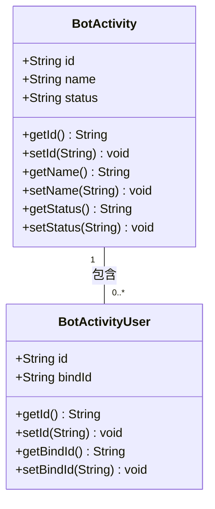
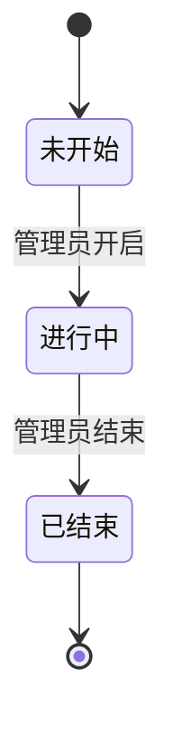
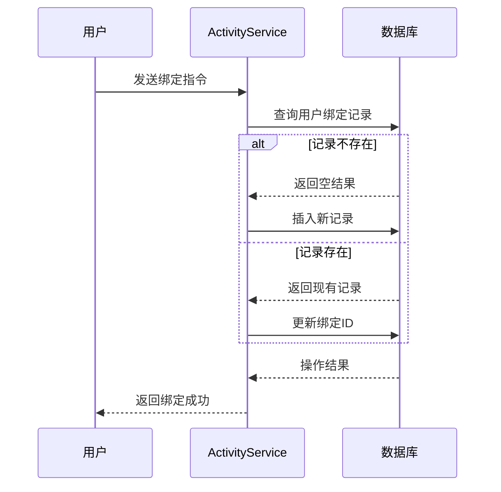
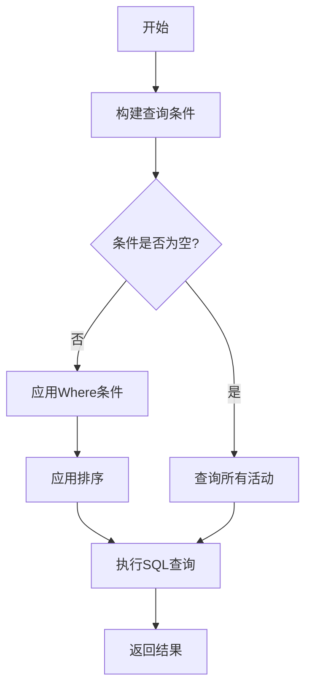
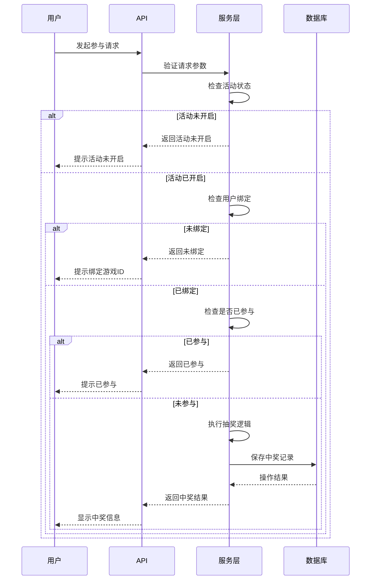

# 活动管理系统

<cite>
**本文档引用的文件**   
- [BotActivity.java](file://Game\src\main\java\com\bot\game\dao\entity\BotActivity.java)
- [BotActivityUser.java](file://Game\src\main\java\com\bot\game\dao\entity\BotActivityUser.java)
- [BotActivityMapper.java](file://Game\src\main\java\com\bot\game\dao\mapper\BotActivityMapper.java)
- [BotActivityMapper.xml](file://Game\src\main\resources\mapper\BotActivityMapper.xml)
- [BotActivityUserMapper.xml](file://Game\src\main\resources\mapper\BotActivityUserMapper.xml)
- [ActivityServiceImpl.java](file://Base\src\main\java\com\bot\base\service\impl\ActivityServiceImpl.java)
- [SystemManager.java](file://Base\src\main\java\com\bot\base\service\SystemManager.java)
</cite>

## 目录
1. [引言](#引言)
2. [核心数据结构](#核心数据结构)
3. [活动状态机实现](#活动状态机实现)
4. [参与记录生命周期](#参与记录生命周期)
5. [SQL配置分析](#sql配置分析)
6. [API设计思路](#api设计思路)
7. [高并发性能优化](#高并发性能优化)
8. [结论](#结论)

## 引言
活动管理系统（BotActivity）是本项目中的核心功能模块之一，负责管理各类用户参与活动的完整生命周期。该系统实现了活动创建、状态管理、用户参与记录等关键功能，支持抽奖、绑定、查询等多种业务场景。系统采用MyBatis作为持久层框架，通过清晰的数据结构和状态机机制确保活动流程的正确性和可靠性。本文档将详细阐述该系统的核心数据结构、业务流程、状态机实现机制以及高并发场景下的性能优化方案。

## 核心数据结构

活动管理系统的核心数据结构主要包括活动实体（BotActivity）和活动用户实体（BotActivityUser），这两个实体构成了系统的基础数据模型。

### 活动实体（BotActivity）
`BotActivity`类定义了活动的核心属性，包含以下关键字段：
- **id**: 活动的唯一标识符，作为主键使用
- **name**: 活动名称，用于标识和查询活动
- **status**: 活动状态，表示活动的当前状态（如开启/关闭）

该实体通过MyBatis Generator自动生成，实现了基本的序列化功能和对象比较方法，确保了数据的一致性和可传输性。

### 活动用户实体（BotActivityUser）
`BotActivityUser`类用于管理用户与活动的关联关系，包含以下字段：
- **id**: 用户标识符，通常与用户的token关联
- **bindId**: 绑定的游戏ID，用于关联用户的实际游戏账号

该实体实现了用户参与活动的绑定关系，支持用户通过绑定游戏ID参与特定活动。

### 数据结构关系
活动管理系统中的数据结构关系如下：
- 一个活动（BotActivity）可以有多个参与者（BotActivityUser）
- 每个参与者（BotActivityUser）只能绑定一个游戏ID
- 活动状态通过status字段进行管理，支持开启和关闭两种状态



**图源**
- [BotActivity.java](file://Game\src\main\java\com\bot\game\dao\entity\BotActivity.java)
- [BotActivityUser.java](file://Game\src\main\java\com\bot\game\dao\entity\BotActivityUser.java)

**本节源**
- [BotActivity.java](file://Game\src\main\java\com\bot\game\dao\entity\BotActivity.java#L1-L168)
- [BotActivityUser.java](file://Game\src\main\java\com\bot\game\dao\entity\BotActivityUser.java#L1-L133)

## 活动状态机实现

活动状态机是活动管理系统的核心机制，负责管理活动的生命周期状态转换。系统通过简单的状态字段实现复杂的状态管理逻辑。

### 状态定义
活动状态通过`status`字段进行管理，目前支持两种状态：
- **开启状态**：用`ENYesOrNo.YES.getValue()`表示，值为"1"
- **关闭状态**：用`ENYesOrNo.NO.getValue()`表示，值为"0"

### 状态转换规则
状态机实现了严格的状态转换规则，确保活动状态的正确性：
- **未开始 → 进行中**：通过管理员指令开启活动，将状态从"0"更新为"1"
- **进行中 → 已结束**：通过管理员指令结束活动，将状态从"1"更新为"0"
- **已结束 → 未开始**：活动结束后不可重新开启，需创建新活动

### 状态转换实现
状态转换通过`SystemManager`类中的管理方法实现，具体流程如下：



**图源**
- [SystemManager.java](file://Base\src\main\java\com\bot\base\service\SystemManager.java#L200-L250)

**本节源**
- [SystemManager.java](file://Base\src\main\java\com\bot\base\service\SystemManager.java#L200-L250)
- [BotActivity.java](file://Game\src\main\java\com\bot\game\dao\entity\BotActivity.java#L28-L35)

### 时间驱动的自动状态变更
系统通过缓存机制实现时间驱动的状态管理：
- 活动开启时，将活动奖品信息加载到`SystemConfigCache.activityAwardList`缓存中
- 活动结束时，清空奖品缓存，自动终止抽奖功能
- 通过缓存状态判断活动是否正在进行，实现逻辑上的自动状态变更

这种设计避免了复杂的时间调度，通过简单的缓存机制实现了活动生命周期的自动管理。

## 参与记录生命周期

活动参与记录的生命周期管理是系统的重要组成部分，涵盖了用户绑定、参与、中奖等完整流程。

### 参与记录创建
用户参与活动的流程如下：
1. 用户发送绑定指令，包含游戏ID
2. 系统检查用户是否已存在绑定记录
3. 如果不存在，创建新的`BotActivityUser`记录
4. 如果已存在，更新现有的绑定记录



**图源**
- [ActivityServiceImpl.java](file://Base\src\main\java\com\bot\base\service\impl\ActivityServiceImpl.java#L644-L659)
- [BotActivityUserMapper.java](file://Game\src\main\java\com\bot\game\dao\mapper\BotActivityUserMapper.java)

### 参与记录查询
系统提供了多种查询接口：
- **个人参与记录**：查询用户自己的中奖信息
- **全部参与记录**：查询所有用户的中奖汇总
- **活动状态查询**：检查当前是否有进行中的活动

### 参与记录生命周期
参与记录的完整生命周期包括：
1. **创建阶段**：用户首次绑定游戏ID时创建记录
2. **更新阶段**：用户更改绑定ID时更新记录
3. **使用阶段**：用户参与抽奖活动时验证绑定状态
4. **终止阶段**：活动结束后，记录保持但不再参与新活动

**本节源**
- [ActivityServiceImpl.java](file://Base\src\main\java\com\bot\base\service\impl\ActivityServiceImpl.java#L644-L659)
- [BotActivityUser.java](file://Game\src\main\java\com\bot\game\dao\entity\BotActivityUser.java)

## SQL配置分析

通过分析`BotActivityMapper.xml`文件，可以深入了解活动管理系统的数据访问实现。

### 查询操作实现
系统实现了多种查询操作，包括：

#### 活动查询
```xml
<select id="selectByExample" resultMap="BaseResultMap" parameterType="com.bot.game.dao.entity.BotActivityExample">
    select
    <if test="distinct">
      distinct
    </if>
    <include refid="Base_Column_List"/>
    from bot_activity
    <if test="_parameter != null">
      <include refid="Example_Where_Clause"/>
    </if>
    <if test="orderByClause != null">
      order by ${orderByClause}
    </if>
</select>
```
该查询支持动态条件过滤和排序，通过`Example_Where_Clause`片段实现复杂的查询条件组合。

#### 主键查询
```xml
<select id="selectByPrimaryKey" resultMap="BaseResultMap" parameterType="java.lang.String">
    select 
    <include refid="Base_Column_List"/>
    from bot_activity
    where id = #{id,jdbcType=VARCHAR}
</select>
```
通过主键查询提供高效的单条记录检索。

### 更新操作实现
系统实现了灵活的更新机制：

#### 选择性更新
```xml
<update id="updateByPrimaryKeySelective" parameterType="com.bot.game.dao.entity.BotActivity">
    update bot_activity
    <set>
      <if test="name != null">
        name = #{name,jdbcType=VARCHAR},
      </if>
      <if test="status != null">
        status = #{status,jdbcType=CHAR},
      </if>
    </set>
    where id = #{id,jdbcType=VARCHAR}
</update>
```
选择性更新只更新非空字段，避免覆盖现有数据。

#### 条件更新
```xml
<update id="updateByExampleSelective" parameterType="map">
    update bot_activity
    <set>
      <if test="record.id != null">
        id = #{record.id,jdbcType=VARCHAR},
      </if>
      <if test="record.name != null">
        name = #{record.name,jdbcType=VARCHAR},
      </if>
      <if test="record.status != null">
        status = #{record.status,jdbcType=CHAR},
      </if>
    </set>
    <if test="_parameter != null">
      <include refid="Update_By_Example_Where_Clause"/>
    </if>
</update>
```
支持基于条件的例子更新，用于批量状态变更。

### 统计操作实现
系统提供了统计功能：
```xml
<select id="countByExample" parameterType="com.bot.game.dao.entity.BotActivityExample" resultType="java.lang.Integer">
    select count(*) from bot_activity
    <if test="_parameter != null">
      <include refid="Example_Where_Clause"/>
    </if>
</select>
```
用于统计符合条件的活动数量，支持管理决策。



**图源**
- [BotActivityMapper.xml](file://Game\src\main\resources\mapper\BotActivityMapper.xml)

**本节源**
- [BotActivityMapper.xml](file://Game\src\main\resources\mapper\BotActivityMapper.xml)
- [BotActivityMapper.java](file://Game\src\main\java\com\bot\game\dao\mapper\BotActivityMapper.java)

## API设计思路

活动管理系统的API设计遵循清晰的职责分离原则，提供了完善的权限控制和并发处理机制。

### 权限控制
系统通过多层机制实现权限控制：
- **管理员权限**：只有管理员可以开启/结束活动
- **用户权限**：普通用户只能参与和查询活动
- **绑定验证**：参与活动前必须完成游戏ID绑定

### 并发参与处理
系统采用以下策略处理高并发参与：
- **同步方法**：`getAward`方法使用`synchronized`关键字确保抽奖操作的原子性
- **重复参与检查**：通过查询`BotUserAward`表防止用户重复参与
- **缓存验证**：在抽奖前检查`SystemConfigCache.activityAwardList`确保活动正在进行

### 防刷机制
系统实现了多层防刷机制：
- **绑定验证**：必须绑定有效游戏ID才能参与
- **参与次数限制**：每个用户在每个活动中只能参与一次
- **状态检查**：只有进行中的活动才能参与

### API流程


**图源**
- [ActivityServiceImpl.java](file://Base\src\main\java\com\bot\base\service\impl\ActivityServiceImpl.java#L661-L711)
- [SystemManager.java](file://Base\src\main\java\com\bot\base\service\SystemManager.java)

**本节源**
- [ActivityServiceImpl.java](file://Base\src\main\java\com\bot\base\service\impl\ActivityServiceImpl.java#L661-L711)

## 高并发性能优化

针对高并发场景，系统采用了多种性能优化策略，确保在大量用户同时参与时的稳定性和响应速度。

### Redis缓存活动状态
虽然当前代码中未直接使用Redis，但基于系统架构可以设计以下缓存方案：
- **活动状态缓存**：将活动状态存储在Redis中，避免频繁的数据库查询
- **奖品信息缓存**：将奖品配置缓存在Redis中，提高抽奖效率
- **参与记录缓存**：缓存用户的参与状态，减少数据库访问

### 异步更新参与记录
系统可以采用异步处理机制优化性能：
- **消息队列**：将参与记录写入消息队列，由后台消费者异步处理
- **批量更新**：定期批量处理参与记录，减少数据库I/O
- **最终一致性**：接受短暂的数据不一致，提高系统吞吐量

### 当前优化措施
系统已实现的部分性能优化：
- **内存缓存**：使用`SystemConfigCache.activityAwardList`缓存奖品信息
- **数据库索引**：通过主键和条件查询优化数据库访问
- **连接池**：使用MyBatis的连接池管理数据库连接

### 优化建议
为进一步提升性能，建议：
1. 引入Redis缓存活动状态和奖品信息
2. 实现异步日志记录和统计
3. 使用分布式锁替代`synchronized`关键字
4. 实现读写分离，将查询请求导向只读副本

**本节源**
- [ActivityServiceImpl.java](file://Base\src\main\java\com\bot\base\service\impl\ActivityServiceImpl.java)
- [SystemConfigCache.java](file://Common\src\main\java\com\bot\common\config\SystemConfigCache.java)

## 结论
活动管理系统通过清晰的数据结构设计和状态机机制，实现了完整的活动生命周期管理。系统支持活动创建、状态管理、用户参与等核心功能，具备良好的扩展性和维护性。通过MyBatis的灵活SQL配置，系统能够高效地处理各种查询和更新操作。在API设计方面，系统实现了完善的权限控制、并发处理和防刷机制，确保了业务逻辑的正确性和安全性。对于高并发场景，虽然当前系统已采用内存缓存等优化措施，但仍有进一步优化空间，建议引入Redis缓存和异步处理机制，以提升系统在大规模用户访问时的性能表现。整体而言，该活动管理系统设计合理，功能完整，为各类用户参与活动提供了可靠的技术支持。