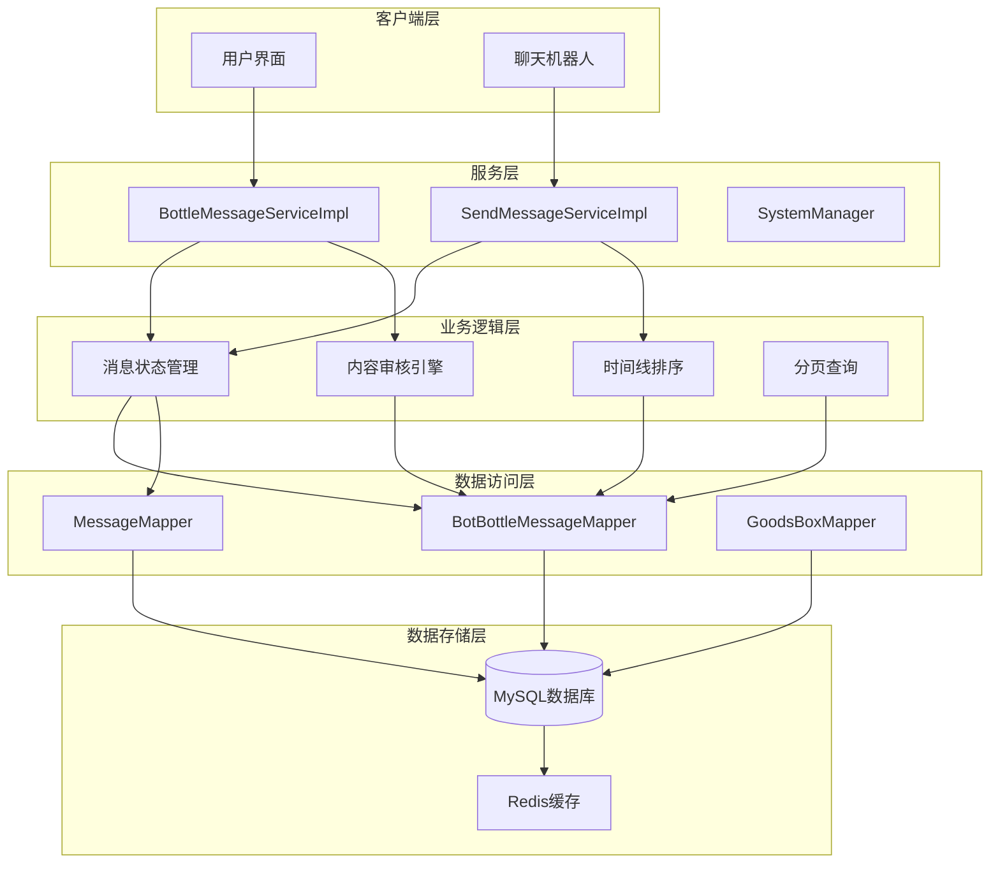
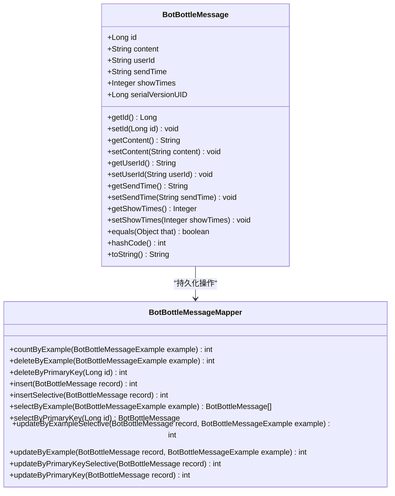
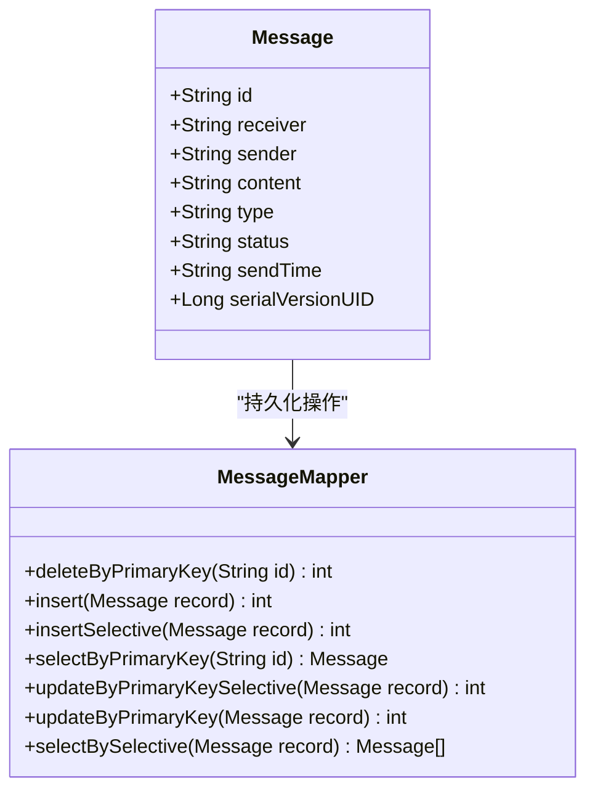
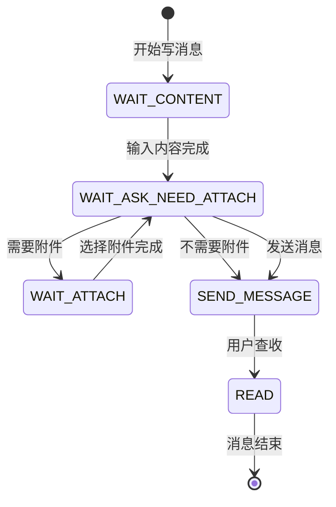
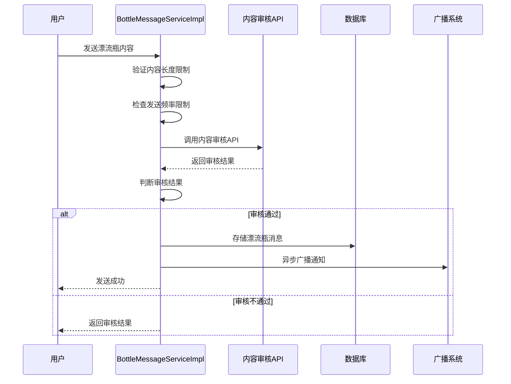
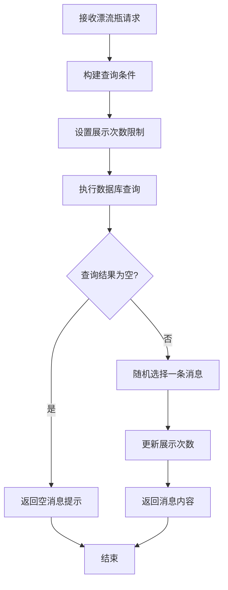
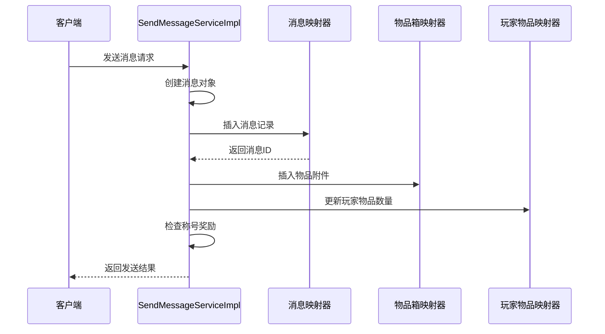
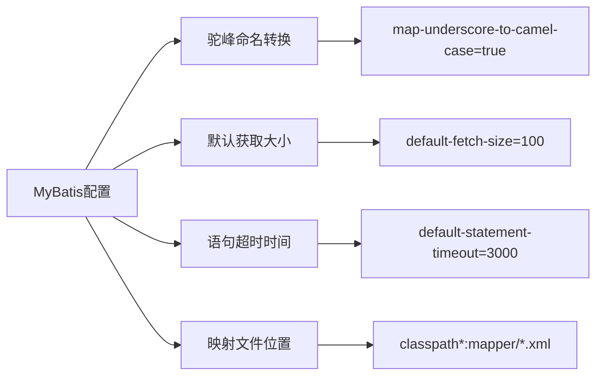
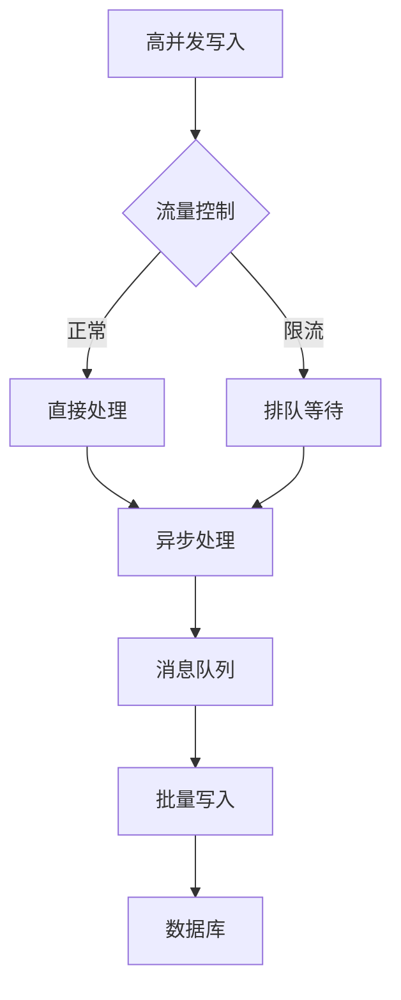

# 消息与留言系统模型

<cite>
**本文档中引用的文件**
- [BotBottleMessage.java](file://Game/src/main/java/com/bot/game/dao/entity/BotBottleMessage.java)
- [BotBottleMessageMapper.java](file://Game/src/main/java/com/bot/game/dao/mapper/BotBottleMessageMapper.java)
- [BotBottleMessageMapper.xml](file://Game/src/main/resources/mapper/BotBottleMessageMapper.xml)
- [Message.java](file://Game/src/main/java/com/bot/game/dao/entity/Message.java)
- [MessageMapper.java](file://Game/src/main/java/com/bot/game/dao/mapper/MessageMapper.java)
- [MessageMapper.xml](file://Game/src/main/resources/mapper/MessageMapper.xml)
- [BottleMessageServiceImpl.java](file://Base/src/main/java/com/bot/base/service/impl/BottleMessageServiceImpl.java)
- [SendMessageServiceImpl.java](file://Game/src/main/java/com/bot/game/service/impl/message/SendMessageServiceImpl.java)
- [ENMessageStatus.java](file://Game/src/main/java/com/bot/game/enums/ENMessageStatus.java)
- [ENWriteMessageStatus.java](file://Game/src/main/java/com/bot/game/enums/ENWriteMessageStatus.java)
- [application.properties](file://Boot/src/main/resources/application.properties)
</cite>

## 目录
1. [引言](#引言)
2. [系统架构概览](#系统架构概览)
3. [核心数据模型](#核心数据模型)
4. [消息状态管理](#消息状态管理)
5. [内容审核机制](#内容审核机制)
6. [时间线排序与分页查询](#时间线排序与分页查询)
7. [数据库事务处理](#数据库事务处理)
8. [性能优化策略](#性能优化策略)
9. [高并发场景分析](#高并发场景分析)
10. [总结](#总结)

## 引言

Bot项目的消息与漂流瓶系统是一个复杂的社会化互动功能模块，旨在为用户提供即时通讯和随机漂流瓶交互体验。该系统采用分层架构设计，包含消息实体、持久化层、业务逻辑层和服务层等多个组件，支持高并发写入和读取操作。

系统的核心功能包括：
- 匿名漂流瓶发送与接收
- 私人消息传递与状态管理
- 内容审核与过滤机制
- 时间线排序与个性化推荐
- 分布式事务处理与数据一致性保证

## 系统架构概览

**图表来源**
- [BottleMessageServiceImpl.java](file://Base/src/main/java/com/bot/base/service/impl/BottleMessageServiceImpl.java#L41-L137)
- [SendMessageServiceImpl.java](file://Game/src/main/java/com/bot/game/service/impl/message/SendMessageServiceImpl.java#L76-L167)

## 核心数据模型

### BotBottleMessage实体模型

BotBottleMessage是漂流瓶系统的核心数据实体，采用MyBatis自动生成的POJO结构：

**图表来源**
- [BotBottleMessage.java](file://Game/src/main/java/com/bot/game/dao/entity/BotBottleMessage.java#L5-L238)
- [BotBottleMessageMapper.java](file://Game/src/main/java/com/bot/game/dao/mapper/BotBottleMessageMapper.java#L9-L97)

### Message实体模型

Message实体负责私人消息的存储和管理：

**图表来源**
- [Message.java](file://Game/src/main/java/com/bot/game/dao/entity/Message.java#L11-L27)
- [MessageMapper.java](file://Game/src/main/java/com/bot/game/dao/mapper/MessageMapper.java#L8-L23)

**章节来源**
- [BotBottleMessage.java](file://Game/src/main/java/com/bot/game/dao/entity/BotBottleMessage.java#L1-L238)
- [Message.java](file://Game/src/main/java/com/bot/game/dao/entity/Message.java#L1-L27)

## 消息状态管理

### 状态枚举定义

系统采用枚举类型管理消息状态，确保状态值的一致性和可维护性：

| 状态类型 | 值 | 描述 | 使用场景 |
|---------|---|------|----------|
| ENMessageStatus.NOT_READ | "0" | 未查收 | 新消息默认状态 |
| ENMessageStatus.READ | "1" | 已查收 | 用户查看后的状态 |

| 写消息状态 | 值 | 描述 | 处理流程 |
|-----------|---|------|----------|
| WAIT_CONTENT | "0" | 等待输入内容 | 初始状态，收集消息内容 |
| WAIT_ASK_NEED_ATTACH | "1" | 询问是否需要附件 | 确定是否有附加物品 |
| WAIT_ATTACH | "2" | 等待选择附件 | 选择要附加的物品 |

### 状态转换流程

**章节来源**
- [ENMessageStatus.java](file://Game/src/main/java/com/bot/game/enums/ENMessageStatus.java#L11-L24)
- [ENWriteMessageStatus.java](file://Game/src/main/java/com/bot/game/enums/ENWriteMessageStatus.java#L11-L26)

## 内容审核机制

### 审核流程设计

漂流瓶内容审核采用异步AI分析机制，确保内容安全性和用户体验：

**图表来源**
- [BottleMessageServiceImpl.java](file://Base/src/main/java/com/bot/base/service/impl/BottleMessageServiceImpl.java#L76-L105)

### 审核规则配置

系统支持多种内容审核规则：
- 字数限制：单条漂流瓶内容不超过200字
- 频率限制：同一用户1分钟内只能发送一条
- 内容过滤：通过外部AI服务进行敏感内容检测
- 实时反馈：即时返回审核结果给用户

**章节来源**
- [BottleMessageServiceImpl.java](file://Base/src/main/java/com/bot/base/service/impl/BottleMessageServiceImpl.java#L111-L136)

## 时间线排序与分页查询

### 排序策略

漂流瓶系统采用多维度排序策略：

1. **展示次数排序**：优先显示展示次数较少的内容
2. **时间戳排序**：按发送时间倒序排列
3. **随机性保证**：在相同条件下保持随机性

**图表来源**
- [BottleMessageServiceImpl.java](file://Base/src/main/java/com/bot/base/service/impl/BottleMessageServiceImpl.java#L46-L57)

### 分页查询优化

系统采用MyBatis的Example模式实现灵活查询：

| 查询条件 | 用途 | 性能影响 |
|---------|------|----------|
| showTimes < 3 | 过滤热门内容 | 减少查询结果集 |
| userId = ? | 用户特定查询 | 提高查询效率 |
| send_time DESC | 时间排序 | 利用索引加速 |

**章节来源**
- [BotBottleMessageMapper.xml](file://Game/src/main/resources/mapper/BotBottleMessageMapper.xml#L88-L105)

## 数据库事务处理

### 消息发送事务流程

私人消息发送涉及多个表的原子性操作：

**图表来源**
- [SendMessageServiceImpl.java](file://Game/src/main/java/com/bot/game/service\impl\message\SendMessageServiceImpl.java#L76-L113)

### 事务一致性保证

系统采用以下策略确保数据一致性：
- **原子性**：消息和附件作为整体操作
- **隔离性**：使用数据库事务隔离级别
- **持久性**：确保操作的永久性
- **一致性**：维护数据完整性约束

**章节来源**
- [SendMessageServiceImpl.java](file://Game/src/main/java/com/bot/game/service\impl\message\SendMessageServiceImpl.java#L76-L167)

## 性能优化策略

### 数据库连接池配置

系统采用Druid连接池优化数据库性能：

| 参数名称 | 配置值 | 说明 |
|---------|--------|------|
| initialSize | 1 | 初始连接数 |
| minIdle | 3 | 最小空闲连接数 |
| maxActive | 60000 | 最大活跃连接数 |
| maxWait | 20ms | 获取连接最大等待时间 |
| timeBetweenEvictionRunsMillis | 60000ms | 连接回收检查间隔 |
| minEvictableIdleTimeMillis | 300000ms | 最小空闲时间 |

### MyBatis优化配置

**图表来源**
- [application.properties](file://Boot/src/main/resources/application.properties#L64-L69)

### 缓存策略

系统采用多层缓存提升性能：
- **本地缓存**：Spring Cache管理常用数据
- **分布式缓存**：Redis存储热点数据
- **数据库缓存**：MyBatis二级缓存

**章节来源**
- [application.properties](file://Boot/src/main/resources/application.properties#L48-L69)

## 高并发场景分析

### 写入负载优化

针对高写入负载场景，系统采用以下优化策略：

1. **异步处理**：漂流瓶广播采用线程池异步执行
2. **批量操作**：合并相似的数据库操作
3. **连接池调优**：合理配置连接池参数
4. **索引优化**：为常用查询字段建立索引

### 读取性能优化

读取操作采用以下优化技术：
- **读写分离**：主从数据库架构
- **查询缓存**：缓存热点查询结果
- **分片策略**：按用户ID分片存储
- **预加载**：提前加载可能访问的数据

### 架构扩展建议

针对未来高并发需求，建议采用以下架构优化：

1. **微服务拆分**：将消息服务独立部署
2. **消息队列**：引入Kafka或RabbitMQ解耦
3. **CDN加速**：静态资源CDN分发
4. **负载均衡**：多实例部署和流量分发

## 总结

Bot项目的消息与漂流瓶系统展现了现代社交应用的核心设计理念：

### 技术亮点

1. **模块化设计**：清晰的分层架构便于维护和扩展
2. **异步处理**：高效的异步消息广播机制
3. **内容安全**：完善的审核机制保障用户体验
4. **性能优化**：多层次的性能优化策略

### 架构优势

- **可扩展性**：良好的模块化设计支持功能扩展
- **高可用性**：完善的异常处理和降级机制
- **高性能**：优化的数据库访问和缓存策略
- **安全性**：内容审核和权限控制机制

### 改进建议

1. **监控体系**：建立完整的性能监控和告警机制
2. **容量规划**：制定详细的容量评估和扩容计划
3. **灾备方案**：完善的数据备份和恢复策略
4. **用户体验**：持续优化响应时间和交互体验

该系统为Bot项目提供了稳定可靠的消息通信基础，支撑了丰富的社交互动功能，是整个系统架构中的重要组成部分。