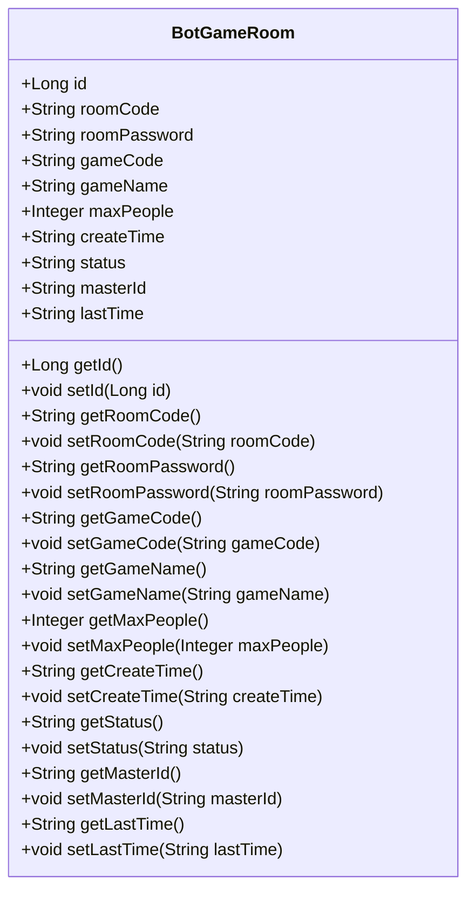
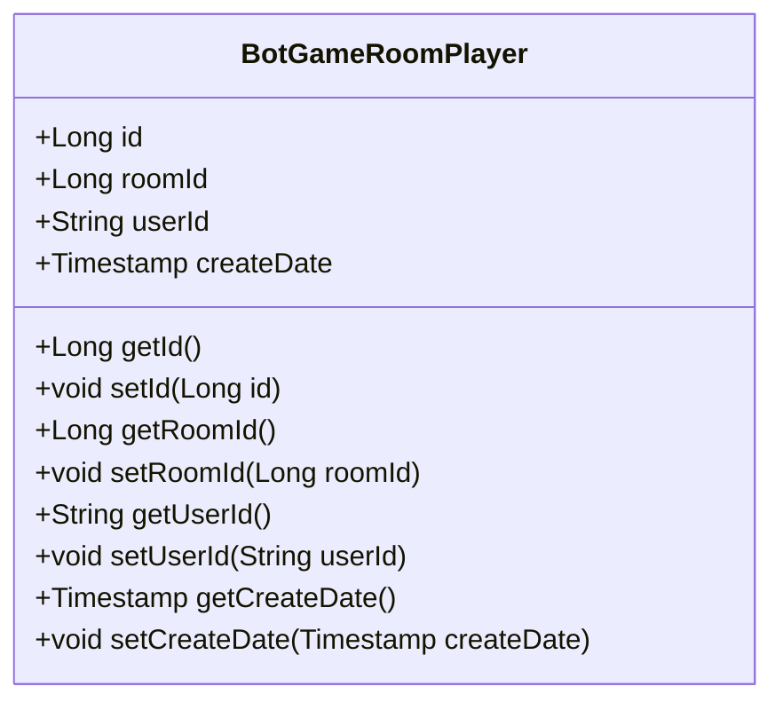
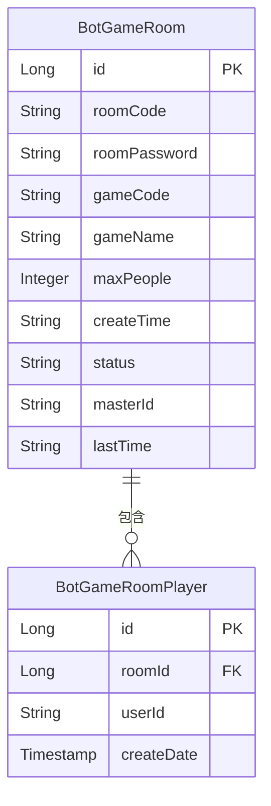
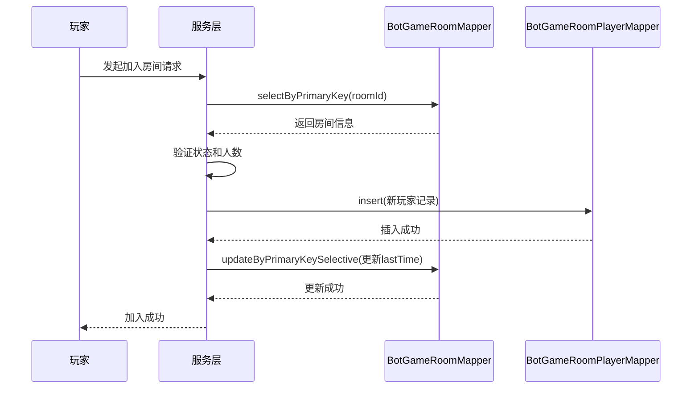
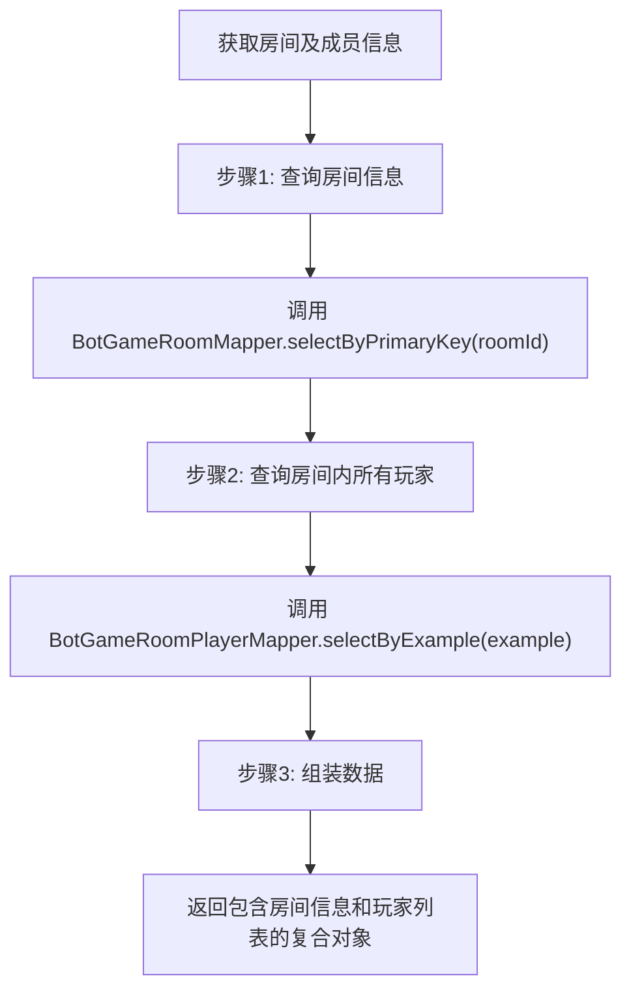

# 游戏房间模型

<cite>
**本文档引用文件**  
- [BotGameRoom.java](file://Game\src\main\java\com\bot\game\dao\entity\BotGameRoom.java)
- [BotGameRoomPlayer.java](file://Game\src\main\java\com\bot\game\dao\entity\BotGameRoomPlayer.java)
- [BotGameRoomMapper.xml](file://Game\src\main\resources\mapper\BotGameRoomMapper.xml)
- [BotGameRoomPlayerMapper.xml](file://Game\src\main\resources\mapper\BotGameRoomPlayerMapper.xml)
- [BotGameRoomMapper.java](file://Game\src\main\java\com\bot\game\dao\mapper\BotGameRoomMapper.java)
- [BotGameRoomPlayerMapper.java](file://Game\src\main\java\com\bot\game\dao\mapper\BotGameRoomPlayerMapper.java)
</cite>

## 目录
1. [引言](#引言)
2. [核心数据结构设计](#核心数据结构设计)
3. [房间状态与生命周期管理](#房间状态与生命周期管理)
4. [玩家进出机制](#玩家进出机制)
5. [Mapper配置与联表查询](#mapper配置与联表查询)
6. [房间操作的SQL执行流程](#房间操作的sql执行流程)
7. [高并发场景下的数据一致性解决方案](#高并发场景下的数据一致性解决方案)
8. [总结](#总结)

## 引言
游戏房间（BotGameRoom）与房间玩家（BotGameRoomPlayer）是多人互动游戏场景中的核心数据模型，负责管理游戏会话的创建、玩家的加入与退出、房间状态的维护以及游戏生命周期的控制。本文档将深入解析这两个实体的数据结构设计，阐明其在系统中的作用，并探讨相关的数据库操作、Mapper配置以及在高并发环境下保证数据一致性的策略。

**Section sources**
- [BotGameRoom.java](file://Game\src\main\java\com\bot\game\dao\entity\BotGameRoom.java)
- [BotGameRoomPlayer.java](file://Game\src\main\java\com\bot\game\dao\entity\BotGameRoomPlayer.java)

## 核心数据结构设计
游戏房间系统由两个主要的数据库实体构成：`BotGameRoom` 和 `BotGameRoomPlayer`，它们通过外键关联，形成了一对多的关系。

### BotGameRoom (游戏房间)
`BotGameRoom` 实体代表一个独立的游戏会话或房间，其核心字段如下：

- **id**: 房间的唯一标识符，主键。
- **roomCode**: 房间代码，用于玩家通过代码加入房间。
- **roomPassword**: 房间密码，为房间提供访问控制，可为空。
- **gameCode**: 关联的游戏类型代码，标识该房间运行的是哪种游戏。
- **gameName**: 游戏名称，用于展示。
- **maxPeople**: 房间最大容纳人数，用于控制房间规模。
- **createTime**: 房间创建时间，记录房间的生命周期起点。
- **status**: 房间状态，如“等待中”、“进行中”、“已结束”等，是房间状态管理的核心字段。
- **masterId**: 房主ID，标识创建房间的用户，拥有房间的管理权限。
- **lastTime**: 最后活动时间，用于房间的超时检测和自动清理。



**Diagram sources**
- [BotGameRoom.java](file://Game\src\main\java\com\bot\game\dao\entity\BotGameRoom.java#L5-L83)

### BotGameRoomPlayer (房间玩家)
`BotGameRoomPlayer` 实体代表加入某个房间的玩家，它通过 `roomId` 字段与 `BotGameRoom` 关联。

- **id**: 记录的唯一标识符，主键。
- **roomId**: 外键，指向 `BotGameRoom` 的 `id`，标识该玩家所属的房间。
- **userId**: 用户ID，标识具体的玩家。
- **createDate**: 玩家加入房间的时间戳。



**Diagram sources**
- [BotGameRoomPlayer.java](file://Game\src\main\java\com\bot\game\dao\entity\BotGameRoomPlayer.java#L12-L36)

### 关系模型
两个实体之间的关系是典型的“一对多”关系。一个 `BotGameRoom` 可以有多个 `BotGameRoomPlayer`，而每个 `BotGameRoomPlayer` 只能属于一个 `BotGameRoom`。



**Diagram sources**
- [BotGameRoom.java](file://Game\src\main\java\com\bot\game\dao\entity\BotGameRoom.java)
- [BotGameRoomPlayer.java](file://Game\src\main\java\com\bot\game\dao\entity\BotGameRoomPlayer.java)

**Section sources**
- [BotGameRoom.java](file://Game\src\main\java\com\bot\game\dao\entity\BotGameRoom.java)
- [BotGameRoomPlayer.java](file://Game\src\main\java\com\bot\game\dao\entity\BotGameRoomPlayer.java)

## 房间状态与生命周期管理
房间的生命周期由其 `status` 字段精确控制。该字段是房间状态管理的核心，通过不同的状态值来驱动业务逻辑。

### 状态流转
一个典型的房间生命周期可能包含以下状态：
1.  **创建 (CREATED)**: 房间被创建，等待玩家加入。
2.  **等待中 (WAITING)**: 房间已创建，有玩家加入，但未满员或未开始。
3.  **进行中 (IN_PROGRESS)**: 游戏正式开始，禁止新玩家加入。
4.  **已结束 (ENDED)**: 游戏结束，房间进入可解散状态。
5.  **已解散 (DISMISSED)**: 房间被销毁，所有相关数据可被清理。

### 生命周期控制
房间的生命周期通过以下机制进行控制：
- **创建**: 当用户发起创建房间请求时，系统生成 `BotGameRoom` 记录，初始化 `status` 为“等待中”，并设置 `createTime` 和 `masterId`。
- **开始**: 当房主或系统判定可以开始游戏时，调用 `updateByPrimaryKeySelective` 方法，将 `status` 更新为“进行中”。
- **结束**: 游戏逻辑完成后，将 `status` 更新为“已结束”。
- **自动清理**: 系统后台任务会定期扫描 `BotGameRoom` 表，根据 `lastTime` 和 `status` 字段，清理长时间未活动的“等待中”或“已结束”的房间，释放资源。

**Section sources**
- [BotGameRoom.java](file://Game\src\main\java\com\bot\game\dao\entity\BotGameRoom.java#L67-L68)
- [BotGameRoomMapper.xml](file://Game\src\main\resources\mapper\BotGameRoomMapper.xml#L332-L333)

## 玩家进出机制
玩家进出房间的操作通过 `BotGameRoomPlayer` 表的增删来实现，并伴随着对 `BotGameRoom` 表的更新。

### 玩家加入房间
1.  **检查房间状态**: 查询 `BotGameRoom` 记录，确认 `status` 为“等待中”或“进行中”（如果允许中途加入），且当前人数未达到 `maxPeople`。
2.  **插入玩家记录**: 调用 `BotGameRoomPlayerMapper.insert()` 方法，在 `BotGameRoomPlayer` 表中添加一条新记录，包含 `roomId` 和 `userId`。
3.  **更新最后活动时间**: 调用 `BotGameRoomMapper.updateByPrimaryKeySelective()` 方法，更新 `BotGameRoom` 记录的 `lastTime` 字段。

### 玩家退出房间
1.  **删除玩家记录**: 调用 `BotGameRoomPlayerMapper.deleteByExample()` 或根据 `roomId` 和 `userId` 构造条件删除 `BotGameRoomPlayer` 表中的对应记录。
2.  **更新最后活动时间**: 同样需要更新 `BotGameRoom` 的 `lastTime`。
3.  **检查房间状态**: 如果退出后房间内无玩家（或仅剩房主），系统可能会自动将 `status` 更新为“已结束”或直接删除房间。



**Diagram sources**
- [BotGameRoomMapper.java](file://Game\src\main\java\com\bot\game\dao\mapper\BotGameRoomMapper.java#L64)
- [BotGameRoomPlayerMapper.java](file://Game\src\main\java\com\bot\game\dao\mapper\BotGameRoomPlayerMapper.java#L40)
- [BotGameRoomMapper.xml](file://Game\src\main\resources\mapper\BotGameRoomMapper.xml#L302-L333)

**Section sources**
- [BotGameRoomPlayer.java](file://Game\src\main\java\com\bot\game\dao\entity\BotGameRoomPlayer.java)
- [BotGameRoomMapper.xml](file://Game\src\main\resources\mapper\BotGameRoomMapper.xml)
- [BotGameRoomPlayerMapper.xml](file://Game\src\main\resources\mapper\BotGameRoomPlayerMapper.xml)

## Mapper配置与联表查询
MyBatis 的 Mapper 配置文件定义了 Java 对象与数据库表之间的映射关系以及 SQL 操作。

### BotGameRoomMapper.xml
此文件定义了对 `bot_game_room` 表的所有操作。
- **`<resultMap>`**: 将数据库字段（如 `room_code`）映射到 Java 对象属性（如 `roomCode`）。
- **`<insert>`**: 提供了 `insert` 和 `insertSelective` 两种插入方式，后者会根据字段是否为 `null` 来决定是否插入该字段。
- **`<update>`**: 提供了 `updateByPrimaryKey` 和 `updateByPrimaryKeySelective`，后者是实现乐观锁的关键，因为它只更新非 `null` 的字段。

### BotGameRoomPlayerMapper.xml
此文件的结构与 `BotGameRoomMapper.xml` 类似，但针对 `bot_game_room_player` 表。

### 高效获取房间及成员信息
要高效地获取一个房间及其所有成员的信息，通常需要执行联表查询。虽然 MyBatis Generator 生成的代码是单表操作，但在实际服务层中，会通过组合调用实现。



**Diagram sources**
- [BotGameRoomMapper.xml](file://Game\src\main\resources\mapper\BotGameRoomMapper.xml#L112-L121)
- [BotGameRoomPlayerMapper.xml](file://Game\src\main\resources\mapper\BotGameRoomPlayerMapper.xml#L87-L104)

**Section sources**
- [BotGameRoomMapper.xml](file://Game\src\main\resources\mapper\BotGameRoomMapper.xml)
- [BotGameRoomPlayerMapper.xml](file://Game\src\main\resources\mapper\BotGameRoomPlayerMapper.xml)

## 房间操作的SQL执行流程
以创建房间为例，分析其完整的 SQL 执行流程。

### 创建房间 (Create Room)
1.  **业务层调用**: 服务层代码调用 `BotGameRoomMapper.insert()` 方法。
2.  **Mapper 接口**: `BotGameRoomMapper.insert(record)` 方法被触发。
3.  **XML 映射**: MyBatis 根据接口方法名找到 `BotGameRoomMapper.xml` 中的 `<insert id="insert">` 标签。
4.  **SQL 执行**: 执行以下 SQL 语句：
    ```sql
    INSERT INTO bot_game_room 
    (id, room_code, room_password, game_code, game_name, max_people, create_time, status, master_id, last_time)
    VALUES 
    (#{id}, #{roomCode}, #{roomPassword}, #{gameCode}, #{gameName}, #{maxPeople}, #{createTime}, #{status}, #{masterId}, #{lastTime})
    ```
5.  **结果返回**: 数据库返回插入结果，MyBatis 将其转换为 `int` 类型的受影响行数，返回给业务层。

### 加入房间 (Join Room)
1.  **业务层调用**: 服务层调用 `BotGameRoomPlayerMapper.insert()`。
2.  **Mapper 接口**: `BotGameRoomPlayerMapper.insert(record)` 被调用。
3.  **XML 映射**: 找到 `BotGameRoomPlayerMapper.xml` 中的 `<insert id="insert">`。
4.  **SQL 执行**: 执行以下 SQL 语句：
    ```sql
    INSERT INTO bot_game_room_player (id, room_id, user_id, create_date)
    VALUES (#{id}, #{roomId}, #{userId}, #{createDate})
    ```
5.  **更新房间**: 随后调用 `BotGameRoomMapper.updateByPrimaryKeySelective()` 来更新 `last_time`。

**Section sources**
- [BotGameRoomMapper.xml](file://Game\src\main\resources\mapper\BotGameRoomMapper.xml#L140-L153)
- [BotGameRoomPlayerMapper.xml](file://Game\src\main\resources\mapper\BotGameRoomPlayerMapper.xml#L133-L142)

## 高并发场景下的数据一致性解决方案
在高并发环境下，多个玩家同时尝试加入或创建房间，可能导致数据不一致，如房间人数超过上限。为此，系统采用数据库事务和乐观锁相结合的策略。

### 数据库事务
所有涉及多个表或多次数据库操作的业务逻辑（如加入房间）都必须在数据库事务中执行。这保证了操作的原子性：要么全部成功，要么全部回滚。

```java
// 伪代码示例
@Transactional
public void joinRoom(String userId, Long roomId) {
    // 1. 查询房间信息 (包含当前人数)
    BotGameRoom room = botGameRoomMapper.selectByPrimaryKey(roomId);
    // 2. 检查房间是否已满
    if (getCurrentPlayerCount(roomId) >= room.getMaxPeople()) {
        throw new RoomFullException();
    }
    // 3. 插入玩家记录
    BotGameRoomPlayer player = new BotGameRoomPlayer();
    player.setRoomId(roomId);
    player.setUserId(userId);
    botGameRoomPlayerMapper.insert(player);
    // 4. 更新房间最后活动时间
    room.setLastTime(getCurrentTime());
    botGameRoomMapper.updateByPrimaryKeySelective(room);
}
```

### 乐观锁
乐观锁通过在数据表中增加一个版本号（version）或时间戳字段来实现。虽然当前代码未显式使用版本号，但 `updateByPrimaryKeySelective` 方法本身提供了一种轻量级的乐观锁机制。

- **原理**: 在更新数据时，只更新那些在查询后未被修改过的字段。例如，当更新 `lastTime` 时，我们只传入 `lastTime` 字段，而不传入 `maxPeople` 或 `status`。这减少了因并发更新不同字段而产生的冲突。
- **应用**: 在更新房间状态（如从“等待中”到“进行中”）时，可以先查询房间的 `status`，然后在更新时通过 `WHERE` 子句确保 `status` 仍然是“等待中”，从而防止状态被错误地覆盖。

**Section sources**
- [BotGameRoomMapper.xml](file://Game\src\main\resources\mapper\BotGameRoomMapper.xml#L302-L333)
- [BotGameRoomPlayerMapper.xml](file://Game\src\main\resources\mapper\BotGameRoomPlayerMapper.xml#L217-L225)

## 总结
`BotGameRoom` 和 `BotGameRoomPlayer` 的数据结构设计清晰地分离了房间会话和玩家成员的概念，通过主外键关联实现了灵活的一对多关系。房间的状态管理、生命周期控制和玩家进出机制都围绕这两个实体的字段和操作展开。通过 MyBatis Mapper 配置，实现了高效的数据库操作。在高并发场景下，结合数据库事务的原子性和 `updateByPrimaryKeySelective` 方法提供的乐观锁机制，能够有效保证数据的一致性和系统的稳定性。