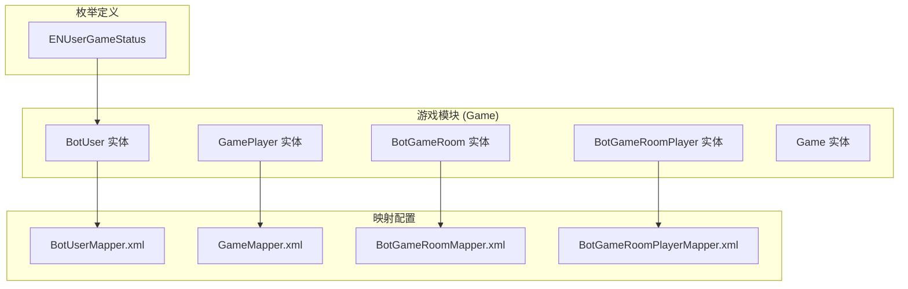
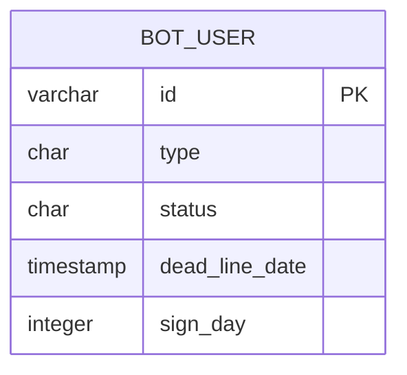
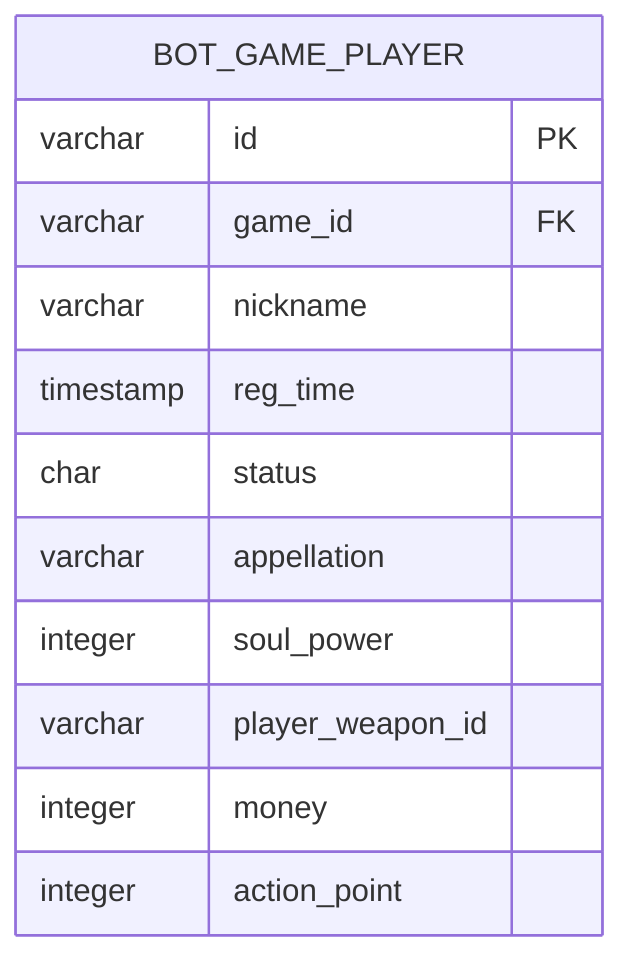
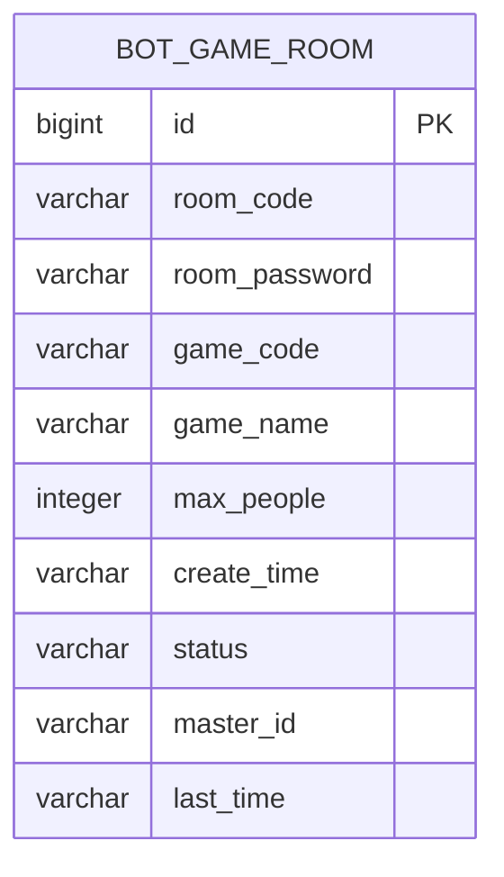
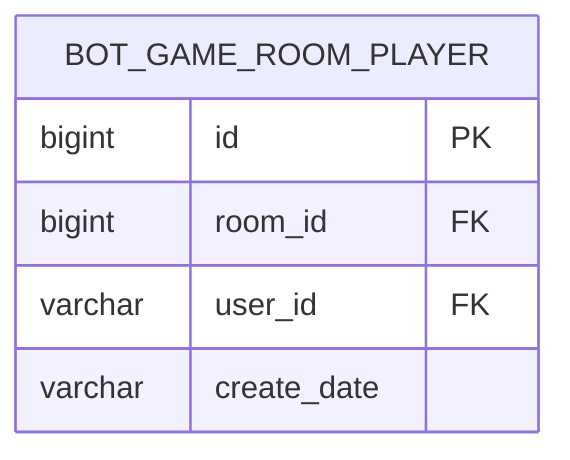
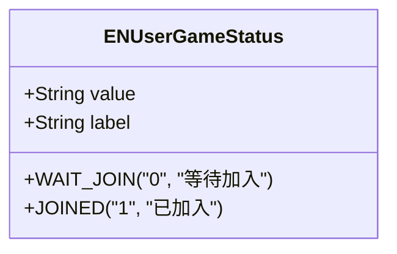
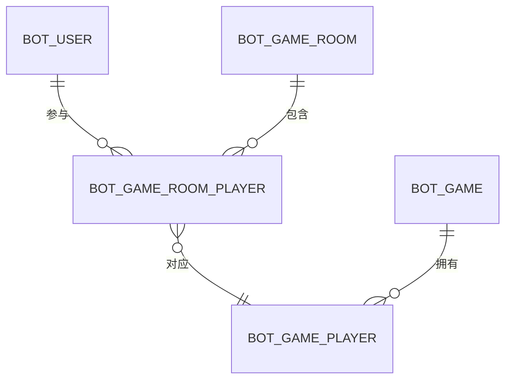
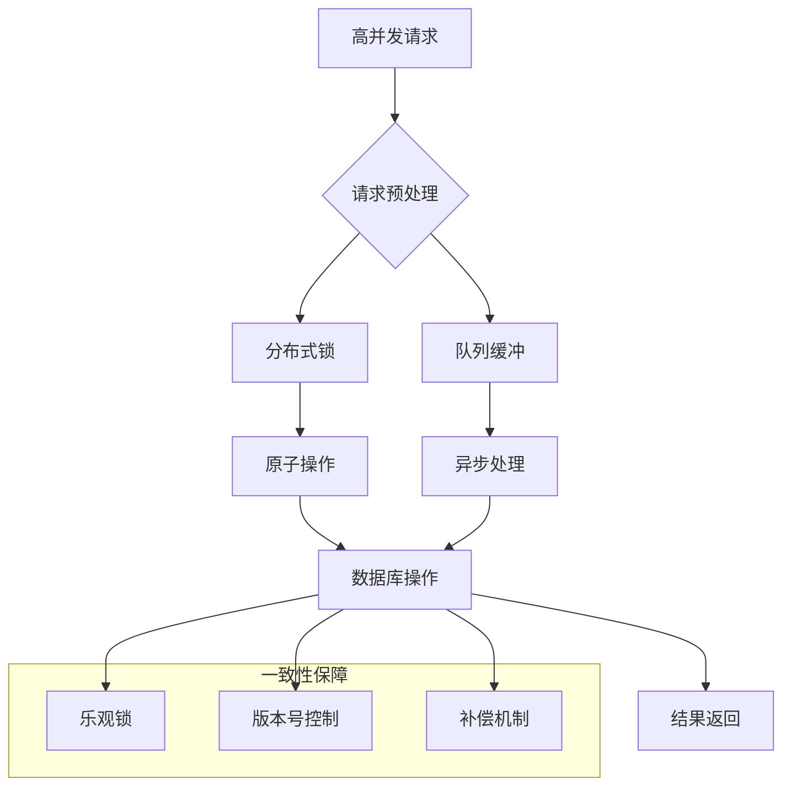
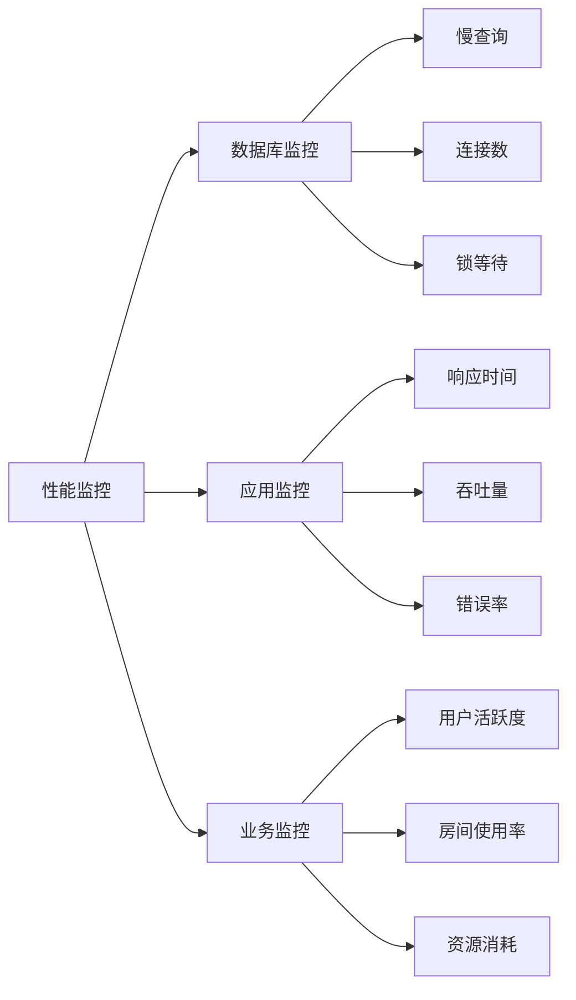

# 游戏数据模型

<cite>
**本文档引用的文件**
- [BotUser.java](file://Game/src/main/java/com/bot/game/dao/entity/BotUser.java)
- [GamePlayer.java](file://Game/src/main/java/com/bot/game/dao/entity/GamePlayer.java)
- [BotGameRoom.java](file://Game/src/main/java/com/bot/game/dao/entity/BotGameRoom.java)
- [BotGameRoomPlayer.java](file://Game/src/main/java/com/bot/game/dao/entity/BotGameRoomPlayer.java)
- [Game.java](file://Game/src/main/java/com/bot/game/dao/entity/Game.java)
- [BotUserMapper.xml](file://Game/src/main/resources/mapper/BotUserMapper.xml)
- [GameMapper.xml](file://Game/src/main/resources/mapper/GameMapper.xml)
- [BotGameRoomMapper.xml](file://Game/src/main/resources/mapper/BotGameRoomMapper.xml)
- [BotGameRoomPlayerMapper.xml](file://Game/src/main/resources/mapper/BotGameRoomPlayerMapper.xml)
- [ENUserGameStatus.java](file://Common/src/main/java/com/bot/common/enums/ENUserGameStatus.java)
</cite>

## 目录
1. [引言](#引言)
2. [项目结构概览](#项目结构概览)
3. [核心实体模型](#核心实体模型)
4. [数据库表结构设计](#数据库表结构设计)
5. [MyBatis映射配置](#mybatis映射配置)
6. [实体关系分析](#实体关系分析)
7. [典型查询场景](#典型查询场景)
8. [高并发数据一致性解决方案](#高并发数据一致性解决方案)
9. [性能优化建议](#性能优化建议)
10. [总结](#总结)

## 引言

本文档深入分析了一个基于Java Spring Boot的游戏系统中的数据模型设计，重点解析BotUser（机器人用户）、GamePlayer（游戏玩家）和BotGameRoom（游戏房间）等核心实体的设计思路和业务含义。通过分析MyBatis映射配置和数据库表结构，为开发者提供全面的数据建模指导。

该系统采用分层架构设计，包含基础服务层、游戏业务层和生活服务层，每个层次都有其特定的数据模型和业务逻辑。

## 项目结构概览

游戏系统的数据模型主要分布在以下模块中：



**图表来源**
- [BotUser.java](file://Game/src/main/java/com/bot/game/dao/entity/BotUser.java#L1-L214)
- [GamePlayer.java](file://Game/src/main/java/com/bot/game/dao/entity/GamePlayer.java#L1-L34)
- [BotGameRoom.java](file://Game/src/main/java/com/bot/game/dao/entity/BotGameRoom.java#L1-L413)
- [BotGameRoomPlayer.java](file://Game/src/main/java/com/bot/game/dao/entity/BotGameRoomPlayer.java#L1-L204)

## 核心实体模型

### BotUser - 机器人用户实体

BotUser是系统中最基础的用户实体，用于管理机器人的基本信息和状态。

#### 数据结构设计

| 字段名 | 类型 | 长度 | 是否主键 | 是否允许为空 | 描述 |
|--------|------|------|----------|--------------|------|
| id | String | 64 | 是 | 否 | 用户唯一标识符 |
| type | String | 1 | 否 | 是 | 用户类型标识 |
| status | String | 1 | 否 | 是 | 用户状态 |
| deadLineDate | Date | - | 否 | 是 | 截止日期 |
| signDay | Integer | - | 否 | 是 | 连续签到天数 |

#### 业务含义

- **id**: 唯一标识每个机器人用户，通常使用UUID或自定义编码规则
- **type**: 标识用户类型，可能包括普通用户、VIP用户、管理员等
- **status**: 用户当前状态，如正常、禁用、删除等
- **deadLineDate**: 用于限制用户使用期限或某些功能的有效期
- **signDay**: 记录用户的连续签到天数，用于签到奖励机制

**章节来源**
- [BotUser.java](file://Game/src/main/java/com/bot/game/dao/entity/BotUser.java#L13-L39)

### GamePlayer - 游戏玩家实体

GamePlayer代表游戏中具体的角色信息，包含玩家的各种属性和状态。

#### 数据结构设计

| 字段名 | 类型 | 长度 | 是否主键 | 是否允许为空 | 描述 |
|--------|------|------|----------|--------------|------|
| id | String | 64 | 是 | 否 | 玩家唯一标识符 |
| gameId | String | 64 | 否 | 否 | 所属游戏ID |
| nickname | String | 50 | 否 | 否 | 玩家昵称 |
| regTime | Date | - | 否 | 是 | 注册时间 |
| status | String | 1 | 否 | 是 | 玩家状态 |
| appellation | String | 20 | 否 | 是 | 称谓 |
| soulPower | Integer | - | 否 | 是 | 灵力值 |
| playerWeaponId | String | 64 | 否 | 是 | 武器ID |
| money | Integer | - | 否 | 是 | 金钱数量 |
| actionPoint | Integer | - | 否 | 是 | 行动点数 |

#### 业务含义

- **gameId**: 关联到具体的游戏中，支持多游戏系统
- **nickname**: 玩家在游戏中的显示名称
- **regTime**: 玩家注册或创建角色的时间
- **status**: 玩家当前状态，如在线、离线、战斗中等
- **appellation**: 玩家的特殊称谓，如大师、宗师等
- **soulPower**: 灵力值，可能是修炼等级或战斗力的重要指标
- **playerWeaponId**: 玩家装备的武器ID，用于关联武器系统
- **money**: 玩家拥有的货币数量
- **actionPoint**: 可用于行动次数或技能冷却等

**章节来源**
- [GamePlayer.java](file://Game/src/main/java/com/bot/game/dao/entity/GamePlayer.java#L13-L31)

### BotGameRoom - 游戏房间实体

BotGameRoom表示游戏中的房间概念，用于组织多人游戏活动。

#### 数据结构设计

| 字段名 | 类型 | 长度 | 是否主键 | 是否允许为空 | 描述 |
|--------|------|------|----------|--------------|------|
| id | Long | - | 是 | 否 | 房间唯一标识符 |
| roomCode | String | 20 | 否 | 是 | 房间编码 |
| roomPassword | String | 20 | 否 | 是 | 房间密码 |
| gameCode | String | 20 | 否 | 是 | 游戏编码 |
| gameName | String | 50 | 否 | 是 | 游戏名称 |
| maxPeople | Integer | - | 否 | 是 | 最大人数 |
| createTime | String | 20 | 否 | 是 | 创建时间 |
| status | String | 1 | 否 | 是 | 房间状态 |
| masterId | String | 64 | 否 | 是 | 房主ID |
| lastTime | String | 20 | 否 | 是 | 最后活跃时间 |

#### 业务含义

- **roomCode**: 房间的唯一识别码，玩家可以通过此码加入房间
- **roomPassword**: 加入房间所需的密码，用于保护私人房间
- **gameCode**: 关联到具体的游戏类型
- **gameName**: 显示给玩家的游戏名称
- **maxPeople**: 房间容纳的最大玩家数量
- **createTime**: 房间创建的时间戳
- **status**: 房间当前状态，如开放、关闭、进行中等
- **masterId**: 房间的拥有者或创建者的用户ID
- **lastTime**: 房间最后活跃时间，用于超时管理

**章节来源**
- [BotGameRoom.java](file://Game/src/main/java/com/bot/game/dao/entity/BotGameRoom.java#L12-L331)

### BotGameRoomPlayer - 房间玩家关联实体

BotGameRoomPlayer建立了房间和玩家之间的多对多关系。

#### 数据结构设计

| 字段名 | 类型 | 长度 | 是否主键 | 是否允许为空 | 描述 |
|--------|------|------|----------|--------------|------|
| id | Long | - | 是 | 否 | 关联记录唯一标识符 |
| roomId | Long | - | 否 | 否 | 房间ID |
| userId | String | 64 | 否 | 否 | 用户ID |
| createDate | Timestamp | - | 否 | 是 | 创建时间 |

#### 业务含义

- **roomId**: 关联到具体的房间
- **userId**: 参与房间的用户ID
- **createDate**: 用户加入房间的时间

**章节来源**
- [BotGameRoomPlayer.java](file://Game/src/main/java/com/bot/game/dao/entity/BotGameRoomPlayer.java#L13-L140)

### Game - 游戏基本信息实体

Game实体存储游戏的基本信息。

#### 数据结构设计

| 字段名 | 类型 | 长度 | 是否主键 | 是否允许为空 | 描述 |
|--------|------|------|----------|--------------|------|
| id | String | 64 | 是 | 否 | 游戏唯一标识符 |
| gameName | String | 50 | 否 | 是 | 游戏名称 |
| keywords | String | 200 | 否 | 是 | 关键词 |
| status | String | 1 | 否 | 是 | 游戏状态 |

**章节来源**
- [Game.java](file://Game/src/main/java/com/bot/game/dao/entity/Game.java#L12-L18)

## 数据库表结构设计

### bot_user 表结构



**字段说明：**

| 字段 | 类型 | 约束 | 说明 |
|------|------|------|------|
| id | varchar(64) | PRIMARY KEY | 用户唯一标识符 |
| type | char(1) | NULLABLE | 用户类型，如A-普通用户，B-VIP用户 |
| status | char(1) | NULLABLE | 用户状态，如0-正常，1-禁用 |
| dead_line_date | timestamp | NULLABLE | 用户有效期截止时间 |
| sign_day | integer | NULLABLE | 连续签到天数 |

### bot_game_player 表结构



**字段说明：**

| 字段 | 类型 | 约束 | 说明 |
|------|------|------|------|
| id | varchar(64) | PRIMARY KEY | 玩家唯一标识符 |
| game_id | varchar(64) | NOT NULL | 所属游戏ID |
| nickname | varchar(50) | NOT NULL | 玩家昵称 |
| reg_time | timestamp | NULLABLE | 注册时间 |
| status | char(1) | NOT NULL | 玩家状态 |
| appellation | varchar(20) | NULLABLE | 称谓 |
| soul_power | integer | NULLABLE | 灵力值 |
| player_weapon_id | varchar(64) | NULLABLE | 武器ID |
| money | integer | NOT NULL | 金钱数量 |
| action_point | integer | NOT NULL | 行动点数 |

### bot_game_room 表结构



**字段说明：**

| 字段 | 类型 | 约束 | 说明 |
|------|------|------|------|
| id | bigint | PRIMARY KEY | 房间唯一标识符 |
| room_code | varchar(20) | NULLABLE | 房间编码 |
| room_password | varchar(20) | NULLABLE | 房间密码 |
| game_code | varchar(20) | NULLABLE | 游戏编码 |
| game_name | varchar(50) | NULLABLE | 游戏名称 |
| max_people | integer | NULLABLE | 最大人数 |
| create_time | varchar(20) | NULLABLE | 创建时间 |
| status | varchar(1) | NULLABLE | 房间状态 |
| master_id | varchar(64) | NULLABLE | 房主ID |
| last_time | varchar(20) | NULLABLE | 最后活跃时间 |

### bot_game_room_player 表结构



**字段说明：**

| 字段 | 类型 | 约束 | 说明 |
|------|------|------|------|
| id | bigint | PRIMARY KEY | 关联记录唯一标识符 |
| room_id | bigint | NOT NULL | 房间ID |
| user_id | varchar(64) | NOT NULL | 用户ID |
| create_date | varchar(20) | NULLABLE | 创建时间 |

### 相关枚举类型

#### ENUserGameStatus 枚举



**枚举说明：**

| 值 | 标签 | 说明 |
|----|------|------|
| 0 | 等待加入 | 用户正在等待加入游戏 |
| 1 | 已加入 | 用户已经成功加入游戏 |

**章节来源**
- [ENUserGameStatus.java](file://Common/src/main/java/com/bot/common/enums/ENUserGameStatus.java#L14-L15)

## MyBatis映射配置

### BotUserMapper.xml 配置分析

BotUserMapper.xml实现了BotUser实体与数据库表的完整映射关系。

#### ResultMap 配置

```xml
<resultMap id="BaseResultMap" type="com.bot.game.dao.entity.BotUser">
    <id column="id" property="id" jdbcType="VARCHAR" />
    <result column="type" property="type" jdbcType="CHAR" />
    <result column="status" property="status" jdbcType="CHAR" />
    <result column="dead_line_date" property="deadLineDate" jdbcType="TIMESTAMP" />
    <result column="sign_day" property="signDay" jdbcType="INTEGER" />
</resultMap>
```

#### 主要映射特点

1. **字段映射**: 每个数据库列都明确映射到对应的Java属性
2. **类型转换**: 使用jdbcType指定数据库类型，确保类型安全
3. **空值处理**: 支持null值的正确处理

#### SQL语句配置

- **插入操作**: 支持全字段插入和选择性插入
- **更新操作**: 提供按主键更新和条件更新
- **查询操作**: 支持单条查询、批量查询和条件查询
- **删除操作**: 支持按主键删除和条件删除

**章节来源**
- [BotUserMapper.xml](file://Game/src/main/resources/mapper/BotUserMapper.xml#L4-L14)

### BotGameRoomMapper.xml 配置分析

BotGameRoomMapper.xml展示了复杂实体的映射配置。

#### 复杂字段处理

```xml
<resultMap id="BaseResultMap" type="com.bot.game.dao.entity.BotGameRoom">
    <id column="id" property="id" jdbcType="BIGINT" />
    <result column="room_code" property="roomCode" jdbcType="VARCHAR" />
    <result column="room_password" property="roomPassword" jdbcType="VARCHAR" />
    <result column="game_code" property="gameCode" jdbcType="VARCHAR" />
    <result column="game_name" property="gameName" jdbcType="VARCHAR" />
    <result column="max_people" property="maxPeople" jdbcType="INTEGER" />
    <result column="create_time" property="createTime" jdbcType="VARCHAR" />
    <result column="status" property="status" jdbcType="VARCHAR" />
    <result column="master_id" property="masterId" jdbcType="VARCHAR" />
    <result column="last_time" property="lastTime" jdbcType="VARCHAR" />
</resultMap>
```

#### 动态SQL支持

- **条件查询**: 支持复杂的动态WHERE子句
- **批量操作**: 提供批量插入、更新和删除
- **排序功能**: 支持ORDER BY子句的动态生成

**章节来源**
- [BotGameRoomMapper.xml](file://Game/src/main/resources/mapper/BotGameRoomMapper.xml#L4-L18)

### 对象-关系映射最佳实践

1. **命名规范**: 数据库字段名使用下划线分隔，Java属性使用驼峰命名
2. **类型匹配**: 明确指定jdbcType，避免类型转换错误
3. **空值处理**: 合理处理NULL值，避免空指针异常
4. **批量操作**: 利用MyBatis的批量操作功能提高性能
5. **缓存策略**: 合理使用一级和二级缓存

## 实体关系分析

### 多对多关系设计



**图表来源**
- [BotUser.java](file://Game/src/main/java/com/bot/game/dao/entity/BotUser.java#L13-L39)
- [BotGameRoom.java](file://Game/src/main/java/com/bot/game/dao/entity/BotGameRoom.java#L12-L331)
- [BotGameRoomPlayer.java](file://Game/src/main/java/com/bot/game/dao/entity/BotGameRoomPlayer.java#L13-L140)
- [GamePlayer.java](file://Game/src/main/java/com/bot/game/dao/entity/GamePlayer.java#L13-L31)

### 关系约束分析

1. **一对一关系**: BotUser与GamePlayer之间存在一对一关系
2. **一对多关系**: Game与GamePlayer之间是一对多关系
3. **多对多关系**: BotGameRoom与BotUser通过BotGameRoomPlayer建立多对多关系

### 数据完整性保证

1. **外键约束**: 在数据库层面设置适当的外键约束
2. **级联操作**: 定义合理的级联删除和更新规则
3. **业务验证**: 在应用层添加额外的业务逻辑验证

## 典型查询场景

### 场景一：查询用户的游戏状态

```sql
SELECT 
    u.id, 
    u.type, 
    p.status AS player_status,
    r.status AS room_status
FROM bot_user u
LEFT JOIN bot_game_room_player rp ON u.id = rp.user_id
LEFT JOIN bot_game_room r ON rp.room_id = r.id
LEFT JOIN bot_game_player p ON u.id = p.game_id
WHERE u.id = #{userId}
```

### 场景二：查询房间内的所有玩家

```sql
SELECT 
    p.id,
    p.nickname,
    p.soul_power,
    p.money,
    rp.create_date
FROM bot_game_player p
JOIN bot_game_room_player rp ON p.id = rp.user_id
WHERE rp.room_id = #{roomId}
ORDER BY rp.create_date DESC
```

### 场景三：统计房间活跃度

```sql
SELECT 
    r.id,
    COUNT(DISTINCT rp.user_id) as player_count,
    MAX(rp.create_date) as last_activity
FROM bot_game_room r
LEFT JOIN bot_game_room_player rp ON r.id = rp.room_id
GROUP BY r.id
HAVING player_count > 0
ORDER BY last_activity DESC
```

### 场景四：查询玩家的灵力排名

```sql
SELECT 
    id,
    nickname,
    soul_power,
    RANK() OVER (ORDER BY soul_power DESC) as rank
FROM bot_game_player
WHERE soul_power IS NOT NULL
ORDER BY soul_power DESC
LIMIT 100
```

## 高并发数据一致性解决方案

### 问题分析

在高并发场景下，游戏系统可能面临以下数据一致性问题：

1. **玩家状态冲突**: 多个请求同时修改玩家状态
2. **房间人数超限**: 多个用户同时加入导致房间人数超过限制
3. **资源竞争**: 多个玩家同时消耗同一资源
4. **事务隔离**: 长时间事务可能导致锁争用

### 解决方案架构



### 具体解决方案

#### 1. 分布式锁机制

```java
// Redis分布式锁实现
public boolean tryLock(String lockKey, String requestId, long expireTime) {
    Boolean success = redisTemplate.opsForValue()
        .setIfAbsent(lockKey, requestId, expireTime, TimeUnit.MILLISECONDS);
    return Boolean.TRUE.equals(success);
}
```

#### 2. 乐观锁控制

```java
// 基于版本号的乐观锁
UPDATE bot_game_player 
SET soul_power = soul_power + #{delta},
    version = version + 1,
    update_time = NOW()
WHERE id = #{id} 
AND version = #{version}
```

#### 3. 队列化处理

```java
// 消息队列处理非实时操作
@Component
public class GameOperationQueue {
    
    @Async
    public void processAsyncOperation(GameOperation operation) {
        // 异步处理游戏操作
        gameProcessor.process(operation);
    }
}
```

#### 4. 补偿机制

```java
@Service
public class CompensationService {
    
    @Transactional
    public void compensateFailedOperation(OperationContext context) {
        // 回滚操作
        rollback(context);
        
        // 发送补偿通知
        notificationService.sendCompensationNotification(context);
    }
}
```

### 性能监控指标

| 指标 | 监控方法 | 阈值建议 |
|------|----------|----------|
| 并发请求数 | 应用服务器监控 | CPU使用率<80% |
| 锁等待时间 | 分布式锁监控 | 平均<100ms |
| 数据库连接池 | 连接池监控 | 使用率<70% |
| GC频率 | JVM监控 | Full GC<1次/小时 |

## 性能优化建议

### 数据库层面优化

1. **索引优化**
   - 在频繁查询的字段上建立适当索引
   - 考虑复合索引的使用
   - 定期分析查询计划

2. **分库分表**
   - 按用户ID范围分片
   - 按游戏类型分表
   - 使用读写分离

3. **缓存策略**
   - 热点数据缓存
   - 缓存预热机制
   - 缓存失效策略

### 应用层面优化

1. **连接池配置**
   ```yaml
   spring:
     datasource:
       hikari:
         maximum-pool-size: 20
         minimum-idle: 5
         idle-timeout: 30000
         pool-name: GamePool
   ```

2. **批量操作**
   ```java
   // 批量插入优化
   @Mapper
   public interface BatchInsertMapper {
       @Insert("<script>" +
               "INSERT INTO bot_game_player (id, game_id, nickname) VALUES " +
               "<foreach collection='list' item='item' separator=','>" +
               "(#{item.id}, #{item.gameId}, #{item.nickname})" +
               "</foreach>" +
               "</script>")
       int batchInsert(List<GamePlayer> players);
   }
   ```

3. **异步处理**
   - 使用消息队列处理耗时操作
   - 异步发送通知
   - 异步日志记录

### 监控和告警



## 总结

本文档全面分析了游戏系统中的数据模型设计，涵盖了从实体定义到数据库映射的完整流程。通过深入解析BotUser、GamePlayer、BotGameRoom等核心实体的设计思路，我们得出以下关键结论：

### 设计优势

1. **清晰的职责分离**: 每个实体都有明确的业务职责和边界
2. **灵活的扩展性**: 通过枚举类型和可选字段支持业务变化
3. **完善的映射关系**: MyBatis配置提供了完整的ORM支持
4. **良好的性能考虑**: 通过索引设计和缓存策略优化查询性能

### 最佳实践

1. **数据建模**: 遵循第三范式，合理设计实体关系
2. **映射配置**: 使用MyBatis的ResultMap确保类型安全
3. **并发控制**: 实施分布式锁和乐观锁机制
4. **性能优化**: 结合索引、缓存和批量操作提升性能

### 发展方向

1. **微服务拆分**: 考虑将不同业务模块拆分为独立服务
2. **实时计算**: 引入流式计算处理实时游戏事件
3. **AI集成**: 集成机器学习算法优化用户体验
4. **云原生**: 迁移到容器化和微服务架构

这个数据模型为游戏系统提供了坚实的基础，支持复杂的业务逻辑和高并发访问需求。通过持续的优化和改进，可以支撑更大规模的游戏运营和更丰富的游戏功能。