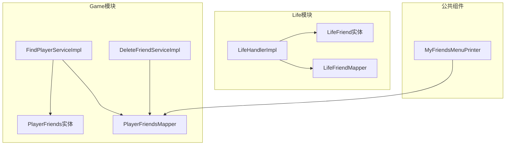
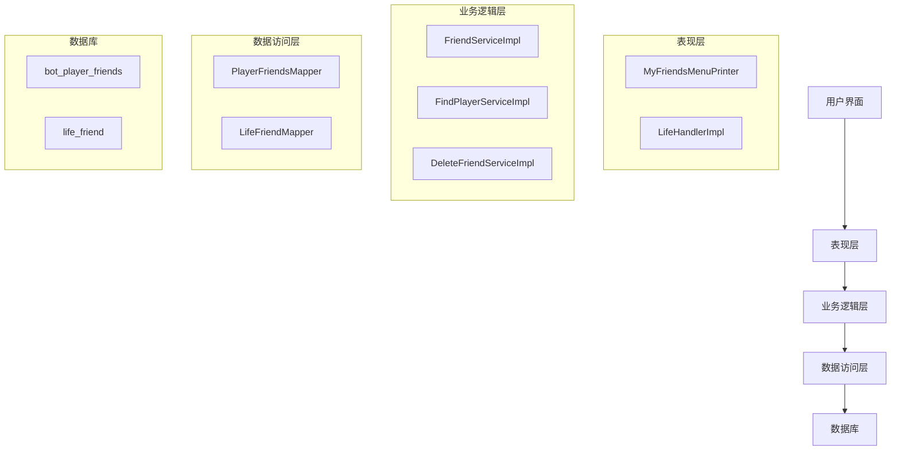
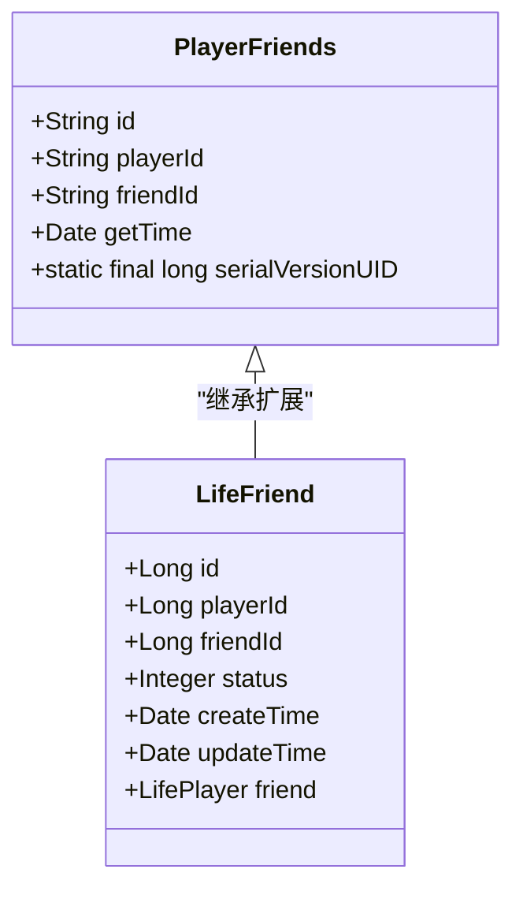
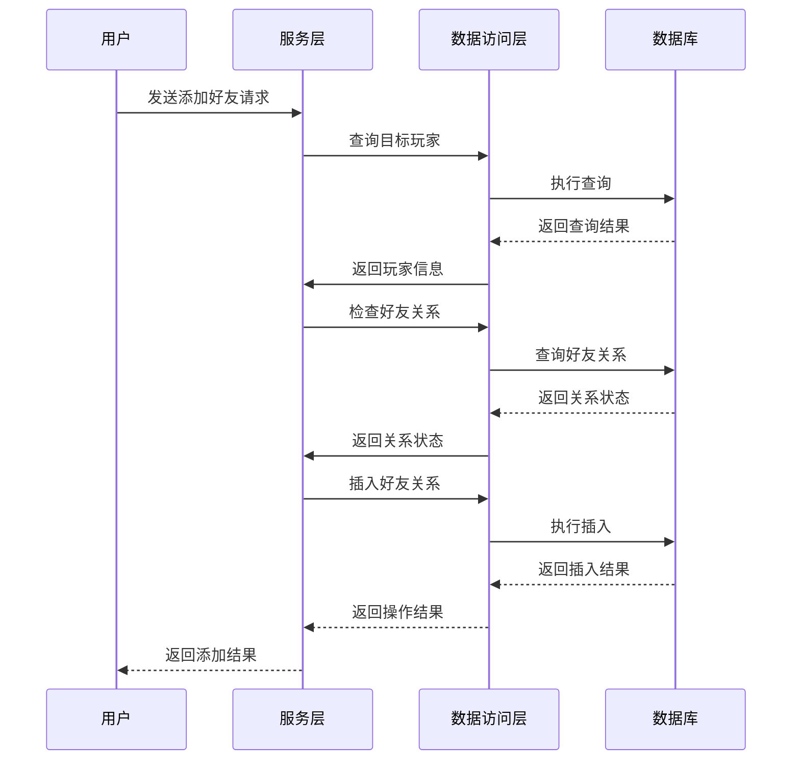
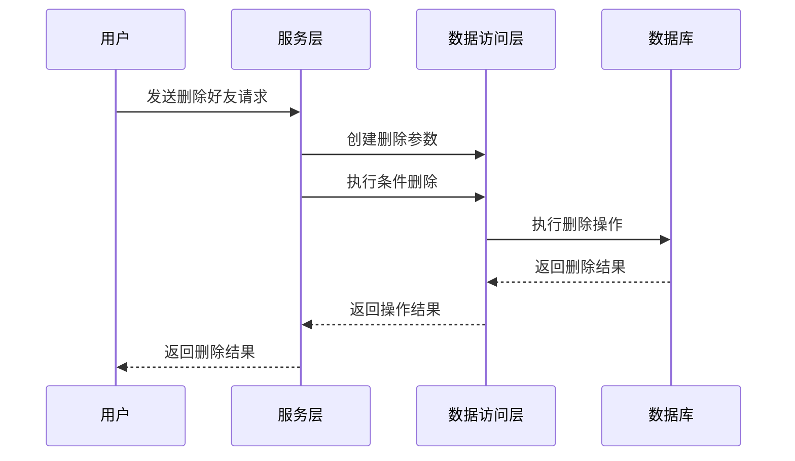
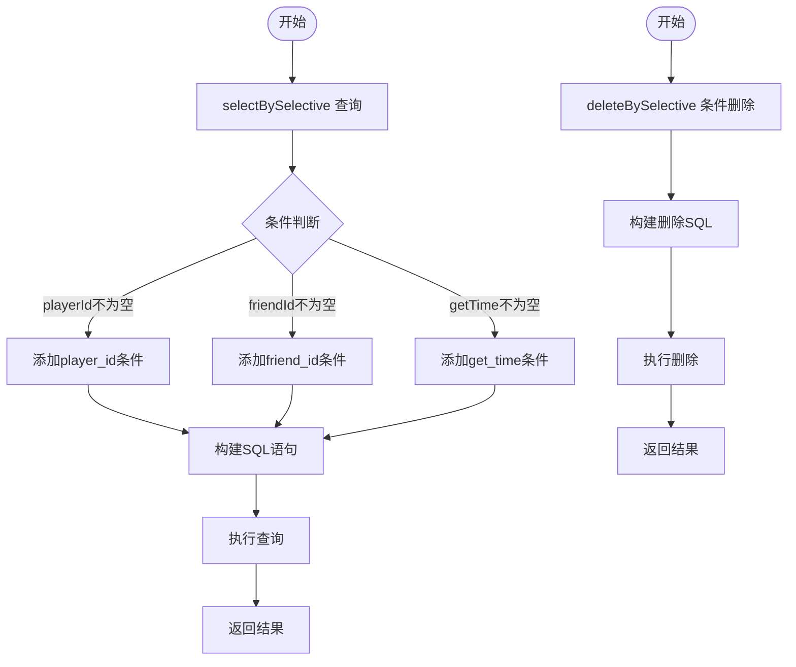
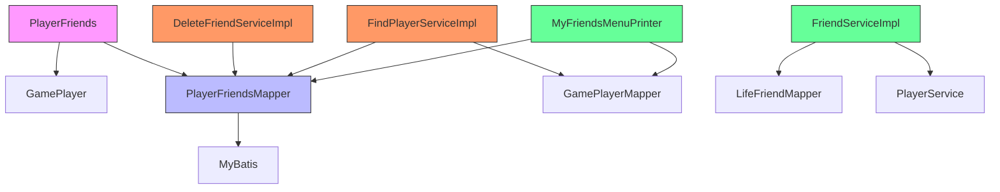

# 好友系统

<cite>
**本文档引用文件**  
- [PlayerFriends.java](file://Game/src/main/java/com/bot/game/dao/entity/PlayerFriends.java)
- [PlayerFriendsMapper.java](file://Game/src/main/java/com/bot/game/dao/mapper/PlayerFriendsMapper.java)
- [PlayerFriendsMapper.xml](file://Game/src/main/resources/mapper/PlayerFriendsMapper.xml)
- [LifeFriend.java](file://Life/src/main/java/com/bot/life/dao/entity/LifeFriend.java)
- [LifeFriendMapper.xml](file://Life/src/main/resources/mapper/LifeFriendMapper.xml)
- [DeleteFriendServiceImpl.java](file://Game/src/main/java/com/bot/game/service/impl/DeleteFriendServiceImpl.java)
- [FindPlayerServiceImpl.java](file://Game/src/main/java/com/bot/game/service/impl/FindPlayerServiceImpl.java)
- [FriendServiceImpl.java](file://Life/src/main/java/com/bot/life/service/impl/FriendServiceImpl.java)
- [MyFriendsMenuPrinter.java](file://Game/src/main/java/com/bot/game/chain/menu/MyFriendsMenuPrinter.java)
- [FriendService.java](file://Life/src/main/java/com/bot/life/service/FriendService.java)
- [LifeHandlerImpl.java](file://Life/src/main/java/com/bot/life/service/impl/LifeHandlerImpl.java)
</cite>

## 目录
1. [简介](#简介)
2. [项目结构](#项目结构)
3. [核心组件](#核心组件)
4. [架构概述](#架构概述)
5. [详细组件分析](#详细组件分析)
6. [依赖分析](#依赖分析)
7. [性能考量](#性能考量)
8. [故障排除指南](#故障排除指南)
9. [结论](#结论)

## 简介
本文档详细阐述了Bot项目中好友系统的实现机制，重点分析了PlayerFriends实体的关系模型设计。文档解释了好友申请、验证、删除等操作的实现机制，并结合MyBatis映射文件说明了双向好友关系的存储结构与查询优化策略。通过实际代码示例展示了好友列表获取、关系状态判断、互动功能集成等典型使用场景。文档还探讨了好友系统在社交互动中的作用及性能考量。

## 项目结构
好友系统主要分布在Game和Life两个模块中，其中Game模块包含基础的好友关系管理，而Life模块实现了更完整的好友交互功能。系统采用分层架构，包括实体层、数据访问层、服务层和表现层。

**图表来源**  
- [PlayerFriends.java](file://Game/src/main/java/com/bot/game/dao/entity/PlayerFriends.java)
- [LifeFriend.java](file://Life/src/main/java/com/bot/life/dao/entity/LifeFriend.java)
- [MyFriendsMenuPrinter.java](file://Game/src/main/java/com/bot/game/chain/menu/MyFriendsMenuPrinter.java)

**章节来源**  
- [PlayerFriends.java](file://Game/src/main/java/com/bot/game/dao/entity/PlayerFriends.java)
- [LifeFriend.java](file://Life/src/main/java/com/bot/life/dao/entity/LifeFriend.java)

## 核心组件
好友系统的核心组件包括PlayerFriends实体、PlayerFriendsMapper数据访问接口、以及相关的服务实现类。系统通过MyBatis框架实现数据持久化，采用UUID作为主键标识好友关系。

**章节来源**  
- [PlayerFriends.java](file://Game/src/main/java/com/bot/game/dao/entity/PlayerFriends.java)
- [PlayerFriendsMapper.java](file://Game/src/main/java/com/bot/game/dao/mapper/PlayerFriendsMapper.java)

## 架构概述
好友系统采用典型的三层架构设计，包括数据访问层、业务逻辑层和表现层。系统通过MyBatis实现数据库操作，服务层处理业务逻辑，表现层负责用户交互。

**图表来源**  
- [FriendServiceImpl.java](file://Life/src/main/java/com/bot/life/service/impl/FriendServiceImpl.java)
- [FindPlayerServiceImpl.java](file://Game/src/main/java/com/bot/game/service/impl/FindPlayerServiceImpl.java)
- [DeleteFriendServiceImpl.java](file://Game/src/main/java/com/bot/game/service/impl/DeleteFriendServiceImpl.java)

## 详细组件分析
### PlayerFriends实体分析
PlayerFriends实体定义了好友关系的基本属性，包括关系ID、玩家ID、好友ID和建立时间。系统采用单向关系存储，通过双向查询实现好友关系的对称性。

**图表来源**  
- [PlayerFriends.java](file://Game/src/main/java/com/bot/game/dao/entity/PlayerFriends.java)
- [LifeFriend.java](file://Life/src/main/java/com/bot/life/dao/entity/LifeFriend.java)

### 好友操作实现分析
好友系统的操作实现包括添加、删除、查询等基本功能。系统通过MyBatis的动态SQL实现条件查询和删除操作。

#### 添加好友操作流程

**图表来源**  
- [FindPlayerServiceImpl.java](file://Game/src/main/java/com/bot/game/service/impl/FindPlayerServiceImpl.java)
- [PlayerFriendsMapper.xml](file://Game/src/main/resources/mapper/PlayerFriendsMapper.xml)

#### 删除好友操作流程

**图表来源**  
- [DeleteFriendServiceImpl.java](file://Game/src/main/java/com/bot/game/service/impl/DeleteFriendServiceImpl.java)
- [PlayerFriendsMapper.xml](file://Game/src/main/resources/mapper/PlayerFriendsMapper.xml)

### MyBatis映射文件分析
MyBatis映射文件定义了好友关系的CRUD操作，采用动态SQL实现灵活的查询条件。

**图表来源**  
- [PlayerFriendsMapper.xml](file://Game/src/main/resources/mapper/PlayerFriendsMapper.xml)
- [LifeFriendMapper.xml](file://Life/src/main/resources/mapper/LifeFriendMapper.xml)

**章节来源**  
- [PlayerFriendsMapper.xml](file://Game/src/main/resources/mapper/PlayerFriendsMapper.xml)

## 依赖分析
好友系统依赖于多个核心组件，包括玩家实体、数据访问框架和公共常量。

**图表来源**  
- [PlayerFriends.java](file://Game/src/main/java/com/bot/game/dao/entity/PlayerFriends.java)
- [PlayerFriendsMapper.java](file://Game/src/main/java/com/bot/game/dao/mapper/PlayerFriendsMapper.java)
- [DeleteFriendServiceImpl.java](file://Game/src/main/java/com/bot/game/service/impl/DeleteFriendServiceImpl.java)

**章节来源**  
- [PlayerFriends.java](file://Game/src/main/java/com/bot/game/dao/entity/PlayerFriends.java)
- [PlayerFriendsMapper.java](file://Game/src/main/java/com/bot/game/dao/mapper/PlayerFriendsMapper.java)

## 性能考量
好友系统的性能主要受数据库查询效率和关系判断算法的影响。系统通过以下方式优化性能：

1. **索引优化**：在player_id和friend_id字段上建立复合索引，提高查询效率
2. **批量操作**：支持批量查询好友列表，减少数据库访问次数
3. **缓存机制**：在应用层缓存常用的好友关系数据
4. **连接池**：使用数据库连接池管理数据库连接，提高资源利用率

系统还考虑了大规模好友数据的分页查询和懒加载策略，避免一次性加载过多数据导致内存溢出。

## 故障排除指南
### 常见问题及解决方案
1. **好友添加失败**
   - 检查目标玩家是否存在
   - 确认是否已添加过该好友
   - 验证数据库连接是否正常

2. **好友列表显示异常**
   - 检查查询条件是否正确
   - 验证MyBatis映射文件配置
   - 确认数据库表结构是否匹配

3. **删除好友无效**
   - 检查删除条件是否正确
   - 验证事务管理配置
   - 确认数据库权限设置

**章节来源**  
- [DeleteFriendServiceImpl.java](file://Game/src/main/java/com/bot/game/service/impl/DeleteFriendServiceImpl.java)
- [FindPlayerServiceImpl.java](file://Game/src/main/java/com/bot/game/service/impl/FindPlayerServiceImpl.java)

## 结论
好友系统通过PlayerFriends实体实现了基础的好友关系管理，结合MyBatis框架提供了高效的数据访问能力。系统设计考虑了扩展性，Life模块在此基础上实现了更完整的好友交互功能。通过合理的架构设计和性能优化，系统能够支持大规模的好友关系管理，为用户提供流畅的社交互动体验。