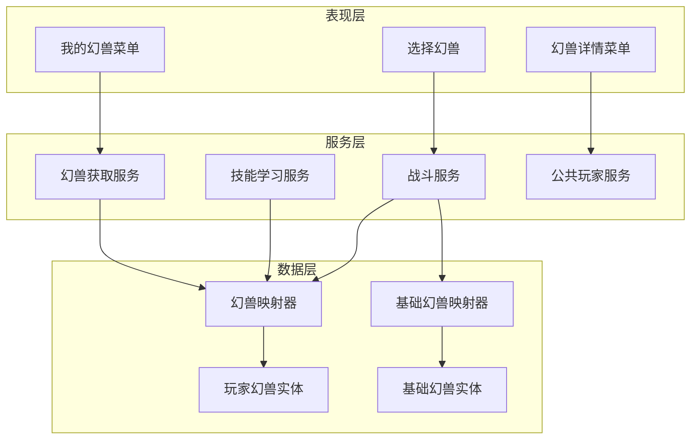
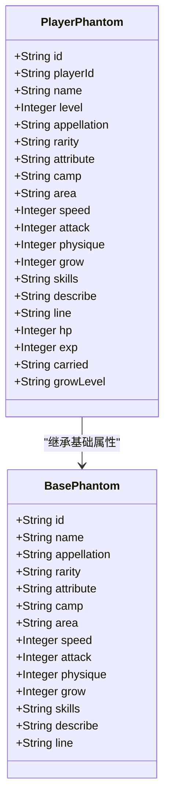
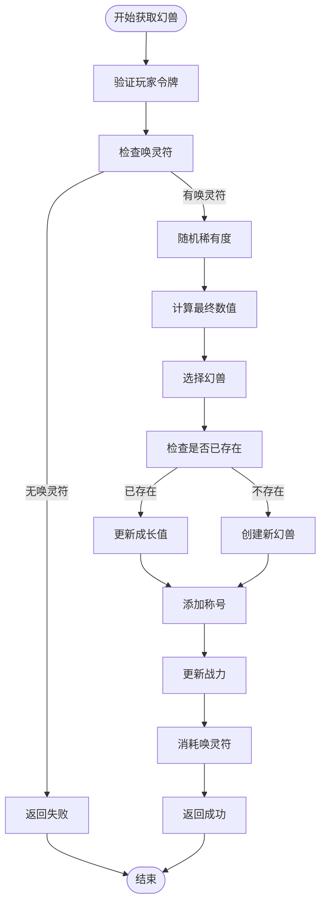
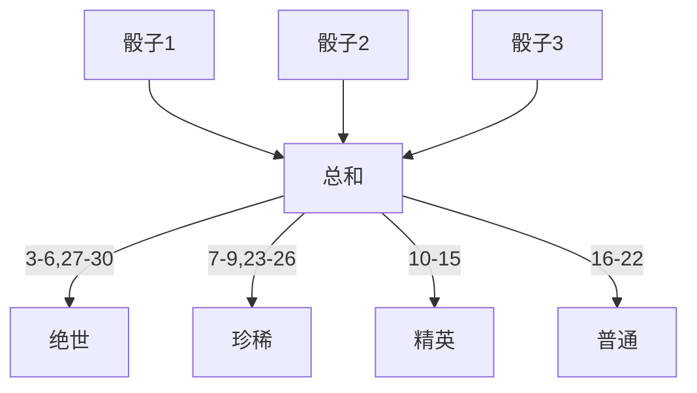
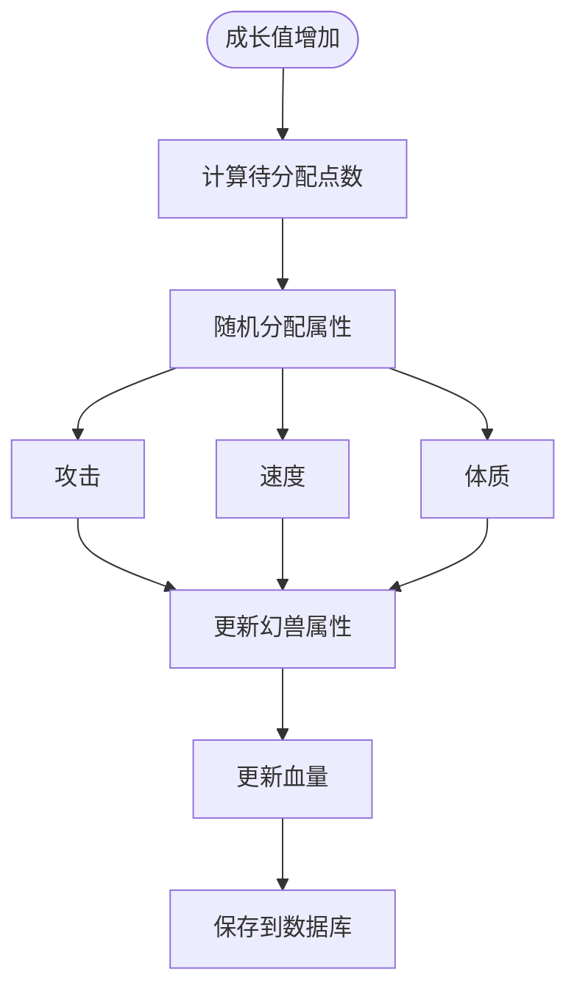
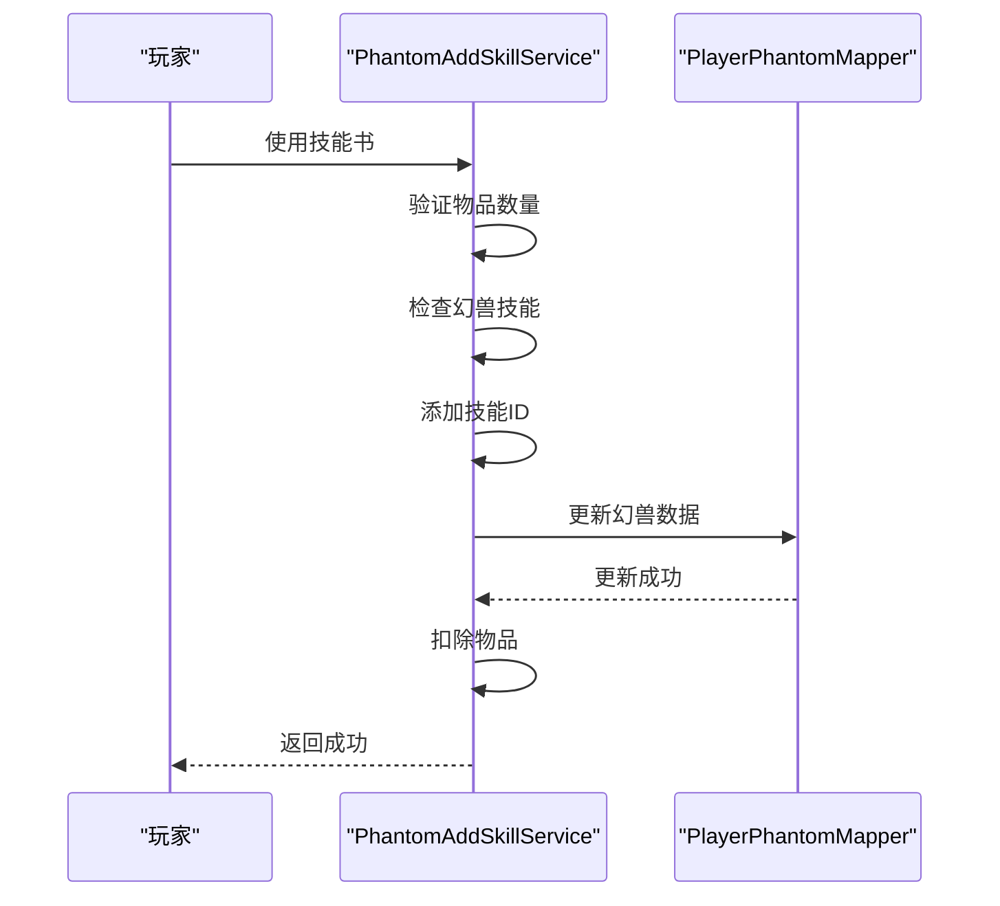
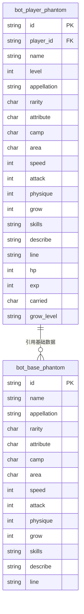
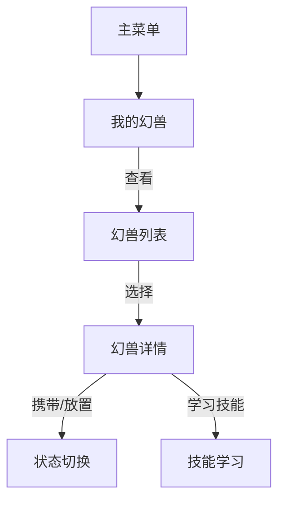

# 幻兽系统

<cite>
**本文档引用文件**   
- [PlayerPhantom.java](file://Game/src/main/java/com/bot/game/dao/entity/PlayerPhantom.java)
- [BasePhantom.java](file://Game/src/main/java/com/bot/game/dao/entity/BasePhantom.java)
- [GetPhantomServiceImpl.java](file://Game/src/main/java/com/bot/game/service/impl/GetPhantomServiceImpl.java)
- [PhantomAddSkillServiceImpl.java](file://Game/src/main/java/com/bot/game/service/impl/PhantomAddSkillServiceImpl.java)
- [CommonPlayer.java](file://Game/src/main/java/com/bot/game/service/impl/CommonPlayer.java)
- [PlayerPhantomMapper.xml](file://Game/src/main/resources/mapper/PlayerPhantomMapper.xml)
- [BasePhantomMapper.xml](file://Game/src/main/resources/mapper/BasePhantomMapper.xml)
- [ENRarity.java](file://Game/src/main/java/com/bot/game/enums/ENRarity.java)
- [ENCarriedStatus.java](file://Game/src/main/java/com/bot/game/enums/ENCarriedStatus.java)
- [MyPhantomMenuPrinter.java](file://Game/src/main/java/com/bot/game/chain/menu/MyPhantomMenuPrinter.java)
- [PhantomDetailMenuPrinter.java](file://Game/src/main/java/com/bot/game/chain/menu/PhantomDetailMenuPrinter.java)
- [BattleServiceImpl.java](file://Game/src/main/java/com/bot/game/service/impl/BattleServiceImpl.java)
- [GameConsts.java](file://Common/src/main/java/com/bot/common/constant/GameConsts.java)
</cite>

## 目录
1. [引言](#引言)
2. [幻兽系统架构](#幻兽系统架构)
3. [核心实体设计](#核心实体设计)
4. [幻兽获取机制](#幻兽获取机制)
5. [成长与属性计算](#成长与属性计算)
6. [技能系统](#技能系统)
7. [战斗属性计算](#战斗属性计算)
8. [状态持久化策略](#状态持久化策略)
9. [高级功能实现](#高级功能实现)
10. [用户界面与交互](#用户界面与交互)
11. [总结](#总结)

## 引言

幻兽系统是游戏中的核心养成系统，为玩家提供强大的战斗伙伴和养成乐趣。该系统通过精心设计的实体架构、成长机制和战斗集成，为玩家提供了丰富的游戏体验。本系统实现了幻兽的获取、培养、战斗和高级功能，构成了游戏的核心玩法之一。

## 幻兽系统架构

幻兽系统采用分层架构设计，包含数据层、服务层和表现层。数据层由MyBatis持久化框架管理，服务层处理业务逻辑，表现层负责用户交互。系统通过PlayerPhantom实体与玩家建立关联，实现幻兽状态的持久化管理。



**图源**
- [MyPhantomMenuPrinter.java](file://Game/src/main/java/com/bot/game/chain/menu/MyPhantomMenuPrinter.java)
- [PhantomDetailMenuPrinter.java](file://Game/src/main/java/com/bot/game/chain/menu/PhantomDetailMenuPrinter.java)
- [PickPhantomPrinter.java](file://Game/src/main/java/com/bot/game/chain/menu/dungeon/PickPhantomPrinter.java)
- [GetPhantomServiceImpl.java](file://Game/src/main/java/com/bot/game/service/impl/GetPhantomServiceImpl.java)
- [PhantomAddSkillServiceImpl.java](file://Game/src/main/java/com/bot/game/service/impl/PhantomAddSkillServiceImpl.java)
- [BattleServiceImpl.java](file://Game/src/main/java/com/bot/game/service/impl/BattleServiceImpl.java)
- [PlayerPhantomMapper.java](file://Game/src/main/java/com/bot/game/dao/mapper/PlayerPhantomMapper.java)
- [BasePhantomMapper.java](file://Game/src/main/java/com/bot/game/dao/mapper/BasePhantomMapper.java)

## 核心实体设计

幻兽系统的核心实体设计采用基础数据与玩家实例分离的模式，通过BasePhantom和PlayerPhantom两个实体实现。这种设计既保证了基础数据的统一管理，又支持玩家个性化数据的存储。

### 实体关系



**图源**
- [BasePhantom.java](file://Game/src/main/java/com/bot/game/dao/entity/BasePhantom.java#L9-L82)
- [PlayerPhantom.java](file://Game/src/main/java/com/bot/game/dao/entity/PlayerPhantom.java#L9-L112)

### PlayerPhantom实体

PlayerPhantom实体是幻兽系统的核心，存储玩家幻兽的所有状态信息。该实体不仅包含基础属性，还扩展了玩家专属的属性和状态。

**属性说明**
- **id**: 幻兽唯一标识
- **playerId**: 所属玩家ID
- **name**: 幻兽名称
- **level**: 幻兽等级
- **appellation**: 幻兽称号
- **rarity**: 幻兽稀有度
- **attribute**: 幻兽属性
- **camp**: 幻兽阵营
- **area**: 幻兽地区
- **speed**: 幻兽速度
- **attack**: 幻兽攻击
- **physique**: 幻兽体质
- **grow**: 幻兽成长
- **skills**: 幻兽技能
- **describe**: 幻兽描述
- **line**: 幻兽台词
- **hp**: 当前血量
- **exp**: 当前经验值
- **carried**: 是否携带状态
- **growLevel**: 成长等级

**节源**
- [PlayerPhantom.java](file://Game/src/main/java/com/bot/game/dao/entity/PlayerPhantom.java#L9-L112)

### BasePhantom实体

BasePhantom实体存储幻兽的基础数据，为所有玩家共享。这种设计避免了数据冗余，确保了基础属性的一致性。

**节源**
- [BasePhantom.java](file://Game/src/main/java/com/bot/game/dao/entity/BasePhantom.java#L9-L82)

## 幻兽获取机制

幻兽获取机制是玩家进入幻兽系统的入口，通过概率算法和状态管理实现幻兽的随机获取和重复处理。

### 获取流程



**图源**
- [GetPhantomServiceImpl.java](file://Game/src/main/java/com/bot/game/service/impl/GetPhantomServiceImpl.java#L40-L132)

### 稀有度算法

幻兽的稀有度通过掷骰子算法确定，玩家掷出三个骰子，根据总点数确定幻兽的稀有度。

**稀有度分布**
- **绝世 (BEST)**: 总点数为30, 29, 28, 27, 3, 4, 5, 6
- **珍稀 (GREAT)**: 总点数为7, 8, 9, 23, 24, 25, 26
- **精英 (GOOD)**: 总点数为10, 11, 12, 13, 14, 15
- **普通 (NORMAL)**: 其他点数



**节源**
- [GetPhantomServiceImpl.java](file://Game/src/main/java/com/bot/game/service/impl/GetPhantomServiceImpl.java#L54-L68)

### 重复幻兽处理

当玩家获取已拥有的幻兽时，系统不会创建新的幻兽实例，而是提升已有幻兽的成长值。

**处理逻辑**
1. 检查玩家是否已拥有同名幻兽
2. 如果已存在，增加成长值（上限受稀有度限制）
3. 更新成长等级
4. 触发属性增长
5. 更新战力

**节源**
- [GetPhantomServiceImpl.java](file://Game/src/main/java/com/bot/game/service/impl/GetPhantomServiceImpl.java#L83-L96)

## 成长与属性计算

幻兽的成长机制是系统的核心，通过等级提升和成长值积累，逐步增强幻兽的战斗能力。

### 成长机制

幻兽的成长值通过重复获取相同幻兽获得，每重复一次增加1点成长值，上限由幻兽稀有度决定。

**稀有度与成长上限**
- 普通: 11级
- 精英: 13级
- 珍稀: 15级
- 绝世: 18级

**节源**
- [ENRarity.java](file://Game/src/main/java/com/bot/game/enums/ENRarity.java#L16-L19)

### 属性增长算法

当幻兽成长值增加时，系统会根据幻兽等级随机分配属性点。



**节源**
- [CommonPlayer.java](file://Game/src/main/java/com/bot/game/service/impl/CommonPlayer.java#L115-L127)

### 血量计算

幻兽的血量基于等级和体质属性动态计算。

**计算公式**
```
血量 = (等级 × 每级血量) + (体质 × 体质血量系数)
```

其中:
- 每级血量 = 100
- 体质血量系数 = 10

**节源**
- [CommonPlayer.java](file://Game/src/main/java/com/bot/game/service/impl/CommonPlayer.java#L66-L68)
- [GameConsts.java](file://Common/src/main/java/com/bot/common/constant/GameConsts.java#L192-L196)

## 技能系统

幻兽技能系统允许玩家为幻兽学习和管理技能，增强战斗能力。

### 技能学习流程



**节源**
- [PhantomAddSkillServiceImpl.java](file://Game/src/main/java/com/bot/game/service/impl/PhantomAddSkillServiceImpl.java#L32-L52)

### 技能存储格式

幻兽的技能以逗号分隔的字符串形式存储在skills字段中。

**示例**
```
"skill001,skill002,skill003"
```

**节源**
- [PhantomAddSkillServiceImpl.java](file://Game/src/main/java/com/bot/game/service/impl/PhantomAddSkillServiceImpl.java#L41-L45)

## 战斗属性计算

幻兽在战斗中的属性会根据基础属性和装备进行计算，形成最终的战斗能力。

### 战斗属性计算公式

**攻击计算**
```
最终攻击 = (基础攻击 + 随机成长) × 攻击系数 + (等级 × 每级攻击)
```

**速度计算**
```
最终速度 = (基础速度 + 随机成长) × 速度系数 + (等级 × 每级速度)
```

**防御计算**
```
最终防御 = (基础体质 + 随机成长) × 防御系数 + (等级 × 每级防御)
```

**节源**
- [BattleServiceImpl.java](file://Game/src/main/java/com/bot/game/service/impl/BattleServiceImpl.java#L132-L140)

### 属性克制系统

系统实现了属性克制机制，不同属性之间存在相生相克关系。

**克制效果**
- 优势属性: 攻击力提升20%
- 劣势属性: 攻击力降低20%
- 中立属性: 攻击力不变

**节源**
- [BattleServiceImpl.java](file://Game/src/main/java/com/bot/game/service/impl/BattleServiceImpl.java#L178-L186)
- [GameConsts.java](file://Common/src/main/java/com/bot/common/constant/GameConsts.java#L200-L202)

## 状态持久化策略

幻兽系统通过MyBatis框架实现数据持久化，采用合理的数据库设计和映射策略。

### 数据库表结构



**节源**
- [PlayerPhantomMapper.xml](file://Game/src/main/resources/mapper/PlayerPhantomMapper.xml)
- [BasePhantomMapper.xml](file://Game/src/main/resources/mapper/BasePhantomMapper.xml)

### MyBatis映射配置

系统使用MyBatis的动态SQL功能，实现灵活的数据查询和更新。

**关键映射功能**
- 动态条件查询
- 选择性字段更新
- 批量操作支持
- 结果集映射

**节源**
- [PlayerPhantomMapper.xml](file://Game/src/main/resources/mapper/PlayerPhantomMapper.xml)
- [BasePhantomMapper.xml](file://Game/src/main/resources/mapper/BasePhantomMapper.xml)

## 高级功能实现

系统实现了多个高级功能，包括称号系统、战力计算和幻兽携带状态管理。

### 称号系统

幻兽系统与称号系统深度集成，玩家在特定条件下可获得特殊称号。

**称号获取条件**
- 初出茅庐: 拥有第一个幻兽
- 幸运天使: 获得绝世稀有度幻兽
- 人生赢家: 拥有60个幻兽

**节源**
- [GetPhantomServiceImpl.java](file://Game/src/main/java/com/bot/game/service/impl/GetPhantomServiceImpl.java#L112-L124)
- [ENAppellation.java](file://Game/src/main/java/com/bot/game/enums/ENAppellation.java)

### 战力计算

系统实时计算玩家的总战力，作为玩家实力的衡量标准。

**战力计算公式**
```
总战力 = Σ(幻兽基础战力) + Σ(幻兽属性战力) + Σ(法宝战力)
```

其中:
- 幻兽基础战力: 由稀有度决定
- 幻兽属性战力: 攻击×10 + 速度×3 + 体质×8
- 法宝战力: 每个法宝500 + 每级200 + 满级额外400

**节源**
- [CommonPlayer.java](file://Game/src/main/java/com/bot/game/service/impl/CommonPlayer.java#L84-L107)
- [GameConsts.java](file://Common/src/main/java/com/bot/common/constant/GameConsts.java#L205-L211)

### 携带状态管理

幻兽有"携带"和"放置"两种状态，影响其在战斗中的可用性。

**状态值**
- 携带: "0"
- 放置: "1"

**节源**
- [ENCarriedStatus.java](file://Game/src/main/java/com/bot/game/enums/ENCarriedStatus.java)

## 用户界面与交互

系统提供了友好的用户界面，通过菜单系统实现幻兽的查看和管理。

### 菜单结构



**节源**
- [MyPhantomMenuPrinter.java](file://Game/src/main/java/com/bot/game/chain/menu/MyPhantomMenuPrinter.java)
- [PhantomDetailMenuPrinter.java](file://Game/src/main/java/com/bot/game/chain/menu/PhantomDetailMenuPrinter.java)

### 幻兽详情显示

系统在幻兽详情界面展示完整的幻兽信息，包括基础属性、战斗属性和技能信息。

**显示内容**
- 幻兽名称和稀有度
- 等级和成长等级
- 基础属性（攻击、速度、体质）
- 战斗属性（血量、经验值）
- 技能列表和效果
- 携带状态

**节源**
- [PhantomDetailMenuPrinter.java](file://Game/src/main/java/com/bot/game/chain/menu/PhantomDetailMenuPrinter.java#L38-L45)

## 总结

幻兽系统通过精心设计的实体架构、成长机制和战斗集成，为玩家提供了丰富的养成体验。系统采用基础数据与玩家实例分离的设计模式，既保证了数据的一致性，又支持个性化的成长路径。通过MyBatis框架实现高效的数据持久化，结合概率算法和属性计算，构建了一个完整而有趣的幻兽养成系统。该系统不仅提供了核心的游戏玩法，还通过称号、战力等机制增强了玩家的成就感和竞争性。