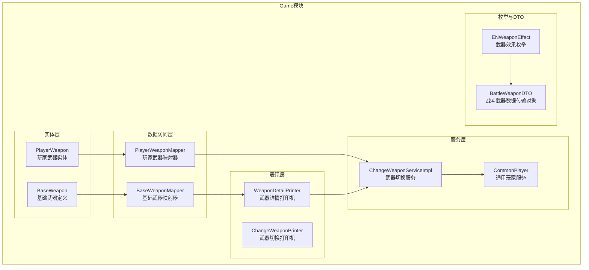
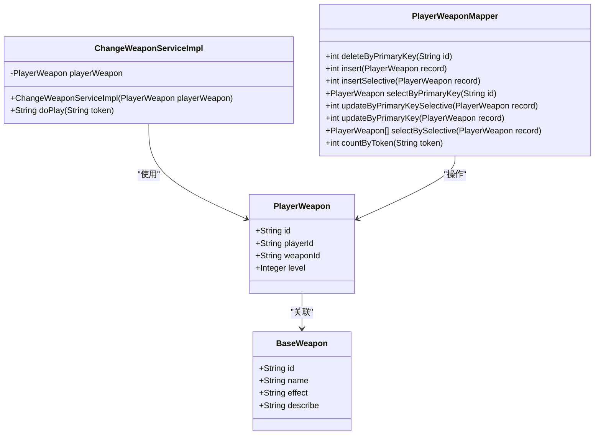
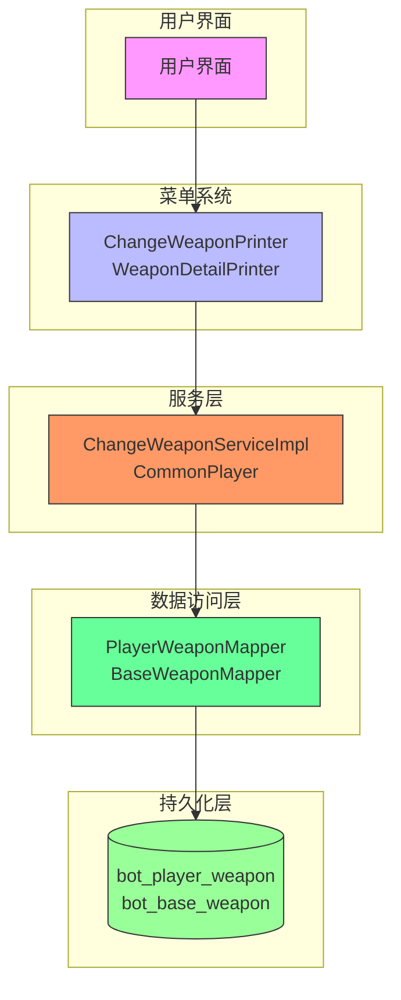
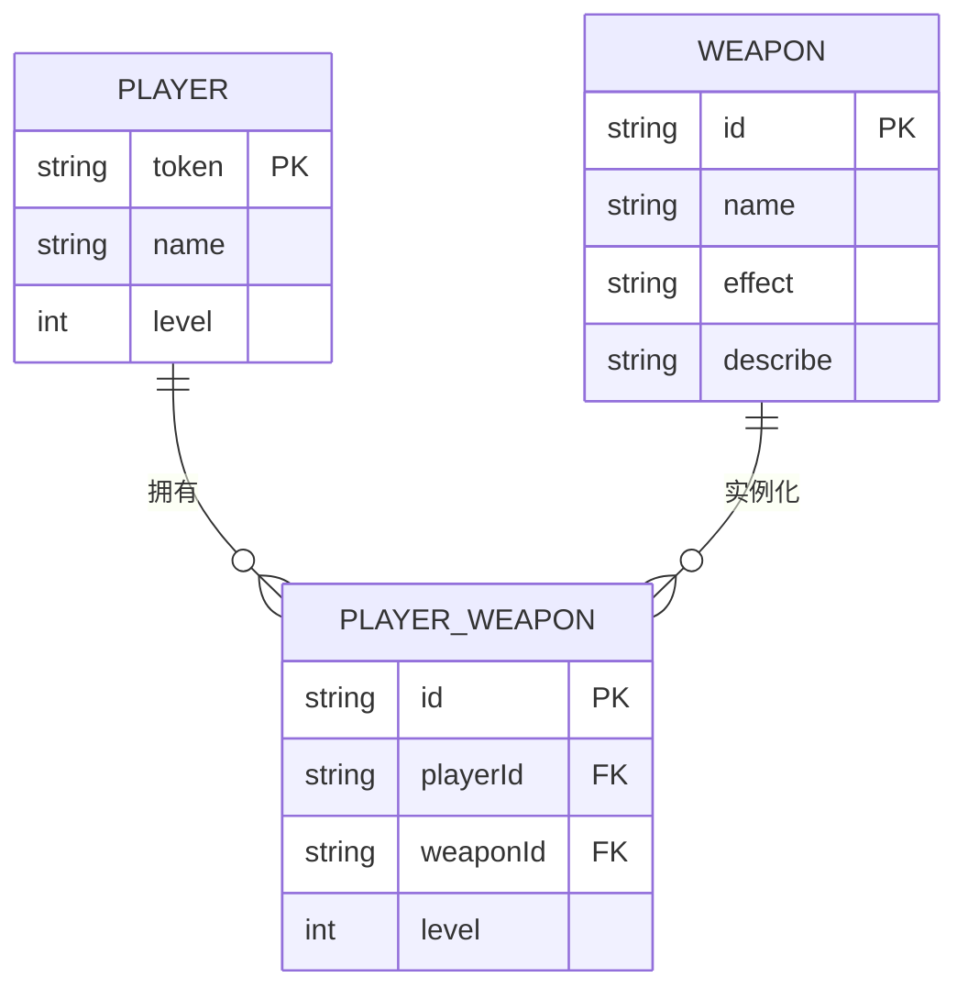
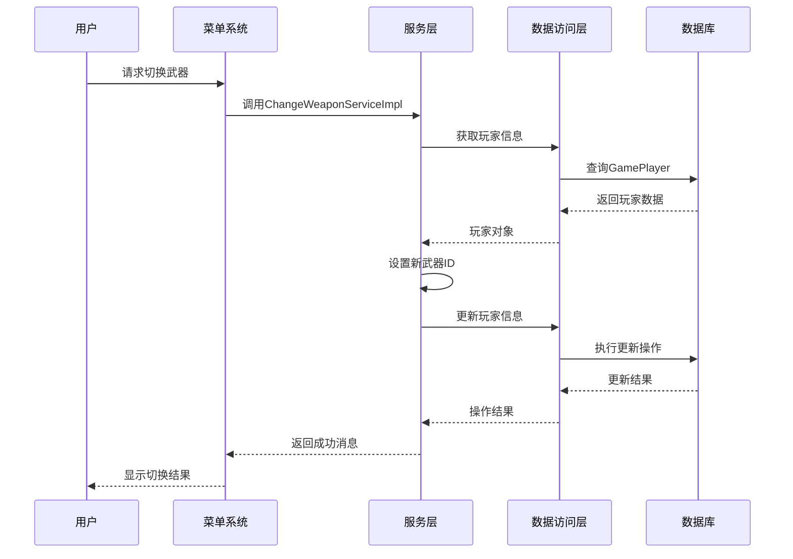
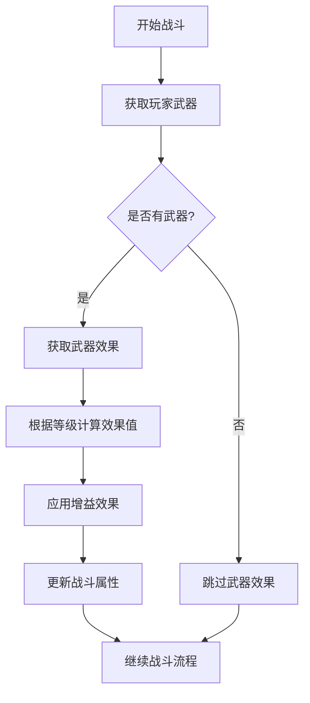

# 武器系统

<cite>
**本文档引用的文件**   
- [PlayerWeapon.java](file://Game/src/main/java/com/bot/game/dao/entity/PlayerWeapon.java)
- [BaseWeapon.java](file://Game/src/main/java/com/bot/game/dao/entity/BaseWeapon.java)
- [PlayerWeaponMapper.java](file://Game/src/main/java/com/bot/game/dao/mapper/PlayerWeaponMapper.java)
- [BaseWeaponMapper.java](file://Game/src/main/java/com/bot/game/dao/mapper/BaseWeaponMapper.java)
- [PlayerWeaponMapper.xml](file://Game/src/main/resources/mapper/PlayerWeaponMapper.xml)
- [BaseWeaponMapper.xml](file://Game/src/main/resources/mapper/BaseWeaponMapper.xml)
- [ENWeaponEffect.java](file://Game/src/main/java/com/bot/game/enums/ENWeaponEffect.java)
- [ChangeWeaponServiceImpl.java](file://Game/src/main/java/com/bot/game/service/impl/ChangeWeaponServiceImpl.java)
- [WeaponDetailPrinter.java](file://Game/src/main/java/com/bot/game/chain/menu/WeaponDetailPrinter.java)
- [BattleServiceImpl.java](file://Game/src/main/java/com/bot/game/service/impl/BattleServiceImpl.java)
- [CommonPlayer.java](file://Game/src/main/java/com/bot/game/service/impl/CommonPlayer.java)
- [BattleWeaponDTO.java](file://Game/src/main/java/com/bot/game/dto/BattleWeaponDTO.java)
- [ENRarity.java](file://Game/src/main/java/com/bot/game/enums/ENRarity.java)
- [GameConsts.java](file://Common/src/main/java/com/bot/common/constant/GameConsts.java)
</cite>

## 目录
1. [引言](#引言)
2. [项目结构](#项目结构)
3. [核心组件](#核心组件)
4. [架构概述](#架构概述)
5. [详细组件分析](#详细组件分析)
6. [依赖分析](#依赖分析)
7. [性能考虑](#性能考虑)
8. [故障排除指南](#故障排除指南)
9. [结论](#结论)

## 引言
本文档详细说明了游戏系统中武器系统的实现机制，重点介绍PlayerWeapon实体的设计目标、装备管理机制以及武器与玩家的关联关系。文档涵盖了武器获取、强化、切换等核心功能的实现方式，并通过MyBatis映射文件描述了装备状态的持久化策略。同时，文档还解释了武器稀有度、耐久度等业务规则及性能优化建议。

## 项目结构
武器系统主要分布在Game模块中，包含实体类、数据访问层、服务实现和菜单交互等多个组件。系统通过分层架构实现了武器数据的管理、持久化和业务逻辑处理。



**图示来源**
- [PlayerWeapon.java](file://Game/src/main/java/com/bot/game/dao/entity/PlayerWeapon.java)
- [BaseWeapon.java](file://Game/src/main/java/com/bot/game/dao/entity/BaseWeapon.java)
- [PlayerWeaponMapper.java](file://Game/src/main/java/com/bot/game/dao/mapper/PlayerWeaponMapper.java)
- [BaseWeaponMapper.java](file://Game/src/main/java/com/bot/game/dao/mapper/BaseWeaponMapper.java)
- [ChangeWeaponServiceImpl.java](file://Game/src/main/java/com/bot/game/service/impl/ChangeWeaponServiceImpl.java)
- [CommonPlayer.java](file://Game/src/main/java/com/bot/game/service/impl/CommonPlayer.java)
- [WeaponDetailPrinter.java](file://Game/src/main/java/com/bot/game/chain/menu/WeaponDetailPrinter.java)
- [ENWeaponEffect.java](file://Game/src/main/java/com/bot/game/enums/ENWeaponEffect.java)
- [BattleWeaponDTO.java](file://Game/src/main/java/com/bot/game/dto/BattleWeaponDTO.java)

**本节来源**
- [PlayerWeapon.java](file://Game/src/main/java/com/bot/game/dao/entity/PlayerWeapon.java)
- [BaseWeapon.java](file://Game/src/main/java/com/bot/game/dao/entity/BaseWeapon.java)
- [PlayerWeaponMapper.java](file://Game/src/main/java/com/bot/game/dao/mapper/PlayerWeaponMapper.java)
- [BaseWeaponMapper.java](file://Game/src/main/java/com/bot/game/dao/mapper/BaseWeaponMapper.java)

## 核心组件

武器系统的核心组件包括PlayerWeapon实体类、BaseWeapon基础武器定义、PlayerWeaponMapper数据访问接口以及ChangeWeaponServiceImpl服务实现。这些组件共同实现了武器的持久化存储、状态管理和功能应用。

PlayerWeapon实体代表玩家拥有的具体武器实例，包含玩家ID、武器ID和等级等属性。BaseWeapon实体定义了武器的基础属性，如名称、效果和描述。通过这两个实体的结合，系统实现了武器模板与实例的分离设计。

PlayerWeaponMapper提供了对玩家武器数据的CRUD操作，支持根据玩家ID查询所有武器、根据ID查询特定武器等常用操作。ChangeWeaponServiceImpl服务实现了武器切换的核心业务逻辑，允许玩家在拥有的武器之间进行切换。



**图示来源**
- [PlayerWeapon.java](file://Game/src/main/java/com/bot/game/dao/entity/PlayerWeapon.java)
- [BaseWeapon.java](file://Game/src/main/java/com/bot/game/dao/entity/BaseWeapon.java)
- [PlayerWeaponMapper.java](file://Game/src/main/java/com/bot/game/dao/mapper/PlayerWeaponMapper.java)
- [ChangeWeaponServiceImpl.java](file://Game/src/main/java/com/bot/game/service/impl/ChangeWeaponServiceImpl.java)

**本节来源**
- [PlayerWeapon.java](file://Game/src/main/java/com/bot/game/dao/entity/PlayerWeapon.java)
- [BaseWeapon.java](file://Game/src/main/java/com/bot/game/dao/entity/BaseWeapon.java)
- [PlayerWeaponMapper.java](file://Game/src/main/java/com/bot/game/dao/mapper/PlayerWeaponMapper.java)
- [ChangeWeaponServiceImpl.java](file://Game/src/main/java/com/bot/game/service/impl/ChangeWeaponServiceImpl.java)

## 架构概述

武器系统的架构采用典型的分层设计，从数据持久化到业务逻辑再到用户交互，各层职责分明。系统通过MyBatis框架实现数据访问，确保了数据库操作的灵活性和可维护性。



**图示来源**
- [ChangeWeaponPrinter.java](file://Game/src/main/java/com/bot/game/chain/menu/ChangeWeaponPrinter.java)
- [WeaponDetailPrinter.java](file://Game/src/main/java/com/bot/game/chain/menu/WeaponDetailPrinter.java)
- [ChangeWeaponServiceImpl.java](file://Game/src/main/java/com/bot/game/service/impl/ChangeWeaponServiceImpl.java)
- [CommonPlayer.java](file://Game/src/main/java/com/bot/game/service/impl/CommonPlayer.java)
- [PlayerWeaponMapper.java](file://Game/src/main/java/com/bot/game/dao/mapper/PlayerWeaponMapper.java)
- [BaseWeaponMapper.java](file://Game/src/main/java/com/bot/game/dao/mapper/BaseWeaponMapper.java)

## 详细组件分析

### PlayerWeapon实体分析

PlayerWeapon实体是武器系统的核心数据结构，用于表示玩家拥有的具体武器实例。该实体通过playerId与玩家关联，通过weaponId与基础武器定义关联，实现了玩家与武器的多对多关系。



**图示来源**
- [PlayerWeapon.java](file://Game/src/main/java/com/bot/game/dao/entity/PlayerWeapon.java)
- [BaseWeapon.java](file://Game/src/main/java/com/bot/game/dao/entity/BaseWeapon.java)

**本节来源**
- [PlayerWeapon.java](file://Game/src/main/java/com/bot/game/dao/entity/PlayerWeapon.java)

### 武器切换功能分析

武器切换功能通过ChangeWeaponServiceImpl实现，允许玩家在拥有的武器之间进行切换。当玩家选择切换武器时，系统会更新玩家的当前武器ID。



**图示来源**
- [ChangeWeaponServiceImpl.java](file://Game/src/main/java/com/bot/game/service/impl/ChangeWeaponServiceImpl.java)
- [GamePlayerMapper.java](file://Game/src/main/java/com/bot/game/dao/mapper/GamePlayerMapper.java)

**本节来源**
- [ChangeWeaponServiceImpl.java](file://Game/src/main/java/com/bot/game/service/impl/ChangeWeaponServiceImpl.java)

### 武器效果系统分析

武器效果系统通过ENWeaponEffect枚举实现，定义了各种武器的特殊效果及其随等级提升的增强效果。每种武器效果都有对应的数值增长曲线，确保游戏平衡性。

```mermaid
classDiagram
class ENWeaponEffect {
+String value
+String label
+String effectContent
+Integer[] levelNumber
+ENWeaponEffect getByValue(String value)
}
ENWeaponEffect : W01 = "翻天印" : 攻击提升
ENWeaponEffect : W02 = "护灵甲" : 防御提升
ENWeaponEffect : W03 = "玄王佩" : 血量提升
ENWeaponEffect : W04 = "醒世符" : 免疫伤害
ENWeaponEffect : W05 = "解灵囊" : 免疫负面效果
ENWeaponEffect : W06 = "禁灵镜" : 禁止技能
ENWeaponEffect : W07 = "极影斗篷" : 速度提升
```

**图示来源**
- [ENWeaponEffect.java](file://Game/src/main/java/com/bot/game/enums/ENWeaponEffect.java)

**本节来源**
- [ENWeaponEffect.java](file://Game/src/main/java/com/bot/game/enums/ENWeaponEffect.java)

### 战斗集成分析

在战斗系统中，武器效果通过BattleWeaponDTO传递到战斗逻辑中。当战斗开始时，系统会根据玩家装备的武器及其等级应用相应的增益效果。



**图示来源**
- [BattleWeaponDTO.java](file://Game/src/main/java/com/bot/game/dto/BattleWeaponDTO.java)
- [BattleServiceImpl.java](file://Game/src/main/java/com/bot/game/service/impl/BattleServiceImpl.java)

**本节来源**
- [BattleWeaponDTO.java](file://Game/src/main/java/com/bot/game/dto/BattleWeaponDTO.java)
- [BattleServiceImpl.java](file://Game/src/main/java/com/bot/game/service/impl/BattleServiceImpl.java)

## 依赖分析

武器系统与其他游戏组件存在紧密的依赖关系，这些依赖确保了武器功能的完整性和一致性。

```mermaid
graph TD
WeaponSystem[武器系统] --> PlayerSystem[玩家系统]
WeaponSystem --> BattleSystem[战斗系统]
WeaponSystem --> MenuSystem[菜单系统]
WeaponSystem --> Database[数据库]
PlayerSystem --> WeaponSystem : "提供玩家上下文"
BattleSystem --> WeaponSystem : "获取武器效果"
MenuSystem --> WeaponSystem : "提供用户交互"
Database --> WeaponSystem : "持久化存储"
subgraph "武器系统内部"
Entity[实体层]
Mapper[数据访问层]
Service[服务层]
Enum[枚举定义]
Entity --> Mapper
Mapper --> Service
Enum --> Service
Service --> Entity
end
```

**图示来源**
- [PlayerWeapon.java](file://Game/src/main/java/com/bot/game/dao/entity/PlayerWeapon.java)
- [BaseWeapon.java](file://Game/src/main/java/com/bot/game/dao/entity/BaseWeapon.java)
- [PlayerWeaponMapper.java](file://Game/src/main/java/com/bot/game/dao/mapper/PlayerWeaponMapper.java)
- [ChangeWeaponServiceImpl.java](file://Game/src/main/java/com/bot/game/service/impl/ChangeWeaponServiceImpl.java)
- [ENWeaponEffect.java](file://Game/src/main/java/com/bot/game/enums/ENWeaponEffect.java)

**本节来源**
- [PlayerWeapon.java](file://Game/src/main/java/com/bot/game/dao/entity/PlayerWeapon.java)
- [BaseWeapon.java](file://Game/src/main/java/com/bot/game/dao/entity/BaseWeapon.java)
- [PlayerWeaponMapper.java](file://Game/src/main/java/com/bot/game/dao/mapper/PlayerWeaponMapper.java)
- [ChangeWeaponServiceImpl.java](file://Game/src/main/java/com/bot/game/service/impl/ChangeWeaponServiceImpl.java)

## 性能考虑

武器系统的性能优化主要体现在以下几个方面：

1. **数据库查询优化**：通过selectBySelective方法实现条件查询，避免全表扫描
2. **缓存策略**：基础武器数据可以缓存，减少数据库访问频率
3. **批量操作**：支持批量查询和更新，减少数据库交互次数
4. **索引优化**：在玩家ID和武器ID上建立索引，提高查询效率

在战斗场景中，武器效果的计算采用了预计算的方式，避免在战斗过程中进行复杂的数学运算，确保战斗流程的流畅性。

**本节来源**
- [PlayerWeaponMapper.xml](file://Game/src/main/resources/mapper/PlayerWeaponMapper.xml)
- [BaseWeaponMapper.xml](file://Game/src/main/resources/mapper/BaseWeaponMapper.xml)
- [BattleServiceImpl.java](file://Game/src/main/java/com/bot/game/service/impl/BattleServiceImpl.java)

## 故障排除指南

### 常见问题及解决方案

1. **武器无法切换**
   - 检查玩家是否拥有该武器
   - 确认武器ID是否正确
   - 验证数据库连接是否正常

2. **武器效果未生效**
   - 检查武器等级是否正确
   - 确认ENWeaponEffect枚举值是否匹配
   - 验证战斗系统是否正确加载武器数据

3. **性能问题**
   - 检查数据库索引是否建立
   - 确认是否有不必要的重复查询
   - 验证缓存机制是否正常工作

**本节来源**
- [ChangeWeaponServiceImpl.java](file://Game/src/main/java/com/bot/game/service/impl/ChangeWeaponServiceImpl.java)
- [PlayerWeaponMapper.java](file://Game/src/main/java/com/bot/game/dao/mapper/PlayerWeaponMapper.java)
- [BattleServiceImpl.java](file://Game/src/main/java/com/bot/game/service/impl/BattleServiceImpl.java)

## 结论

武器系统通过清晰的分层架构和合理的数据模型设计，实现了武器的获取、强化、切换等核心功能。系统采用MyBatis作为持久化框架，确保了数据访问的灵活性和可维护性。通过ENWeaponEffect枚举和BattleWeaponDTO，系统实现了武器效果的灵活配置和战斗集成。

建议在未来版本中考虑增加武器强化、分解等高级功能，并优化武器效果的配置方式，使其更加灵活和易于扩展。同时，可以考虑引入缓存机制，进一步提升系统性能。