# 玩家基础信息

<cite>
**本文档引用的文件**
- [BotUser.java](file://Game/src/main/java/com/bot/game/dao/entity/BotUser.java)
- [GamePlayer.java](file://Game/src/main/java/com/bot/game/dao/entity/GamePlayer.java)
- [BotUserMapper.xml](file://Game/src/main/resources/mapper/BotUserMapper.xml)
- [GamePlayerMapper.xml](file://Game/src/main/resources/mapper/GamePlayerMapper.xml)
- [RegServiceImpl.java](file://Base/src/main/java/com/bot/base/service/impl/RegServiceImpl.java)
- [CheckRegServiceImpl.java](file://Game/src/main/java/com/bot/game/service/impl/CheckRegServiceImpl.java)
- [GameHandlerServiceImpl.java](file://Game/src/main/java/com/bot/game/service/impl/GameHandlerServiceImpl.java)
- [SystemConfigHolder.java](file://Game/src/main/java/com/bot/game/service/SystemConfigHolder.java)
- [ENRegStatus.java](file://Common/src/main/java/com/bot/common/enums/ENRegStatus.java)
- [ENRegType.java](file://Common/src/main/java/com/bot/common/enums/ENRegType.java)
- [JXCache.java](file://Game/src/main/java/com/bot/game/dao/entity/JXCache.java)
</cite>

## 目录
1. [概述](#概述)
2. [核心实体设计](#核心实体设计)
3. [数据持久化机制](#数据持久化机制)
4. [用户注册与认证流程](#用户注册与认证流程)
5. [状态管理与权限控制](#状态管理与权限控制)
6. [缓存策略与性能优化](#缓存策略与性能优化)
7. [高频读写场景优化](#高频读写场景优化)
8. [最佳实践与故障排除](#最佳实践与故障排除)

## 概述

Bot项目中的玩家基础信息管理系统是一个复杂的游戏用户管理框架，主要包含两个核心实体：BotUser和GamePlayer。该系统采用MyBatis作为ORM框架，实现了完整的用户生命周期管理，包括注册、认证、状态跟踪、权限控制等功能。

### 系统架构概览

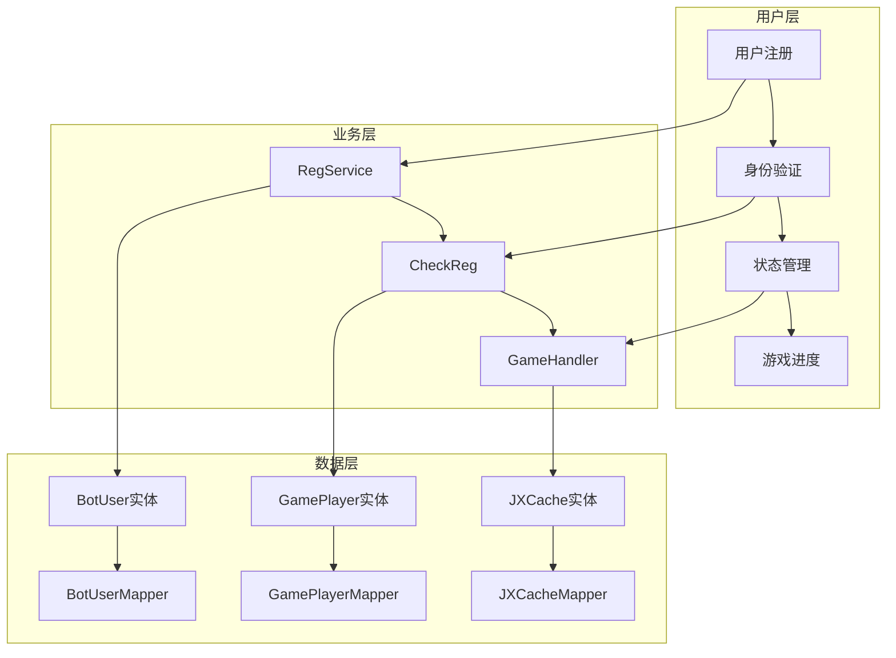
```mermaid
graph TB
subgraph "用户层"
A[用户注册] --> B[身份验证]
B --> C[状态管理]
C --> D[游戏进度]
end
subgraph "业务层"
E[RegService] --> F[CheckReg]
F --> G[GameHandler]
end
subgraph "数据层"
H[BotUser实体] --> I[BotUserMapper]
J[GamePlayer实体] --> K[GamePlayerMapper]
L[JXCache实体] --> M[JXCacheMapper]
end
A --> E
B --> F
C --> G
E --> H
F --> J
G --> L
```

**图表来源**
- [RegServiceImpl.java](file://Base/src/main/java/com/bot/base/service/impl/RegServiceImpl.java#L42-L110)
- [CheckRegServiceImpl.java](file://Game/src/main/java/com/bot/game/service/impl/CheckRegServiceImpl.java#L33-L67)
- [GameHandlerServiceImpl.java](file://Game/src/main/java/com/bot/game/service/impl/GameHandlerServiceImpl.java#L95-L132)

## 核心实体设计

### BotUser实体设计

BotUser实体是系统的核心用户实体，负责管理用户的注册状态、权限类型和有效期等关键信息。

#### 实体结构分析

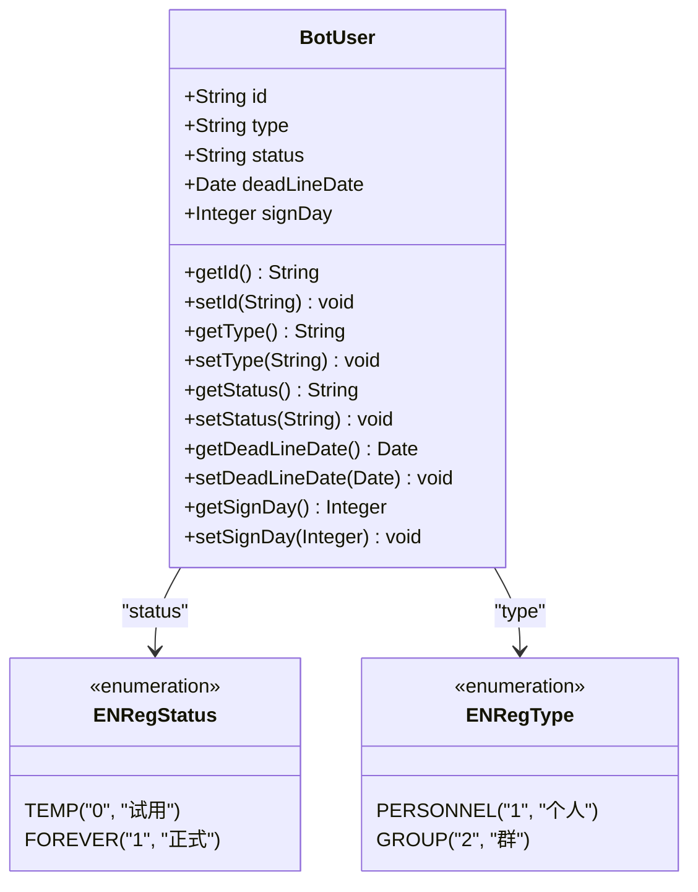
```mermaid
classDiagram
class BotUser {
+String id
+String type
+String status
+Date deadLineDate
+Integer signDay
+getId() String
+setId(String) void
+getType() String
+setType(String) void
+getStatus() String
+setStatus(String) void
+getDeadLineDate() Date
+setDeadLineDate(Date) void
+getSignDay() Integer
+setSignDay(Integer) void
}
class ENRegStatus {
<<enumeration>>
TEMP("0", "试用")
FOREVER("1", "正式")
}
class ENRegType {
<<enumeration>>
PERSONNEL("1", "个人")
GROUP("2", "群")
}
BotUser --> ENRegStatus : "status"
BotUser --> ENRegType : "type"
```

**图表来源**
- [BotUser.java](file://Game/src/main/java/com/bot/game/dao/entity/BotUser.java#L6-L214)
- [ENRegStatus.java](file://Common/src/main/java/com/bot/common/enums/ENRegStatus.java#L9-L17)
- [ENRegType.java](file://Common/src/main/java/com/bot/common/enums/ENRegType.java#L9-L18)

#### 字段业务含义详解

| 字段名 | 数据类型 | 业务含义 | 存储要求 |
|--------|----------|----------|----------|
| id | String | 用户唯一标识符，通常为QQ号或群号 | 主键，不能为空 |
| type | String | 用户类型：个人用户或群组用户 | 枚举值，CHAR(1) |
| status | String | 用户状态：试用或正式 | 枚举值，CHAR(1) |
| deadLineDate | Date | 用户服务到期时间 | TIMESTAMP类型 |
| signDay | Integer | 连续签到天数 | INTEGER类型 |

**节来源**
- [BotUser.java](file://Game/src/main/java/com/bot/game/dao/entity/BotUser.java#L13-L47)
- [ENRegStatus.java](file://Common/src/main/java/com/bot/common/enums/ENRegStatus.java#L10-L11)
- [ENRegType.java](file://Common/src/main/java/com/bot/common/enums/ENRegType.java#L10-L11)

### GamePlayer实体设计

GamePlayer实体专注于游戏内的玩家信息管理，包含角色属性、游戏进度和状态信息。

#### 实体结构分析

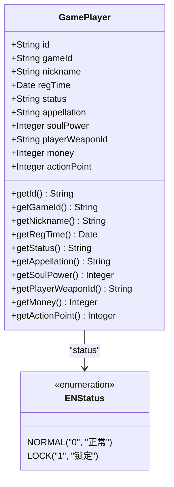
```mermaid
classDiagram
class GamePlayer {
+String id
+String gameId
+String nickname
+Date regTime
+String status
+String appellation
+Integer soulPower
+String playerWeaponId
+Integer money
+Integer actionPoint
+getId() String
+getGameId() String
+getNickname() String
+getRegTime() Date
+getStatus() String
+getAppellation() String
+getSoulPower() Integer
+getPlayerWeaponId() String
+getMoney() Integer
+getActionPoint() Integer
}
class ENStatus {
<<enumeration>>
NORMAL("0", "正常")
LOCK("1", "锁定")
}
GamePlayer --> ENStatus : "status"
```

**图表来源**
- [GamePlayer.java](file://Game/src/main/java/com/bot/game/dao/entity/GamePlayer.java#L12-L34)

#### 游戏属性字段详解

| 字段名 | 数据类型 | 默认值 | 业务含义 |
|--------|----------|--------|----------|
| soulPower | Integer | 1 | 战灵力，角色核心属性 |
| money | Integer | 0 | 灵石数量，游戏货币 |
| actionPoint | Integer | 100 | 体力值，行动点数 |
| regTime | Date | 当前时间 | 注册时间戳 |
| appellation | String | null | 称号系统 |

**节来源**
- [GamePlayer.java](file://Game/src/main/java/com/bot/game/dao/entity/GamePlayer.java#L13-L33)
- [CheckRegServiceImpl.java](file://Game/src/main/java/com/bot/game/service/impl/CheckRegServiceImpl.java#L50-L57)

## 数据持久化机制

### MyBatis映射文件设计

系统采用MyBatis作为ORM框架，通过XML配置文件定义数据库映射关系。

#### BotUser映射配置

BotUser实体的MyBatis映射文件提供了完整的CRUD操作支持：

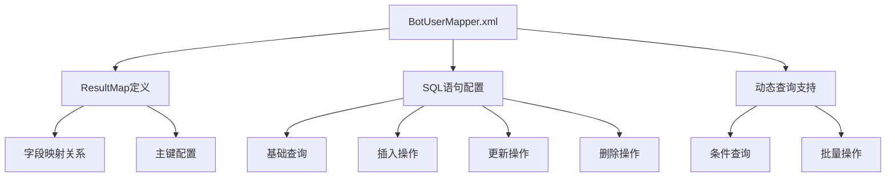
```mermaid
flowchart TD
A[BotUserMapper.xml] --> B[ResultMap定义]
A --> C[SQL语句配置]
A --> D[动态查询支持]
B --> E[字段映射关系]
B --> F[主键配置]
C --> G[基础查询]
C --> H[插入操作]
C --> I[更新操作]
C --> J[删除操作]
D --> K[条件查询]
D --> L[批量操作]
```

**图表来源**
- [BotUserMapper.xml](file://Game/src/main/resources/mapper/BotUserMapper.xml#L4-L14)

#### GamePlayer映射配置

GamePlayer实体映射文件支持更丰富的查询功能：

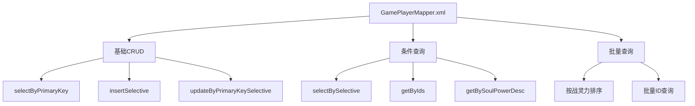
```mermaid
flowchart TD
A[GamePlayerMapper.xml] --> B[基础CRUD]
A --> C[条件查询]
A --> D[批量查询]
B --> E[selectByPrimaryKey]
B --> F[insertSelective]
B --> G[updateByPrimaryKeySelective]
C --> H[selectBySelective]
C --> I[getByIds]
C --> J[getBySoulPowerDesc]
D --> K[按战灵力排序]
D --> L[批量ID查询]
```

**图表来源**
- [GamePlayerMapper.xml](file://Game/src/main/resources/mapper/GamePlayerMapper.xml#L19-L195)

**节来源**
- [BotUserMapper.xml](file://Game/src/main/resources/mapper/BotUserMapper.xml#L1-L271)
- [GamePlayerMapper.xml](file://Game/src/main/resources/mapper/GamePlayerMapper.xml#L1-L195)

### 数据库表设计原则

系统遵循以下数据库设计原则：

1. **主键设计**：使用UUID作为主键，确保全局唯一性
2. **索引优化**：在常用查询字段上建立索引
3. **字段约束**：严格的数据类型和约束定义
4. **软删除**：通过状态字段实现逻辑删除

## 用户注册与认证流程

### 注册流程架构

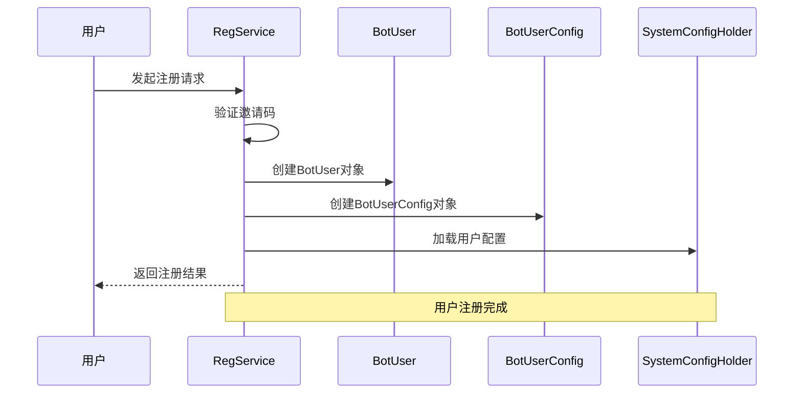
```mermaid
sequenceDiagram
participant U as 用户
participant RS as RegService
participant BU as BotUser
participant BC as BotUserConfig
participant SCH as SystemConfigHolder
U->>RS : 发起注册请求
RS->>RS : 验证邀请码
RS->>BU : 创建BotUser对象
RS->>BC : 创建BotUserConfig对象
RS->>SCH : 加载用户配置
RS-->>U : 返回注册结果
Note over RS,SCH : 用户注册完成
```

**图表来源**
- [RegServiceImpl.java](file://Base/src/main/java/com/bot/base/service/impl/RegServiceImpl.java#L42-L110)

### 认证机制设计

系统实现了多层次的认证机制：

#### 1. 试用注册流程

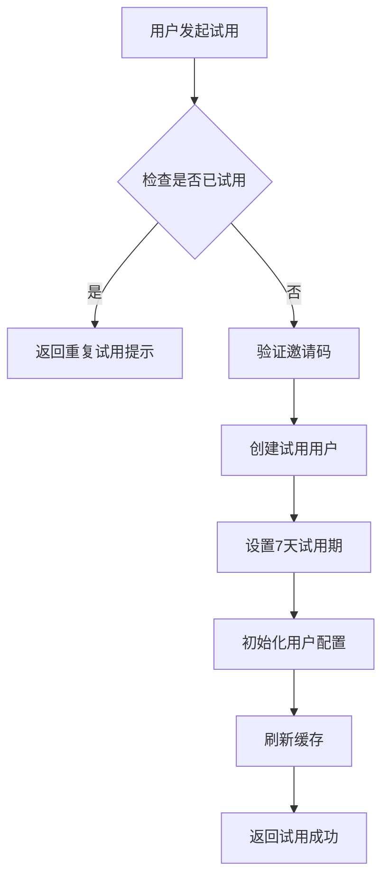
```mermaid
flowchart TD
A[用户发起试用] --> B{检查是否已试用}
B --> |是| C[返回重复试用提示]
B --> |否| D[验证邀请码]
D --> E[创建试用用户]
E --> F[设置7天试用期]
F --> G[初始化用户配置]
G --> H[刷新缓存]
H --> I[返回试用成功]
```

**图表来源**
- [RegServiceImpl.java](file://Base/src/main/java/com/bot/base/service/impl/RegServiceImpl.java#L42-L62)

#### 2. 正式注册流程

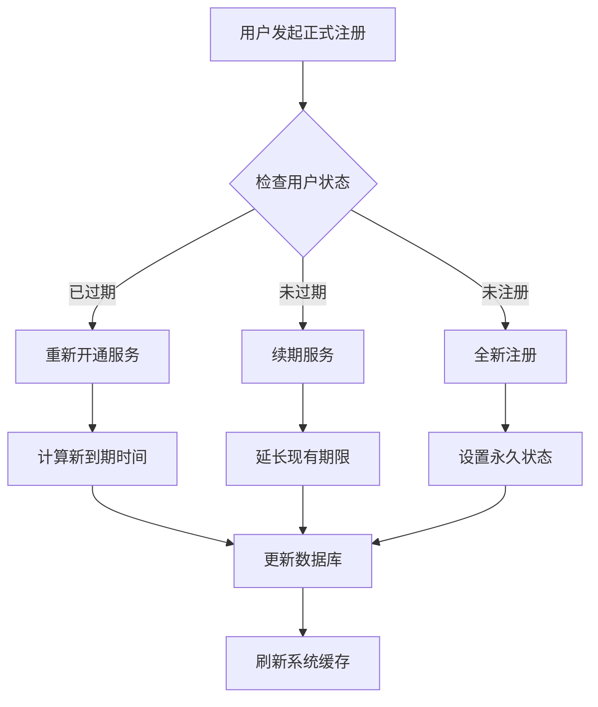
```mermaid
flowchart TD
A[用户发起正式注册] --> B{检查用户状态}
B --> |已过期| C[重新开通服务]
B --> |未过期| D[续期服务]
B --> |未注册| E[全新注册]
C --> F[计算新到期时间]
D --> G[延长现有期限]
E --> H[设置永久状态]
F --> I[更新数据库]
G --> I
H --> I
I --> J[刷新系统缓存]
```

**图表来源**
- [RegServiceImpl.java](file://Base/src/main/java/com/bot/base/service/impl/RegServiceImpl.java#L66-L110)

**节来源**
- [RegServiceImpl.java](file://Base/src/main/java/com/bot/base/service/impl/RegServiceImpl.java#L42-L110)

### 登录验证机制

系统通过GameHandler实现智能的登录验证：

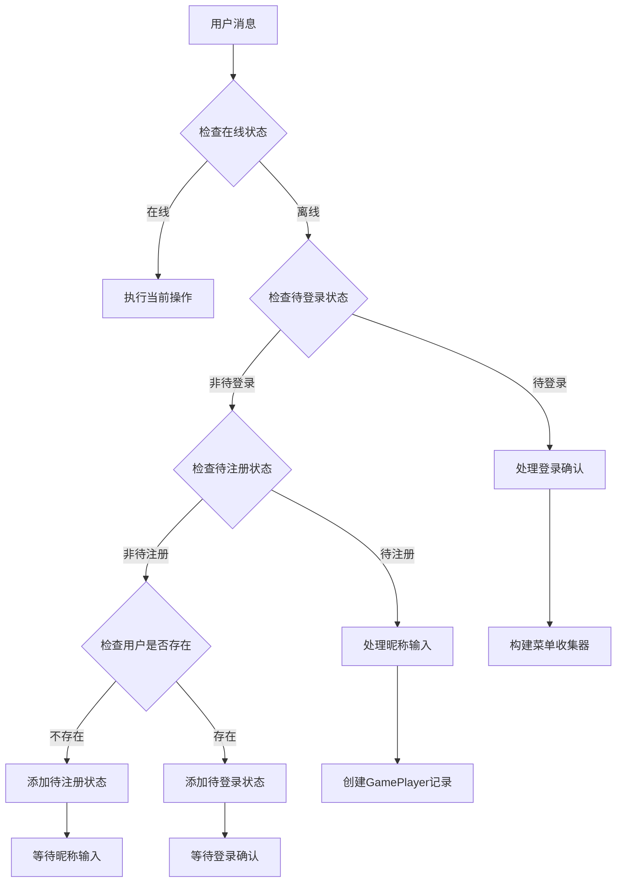
```mermaid
flowchart TD
A[用户消息] --> B{检查在线状态}
B --> |在线| C[执行当前操作]
B --> |离线| D{检查待登录状态}
D --> |待登录| E[处理登录确认]
D --> |非待登录| F{检查待注册状态}
F --> |待注册| G[处理昵称输入]
F --> |非待注册| H{检查用户是否存在}
H --> |不存在| I[添加待注册状态]
H --> |存在| J[添加待登录状态]
E --> K[构建菜单收集器]
G --> L[创建GamePlayer记录]
I --> M[等待昵称输入]
J --> N[等待登录确认]
```

**图表来源**
- [GameHandlerServiceImpl.java](file://Game/src/main/java/com/bot/game/service/impl/GameHandlerServiceImpl.java#L95-L132)

**节来源**
- [GameHandlerServiceImpl.java](file://Game/src/main/java/com/bot/game/service/impl/GameHandlerServiceImpl.java#L95-L132)

## 状态管理与权限控制

### 用户状态体系

系统定义了完整的用户状态管理体系：

#### BotUser状态枚举

| 状态值 | 状态名称 | 权限级别 | 有效期 | 业务场景 |
|--------|----------|----------|--------|----------|
| 0 | 试用 | 基础功能 | 7天 | 新用户体验 |
| 1 | 正式 | 完整功能 | 永久/到期 | 正式用户 |

#### GamePlayer状态体系

| 状态值 | 状态名称 | 影响范围 | 操作限制 |
|--------|----------|----------|----------|
| 0 | 正常 | 全部功能 | 无限制 |
| 1 | 锁定 | 游戏功能 | 禁止游戏操作 |

**节来源**
- [ENRegStatus.java](file://Common/src/main/java/com/bot/common/enums/ENRegStatus.java#L10-L11)
- [CheckRegServiceImpl.java](file://Game/src/main/java/com/bot/game/service/impl/CheckRegServiceImpl.java#L33-L35)

### 权限控制机制

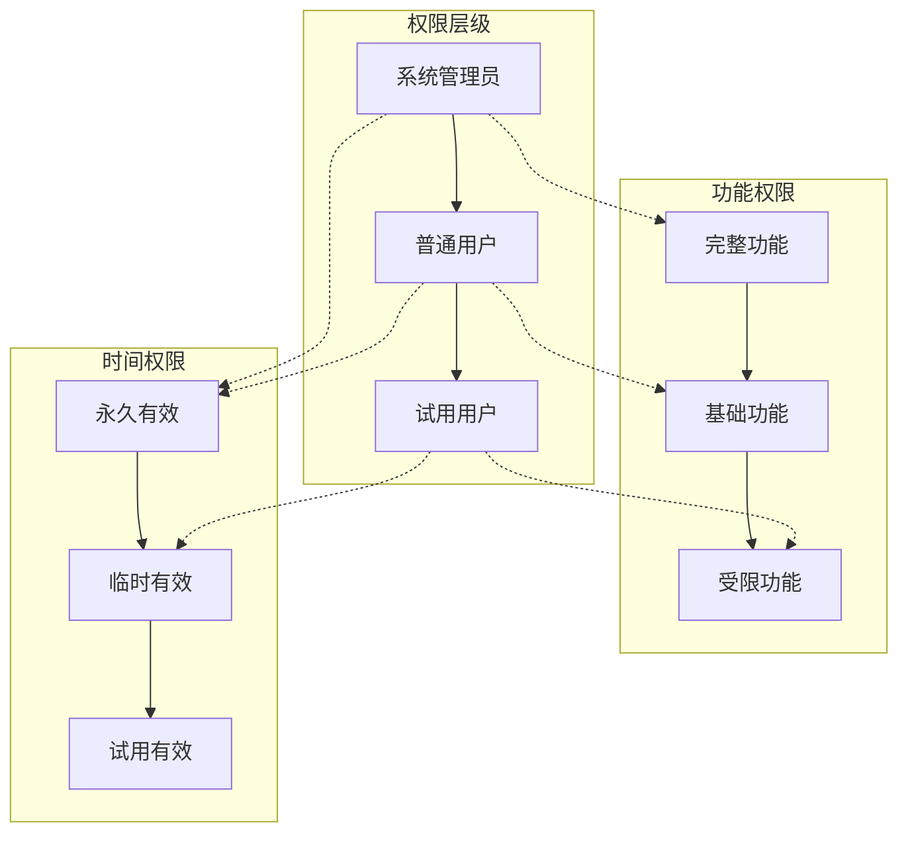
```mermaid
graph TB
subgraph "权限层级"
A[系统管理员] --> B[普通用户]
B --> C[试用用户]
end
subgraph "功能权限"
D[完整功能] --> E[基础功能]
E --> F[受限功能]
end
subgraph "时间权限"
G[永久有效] --> H[临时有效]
H --> I[试用有效]
end
A -.-> D
B -.-> E
C -.-> F
A -.-> G
B -.-> G
C -.-> H
```

**图表来源**
- [SystemConfigHolder.java](file://Game/src/main/java/com/bot/game/service/SystemConfigHolder.java#L50-L82)

**节来源**
- [SystemConfigHolder.java](file://Game/src/main/java/com/bot/game/service/SystemConfigHolder.java#L50-L82)

## 缓存策略与性能优化

### 缓存架构设计

系统采用多层缓存架构提升性能：

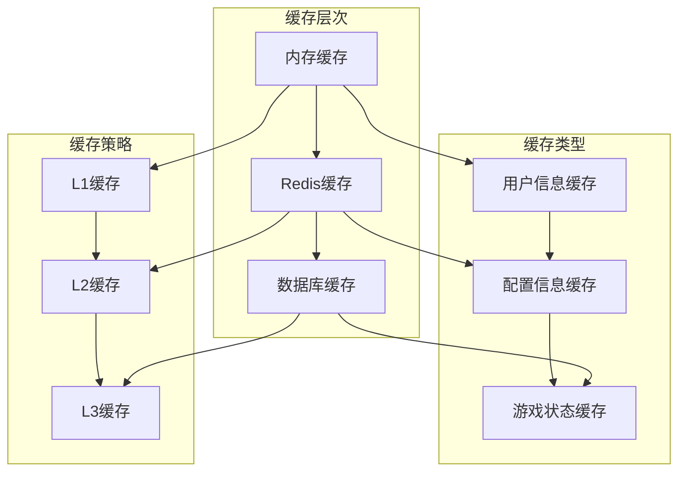
```mermaid
graph TB
subgraph "缓存层次"
A[内存缓存] --> B[Redis缓存]
B --> C[数据库缓存]
end
subgraph "缓存类型"
D[用户信息缓存] --> E[配置信息缓存]
E --> F[游戏状态缓存]
end
subgraph "缓存策略"
G[L1缓存] --> H[L2缓存]
H --> I[L3缓存]
end
A --> D
B --> E
C --> F
A --> G
B --> H
C --> I
```

**图表来源**
- [SystemConfigHolder.java](file://Game/src/main/java/com/bot/game/service/SystemConfigHolder.java#L50-L82)

### JXCache缓存机制

系统实现了专门的缓存实体JXCache用于存储各种类型的缓存数据：

#### 缓存类型枚举

| 缓存类型 | 值 | 用途 | 生命周期 |
|----------|-----|------|----------|
| SHOW | show | QQ秀数据 | 持久化 |
| MONEY | money | 金价信息 | 定期更新 |
| NEWS | news | 资讯内容 | 临时缓存 |
| NOTICE | notice | 公告信息 | 持久化 |
| BATTLE | battle | 战绩数据 | 持久化 |
| TEAM_CD | teamCd | 副本冷却 | 定期清理 |

**节来源**
- [JXCache.java](file://Game/src/main/java/com/bot/game/dao/entity/JXCache.java#L1-L238)
- [ENJXCacheType.java](file://Common/src/main/java/com/bot/common/enums/ENJXCacheType.java#L9-L17)

### 缓存加载机制

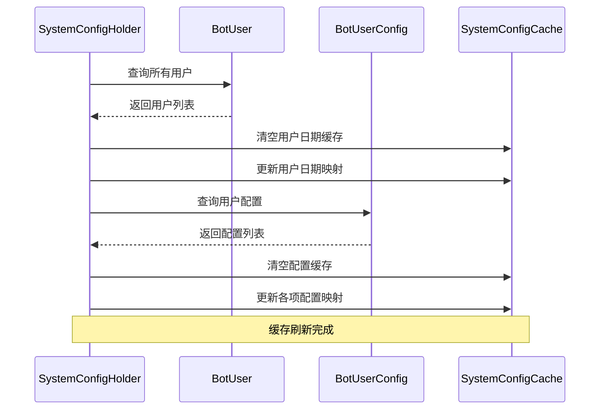
```mermaid
sequenceDiagram
participant SCH as SystemConfigHolder
participant BU as BotUser
participant BUC as BotUserConfig
participant SC as SystemConfigCache
SCH->>BU : 查询所有用户
BU-->>SCH : 返回用户列表
SCH->>SC : 清空用户日期缓存
SCH->>SC : 更新用户日期映射
SCH->>BUC : 查询用户配置
BUC-->>SCH : 返回配置列表
SCH->>SC : 清空配置缓存
SCH->>SC : 更新各项配置映射
Note over SCH,SC : 缓存刷新完成
```

**图表来源**
- [SystemConfigHolder.java](file://Game/src/main/java/com/bot/game/service/SystemConfigHolder.java#L50-L82)

**节来源**
- [SystemConfigHolder.java](file://Game/src/main/java/com/bot/game/service/SystemConfigHolder.java#L50-L82)

## 高频读写场景优化

### 用户状态查询优化

对于频繁的状态查询，系统采用了多种优化策略：

#### 1. 内存缓存优化

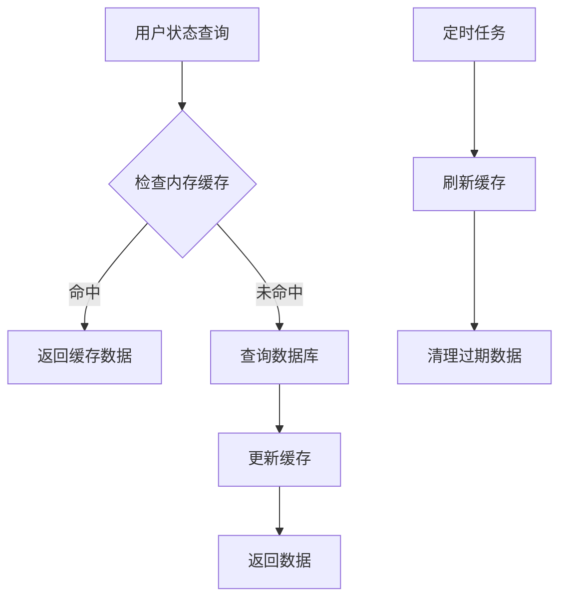
```mermaid
flowchart TD
A[用户状态查询] --> B{检查内存缓存}
B --> |命中| C[返回缓存数据]
B --> |未命中| D[查询数据库]
D --> E[更新缓存]
E --> F[返回数据]
G[定时任务] --> H[刷新缓存]
H --> I[清理过期数据]
```

#### 2. 批量查询优化

系统支持批量用户信息查询，减少数据库交互次数：

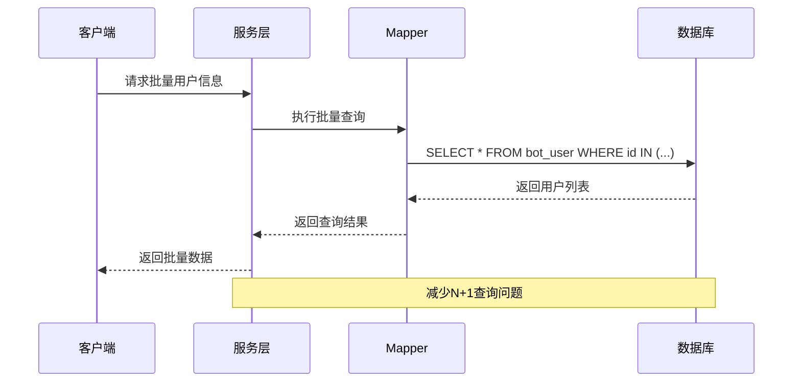
```mermaid
sequenceDiagram
participant C as 客户端
participant S as 服务层
participant M as Mapper
participant DB as 数据库
C->>S : 请求批量用户信息
S->>M : 执行批量查询
M->>DB : SELECT * FROM bot_user WHERE id IN (...)
DB-->>M : 返回用户列表
M-->>S : 返回查询结果
S-->>C : 返回批量数据
Note over S,DB : 减少N+1查询问题
```

### 游戏数据读取优化

对于GamePlayer数据的高频读取，系统实现了以下优化：

#### 1. 分页查询

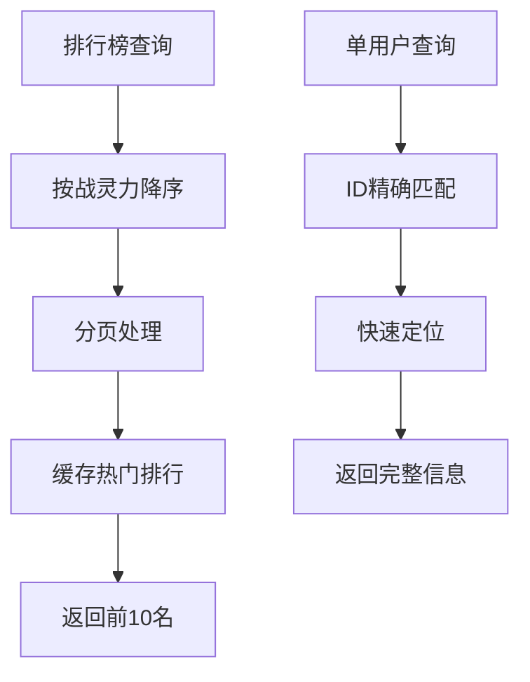
```mermaid
flowchart TD
A[排行榜查询] --> B[按战灵力降序]
B --> C[分页处理]
C --> D[缓存热门排行]
D --> E[返回前10名]
F[单用户查询] --> G[ID精确匹配]
G --> H[快速定位]
H --> I[返回完整信息]
```

#### 2. 条件查询优化

系统支持灵活的条件查询，同时保持高性能：

| 查询类型 | 优化策略 | 性能特点 |
|----------|----------|----------|
| 精确查询 | 主键索引 | O(log n) |
| 范围查询 | 范围索引 | O(log n + m) |
| 排序查询 | 排序索引 | O(n log n) |
| 组合查询 | 复合索引 | O(log n) |

**节来源**
- [GamePlayerMapper.xml](file://Game/src/main/resources/mapper/GamePlayerMapper.xml#L184-L195)

### 写入性能优化

#### 1. 批量插入优化

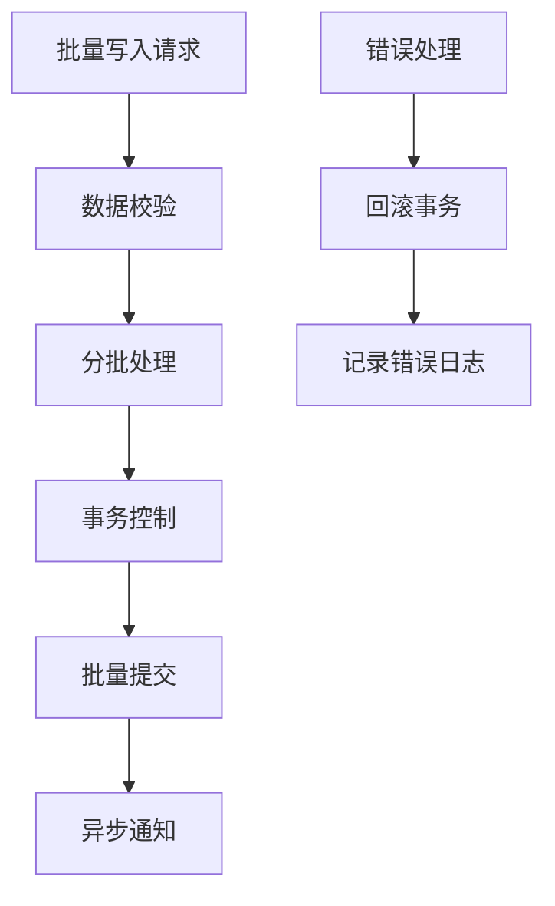
```mermaid
flowchart TD
A[批量写入请求] --> B[数据校验]
B --> C[分批处理]
C --> D[事务控制]
D --> E[批量提交]
E --> F[异步通知]
G[错误处理] --> H[回滚事务]
H --> I[记录错误日志]
```

#### 2. 异步处理机制

对于非关键路径的操作，系统采用异步处理提升响应速度：

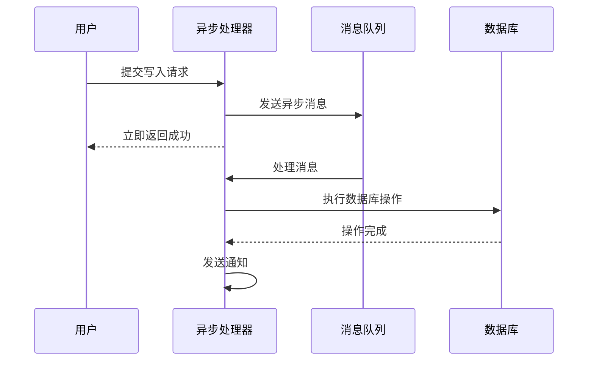
```mermaid
sequenceDiagram
participant U as 用户
participant A as 异步处理器
participant Q as 消息队列
participant D as 数据库
U->>A : 提交写入请求
A->>Q : 发送异步消息
A-->>U : 立即返回成功
Q->>A : 处理消息
A->>D : 执行数据库操作
D-->>A : 操作完成
A->>A : 发送通知
```

## 最佳实践与故障排除

### 开发最佳实践

#### 1. 实体设计原则

- **单一职责**：每个实体专注特定业务领域
- **数据完整性**：严格的字段约束和验证
- **扩展性考虑**：预留扩展字段和接口

#### 2. 数据访问优化

- **懒加载**：按需加载关联数据
- **连接池**：合理配置数据库连接池
- **事务管理**：细粒度事务控制

#### 3. 缓存策略

- **缓存穿透防护**：对空值也进行缓存
- **缓存雪崩预防**：设置随机过期时间
- **缓存一致性**：及时更新相关缓存

### 常见问题排除

#### 1. 注册失败问题

**问题现象**：用户注册后无法登录

**排查步骤**：
1. 检查BotUser记录是否正确创建
2. 验证状态字段是否正确设置
3. 确认缓存是否同步更新

**解决方案**：
```java
// 检查用户状态
public boolean checkUserStatus(String userId) {
    BotUser user = botUserMapper.selectByPrimaryKey(userId);
    return user != null && ENRegStatus.FOREVER.getValue().equals(user.getStatus());
}
```

#### 2. 缓存同步问题

**问题现象**：用户状态更新后立即失效

**排查步骤**：
1. 检查SystemConfigHolder的loadUsers方法
2. 验证缓存刷新时机
3. 确认并发访问控制

**解决方案**：
```java
// 确保缓存更新原子性
@Transactional
public void updateUserStatus(String userId, String newStatus) {
    BotUser user = new BotUser();
    user.setId(userId);
    user.setStatus(newStatus);
    botUserMapper.updateByPrimaryKeySelective(user);
    systemConfigHolder.loadUsers(); // 刷新缓存
}
```

#### 3. 性能瓶颈识别

**监控指标**：
- 数据库查询响应时间
- 缓存命中率
- 并发用户数
- 内存使用情况

**优化建议**：
1. 定期分析慢查询日志
2. 监控缓存性能指标
3. 优化数据库索引
4. 调整连接池参数

### 故障恢复机制

#### 1. 数据备份策略

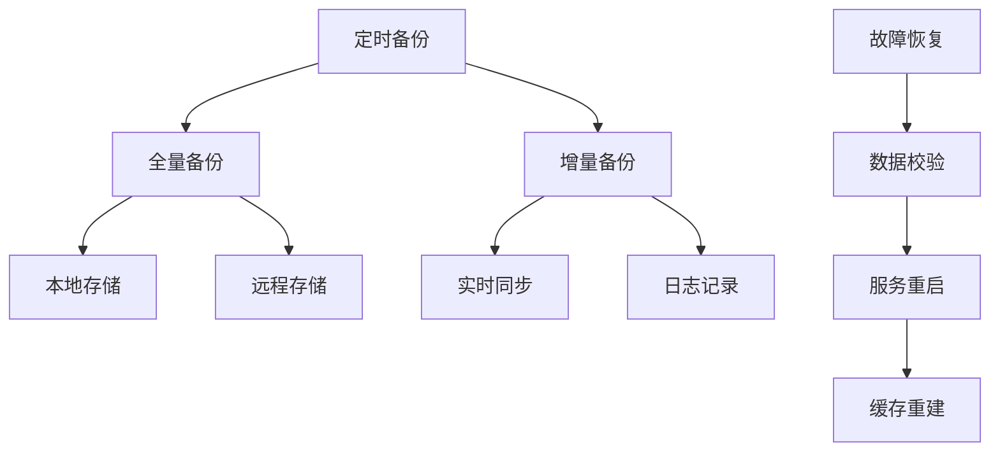
```mermaid
flowchart TD
A[定时备份] --> B[全量备份]
A --> C[增量备份]
B --> D[本地存储]
B --> E[远程存储]
C --> F[实时同步]
C --> G[日志记录]
H[故障恢复] --> I[数据校验]
I --> J[服务重启]
J --> K[缓存重建]
```

#### 2. 服务降级方案

当系统负载过高时，实施以下降级策略：

| 服务级别 | 降级措施 | 影响范围 |
|----------|----------|----------|
| 核心服务 | 基础功能保留 | 全部 |
| 次要服务 | 功能禁用 | 特定模块 |
| 辅助服务 | 服务暂停 | 个别功能 |

通过以上全面的玩家基础信息管理系统设计，系统能够高效地处理大量用户数据，提供稳定可靠的用户管理服务，同时具备良好的扩展性和维护性。