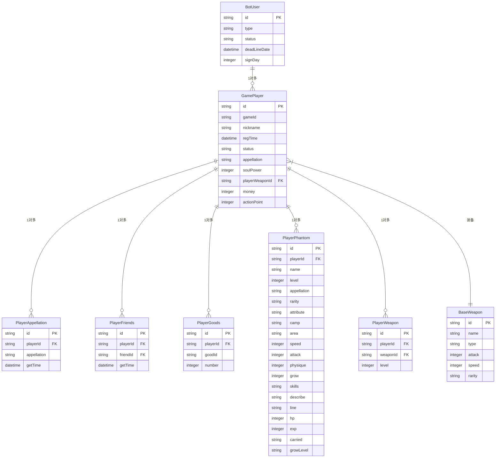

# 玩家数据模型

<cite>
**本文档引用文件**  
- [BotUser.java](file://Game\src\main\java\com\bot\game\dao\entity\BotUser.java)
- [GamePlayer.java](file://Game\src\main\java\com\bot\game\dao\entity\GamePlayer.java)
- [BotUserMapper.xml](file://Game\src\main\resources\mapper\BotUserMapper.xml)
- [GamePlayerMapper.xml](file://Game\src\main\resources\mapper\GamePlayerMapper.xml)
- [PlayerAppellation.java](file://Game\src\main\java\com\bot\game\dao\entity\PlayerAppellation.java)
- [PlayerFriends.java](file://Game\src\main\java\com\bot\game\dao\entity\PlayerFriends.java)
- [PlayerGoods.java](file://Game\src\main\java\com\bot\game\dao\entity\PlayerGoods.java)
- [PlayerPhantom.java](file://Game\src\main\java\com\bot\game\dao\entity\PlayerPhantom.java)
- [PlayerWeapon.java](file://Game\src\main\java\com\bot\game\dao\entity\PlayerWeapon.java)
- [PlayerAppellationMapper.xml](file://Game\src\main\resources\mapper\PlayerAppellationMapper.xml)
- [PlayerFriendsMapper.xml](file://Game\src\main\resources\mapper\PlayerFriendsMapper.xml)
- [PlayerGoodsMapper.xml](file://Game\src\main\resources\mapper\PlayerGoodsMapper.xml)
- [PlayerPhantomMapper.xml](file://Game\src\main\resources\mapper\PlayerPhantomMapper.xml)
- [PlayerWeaponMapper.xml](file://Game\src\main\resources\mapper\PlayerWeaponMapper.xml)
- [PlayerInfoMenuPrinter.java](file://Game\src\main\java\com\bot\game\chain\menu\PlayerInfoMenuPrinter.java)
</cite>

## 目录
1. [引言](#引言)
2. [核心实体设计](#核心实体设计)
3. [领域模型关系](#领域模型关系)
4. [MyBatis关联查询实现](#mybatis关联查询实现)
5. [ER图与字段说明](#er图与字段说明)
6. [数据访问流程示例](#数据访问流程示例)
7. [缓存策略与性能优化](#缓存策略与性能优化)
8. [结论](#结论)

## 引言
本项目中的玩家数据模型设计旨在支持一个复杂的社交游戏系统，其中包含玩家基础信息、称号系统、好友关系、背包物品、幻兽与武器装备等多个子系统。通过分析BotUser和GamePlayer实体的设计目的与关系映射，我们可以理解整个系统的数据架构。BotUser作为系统级用户实体，主要负责管理用户的状态和权限；而GamePlayer作为游戏内角色实体，则承载了玩家在游戏世界中的所有属性和行为。这两个实体通过ID进行关联，实现了系统用户与游戏角色的分离与统一。

**本节不涉及具体源码分析，因此无源码引用**

## 核心实体设计

### BotUser实体
BotUser实体是系统的基础用户实体，主要负责管理用户的系统级属性。该实体包含id、type、status和deadLineDate等字段，分别表示用户ID、用户类型、用户状态和过期日期。其中，signDay字段用于记录用户的签到天数，是用户活跃度的重要指标。

### GamePlayer实体
GamePlayer实体是游戏内的玩家角色实体，包含了玩家在游戏世界中的所有属性。该实体设计了id、gameId、nickname、regTime、status、appellation、soulPower、playerWeaponId、money和actionPoint等字段。其中，soulPower代表玩家的灵魂力量值，是衡量玩家实力的核心指标；playerWeaponId用于关联玩家当前装备的武器；money和actionPoint分别是玩家的金钱和行动点数，构成了游戏经济系统的基础。

**本节分析的源码**
- [BotUser.java](file://Game\src\main\java\com\bot\game\dao\entity\BotUser.java#L1-L214)
- [GamePlayer.java](file://Game\src\main\java\com\bot\game\dao\entity\GamePlayer.java#L1-L34)

## 领域模型关系

### 玩家基础信息模型
玩家基础信息模型以GamePlayer实体为核心，包含了玩家的昵称、注册时间、状态等基本信息。这些信息构成了玩家在游戏世界中的身份标识。

### 称号系统模型
称号系统通过PlayerAppellation实体实现，每个玩家可以拥有多个称号。该实体包含id、playerId、appellation和getTime字段，其中playerId关联到GamePlayer的id，实现了玩家与称号的一对多关系。

### 好友关系模型
好友关系通过PlayerFriends实体实现，采用双向关联的方式存储好友关系。该实体包含id、playerId、friendId和getTime字段，其中playerId和friendId都关联到GamePlayer的id，记录了好友关系的建立时间。

### 背包物品模型
背包物品通过PlayerGoods实体实现，用于管理玩家拥有的各种物品。该实体包含id、playerId、goodId和number字段，其中number表示物品数量，支持堆叠物品的管理。

### 幻兽与武器装备模型
幻兽通过PlayerPhantom实体实现，包含幻兽的各项属性如等级、稀有度、属性、阵营等。武器装备通过PlayerWeapon实体实现，包含playerId和weaponId的关联，以及武器的等级信息。

**图示来源**
- [BotUser.java](file://Game\src\main\java\com\bot\game\dao\entity\BotUser.java#L1-L214)
- [GamePlayer.java](file://Game\src\main\java\com\bot\game\dao\entity\GamePlayer.java#L1-L34)
- [PlayerAppellation.java](file://Game\src\main\java\com\bot\game\dao\entity\PlayerAppellation.java#L1-L22)
- [PlayerFriends.java](file://Game\src\main\java\com\bot\game\dao\entity\PlayerFriends.java#L1-L22)
- [PlayerGoods.java](file://Game\src\main\java\com\bot\game\dao\entity\PlayerGoods.java#L1-L21)
- [PlayerPhantom.java](file://Game\src\main\java\com\bot\game\dao\entity\PlayerPhantom.java#L1-L113)
- [PlayerWeapon.java](file://Game\src\main\java\com\bot\game\dao\entity\PlayerWeapon.java#L1-L21)

**本节分析的源码**
- [PlayerAppellation.java](file://Game\src\main\java\com\bot\game\dao\entity\PlayerAppellation.java#L1-L22)
- [PlayerFriends.java](file://Game\src\main\java\com\bot\game\dao\entity\PlayerFriends.java#L1-L22)
- [PlayerGoods.java](file://Game\src\main\java\com\bot\game\dao\entity\PlayerGoods.java#L1-L21)
- [PlayerPhantom.java](file://Game\src\main\java\com\bot\game\dao\entity\PlayerPhantom.java#L1-L113)
- [PlayerWeapon.java](file://Game\src\main\java\com\bot\game\dao\entity\PlayerWeapon.java#L1-L21)

## MyBatis关联查询实现

### 一对一关联查询
在PlayerInfoMenuPrinter中，通过GamePlayer的playerWeaponId字段与PlayerWeapon的id进行关联，再通过PlayerWeapon的weaponId与BaseWeapon的id进行二次关联，实现了玩家-武器-基础武器的一对一关联查询。这种链式关联查询在MyBatis中通过多次select操作实现。

### 一对多关联查询
对于玩家的幻兽列表查询，通过PlayerPhantomMapper的selectAllCarried方法实现。该方法接收PlayerPhantom对象作为参数，其中playerId字段用于筛选特定玩家的所有幻兽。查询结果按等级降序排列，确保高等级幻兽优先显示。

### 动态SQL实现
MyBatis的动态SQL功能在insertSelective和updateByPrimaryKeySelective等方法中得到充分体现。通过<if>标签判断字段是否为空，仅插入或更新非空字段，提高了SQL执行的灵活性和效率。例如，在PlayerPhantomMapper.xml中，只有当字段不为空时才会包含在INSERT语句中。

**本节分析的源码**
- [BotUserMapper.xml](file://Game\src\main\resources\mapper\BotUserMapper.xml#L1-L271)
- [GamePlayerMapper.xml](file://Game\src\main\resources\mapper\GamePlayerMapper.xml#L1-L195)
- [PlayerAppellationMapper.xml](file://Game\src\main\resources\mapper\PlayerAppellationMapper.xml#L1-L95)
- [PlayerFriendsMapper.xml](file://Game\src\main\resources\mapper\PlayerFriendsMapper.xml#L1-L95)
- [PlayerGoodsMapper.xml](file://Game\src\main\resources\mapper\PlayerGoodsMapper.xml#L1-L91)
- [PlayerPhantomMapper.xml](file://Game\src\main\resources\mapper\PlayerPhantomMapper.xml#L1-L365)
- [PlayerInfoMenuPrinter.java](file://Game\src\main\java\com\bot\game\chain\menu\PlayerInfoMenuPrinter.java#L1-L63)

## ER图与字段说明

### 核心表关系ER图
如前所示的ER图清晰地展示了各实体之间的关系。BotUser与GamePlayer是一对多关系，一个系统用户可以创建多个游戏角色。GamePlayer与其他实体均为一对多关系，一个玩家可以拥有多个称号、好友、物品、幻兽和武器。

### 字段业务含义与约束
| 实体 | 字段 | 业务含义 | 约束条件 |
|------|------|----------|----------|
| BotUser | id | 用户唯一标识 | 主键，非空 |
| BotUser | type | 用户类型 | CHAR类型，表示用户权限等级 |
| BotUser | status | 用户状态 | CHAR类型，'0'正常，'1'禁用 |
| BotUser | deadLineDate | 过期日期 | TIMESTAMP类型，用于权限控制 |
| GamePlayer | id | 玩家唯一标识 | 主键，非空 |
| GamePlayer | gameId | 游戏ID | VARCHAR类型，用于区分不同游戏实例 |
| GamePlayer | nickname | 昵称 | VARCHAR类型，玩家的显示名称 |
| GamePlayer | soulPower | 灵魂力量 | INTEGER类型，核心实力指标 |
| GamePlayer | playerWeaponId | 当前武器ID | 外键，关联PlayerWeapon |
| PlayerAppellation | appellation | 称号名称 | VARCHAR类型，玩家获得的称号 |
| PlayerFriends | friendId | 好友ID | 外键，关联其他GamePlayer |
| PlayerGoods | goodId | 物品ID | VARCHAR类型，标识物品类型 |
| PlayerGoods | number | 物品数量 | INTEGER类型，支持堆叠 |
| PlayerPhantom | carried | 是否携带 | CHAR类型，'0'未携带，'1'携带 |
| PlayerWeapon | level | 武器等级 | INTEGER类型，影响武器属性 |

## 数据访问流程示例

### 用户注册流程
用户注册时，首先在BotUser表中创建记录，设置初始type和status。然后在GamePlayer表中创建对应的游戏角色，初始化nickname、soulPower、money等属性。同时，根据游戏规则可能在PlayerAppellation、PlayerPhantom等表中创建初始数据。

### 角色创建流程
角色创建主要涉及GamePlayer实体的插入操作。通过GamePlayerMapper的insert方法，将新创建的角色数据持久化到数据库。同时，根据配置可能需要初始化玩家的初始物品、幻兽等。

### 数据加载流程
玩家数据加载通常从GamePlayer开始，通过selectByPrimaryKey获取基础信息。然后根据需要，通过关联查询加载称号、好友、物品、幻兽等数据。例如，在PlayerInfoMenuPrinter中，通过多次查询组装玩家的完整信息用于显示。

**本节分析的源码**
- [PlayerInfoMenuPrinter.java](file://Game\src\main\java\com\bot\game\chain\menu\PlayerInfoMenuPrinter.java#L1-L63)

## 缓存策略与性能优化

### 高频读写场景分析
玩家信息的读取是系统中最频繁的操作之一，特别是在显示玩家信息、排行榜等场景。而玩家属性的更新（如金钱、行动点数变化）则是高频写操作。

### 缓存策略建议
1. **Redis缓存**：将GamePlayer的热点数据（如nickname、soulPower、money等）缓存在Redis中，设置合理的过期时间。
2. **本地缓存**：对于读取频率极高但更新不频繁的数据（如基础称号列表），可使用本地缓存（如Caffeine）。
3. **缓存预热**：在系统启动时预加载热门玩家数据到缓存中。
4. **缓存更新策略**：采用写穿透（Write-Through）策略，确保缓存与数据库的一致性。

### 性能优化建议
1. **数据库索引优化**：在GamePlayer的nickname、soulPower等常用查询字段上建立索引。
2. **批量操作**：对于好友列表、物品列表等一对多关系的查询，使用批量查询而非循环单条查询。
3. **连接池优化**：合理配置数据库连接池参数，避免连接耗尽。
4. **SQL优化**：避免N+1查询问题，使用JOIN或批量查询优化数据访问。

## 结论
通过对BotUser和GamePlayer实体及其相关子系统的分析，我们可以看到一个设计良好的玩家数据模型应该具备清晰的层次结构、合理的实体关系和高效的访问模式。BotUser作为系统用户实体与GamePlayer作为游戏角色实体的分离设计，实现了用户系统与游戏系统的解耦，提高了系统的可扩展性和维护性。各子系统通过外键关联到GamePlayer，形成了以玩家为核心的星型数据结构，便于数据的管理和查询。MyBatis的动态SQL和关联查询功能为复杂的数据访问需求提供了灵活的解决方案。针对高频读写场景的缓存策略和性能优化建议，可以显著提升系统的响应速度和用户体验。

**本节不涉及具体源码分析，因此无源码引用**