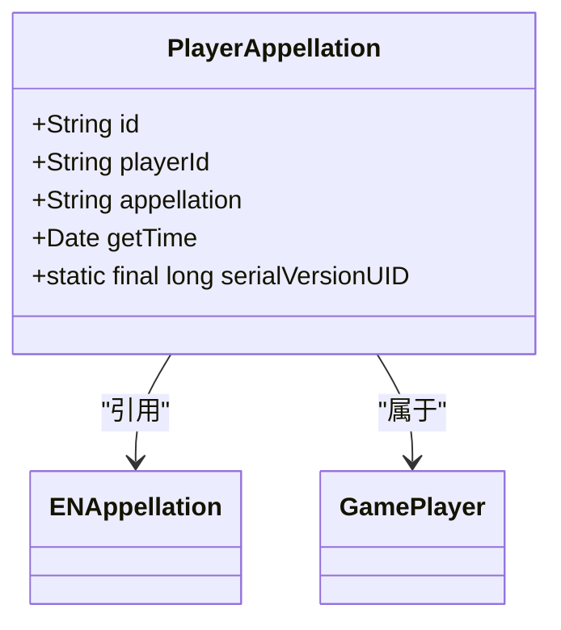
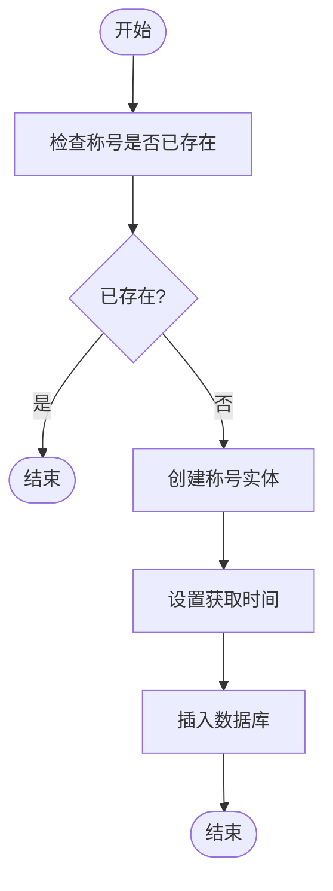
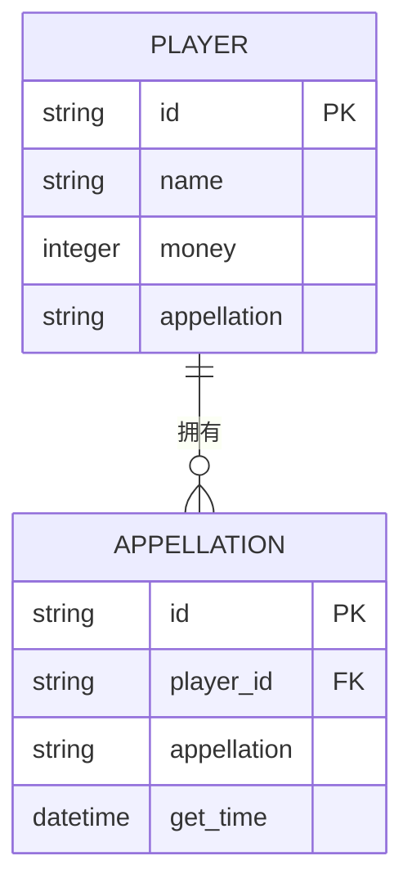
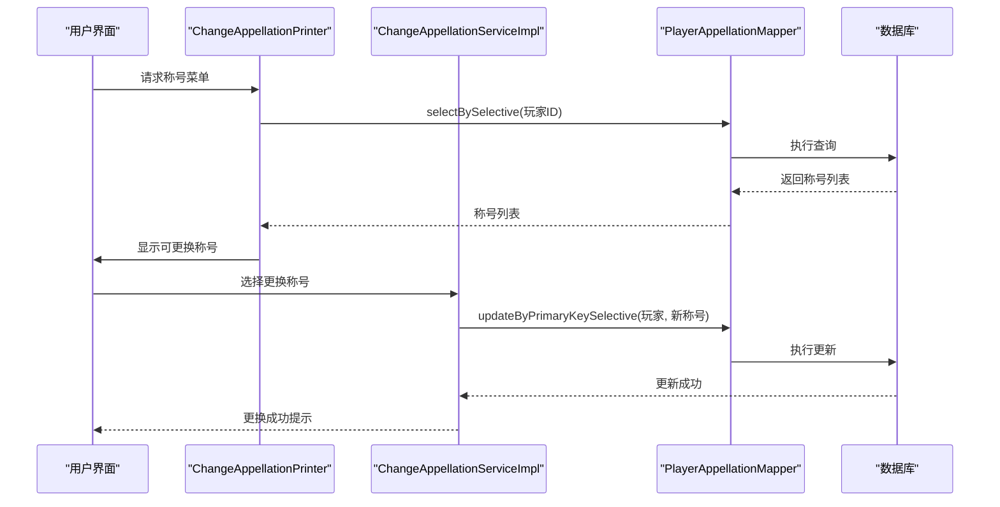
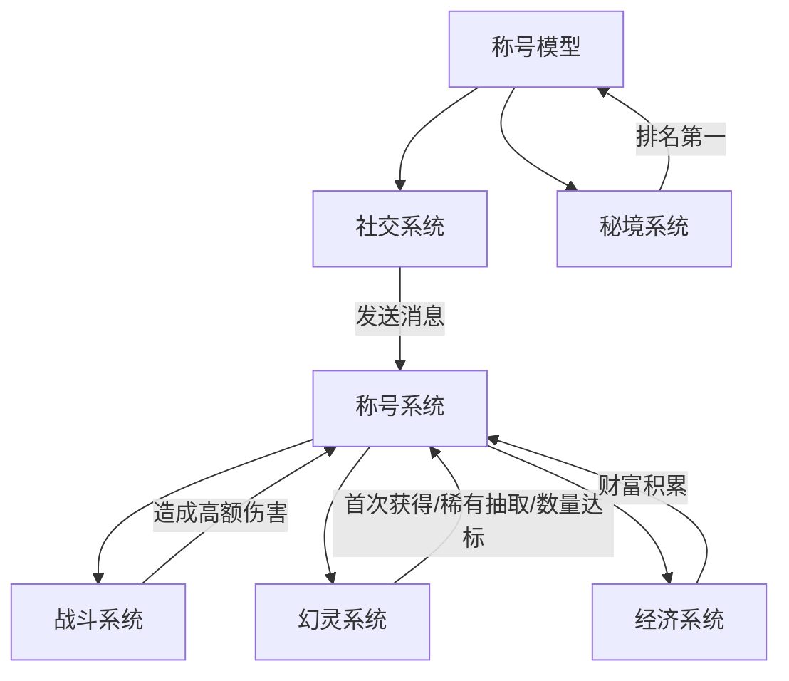

# 称号系统

<cite>
**本文档引用文件**  
- [PlayerAppellation.java](file://Game/src/main/java/com/bot/game/dao/entity/PlayerAppellation.java)
- [PlayerAppellationMapper.java](file://Game/src/main/java/com/bot/game/dao/mapper/PlayerAppellationMapper.java)
- [PlayerAppellationMapper.xml](file://Game/src/main/resources/mapper/PlayerAppellationMapper.xml)
- [ENAppellation.java](file://Game/src/main/java/com/bot/game/enums/ENAppellation.java)
- [CommonPlayer.java](file://Game/src/main/java/com/bot/game/service/impl/CommonPlayer.java)
- [ChangeAppellationPrinter.java](file://Game/src/main/java/com/bot/game/chain/menu/ChangeAppellationPrinter.java)
- [ChangeAppellationServiceImpl.java](file://Game/src/main/java/com/bot/game/service/impl/ChangeAppellationServiceImpl.java)
- [BattleServiceImpl.java](file://Game/src/main/java/com/bot/game/service/impl/BattleServiceImpl.java)
- [GetPhantomServiceImpl.java](file://Game/src/main/java/com/bot/game/service/impl/GetPhantomServiceImpl.java)
- [SendMessageServiceImpl.java](file://Game/src/main/java/com/bot/game/service/impl/message/SendMessageServiceImpl.java)
- [DungeonCommonHolder.java](file://Game/src/main/java/com/bot/game/service/DungeonCommonHolder.java)
- [GameConsts.java](file://Common/src/main/java/com/bot/common/constant/GameConsts.java)
</cite>

## 目录
1. [系统概述](#系统概述)
2. [核心实体设计](#核心实体设计)
3. [称号获取机制](#称号获取机制)
4. [有效期与属性加成](#有效期与属性加成)
5. [MyBatis映射与查询逻辑](#mybatis映射与查询逻辑)
6. [核心操作实现](#核心操作实现)
7. [子系统集成关系](#子系统集成关系)
8. [性能优化建议](#性能优化建议)

## 系统概述
称号系统是游戏中的荣誉与成就体系，通过记录玩家在游戏过程中的特殊行为和成就，授予相应的称号。该系统采用一对多的关联设计，一个玩家可以拥有多个称号。称号不仅具有展示功能，还作为成就系统的一部分，激励玩家完成特定目标。系统通过枚举定义所有可能的称号，并通过数据访问层实现持久化存储。

**Section sources**
- [PlayerAppellation.java](file://Game/src/main/java/com/bot/game/dao/entity/PlayerAppellation.java)
- [ENAppellation.java](file://Game/src/main/java/com/bot/game/enums/ENAppellation.java)

## 核心实体设计
称号系统的核心实体为PlayerAppellation，采用标准的ORM设计模式。该实体包含四个核心字段：唯一标识ID、玩家ID、称号名称和获取时间。实体实现了Serializable接口以支持序列化，使用Lombok的@Data注解自动生成getter、setter、toString等方法，提高了代码的简洁性。

**Diagram sources**
- [PlayerAppellation.java](file://Game/src/main/java/com/bot/game/dao/entity/PlayerAppellation.java)
- [ENAppellation.java](file://Game/src/main/java/com/bot/game/enums/ENAppellation.java)

**Section sources**
- [PlayerAppellation.java](file://Game/src/main/java/com/bot/game/dao/entity/PlayerAppellation.java)

## 称号获取机制
称号的获取基于特定的业务规则触发，系统通过CommonPlayer类中的静态方法实现核心逻辑。获取机制包含两个关键方法：isAppellationExist用于检查玩家是否已拥有特定称号，addAppellation在确认未拥有后执行插入操作。这种设计避免了重复称号的产生，确保了数据的唯一性。

主要的获取条件包括：
- **初出茅庐**：当玩家首次获得幻灵时授予
- **幸运天使**：当玩家抽中最高稀有度的幻灵时授予
- **人生赢家**：当玩家拥有的幻灵数量达到60个时授予
- **小资生活/家缠万贯/富可敌国**：根据玩家拥有的灵石数量递进授予
- **登坛先锋**：在世界BOSS挑战中造成超过5500点伤害时授予
- **救世主**：在秘境挑战中排名第一时授予
- **珠光宝气**：当玩家拥有5个法宝时授予
- **友情至上**：当玩家成功发送漂流瓶消息时授予

**Diagram sources**
- [CommonPlayer.java](file://Game/src/main/java/com/bot/game/service/impl/CommonPlayer.java)
- [PlayerAppellationMapper.java](file://Game/src/main/java/com/bot/game/dao/mapper/PlayerAppellationMapper.java)

**Section sources**
- [CommonPlayer.java](file://Game/src/main/java/com/bot/game/service/impl/CommonPlayer.java)
- [ENAppellation.java](file://Game/src/main/java/com/bot/game/enums/ENAppellation.java)

## 有效期与属性加成
当前称号系统设计中，所有称号均为永久有效，一旦获得不会过期。系统通过getTime字段记录称号的获取时间，为未来可能的时效性称号扩展提供了数据基础。目前的称号系统主要作为成就展示，不直接提供属性加成或游戏机制上的优势。

然而，称号的获取条件本身与角色成长密切相关，间接影响了玩家能力：
- 经济类称号（小资生活、家缠万贯、富可敌国）的获取需要大量灵石，而灵石可用于购买提升角色能力的物品
- 收集类称号（珠光宝气）的获取需要拥有多个法宝，而法宝数量直接影响角色的战斗力计算
- 挑战类称号（登坛先锋、救世主）的获取需要在战斗系统中表现出色，反映了玩家的实际战斗能力

这种设计将称号系统与角色成长系统有机结合，使称号成为玩家实力的象征而非单纯的装饰。

**Section sources**
- [CommonPlayer.java](file://Game/src/main/java/com/bot/game/service/impl/CommonPlayer.java)
- [GameConsts.java](file://Common/src/main/java/com/bot/common/constant/GameConsts.java)

## MyBatis映射与查询逻辑
称号系统采用MyBatis作为持久层框架，通过PlayerAppellationMapper接口和对应的XML映射文件实现数据库操作。系统采用了一对多的关联查询模式，通过玩家ID可以查询其拥有的所有称号。

XML映射文件定义了完整的CRUD操作，其中selectBySelective方法是核心查询方法，支持动态SQL构建。该方法使用<where>标签和<if>条件判断，根据传入的查询参数动态生成WHERE子句，实现了灵活的条件查询。

**Diagram sources**
- [PlayerAppellationMapper.xml](file://Game/src/main/resources/mapper/PlayerAppellationMapper.xml)
- [PlayerAppellation.java](file://Game/src/main/java/com/bot/game/dao/entity/PlayerAppellation.java)

**Section sources**
- [PlayerAppellationMapper.xml](file://Game/src/main/resources/mapper/PlayerAppellationMapper.xml)
- [PlayerAppellationMapper.java](file://Game/src/main/java/com/bot/game/dao/mapper/PlayerAppellationMapper.java)

## 核心操作实现
称号系统的核心操作包括称号授予、查询和更换，这些操作通过服务层和表现层的协作实现。

### 称号授予
称号授予由CommonPlayer.addAppellation方法实现，该方法首先调用isAppellationExist检查重复，然后创建PlayerAppellation实体并设置获取时间，最后通过PlayerAppellationMapper.insert方法持久化到数据库。

### 称号查询
称号查询通过ChangeAppellationPrinter.getDescribe方法实现。该方法创建查询参数对象，设置玩家ID，然后调用selectBySelective方法获取玩家所有称号。如果查询结果为空，返回"暂无称号"提示；否则，将称号列表用于构建更换称号的菜单选项。

### 称号更换
称号更换由ChangeAppellationServiceImpl实现。当玩家选择更换称号时，系统会更新GamePlayer实体的appellation字段，并通过GamePlayerMapper更新到数据库，从而改变玩家当前显示的称号。

**Diagram sources**
- [ChangeAppellationPrinter.java](file://Game/src/main/java/com/bot/game/chain/menu/ChangeAppellationPrinter.java)
- [ChangeAppellationServiceImpl.java](file://Game/src/main/java/com/bot/game/service/impl/ChangeAppellationServiceImpl.java)
- [PlayerAppellationMapper.java](file://Game/src/main/java/com/bot/game/dao/mapper/PlayerAppellationMapper.java)

**Section sources**
- [ChangeAppellationPrinter.java](file://Game/src/main/java/com/bot/game/chain/menu/ChangeAppellationPrinter.java)
- [ChangeAppellationServiceImpl.java](file://Game/src/main/java/com/bot/game/service/impl/ChangeAppellationServiceImpl.java)

## 子系统集成关系
称号系统与游戏的多个子系统深度集成，作为成就和奖励机制的重要组成部分。

### 与战斗系统的集成
在BattleServiceImpl中，当玩家挑战世界BOSS造成超过5500点伤害时，系统会授予"登坛先锋"称号。这一集成将称号系统与战斗结果直接关联，激励玩家提升战斗力。

### 与幻灵系统的集成
在GetPhantomServiceImpl中，实现了多个称号的授予逻辑：
- 玩家首次获得幻灵时授予"初出茅庐"称号
- 抽中最高稀有度幻灵时授予"幸运天使"称号
- 拥有60个幻灵时授予"人生赢家"称号
这使得称号系统成为幻灵收集进度的可视化指标。

### 与经济系统的集成
在CommonPlayer.addOrSubMoney方法中，根据玩家的灵石数量授予不同级别的财富称号。当灵石超过1000、10000、100000时，分别授予"小资生活"、"家缠万贯"、"富可敌国"称号，形成了经济成就体系。

### 与社交系统的集成
在SendMessageServiceImpl中，当玩家成功发送漂流瓶消息时，授予"友情至上"称号。这鼓励玩家参与社交互动，增强了游戏的社区氛围。

### 与秘境系统的集成
在DungeonCommonHolder中，当玩家在秘境挑战中排名第一时，授予"救世主"称号，将称号系统与排行榜机制相结合。

**Diagram sources**
- [BattleServiceImpl.java](file://Game/src/main/java/com/bot/game/service/impl/BattleServiceImpl.java)
- [GetPhantomServiceImpl.java](file://Game/src/main/java/com/bot/game/service/impl/GetPhantomServiceImpl.java)
- [CommonPlayer.java](file://Game/src/main/java/com/bot/game/service/impl/CommonPlayer.java)
- [SendMessageServiceImpl.java](file://Game/src/main/java/com/bot/game/service/impl/message/SendMessageServiceImpl.java)
- [DungeonCommonHolder.java](file://Game/src/main/java/com/bot/game/service/DungeonCommonHolder.java)

**Section sources**
- [BattleServiceImpl.java](file://Game/src/main/java/com/bot/game/service/impl/BattleServiceImpl.java)
- [GetPhantomServiceImpl.java](file://Game/src/main/java/com/bot/game/service/impl/GetPhantomServiceImpl.java)
- [CommonPlayer.java](file://Game/src/main/java/com/bot/game/service/impl/CommonPlayer.java)
- [SendMessageServiceImpl.java](file://Game/src/main/java/com/bot/game/service/impl/message/SendMessageServiceImpl.java)
- [DungeonCommonHolder.java](file://Game/src/main/java/com/bot/game/service/DungeonCommonHolder.java)

## 性能优化建议
基于当前称号系统的设计和实现，提出以下性能优化建议：

1. **查询缓存优化**：对于频繁查询但不常变更的称号数据，建议引入Redis缓存。可以将玩家的称号列表缓存，设置合理的过期时间，减少数据库查询压力。

2. **批量操作优化**：在授予多个称号的场景下（如角色创建时的初始称号），建议实现批量插入方法，减少数据库交互次数，提高操作效率。

3. **索引优化**：确保在bot_player_appellation表的player_id和appellation字段上建立适当的索引，特别是复合索引(player_id, appellation)，可以显著提高selectBySelective查询的性能。

4. **连接池配置**：合理配置数据库连接池参数，根据系统负载调整最大连接数、最小空闲连接数等，避免连接资源浪费或不足。

5. **异步处理**：对于非关键路径的称号授予操作，可以考虑采用异步处理模式，先返回用户操作成功，后台异步完成称号授予，提高响应速度。

6. **数据归档**：对于历史称号数据，可以考虑定期归档到历史表，保持主表数据量在合理范围内，提高查询效率。

7. **监控与分析**：建立SQL监控机制，定期分析慢查询日志，及时发现和优化性能瓶颈。

**Section sources**
- [PlayerAppellationMapper.xml](file://Game/src/main/resources/mapper/PlayerAppellationMapper.xml)
- [CommonPlayer.java](file://Game/src/main/java/com/bot/game/service/impl/CommonPlayer.java)